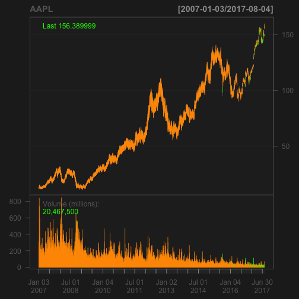

Financial Time Series
========================================================
author: Fabricio Dujardin 
date: 7/8/2017
autosize: true

========================================================

## Outline


* Introduction - reason & purpose of Shiny App
* Methodology - background of Shiny App
* Example - stock with "AAPL"


=====================
## Introduction

The purpose of this Shiny App is to deliver the time series of financial stocks found in AMEX, NYSE and NASDAQ. There are further improvements to be done to make it more complete and relevant for the investor. 

The relevant Shiny App can be found in the following link:

https://dujarfa.shinyapps.io/app-fabriciodujardin/

The relevant code for this Shiny App and the slidify (in slide folder) are in the following link:

https://github.com/dujar/app-FabricioDujardin

===================
## Methodology

I used all the stocks available from the "quantmod" package and put them in a list for input.


```r
library(quantmod)
library(data.table)
library(knitr)
allStocks <- data.table(stockSymbols())
kable(allStocks)
```


|Symbol    |Name                                                           |  LastSale|MarketCap  | IPOyear|Sector                |Industry                                                       |Exchange |
|:---------|:--------------------------------------------------------------|---------:|:----------|-------:|:---------------------|:--------------------------------------------------------------|:--------|
|AAMC      |Altisource Asset Management Corp                               |   87.0000|$135.24M   |      NA|Finance               |Real Estate                                                    |AMEX     |
|AAU       |Almaden Minerals, Ltd.                                         |    1.1084|$111M      |    2015|Basic Industries      |Precious Metals                                                |AMEX     |
|ABE       |Aberdeen Emerging Markets Smaller Company Opportunities Fund I |   14.1860|$134.55M   |      NA|NA                    |NA                                                             |AMEX     |
|ACU       |Acme United Corporation.                                       |   28.1100|$94.3M     |    1988|Capital Goods         |Industrial Machinery/Components                                |AMEX     |
|ACY       |AeroCentury Corp.                                              |   11.9000|$16.86M    |      NA|Technology            |Diversified Commercial Services                                |AMEX     |
|ADK       |Adcare Health Systems Inc                                      |    1.0600|$21.07M    |      NA|Health Care           |Hospital/Nursing Management                                    |AMEX     |
|ADK-PA    |Adcare Health Systems Inc                                      |   22.6500|NA         |      NA|NA                    |NA                                                             |AMEX     |
|AE        |Adams Resources & Energy, Inc.                                 |   38.0000|$160.27M   |      NA|Energy                |Oil Refining/Marketing                                         |AMEX     |
|AINC      |Ashford Inc.                                                   |   50.0000|$100.85M   |    2014|Consumer Services     |Professional Services                                          |AMEX     |
|AIRI      |Air Industries Group                                           |    1.3500|$17.31M    |      NA|Capital Goods         |Military/Government/Technical                                  |AMEX     |
|AKG       |Asanko Gold Inc.                                               |    0.8762|$178.26M   |      NA|Basic Industries      |Mining & Quarrying of Nonmetallic Minerals (No Fuels)          |AMEX     |
|ALN       |American Lorain Corporation                                    |    0.4260|$16.3M     |      NA|Consumer Non-Durables |Packaged Foods                                                 |AMEX     |
|ALO       |Alio Gold Inc.                                                 |    3.8500|$167.96M   |    2011|Basic Industries      |Precious Metals                                                |AMEX     |
|AMPE      |Ampio Pharmaceuticals, Inc.                                    |    0.5200|$35.48M    |      NA|Health Care           |Major Pharmaceuticals                                          |AMEX     |
|AMS       |American Shared Hospital Services                              |    3.4000|$19.4M     |      NA|Health Care           |Medical Specialities                                           |AMEX     |
|APHB      |AmpliPhi Biosciences Corporation                               |    0.8602|$7.53M     |      NA|Health Care           |Biotechnology: Biological Products (No Diagnostic Substances)  |AMEX     |
|APT       |Alpha Pro Tech, Ltd.                                           |    3.4500|$51.92M    |      NA|Health Care           |Industrial Specialties                                         |AMEX     |
|ARNC-P    |Arconic Inc.                                                   |   90.0000|NA         |      NA|NA                    |NA                                                             |AMEX     |
|ASM       |Avino Silver                                                   |    1.6800|$88.12M    |      NA|Basic Industries      |Precious Metals                                                |AMEX     |
|AST       |Asterias Biotherapeutics, Inc.                                 |    3.3000|$162.57M   |      NA|Health Care           |Biotechnology: Biological Products (No Diagnostic Substances)  |AMEX     |
|ATEST     |NASDAQ TEST STOCK                                              |   24.8000|NA         |      NA|NA                    |NA                                                             |AMEX     |
|ATNM      |Actinium Pharmaceuticals, Inc.                                 |    0.6650|$53.17M    |      NA|Health Care           |Major Pharmaceuticals                                          |AMEX     |
|AUG       |Auryn Resources Inc.                                           |    2.6900|$206.79M   |      NA|Basic Industries      |Precious Metals                                                |AMEX     |
|AUMN      |Golden Minerals Company                                        |    0.5250|$47.27M    |      NA|Basic Industries      |Precious Metals                                                |AMEX     |
|AUXO      |Auxilio, Inc.                                                  |    4.6600|$43.75M    |    2017|Miscellaneous         |Business Services                                              |AMEX     |
|AWX       |Avalon Holdings Corporation                                    |    2.2500|$8.56M     |      NA|Public Utilities      |Environmental Services                                         |AMEX     |
|AXN       |Aoxing Pharmaceutical Company, Inc.                            |    0.2900|$22.1M     |      NA|Health Care           |Major Pharmaceuticals                                          |AMEX     |
|AXU       |Alexco Resource Corp                                           |    1.3300|$134.55M   |      NA|Basic Industries      |Precious Metals                                                |AMEX     |
|BAA       |BANRO CORPORATION                                              |    0.3792|$41.62M    |      NA|Basic Industries      |Precious Metals                                                |AMEX     |
|BCV       |Bancroft Fund Limited                                          |   22.0300|$115.66M   |      NA|NA                    |NA                                                             |AMEX     |
|BCV-PA    |Bancroft Fund Limited                                          |   25.6500|NA         |      NA|NA                    |NA                                                             |AMEX     |
|BDL       |Flanigan&#39;s Enterprises, Inc.                               |   27.3750|$50.88M    |      NA|Consumer Services     |Restaurants                                                    |AMEX     |
|BDR       |Blonder Tongue Laboratories, Inc.                              |    0.5995|$4.87M     |      NA|Technology            |Radio And Television Broadcasting And Communications Equipment |AMEX     |
|BFY       |BlackRock New York Municipal Income Trust II                   |   15.4800|$77.47M    |    2002|NA                    |NA                                                             |AMEX     |
|BGI       |Birks Group Inc.                                               |    1.3400|$24.07M    |      NA|Consumer Services     |Consumer Specialties                                           |AMEX     |
|BGSF      |BG Staffing Inc                                                |   16.1500|$141.46M   |      NA|Technology            |Professional Services                                          |AMEX     |
|BHB       |Bar Harbor Bankshares, Inc.                                    |   27.2100|$419.22M   |      NA|Finance               |Major Banks                                                    |AMEX     |
|BHV       |BlackRock Virginia Municipal Bond Trust                        |   17.9490|$28.67M    |    2002|NA                    |NA                                                             |AMEX     |
|BKJ       |Bancorp of New Jersey, Inc                                     |   17.2750|$115.32M   |      NA|Finance               |Major Banks                                                    |AMEX     |
|BLE       |BlackRock Municipal Income Trust II                            |   15.7600|$370.37M   |    2002|NA                    |NA                                                             |AMEX     |
|BLJ       |Blackrock New Jersey Municipal Bond Trust                      |   15.1364|$35.22M    |    2002|NA                    |NA                                                             |AMEX     |
|BPMX      |BioPharmX Corporation                                          |    0.3000|$22.24M    |    2015|Health Care           |Major Pharmaceuticals                                          |AMEX     |
|BRG       |Bluerock Residential Growth REIT, Inc.                         |   11.2600|$272.39M   |    2014|Consumer Services     |Real Estate Investment Trusts                                  |AMEX     |
|BRG-PA    |Bluerock Residential Growth REIT, Inc.                         |   26.4700|NA         |      NA|NA                    |NA                                                             |AMEX     |
|BRG-PC    |Bluerock Residential Growth REIT, Inc.                         |   26.2000|NA         |      NA|NA                    |NA                                                             |AMEX     |
|BRG-PD    |Bluerock Residential Growth REIT, Inc.                         |   25.2500|NA         |      NA|NA                    |NA                                                             |AMEX     |
|BRN       |Barnwell Industries, Inc.                                      |    1.8200|$15.06M    |      NA|Energy                |Oil & Gas Production                                           |AMEX     |
|BTG       |B2Gold Corp                                                    |    2.3500|$2.3B      |      NA|Basic Industries      |Precious Metals                                                |AMEX     |
|BTN       |Ballantyne Strong, Inc                                         |    6.5028|$92.68M    |      NA|Miscellaneous         |Industrial Machinery/Components                                |AMEX     |
|BTU-P     |Peabody Energy Corporation                                     |   58.0000|NA         |      NA|NA                    |NA                                                             |AMEX     |
|BTX       |BioTime, Inc.                                                  |    2.7900|$309.34M   |      NA|Health Care           |Biotechnology: Biological Products (No Diagnostic Substances)  |AMEX     |
|BVX       |Bovie Medical Corporation                                      |    2.5800|$79.62M    |      NA|Health Care           |Medical/Dental Instruments                                     |AMEX     |
|BZM       |BlackRock Maryland Municipal Bond Trust                        |   14.7900|$30.75M    |    2002|NA                    |NA                                                             |AMEX     |
|CANF      |Can-Fite Biopharma Ltd                                         |    1.7200|$28.13M    |      NA|Health Care           |Major Pharmaceuticals                                          |AMEX     |
|CAW       |CCA Industries, Inc.                                           |    3.5500|$24.87M    |      NA|Consumer Non-Durables |Package Goods/Cosmetics                                        |AMEX     |
|CCA       |MFS California Insured Municipal Trust                         |   12.1110|$33.74M    |    1999|NA                    |NA                                                             |AMEX     |
|CCF       |Chase Corporation                                              |   97.4500|$912.55M   |      NA|Consumer Durables     |Building Products                                              |AMEX     |
|CDOR      |Condor Hospitality Trust, Inc.                                 |   10.6700|$123.29M   |      NA|Consumer Services     |Real Estate Investment Trusts                                  |AMEX     |
|CEF       |Central Fund of Canada Limited                                 |   12.3000|$3.1B      |      NA|NA                    |NA                                                             |AMEX     |
|CEI       |Camber Energy, Inc.                                            |    0.2200|$7.52M     |      NA|Energy                |Oil & Gas Production                                           |AMEX     |
|CET       |Central Securities Corporation                                 |   25.2400|$628.01M   |      NA|NA                    |NA                                                             |AMEX     |
|CEV       |Eaton Vance California Municipal Income Trust                  |   12.8800|$93.44M    |    1999|NA                    |NA                                                             |AMEX     |
|CH        |Aberdeen Chile Fund, Inc.                                      |    7.6201|$71.31M    |      NA|NA                    |NA                                                             |AMEX     |
|CIK       |Credit Suisse Asset Management Income Fund, Inc.               |    3.4100|$178.31M   |      NA|NA                    |NA                                                             |AMEX     |
|CIX       |CompX International Inc.                                       |   15.6000|$193.74M   |    1998|Capital Goods         |Industrial Machinery/Components                                |AMEX     |
|CKX       |CKX Lands, Inc.                                                |   11.6500|$22.63M    |      NA|Energy                |Oil & Gas Production                                           |AMEX     |
|CLM       |Cornerstone Strategic Value Fund, Inc.                         |   14.7600|$423.57M   |    1987|NA                    |NA                                                             |AMEX     |
|CMCL      |Caledonia Mining Corporation Plc                               |    6.3500|$67.04M    |      NA|Basic Industries      |Precious Metals                                                |AMEX     |
|CMT       |Core Molding Technologies Inc                                  |   22.0100|$171.51M   |      NA|Consumer Non-Durables |Plastic Products                                               |AMEX     |
|CPHI      |China Pharma Holdings, Inc.                                    |    0.1853|$8.08M     |      NA|Health Care           |Major Pharmaceuticals                                          |AMEX     |
|CQH       |Cheniere Energy Partners LP Holdings, LLC                      |   26.2800|$6.09B     |    2013|Public Utilities      |Oil/Gas Transmission                                           |AMEX     |
|CQP       |Cheniere Energy Partners, LP                                   |   29.2000|$9.86B     |    2007|Public Utilities      |Oil/Gas Transmission                                           |AMEX     |
|CRF       |Cornerstone Strategic Return Fund, Inc. (The)                  |   14.4700|$189.05M   |      NA|NA                    |NA                                                             |AMEX     |
|CRHM      |CRH Medical Corporation                                        |    2.4500|$181.33M   |    2015|Health Care           |Medical/Dental Instruments                                     |AMEX     |
|CRMD      |CorMedix Inc                                                   |    0.3597|$21.34M    |      NA|Health Care           |Major Pharmaceuticals                                          |AMEX     |
|CRVP      |Crystal Rock Holdings, Inc.                                    |    0.7800|$16.66M    |      NA|Consumer Non-Durables |Food Distributors                                              |AMEX     |
|CTO       |Consolidated-Tomoka Land Co.                                   |   55.0000|$309.26M   |      NA|Finance               |Real Estate                                                    |AMEX     |
|CUO       |Continental Materials Corporation                              |   22.4500|$37.76M    |      NA|Capital Goods         |Building Materials                                             |AMEX     |
|CVM       |Cel-Sci Corporation                                            |    2.3691|$21.84M    |      NA|Health Care           |Biotechnology: Biological Products (No Diagnostic Substances)  |AMEX     |
|CVR       |Chicago Rivet & Machine Co.                                    |   36.5000|$35.26M    |      NA|Technology            |Industrial Machinery/Components                                |AMEX     |
|CVRS      |Corindus Vascular Robotics, Inc.                               |    1.7400|$325.52M   |    2015|Health Care           |Medical/Dental Instruments                                     |AMEX     |
|CVU       |CPI Aerostructures, Inc.                                       |    9.4000|$83.03M    |      NA|Capital Goods         |Military/Government/Technical                                  |AMEX     |
|DGSE      |DGSE Companies, Inc.                                           |    1.6100|$43.32M    |      NA|Consumer Services     |Consumer Specialties                                           |AMEX     |
|DHY       |Credit Suisse High Yield Bond Fund                             |    2.8600|$286.13M   |    1998|NA                    |NA                                                             |AMEX     |
|DIT       |AMCON Distributing Company                                     |   92.3000|$62.67M    |      NA|Consumer Non-Durables |Food Distributors                                              |AMEX     |
|DLA       |Delta Apparel, Inc.                                            |   19.9100|$149.1M    |      NA|Consumer Non-Durables |Apparel                                                        |AMEX     |
|DMF       |Dreyfus Municipal Income, Inc.                                 |    9.2400|$191.7M    |    1988|NA                    |NA                                                             |AMEX     |
|DNN       |Denison Mine Corp                                              |    0.4663|$260.7M    |      NA|Basic Industries      |Precious Metals                                                |AMEX     |
|DPW       |Digital Power Corporation                                      |    0.6300|$8.32M     |      NA|Capital Goods         |Industrial Machinery/Components                                |AMEX     |
|DSS       |Document Security Systems, Inc.                                |    0.7313|$10.01M    |      NA|Consumer Durables     |Containers/Packaging                                           |AMEX     |
|DXR       |Daxor Corporation                                              |    6.0803|$23.1M     |      NA|Health Care           |Medical/Dental Instruments                                     |AMEX     |
|EAD       |Wells Fargo Income Opportunities Fund                          |    8.7400|$616.34M   |    2003|NA                    |NA                                                             |AMEX     |
|ECF       |Ellsworth Growth and Income Fund Ltd.                          |    9.2799|$119.49M   |    1986|NA                    |NA                                                             |AMEX     |
|EGI       |Entree Resources Ltd.                                          |    0.4824|$83.41M    |    2017|Basic Industries      |Precious Metals                                                |AMEX     |
|EIA       |Eaton Vance California Municipal Bond Fund II                  |   12.2500|$47.61M    |    2002|NA                    |NA                                                             |AMEX     |
|EIM       |Eaton Vance Municipal Bond Fund                                |   12.8700|$877.33M   |    2002|NA                    |NA                                                             |AMEX     |
|EIO       |Eaton Vance Ohio Municipal Bond Fund                           |   13.3306|$33.83M    |    2002|NA                    |NA                                                             |AMEX     |
|EIP       |Eaton Vance Pennsylvania Municipal Bond Fund                   |   13.0336|$38.58M    |    2002|NA                    |NA                                                             |AMEX     |
|EIV       |Eaton Vance Municipal Bond Fund II                             |   12.6900|$127.07M   |    2002|NA                    |NA                                                             |AMEX     |
|ELLO      |Ellomay Capital Ltd.                                           |    8.8800|$94.82M    |      NA|Public Utilities      |Electric Utilities: Central                                    |AMEX     |
|ELMD      |Electromed, Inc.                                               |    6.2600|$51.52M    |    2011|Health Care           |Biotechnology: Electromedical & Electrotherapeutic Apparatus   |AMEX     |
|EMAN      |eMagin Corporation                                             |    2.6000|$90.88M    |      NA|Technology            |Semiconductors                                                 |AMEX     |
|EMI       |Eaton Vance Michigan Municipal Income Trust                    |   13.7400|$27.66M    |    1999|NA                    |NA                                                             |AMEX     |
|EMJ       |Eaton Vance New Jersey Municipal Bond Fund                     |   13.2600|$34.2M     |    2002|NA                    |NA                                                             |AMEX     |
|EMX       |EMX Royalty Corporation                                        |    1.0000|$79.48M    |      NA|Basic Industries      |Precious Metals                                                |AMEX     |
|ENRJ      |EnerJex Resources, Inc.                                        |    0.3110|$3.05M     |      NA|Energy                |Oil & Gas Production                                           |AMEX     |
|ENSV      |ENSERVCO Corporation                                           |    0.3575|$18.26M    |      NA|Energy                |Oilfield Services/Equipment                                    |AMEX     |
|ENX       |Eaton Vance New York Municipal Bond Fund                       |   12.7400|$199.53M   |    2002|NA                    |NA                                                             |AMEX     |
|EPM       |Evolution Petroleum Corporation, Inc.                          |    8.2000|$271.11M   |      NA|Energy                |Oil & Gas Production                                           |AMEX     |
|ERC       |Wells Fargo Multi-Sector Income Fund                           |   13.5300|$472.73M   |    2003|NA                    |NA                                                             |AMEX     |
|ERH       |Wells Fargo Utilities and High Income Fund                     |   13.3625|$123.53M   |    2004|NA                    |NA                                                             |AMEX     |
|ERN       |Erin Energy Corp.                                              |    2.3500|$501.51M   |      NA|Energy                |Oil & Gas Production                                           |AMEX     |
|ESNC      |EnSync, Inc.                                                   |    0.3950|$18.96M    |      NA|Public Utilities      |Electric Utilities: Central                                    |AMEX     |
|ESP       |Espey Mfg. & Electronics Corp.                                 |   22.9300|$54.37M    |      NA|Capital Goods         |Industrial Machinery/Components                                |AMEX     |
|EVBN      |Evans Bancorp, Inc.                                            |   41.2500|$196.64M   |      NA|Finance               |Major Banks                                                    |AMEX     |
|EVI       |EnviroStarm, Inc.                                              |   27.7500|$287.74M   |      NA|Consumer Services     |Other Consumer Services                                        |AMEX     |
|EVJ       |Eaton Vance New Jersey Municipal Income Trust                  |   12.2800|$56.47M    |    1999|NA                    |NA                                                             |AMEX     |
|EVM       |Eaton Vance California Municipal Bond Fund                     |   11.9790|$256.28M   |    2002|NA                    |NA                                                             |AMEX     |
|EVO       |Eaton Vance Ohio Municipal Income Trust                        |   13.7600|$39.31M    |    1999|NA                    |NA                                                             |AMEX     |
|EVP       |Eaton Vance Pennsylvania Municipal Income Trust                |   12.2500|$31.86M    |    1999|NA                    |NA                                                             |AMEX     |
|EVV       |Eaton Vance Limited Duration Income Fund                       |   14.2700|$1.66B     |    2003|NA                    |NA                                                             |AMEX     |
|EVY       |Eaton Vance New York Municipal Income Trust                    |   13.3000|$72.83M    |    1999|NA                    |NA                                                             |AMEX     |
|FAX       |Aberdeen Asia-Pacific Income Fund Inc                          |    5.1900|$1.31B     |    1986|NA                    |NA                                                             |AMEX     |
|FCO       |Aberdeen Global Income Fund, Inc.                              |    8.8500|$77.21M    |    1992|NA                    |NA                                                             |AMEX     |
|FEN       |First Trust Energy Income and Growth Fund                      |   25.3100|$490.48M   |    2004|NA                    |NA                                                             |AMEX     |
|FPP       |FieldPoint Petroleum Corporation                               |    0.2901|$3.1M      |      NA|Energy                |Oil & Gas Production                                           |AMEX     |
|FRD       |Friedman Industries Inc.                                       |    5.4100|$37.92M    |      NA|Capital Goods         |Steel/Iron Ore                                                 |AMEX     |
|FSI       |Flexible Solutions International Inc.                          |    1.9600|$22.46M    |      NA|Basic Industries      |Major Chemicals                                                |AMEX     |
|FSP       |Franklin Street Properties Corp.                               |   10.3900|$1.11B     |      NA|Consumer Services     |Real Estate Investment Trusts                                  |AMEX     |
|FTF       |Franklin Limited Duration Income Trust                         |   11.8700|$268.31M   |    2003|NA                    |NA                                                             |AMEX     |
|GBR       |New Concept Energy, Inc                                        |    1.4500|$2.82M     |      NA|Energy                |Oil & Gas Production                                           |AMEX     |
|GDP       |Goodrich Petroleum Corporation                                 |   11.7500|$107.03M   |    2017|Energy                |Oil & Gas Production                                           |AMEX     |
|GGN       |GAMCO Global Gold, Natural Reources & Income Trust             |    5.5200|$742.24M   |    2005|NA                    |NA                                                             |AMEX     |
|GGN-PB    |GAMCO Global Gold, Natural Reources & Income Trust             |   24.0700|NA         |      NA|NA                    |NA                                                             |AMEX     |
|GGO       |The Gabelli Go Anywhere Trust                                  |   16.7000|$26.89M    |    2016|NA                    |NA                                                             |AMEX     |
|GGO-PA    |The Gabelli Go Anywhere Trust                                  |   44.5000|NA         |      NA|NA                    |NA                                                             |AMEX     |
|GLO       |Clough Global Opportunities Fund                               |   11.2200|$578.49M   |    2006|NA                    |NA                                                             |AMEX     |
|GLOW      |Glowpoint, Inc.                                                |    0.3110|$11.24M    |      NA|Public Utilities      |Telecommunications Equipment                                   |AMEX     |
|GLQ       |Clough Global Equity Fund                                      |   13.4200|$236.74M   |    2005|NA                    |NA                                                             |AMEX     |
|GLU       |The Gabelli Global Utility and Income Trust                    |   21.0013|$86.34M    |    2004|NA                    |NA                                                             |AMEX     |
|GLU-PA    |The Gabelli Global Utility and Income Trust                    |   50.9000|NA         |      NA|NA                    |NA                                                             |AMEX     |
|GLV       |Clough Global Dividend and Income Fund                         |   13.9200|$144.49M   |    2004|NA                    |NA                                                             |AMEX     |
|GMO       |General Moly, Inc                                              |    0.4350|$39.56M    |      NA|Basic Industries      |Precious Metals                                                |AMEX     |
|GORO      |Gold Resource Corporation                                      |    3.5600|$202.35M   |      NA|Basic Industries      |Precious Metals                                                |AMEX     |
|GPL       |Great Panther Silver Limited                                   |    1.2800|$214.96M   |      NA|Basic Industries      |Precious Metals                                                |AMEX     |
|GRF       |Eagle Capital Growth Fund, Inc.                                |    8.0100|$28.75M    |      NA|NA                    |NA                                                             |AMEX     |
|GSAT      |Globalstar, Inc.                                               |    1.9400|$2.21B     |    2006|Consumer Services     |Telecommunications Equipment                                   |AMEX     |
|GSB       |GlobalSCAPE, Inc.                                              |    4.6000|$99.23M    |      NA|Technology            |Computer Software: Prepackaged Software                        |AMEX     |
|GSS       |Golden Star Resources, Ltd                                     |    0.6800|$255.81M   |      NA|Basic Industries      |Precious Metals                                                |AMEX     |
|GST       |Gastar Exploration Inc.                                        |    0.5631|$119.32M   |      NA|Energy                |Oil & Gas Production                                           |AMEX     |
|GST-PA    |Gastar Exploration Inc.                                        |   11.7200|NA         |      NA|NA                    |NA                                                             |AMEX     |
|GST-PB    |Gastar Exploration Inc.                                        |   14.2000|NA         |      NA|NA                    |NA                                                             |AMEX     |
|GSV       |Gold Standard Ventures Corporation                             |    1.6600|$386.46M   |      NA|Basic Industries      |Mining & Quarrying of Nonmetallic Minerals (No Fuels)          |AMEX     |
|GTE       |Gran Tierra Energy Inc.                                        |    2.2700|$877.9M    |      NA|Energy                |Oil & Gas Production                                           |AMEX     |
|GV        |Goldfield Corporation (The)                                    |    5.1500|$131.07M   |      NA|Basic Industries      |Water Supply                                                   |AMEX     |
|GVP       |GSE Systems, Inc.                                              |    2.7750|$53.24M    |      NA|Technology            |Computer Software: Prepackaged Software                        |AMEX     |
|HCAC      |Hennessy Capital Acquisition Corp. III                         |    9.8200|NA         |    2017|Finance               |Business Services                                              |AMEX     |
|HEB       |Hemispherx BioPharma, Inc.                                     |    0.4000|$11.67M    |      NA|Health Care           |Biotechnology: Biological Products (No Diagnostic Substances)  |AMEX     |
|HLM-P     |Hillman Group Capital Trust                                    |   33.6100|NA         |      NA|NA                    |NA                                                             |AMEX     |
|HLTH      |Nobilis Health Corp.                                           |    1.6500|$128.38M   |    2015|Health Care           |Hospital/Nursing Management                                    |AMEX     |
|HMG       |HMG/Courtland Properties, Inc.                                 |   11.9400|$11.97M    |      NA|Consumer Services     |Real Estate Investment Trusts                                  |AMEX     |
|HNW       |Pioneer Diversified High Income Trust                          |   16.5900|$138.24M   |    2007|NA                    |NA                                                             |AMEX     |
|HTM       |U.S. Geothermal Inc.                                           |    4.2600|$81.11M    |      NA|Public Utilities      |Electric Utilities: Central                                    |AMEX     |
|HUSA      |Houston American Energy Corporation                            |    0.5600|$28.72M    |      NA|Energy                |Oil & Gas Production                                           |AMEX     |
|IAF       |Aberdeen Australia Equity Fund Inc                             |    6.2400|$141.91M   |      NA|NA                    |NA                                                             |AMEX     |
|IBIO      |iBio, Inc.                                                     |    0.3399|$31.14M    |      NA|Health Care           |Major Pharmaceuticals                                          |AMEX     |
|IBO       |IBO (Listing Market - NYSE Amex Network B F)                   |  153.8200|NA         |      NA|NA                    |NA                                                             |AMEX     |
|IDN       |Intellicheck, Inc.                                             |    2.4500|$26.34M    |    1999|Technology            |Computer Software: Prepackaged Software                        |AMEX     |
|IEC       |IEC Electronics Corp.                                          |    4.1400|$42.71M    |      NA|Technology            |Electrical Products                                            |AMEX     |
|IF        |Aberdeen Indonesia Fund, Inc.                                  |    7.6422|$71.11M    |    1990|NA                    |NA                                                             |AMEX     |
|IFMI      |Institutional Financial Markets, Inc.                          |    1.1600|$14.73M    |      NA|Finance               |Investment Bankers/Brokers/Service                             |AMEX     |
|IGC       |India Globalization Capital Inc.                               |    0.4100|$12.53M    |      NA|Consumer Non-Durables |Electronic Components                                          |AMEX     |
|IHT       |InnSuites Hospitality Trust                                    |    2.0000|$19.56M    |      NA|Consumer Services     |Real Estate Investment Trusts                                  |AMEX     |
|IMH       |Impac Mortgage Holdings, Inc.                                  |   14.7400|$307.81M   |    1997|Consumer Services     |Real Estate Investment Trusts                                  |AMEX     |
|IMO       |Imperial Oil Limited                                           |   29.1900|$24.65B    |      NA|Energy                |Integrated oil Companies                                       |AMEX     |
|IMUC      |ImmunoCellular Therapeutics, Ltd.                              |    0.3353|$3.47M     |      NA|Health Care           |Major Pharmaceuticals                                          |AMEX     |
|INFU      |InfuSystems Holdings, Inc.                                     |    1.8500|$42.1M     |      NA|Health Care           |Medical/Dental Instruments                                     |AMEX     |
|INS       |Intelligent Systems Corporation                                |    3.8701|$33.84M    |    1992|Technology            |Computer Software: Prepackaged Software                        |AMEX     |
|INTT      |inTest Corporation                                             |    7.1000|$73.85M    |    1997|Capital Goods         |Electrical Products                                            |AMEX     |
|INUV      |Inuvo, Inc                                                     |    1.1400|$32.54M    |      NA|Consumer Services     |Advertising                                                    |AMEX     |
|IOR       |Income Opportunity Realty Investors, Inc.                      |   10.2000|$42.52M    |      NA|Consumer Services     |Real Estate Investment Trusts                                  |AMEX     |
|IPB       |Merrill Lynch & Co., Inc.                                      |   27.5000|NA         |      NA|Finance               |Finance: Consumer Services                                     |AMEX     |
|ISDR      |Issuer Direct Corporation                                      |   12.5000|$36.62M    |      NA|Miscellaneous         |Publishing                                                     |AMEX     |
|ISL       |Aberdeen Israel Fund, Inc.                                     |   18.7000|$74.76M    |    1992|NA                    |NA                                                             |AMEX     |
|ISR       |IsoRay, Inc.                                                   |    0.5950|$32.74M    |      NA|Health Care           |Medical/Dental Instruments                                     |AMEX     |
|JOB       |GEE Group Inc.                                                 |    5.1500|$50.88M    |      NA|Technology            |Diversified Commercial Services                                |AMEX     |
|JRJR      |JRjr33, Inc.                                                   |    0.6510|$25.64M    |    2014|Consumer Services     |Other Consumer Services                                        |AMEX     |
|KIQ       |Kelso Technologies Inc                                         |    0.7200|$33.78M    |      NA|Capital Goods         |Railroads                                                      |AMEX     |
|KLDX      |Klondex Mines Ltd.                                             |    2.9000|$514.78M   |      NA|Basic Industries      |Precious Metals                                                |AMEX     |
|LAQ       |Latin America Equity Fund, Inc. (The)                          |   25.6200|$190.83M   |    1991|NA                    |NA                                                             |AMEX     |
|LBY       |Libbey, Inc.                                                   |    8.5400|$187.41M   |    1993|Capital Goods         |Industrial Machinery/Components                                |AMEX     |
|LEU       |Centrus Energy Corp.                                           |    4.1800|$37.62M    |    2014|Basic Industries      |Mining & Quarrying of Nonmetallic Minerals (No Fuels)          |AMEX     |
|LGL       |LGL Group, Inc. (The)                                          |    4.5872|$12.27M    |      NA|Capital Goods         |Industrial Machinery/Components                                |AMEX     |
|LIQT      |LiqTech International, Inc.                                    |    0.3592|$15.89M    |      NA|Technology            |Industrial Machinery/Components                                |AMEX     |
|LLEX      |Lilis Energy, Inc.                                             |    3.8800|$195.63M   |      NA|Energy                |Oil & Gas Production                                           |AMEX     |
|LNG       |Cheniere Energy, Inc.                                          |   44.6800|$10.63B    |      NA|Public Utilities      |Oil/Gas Transmission                                           |AMEX     |
|LODE      |Comstock Mining, Inc.                                          |    0.1950|$40.96M    |      NA|Basic Industries      |Precious Metals                                                |AMEX     |
|LOV       |Spark Networks, Inc.                                           |    0.9150|$29.37M    |      NA|Miscellaneous         |Business Services                                              |AMEX     |
|LTS       |Ladenburg Thalmann Financial Services Inc                      |    2.2700|$444.65M   |      NA|Finance               |Investment Bankers/Brokers/Service                             |AMEX     |
|LTS-PA    |Ladenburg Thalmann Financial Services Inc                      |   25.0000|NA         |      NA|NA                    |NA                                                             |AMEX     |
|MAB       |Eaton Vance Massachusetts Municipal Bond Fund                  |   13.9800|$24.72M    |    2002|NA                    |NA                                                             |AMEX     |
|MAG       |MAG Silver Corporation                                         |   12.2400|$988.62M   |      NA|Basic Industries      |Precious Metals                                                |AMEX     |
|MCF       |Contango Oil & Gas Company                                     |    5.9400|$151.9M    |      NA|Energy                |Oil & Gas Production                                           |AMEX     |
|MHE       |BlackRock Massachusetts Tax-Exempt Trust                       |   14.0400|$33.24M    |    1993|NA                    |NA                                                             |AMEX     |
|MHH       |Mastech Digital, Inc                                           |    9.4500|$50.61M    |      NA|Consumer Services     |Professional Services                                          |AMEX     |
|MICR      |Micron Solutions, Inc.                                         |    4.1000|$11.57M    |      NA|Health Care           |Biotechnology: Electromedical & Electrotherapeutic Apparatus   |AMEX     |
|MIW       |Eaton Vance Michigan Municipal Bond Fund                       |   13.9560|$20.93M    |    2002|NA                    |NA                                                             |AMEX     |
|MJCO      |Majesco                                                        |    4.8700|$177.89M   |    2015|Technology            |Computer Software: Prepackaged Software                        |AMEX     |
|MLSS      |Milestone Scientific, Inc.                                     |    1.2500|$40.47M    |    2015|Health Care           |Industrial Specialties                                         |AMEX     |
|MMV       |Eaton Vance Massachusetts Municipal Income Trust               |   13.7199|$37.55M    |    1999|NA                    |NA                                                             |AMEX     |
|MOC       |Command Security Corporation                                   |    3.1709|$31.05M    |      NA|Consumer Services     |Diversified Commercial Services                                |AMEX     |
|MSN       |Emerson Radio Corporation                                      |    1.2900|$34.85M    |      NA|Consumer Non-Durables |Consumer Electronics/Appliances                                |AMEX     |
|MTNB      |Matinas Biopharma Holdings, Inc.                               |    1.1600|$106.02M   |    2017|Health Care           |Major Pharmaceuticals                                          |AMEX     |
|MVF       |MuniVest Fund, Inc.                                            |    9.9200|$639.82M   |      NA|NA                    |NA                                                             |AMEX     |
|MXC       |Mexco Energy Corporation                                       |    5.7500|$11.71M    |      NA|Energy                |Oil & Gas Production                                           |AMEX     |
|MYO       |Myomo Inc.                                                     |    8.6900|NA         |    2017|Health Care           |Industrial Specialties                                         |AMEX     |
|MZA       |MuniYield Arizona Fund, Inc.                                   |   16.4805|$76.11M    |    1993|NA                    |NA                                                             |AMEX     |
|NAK       |Northern Dynasty Minerals, Ltd.                                |    1.4050|$426.99M   |      NA|Basic Industries      |Precious Metals                                                |AMEX     |
|NAVB      |Navidea Biopharmaceuticals, Inc.                               |    0.4352|$70.46M    |      NA|Health Care           |Biotechnology: In Vitro & In Vivo Diagnostic Substances        |AMEX     |
|NBH       |Neuberger Berman Intermediate Municipal Fund Inc.              |   15.4910|$291.21M   |    2002|NA                    |NA                                                             |AMEX     |
|NBO       |Neuberger Berman New York Intermediate Municipal Fund Inc.     |   12.9600|$65.8M     |    2002|NA                    |NA                                                             |AMEX     |
|NBW       |Neuberger Berman California Intermediate Municipal Fund Inc.   |   14.4900|$80.43M    |    2002|NA                    |NA                                                             |AMEX     |
|NBY       |NovaBay Pharmaceuticals, Inc.                                  |    4.7000|$71.95M    |    2007|Health Care           |Major Pharmaceuticals                                          |AMEX     |
|NEN       |New England Realty Associates Limited Partnership              |   71.8100|$267.96M   |      NA|Consumer Services     |Building operators                                             |AMEX     |
|NG        |Novagold Resources Inc.                                        |    4.1900|$1.35B     |      NA|Basic Industries      |Precious Metals                                                |AMEX     |
|NGD       |New Gold Inc.                                                  |    3.3500|$1.93B     |      NA|Basic Industries      |Precious Metals                                                |AMEX     |
|NHC       |National HealthCare Corporation                                |   63.3900|$963.21M   |      NA|Health Care           |Hospital/Nursing Management                                    |AMEX     |
|NHS       |Neuberger Berman High Yield Strategies Fund                    |   12.1300|$237.03M   |      NA|NA                    |NA                                                             |AMEX     |
|NJV       |Nuveen New Jersey Municipal Value Fund                         |   14.9700|$23.22M    |      NA|NA                    |NA                                                             |AMEX     |
|NML       |Neuberger Berman MLP Income Fund Inc.                          |    9.7000|$549.59M   |    2013|NA                    |NA                                                             |AMEX     |
|NNVC      |NanoViricides, Inc.                                            |    1.4000|$88.3M     |      NA|Health Care           |Biotechnology: Commercial Physical & Biological Resarch        |AMEX     |
|NOG       |Northern Oil and Gas, Inc.                                     |    1.2000|$75.99M    |      NA|Energy                |Oil & Gas Production                                           |AMEX     |
|NPN       |Nuveen Pennsylvania Municipal Value Fund                       |   15.6200|$19.08M    |    2009|NA                    |NA                                                             |AMEX     |
|NRO       |Neuberger Berman Real Estate Securities Income Fund, Inc.      |    5.5300|$262.23M   |    2003|NA                    |NA                                                             |AMEX     |
|NSPR      |InspireMD, Inc.                                                |    0.4499|$3.34M     |      NA|Health Care           |Medical/Dental Instruments                                     |AMEX     |
|NSU       |Nevsun Resources Ltd                                           |    2.6800|$809.29M   |      NA|Basic Industries      |Precious Metals                                                |AMEX     |
|NTIP      |Network-1 Technologies, Inc.                                   |    4.1500|$100.27M   |      NA|Technology            |Computer Software: Prepackaged Software                        |AMEX     |
|NTN       |NTN Buzztime, Inc.                                             |    7.1100|$17.87M    |      NA|Consumer Services     |Broadcasting                                                   |AMEX     |
|NXE       |Nexgen Energy Ltd.                                             |    2.4300|$821.96M   |      NA|Basic Industries      |Precious Metals                                                |AMEX     |
|NYH       |Eaton Vance New York Municipal Bond Fund II                    |   12.1000|$30.93M    |    2002|NA                    |NA                                                             |AMEX     |
|OCX       |OncoCyte Corporation                                           |    4.4500|$139.34M   |    2015|Health Care           |Biotechnology: In Vitro & In Vivo Diagnostic Substances        |AMEX     |
|OGEN      |Oragenics, Inc.                                                |    0.3700|$20.46M    |      NA|Health Care           |Major Pharmaceuticals                                          |AMEX     |
|ONP       |Orient Paper, Inc.                                             |    0.9001|$19.31M    |      NA|Consumer Durables     |Containers/Packaging                                           |AMEX     |
|ORM       |Owens Realty Mortgage, Inc.                                    |   17.0000|$174.21M   |    2013|Consumer Services     |Real Estate Investment Trusts                                  |AMEX     |
|PARR      |Par Pacific Holdings, Inc.                                     |   17.2700|$790.8M    |      NA|Energy                |Oil & Gas Production                                           |AMEX     |
|PCG-PA    |Pacific Gas & Electric Co.                                     |   31.5475|NA         |      NA|NA                    |NA                                                             |AMEX     |
|PCG-PB    |Pacific Gas & Electric Co.                                     |   29.7000|NA         |      NA|NA                    |NA                                                             |AMEX     |
|PCG-PC    |Pacific Gas & Electric Co.                                     |   27.3533|NA         |      NA|NA                    |NA                                                             |AMEX     |
|PCG-PD    |Pacific Gas & Electric Co.                                     |   26.2200|NA         |      NA|NA                    |NA                                                             |AMEX     |
|PCG-PE    |Pacific Gas & Electric Co.                                     |   26.2000|NA         |      NA|NA                    |NA                                                             |AMEX     |
|PCG-PG    |Pacific Gas & Electric Co.                                     |   26.4000|NA         |      NA|NA                    |NA                                                             |AMEX     |
|PCG-PH    |Pacific Gas & Electric Co.                                     |   25.8770|NA         |      NA|NA                    |NA                                                             |AMEX     |
|PCG-PI    |Pacific Gas & Electric Co.                                     |   25.3500|NA         |      NA|NA                    |NA                                                             |AMEX     |
|PED       |Pedevco Corp.                                                  |    0.6360|$3.49M     |      NA|Energy                |Oil & Gas Production                                           |AMEX     |
|PFNX      |Pfenex Inc.                                                    |    4.1500|$97.34M    |    2014|Health Care           |Major Pharmaceuticals                                          |AMEX     |
|PLG       |Platinum Group Metals Ltd.                                     |    0.5780|$85.82M    |      NA|Basic Industries      |Precious Metals                                                |AMEX     |
|PLM       |Polymet Mining Corp.                                           |    0.6548|$208.68M   |      NA|Basic Industries      |Precious Metals                                                |AMEX     |
|PLX       |Protalix BioTherapeutics, Inc.                                 |    0.6500|$82.22M    |      NA|Health Care           |Biotechnology: Biological Products (No Diagnostic Substances)  |AMEX     |
|PLYM      |Plymouth Industrial REIT, Inc.                                 |   17.5000|$63.47M    |    2017|Consumer Services     |Real Estate Investment Trusts                                  |AMEX     |
|PRK       |Park National Corporation                                      |   99.0700|$1.52B     |      NA|Finance               |Major Banks                                                    |AMEX     |
|PTN       |Palatin Technologies, Inc.                                     |    0.4200|$64.18M    |      NA|Health Care           |Major Pharmaceuticals                                          |AMEX     |
|PW        |Power REIT                                                     |    7.8500|$14.01M    |      NA|Consumer Services     |Real Estate Investment Trusts                                  |AMEX     |
|PW-PA     |Power REIT                                                     |   25.8050|NA         |      NA|NA                    |NA                                                             |AMEX     |
|PZG       |Paramount Gold Nevada Corp.                                    |    1.4599|$25.96M    |    2015|Basic Industries      |Precious Metals                                                |AMEX     |
|RCG       |RENN Fund, Inc.                                                |    1.3000|$5.8M      |      NA|NA                    |NA                                                             |AMEX     |
|REED      |Reeds, Inc.                                                    |    1.6000|$22.37M    |      NA|Consumer Non-Durables |Beverages (Production/Distribution)                            |AMEX     |
|REI       |Ring Energy, Inc.                                              |   13.2400|$716.89M   |      NA|Energy                |Oil & Gas Production                                           |AMEX     |
|RIF       |RMR Real Estate Income Fund                                    |   21.8900|$167.49M   |      NA|NA                    |NA                                                             |AMEX     |
|RLGT      |Radiant Logistics, Inc.                                        |    4.6400|$226.83M   |      NA|Transportation        |Oil Refining/Marketing                                         |AMEX     |
|RLGT-PA   |Radiant Logistics, Inc.                                        |   26.4500|NA         |      NA|NA                    |NA                                                             |AMEX     |
|RNN       |Rexahn Pharmaceuticals, Inc.                                   |    1.8400|$52.31M    |      NA|Health Care           |Major Pharmaceuticals                                          |AMEX     |
|ROX       |Castle Brands, Inc.                                            |    1.7900|$292.12M   |    2006|Consumer Non-Durables |Beverages (Production/Distribution)                            |AMEX     |
|RVP       |Retractable Technologies, Inc.                                 |    1.3372|$42.34M    |      NA|Health Care           |Medical/Dental Instruments                                     |AMEX     |
|RWC       |RELM Wireless Corporation                                      |    3.4000|$47.07M    |      NA|Technology            |Radio And Television Broadcasting And Communications Equipment |AMEX     |
|SACH      |Sachem Capital Corp.                                           |    4.9400|$54.85M    |    2017|Consumer Services     |Real Estate Investment Trusts                                  |AMEX     |
|SAND      |Sandstorm Gold Ltd                                             |    3.8700|$714.71M   |      NA|Basic Industries      |Precious Metals                                                |AMEX     |
|SBI       |Western Asset Intermediate Muni Fund Inc                       |    9.8899|$139.27M   |    1992|NA                    |NA                                                             |AMEX     |
|SCE-PB    |Southern California Edison Company                             |   24.5747|NA         |      NA|NA                    |NA                                                             |AMEX     |
|SCE-PC    |Southern California Edison Company                             |   25.0000|NA         |      NA|NA                    |NA                                                             |AMEX     |
|SCE-PD    |Southern California Edison Company                             |   25.2000|NA         |      NA|NA                    |NA                                                             |AMEX     |
|SCE-PE    |Southern California Edison Company                             |   25.6300|NA         |      NA|NA                    |NA                                                             |AMEX     |
|SDPI      |Superior Drilling Products, Inc.                               |    0.7400|$17.83M    |    2014|Energy                |Metal Fabrications                                             |AMEX     |
|SEB       |Seaboard Corporation                                           | 4372.2000|$5.12B     |    1996|Finance               |Investment Bankers/Brokers/Service                             |AMEX     |
|SENS      |Senseonics Holdings, Inc.                                      |    2.4100|$226.78M   |      NA|Capital Goods         |Industrial Machinery/Components                                |AMEX     |
|SGA       |Saga Communications, Inc.                                      |   40.5500|$239.59M   |      NA|Consumer Services     |Broadcasting                                                   |AMEX     |
|SGB       |Southwest Georgia Financial Corporation                        |   19.4000|$49.42M    |      NA|Finance               |Major Banks                                                    |AMEX     |
|SIF       |SIFCO Industries, Inc.                                         |    6.5050|$36.42M    |      NA|Capital Goods         |Aerospace                                                      |AMEX     |
|SIM       |Grupo Simec, S.A. de C.V.                                      |   10.7800|$1.79B     |    1993|Basic Industries      |Steel/Iron Ore                                                 |AMEX     |
|SKY       |Skyline Corporation                                            |    7.1200|$59.75M    |      NA|Basic Industries      |Homebuilding                                                   |AMEX     |
|SMTS      |Sierra Metals Inc.                                             |    2.3800|$387.18M   |      NA|Basic Industries      |Precious Metals                                                |AMEX     |
|SNMP      |Sanchez Midstream Partners LP                                  |   10.1500|$146.84M   |      NA|Energy                |Oil & Gas Production                                           |AMEX     |
|SRCI      |SRC Energy Inc.                                                |    8.4700|$1.7B      |      NA|Energy                |Oil & Gas Production                                           |AMEX     |
|SSN       |Samson Oil & Gas Limited                                       |    0.4400|$7.22M     |      NA|Energy                |Oil & Gas Production                                           |AMEX     |
|SSY       |SunLink Health Systems, Inc.                                   |    1.6099|$14.75M    |      NA|Health Care           |Hospital/Nursing Management                                    |AMEX     |
|STRP      |Straight Path Communications Inc.                              |  179.1600|$2.28B     |    2013|Public Utilities      |Telecommunications Equipment                                   |AMEX     |
|STS       |Supreme Industries, Inc.                                       |   15.1300|$259.57M   |      NA|Capital Goods         |Construction/Ag Equipment/Trucks                               |AMEX     |
|SVM       |Silvercorp Metals Inc.                                         |    2.8000|$470.1M    |      NA|Basic Industries      |Precious Metals                                                |AMEX     |
|SVT       |Servotronics, Inc.                                             |    9.5400|$23.22M    |      NA|Capital Goods         |Industrial Machinery/Components                                |AMEX     |
|SYN       |Synthetic Biologics, Inc                                       |    0.5980|$76.39M    |      NA|Health Care           |Major Pharmaceuticals                                          |AMEX     |
|TAT       |Transatlantic Petroleum Ltd                                    |    1.0200|$48.66M    |      NA|Energy                |Oil & Gas Production                                           |AMEX     |
|TEUM      |Pareteum Corporation                                           |    0.9745|$14.14M    |      NA|Technology            |EDP Services                                                   |AMEX     |
|TGB       |Taseko Mines Limited                                           |    1.5600|$352.92M   |      NA|Basic Industries      |Precious Metals                                                |AMEX     |
|TGC       |Tengasco, Inc.                                                 |    0.6918|$7.34M     |      NA|Energy                |Oil & Gas Production                                           |AMEX     |
|THM       |International Tower Hill Mines Ltd                             |    0.5000|$81.2M     |      NA|Basic Industries      |Precious Metals                                                |AMEX     |
|TIK       |Tel-Instrument Electronics Corp.                               |    3.8452|$12.52M    |      NA|Capital Goods         |Electrical Products                                            |AMEX     |
|TIS       |Orchids Paper Products Company                                 |   10.1300|$104.37M   |    2005|Basic Industries      |Paper                                                          |AMEX     |
|TKAT      |Takung Art Co., Ltd.                                           |    3.4500|$38.6M     |      NA|Consumer Services     |Other Specialty Stores                                         |AMEX     |
|TMP       |Tompkins Financial Corporation                                 |   77.9000|$1.18B     |      NA|Finance               |Major Banks                                                    |AMEX     |
|TMQ       |Trilogy Metals Inc.                                            |    1.2000|$126.67M   |      NA|Basic Industries      |Precious Metals                                                |AMEX     |
|TPHS      |Trinity Place Holdings Inc.                                    |    6.8700|$215.9M    |      NA|Consumer Services     |Building operators                                             |AMEX     |
|TRT       |Trio-Tech International                                        |    4.7300|$16.66M    |      NA|Technology            |Industrial Machinery/Components                                |AMEX     |
|TRX       |Tanzanian Royalty Exploration Corporation                      |    0.4002|$47.84M    |      NA|Basic Industries      |Precious Metals                                                |AMEX     |
|TRXC      |TransEnterix, Inc.                                             |    0.7284|$108.19M   |      NA|Health Care           |Medical/Dental Instruments                                     |AMEX     |
|TXMD      |TherapeuticsMD, Inc.                                           |    5.2000|$1.06B     |      NA|Health Care           |Major Pharmaceuticals                                          |AMEX     |
|UAMY      |United States Antimony Corporation                             |    0.3300|$22.17M    |      NA|Capital Goods         |Metal Fabrications                                             |AMEX     |
|UEC       |Uranium Energy Corp.                                           |    1.4600|$202.47M   |      NA|Basic Industries      |Precious Metals                                                |AMEX     |
|UFAB      |Unique Fabricating, Inc.                                       |    8.3000|$80.97M    |    2015|Capital Goods         |Auto Parts:O.E.M.                                              |AMEX     |
|UQM       |UQM TECHNOLOGIES INC                                           |    0.8800|$42.75M    |      NA|Capital Goods         |Industrial Machinery/Components                                |AMEX     |
|URG       |Ur Energy Inc                                                  |    0.6140|$89.57M    |      NA|Basic Industries      |Precious Metals                                                |AMEX     |
|USAS      |Americas Silver Corporation                                    |    2.9983|$119.66M   |    2017|Basic Industries      |Precious Metals                                                |AMEX     |
|UTG       |Reaves Utility Income Fund                                     |   35.5100|$1.22B     |    2004|NA                    |NA                                                             |AMEX     |
|UUU       |Universal Security Instruments, Inc.                           |    2.3500|$5.44M     |      NA|Consumer Non-Durables |Electronic Components                                          |AMEX     |
|UUUU      |Energy Fuels Inc                                               |    1.7400|$122.58M   |      NA|Basic Industries      |Mining & Quarrying of Nonmetallic Minerals (No Fuels)          |AMEX     |
|UWN       |Nevada Gold & Casinos, Inc.                                    |    2.3900|$40.24M    |      NA|Consumer Services     |Services-Misc. Amusement & Recreation                          |AMEX     |
|VCF       |Delaware Investments Colorado Municipal Income Fund, Inc       |   15.4355|$74.66M    |    1993|NA                    |NA                                                             |AMEX     |
|VFL       |Delaware Investments Florida Insured Municipal Income Fund     |   13.6400|$61.77M    |    1993|NA                    |NA                                                             |AMEX     |
|VGZ       |Vista Gold Corporation                                         |    0.8100|$79.54M    |      NA|Basic Industries      |Precious Metals                                                |AMEX     |
|VHC       |VirnetX Holding Corp                                           |    3.7000|$215.14M   |      NA|Miscellaneous         |Multi-Sector Companies                                         |AMEX     |
|VII       |Vicon Industries, Inc.                                         |    0.4001|$4.02M     |      NA|Consumer Durables     |Telecommunications Equipment                                   |AMEX     |
|VISI      |Volt Information Sciences, Inc.                                |    3.4500|$72.2M     |      NA|Technology            |Professional Services                                          |AMEX     |
|VKI       |Invesco Advantage Municipal Income Trust II                    |   11.6900|$518.94M   |      NA|NA                    |NA                                                             |AMEX     |
|VMM       |Delaware Investments Minnesota Municipal Income Fund II, Inc.  |   14.6000|$167.97M   |    1993|NA                    |NA                                                             |AMEX     |
|VNRX      |VolitionRX Limited                                             |    3.1050|$82.29M    |    2015|Health Care           |Biotechnology: In Vitro & In Vivo Diagnostic Substances        |AMEX     |
|VSR       |Versar, Inc.                                                   |    1.1400|$11.35M    |    1986|Consumer Services     |Military/Government/Technical                                  |AMEX     |
|WRN       |Western Copper and Gold Corporation                            |    1.1800|$113.82M   |    2011|Basic Industries      |Precious Metals                                                |AMEX     |
|WTT       |Wireless Telecom Group,  Inc.                                  |    1.4500|$32.32M    |      NA|Capital Goods         |Electrical Products                                            |AMEX     |
|WYY       |WidePoint Corporation                                          |    0.4492|$37.21M    |      NA|Technology            |EDP Services                                                   |AMEX     |
|XPL       |Solitario Zinc Corp.                                           |    0.8300|$48.51M    |      NA|Basic Industries      |Precious Metals                                                |AMEX     |
|XTNT      |Xtant Medical Holdings, Inc.                                   |    0.7895|$14.28M    |      NA|Health Care           |Biotechnology: Biological Products (No Diagnostic Substances)  |AMEX     |
|XXII      |22nd Century Group, Inc                                        |    2.4700|$224.51M   |      NA|Consumer Non-Durables |Farming/Seeds/Milling                                          |AMEX     |
|YUMA      |Yuma Energy, Inc.                                              |    1.4900|$18.71M    |      NA|Energy                |Oil & Gas Production                                           |AMEX     |
|ZDGE      |Zedge, Inc.                                                    |    1.8600|$17.94M    |    2016|Technology            |Computer Software: Prepackaged Software                        |AMEX     |
|AAAP      |Advanced Accelerator Applications S.A.                         |   49.1200|$2.16B     |    2015|Health Care           |Major Pharmaceuticals                                          |NASDAQ   |
|AABA      |Altaba Inc.                                                    |   58.5100|$52.35B    |      NA|Technology            |EDP Services                                                   |NASDAQ   |
|AAL       |American Airlines Group, Inc.                                  |   50.8000|$24.74B    |      NA|Transportation        |Air Freight/Delivery Services                                  |NASDAQ   |
|AAME      |Atlantic American Corporation                                  |    3.6000|$73.49M    |      NA|Finance               |Life Insurance                                                 |NASDAQ   |
|AAOI      |Applied Optoelectronics, Inc.                                  |   64.6000|$1.23B     |    2013|Technology            |Semiconductors                                                 |NASDAQ   |
|AAON      |AAON, Inc.                                                     |   35.2000|$1.85B     |      NA|Capital Goods         |Industrial Machinery/Components                                |NASDAQ   |
|AAPC      |Atlantic Alliance Partnership Corp.                            |   10.6000|$39.08M    |    2015|Consumer Services     |Services-Misc. Amusement & Recreation                          |NASDAQ   |
|AAPL      |Apple Inc.                                                     |  156.3900|$807.79B   |    1980|Technology            |Computer Manufacturing                                         |NASDAQ   |
|AAWW      |Atlas Air Worldwide Holdings                                   |   65.7000|$1.66B     |      NA|Transportation        |Transportation Services                                        |NASDAQ   |
|AAXJ      |iShares MSCI All Country Asia ex Japan Index Fund              |   71.1900|$4.17B     |      NA|NA                    |NA                                                             |NASDAQ   |
|AAXN      |Axon Enterprise, Inc.                                          |   25.3900|$1.34B     |      NA|Capital Goods         |Ordnance And Accessories                                       |NASDAQ   |
|ABAC      |Aoxin Tianli Group, Inc.                                       |    2.2300|$17.8M     |      NA|Consumer Non-Durables |Farming/Seeds/Milling                                          |NASDAQ   |
|ABAX      |ABAXIS, Inc.                                                   |   46.5700|$1.06B     |    1992|Capital Goods         |Industrial Machinery/Components                                |NASDAQ   |
|ABCB      |Ameris Bancorp                                                 |   46.2500|$1.72B     |    1994|Finance               |Major Banks                                                    |NASDAQ   |
|ABCD      |Cambium Learning Group, Inc.                                   |    4.8200|$222.74M   |      NA|Consumer Services     |Publishing                                                     |NASDAQ   |
|ABCO      |The Advisory Board Company                                     |   54.4500|$2.21B     |    2001|Consumer Services     |Other Consumer Services                                        |NASDAQ   |
|ABDC      |Alcentra Capital Corp.                                         |   11.3700|$152.78M   |      NA|NA                    |NA                                                             |NASDAQ   |
|ABEO      |Abeona Therapeutics Inc.                                       |    8.0500|$324.05M   |      NA|Health Care           |Major Pharmaceuticals                                          |NASDAQ   |
|ABEOW     |Abeona Therapeutics Inc.                                       |    4.0000|NA         |      NA|Health Care           |Major Pharmaceuticals                                          |NASDAQ   |
|ABIL      |Ability Inc.                                                   |    0.6651|$17.13M    |    2014|Finance               |Business Services                                              |NASDAQ   |
|ABIO      |ARCA biopharma, Inc.                                           |    1.9000|$17.56M    |      NA|Health Care           |Biotechnology: In Vitro & In Vivo Diagnostic Substances        |NASDAQ   |
|ABMD      |ABIOMED, Inc.                                                  |  151.0100|$6.66B     |      NA|Health Care           |Medical/Dental Instruments                                     |NASDAQ   |
|ABTL      |Autobytel Inc.                                                 |    8.2100|$90.9M     |    1999|Technology            |Computer Software: Programming, Data Processing                |NASDAQ   |
|ABTX      |Allegiance Bancshares, Inc.                                    |   37.0500|$485.32M   |    2015|Finance               |Major Banks                                                    |NASDAQ   |
|ABUS      |Arbutus Biopharma Corporation                                  |    3.4500|$189.83M   |      NA|Health Care           |Major Pharmaceuticals                                          |NASDAQ   |
|ABY       |Atlantica Yield plc                                            |   22.0700|$2.21B     |    2014|Public Utilities      |Electric Utilities: Central                                    |NASDAQ   |
|ACAD      |ACADIA Pharmaceuticals Inc.                                    |   30.6900|$3.75B     |    1985|Health Care           |Major Pharmaceuticals                                          |NASDAQ   |
|ACBI      |Atlantic Capital Bancshares, Inc.                              |   19.2000|$492.57M   |      NA|Finance               |Major Banks                                                    |NASDAQ   |
|ACCP      |Accelerated Pharma, Inc.                                       |        NA|NA         |      NA|Health Care           |Major Pharmaceuticals                                          |NASDAQ   |
|ACCPW     |Accelerated Pharma, Inc.                                       |        NA|NA         |      NA|Health Care           |Major Pharmaceuticals                                          |NASDAQ   |
|ACET      |Aceto Corporation                                              |   16.1700|$486.73M   |      NA|Health Care           |Other Pharmaceuticals                                          |NASDAQ   |
|ACFC      |Atlantic Coast Financial Corporation                           |    7.8900|$122.72M   |      NA|Finance               |Savings Institutions                                           |NASDAQ   |
|ACGL      |Arch Capital Group Ltd.                                        |   98.0500|$12.81B    |      NA|Finance               |Property-Casualty Insurers                                     |NASDAQ   |
|ACGLP     |Arch Capital Group Ltd.                                        |   24.4700|NA         |      NA|Finance               |Property-Casualty Insurers                                     |NASDAQ   |
|ACHC      |Acadia Healthcare Company, Inc.                                |   52.5800|$4.62B     |      NA|Health Care           |Medical Specialities                                           |NASDAQ   |
|ACHN      |Achillion Pharmaceuticals, Inc.                                |    3.9400|$538.69M   |    2006|Health Care           |Major Pharmaceuticals                                          |NASDAQ   |
|ACHV      |Achieve Life Sciences, Inc.                                    |    4.1573|$11.37M    |      NA|NA                    |NA                                                             |NASDAQ   |
|ACIA      |Acacia Communications, Inc.                                    |   45.3500|$1.75B     |    2016|Technology            |Semiconductors                                                 |NASDAQ   |
|ACIU      |AC Immune SA                                                   |    6.7000|$381.38M   |    2016|Health Care           |Major Pharmaceuticals                                          |NASDAQ   |
|ACIW      |ACI Worldwide, Inc.                                            |   22.0200|$2.6B      |      NA|Technology            |Computer Software: Prepackaged Software                        |NASDAQ   |
|ACLS      |Axcelis Technologies, Inc.                                     |   20.1000|$604.93M   |    2000|Technology            |Industrial Machinery/Components                                |NASDAQ   |
|ACNB      |ACNB Corporation                                               |   28.2500|$171.39M   |      NA|Finance               |Major Banks                                                    |NASDAQ   |
|ACOR      |Acorda Therapeutics, Inc.                                      |   21.4250|$999.68M   |    2006|Health Care           |Biotechnology: Biological Products (No Diagnostic Substances)  |NASDAQ   |
|ACRS      |Aclaris Therapeutics, Inc.                                     |   26.8300|$717.26M   |    2015|Health Care           |Major Pharmaceuticals                                          |NASDAQ   |
|ACRX      |AcelRx Pharmaceuticals, Inc.                                   |    2.9000|$131.6M    |    2011|Health Care           |Major Pharmaceuticals                                          |NASDAQ   |
|ACSF      |American Capital Senior Floating, Ltd.                         |   12.6000|$126M      |    2014|NA                    |NA                                                             |NASDAQ   |
|ACST      |Acasti Pharma, Inc.                                            |    1.2900|$18.98M    |      NA|Health Care           |Major Pharmaceuticals                                          |NASDAQ   |
|ACTA      |Actua Corporation                                              |   12.9000|$433.38M   |      NA|Technology            |EDP Services                                                   |NASDAQ   |
|ACTG      |Acacia Research Corporation                                    |    3.5000|$177.06M   |      NA|Miscellaneous         |Multi-Sector Companies                                         |NASDAQ   |
|ACTX      |Global X Guru Activist ETF                                     |   15.3400|NA         |      NA|NA                    |NA                                                             |NASDAQ   |
|ACWI      |iShares MSCI ACWI Index Fund                                   |   67.5300|$7.31B     |      NA|NA                    |NA                                                             |NASDAQ   |
|ACWX      |iShares MSCI ACWI ex US Index Fund                             |   47.4800|$2.68B     |      NA|NA                    |NA                                                             |NASDAQ   |
|ACXM      |Acxiom Corporation                                             |   25.0800|$1.99B     |      NA|Technology            |EDP Services                                                   |NASDAQ   |
|ADAP      |Adaptimmune Therapeutics plc                                   |    5.4300|$507.76M   |    2015|Health Care           |Biotechnology: Biological Products (No Diagnostic Substances)  |NASDAQ   |
|ADBE      |Adobe Systems Incorporated                                     |  147.7100|$72.88B    |    1986|Technology            |Computer Software: Prepackaged Software                        |NASDAQ   |
|ADES      |Advanced Emissions Solutions, Inc.                             |   10.5900|$236.1M    |      NA|Basic Industries      |Major Chemicals                                                |NASDAQ   |
|ADHD      |Alcobra Ltd.                                                   |    1.0800|$29.77M    |    2013|Health Care           |Major Pharmaceuticals                                          |NASDAQ   |
|ADI       |Analog Devices, Inc.                                           |   77.7800|$28.55B    |      NA|Technology            |Semiconductors                                                 |NASDAQ   |
|ADMA      |ADMA Biologics Inc                                             |    3.3500|$43.17M    |      NA|Health Care           |Biotechnology: Biological Products (No Diagnostic Substances)  |NASDAQ   |
|ADMP      |Adamis Pharmaceuticals Corporation                             |    4.6000|$126.79M   |      NA|Health Care           |Major Pharmaceuticals                                          |NASDAQ   |
|ADMS      |Adamas Pharmaceuticals, Inc.                                   |   17.2100|$384.8M    |    2014|Health Care           |Major Pharmaceuticals                                          |NASDAQ   |
|ADOM      |ADOMANI, Inc.                                                  |    6.3900|$450.97M   |    2017|Capital Goods         |Auto Parts:O.E.M.                                              |NASDAQ   |
|ADP       |Automatic Data Processing, Inc.                                |  111.3900|$49.84B    |      NA|Technology            |EDP Services                                                   |NASDAQ   |
|ADRA      |BLDRS Asia 50 ADR Index Fund                                   |   32.4682|$22.73M    |      NA|NA                    |NA                                                             |NASDAQ   |
|ADRD      |BLDRS Developed Markets 100 ADR Index Fund                     |   22.5783|$62.09M    |      NA|NA                    |NA                                                             |NASDAQ   |
|ADRE      |BLDRS Emerging Markets 50 ADR Index Fund                       |   41.4711|$149.3M    |      NA|NA                    |NA                                                             |NASDAQ   |
|ADRO      |Aduro Biotech, Inc.                                            |   12.2500|$914M      |    2015|Health Care           |Major Pharmaceuticals                                          |NASDAQ   |
|ADRU      |BLDRS Europe 100 ADR Index Fund                                |   22.2340|$14.45M    |      NA|NA                    |NA                                                             |NASDAQ   |
|ADSK      |Autodesk, Inc.                                                 |  108.3900|$23.89B    |      NA|Technology            |Computer Software: Prepackaged Software                        |NASDAQ   |
|ADTN      |ADTRAN, Inc.                                                   |   22.4500|$1.08B     |    1994|Public Utilities      |Telecommunications Equipment                                   |NASDAQ   |
|ADUS      |Addus HomeCare Corporation                                     |   34.7500|$403.22M   |    2009|Health Care           |Medical/Nursing Services                                       |NASDAQ   |
|ADVM      |Adverum Biotechnologies, Inc.                                  |    2.5000|$107.17M   |    2014|Health Care           |Biotechnology: Biological Products (No Diagnostic Substances)  |NASDAQ   |
|ADXS      |Advaxis, Inc.                                                  |    6.5400|$264.63M   |      NA|Health Care           |Major Pharmaceuticals                                          |NASDAQ   |
|ADXSW     |Advaxis, Inc.                                                  |    3.0892|NA         |      NA|Health Care           |Major Pharmaceuticals                                          |NASDAQ   |
|AEGN      |Aegion Corp                                                    |   20.1200|$664.21M   |      NA|Basic Industries      |Water Supply                                                   |NASDAQ   |
|AEHR      |Aehr Test Systems                                              |    3.8900|$82.5M     |    1997|Capital Goods         |Electrical Products                                            |NASDAQ   |
|AEIS      |Advanced Energy Industries, Inc.                               |   69.3100|$2.77B     |    1995|Capital Goods         |Industrial Machinery/Components                                |NASDAQ   |
|AEMD      |Aethlon Medical, Inc.                                          |    1.8600|$16.5M     |      NA|Capital Goods         |Biotechnology: Laboratory Analytical Instruments               |NASDAQ   |
|AERI      |Aerie Pharmaceuticals, Inc.                                    |   54.9500|$2B        |    2013|Health Care           |Biotechnology: Biological Products (No Diagnostic Substances)  |NASDAQ   |
|AETI      |American Electric Technologies, Inc.                           |    1.9000|$16.13M    |      NA|Energy                |Industrial Machinery/Components                                |NASDAQ   |
|AEY       |ADDvantage Technologies Group, Inc.                            |    1.5389|$15.68M    |      NA|Consumer Services     |Office Equipment/Supplies/Services                             |NASDAQ   |
|AEZS      |AEterna Zentaris Inc.                                          |    1.9700|$28.86M    |      NA|Health Care           |Major Pharmaceuticals                                          |NASDAQ   |
|AFAM      |Almost Family Inc                                              |   47.8000|$666.31M   |      NA|Health Care           |Medical/Nursing Services                                       |NASDAQ   |
|AFH       |Atlas Financial Holdings, Inc.                                 |   15.3500|$184.67M   |    2013|Finance               |Property-Casualty Insurers                                     |NASDAQ   |
|AFHBL     |Atlas Financial Holdings, Inc.                                 |   25.9025|NA         |      NA|Finance               |Property-Casualty Insurers                                     |NASDAQ   |
|AFMD      |Affimed N.V.                                                   |    2.1000|$92.27M    |    2014|Health Care           |Major Pharmaceuticals                                          |NASDAQ   |
|AFSI      |AmTrust Financial Services, Inc.                               |   15.8700|$3.1B      |      NA|Finance               |Property-Casualty Insurers                                     |NASDAQ   |
|AGEN      |Agenus Inc.                                                    |    4.0200|$398.46M   |    2000|Health Care           |Biotechnology: Biological Products (No Diagnostic Substances)  |NASDAQ   |
|AGFS      |AgroFresh Solutions, Inc.                                      |    7.5200|$378.11M   |    2014|Finance               |Business Services                                              |NASDAQ   |
|AGFSW     |AgroFresh Solutions, Inc.                                      |    0.8500|NA         |    2014|Finance               |Business Services                                              |NASDAQ   |
|AGII      |Argo Group International Holdings, Ltd.                        |   59.8500|$1.81B     |      NA|Finance               |Specialty Insurers                                             |NASDAQ   |
|AGIIL     |Argo Group International Holdings, Ltd.                        |   25.3500|NA         |      NA|Finance               |Specialty Insurers                                             |NASDAQ   |
|AGIO      |Agios Pharmaceuticals, Inc.                                    |   61.4600|$2.96B     |    2013|Health Care           |Major Pharmaceuticals                                          |NASDAQ   |
|AGLE      |Aeglea BioTherapeutics, Inc.                                   |    3.2500|$43.72M    |    2016|Health Care           |Major Pharmaceuticals                                          |NASDAQ   |
|AGNC      |AGNC Investment Corp.                                          |   20.9900|$6.95B     |    2008|Consumer Services     |Real Estate Investment Trusts                                  |NASDAQ   |
|AGNCB     |AGNC Investment Corp.                                          |   26.0990|$9.04B     |      NA|Consumer Services     |Real Estate Investment Trusts                                  |NASDAQ   |
|AGNCP     |AGNC Investment Corp.                                          |   25.3700|NA         |      NA|Consumer Services     |Real Estate Investment Trusts                                  |NASDAQ   |
|AGND      |WisdomTree Barclays Negative Duration U.S. Aggregate Bond Fund |   43.2458|$17.3M     |      NA|NA                    |NA                                                             |NASDAQ   |
|AGRX      |Agile Therapeutics, Inc.                                       |    3.4500|$99.38M    |    2014|Health Care           |Major Pharmaceuticals                                          |NASDAQ   |
|AGTC      |Applied Genetic Technologies Corporation                       |    5.0000|$90.42M    |    2014|Health Care           |Biotechnology: Biological Products (No Diagnostic Substances)  |NASDAQ   |
|AGYS      |Agilysys, Inc.                                                 |   10.4300|$243.31M   |      NA|Technology            |EDP Services                                                   |NASDAQ   |
|AGZD      |WisdomTree Barclays Interest Rate Hedged U.S. Aggregate Bond F |   48.0312|$24.02M    |      NA|NA                    |NA                                                             |NASDAQ   |
|AHGP      |Alliance Holdings GP, L.P.                                     |   28.2000|$1.69B     |    2006|Energy                |Coal Mining                                                    |NASDAQ   |
|AHPA      |Avista Healthcare Public Acquisition Corp.                     |    9.8700|$382.46M   |    2016|Finance               |Business Services                                              |NASDAQ   |
|AHPAU     |Avista Healthcare Public Acquisition Corp.                     |   10.3600|NA         |    2016|Finance               |Business Services                                              |NASDAQ   |
|AHPAW     |Avista Healthcare Public Acquisition Corp.                     |    0.4000|NA         |    2016|Finance               |Business Services                                              |NASDAQ   |
|AHPI      |Allied Healthcare Products, Inc.                               |    2.1600|$8.67M     |    1992|Health Care           |Industrial Specialties                                         |NASDAQ   |
|AIA       |iShares Asia 50 ETF                                            |   60.4300|$447.18M   |      NA|NA                    |NA                                                             |NASDAQ   |
|AIMC      |Altra Industrial Motion Corp.                                  |   44.2000|$1.3B      |    2006|Capital Goods         |Industrial Machinery/Components                                |NASDAQ   |
|AIMT      |Aimmune Therapeutics, Inc.                                     |   21.5200|$1.08B     |    2015|Health Care           |Major Pharmaceuticals                                          |NASDAQ   |
|AINV      |Apollo Investment Corporation                                  |    6.3600|$1.4B      |    2004|NA                    |NA                                                             |NASDAQ   |
|AIQ       |Alliance HealthCare Services, Inc.                             |   13.1500|$142.43M   |    2001|Health Care           |Medical Specialities                                           |NASDAQ   |
|AIRG      |Airgain, Inc.                                                  |   13.2000|$125.67M   |    2016|Technology            |Radio And Television Broadcasting And Communications Equipment |NASDAQ   |
|AIRR      |First Trust RBA American Industrial Renaissance ETF            |   23.7100|$170.71M   |      NA|NA                    |NA                                                             |NASDAQ   |
|AIRT      |Air T, Inc.                                                    |   17.1500|$35.03M    |      NA|Transportation        |Air Freight/Delivery Services                                  |NASDAQ   |
|AKAM      |Akamai Technologies, Inc.                                      |   47.8700|$8.23B     |    1999|Miscellaneous         |Business Services                                              |NASDAQ   |
|AKAO      |Achaogen, Inc.                                                 |   17.7100|$730.73M   |    2014|Health Care           |Major Pharmaceuticals                                          |NASDAQ   |
|AKBA      |Akebia Therapeutics, Inc.                                      |   13.2000|$621.55M   |    2014|Health Care           |Major Pharmaceuticals                                          |NASDAQ   |
|AKCA      |Akcea Therapeutics, Inc.                                       |   14.9900|$962.33M   |    2017|Health Care           |Major Pharmaceuticals                                          |NASDAQ   |
|AKER      |Akers Biosciences Inc                                          |    0.9501|$8.45M     |    2014|Health Care           |Biotechnology: In Vitro & In Vivo Diagnostic Substances        |NASDAQ   |
|AKRX      |Akorn, Inc.                                                    |   33.4700|$4.18B     |      NA|Health Care           |Major Pharmaceuticals                                          |NASDAQ   |
|AKTS      |Akoustis Technologies, Inc.                                    |    6.4400|$122.84M   |      NA|Public Utilities      |Telecommunications Equipment                                   |NASDAQ   |
|AKTX      |Akari Therapeutics Plc                                         |    3.7500|$44.16M    |      NA|Health Care           |Major Pharmaceuticals                                          |NASDAQ   |
|ALBO      |Albireo Pharma, Inc.                                           |   23.1600|$204.33M   |      NA|Health Care           |Major Pharmaceuticals                                          |NASDAQ   |
|ALCO      |Alico, Inc.                                                    |   30.4500|$252.42M   |      NA|Consumer Non-Durables |Farming/Seeds/Milling                                          |NASDAQ   |
|ALDR      |Alder BioPharmaceuticals, Inc.                                 |    9.4500|$639.39M   |    2014|Health Care           |Major Pharmaceuticals                                          |NASDAQ   |
|ALDX      |Aldeyra Therapeutics, Inc.                                     |    4.4000|$66.58M    |    2014|Health Care           |Major Pharmaceuticals                                          |NASDAQ   |
|ALGN      |Align Technology, Inc.                                         |  169.3000|$13.57B    |    2001|Health Care           |Industrial Specialties                                         |NASDAQ   |
|ALGT      |Allegiant Travel Company                                       |  131.4500|$2.11B     |    2006|Transportation        |Air Freight/Delivery Services                                  |NASDAQ   |
|ALIM      |Alimera Sciences, Inc.                                         |    1.5700|$101.9M    |    2010|Health Care           |Major Pharmaceuticals                                          |NASDAQ   |
|ALJJ      |ALJ Regional Holdings, Inc.                                    |    3.3300|$120.02M   |      NA|Miscellaneous         |Business Services                                              |NASDAQ   |
|ALKS      |Alkermes plc                                                   |   53.7700|$8.26B     |    1991|Health Care           |Major Pharmaceuticals                                          |NASDAQ   |
|ALLT      |Allot Communications Ltd.                                      |    4.9600|$164.25M   |    2006|Technology            |Computer Communications Equipment                              |NASDAQ   |
|ALNY      |Alnylam Pharmaceuticals, Inc.                                  |   82.4400|$7.11B     |    2004|Health Care           |Major Pharmaceuticals                                          |NASDAQ   |
|ALOG      |Analogic Corporation                                           |   70.7000|$881.67M   |    1972|Capital Goods         |Electrical Products                                            |NASDAQ   |
|ALOT      |AstroNova, Inc.                                                |   13.9000|$93.54M    |    1983|Technology            |Computer peripheral equipment                                  |NASDAQ   |
|ALPN      |Alpine Immune Sciences, Inc.                                   |    9.2000|$36.01M    |    2015|Health Care           |Major Pharmaceuticals                                          |NASDAQ   |
|ALQA      |Alliqua BioMedical, Inc.                                       |    0.3500|$16.09M    |      NA|Health Care           |Medical/Dental Instruments                                     |NASDAQ   |
|ALRM      |Alarm.com Holdings, Inc.                                       |   38.7900|$1.8B      |    2015|Technology            |Computer Software: Prepackaged Software                        |NASDAQ   |
|ALRN      |Aileron Therapeutics, Inc.                                     |   12.1400|$178.58M   |    2017|Health Care           |Major Pharmaceuticals                                          |NASDAQ   |
|ALSK      |Alaska Communications Systems Group, Inc.                      |    2.3600|$123.53M   |    1999|Public Utilities      |Telecommunications Equipment                                   |NASDAQ   |
|ALT       |Altimmune, Inc.                                                |    2.2800|$1.57M     |      NA|Health Care           |Major Pharmaceuticals                                          |NASDAQ   |
|ALTY      |Global X SuperDividend Alternatives ETF                        |   15.6300|NA         |      NA|NA                    |NA                                                             |NASDAQ   |
|ALXN      |Alexion Pharmaceuticals, Inc.                                  |  136.6400|$30.5B     |    1996|Health Care           |Major Pharmaceuticals                                          |NASDAQ   |
|AMAG      |AMAG Pharmaceuticals, Inc.                                     |   20.1000|$704.41M   |      NA|Health Care           |Major Pharmaceuticals                                          |NASDAQ   |
|AMAT      |Applied Materials, Inc.                                        |   42.8200|$46.02B    |    1972|Technology            |Semiconductors                                                 |NASDAQ   |
|AMBA      |Ambarella, Inc.                                                |   50.9000|$1.71B     |    2012|Technology            |Semiconductors                                                 |NASDAQ   |
|AMBC      |Ambac Financial Group, Inc.                                    |   19.7200|$891.91M   |      NA|Finance               |Property-Casualty Insurers                                     |NASDAQ   |
|AMBCW     |Ambac Financial Group, Inc.                                    |    9.7100|NA         |      NA|Finance               |Property-Casualty Insurers                                     |NASDAQ   |
|AMCN      |AirMedia Group Inc                                             |    2.6600|$167.09M   |    2007|Technology            |Advertising                                                    |NASDAQ   |
|AMCX      |AMC Networks Inc.                                              |   62.2600|$3.96B     |      NA|Consumer Services     |Television Services                                            |NASDAQ   |
|AMD       |Advanced Micro Devices, Inc.                                   |   13.1200|$12.42B    |      NA|Technology            |Semiconductors                                                 |NASDAQ   |
|AMDA      |Amedica Corporation                                            |    0.3600|$13.06M    |    2014|Health Care           |Medical/Dental Instruments                                     |NASDAQ   |
|AMED      |Amedisys Inc                                                   |   48.5600|$1.64B     |      NA|Health Care           |Medical/Nursing Services                                       |NASDAQ   |
|AMGN      |Amgen Inc.                                                     |  173.8500|$126.85B   |    1983|Health Care           |Biotechnology: Biological Products (No Diagnostic Substances)  |NASDAQ   |
|AMKR      |Amkor Technology, Inc.                                         |    8.7700|$2.1B      |    1998|Technology            |Semiconductors                                                 |NASDAQ   |
|AMMA      |Alliance MMA, Inc.                                             |    1.0700|$10.06M    |    2016|Consumer Services     |Services-Misc. Amusement & Recreation                          |NASDAQ   |
|AMNB      |American National Bankshares, Inc.                             |   38.2000|$330.16M   |      NA|Finance               |Major Banks                                                    |NASDAQ   |
|AMOT      |Allied Motion Technologies, Inc.                               |   25.1900|$238.1M    |      NA|Capital Goods         |Electrical Products                                            |NASDAQ   |
|AMOV      |America Movil, S.A.B. de C.V.                                  |   17.6300|$58.18B    |      NA|Public Utilities      |Telecommunications Equipment                                   |NASDAQ   |
|AMPH      |Amphastar Pharmaceuticals, Inc.                                |   15.9800|$730.89M   |    2014|Health Care           |Major Pharmaceuticals                                          |NASDAQ   |
|AMRB      |American River Bankshares                                      |   13.9100|$88.44M    |      NA|Finance               |Major Banks                                                    |NASDAQ   |
|AMRI      |Albany Molecular Research, Inc.                                |   21.7200|$933.14M   |    1999|Health Care           |Biotechnology: Commercial Physical & Biological Resarch        |NASDAQ   |
|AMRK      |A-Mark Precious Metals, Inc.                                   |   15.4400|$108.57M   |      NA|Basic Industries      |Other Specialty Stores                                         |NASDAQ   |
|AMRN      |Amarin Corporation plc                                         |    3.6700|$993.81M   |      NA|Health Care           |Major Pharmaceuticals                                          |NASDAQ   |
|AMRS      |Amyris, Inc.                                                   |    3.5600|$70.89M    |    2010|Basic Industries      |Major Chemicals                                                |NASDAQ   |
|AMSC      |American Superconductor Corporation                            |    3.1300|$60.07M    |    1991|Consumer Durables     |Metal Fabrications                                             |NASDAQ   |
|AMSF      |AMERISAFE, Inc.                                                |   57.6500|$1.11B     |    2005|Finance               |Property-Casualty Insurers                                     |NASDAQ   |
|AMSWA     |American Software, Inc.                                        |    9.5400|$283.54M   |      NA|Technology            |Computer Software: Prepackaged Software                        |NASDAQ   |
|AMTD      |TD Ameritrade Holding Corporation                              |   45.2900|$23.92B    |    1997|Finance               |Investment Bankers/Brokers/Service                             |NASDAQ   |
|AMTX      |Aemetis, Inc                                                   |    1.1700|$23.04M    |      NA|Basic Industries      |Major Chemicals                                                |NASDAQ   |
|AMWD      |American Woodmark Corporation                                  |   96.9000|$1.58B     |    1986|Basic Industries      |Forest Products                                                |NASDAQ   |
|AMZN      |Amazon.com, Inc.                                               |  987.5800|$474.41B   |    1997|Consumer Services     |Catalog/Specialty Distribution                                 |NASDAQ   |
|ANAB      |AnaptysBio, Inc.                                               |   21.9700|$445.32M   |    2017|Health Care           |Major Pharmaceuticals                                          |NASDAQ   |
|ANAT      |American National Insurance Company                            |  122.7800|$3.31B     |      NA|Finance               |Life Insurance                                                 |NASDAQ   |
|ANCB      |Anchor Bancorp                                                 |   25.2000|$63.12M    |    2011|Finance               |Banks                                                          |NASDAQ   |
|ANCX      |Access National Corporation                                    |   26.6300|$540.76M   |      NA|Finance               |Savings Institutions                                           |NASDAQ   |
|ANDA      |Andina Acquisition Corp. II                                    |   10.0401|$53.31M    |    2015|Finance               |Business Services                                              |NASDAQ   |
|ANDAR     |Andina Acquisition Corp. II                                    |    0.4000|NA         |    2015|Finance               |Business Services                                              |NASDAQ   |
|ANDAU     |Andina Acquisition Corp. II                                    |   10.9500|NA         |    2015|Finance               |Business Services                                              |NASDAQ   |
|ANDAW     |Andina Acquisition Corp. II                                    |    0.3099|NA         |    2015|Finance               |Business Services                                              |NASDAQ   |
|ANDE      |The Andersons, Inc.                                            |   34.0000|$965.6M    |      NA|Consumer Services     |Farming/Seeds/Milling                                          |NASDAQ   |
|ANGI      |Angie&#39;s List, Inc.                                         |   12.1400|$739.07M   |    2011|Consumer Services     |Advertising                                                    |NASDAQ   |
|ANGO      |AngioDynamics, Inc.                                            |   16.9400|$623.2M    |    2004|Health Care           |Medical/Dental Instruments                                     |NASDAQ   |
|ANIK      |Anika Therapeutics Inc.                                        |   52.0000|$762.24M   |      NA|Health Care           |Medical/Dental Instruments                                     |NASDAQ   |
|ANIP      |ANI Pharmaceuticals, Inc.                                      |   43.8600|$510.9M    |      NA|Health Care           |Major Pharmaceuticals                                          |NASDAQ   |
|ANSS      |ANSYS, Inc.                                                    |  124.3200|$10.63B    |    1996|Technology            |Computer Software: Prepackaged Software                        |NASDAQ   |
|ANTH      |Anthera Pharmaceuticals, Inc.                                  |    1.3701|$13.81M    |    2010|Health Care           |Major Pharmaceuticals                                          |NASDAQ   |
|ANY       |Sphere 3D Corp.                                                |    4.8500|$20.21M    |      NA|Technology            |EDP Services                                                   |NASDAQ   |
|AOBC      |American Outdoor Brands Corporation                            |   19.6900|$1.06B     |      NA|Capital Goods         |Ordnance And Accessories                                       |NASDAQ   |
|AOSL      |Alpha and Omega Semiconductor Limited                          |   16.4700|$391.83M   |    2010|Technology            |Semiconductors                                                 |NASDAQ   |
|APDN      |Applied DNA Sciences Inc                                       |    1.7400|$45.85M    |      NA|Consumer Services     |Other Consumer Services                                        |NASDAQ   |
|APDNW     |Applied DNA Sciences Inc                                       |    0.3240|NA         |      NA|Consumer Services     |Other Consumer Services                                        |NASDAQ   |
|APEI      |American Public Education, Inc.                                |   22.2000|$360.39M   |    2007|Consumer Services     |Other Consumer Services                                        |NASDAQ   |
|APEN      |Apollo Endosurgery, Inc.                                       |    6.0800|$104.89M   |      NA|Health Care           |Biotechnology: Biological Products (No Diagnostic Substances)  |NASDAQ   |
|APLP      |Archrock Partners, L.P.                                        |   13.2100|$866.32M   |      NA|Public Utilities      |Natural Gas Distribution                                       |NASDAQ   |
|APOG      |Apogee Enterprises, Inc.                                       |   52.3100|$1.51B     |      NA|Capital Goods         |Auto Parts:O.E.M.                                              |NASDAQ   |
|APOP      |Cellect Biotechnology Ltd.                                     |    6.8500|$37.4M     |    2016|NA                    |NA                                                             |NASDAQ   |
|APOPW     |Cellect Biotechnology Ltd.                                     |    2.0099|NA         |    2016|NA                    |NA                                                             |NASDAQ   |
|APPF      |AppFolio, Inc.                                                 |   35.0000|$1.18B     |    2015|Technology            |Computer Software: Prepackaged Software                        |NASDAQ   |
|APPN      |Appian Corporation                                             |   19.7100|$1.16B     |    2017|Technology            |Computer Software: Prepackaged Software                        |NASDAQ   |
|APPS      |Digital Turbine, Inc.                                          |    1.0900|$72.6M     |      NA|Miscellaneous         |Multi-Sector Companies                                         |NASDAQ   |
|APRI      |Apricus Biosciences, Inc.                                      |    1.3600|$17.37M    |      NA|Health Care           |Major Pharmaceuticals                                          |NASDAQ   |
|APTI      |Apptio, Inc.                                                   |   16.7300|$664.74M   |    2016|Technology            |Computer Software: Prepackaged Software                        |NASDAQ   |
|APTO      |Aptose Biosciences, Inc.                                       |    1.6300|$38.05M    |      NA|Health Care           |Biotechnology: Biological Products (No Diagnostic Substances)  |NASDAQ   |
|APVO      |Aptevo Therapeutics Inc.                                       |    1.8700|$39.64M    |      NA|Health Care           |Major Pharmaceuticals                                          |NASDAQ   |
|APWC      |Asia Pacific Wire & Cable Corporation Limited                  |    3.0500|$42.15M    |      NA|Basic Industries      |Telecommunications Equipment                                   |NASDAQ   |
|AQB       |AquaBounty Technologies, Inc.                                  |    7.5800|$67.42M    |      NA|NA                    |NA                                                             |NASDAQ   |
|AQMS      |Aqua Metals, Inc.                                              |   11.0100|$221.76M   |    2015|Basic Industries      |Metal Fabrications                                             |NASDAQ   |
|AQXP      |Aquinox Pharmaceuticals, Inc.                                  |   14.9200|$349.47M   |    2014|Health Care           |Major Pharmaceuticals                                          |NASDAQ   |
|ARAY      |Accuray Incorporated                                           |    4.4000|$365.2M    |    2007|Health Care           |Medical/Dental Instruments                                     |NASDAQ   |
|ARCB      |ArcBest Corporation                                            |   26.3500|$680.77M   |      NA|Transportation        |Trucking Freight/Courier Services                              |NASDAQ   |
|ARCC      |Ares Capital Corporation                                       |   16.4300|$7B        |    2004|NA                    |NA                                                             |NASDAQ   |
|ARCI      |Appliance Recycling Centers of America, Inc.                   |    0.6700|$4.46M     |      NA|Consumer Services     |Home Furnishings                                               |NASDAQ   |
|ARCW      |ARC Group Worldwide, Inc.                                      |    2.6500|$48.15M    |      NA|Capital Goods         |Metal Fabrications                                             |NASDAQ   |
|ARDM      |Aradigm Corporation                                            |    1.1300|$16.94M    |    1996|Health Care           |Biotechnology: Electromedical & Electrotherapeutic Apparatus   |NASDAQ   |
|ARDX      |Ardelyx, Inc.                                                  |    4.8000|$227.46M   |    2014|Health Care           |Major Pharmaceuticals                                          |NASDAQ   |
|AREX      |Approach Resources Inc.                                        |    2.8500|$245.91M   |    2007|Energy                |Oil & Gas Production                                           |NASDAQ   |
|ARGS      |Argos Therapeutics, Inc.                                       |    0.2494|$10.31M    |    2014|Health Care           |Major Pharmaceuticals                                          |NASDAQ   |
|ARGX      |argenx SE                                                      |   20.9900|$422.45M   |    2017|Health Care           |Biotechnology: Biological Products (No Diagnostic Substances)  |NASDAQ   |
|ARII      |American Railcar Industries, Inc.                              |   36.5000|$696.56M   |    2006|Capital Goods         |Railroads                                                      |NASDAQ   |
|ARIS      |ARI Network Services, Inc.                                     |    7.0500|$122.47M   |    1991|Technology            |Computer Software: Programming, Data Processing                |NASDAQ   |
|ARKR      |Ark Restaurants Corp.                                          |   22.5000|$77.07M    |      NA|Consumer Services     |Restaurants                                                    |NASDAQ   |
|ARLP      |Alliance Resource Partners, L.P.                               |   19.3500|$2.53B     |    1999|Energy                |Coal Mining                                                    |NASDAQ   |
|ARLZ      |Aralez Pharmaceuticals Inc.                                    |    1.1400|$75.08M    |      NA|Health Care           |Major Pharmaceuticals                                          |NASDAQ   |
|ARNA      |Arena Pharmaceuticals, Inc.                                    |   23.2600|$739.09M   |    2000|Health Care           |Major Pharmaceuticals                                          |NASDAQ   |
|AROW      |Arrow Financial Corporation                                    |   32.7500|$442.6M    |      NA|Finance               |Major Banks                                                    |NASDAQ   |
|ARQL      |ArQule, Inc.                                                   |    1.1200|$79.68M    |    1996|Health Care           |Major Pharmaceuticals                                          |NASDAQ   |
|ARRS      |ARRIS International plc                                        |   28.1600|$5.29B     |      NA|Technology            |Radio And Television Broadcasting And Communications Equipment |NASDAQ   |
|ARRY      |Array BioPharma Inc.                                           |    8.1100|$1.39B     |    2000|Health Care           |Major Pharmaceuticals                                          |NASDAQ   |
|ARTNA     |Artesian Resources Corporation                                 |   39.4600|$360.89M   |      NA|Public Utilities      |Water Supply                                                   |NASDAQ   |
|ARTW      |Art&#39;s-Way Manufacturing Co., Inc.                          |    2.7000|$11.24M    |      NA|Capital Goods         |Industrial Machinery/Components                                |NASDAQ   |
|ARTX      |Arotech Corporation                                            |    3.6500|$96.46M    |    1994|Miscellaneous         |Industrial Machinery/Components                                |NASDAQ   |
|ARWR      |Arrowhead Pharmaceuticals, Inc.                                |    1.8400|$137.58M   |      NA|Health Care           |Major Pharmaceuticals                                          |NASDAQ   |
|ASBB      |ASB Bancorp, Inc.                                              |   44.5000|$168.57M   |    2011|Finance               |Savings Institutions                                           |NASDAQ   |
|ASCMA     |Ascent Capital Group, Inc.                                     |   16.8600|$208.28M   |      NA|Consumer Services     |Other Consumer Services                                        |NASDAQ   |
|ASET      |FlexShares Real Assets Allocation Index Fund                   |   28.0800|$4.21M     |      NA|NA                    |NA                                                             |NASDAQ   |
|ASFI      |Asta Funding, Inc.                                             |    7.2500|$47.58M    |    1995|Finance               |Finance Companies                                              |NASDAQ   |
|ASMB      |Assembly Biosciences, Inc.                                     |   22.8400|$396.18M   |      NA|Health Care           |Major Pharmaceuticals                                          |NASDAQ   |
|ASML      |ASML Holding N.V.                                              |  152.9400|$65.85B    |    1995|Technology            |Industrial Machinery/Components                                |NASDAQ   |
|ASNA      |Ascena Retail Group, Inc.                                      |    2.5550|$498.32M   |      NA|Consumer Services     |Clothing/Shoe/Accessory Stores                                 |NASDAQ   |
|ASND      |Ascendis Pharma A/S                                            |   28.0000|$910.07M   |    2015|Health Care           |Major Pharmaceuticals                                          |NASDAQ   |
|ASPS      |Altisource Portfolio Solutions S.A.                            |   23.3500|$430.4M    |      NA|Consumer Services     |Other Consumer Services                                        |NASDAQ   |
|ASPU      |Aspen Group Inc.                                               |    6.2300|$84.8M     |      NA|NA                    |NA                                                             |NASDAQ   |
|ASRV      |AmeriServ Financial Inc.                                       |    4.0000|$73.85M    |      NA|Finance               |Major Banks                                                    |NASDAQ   |
|ASRVP     |AmeriServ Financial Inc.                                       |   28.5000|NA         |      NA|Finance               |Major Banks                                                    |NASDAQ   |
|ASTC      |Astrotech Corporation                                          |    0.7346|$15.11M    |      NA|Capital Goods         |Military/Government/Technical                                  |NASDAQ   |
|ASTE      |Astec Industries, Inc.                                         |   48.4500|$1.12B     |    1986|Capital Goods         |Construction/Ag Equipment/Trucks                               |NASDAQ   |
|ASUR      |Asure Software Inc                                             |   13.5000|$166.61M   |      NA|Technology            |EDP Services                                                   |NASDAQ   |
|ASV       |ASV Holdings, Inc.                                             |    7.9300|$77.71M    |    2017|Capital Goods         |Construction/Ag Equipment/Trucks                               |NASDAQ   |
|ASYS      |Amtech Systems, Inc.                                           |    8.9700|$118.41M   |      NA|Technology            |Industrial Machinery/Components                                |NASDAQ   |
|ATACU     |Atlantic Acquisition Corp.                                     |        NA|NA         |      NA|NA                    |NA                                                             |NASDAQ   |
|ATAI      |ATA Inc.                                                       |    4.6800|$113.45M   |    2008|Consumer Services     |Other Consumer Services                                        |NASDAQ   |
|ATAX      |America First Multifamily Investors, L.P.                      |    6.0500|$364.53M   |      NA|Finance               |Finance: Consumer Services                                     |NASDAQ   |
|ATEC      |Alphatec Holdings, Inc.                                        |    1.7100|$18.57M    |    2006|Health Care           |Medical/Dental Instruments                                     |NASDAQ   |
|ATHN      |athenahealth, Inc.                                             |  141.4500|$5.65B     |    2007|Miscellaneous         |Business Services                                              |NASDAQ   |
|ATHX      |Athersys, Inc.                                                 |    1.4700|$163.64M   |      NA|Health Care           |Major Pharmaceuticals                                          |NASDAQ   |
|ATLC      |Atlanticus Holdings Corporation                                |    2.5221|$38.95M    |    1995|Finance               |Finance: Consumer Services                                     |NASDAQ   |
|ATLO      |Ames National Corporation                                      |   28.8000|$268.15M   |      NA|Finance               |Major Banks                                                    |NASDAQ   |
|ATNI      |ATN International, Inc.                                        |   61.7800|$1B        |      NA|Public Utilities      |Telecommunications Equipment                                   |NASDAQ   |
|ATNX      |Athenex, Inc.                                                  |   14.4100|$807.59M   |    2017|Health Care           |Major Pharmaceuticals                                          |NASDAQ   |
|ATOM      |Atomera Incorporated                                           |    4.9100|$59.43M    |    2016|Technology            |Semiconductors                                                 |NASDAQ   |
|ATOS      |Atossa Genetics Inc.                                           |    0.3516|$3M        |    2012|Health Care           |Medical/Dental Instruments                                     |NASDAQ   |
|ATRA      |Atara Biotherapeutics, Inc.                                    |   15.3000|$445.37M   |    2014|Health Care           |Biotechnology: Biological Products (No Diagnostic Substances)  |NASDAQ   |
|ATRC      |AtriCure, Inc.                                                 |   22.4900|$772.18M   |    2005|Health Care           |Medical/Dental Instruments                                     |NASDAQ   |
|ATRI      |Atrion Corporation                                             |  652.1500|$1.2B      |      NA|Health Care           |Medical/Dental Instruments                                     |NASDAQ   |
|ATRO      |Astronics Corporation                                          |   25.1300|$728.71M   |      NA|Capital Goods         |Military/Government/Technical                                  |NASDAQ   |
|ATRS      |Antares Pharma, Inc.                                           |    3.1200|$486.49M   |      NA|Health Care           |Medical/Dental Instruments                                     |NASDAQ   |
|ATSG      |Air Transport Services Group, Inc                              |   24.9100|$1.47B     |      NA|Transportation        |Air Freight/Delivery Services                                  |NASDAQ   |
|ATTU      |Attunity Ltd.                                                  |    6.6300|$113.12M   |      NA|Technology            |Computer Software: Prepackaged Software                        |NASDAQ   |
|ATVI      |Activision Blizzard, Inc                                       |   62.0100|$46.81B    |      NA|Technology            |Computer Software: Prepackaged Software                        |NASDAQ   |
|ATXI      |Avenue Therapeutics, Inc.                                      |    6.7000|$59.24M    |    2017|Health Care           |Major Pharmaceuticals                                          |NASDAQ   |
|AUBN      |Auburn National Bancorporation, Inc.                           |   37.0200|$134.89M   |      NA|Finance               |Major Banks                                                    |NASDAQ   |
|AUDC      |AudioCodes Ltd.                                                |    6.7800|$219.75M   |    1999|Public Utilities      |Telecommunications Equipment                                   |NASDAQ   |
|AUPH      |Aurinia Pharmaceuticals Inc                                    |    6.1500|$513.43M   |      NA|Health Care           |Major Pharmaceuticals                                          |NASDAQ   |
|AVAV      |AeroVironment, Inc.                                            |   37.2600|$884.18M   |    2007|Capital Goods         |Aerospace                                                      |NASDAQ   |
|AVDL      |Avadel Pharmaceuticals plc                                     |    9.2600|$383.22M   |      NA|Health Care           |Major Pharmaceuticals                                          |NASDAQ   |
|AVEO      |AVEO Pharmaceuticals, Inc.                                     |    2.5300|$279.22M   |    2010|Health Care           |Major Pharmaceuticals                                          |NASDAQ   |
|AVGO      |Broadcom Limited                                               |  249.1700|$101.31B   |    2009|Technology            |Semiconductors                                                 |NASDAQ   |
|AVGR      |Avinger, Inc.                                                  |    0.4616|$11.04M    |    2015|Health Care           |Medical/Dental Instruments                                     |NASDAQ   |
|AVHI      |A V Homes, Inc.                                                |   15.2500|$342.45M   |      NA|Capital Goods         |Homebuilding                                                   |NASDAQ   |
|AVID      |Avid Technology, Inc.                                          |    4.7800|$195.38M   |    1993|Technology            |Computer Software: Prepackaged Software                        |NASDAQ   |
|AVIR      |Aviragen Therapeutics, Inc.                                    |    0.5897|$22.79M    |      NA|Health Care           |Biotechnology: Biological Products (No Diagnostic Substances)  |NASDAQ   |
|AVNW      |Aviat Networks, Inc.                                           |   17.3500|$92.22M    |      NA|Technology            |Radio And Television Broadcasting And Communications Equipment |NASDAQ   |
|AVXL      |Anavex Life Sciences Corp.                                     |    3.9900|$165.09M   |      NA|Health Care           |Biotechnology: Commercial Physical & Biological Resarch        |NASDAQ   |
|AVXS      |AveXis, Inc.                                                   |   96.3500|$3.07B     |    2016|Health Care           |Biotechnology: Biological Products (No Diagnostic Substances)  |NASDAQ   |
|AWRE      |Aware, Inc.                                                    |    4.6500|$101.04M   |    1996|Technology            |Computer Software: Prepackaged Software                        |NASDAQ   |
|AXAR      |Axar Acquisition Corp.                                         |    9.9500|$84.64M    |    2014|Finance               |Business Services                                              |NASDAQ   |
|AXARU     |Axar Acquisition Corp.                                         |   10.0000|NA         |    2014|Finance               |Business Services                                              |NASDAQ   |
|AXARW     |Axar Acquisition Corp.                                         |    0.0821|NA         |    2014|Finance               |Business Services                                              |NASDAQ   |
|AXAS      |Abraxas Petroleum Corporation                                  |    1.7000|$278.55M   |      NA|Energy                |Oil & Gas Production                                           |NASDAQ   |
|AXDX      |Accelerate Diagnostics, Inc.                                   |   25.1500|$1.39B     |      NA|Capital Goods         |Biotechnology: Laboratory Analytical Instruments               |NASDAQ   |
|AXGN      |AxoGen, Inc.                                                   |   14.6500|$486.97M   |      NA|Health Care           |Biotechnology: Electromedical & Electrotherapeutic Apparatus   |NASDAQ   |
|AXSM      |Axsome Therapeutics, Inc.                                      |    5.9000|$139.27M   |    2015|Health Care           |Major Pharmaceuticals                                          |NASDAQ   |
|AXTI      |AXT Inc                                                        |    7.6500|$295.14M   |    1998|Technology            |Semiconductors                                                 |NASDAQ   |
|AZPN      |Aspen Technology, Inc.                                         |   57.7900|$4.31B     |    1994|Technology            |EDP Services                                                   |NASDAQ   |
|AZRX      |AzurRx BioPharma, Inc.                                         |    4.2500|$47M       |    2016|Health Care           |Major Pharmaceuticals                                          |NASDAQ   |
|BABY      |Natus Medical Incorporated                                     |   34.9000|$1.15B     |    2001|Health Care           |Biotechnology: Electromedical & Electrotherapeutic Apparatus   |NASDAQ   |
|BANF      |BancFirst Corporation                                          |   52.6500|$3.35B     |    1993|Finance               |Major Banks                                                    |NASDAQ   |
|BANFP     |BancFirst Corporation                                          |   27.2600|$27.26M    |      NA|Finance               |Major Banks                                                    |NASDAQ   |
|BANR      |Banner Corporation                                             |   57.3600|$1.91B     |      NA|Finance               |Major Banks                                                    |NASDAQ   |
|BANX      |StoneCastle Financial Corp                                     |   20.4000|$133.33M   |      NA|NA                    |NA                                                             |NASDAQ   |
|BASI      |Bioanalytical Systems, Inc.                                    |    1.7700|$14.49M    |    1997|Health Care           |Biotechnology: Commercial Physical & Biological Resarch        |NASDAQ   |
|BATRA     |Liberty Media Corporation                                      |   25.1900|NA         |      NA|Consumer Services     |Broadcasting                                                   |NASDAQ   |
|BATRK     |Liberty Media Corporation                                      |   25.3200|$1.58B     |      NA|Consumer Services     |Broadcasting                                                   |NASDAQ   |
|BBBY      |Bed Bath & Beyond Inc.                                         |   30.1000|$4.36B     |    1992|Consumer Services     |Home Furnishings                                               |NASDAQ   |
|BBC       |BioShares Biotechnology Clinical Trials Fund                   |   24.2500|$24.25M    |      NA|NA                    |NA                                                             |NASDAQ   |
|BBGI      |Beasley Broadcast Group, Inc.                                  |   10.8000|$311.43M   |    2000|Consumer Services     |Broadcasting                                                   |NASDAQ   |
|BBH       |VanEck Vectors Biotech ETF                                     |  129.5000|$698.85M   |      NA|NA                    |NA                                                             |NASDAQ   |
|BBOX      |Black Box Corporation                                          |    7.9000|$119.39M   |      NA|Technology            |Computer Communications Equipment                              |NASDAQ   |
|BBP       |BioShares Biotechnology Products Fund                          |   39.4400|$39.44M    |      NA|NA                    |NA                                                             |NASDAQ   |
|BBRG      |Bravo Brio Restaurant Group, Inc.                              |    3.1000|$47M       |    2010|Consumer Services     |Restaurants                                                    |NASDAQ   |
|BBRY      |BlackBerry Limited                                             |    9.4400|$5.02B     |      NA|Public Utilities      |Telecommunications Equipment                                   |NASDAQ   |
|BBSI      |Barrett Business Services, Inc.                                |   55.2800|$400.88M   |    1993|Technology            |Professional Services                                          |NASDAQ   |
|BCAC      |Bison Capital Acquisition Corp.                                |    9.8200|NA         |    2017|Finance               |Business Services                                              |NASDAQ   |
|BCACR     |Bison Capital Acquisition Corp.                                |    0.3200|NA         |    2017|Finance               |Business Services                                              |NASDAQ   |
|BCACU     |Bison Capital Acquisition Corp.                                |   10.3500|NA         |    2017|Finance               |Business Services                                              |NASDAQ   |
|BCACW     |Bison Capital Acquisition Corp.                                |    0.4400|NA         |    2017|Finance               |Business Services                                              |NASDAQ   |
|BCBP      |BCB Bancorp, Inc. (NJ)                                         |   14.6500|$165.56M   |    2005|Finance               |Savings Institutions                                           |NASDAQ   |
|BCLI      |Brainstorm Cell Therapeutics Inc.                              |    4.3200|$80.94M    |      NA|Health Care           |Biotechnology: Biological Products (No Diagnostic Substances)  |NASDAQ   |
|BCOM      |B Communications Ltd.                                          |   14.6500|$437.87M   |      NA|Consumer Services     |Telecommunications Equipment                                   |NASDAQ   |
|BCOR      |Blucora, Inc.                                                  |   22.5000|$1.01B     |      NA|Technology            |EDP Services                                                   |NASDAQ   |
|BCOV      |Brightcove Inc.                                                |    6.8500|$235.26M   |    2012|Technology            |EDP Services                                                   |NASDAQ   |
|BCPC      |Balchem Corporation                                            |   78.0000|$2.49B     |      NA|Basic Industries      |Major Chemicals                                                |NASDAQ   |
|BCRX      |BioCryst Pharmaceuticals, Inc.                                 |    5.1000|$410.15M   |    1994|Health Care           |Biotechnology: Biological Products (No Diagnostic Substances)  |NASDAQ   |
|BCTF      |Bancorp 34, Inc.                                               |   14.0000|$48.13M    |      NA|Finance               |Savings Institutions                                           |NASDAQ   |
|BDE       |Black Diamond, Inc.                                            |    7.1000|$213.09M   |      NA|Consumer Non-Durables |Recreational Products/Toys                                     |NASDAQ   |
|BDGE      |Bridge Bancorp, Inc.                                           |   32.5000|$640.45M   |      NA|Finance               |Major Banks                                                    |NASDAQ   |
|BDSI      |BioDelivery Sciences International, Inc.                       |    3.2000|$177.04M   |      NA|Health Care           |Major Pharmaceuticals                                          |NASDAQ   |
|BEAT      |BioTelemetry, Inc.                                             |   33.9500|$1.1B      |    2008|Health Care           |Medical Specialities                                           |NASDAQ   |
|BEBE      |bebe stores, inc.                                              |    6.0500|$48.97M    |    1998|Consumer Non-Durables |Apparel                                                        |NASDAQ   |
|BECN      |Beacon Roofing Supply, Inc.                                    |   43.0100|$2.6B      |    2004|Consumer Services     |RETAIL: Building Materials                                     |NASDAQ   |
|BELFA     |Bel Fuse Inc.                                                  |   23.8050|$285.99M   |      NA|Capital Goods         |Electrical Products                                            |NASDAQ   |
|BELFB     |Bel Fuse Inc.                                                  |   29.0000|$348.4M    |      NA|Capital Goods         |Electrical Products                                            |NASDAQ   |
|BFIN      |BankFinancial Corporation                                      |   16.0000|$290.84M   |      NA|Finance               |Savings Institutions                                           |NASDAQ   |
|BFIT      |Global X Health & Wellness Thematic ETF                        |   16.1500|NA         |      NA|NA                    |NA                                                             |NASDAQ   |
|BGCP      |BGC Partners, Inc.                                             |   12.7200|$3.64B     |      NA|Finance               |Investment Bankers/Brokers/Service                             |NASDAQ   |
|BGFV      |Big 5 Sporting Goods Corporation                               |    9.3500|$204.51M   |    2002|Consumer Services     |Other Specialty Stores                                         |NASDAQ   |
|BGNE      |BeiGene, Ltd.                                                  |   72.3100|$2.89B     |    2016|Health Care           |Major Pharmaceuticals                                          |NASDAQ   |
|BHAC      |Barington/Hilco Acquisition Corp.                              |   10.3200|$49.02M    |    2015|Finance               |Business Services                                              |NASDAQ   |
|BHACR     |Barington/Hilco Acquisition Corp.                              |    0.2701|NA         |    2015|Finance               |Business Services                                              |NASDAQ   |
|BHACU     |Barington/Hilco Acquisition Corp.                              |   10.7000|NA         |    2015|Finance               |Business Services                                              |NASDAQ   |
|BHACW     |Barington/Hilco Acquisition Corp.                              |    0.1498|NA         |    2015|Finance               |Business Services                                              |NASDAQ   |
|BHBK      |Blue Hills Bancorp, Inc.                                       |   19.4000|$521.1M    |    2014|Finance               |Major Banks                                                    |NASDAQ   |
|BIB       |ProShares Ultra Nasdaq Biotechnology                           |   55.1700|$444.12M   |      NA|NA                    |NA                                                             |NASDAQ   |
|BICK      |First Trust BICK Index Fund                                    |   27.9200|$180.08M   |      NA|NA                    |NA                                                             |NASDAQ   |
|BIDU      |Baidu, Inc.                                                    |  226.0500|$78.39B    |    2005|Technology            |Computer Software: Programming, Data Processing                |NASDAQ   |
|BIIB      |Biogen Inc.                                                    |  288.2700|$60.95B    |      NA|Health Care           |Biotechnology: Biological Products (No Diagnostic Substances)  |NASDAQ   |
|BIOC      |Biocept, Inc.                                                  |    1.3000|$34.58M    |    2014|Health Care           |Medical Specialities                                           |NASDAQ   |
|BIOL      |Biolase, Inc.                                                  |    0.8422|$63.99M    |      NA|Health Care           |Medical/Dental Instruments                                     |NASDAQ   |
|BIOP      |Bioptix, Inc                                                   |    3.8300|$20.65M    |      NA|Health Care           |Biotechnology: In Vitro & In Vivo Diagnostic Substances        |NASDAQ   |
|BIOS      |BioScrip, Inc.                                                 |    2.6600|$322.08M   |      NA|Health Care           |Medical/Nursing Services                                       |NASDAQ   |
|BIS       |ProShares UltraShort Nasdaq Biotechnology                      |   23.2800|$45.05M    |      NA|NA                    |NA                                                             |NASDAQ   |
|BIVV      |Bioverativ Inc.                                                |   58.7500|$6.36B     |      NA|Health Care           |Major Pharmaceuticals                                          |NASDAQ   |
|BJRI      |BJ&#39;s Restaurants, Inc.                                     |   33.3500|$718.97M   |      NA|Consumer Services     |Restaurants                                                    |NASDAQ   |
|BKCC      |BlackRock Capital Investment Corporation                       |    7.5300|$550.08M   |    2007|NA                    |NA                                                             |NASDAQ   |
|BKEP      |Blueknight Energy Partners L.P., L.L.C.                        |    5.8500|$223.21M   |    2011|Energy                |Natural Gas Distribution                                       |NASDAQ   |
|BKEPP     |Blueknight Energy Partners L.P., L.L.C.                        |    7.7300|$233.13M   |      NA|Energy                |Natural Gas Distribution                                       |NASDAQ   |
|BKMU      |Bank Mutual Corporation                                        |    9.7000|$445.54M   |      NA|Finance               |Savings Institutions                                           |NASDAQ   |
|BKSC      |Bank of South Carolina Corp.                                   |   19.0500|$94.71M    |      NA|Finance               |Major Banks                                                    |NASDAQ   |
|BKYI      |BIO-key International, Inc.                                    |    3.4127|$22.02M    |      NA|Technology            |Computer Communications Equipment                              |NASDAQ   |
|BL        |BlackLine, Inc.                                                |   30.4300|$1.56B     |    2016|Technology            |Computer Software: Prepackaged Software                        |NASDAQ   |
|BLBD      |Blue Bird Corporation                                          |   17.9000|$424.25M   |    2014|Capital Goods         |Construction/Ag Equipment/Trucks                               |NASDAQ   |
|BLCM      |Bellicum Pharmaceuticals, Inc.                                 |   10.7400|$355.53M   |    2014|Health Care           |Major Pharmaceuticals                                          |NASDAQ   |
|BLDP      |Ballard Power Systems, Inc.                                    |    2.9100|$509.74M   |      NA|Energy                |Industrial Machinery/Components                                |NASDAQ   |
|BLDR      |Builders FirstSource, Inc.                                     |   16.7200|$1.88B     |    2005|Consumer Services     |RETAIL: Building Materials                                     |NASDAQ   |
|BLFS      |BioLife Solutions, Inc.                                        |    3.7426|$48.79M    |      NA|Health Care           |Biotechnology: Electromedical & Electrotherapeutic Apparatus   |NASDAQ   |
|BLIN      |Bridgeline Digital, Inc.                                       |    2.3000|$9.65M     |      NA|Technology            |Computer Software: Prepackaged Software                        |NASDAQ   |
|BLKB      |Blackbaud, Inc.                                                |   87.6600|$4.21B     |    2004|Technology            |Computer Software: Prepackaged Software                        |NASDAQ   |
|BLMN      |Bloomin&#39; Brands, Inc.                                      |   17.1600|$1.6B      |    2012|Consumer Services     |Restaurants                                                    |NASDAQ   |
|BLMT      |BSB Bancorp, Inc.                                              |   29.2500|$283.56M   |    2011|Finance               |Major Banks                                                    |NASDAQ   |
|BLPH      |Bellerophon Therapeutics, Inc.                                 |    1.2500|$43.74M    |    2015|Health Care           |Major Pharmaceuticals                                          |NASDAQ   |
|BLRX      |BioLineRx Ltd.                                                 |    1.0900|$113.47M   |      NA|Health Care           |Major Pharmaceuticals                                          |NASDAQ   |
|BLUE      |bluebird bio, Inc.                                             |   95.0500|$4.33B     |    2013|Health Care           |Biotechnology: Biological Products (No Diagnostic Substances)  |NASDAQ   |
|BLVD      |Boulevard Acquisition Corp. II                                 |   10.0300|$463.89M   |    2015|Finance               |Business Services                                              |NASDAQ   |
|BLVDU     |Boulevard Acquisition Corp. II                                 |   10.5200|NA         |    2015|Finance               |Business Services                                              |NASDAQ   |
|BLVDW     |Boulevard Acquisition Corp. II                                 |    0.8200|NA         |    2015|Finance               |Business Services                                              |NASDAQ   |
|BMCH      |BMC Stock Holdings, Inc.                                       |   20.5500|$1.37B     |    2013|Consumer Services     |RETAIL: Building Materials                                     |NASDAQ   |
|BMLA      |BullMark LatAm Select Leaders ETF                              |   33.5300|NA         |      NA|NA                    |NA                                                             |NASDAQ   |
|BMLP      |Bank Of Montreal                                               |   49.7000|NA         |      NA|Finance               |Commercial Banks                                               |NASDAQ   |
|BMRA      |Biomerica, Inc.                                                |    2.8000|$23.82M    |      NA|Health Care           |Medical/Dental Instruments                                     |NASDAQ   |
|BMRC      |Bank of Marin Bancorp                                          |   65.6000|$404.16M   |      NA|Finance               |Major Banks                                                    |NASDAQ   |
|BMRN      |BioMarin Pharmaceutical Inc.                                   |   89.7000|$15.72B    |    1999|Health Care           |Major Pharmaceuticals                                          |NASDAQ   |
|BMTC      |Bryn Mawr Bank Corporation                                     |   42.7500|$726.22M   |      NA|Finance               |Major Banks                                                    |NASDAQ   |
|BNCL      |Beneficial Bancorp, Inc.                                       |   15.2000|$1.15B     |      NA|Finance               |Savings Institutions                                           |NASDAQ   |
|BNDX      |Vanguard Total International Bond ETF                          |   54.6300|$7.79B     |      NA|NA                    |NA                                                             |NASDAQ   |
|BNFT      |Benefitfocus, Inc.                                             |   27.5000|$853.67M   |    2013|Technology            |Computer Software: Prepackaged Software                        |NASDAQ   |
|BNSO      |Bonso Electronics International, Inc.                          |    2.7000|$13.92M    |      NA|Capital Goods         |Industrial Machinery/Components                                |NASDAQ   |
|BNTC      |Benitec Biopharma Limited                                      |    1.9600|$20.1M     |    2015|Health Care           |Major Pharmaceuticals                                          |NASDAQ   |
|BNTCW     |Benitec Biopharma Limited                                      |    0.3900|NA         |    2015|Health Care           |Major Pharmaceuticals                                          |NASDAQ   |
|BOBE      |Bob Evans Farms, Inc.                                          |   67.2700|$1.34B     |      NA|Consumer Services     |Restaurants                                                    |NASDAQ   |
|BOCH      |Bank of Commerce Holdings (CA)                                 |   10.4500|$169.91M   |      NA|Finance               |Major Banks                                                    |NASDAQ   |
|BOFI      |BofI Holding, Inc.                                             |   26.9700|$1.71B     |    2005|Finance               |Savings Institutions                                           |NASDAQ   |
|BOFIL     |BofI Holding, Inc.                                             |   25.8800|NA         |      NA|Finance               |Savings Institutions                                           |NASDAQ   |
|BOJA      |Bojangles&#39;, Inc.                                           |   13.7500|$508.74M   |    2015|Consumer Services     |Restaurants                                                    |NASDAQ   |
|BOKF      |BOK Financial Corporation                                      |   85.4000|$5.59B     |      NA|Finance               |Major Banks                                                    |NASDAQ   |
|BOKFL     |BOK Financial Corporation                                      |   25.7107|NA         |      NA|Finance               |Major Banks                                                    |NASDAQ   |
|BOLD      |Audentes Therapeutics, Inc.                                    |   19.9400|$552.87M   |    2016|Health Care           |Biotechnology: Biological Products (No Diagnostic Substances)  |NASDAQ   |
|BOMN      |Boston Omaha Corporation                                       |   13.4500|$193.18M   |      NA|Finance               |Real Estate                                                    |NASDAQ   |
|BONT      |The Bon-Ton Stores, Inc.                                       |    0.6200|$13.33M    |    1991|Consumer Services     |Department/Specialty Retail Stores                             |NASDAQ   |
|BOOM      |DMC Global Inc.                                                |   13.8000|$203.84M   |      NA|Capital Goods         |Industrial Specialties                                         |NASDAQ   |
|BOSC      |B.O.S. Better Online Solutions                                 |    1.8700|$5.72M     |      NA|Technology            |Computer Communications Equipment                              |NASDAQ   |
|BOTJ      |Bank of the James Financial Group, Inc.                        |   15.0500|$65.9M     |      NA|Finance               |Major Banks                                                    |NASDAQ   |
|BOTZ      |Global X Robotics & Artificial Intelligence ETF                |   20.0200|NA         |      NA|NA                    |NA                                                             |NASDAQ   |
|BPFH      |Boston Private Financial Holdings, Inc.                        |   15.4000|$1.29B     |      NA|Finance               |Major Banks                                                    |NASDAQ   |
|BPFHP     |Boston Private Financial Holdings, Inc.                        |   26.2799|NA         |      NA|Finance               |Major Banks                                                    |NASDAQ   |
|BPFHW     |Boston Private Financial Holdings, Inc.                        |   10.3360|NA         |      NA|Finance               |Major Banks                                                    |NASDAQ   |
|BPMC      |Blueprint Medicines Corporation                                |   48.6600|$1.9B      |    2015|Health Care           |Major Pharmaceuticals                                          |NASDAQ   |
|BPOP      |Popular, Inc.                                                  |   42.3100|$4.32B     |      NA|Finance               |Major Banks                                                    |NASDAQ   |
|BPOPM     |Popular, Inc.                                                  |   22.8100|NA         |      NA|Finance               |Major Banks                                                    |NASDAQ   |
|BPOPN     |Popular, Inc.                                                  |   24.2325|$290.79M   |      NA|Finance               |Major Banks                                                    |NASDAQ   |
|BPRN      |The Bank of Princeton                                          |   32.0000|NA         |      NA|NA                    |NA                                                             |NASDAQ   |
|BPTH      |Bio-Path Holdings, Inc.                                        |    0.3714|$35.52M    |      NA|Health Care           |Major Pharmaceuticals                                          |NASDAQ   |
|BRCD      |Brocade Communications Systems, Inc.                           |   12.3800|$5.08B     |    1999|Technology            |Computer Communications Equipment                              |NASDAQ   |
|BREW      |Craft Brew Alliance, Inc.                                      |   17.7500|$342.46M   |      NA|Consumer Non-Durables |Beverages (Production/Distribution)                            |NASDAQ   |
|BRID      |Bridgford Foods Corporation                                    |   11.6575|$105.81M   |      NA|Consumer Non-Durables |Specialty Foods                                                |NASDAQ   |
|BRKL      |Brookline Bancorp, Inc.                                        |   14.7000|$1.13B     |      NA|Finance               |Savings Institutions                                           |NASDAQ   |
|BRKR      |Bruker Corporation                                             |   27.8800|$4.46B     |      NA|Capital Goods         |Biotechnology: Laboratory Analytical Instruments               |NASDAQ   |
|BRKS      |Brooks Automation, Inc.                                        |   22.6000|$1.57B     |    1995|Technology            |Industrial Machinery/Components                                |NASDAQ   |
|BSET      |Bassett Furniture Industries, Incorporated                     |   37.1500|$398.42M   |      NA|Consumer Durables     |Home Furnishings                                               |NASDAQ   |
|BSF       |Bear State Financial, Inc.                                     |    9.0900|$342.6M    |      NA|Finance               |Major Banks                                                    |NASDAQ   |
|BSFT      |BroadSoft, Inc.                                                |   42.7500|$1.31B     |    2010|Technology            |Computer Software: Prepackaged Software                        |NASDAQ   |
|BSPM      |Biostar Pharmaceuticals, Inc.                                  |    1.3200|$3.51M     |      NA|Health Care           |Major Pharmaceuticals                                          |NASDAQ   |
|BSQR      |BSQUARE Corporation                                            |    5.4500|$68.5M     |    1999|Miscellaneous         |Business Services                                              |NASDAQ   |
|BSRR      |Sierra Bancorp                                                 |   27.2200|$376.52M   |      NA|Finance               |Major Banks                                                    |NASDAQ   |
|BSTC      |BioSpecifics Technologies Corp                                 |   48.4900|$347.75M   |      NA|Health Care           |Major Pharmaceuticals                                          |NASDAQ   |
|BSTG      |Biostage, Inc.                                                 |    0.4600|$17.07M    |      NA|Health Care           |Medical/Dental Instruments                                     |NASDAQ   |
|BTEC      |Principal Healthcare Innovators Index ETF                      |   28.1924|$7.05M     |      NA|NA                    |NA                                                             |NASDAQ   |
|BUFF      |Blue Buffalo Pet Products, Inc.                                |   21.5700|$4.25B     |    2015|Consumer Non-Durables |Packaged Foods                                                 |NASDAQ   |
|BUR       |Burcon NutraScience Corp                                       |    0.7299|$27.61M    |      NA|Consumer Non-Durables |Packaged Foods                                                 |NASDAQ   |
|BUSE      |First Busey Corporation                                        |   29.7100|$1.14B     |      NA|Finance               |Major Banks                                                    |NASDAQ   |
|BV        |Bazaarvoice, Inc.                                              |    4.5500|$383.51M   |    2012|Technology            |Computer Software: Prepackaged Software                        |NASDAQ   |
|BVSN      |BroadVision, Inc.                                              |    4.2000|$20.85M    |    1996|Technology            |Computer Software: Prepackaged Software                        |NASDAQ   |
|BVXV      |BiondVax Pharmaceuticals Ltd.                                  |    9.1200|$40.06M    |    2015|Health Care           |Biotechnology: Biological Products (No Diagnostic Substances)  |NASDAQ   |
|BVXVW     |BiondVax Pharmaceuticals Ltd.                                  |    3.0000|NA         |    2015|Health Care           |Biotechnology: Biological Products (No Diagnostic Substances)  |NASDAQ   |
|BWEN      |Broadwind Energy, Inc.                                         |    4.0800|$61.35M    |      NA|Capital Goods         |Metal Fabrications                                             |NASDAQ   |
|BWFG      |Bankwell Financial Group, Inc.                                 |   33.1500|$254.39M   |    2014|Finance               |Major Banks                                                    |NASDAQ   |
|BWINA     |Baldwin & Lyons, Inc.                                          |   22.8000|$344.38M   |      NA|Finance               |Property-Casualty Insurers                                     |NASDAQ   |
|BWINB     |Baldwin & Lyons, Inc.                                          |   23.8000|$359.48M   |      NA|Finance               |Property-Casualty Insurers                                     |NASDAQ   |
|BWLD      |Buffalo Wild Wings, Inc.                                       |  112.5500|$1.74B     |    2003|Consumer Services     |Restaurants                                                    |NASDAQ   |
|BYBK      |Bay Bancorp, Inc.                                              |    7.8500|$83.42M    |      NA|Finance               |Major Banks                                                    |NASDAQ   |
|BYFC      |Broadway Financial Corporation                                 |    2.5000|$68.63M    |      NA|Finance               |Savings Institutions                                           |NASDAQ   |
|BYSI      |BeyondSpring, Inc.                                             |   38.3600|$871.08M   |    2017|Health Care           |Major Pharmaceuticals                                          |NASDAQ   |
|BZUN      |Baozun Inc.                                                    |   32.0200|$1.71B     |    2015|Consumer Services     |Catalog/Specialty Distribution                                 |NASDAQ   |
|CA        |CA Inc.                                                        |   31.9900|$13.31B    |      NA|Technology            |Computer Software: Prepackaged Software                        |NASDAQ   |
|CAAS      |China Automotive Systems, Inc.                                 |    4.7200|$152.64M   |      NA|Capital Goods         |Auto Parts:O.E.M.                                              |NASDAQ   |
|CAC       |Camden National Corporation                                    |   41.3400|$641.3M    |      NA|Finance               |Major Banks                                                    |NASDAQ   |
|CACC      |Credit Acceptance Corporation                                  |  271.1200|$5.24B     |    1992|Finance               |Finance: Consumer Services                                     |NASDAQ   |
|CACG      |ClearBridge All Cap Growth ETF                                 |   25.6188|NA         |      NA|NA                    |NA                                                             |NASDAQ   |
|CACQ      |Caesars Acquisition Company                                    |   19.4500|$2.7B      |      NA|Consumer Services     |Hotels/Resorts                                                 |NASDAQ   |
|CADC      |China Advanced Construction Materials Group, Inc.              |    1.9000|$4.54M     |      NA|Basic Industries      |Engineering & Construction                                     |NASDAQ   |
|CAFD      |8point3 Energy Partners LP                                     |   14.4700|$1.14B     |    2015|Public Utilities      |Electric Utilities: Central                                    |NASDAQ   |
|CAKE      |The Cheesecake Factory Incorporated                            |   45.1300|$2.16B     |    1992|Consumer Services     |Restaurants                                                    |NASDAQ   |
|CALA      |Calithera Biosciences, Inc.                                    |   14.8500|$524.12M   |    2014|Health Care           |Major Pharmaceuticals                                          |NASDAQ   |
|CALD      |Callidus Software, Inc.                                        |   25.0000|$1.62B     |    2003|Technology            |EDP Services                                                   |NASDAQ   |
|CALI      |China Auto Logistics Inc.                                      |    1.6000|$6.46M     |      NA|Consumer Services     |Motor Vehicles                                                 |NASDAQ   |
|CALL      |magicJack VocalTec Ltd                                         |    7.6500|$123.14M   |      NA|Public Utilities      |Telecommunications Equipment                                   |NASDAQ   |
|CALM      |Cal-Maine Foods, Inc.                                          |   36.7000|$1.78B     |    1996|Consumer Non-Durables |Farming/Seeds/Milling                                          |NASDAQ   |
|CAMP      |CalAmp Corp.                                                   |   18.9700|$671.47M   |    1983|Technology            |Radio And Television Broadcasting And Communications Equipment |NASDAQ   |
|CAMT      |Camtek Ltd.                                                    |    4.9500|$174.97M   |    2000|Capital Goods         |Electronic Components                                          |NASDAQ   |
|CAPR      |Capricor Therapeutics, Inc.                                    |    1.1400|$25.76M    |      NA|Health Care           |Major Pharmaceuticals                                          |NASDAQ   |
|CAR       |Avis Budget Group, Inc.                                        |   32.2100|$2.71B     |      NA|Consumer Services     |Rental/Leasing Companies                                       |NASDAQ   |
|CARA      |Cara Therapeutics, Inc.                                        |   16.3400|$531.17M   |    2014|Health Care           |Major Pharmaceuticals                                          |NASDAQ   |
|CARB      |Carbonite, Inc.                                                |   21.1500|$581.46M   |    2011|Technology            |EDP Services                                                   |NASDAQ   |
|CARO      |Carolina Financial Corporation                                 |   33.9000|$549M      |      NA|Finance               |Major Banks                                                    |NASDAQ   |
|CART      |Carolina Trust BancShares, Inc.                                |    8.2300|$38.31M    |      NA|Finance               |Major Banks                                                    |NASDAQ   |
|CARV      |Carver Bancorp, Inc.                                           |    3.0500|$11.27M    |      NA|Finance               |Savings Institutions                                           |NASDAQ   |
|CARZ      |First Trust NASDAQ Global Auto Index Fund                      |   37.6270|$16.93M    |      NA|NA                    |NA                                                             |NASDAQ   |
|CASC      |Cascadian Therapeutics, Inc.                                   |    4.0700|$200.39M   |      NA|Health Care           |Biotechnology: Commercial Physical & Biological Resarch        |NASDAQ   |
|CASH      |Meta Financial Group, Inc.                                     |   74.7500|$698.91M   |    1993|Finance               |Savings Institutions                                           |NASDAQ   |
|CASI      |CASI Pharmaceuticals, Inc.                                     |    0.9720|$58.51M    |      NA|Health Care           |Biotechnology: Biological Products (No Diagnostic Substances)  |NASDAQ   |
|CASM      |CAS Medical Systems, Inc.                                      |    1.2000|$33.87M    |      NA|Health Care           |Medical/Dental Instruments                                     |NASDAQ   |
|CASS      |Cass Information Systems, Inc                                  |   62.7400|$702.42M   |      NA|Miscellaneous         |Business Services                                              |NASDAQ   |
|CASY      |Caseys General Stores, Inc.                                    |  109.4600|$4.22B     |    1983|Consumer Durables     |Automotive Aftermarket                                         |NASDAQ   |
|CATB      |Catabasis Pharmaceuticals, Inc.                                |    1.2663|$28.45M    |    2015|Health Care           |Major Pharmaceuticals                                          |NASDAQ   |
|CATH      |Global X S&P 500 Catholic Values ETF                           |   30.4200|NA         |      NA|NA                    |NA                                                             |NASDAQ   |
|CATM      |Cardtronics plc                                                |   26.8600|$1.23B     |    2007|Miscellaneous         |Business Services                                              |NASDAQ   |
|CATS      |Catasys, Inc.                                                  |    4.6000|$73.02M    |      NA|Health Care           |Hospital/Nursing Management                                    |NASDAQ   |
|CATY      |Cathay General Bancorp                                         |   37.5600|$3.03B     |      NA|Finance               |Major Banks                                                    |NASDAQ   |
|CATYW     |Cathay General Bancorp                                         |   17.2500|NA         |      NA|Finance               |Major Banks                                                    |NASDAQ   |
|CAVM      |Cavium, Inc.                                                   |   59.3100|$4.03B     |    2007|Technology            |Semiconductors                                                 |NASDAQ   |
|CBAK      |CBAK Energy Technology, Inc.                                   |    1.4000|$36.71M    |      NA|Miscellaneous         |Industrial Machinery/Components                                |NASDAQ   |
|CBAN      |Colony Bankcorp, Inc.                                          |   13.7000|$115.62M   |      NA|Finance               |Major Banks                                                    |NASDAQ   |
|CBAY      |CymaBay Therapeutics Inc.                                      |    7.1200|$311.16M   |      NA|Health Care           |Major Pharmaceuticals                                          |NASDAQ   |
|CBF       |Capital Bank Financial Corp.                                   |   38.3000|$1.99B     |    2012|Finance               |Major Banks                                                    |NASDAQ   |
|CBFV      |CB Financial Services, Inc.                                    |   27.8000|$113.65M   |      NA|Finance               |Major Banks                                                    |NASDAQ   |
|CBIO      |Catalyst Biosciences, Inc.                                     |    3.8700|$16.49M    |      NA|Health Care           |Major Pharmaceuticals                                          |NASDAQ   |
|CBLI      |Cleveland BioLabs, Inc.                                        |    2.4600|$27.75M    |    2006|Health Care           |Biotechnology: Commercial Physical & Biological Resarch        |NASDAQ   |
|CBMG      |Cellular Biomedicine Group, Inc.                               |    8.6000|$122.9M    |      NA|Health Care           |Biotechnology: Biological Products (No Diagnostic Substances)  |NASDAQ   |
|CBMX      |CombiMatrix Corporation                                        |    7.9000|$23.06M    |      NA|Health Care           |Hospital/Nursing Management                                    |NASDAQ   |
|CBMXW     |CombiMatrix Corporation                                        |    2.6650|NA         |      NA|Health Care           |Hospital/Nursing Management                                    |NASDAQ   |
|CBOE      |CBOE Holdings, Inc.                                            |   93.5000|$10.48B    |    2010|Finance               |Investment Bankers/Brokers/Service                             |NASDAQ   |
|CBPO      |China Biologic Products Holdings, Inc.                         |   97.0400|$2.64B     |      NA|Health Care           |Biotechnology: Biological Products (No Diagnostic Substances)  |NASDAQ   |
|CBRL      |Cracker Barrel Old Country Store, Inc.                         |  153.0500|$3.68B     |    1981|Consumer Services     |Restaurants                                                    |NASDAQ   |
|CBSH      |Commerce Bancshares, Inc.                                      |   58.2000|$5.91B     |      NA|Finance               |Major Banks                                                    |NASDAQ   |
|CBSHP     |Commerce Bancshares, Inc.                                      |   26.9500|$2.47B     |      NA|Finance               |Major Banks                                                    |NASDAQ   |
|CCBG      |Capital City Bank Group                                        |   21.3200|$361.46M   |      NA|Finance               |Major Banks                                                    |NASDAQ   |
|CCCL      |China Ceramics Co., Ltd.                                       |    1.4557|$4.63M     |      NA|Capital Goods         |Building Materials                                             |NASDAQ   |
|CCCR      |China Commercial Credit, Inc.                                  |    2.9200|$50.58M    |    2013|Finance               |Major Banks                                                    |NASDAQ   |
|CCD       |Calamos Dynamic Convertible & Income Fund                      |   20.3000|$495.01M   |      NA|NA                    |NA                                                             |NASDAQ   |
|CCIH      |ChinaCache International Holdings Ltd.                         |    0.7620|$19.05M    |    2010|Technology            |EDP Services                                                   |NASDAQ   |
|CCLP      |CSI Compressco LP                                              |    4.4700|$154.19M   |    2011|Energy                |Oilfield Services/Equipment                                    |NASDAQ   |
|CCMP      |Cabot Microelectronics Corporation                             |   71.5100|$1.81B     |    2000|Technology            |Semiconductors                                                 |NASDAQ   |
|CCNE      |CNB Financial Corporation                                      |   25.6900|$392.68M   |      NA|Finance               |Major Banks                                                    |NASDAQ   |
|CCOI      |Cogent Communications Holdings, Inc.                           |   43.8500|$2B        |      NA|Consumer Services     |Telecommunications Equipment                                   |NASDAQ   |
|CCRC      |China Customer Relations Centers, Inc.                         |   14.6100|$267.8M    |    2015|Miscellaneous         |Business Services                                              |NASDAQ   |
|CCRN      |Cross Country Healthcare, Inc.                                 |   12.0100|$437.57M   |    2001|Technology            |Professional Services                                          |NASDAQ   |
|CCUR      |Concurrent Computer Corporation                                |    6.6700|$65.72M    |      NA|Technology            |Computer Manufacturing                                         |NASDAQ   |
|CCXI      |ChemoCentryx, Inc.                                             |   10.3900|$500.52M   |    2012|Health Care           |Major Pharmaceuticals                                          |NASDAQ   |
|CDC       |VictoryShares US EQ Income Enhanced Volatility Wtd ETF         |   43.8800|$28.52M    |      NA|NA                    |NA                                                             |NASDAQ   |
|CDEV      |Centennial Resource Development, Inc.                          |   15.7500|$3.94B     |    2016|Energy                |Oil & Gas Production                                           |NASDAQ   |
|CDK       |CDK Global, Inc.                                               |   62.0600|$9.01B     |      NA|Miscellaneous         |Business Services                                              |NASDAQ   |
|CDL       |VictoryShares US Large Cap High Div Volatility Wtd ETF         |   42.6801|NA         |      NA|NA                    |NA                                                             |NASDAQ   |
|CDNA      |CareDx, Inc.                                                   |    1.4400|$30.85M    |    2014|Health Care           |Medical Specialities                                           |NASDAQ   |
|CDNS      |Cadence Design Systems, Inc.                                   |   36.2000|$10.14B    |      NA|Technology            |Computer Software: Prepackaged Software                        |NASDAQ   |
|CDOR      |Condor Hospitality Trust, Inc.                                 |   10.6700|$123.29M   |      NA|Consumer Services     |Real Estate Investment Trusts                                  |NASDAQ   |
|CDTI      |Clean Diesel Technologies, Inc.                                |    1.9900|$31.29M    |      NA|Capital Goods         |Pollution Control Equipment                                    |NASDAQ   |
|CDTX      |Cidara Therapeutics, Inc.                                      |    6.7500|$113.44M   |    2015|Health Care           |Biotechnology: Biological Products (No Diagnostic Substances)  |NASDAQ   |
|CDW       |CDW Corporation                                                |   63.3000|$9.94B     |    2013|Consumer Services     |Catalog/Specialty Distribution                                 |NASDAQ   |
|CDXC      |ChromaDex Corporation                                          |    3.1000|$142.89M   |      NA|Consumer Durables     |Specialty Chemicals                                            |NASDAQ   |
|CDXS      |Codexis, Inc.                                                  |    5.1000|$245.67M   |    2010|Basic Industries      |Major Chemicals                                                |NASDAQ   |
|CDZI      |Cadiz, Inc.                                                    |   12.1000|$269.32M   |      NA|Public Utilities      |Water Supply                                                   |NASDAQ   |
|CECE      |CECO Environmental Corp.                                       |    9.7100|$335.97M   |      NA|Capital Goods         |Pollution Control Equipment                                    |NASDAQ   |
|CECO      |Career Education Corporation                                   |    8.3000|$572.94M   |    1998|Consumer Services     |Other Consumer Services                                        |NASDAQ   |
|CELG      |Celgene Corporation                                            |  136.7000|$106.95B   |    1987|Health Care           |Major Pharmaceuticals                                          |NASDAQ   |
|CELGZ     |Celgene Corporation                                            |    1.2100|NA         |      NA|Health Care           |Major Pharmaceuticals                                          |NASDAQ   |
|CELH      |Celsius Holdings, Inc.                                         |    3.7500|$165.38M   |      NA|Consumer Non-Durables |Beverages (Production/Distribution)                            |NASDAQ   |
|CEMI      |Chembio Diagnostics, Inc.                                      |    6.4000|$78.71M    |      NA|Health Care           |Major Pharmaceuticals                                          |NASDAQ   |
|CEMP      |Cempra, Inc.                                                   |    3.8500|$202.14M   |    2012|Health Care           |Major Pharmaceuticals                                          |NASDAQ   |
|CENT      |Central Garden & Pet Company                                   |   35.3300|$1.83B     |    1993|Consumer Durables     |Consumer Specialties                                           |NASDAQ   |
|CENTA     |Central Garden & Pet Company                                   |   34.2800|$1.77B     |      NA|Consumer Durables     |Consumer Specialties                                           |NASDAQ   |
|CENX      |Century Aluminum Company                                       |   13.2450|$1.16B     |    1996|Basic Industries      |Aluminum                                                       |NASDAQ   |
|CERC      |Cerecor Inc.                                                   |    0.6160|$8.67M     |    2015|Health Care           |Major Pharmaceuticals                                          |NASDAQ   |
|CERCW     |Cerecor Inc.                                                   |    0.0610|NA         |    2015|Health Care           |Major Pharmaceuticals                                          |NASDAQ   |
|CERN      |Cerner Corporation                                             |   63.0800|$20.92B    |    1986|Technology            |EDP Services                                                   |NASDAQ   |
|CERS      |Cerus Corporation                                              |    2.4750|$259.52M   |    1997|Health Care           |Medical/Dental Instruments                                     |NASDAQ   |
|CETV      |Central European Media Enterprises Ltd.                        |    4.2500|$615.59M   |    1994|Consumer Services     |Broadcasting                                                   |NASDAQ   |
|CETX      |Cemtrex Inc.                                                   |    3.1400|$31.05M    |      NA|Capital Goods         |Industrial Machinery/Components                                |NASDAQ   |
|CETXP     |Cemtrex Inc.                                                   |    7.6300|NA         |      NA|Capital Goods         |Industrial Machinery/Components                                |NASDAQ   |
|CETXW     |Cemtrex Inc.                                                   |    0.5000|NA         |      NA|Capital Goods         |Industrial Machinery/Components                                |NASDAQ   |
|CEVA      |CEVA, Inc.                                                     |   42.9000|$924.63M   |      NA|Technology            |Semiconductors                                                 |NASDAQ   |
|CEZ       |VictoryShares Emerging Market Volatility Wtd ETF               |   29.1000|NA         |      NA|NA                    |NA                                                             |NASDAQ   |
|CFA       |VictoryShares US 500 Volatility Wtd ETF                        |   44.7100|$8.94M     |      NA|NA                    |NA                                                             |NASDAQ   |
|CFBI      |Community First Bancshares, Inc.                               |   13.0600|$98.45M    |    2017|Finance               |Savings Institutions                                           |NASDAQ   |
|CFBK      |Central Federal Corporation                                    |    2.1800|$35.51M    |      NA|Finance               |Savings Institutions                                           |NASDAQ   |
|CFCO      |CF Corporation                                                 |   10.6900|$897.96M   |    2016|Finance               |Life Insurance                                                 |NASDAQ   |
|CFCOU     |CF Corporation                                                 |   11.3700|NA         |    2016|Finance               |Life Insurance                                                 |NASDAQ   |
|CFCOW     |CF Corporation                                                 |    1.8600|NA         |    2016|Finance               |Life Insurance                                                 |NASDAQ   |
|CFFI      |C&F Financial Corporation                                      |   49.6500|$173.14M   |      NA|Finance               |Major Banks                                                    |NASDAQ   |
|CFFN      |Capitol Federal Financial, Inc.                                |   14.0400|$1.94B     |      NA|Finance               |Savings Institutions                                           |NASDAQ   |
|CFMS      |ConforMIS, Inc.                                                |    3.7500|$164.44M   |    2015|Health Care           |Industrial Specialties                                         |NASDAQ   |
|CFNB      |California First National Bancorp                              |   16.5000|$169.62M   |      NA|Finance               |Major Banks                                                    |NASDAQ   |
|CFO       |VictoryShares US 500 Enhanced Volatility Wtd ETF               |   44.6300|$31.24M    |      NA|NA                    |NA                                                             |NASDAQ   |
|CFRX      |ContraFect Corporation                                         |    1.3000|$95.75M    |    2014|Health Care           |Major Pharmaceuticals                                          |NASDAQ   |
|CG        |The Carlyle Group L.P.                                         |   21.9500|$7.23B     |    2012|Finance               |Investment Managers                                            |NASDAQ   |
|CGBD      |TCG BDC, Inc.                                                  |   18.5500|$1.15B     |    2017|NA                    |NA                                                             |NASDAQ   |
|CGEN      |Compugen Ltd.                                                  |    3.6000|$184.07M   |    2000|Health Care           |Biotechnology: Biological Products (No Diagnostic Substances)  |NASDAQ   |
|CGIX      |Cancer Genetics, Inc.                                          |    3.6000|$71.14M    |      NA|Health Care           |Medical Specialities                                           |NASDAQ   |
|CGNT      |Cogentix Medical, Inc.                                         |    2.4000|$145.04M   |      NA|Health Care           |Biotechnology: Electromedical & Electrotherapeutic Apparatus   |NASDAQ   |
|CGNX      |Cognex Corporation                                             |  100.3100|$8.68B     |    1989|Capital Goods         |Industrial Machinery/Components                                |NASDAQ   |
|CGO       |Calamos Global Total Return Fund                               |   13.9700|$118.26M   |    2005|NA                    |NA                                                             |NASDAQ   |
|CHCI      |Comstock Holding Companies, Inc.                               |    2.0365|$7.01M     |    2004|Capital Goods         |Homebuilding                                                   |NASDAQ   |
|CHCO      |City Holding Company                                           |   65.1300|$1.02B     |      NA|Finance               |Major Banks                                                    |NASDAQ   |
|CHDN      |Churchill Downs, Incorporated                                  |  195.4500|$3.01B     |      NA|Consumer Services     |Services-Misc. Amusement & Recreation                          |NASDAQ   |
|CHEF      |The Chefs&#39; Warehouse, Inc.                                 |   14.5500|$383.42M   |    2011|Consumer Non-Durables |Food Distributors                                              |NASDAQ   |
|CHEK      |Check-Cap Ltd.                                                 |    1.8300|$31.07M    |    2015|Health Care           |Medical Electronics                                            |NASDAQ   |
|CHEKW     |Check-Cap Ltd.                                                 |    0.5627|NA         |    2015|Health Care           |Medical Electronics                                            |NASDAQ   |
|CHFC      |Chemical Financial Corporation                                 |   47.1500|$3.35B     |      NA|Finance               |Major Banks                                                    |NASDAQ   |
|CHFN      |Charter Financial Corp.                                        |   17.5100|$264.62M   |    2010|Finance               |Savings Institutions                                           |NASDAQ   |
|CHFS      |CHF Solutions, Inc.                                            |    0.7800|$6.93M     |      NA|Health Care           |Biotechnology: Electromedical & Electrotherapeutic Apparatus   |NASDAQ   |
|CHI       |Calamos Convertible Opportunities and Income Fund              |   11.5300|$807.37M   |    2002|NA                    |NA                                                             |NASDAQ   |
|CHKE      |Cherokee Inc.                                                  |    4.9000|$63.46M    |      NA|Consumer Non-Durables |Apparel                                                        |NASDAQ   |
|CHKP      |Check Point Software Technologies Ltd.                         |  106.1400|$17.62B    |    1996|Technology            |Computer Software: Prepackaged Software                        |NASDAQ   |
|CHMA      |Chiasma, Inc.                                                  |    1.4500|$35.32M    |    2015|Health Care           |Major Pharmaceuticals                                          |NASDAQ   |
|CHMG      |Chemung Financial Corp                                         |   40.1500|$192.68M   |      NA|Finance               |Major Banks                                                    |NASDAQ   |
|CHNR      |China Natural Resources, Inc.                                  |    1.9100|$47.58M    |      NA|Basic Industries      |Precious Metals                                                |NASDAQ   |
|CHRS      |Coherus BioSciences, Inc.                                      |   12.7000|$651.36M   |    2014|Health Care           |Biotechnology: Biological Products (No Diagnostic Substances)  |NASDAQ   |
|CHRW      |C.H. Robinson Worldwide, Inc.                                  |   67.2200|$9.47B     |    1997|Transportation        |Oil Refining/Marketing                                         |NASDAQ   |
|CHSCL     |CHS Inc                                                        |   29.5395|NA         |      NA|Consumer Services     |Farming/Seeds/Milling                                          |NASDAQ   |
|CHSCM     |CHS Inc                                                        |   28.9103|$549.3M    |      NA|Consumer Services     |Farming/Seeds/Milling                                          |NASDAQ   |
|CHSCN     |CHS Inc                                                        |   29.3892|$493.74M   |      NA|Consumer Services     |Farming/Seeds/Milling                                          |NASDAQ   |
|CHSCO     |CHS Inc                                                        |   29.2500|$331.09M   |      NA|Consumer Services     |Farming/Seeds/Milling                                          |NASDAQ   |
|CHSCP     |CHS Inc                                                        |   31.0860|$224.82M   |      NA|Consumer Services     |Farming/Seeds/Milling                                          |NASDAQ   |
|CHTR      |Charter Communications, Inc.                                   |  384.6300|$99.19B    |      NA|Consumer Services     |Television Services                                            |NASDAQ   |
|CHUBA     |CommerceHub, Inc.                                              |   19.4300|$838.36M   |      NA|Technology            |Computer Software: Prepackaged Software                        |NASDAQ   |
|CHUBK     |CommerceHub, Inc.                                              |   18.9500|$817.65M   |      NA|Technology            |Computer Software: Prepackaged Software                        |NASDAQ   |
|CHUY      |Chuy&#39;s Holdings, Inc.                                      |   20.8500|$352.44M   |    2012|Consumer Services     |Restaurants                                                    |NASDAQ   |
|CHW       |Calamos Global Dynamic Income Fund                             |    8.9900|$530.47M   |    2007|NA                    |NA                                                             |NASDAQ   |
|CHY       |Calamos Convertible and High Income Fund                       |   11.9700|$868.27M   |    2003|NA                    |NA                                                             |NASDAQ   |
|CIBR      |First Trust NASDAQ Cybersecurity ETF                           |   21.2700|$273.32M   |      NA|NA                    |NA                                                             |NASDAQ   |
|CID       |VictoryShares International High Div Volatility Wtd ETF        |   35.9000|NA         |      NA|NA                    |NA                                                             |NASDAQ   |
|CIDM      |Cinedigm Corp                                                  |    1.4700|$18.21M    |      NA|Consumer Services     |Consumer Electronics/Video Chains                              |NASDAQ   |
|CIGI      |Colliers International Group Inc.                              |   52.0500|$1.95B     |      NA|Finance               |Real Estate                                                    |NASDAQ   |
|CIL       |VictoryShares International Volatility Wtd ETF                 |   38.7700|NA         |      NA|NA                    |NA                                                             |NASDAQ   |
|CINF      |Cincinnati Financial Corporation                               |   80.3000|$13.17B    |      NA|Finance               |Property-Casualty Insurers                                     |NASDAQ   |
|CIU       |iShares Intermediate Credit Bond ETF                           |  110.0300|$7.26B     |      NA|NA                    |NA                                                             |NASDAQ   |
|CIVB      |Civista Bancshares, Inc.                                       |   20.1300|$204.71M   |      NA|Finance               |Major Banks                                                    |NASDAQ   |
|CIVBP     |Civista Bancshares, Inc.                                       |   67.5000|NA         |      NA|Finance               |Major Banks                                                    |NASDAQ   |
|CIZ       |VictoryShares Developed Enhanced Volatility Wtd ETF            |   33.6600|NA         |      NA|NA                    |NA                                                             |NASDAQ   |
|CIZN      |Citizens Holding Company                                       |   24.2500|$118.69M   |      NA|Finance               |Major Banks                                                    |NASDAQ   |
|CJJD      |China Jo-Jo Drugstores, Inc.                                   |    1.6599|$41.85M    |      NA|Consumer Durables     |Specialty Chemicals                                            |NASDAQ   |
|CKPT      |Checkpoint Therapeutics, Inc.                                  |    9.0000|$226.97M   |      NA|Health Care           |Major Pharmaceuticals                                          |NASDAQ   |
|CLBS      |Caladrius Biosciences, Inc.                                    |    4.0000|$35.76M    |      NA|Health Care           |Hospital/Nursing Management                                    |NASDAQ   |
|CLCT      |Collectors Universe, Inc.                                      |   24.5100|$218.65M   |    1999|Miscellaneous         |Business Services                                              |NASDAQ   |
|CLDC      |China Lending Corporation                                      |    4.0700|$96.7M     |    2014|Finance               |Diversified Financial Services                                 |NASDAQ   |
|CLDX      |Celldex Therapeutics, Inc.                                     |    2.5200|$315.26M   |      NA|Health Care           |Biotechnology: In Vitro & In Vivo Diagnostic Substances        |NASDAQ   |
|CLFD      |Clearfield, Inc.                                               |   11.9000|$165.83M   |      NA|Public Utilities      |Telecommunications Equipment                                   |NASDAQ   |
|CLIR      |ClearSign Combustion Corporation                               |    3.6000|$56.16M    |    2012|Capital Goods         |Industrial Machinery/Components                                |NASDAQ   |
|CLIRW     |ClearSign Combustion Corporation                               |    1.3000|NA         |      NA|Capital Goods         |Industrial Machinery/Components                                |NASDAQ   |
|CLLS      |Cellectis S.A.                                                 |   23.2600|$834.16M   |    2015|Health Care           |Biotechnology: Biological Products (No Diagnostic Substances)  |NASDAQ   |
|CLMT      |Calumet Specialty Products Partners, L.P.                      |    5.2500|$402.63M   |    2006|Energy                |Integrated oil Companies                                       |NASDAQ   |
|CLNE      |Clean Energy Fuels Corp.                                       |    2.4100|$362.7M    |    2007|Public Utilities      |Natural Gas Distribution                                       |NASDAQ   |
|CLNT      |Cleantech Solutions International, Inc.                        |    3.7700|$5.39M     |      NA|Technology            |Industrial Machinery/Components                                |NASDAQ   |
|CLRB      |Cellectar Biosciences, Inc.                                    |    1.4900|$20.06M    |      NA|Health Care           |Major Pharmaceuticals                                          |NASDAQ   |
|CLRBW     |Cellectar Biosciences, Inc.                                    |    0.2600|NA         |      NA|Health Care           |Major Pharmaceuticals                                          |NASDAQ   |
|CLRBZ     |Cellectar Biosciences, Inc.                                    |    0.5800|NA         |      NA|Health Care           |Major Pharmaceuticals                                          |NASDAQ   |
|CLRO      |ClearOne, Inc.                                                 |    9.6500|$84M       |      NA|Public Utilities      |Telecommunications Equipment                                   |NASDAQ   |
|CLSD      |Clearside Biomedical, Inc.                                     |    8.1300|$205.69M   |    2016|Health Care           |Major Pharmaceuticals                                          |NASDAQ   |
|CLSN      |Celsion Corporation                                            |    1.5500|$9.11M     |      NA|Health Care           |Major Pharmaceuticals                                          |NASDAQ   |
|CLUB      |Town Sports International Holdings, Inc.                       |    5.7500|$153.45M   |    2006|Consumer Services     |Hotels/Resorts                                                 |NASDAQ   |
|CLVS      |Clovis Oncology, Inc.                                          |   78.5000|$3.55B     |    2011|Health Care           |Major Pharmaceuticals                                          |NASDAQ   |
|CLWT      |Euro Tech Holdings Company Limited                             |    3.3500|$6.91M     |    1997|Consumer Durables     |Diversified Electronic Products                                |NASDAQ   |
|CLXT      |Calyxt, Inc.                                                   |   11.2500|$299.25M   |    2017|Basic Industries      |Agricultural Chemicals                                         |NASDAQ   |
|CMCO      |Columbus McKinnon Corporation                                  |   32.0600|$725.37M   |    1996|Capital Goods         |Construction/Ag Equipment/Trucks                               |NASDAQ   |
|CMCSA     |Comcast Corporation                                            |   39.6000|$186.65B   |      NA|Consumer Services     |Television Services                                            |NASDAQ   |
|CMCT      |CIM Commercial Trust Corporation                               |   16.0500|$928.75M   |      NA|Consumer Services     |Real Estate Investment Trusts                                  |NASDAQ   |
|CME       |CME Group Inc.                                                 |  125.8300|$42.77B    |    2002|Finance               |Investment Bankers/Brokers/Service                             |NASDAQ   |
|CMFN      |CM Finance Inc                                                 |   10.3000|$140.99M   |    2014|NA                    |NA                                                             |NASDAQ   |
|CMLS      |Cumulus Media Inc.                                             |    0.4214|$12.35M    |    1998|Consumer Services     |Broadcasting                                                   |NASDAQ   |
|CMPR      |Cimpress N.V                                                   |   90.4600|$2.84B     |      NA|Miscellaneous         |Publishing                                                     |NASDAQ   |
|CMRX      |Chimerix, Inc.                                                 |    4.7000|$219.26M   |    2013|Health Care           |Major Pharmaceuticals                                          |NASDAQ   |
|CMTA      |Clementia Pharmaceuticals Inc.                                 |   16.1000|$491.48M   |    2017|NA                    |NA                                                             |NASDAQ   |
|CMTL      |Comtech Telecommunications Corp.                               |   17.9900|$424.03M   |      NA|Technology            |Radio And Television Broadcasting And Communications Equipment |NASDAQ   |
|CNACU     |Constellation Alpha Capital Corp.                              |   10.2400|NA         |    2017|Finance               |Business Services                                              |NASDAQ   |
|CNAT      |Conatus Pharmaceuticals Inc.                                   |    5.1900|$155.61M   |    2013|Health Care           |Major Pharmaceuticals                                          |NASDAQ   |
|CNBKA     |Century Bancorp, Inc.                                          |   66.8500|$372.21M   |    1987|Finance               |Major Banks                                                    |NASDAQ   |
|CNCE      |Concert Pharmaceuticals, Inc.                                  |   14.1100|$318.36M   |    2014|Health Care           |Major Pharmaceuticals                                          |NASDAQ   |
|CNCR      |Loncar Cancer Immunotherapy ETF                                |   23.3000|NA         |      NA|NA                    |NA                                                             |NASDAQ   |
|CNET      |ChinaNet Online Holdings, Inc.                                 |    1.0979|$13.47M    |      NA|Technology            |Computer Software: Programming, Data Processing                |NASDAQ   |
|CNFR      |Conifer Holdings, Inc.                                         |    7.2000|$54.96M    |    2015|Finance               |Property-Casualty Insurers                                     |NASDAQ   |
|CNIT      |China Information Technology, Inc.                             |    0.9400|$37.82M    |      NA|Technology            |Computer Software: Prepackaged Software                        |NASDAQ   |
|CNMD      |CONMED Corporation                                             |   49.3700|$1.38B     |    1987|Health Care           |Biotechnology: Electromedical & Electrotherapeutic Apparatus   |NASDAQ   |
|CNOB      |ConnectOne Bancorp, Inc.                                       |   22.7000|$726.75M   |      NA|Finance               |Major Banks                                                    |NASDAQ   |
|CNSL      |Consolidated Communications Holdings, Inc.                     |   19.6300|$995.89M   |    2005|Public Utilities      |Telecommunications Equipment                                   |NASDAQ   |
|CNTF      |China TechFaith Wireless Communication Technology Limited      |    2.6100|$27.63M    |    2005|NA                    |NA                                                             |NASDAQ   |
|CNTY      |Century Casinos, Inc.                                          |    7.0700|$172.94M   |      NA|Consumer Services     |Hotels/Resorts                                                 |NASDAQ   |
|CNXN      |PC Connection, Inc.                                            |   25.4000|$679.73M   |      NA|Consumer Services     |Catalog/Specialty Distribution                                 |NASDAQ   |
|CNXR      |Connecture, Inc.                                               |    0.7400|$16.74M    |    2014|Technology            |Computer Software: Prepackaged Software                        |NASDAQ   |
|COBZ      |CoBiz Financial Inc.                                           |   17.6500|$737.38M   |    1998|Finance               |Major Banks                                                    |NASDAQ   |
|CODA      |Coda Octopus Group, Inc.                                       |    4.2400|$38.59M    |      NA|Capital Goods         |Industrial Machinery/Components                                |NASDAQ   |
|CODX      |Co-Diagnostics, Inc.                                           |    4.2900|$47.45M    |    2017|Health Care           |Medical/Dental Instruments                                     |NASDAQ   |
|COGT      |Cogint, Inc.                                                   |    4.5000|$246.52M   |      NA|Consumer Services     |Advertising                                                    |NASDAQ   |
|COHR      |Coherent, Inc.                                                 |  210.9900|$5.2B      |      NA|Capital Goods         |Biotechnology: Laboratory Analytical Instruments               |NASDAQ   |
|COHU      |Cohu, Inc.                                                     |   17.6500|$493.49M   |      NA|Capital Goods         |Electrical Products                                            |NASDAQ   |
|COKE      |Coca-Cola Bottling Co. Consolidated                            |  238.8000|$2.23B     |    1972|Consumer Non-Durables |Beverages (Production/Distribution)                            |NASDAQ   |
|COLB      |Columbia Banking System, Inc.                                  |   39.3100|$2.29B     |    1992|Finance               |Major Banks                                                    |NASDAQ   |
|COLL      |Collegium Pharmaceutical, Inc.                                 |   11.3200|$333.47M   |    2015|Health Care           |Major Pharmaceuticals                                          |NASDAQ   |
|COLM      |Columbia Sportswear Company                                    |   59.1200|$4.12B     |    1998|Consumer Non-Durables |Apparel                                                        |NASDAQ   |
|COMM      |CommScope Holding Company, Inc.                                |   32.6100|$6.3B      |    2013|Technology            |Radio And Television Broadcasting And Communications Equipment |NASDAQ   |
|COMT      |iShares Commodities Select Strategy ETF                        |   33.9200|$206.91M   |      NA|NA                    |NA                                                             |NASDAQ   |
|CONE      |CyrusOne Inc                                                   |   58.5900|$5.14B     |    2013|Consumer Services     |Real Estate Investment Trusts                                  |NASDAQ   |
|CONN      |Conn&#39;s, Inc.                                               |   22.0000|$682.31M   |    2003|Consumer Services     |Consumer Electronics/Video Chains                              |NASDAQ   |
|COOL      |PolarityTE, Inc.                                               |   19.4500|$114.31M   |      NA|Technology            |Computer Software: Prepackaged Software                        |NASDAQ   |
|CORE      |Core-Mark Holding Company, Inc.                                |   35.7700|$1.66B     |      NA|Consumer Non-Durables |Food Distributors                                              |NASDAQ   |
|CORI      |Corium International, Inc.                                     |    7.8100|$278.6M    |    2014|Health Care           |Major Pharmaceuticals                                          |NASDAQ   |
|CORT      |Corcept Therapeutics Incorporated                              |   14.3400|$1.63B     |    2004|Health Care           |Major Pharmaceuticals                                          |NASDAQ   |
|COST      |Costco Wholesale Corporation                                   |  156.4400|$68.61B    |      NA|Consumer Services     |Department/Specialty Retail Stores                             |NASDAQ   |
|COUP      |Coupa Software Incorporated                                    |   30.7800|$1.63B     |    2016|Technology            |Computer Software: Prepackaged Software                        |NASDAQ   |
|COWN      |Cowen Inc.                                                     |   16.4000|$487.88M   |      NA|Finance               |Investment Bankers/Brokers/Service                             |NASDAQ   |
|COWNL     |Cowen Inc.                                                     |   26.9000|NA         |      NA|Finance               |Investment Bankers/Brokers/Service                             |NASDAQ   |
|CPAH      |CounterPath Corporation                                        |    2.5700|$14.23M    |      NA|Technology            |Computer Software: Prepackaged Software                        |NASDAQ   |
|CPHC      |Canterbury Park Holding Corporation                            |   11.5500|$50.49M    |      NA|Consumer Services     |Services-Misc. Amusement & Recreation                          |NASDAQ   |
|CPIX      |Cumberland Pharmaceuticals Inc.                                |    6.7400|$108.07M   |    2009|Health Care           |Major Pharmaceuticals                                          |NASDAQ   |
|CPLA      |Capella Education Company                                      |   69.6500|$812.95M   |    2006|Consumer Services     |Other Consumer Services                                        |NASDAQ   |
|CPLP      |Capital Product Partners L.P.                                  |    3.5600|$440.13M   |    2007|Transportation        |Marine Transportation                                          |NASDAQ   |
|CPRT      |Copart, Inc.                                                   |   31.3000|$7.21B     |    1994|Consumer Durables     |Automotive Aftermarket                                         |NASDAQ   |
|CPRX      |Catalyst Pharmaceuticals, Inc.                                 |    2.8700|$242.67M   |    2006|Health Care           |Major Pharmaceuticals                                          |NASDAQ   |
|CPSH      |CPS Technologies Corp.                                         |    1.3000|$17.16M    |      NA|Capital Goods         |Building Materials                                             |NASDAQ   |
|CPSI      |Computer Programs and Systems, Inc.                            |   31.8500|$431.12M   |    2002|Technology            |EDP Services                                                   |NASDAQ   |
|CPSS      |Consumer Portfolio Services, Inc.                              |    4.0000|$90.93M    |    1992|Finance               |Finance: Consumer Services                                     |NASDAQ   |
|CPST      |Capstone Turbine Corporation                                   |    0.6375|$26.94M    |    2000|Energy                |Industrial Machinery/Components                                |NASDAQ   |
|CPTA      |Capitala Finance Corp.                                         |   12.7700|$202.9M    |    2013|NA                    |NA                                                             |NASDAQ   |
|CPTAG     |Capitala Finance Corp.                                         |   25.4490|NA         |      NA|NA                    |NA                                                             |NASDAQ   |
|CPTAL     |Capitala Finance Corp.                                         |   25.9600|NA         |      NA|NA                    |NA                                                             |NASDAQ   |
|CRAI      |CRA International,Inc.                                         |   37.0700|$317.87M   |    1998|Miscellaneous         |Other Consumer Services                                        |NASDAQ   |
|CRAY      |Cray Inc                                                       |   19.9500|$805.39M   |      NA|Technology            |Computer Manufacturing                                         |NASDAQ   |
|CRBP      |Corbus Pharmaceuticals Holdings, Inc.                          |    6.0000|$301.31M   |      NA|Health Care           |Major Pharmaceuticals                                          |NASDAQ   |
|CRDS      |Crossroads Systems, Inc.                                       |    1.7600|$2.16M     |    1999|Technology            |Computer peripheral equipment                                  |NASDAQ   |
|CRDT      |WisdomTree Strategic Corporate Bond Fund                       |   76.3800|$9.55M     |      NA|NA                    |NA                                                             |NASDAQ   |
|CRED      |iShares U.S. Credit Bond ETF                                   |  111.8900|$1.49B     |      NA|NA                    |NA                                                             |NASDAQ   |
|CREE      |Cree, Inc.                                                     |   24.1900|$2.35B     |    1993|Technology            |Semiconductors                                                 |NASDAQ   |
|CREG      |China Recycling Energy Corporation                             |    1.2200|$10.14M    |      NA|Miscellaneous         |Business Services                                              |NASDAQ   |
|CRESY     |Cresud S.A.C.I.F. y A.                                         |   18.0500|$901.11M   |    1997|Finance               |Real Estate                                                    |NASDAQ   |
|CRIS      |Curis, Inc.                                                    |    1.7200|$247.29M   |      NA|Health Care           |Biotechnology: Biological Products (No Diagnostic Substances)  |NASDAQ   |
|CRME      |Cardiome Pharma Corporation                                    |    4.1600|$132.82M   |      NA|Health Care           |Major Pharmaceuticals                                          |NASDAQ   |
|CRMT      |America&#39;s Car-Mart, Inc.                                   |   38.1500|$288.66M   |      NA|Consumer Durables     |Automotive Aftermarket                                         |NASDAQ   |
|CRNT      |Ceragon Networks Ltd.                                          |    2.2300|$173.58M   |      NA|Technology            |Radio And Television Broadcasting And Communications Equipment |NASDAQ   |
|CROX      |Crocs, Inc.                                                    |    7.9400|$588.23M   |    2006|Consumer Non-Durables |Shoe Manufacturing                                             |NASDAQ   |
|CRSP      |CRISPR Therapeutics AG                                         |   18.4000|$735.95M   |    2016|Health Care           |Biotechnology: Biological Products (No Diagnostic Substances)  |NASDAQ   |
|CRTN      |Cartesian, Inc.                                                |    0.8000|$7.24M     |      NA|Consumer Services     |Professional Services                                          |NASDAQ   |
|CRTO      |Criteo S.A.                                                    |   49.3200|$3.22B     |    2013|Technology            |Advertising                                                    |NASDAQ   |
|CRUS      |Cirrus Logic, Inc.                                             |   57.4500|$3.67B     |    1989|Technology            |Semiconductors                                                 |NASDAQ   |
|CRVL      |CorVel Corp.                                                   |   49.7500|$933.16M   |      NA|Finance               |Specialty Insurers                                             |NASDAQ   |
|CRVS      |Corvus Pharmaceuticals, Inc.                                   |   12.2600|$256.66M   |    2016|Health Care           |Major Pharmaceuticals                                          |NASDAQ   |
|CRWS      |Crown Crafts, Inc.                                             |    5.5500|$55.82M    |      NA|Basic Industries      |Textiles                                                       |NASDAQ   |
|CRZO      |Carrizo Oil & Gas, Inc.                                        |   14.7900|$973.71M   |    1997|Energy                |Oil & Gas Production                                           |NASDAQ   |
|CSA       |VictoryShares US Small Cap Volatility Wtd ETF                  |   42.3600|$2.17B     |      NA|NA                    |NA                                                             |NASDAQ   |
|CSB       |VictoryShares US Small Cap High Div Volatility Wtd ETF         |   40.5900|NA         |      NA|NA                    |NA                                                             |NASDAQ   |
|CSBK      |Clifton Bancorp Inc.                                           |   16.4300|$366.37M   |      NA|Finance               |Savings Institutions                                           |NASDAQ   |
|CSBR      |Champions Oncology, Inc.                                       |    3.1400|$34.48M    |      NA|Health Care           |Biotechnology: Biological Products (No Diagnostic Substances)  |NASDAQ   |
|CSCO      |Cisco Systems, Inc.                                            |   31.8000|$159B      |    1990|Technology            |Computer Communications Equipment                              |NASDAQ   |
|CSF       |VictoryShares US Discovery Enhanced Volatility Wtd ETF         |   41.3700|$22.75M    |      NA|NA                    |NA                                                             |NASDAQ   |
|CSFL      |CenterState Banks, Inc.                                        |   25.6500|$1.54B     |      NA|Finance               |Major Banks                                                    |NASDAQ   |
|CSGP      |CoStar Group, Inc.                                             |  274.7300|$9.02B     |    1998|Miscellaneous         |Business Services                                              |NASDAQ   |
|CSGS      |CSG Systems International, Inc.                                |   39.2100|$1.32B     |    1996|Technology            |EDP Services                                                   |NASDAQ   |
|CSII      |Cardiovascular Systems, Inc.                                   |   30.5500|$999.35M   |    1981|Health Care           |Medical/Dental Instruments                                     |NASDAQ   |
|CSIQ      |Canadian Solar Inc.                                            |   16.7100|$966.38M   |    2006|Technology            |Semiconductors                                                 |NASDAQ   |
|CSJ       |iShares 1-3 Year Credit Bond ETF                               |  105.3600|$11.82B    |      NA|NA                    |NA                                                             |NASDAQ   |
|CSML      |IQ Chaikin U.S. Small Cap ETF                                  |   25.2600|$149.03M   |      NA|NA                    |NA                                                             |NASDAQ   |
|CSOD      |Cornerstone OnDemand, Inc.                                     |   35.3150|$2.01B     |    2011|Technology            |Computer Software: Prepackaged Software                        |NASDAQ   |
|CSPI      |CSP Inc.                                                       |   10.4000|$40.78M    |    1982|Technology            |EDP Services                                                   |NASDAQ   |
|CSQ       |Calamos Strategic Total Return Fund                            |   12.0500|$1.86B     |    2004|NA                    |NA                                                             |NASDAQ   |
|CSTE      |Caesarstone Ltd.                                               |   30.7500|$1.06B     |    2012|Capital Goods         |Building Materials                                             |NASDAQ   |
|CSTR      |CapStar Financial Holdings, Inc.                               |   17.7900|$199.99M   |    2016|Finance               |Major Banks                                                    |NASDAQ   |
|CSWC      |Capital Southwest Corporation                                  |   16.3600|$261.86M   |      NA|NA                    |NA                                                             |NASDAQ   |
|CSWI      |CSW Industrials, Inc.                                          |   38.6000|$613.35M   |      NA|Basic Industries      |Home Furnishings                                               |NASDAQ   |
|CSX       |CSX Corporation                                                |   48.7400|$44.51B    |      NA|Transportation        |Railroads                                                      |NASDAQ   |
|CTAS      |Cintas Corporation                                             |  135.0000|$14.23B    |    1983|Consumer Non-Durables |Apparel                                                        |NASDAQ   |
|CTBI      |Community Trust Bancorp, Inc.                                  |   43.3500|$765.78M   |      NA|Finance               |Major Banks                                                    |NASDAQ   |
|CTG       |Computer Task Group, Incorporated                              |    5.3600|$84.15M    |      NA|Technology            |EDP Services                                                   |NASDAQ   |
|CTHR      |Charles & Colvard Ltd                                          |    0.9699|$20.98M    |    1997|Consumer Durables     |Consumer Specialties                                           |NASDAQ   |
|CTIB      |CTI Industries Corporation                                     |    5.3451|$18.84M    |    1997|Basic Industries      |Specialty Chemicals                                            |NASDAQ   |
|CTIC      |CTI BioPharma Corp.                                            |    3.6500|$156.93M   |    1997|Health Care           |Major Pharmaceuticals                                          |NASDAQ   |
|CTMX      |CytomX Therapeutics, Inc.                                      |   13.6200|$500.53M   |    2015|Health Care           |Major Pharmaceuticals                                          |NASDAQ   |
|CTRE      |CareTrust REIT, Inc.                                           |   18.1900|$1.38B     |      NA|Consumer Services     |Real Estate Investment Trusts                                  |NASDAQ   |
|CTRL      |Control4 Corporation                                           |   22.2800|$542.32M   |    2013|Capital Goods         |Electrical Products                                            |NASDAQ   |
|CTRN      |Citi Trends, Inc.                                              |   20.7400|$309.85M   |    2005|Consumer Services     |Clothing/Shoe/Accessory Stores                                 |NASDAQ   |
|CTRP      |Ctrip.com International, Ltd.                                  |   57.7000|$29.61B    |    2003|Miscellaneous         |Business Services                                              |NASDAQ   |
|CTRV      |ContraVir Pharmaceuticals Inc                                  |    0.6063|$45.9M     |      NA|Health Care           |Major Pharmaceuticals                                          |NASDAQ   |
|CTSH      |Cognizant Technology Solutions Corporation                     |   71.1800|$42.04B    |    1998|Technology            |EDP Services                                                   |NASDAQ   |
|CTSO      |Cytosorbents Corporation                                       |    4.6000|$129.3M    |      NA|Health Care           |Medical/Dental Instruments                                     |NASDAQ   |
|CTWS      |Connecticut Water Service, Inc.                                |   57.0500|$628.34M   |      NA|Public Utilities      |Water Supply                                                   |NASDAQ   |
|CTXR      |Citius Pharmaceuticals, Inc.                                   |    3.0500|$15.35M    |      NA|NA                    |NA                                                             |NASDAQ   |
|CTXRW     |Citius Pharmaceuticals, Inc.                                   |    0.6800|NA         |      NA|NA                    |NA                                                             |NASDAQ   |
|CTXS      |Citrix Systems, Inc.                                           |   78.1600|$11.81B    |    1995|Technology            |Computer Software: Prepackaged Software                        |NASDAQ   |
|CUBA      |The Herzfeld Caribbean Basin Fund, Inc.                        |    7.3379|$45.01M    |      NA|NA                    |NA                                                             |NASDAQ   |
|CUBN      |Commerce Union Bancshares, Inc.                                |   25.2900|$198.26M   |      NA|Finance               |Major Banks                                                    |NASDAQ   |
|CUI       |CUI Global, Inc.                                               |    3.1200|$65.4M     |      NA|Consumer Non-Durables |Electronic Components                                          |NASDAQ   |
|CUNB      |CU Bancorp (CA)                                                |   37.0500|$660.64M   |      NA|Finance               |Major Banks                                                    |NASDAQ   |
|CUR       |Neuralstem, Inc.                                               |    1.1800|$14.25M    |      NA|Health Care           |Biotechnology: Biological Products (No Diagnostic Substances)  |NASDAQ   |
|CUTR      |Cutera, Inc.                                                   |   25.6500|$355.47M   |    2004|Health Care           |Biotechnology: Electromedical & Electrotherapeutic Apparatus   |NASDAQ   |
|CVBF      |CVB Financial Corporation                                      |   21.5600|$2.37B     |      NA|Finance               |Major Banks                                                    |NASDAQ   |
|CVCO      |Cavco Industries, Inc.                                         |  136.5000|$1.23B     |      NA|Basic Industries      |Homebuilding                                                   |NASDAQ   |
|CVCY      |Central Valley Community Bancorp                               |   21.0700|$257.3M    |      NA|Finance               |Major Banks                                                    |NASDAQ   |
|CVGI      |Commercial Vehicle Group, Inc.                                 |    8.8400|$272.68M   |    2004|Capital Goods         |Auto Parts:O.E.M.                                              |NASDAQ   |
|CVGW      |Calavo Growers, Inc.                                           |   73.8500|$1.29B     |      NA|Consumer Non-Durables |Farming/Seeds/Milling                                          |NASDAQ   |
|CVLT      |Commvault Systems, Inc.                                        |   60.4000|$2.75B     |    2006|Technology            |Computer Software: Prepackaged Software                        |NASDAQ   |
|CVLY      |Codorus Valley Bancorp, Inc                                    |   27.6600|$233.4M    |      NA|Finance               |Savings Institutions                                           |NASDAQ   |
|CVTI      |Covenant Transportation Group, Inc.                            |   19.1100|$349.19M   |    1994|Transportation        |Trucking Freight/Courier Services                              |NASDAQ   |
|CVV       |CVD Equipment Corporation                                      |   10.5100|$66.85M    |      NA|Technology            |Industrial Machinery/Components                                |NASDAQ   |
|CWAY      |Coastway Bancorp, Inc.                                         |   20.0000|$87.85M    |    2014|Finance               |Savings Institutions                                           |NASDAQ   |
|CWBC      |Community West Bancshares                                      |   10.2780|$83.87M    |      NA|Finance               |Major Banks                                                    |NASDAQ   |
|CWCO      |Consolidated Water Co. Ltd.                                    |   12.8000|$190.59M   |      NA|Public Utilities      |Water Supply                                                   |NASDAQ   |
|CWST      |Casella Waste Systems, Inc.                                    |   16.0600|$672.59M   |    1997|Public Utilities      |Environmental Services                                         |NASDAQ   |
|CXDC      |China XD Plastics Company Limited                              |    4.5500|$225.28M   |      NA|Capital Goods         |Containers/Packaging                                           |NASDAQ   |
|CXRX      |Concordia International Corp.                                  |    1.4000|$71.6M     |      NA|Health Care           |Major Pharmaceuticals                                          |NASDAQ   |
|CXSE      |WisdomTree China ex-State-Owned Enterprises Fund               |   72.5156|$19.94M    |      NA|NA                    |NA                                                             |NASDAQ   |
|CY        |Cypress Semiconductor Corporation                              |   13.9300|$4.63B     |    1986|Technology            |Semiconductors                                                 |NASDAQ   |
|CYAD      |Celyad SA                                                      |   38.0500|$362.27M   |    2015|Health Care           |Major Pharmaceuticals                                          |NASDAQ   |
|CYAN      |Cyanotech Corporation                                          |    3.3000|$18.76M    |      NA|Consumer Durables     |Specialty Chemicals                                            |NASDAQ   |
|CYBE      |CyberOptics Corporation                                        |   16.3500|$113.52M   |    1987|Capital Goods         |Electronic Components                                          |NASDAQ   |
|CYBR      |CyberArk Software Ltd.                                         |   40.6800|$1.4B      |    2014|Technology            |Computer Software: Prepackaged Software                        |NASDAQ   |
|CYCC      |Cyclacel Pharmaceuticals, Inc.                                 |    1.6900|$12.83M    |      NA|Health Care           |Major Pharmaceuticals                                          |NASDAQ   |
|CYCCP     |Cyclacel Pharmaceuticals, Inc.                                 |    6.3500|$2.13M     |      NA|Health Care           |Major Pharmaceuticals                                          |NASDAQ   |
|CYHHZ     |Community Health Systems, Inc.                                 |    0.0150|NA         |      NA|Health Care           |Hospital/Nursing Management                                    |NASDAQ   |
|CYOU      |Changyou.com Limited                                           |   43.0800|$2.26B     |    2009|Technology            |Computer Software: Prepackaged Software                        |NASDAQ   |
|CYRN      |CYREN Ltd.                                                     |    1.6500|$64.66M    |      NA|Technology            |Computer Software: Prepackaged Software                        |NASDAQ   |
|CYRX      |CryoPort, Inc.                                                 |    7.0400|$168.79M   |      NA|Transportation        |Oil Refining/Marketing                                         |NASDAQ   |
|CYRXW     |CryoPort, Inc.                                                 |    3.2000|NA         |      NA|Transportation        |Oil Refining/Marketing                                         |NASDAQ   |
|CYTK      |Cytokinetics, Incorporated                                     |   13.1750|$594.89M   |    2004|Health Care           |Major Pharmaceuticals                                          |NASDAQ   |
|CYTR      |CytRx Corporation                                              |    0.6300|$96.47M    |    1986|Health Care           |Biotechnology: Biological Products (No Diagnostic Substances)  |NASDAQ   |
|CYTX      |Cytori Therapeutics Inc                                        |    0.3895|$12.65M    |      NA|Health Care           |Medical/Dental Instruments                                     |NASDAQ   |
|CYTXW     |Cytori Therapeutics Inc                                        |    0.0700|NA         |      NA|Health Care           |Medical/Dental Instruments                                     |NASDAQ   |
|CZFC      |Citizens First Corporation                                     |   22.0000|$54.43M    |      NA|Finance               |Major Banks                                                    |NASDAQ   |
|CZNC      |Citizens & Northern Corp                                       |   22.8600|$277.97M   |      NA|Finance               |Major Banks                                                    |NASDAQ   |
|CZR       |Caesars Entertainment Corporation                              |   12.2500|$1.83B     |    2012|Consumer Services     |Hotels/Resorts                                                 |NASDAQ   |
|CZWI      |Citizens Community Bancorp, Inc.                               |   14.0000|$73.79M    |      NA|Finance               |Savings Institutions                                           |NASDAQ   |
|DAIO      |Data I/O Corporation                                           |    7.6800|$62.76M    |    1981|Capital Goods         |Electrical Products                                            |NASDAQ   |
|DAKT      |Daktronics, Inc.                                               |    9.6200|$425.16M   |    1994|Consumer Durables     |Miscellaneous manufacturing industries                         |NASDAQ   |
|DARE      |Dare Bioscience, Inc.                                          |    3.0600|$444186.54 |    2014|Health Care           |Major Pharmaceuticals                                          |NASDAQ   |
|DAVE      |Famous Dave&#39;s of America, Inc.                             |    3.5500|$24.7M     |      NA|Consumer Services     |Restaurants                                                    |NASDAQ   |
|DAX       |Horizons DAX Germany ETF                                       |   29.3500|$17.61M    |      NA|NA                    |NA                                                             |NASDAQ   |
|DBVT      |DBV Technologies S.A.                                          |   45.5300|$2.24B     |    2014|Health Care           |Biotechnology: Biological Products (No Diagnostic Substances)  |NASDAQ   |
|DCIX      |Diana Containerships Inc.                                      |    0.4070|$23258.42  |      NA|Transportation        |Marine Transportation                                          |NASDAQ   |
|DCOM      |Dime Community Bancshares, Inc.                                |   20.2000|$761.04M   |      NA|Finance               |Savings Institutions                                           |NASDAQ   |
|DCTH      |Delcath Systems, Inc.                                          |    0.1000|$49.91M    |    2000|Health Care           |Medical/Dental Instruments                                     |NASDAQ   |
|DDBI      |Legg Mason Developed EX-US Diversified Core ETF                |   28.7300|$5.75M     |      NA|NA                    |NA                                                             |NASDAQ   |
|DELT      |Delta Technology Holdings Limited                              |    1.2100|$11.64M    |      NA|Basic Industries      |Major Chemicals                                                |NASDAQ   |
|DELTW     |Delta Technology Holdings Limited                              |    0.0600|NA         |    2013|Basic Industries      |Major Chemicals                                                |NASDAQ   |
|DENN      |Denny&#39;s Corporation                                        |   12.2100|$820.21M   |      NA|Consumer Services     |Restaurants                                                    |NASDAQ   |
|DEPO      |Depomed, Inc.                                                  |    9.4700|$596.25M   |      NA|Health Care           |Major Pharmaceuticals                                          |NASDAQ   |
|DERM      |Dermira, Inc.                                                  |   26.4400|$1.1B      |    2014|Health Care           |Major Pharmaceuticals                                          |NASDAQ   |
|DEST      |Destination Maternity Corporation                              |    1.3200|$18.46M    |      NA|Consumer Services     |Clothing/Shoe/Accessory Stores                                 |NASDAQ   |
|DFBG      |Differential Brands Group Inc.                                 |    1.9000|$25.33M    |      NA|Consumer Non-Durables |Apparel                                                        |NASDAQ   |
|DFFN      |Diffusion Pharmaceuticals Inc.                                 |    1.6707|$17.28M    |      NA|Health Care           |Major Pharmaceuticals                                          |NASDAQ   |
|DFNL      |Davis Select Financial ETF                                     |   22.4200|NA         |      NA|NA                    |NA                                                             |NASDAQ   |
|DFRG      |Del Frisco&#39;s Restaurant Group, Inc.                        |   14.3500|$303.18M   |    2012|Consumer Services     |Restaurants                                                    |NASDAQ   |
|DFVL      |iPath US Treasury 5-year Bull ETN                              |   67.4300|$4.89M     |      NA|Finance               |Commercial Banks                                               |NASDAQ   |
|DFVS      |iPath US Treasury 5-year Bear ETN                              |   28.4701|$1.24M     |      NA|Finance               |Commercial Banks                                               |NASDAQ   |
|DGAS      |Delta Natural Gas Company, Inc.                                |   30.4600|$217.13M   |    1981|Public Utilities      |Oil & Gas Production                                           |NASDAQ   |
|DGICA     |Donegal Group, Inc.                                            |   15.1300|$412.91M   |      NA|Finance               |Property-Casualty Insurers                                     |NASDAQ   |
|DGICB     |Donegal Group, Inc.                                            |   14.0500|$383.43M   |    1986|Finance               |Property-Casualty Insurers                                     |NASDAQ   |
|DGII      |Digi International Inc.                                        |    9.5500|$253.45M   |    1989|Technology            |Computer Communications Equipment                              |NASDAQ   |
|DGLD      |VelocityShares 3x Inverse Gold ETN                             |   48.8000|$14.84M    |      NA|Finance               |Investment Bankers/Brokers/Service                             |NASDAQ   |
|DGLT      |Digiliti Money Group, Inc.                                     |    0.7390|$7.3M      |      NA|Technology            |Telecommunications Equipment                                   |NASDAQ   |
|DGLY      |Digital Ally, Inc.                                             |    3.4500|$19.6M     |      NA|Technology            |Radio And Television Broadcasting And Communications Equipment |NASDAQ   |
|DGRE      |WisdomTree Emerging Markets Quality Dividend Growth Fund       |   25.1900|$57.94M    |      NA|NA                    |NA                                                             |NASDAQ   |
|DGRS      |WisdomTree U.S. SmallCap Quality Dividend Growth Fund          |   33.1800|$97.88M    |      NA|NA                    |NA                                                             |NASDAQ   |
|DGRW      |WisdomTree U.S. Quality Dividend Growth Fund                   |   37.1900|$1.69B     |      NA|NA                    |NA                                                             |NASDAQ   |
|DHIL      |Diamond Hill Investment Group, Inc.                            |  196.6600|$679.2M    |      NA|Finance               |Investment Managers                                            |NASDAQ   |
|DHXM      |DHX Media Ltd.                                                 |    5.2345|$158.29M   |      NA|NA                    |NA                                                             |NASDAQ   |
|DIOD      |Diodes Incorporated                                            |   26.1800|$1.27B     |      NA|Technology            |Semiconductors                                                 |NASDAQ   |
|DISCA     |Discovery Communications, Inc.                                 |   23.7300|$8.67B     |      NA|Consumer Services     |Television Services                                            |NASDAQ   |
|DISCB     |Discovery Communications, Inc.                                 |   26.4500|$9.66B     |      NA|Consumer Services     |Television Services                                            |NASDAQ   |
|DISCK     |Discovery Communications, Inc.                                 |   22.6000|$8.25B     |      NA|Consumer Services     |Television Services                                            |NASDAQ   |
|DISH      |DISH Network Corporation                                       |   60.6200|$28.26B    |    1995|Consumer Services     |Television Services                                            |NASDAQ   |
|DJCO      |Daily Journal Corp. (S.C.)                                     |  204.0900|$281.8M    |      NA|Consumer Services     |Newspapers/Magazines                                           |NASDAQ   |
|DLBL      |iPath US Treasury Long Bond Bull ETN                           |   77.2000|$5.4M      |      NA|Finance               |Commercial Banks                                               |NASDAQ   |
|DLBS      |iPath US Treasury Long Bond Bear ETN                           |   16.9699|$17.8M     |      NA|Finance               |Commercial Banks                                               |NASDAQ   |
|DLHC      |DLH Holdings Corp.                                             |    5.7900|$65.15M    |      NA|Technology            |Professional Services                                          |NASDAQ   |
|DLTH      |Duluth Holdings Inc.                                           |   19.4000|$629.62M   |    2015|Consumer Services     |Clothing/Shoe/Accessory Stores                                 |NASDAQ   |
|DLTR      |Dollar Tree, Inc.                                              |   74.1100|$17.54B    |    1995|Consumer Services     |Department/Specialty Retail Stores                             |NASDAQ   |
|DMLP      |Dorchester Minerals, L.P.                                      |   14.6500|$472.9M    |      NA|Energy                |Oil & Gas Production                                           |NASDAQ   |
|DMPI      |DelMar Pharmaceuticals, Inc.                                   |    2.0948|$28.2M     |      NA|Health Care           |Major Pharmaceuticals                                          |NASDAQ   |
|DMRC      |Digimarc Corporation                                           |   30.6500|$345.34M   |      NA|Technology            |EDP Services                                                   |NASDAQ   |
|DMTX      |Dimension Therapeutics, Inc.                                   |    1.4000|$35.06M    |    2015|Health Care           |Biotechnology: Biological Products (No Diagnostic Substances)  |NASDAQ   |
|DNBF      |DNB Financial Corp                                             |   32.0500|$136.47M   |      NA|Finance               |Major Banks                                                    |NASDAQ   |
|DNKN      |Dunkin&#39; Brands Group, Inc.                                 |   54.9300|$4.97B     |    2011|Consumer Services     |Restaurants                                                    |NASDAQ   |
|DORM      |Dorman Products, Inc.                                          |   75.2800|$2.58B     |      NA|Capital Goods         |Auto Parts:O.E.M.                                              |NASDAQ   |
|DOVA      |Dova Pharmaceuticals, Inc.                                     |   19.9100|$497.56M   |    2017|Health Care           |Major Pharmaceuticals                                          |NASDAQ   |
|DOX       |Amdocs Limited                                                 |   66.2700|$9.71B     |      NA|Technology            |EDP Services                                                   |NASDAQ   |
|DRAD      |Digirad Corporation                                            |    3.9500|$78.91M    |    2004|Health Care           |Biotechnology: Electromedical & Electrotherapeutic Apparatus   |NASDAQ   |
|DRIO      |DarioHealth Corp.                                              |    2.4700|$23.99M    |      NA|Health Care           |Medical/Dental Instruments                                     |NASDAQ   |
|DRIOW     |DarioHealth Corp.                                              |    0.3460|NA         |      NA|Health Care           |Medical/Dental Instruments                                     |NASDAQ   |
|DRNA      |Dicerna Pharmaceuticals, Inc.                                  |    3.6000|$152.85M   |    2014|Health Care           |Major Pharmaceuticals                                          |NASDAQ   |
|DRRX      |DURECT Corporation                                             |    1.6900|$239.92M   |    2000|Health Care           |Major Pharmaceuticals                                          |NASDAQ   |
|DRYS      |DryShips Inc.                                                  |    1.3700|$6292.41   |    2005|Transportation        |Marine Transportation                                          |NASDAQ   |
|DSGX      |The Descartes Systems Group Inc.                               |   26.3500|$2B        |      NA|Technology            |Computer Software: Prepackaged Software                        |NASDAQ   |
|DSKE      |Daseke, Inc.                                                   |   12.3500|$465.79M   |    2015|Consumer Services     |Transportation Services                                        |NASDAQ   |
|DSKEW     |Daseke, Inc.                                                   |    1.4400|NA         |    2015|Consumer Services     |Transportation Services                                        |NASDAQ   |
|DSLV      |VelocityShares 3x Inverse Silver ETN                           |   28.3100|$32.95M    |      NA|Finance               |Investment Bankers/Brokers/Service                             |NASDAQ   |
|DSPG      |DSP Group, Inc.                                                |   11.8500|$262.7M    |    1994|Technology            |Semiconductors                                                 |NASDAQ   |
|DSWL      |Deswell Industries, Inc.                                       |    2.4500|$38.92M    |    1995|Consumer Non-Durables |Plastic Products                                               |NASDAQ   |
|DTEA      |DAVIDsTEA Inc.                                                 |    5.5500|$142.93M   |    2015|Consumer Non-Durables |Food Chains                                                    |NASDAQ   |
|DTRM      |Determine, Inc.                                                |    2.1399|$31.25M    |      NA|Technology            |Computer Software: Prepackaged Software                        |NASDAQ   |
|DTUL      |iPath US Treasury 2-year Bull ETN                              |   64.4200|$4.46M     |      NA|Finance               |Commercial Banks                                               |NASDAQ   |
|DTUS      |iPath US Treasury 2-year Bear ETN                              |   30.9192|$8.02M     |      NA|Finance               |Commercial Banks                                               |NASDAQ   |
|DTYL      |iPath US Treasury 10-year Bull ETN                             |   76.6100|$5.27M     |      NA|Finance               |Commercial Banks                                               |NASDAQ   |
|DTYS      |iPath US Treasury 10-year Bear ETN                             |   16.2832|$46.77M    |      NA|Finance               |Commercial Banks                                               |NASDAQ   |
|DUSA      |Davis Select U.S. Equity ETF                                   |   21.4799|NA         |      NA|NA                    |NA                                                             |NASDAQ   |
|DVAX      |Dynavax Technologies Corporation                               |   16.5500|$906.07M   |    2004|Health Care           |Major Pharmaceuticals                                          |NASDAQ   |
|DVCR      |Diversicare Healthcare Services Inc.                           |    9.3000|$60.07M    |      NA|Health Care           |Hospital/Nursing Management                                    |NASDAQ   |
|DVY       |iShares Select Dividend ETF                                    |   92.8000|$17.01B    |      NA|NA                    |NA                                                             |NASDAQ   |
|DWAC      |Elkhorn Commodity Rotation Strategy ETF                        |   23.7056|$2.37M     |      NA|NA                    |NA                                                             |NASDAQ   |
|DWAQ      |PowerShares DWA NASDAQ Momentum Portfolio                      |   93.9141|$37.57M    |      NA|NA                    |NA                                                             |NASDAQ   |
|DWAS      |PowerShares DWA SmallCap Momentum Portfolio                    |   43.4080|$184.48M   |      NA|NA                    |NA                                                             |NASDAQ   |
|DWAT      |Arrow DWA Tactical ETF                                         |   11.1888|$7.83M     |      NA|NA                    |NA                                                             |NASDAQ   |
|DWCH      |Datawatch Corporation                                          |   10.7500|$131.14M   |    1992|Technology            |Computer Software: Prepackaged Software                        |NASDAQ   |
|DWFI      |SPDR Dorsey Wright Fixed Income Allocation ETF                 |   25.6200|$62.77M    |      NA|NA                    |NA                                                             |NASDAQ   |
|DWIN      |PowerShares DWA Tactical Multi-Asset Income Portfolio          |   27.6300|$118.81M   |      NA|NA                    |NA                                                             |NASDAQ   |
|DWLD      |Davis Select Worldwide ETF                                     |   23.1590|NA         |      NA|NA                    |NA                                                             |NASDAQ   |
|DWLV      |PowerShares DWA Momentum & Low Volatility Rotation Portfolio   |   28.8859|$4.33M     |      NA|NA                    |NA                                                             |NASDAQ   |
|DWSN      |Dawson Geophysical Company                                     |    4.3700|$94.76M    |      NA|Energy                |Oil & Gas Production                                           |NASDAQ   |
|DWTR      |PowerShares DWA Tactical Sector Rotation Portfolio             |   25.6900|$78.35M    |      NA|NA                    |NA                                                             |NASDAQ   |
|DXCM      |DexCom, Inc.                                                   |   71.1400|$6.16B     |    2005|Health Care           |Medical/Dental Instruments                                     |NASDAQ   |
|DXGE      |WisdomTree Germany Hedged Equity Fund                          |   30.3800|$120M      |      NA|NA                    |NA                                                             |NASDAQ   |
|DXJS      |WisdomTree Japan Hedged SmallCap Equity Fund                   |   40.6966|$138.37M   |      NA|NA                    |NA                                                             |NASDAQ   |
|DXLG      |Destination XL Group, Inc.                                     |    1.8500|$91.14M    |      NA|Consumer Services     |Clothing/Shoe/Accessory Stores                                 |NASDAQ   |
|DXPE      |DXP Enterprises, Inc.                                          |   28.3300|$492.99M   |      NA|Capital Goods         |Industrial Machinery/Components                                |NASDAQ   |
|DXPS      |WisdomTree United Kingdom Hedged Equity Fund                   |   24.4900|$14.69M    |      NA|NA                    |NA                                                             |NASDAQ   |
|DXTR      |Dextera Surgical Inc.                                          |    0.2750|$3.97M     |      NA|Health Care           |Medical/Dental Instruments                                     |NASDAQ   |
|DXYN      |The Dixie Group, Inc.                                          |    4.3000|$69.34M    |      NA|Consumer Durables     |Home Furnishings                                               |NASDAQ   |
|DYNT      |Dynatronics Corporation                                        |    2.7000|$12.55M    |      NA|Health Care           |Biotechnology: Electromedical & Electrotherapeutic Apparatus   |NASDAQ   |
|DYSL      |Dynasil Corporation of America                                 |    1.1500|$19.56M    |      NA|Capital Goods         |Industrial Machinery/Components                                |NASDAQ   |
|DZSI      |DASAN Zhone Solutions, Inc.                                    |    6.9500|$22.76M    |      NA|Public Utilities      |Telecommunications Equipment                                   |NASDAQ   |
|EA        |Electronic Arts Inc.                                           |  117.2200|$36.29B    |      NA|Technology            |Computer Software: Prepackaged Software                        |NASDAQ   |
|EACQ      |Easterly Acquisition Corp.                                     |   10.0000|$250M      |    2015|Capital Goods         |Building Products                                              |NASDAQ   |
|EACQU     |Easterly Acquisition Corp.                                     |    9.9700|NA         |    2015|Capital Goods         |Building Products                                              |NASDAQ   |
|EACQW     |Easterly Acquisition Corp.                                     |    0.8350|NA         |    2015|Capital Goods         |Building Products                                              |NASDAQ   |
|EAGL      |Double Eagle Acquisition Corp.                                 |   10.0500|$628.13M   |    2015|Finance               |Business Services                                              |NASDAQ   |
|EAGLU     |Double Eagle Acquisition Corp.                                 |   10.4679|NA         |    2015|Finance               |Business Services                                              |NASDAQ   |
|EAGLW     |Double Eagle Acquisition Corp.                                 |    0.4899|NA         |    2015|Finance               |Business Services                                              |NASDAQ   |
|EARS      |Auris Medical Holding AG                                       |    0.7990|$35.42M    |    2014|Health Care           |Major Pharmaceuticals                                          |NASDAQ   |
|EBAY      |eBay Inc.                                                      |   35.6200|$38.12B    |    1998|Miscellaneous         |Business Services                                              |NASDAQ   |
|EBAYL     |eBay Inc.                                                      |   27.1300|NA         |      NA|Miscellaneous         |Business Services                                              |NASDAQ   |
|EBIO      |Eleven Biotherapeutics, Inc.                                   |    1.4400|$35.57M    |    2014|Health Care           |Major Pharmaceuticals                                          |NASDAQ   |
|EBIX      |Ebix, Inc.                                                     |   56.8000|$1.79B     |      NA|Technology            |EDP Services                                                   |NASDAQ   |
|EBMT      |Eagle Bancorp Montana, Inc.                                    |   18.2000|$69.37M    |      NA|Finance               |Major Banks                                                    |NASDAQ   |
|EBSB      |Meridian Bancorp, Inc.                                         |   17.7500|$952.29M   |      NA|Finance               |Major Banks                                                    |NASDAQ   |
|EBTC      |Enterprise Bancorp Inc                                         |   33.8900|$392.53M   |      NA|Finance               |Major Banks                                                    |NASDAQ   |
|ECHO      |Echo Global Logistics, Inc.                                    |   14.8000|$422.31M   |    2009|Transportation        |Oil Refining/Marketing                                         |NASDAQ   |
|ECOL      |US Ecology, Inc.                                               |   51.6500|$1.13B     |      NA|Public Utilities      |Environmental Services                                         |NASDAQ   |
|ECPG      |Encore Capital Group Inc                                       |   42.6500|$1.1B      |      NA|Finance               |Finance Companies                                              |NASDAQ   |
|ECYT      |Endocyte, Inc.                                                 |    1.4200|$60.31M    |    2011|Health Care           |Major Pharmaceuticals                                          |NASDAQ   |
|EDAP      |EDAP TMS S.A.                                                  |    2.9500|$84.75M    |    1997|Health Care           |Biotechnology: Electromedical & Electrotherapeutic Apparatus   |NASDAQ   |
|EDBI      |Legg Mason Emerging Markets Diversified Core ETF               |   31.3300|NA         |      NA|NA                    |NA                                                             |NASDAQ   |
|EDGE      |Edge Therapeutics, Inc.                                        |   10.4400|$322.09M   |    2015|Health Care           |Major Pharmaceuticals                                          |NASDAQ   |
|EDGW      |Edgewater Technology, Inc.                                     |    7.0400|$97.89M    |      NA|Technology            |Computer Software: Programming, Data Processing                |NASDAQ   |
|EDIT      |Editas Medicine, Inc.                                          |   17.0600|$705.4M    |    2016|Health Care           |Biotechnology: Biological Products (No Diagnostic Substances)  |NASDAQ   |
|EDUC      |Educational Development Corporation                            |   11.3500|$46.44M    |      NA|Consumer Durables     |Consumer Specialties                                           |NASDAQ   |
|EEFT      |Euronet Worldwide, Inc.                                        |   96.8200|$5.09B     |    1997|Finance               |Investment Bankers/Brokers/Service                             |NASDAQ   |
|EEI       |Ecology and Environment, Inc.                                  |   12.2704|$52.69M    |    1987|Consumer Services     |Military/Government/Technical                                  |NASDAQ   |
|EEMA      |iShares MSCI Emerging Markets Asia Index Fund                  |   68.4500|$489.42M   |      NA|NA                    |NA                                                             |NASDAQ   |
|EFAS      |Global X MSCI SuperDividend EAFE ETF                           |   18.4500|NA         |      NA|NA                    |NA                                                             |NASDAQ   |
|EFBI      |Eagle Financial Bancorp, Inc.                                  |   15.8500|$35M       |    2017|Finance               |Savings Institutions                                           |NASDAQ   |
|EFII      |Electronics for Imaging, Inc.                                  |   26.0500|$1.21B     |    1992|Technology            |Computer Communications Equipment                              |NASDAQ   |
|EFOI      |Energy Focus, Inc.                                             |    1.8500|$21.79M    |      NA|Consumer Durables     |Building Products                                              |NASDAQ   |
|EFSC      |Enterprise Financial Services Corporation                      |   39.6000|$929.13M   |      NA|Finance               |Major Banks                                                    |NASDAQ   |
|EGAN      |eGain Corporation                                              |    1.7001|$46.08M    |    1999|Technology            |Computer Software: Prepackaged Software                        |NASDAQ   |
|EGBN      |Eagle Bancorp, Inc.                                            |   63.3500|$2.16B     |      NA|Finance               |Major Banks                                                    |NASDAQ   |
|EGHT      |8x8 Inc                                                        |   13.3500|$1.23B     |      NA|Public Utilities      |Telecommunications Equipment                                   |NASDAQ   |
|EGLE      |Eagle Bulk Shipping Inc.                                       |    4.3900|$325.32M   |      NA|Transportation        |Marine Transportation                                          |NASDAQ   |
|EGLT      |Egalet Corporation                                             |    1.1100|$47.73M    |    2014|Health Care           |Major Pharmaceuticals                                          |NASDAQ   |
|EGOV      |NIC Inc.                                                       |   16.4000|$1.09B     |    1999|Miscellaneous         |Business Services                                              |NASDAQ   |
|EGRX      |Eagle Pharmaceuticals, Inc.                                    |   47.8000|$731.25M   |    2014|Health Care           |Major Pharmaceuticals                                          |NASDAQ   |
|EHTH      |eHealth, Inc.                                                  |   17.7300|$326.79M   |    2006|Finance               |Specialty Insurers                                             |NASDAQ   |
|EIGI      |Endurance International Group Holdings, Inc.                   |    7.6000|$1.05B     |    2013|Technology            |Computer Software: Prepackaged Software                        |NASDAQ   |
|EIGR      |Eiger BioPharmaceuticals, Inc.                                 |    8.6500|$72.37M    |    2014|Health Care           |Biotechnology: Biological Products (No Diagnostic Substances)  |NASDAQ   |
|EKSO      |Ekso Bionics Holdings, Inc.                                    |    1.9300|$49.47M    |      NA|Capital Goods         |Industrial Machinery/Components                                |NASDAQ   |
|ELEC      |Electrum Special Acquisition Corporation                       |   10.1000|$221.88M   |    2015|Finance               |Business Services                                              |NASDAQ   |
|ELECU     |Electrum Special Acquisition Corporation                       |   10.4800|$230.22M   |    2015|Finance               |Business Services                                              |NASDAQ   |
|ELECW     |Electrum Special Acquisition Corporation                       |    0.3899|NA         |    2015|Finance               |Business Services                                              |NASDAQ   |
|ELGX      |Endologix, Inc.                                                |    4.1750|$348.31M   |      NA|Health Care           |Medical/Dental Instruments                                     |NASDAQ   |
|ELON      |Echelon Corporation                                            |    5.1588|$22.92M    |    1998|Technology            |Computer Communications Equipment                              |NASDAQ   |
|ELSE      |Electro-Sensors, Inc.                                          |    3.0200|$10.25M    |      NA|Capital Goods         |Industrial Machinery/Components                                |NASDAQ   |
|ELTK      |Eltek Ltd.                                                     |    0.6900|$7M        |    1997|Technology            |Electrical Products                                            |NASDAQ   |
|EMB       |iShares J.P. Morgan USD Emerging Markets Bond ETF              |  115.2300|$11.96B    |      NA|NA                    |NA                                                             |NASDAQ   |
|EMCB      |WisdomTree Emerging Markets Corporate Bond Fund                |   72.2500|$50.58M    |      NA|NA                    |NA                                                             |NASDAQ   |
|EMCF      |Emclaire Financial Corp                                        |   28.7299|$63.23M    |      NA|Finance               |Major Banks                                                    |NASDAQ   |
|EMCG      |WisdomTree Emerging Markets Consumer Growth Fund               |   24.4700|$26.92M    |      NA|NA                    |NA                                                             |NASDAQ   |
|EMCI      |EMC Insurance Group Inc.                                       |   27.6500|$587.82M   |    1982|Finance               |Property-Casualty Insurers                                     |NASDAQ   |
|EMIF      |iShares S&P Emerging Markets Infrastructure Index Fund         |   33.6900|$50.54M    |      NA|NA                    |NA                                                             |NASDAQ   |
|EMITF     |Elbit Imaging Ltd.                                             |    2.9000|$26.65M    |      NA|Consumer Services     |Building operators                                             |NASDAQ   |
|EMKR      |EMCORE Corporation                                             |    9.3000|$249.49M   |    1997|Technology            |Semiconductors                                                 |NASDAQ   |
|EML       |Eastern Company (The)                                          |   28.9000|$180.86M   |      NA|Capital Goods         |Industrial Machinery/Components                                |NASDAQ   |
|EMMS      |Emmis Communications Corporation                               |    2.7499|$34.44M    |    1994|Consumer Services     |Broadcasting                                                   |NASDAQ   |
|EMXC      |iShares MSCI Emerging Markets ex China ETF                     |   50.8200|$10.16M    |      NA|NA                    |NA                                                             |NASDAQ   |
|ENDP      |Endo International plc                                         |    9.3800|$2.09B     |      NA|Health Care           |Major Pharmaceuticals                                          |NASDAQ   |
|ENFC      |Entegra Financial Corp.                                        |   23.1500|$149.52M   |    2014|Finance               |Banks                                                          |NASDAQ   |
|ENG       |ENGlobal Corporation                                           |    1.2800|$34.74M    |      NA|Consumer Services     |Military/Government/Technical                                  |NASDAQ   |
|ENOC      |EnerNOC, Inc.                                                  |    7.6500|$240M      |    2007|Technology            |Computer Software: Programming, Data Processing                |NASDAQ   |
|ENPH      |Enphase Energy, Inc.                                           |    0.9260|$78.04M    |    2012|Technology            |Semiconductors                                                 |NASDAQ   |
|ENSG      |The Ensign Group, Inc.                                         |   20.1300|$1.02B     |    2007|Health Care           |Hospital/Nursing Management                                    |NASDAQ   |
|ENT       |Global Eagle Entertainment Inc.                                |    3.0900|$263.61M   |    2011|Consumer Services     |Telecommunications Equipment                                   |NASDAQ   |
|ENTA      |Enanta Pharmaceuticals, Inc.                                   |   38.3900|$732.62M   |    2013|Health Care           |Major Pharmaceuticals                                          |NASDAQ   |
|ENTG      |Entegris, Inc.                                                 |   24.6500|$3.5B      |    2000|Consumer Non-Durables |Plastic Products                                               |NASDAQ   |
|ENTL      |Entellus Medical, Inc.                                         |   16.4400|$416.2M    |    2015|Health Care           |Medical/Dental Instruments                                     |NASDAQ   |
|ENZL      |iShares MSCI New Zealand Capped ETF                            |   47.4900|$178.09M   |      NA|NA                    |NA                                                             |NASDAQ   |
|ENZY      |Enzymotec Ltd.                                                 |    9.8500|$226.01M   |    2013|Consumer Durables     |Specialty Chemicals                                            |NASDAQ   |
|EPAY      |Bottomline Technologies, Inc.                                  |   27.6200|$1.12B     |    1999|Technology            |Computer Software: Prepackaged Software                        |NASDAQ   |
|EPIX      |ESSA Pharma Inc.                                               |    0.3609|$10.5M     |      NA|Health Care           |Major Pharmaceuticals                                          |NASDAQ   |
|EPZM      |Epizyme, Inc.                                                  |   14.1500|$825.77M   |    2013|Health Care           |Major Pharmaceuticals                                          |NASDAQ   |
|EQBK      |Equity Bancshares, Inc.                                        |   34.4500|$420.51M   |    2015|Finance               |Major Banks                                                    |NASDAQ   |
|EQFN      |Equitable Financial Corp.                                      |   10.2000|$35.01M    |    2015|Finance               |Savings Institutions                                           |NASDAQ   |
|EQIX      |Equinix, Inc.                                                  |  445.5800|$34.72B    |    2000|Consumer Services     |Real Estate Investment Trusts                                  |NASDAQ   |
|EQRR      |ProShares Equities for Rising Rates ETF                        |   40.0300|$15.01M    |      NA|NA                    |NA                                                             |NASDAQ   |
|ERI       |Eldorado Resorts, Inc.                                         |   20.3000|$1.54B     |      NA|Consumer Services     |Hotels/Resorts                                                 |NASDAQ   |
|ERIC      |Ericsson                                                       |    6.2600|$20.51B    |      NA|Technology            |Radio And Television Broadcasting And Communications Equipment |NASDAQ   |
|ERIE      |Erie Indemnity Company                                         |  126.9500|$6.64B     |      NA|Finance               |Specialty Insurers                                             |NASDAQ   |
|ERII      |Energy Recovery, Inc.                                          |    6.7700|$365.48M   |    2008|Technology            |Industrial Machinery/Components                                |NASDAQ   |
|ESBK      |Elmira Savings Bank NY (The)                                   |   20.1000|$54.37M    |      NA|Finance               |Major Banks                                                    |NASDAQ   |
|ESCA      |Escalade, Incorporated                                         |   12.1500|$174.53M   |      NA|Consumer Non-Durables |Recreational Products/Toys                                     |NASDAQ   |
|ESEA      |Euroseas Ltd.                                                  |    1.3200|$14.75M    |      NA|Transportation        |Marine Transportation                                          |NASDAQ   |
|ESES      |Eco-Stim Energy Solutions, Inc.                                |    1.5500|$84.91M    |      NA|Energy                |Oilfield Services/Equipment                                    |NASDAQ   |
|ESG       |FlexShares STOXX US ESG Impact Index Fund                      |   58.6700|$13.2M     |      NA|NA                    |NA                                                             |NASDAQ   |
|ESGD      |iShares MSCI EAFE ESG Optimized ETF                            |   64.9800|$123.46M   |      NA|NA                    |NA                                                             |NASDAQ   |
|ESGE      |iShares MSCI EM ESG Optimized ETF                              |   68.1200|$74.93M    |      NA|NA                    |NA                                                             |NASDAQ   |
|ESGG      |FlexShares STOXX Global ESG Impact Index Fund                  |   88.7700|$8.88M     |      NA|NA                    |NA                                                             |NASDAQ   |
|ESGR      |Enstar Group Limited                                           |  202.9500|$3.94B     |      NA|Finance               |Property-Casualty Insurers                                     |NASDAQ   |
|ESGU      |iShares MSCI USA ESG Optimized ETF                             |   54.0100|$5.4M      |      NA|NA                    |NA                                                             |NASDAQ   |
|ESIO      |Electro Scientific Industries, Inc.                            |   10.4300|$345.27M   |      NA|Miscellaneous         |Industrial Machinery/Components                                |NASDAQ   |
|ESLT      |Elbit Systems Ltd.                                             |  126.5000|$5.41B     |      NA|Capital Goods         |Military/Government/Technical                                  |NASDAQ   |
|ESND      |Essendant Inc.                                                 |   12.2500|$459.74M   |      NA|Consumer Services     |Paper                                                          |NASDAQ   |
|ESPR      |Esperion Therapeutics, Inc.                                    |   46.5600|$1.05B     |    2013|Health Care           |Major Pharmaceuticals                                          |NASDAQ   |
|ESQ       |Esquire Financial Holdings, Inc.                               |   15.0000|$108.17M   |    2017|Finance               |Commercial Banks                                               |NASDAQ   |
|ESRX      |Express Scripts Holding Company                                |   62.5300|$36.11B    |    1992|Health Care           |Medical/Nursing Services                                       |NASDAQ   |
|ESSA      |ESSA Bancorp, Inc.                                             |   14.6900|$170.2M    |      NA|Finance               |Banks                                                          |NASDAQ   |
|ESXB      |Community Bankers Trust Corporation.                           |    8.5500|$188.42M   |      NA|Finance               |Major Banks                                                    |NASDAQ   |
|ETFC      |E*TRADE Financial Corporation                                  |   41.2100|$11.32B    |      NA|Finance               |Savings Institutions                                           |NASDAQ   |
|ETRM      |EnteroMedics Inc.                                              |    3.8200|$31.66M    |    2007|Health Care           |Biotechnology: Electromedical & Electrotherapeutic Apparatus   |NASDAQ   |
|ETSY      |Etsy, Inc.                                                     |   15.1500|$1.77B     |    2015|Miscellaneous         |Business Services                                              |NASDAQ   |
|EUFN      |iShares MSCI Europe Financials Sector Index Fund               |   23.5200|$1.68B     |      NA|NA                    |NA                                                             |NASDAQ   |
|EVAR      |Lombard Medical, Inc.                                          |    0.4800|$13.42M    |    2014|Health Care           |Medical/Dental Instruments                                     |NASDAQ   |
|EVBG      |Everbridge, Inc.                                               |   21.9000|$610.2M    |    2016|Technology            |Computer Software: Prepackaged Software                        |NASDAQ   |
|EVEP      |EV Energy Partners, L.P.                                       |    0.5695|$28.12M    |    2006|Energy                |Oil & Gas Production                                           |NASDAQ   |
|EVGBC     |Eaton Vance NextShares Trust                                   |  100.0300|NA         |      NA|NA                    |NA                                                             |NASDAQ   |
|EVGN      |Evogene Ltd.                                                   |    4.7600|$122.43M   |      NA|Basic Industries      |Agricultural Chemicals                                         |NASDAQ   |
|EVK       |Ever-Glory International Group, Inc.                           |    2.4500|$36.24M    |      NA|Consumer Non-Durables |Apparel                                                        |NASDAQ   |
|EVLMC     |Eaton Vance NextShares Trust II                                |  100.0600|NA         |      NA|NA                    |NA                                                             |NASDAQ   |
|EVLV      |EVINE Live Inc.                                                |    1.0700|$69.53M    |      NA|Consumer Services     |Catalog/Specialty Distribution                                 |NASDAQ   |
|EVOK      |Evoke Pharma, Inc.                                             |    2.3000|$35.39M    |    2013|Health Care           |Major Pharmaceuticals                                          |NASDAQ   |
|EVOL      |Evolving Systems, Inc.                                         |    4.8000|$59.88M    |    1998|Technology            |EDP Services                                                   |NASDAQ   |
|EVSTC     |Eaton Vance NextShares Trust                                   |   99.9700|NA         |      NA|NA                    |NA                                                             |NASDAQ   |
|EWBC      |East West Bancorp, Inc.                                        |   58.0600|$8.39B     |      NA|Finance               |Major Banks                                                    |NASDAQ   |
|EWZS      |iShares MSCI Brazil Small-Cap ETF                              |   14.9300|$57.48M    |      NA|NA                    |NA                                                             |NASDAQ   |
|EXA       |Exa Corporation                                                |   14.0400|$209.38M   |    2012|Technology            |Computer Software: Prepackaged Software                        |NASDAQ   |
|EXAC      |Exactech, Inc.                                                 |   28.3000|$405.04M   |    1996|Health Care           |Industrial Specialties                                         |NASDAQ   |
|EXAS      |Exact Sciences Corporation                                     |   38.6900|$4.61B     |    2001|Health Care           |Biotechnology: Commercial Physical & Biological Resarch        |NASDAQ   |
|EXEL      |Exelixis, Inc.                                                 |   26.6600|$7.84B     |    2000|Health Care           |Biotechnology: Commercial Physical & Biological Resarch        |NASDAQ   |
|EXFO      |EXFO Inc                                                       |    3.8500|$88.79M    |      NA|Capital Goods         |Electrical Products                                            |NASDAQ   |
|EXLS      |ExlService Holdings, Inc.                                      |   56.7700|$1.92B     |    2006|Miscellaneous         |Business Services                                              |NASDAQ   |
|EXPD      |Expeditors International of Washington, Inc.                   |   59.5600|$10.73B    |      NA|Transportation        |Oil Refining/Marketing                                         |NASDAQ   |
|EXPE      |Expedia, Inc.                                                  |  151.3500|$22.95B    |      NA|Consumer Services     |Transportation Services                                        |NASDAQ   |
|EXPO      |Exponent, Inc.                                                 |   66.6500|$1.72B     |      NA|Consumer Services     |Professional Services                                          |NASDAQ   |
|EXTR      |Extreme Networks, Inc.                                         |    8.8700|$977.18M   |    1999|Technology            |Computer Communications Equipment                              |NASDAQ   |
|EXXI      |Energy XXI Gulf Coast, Inc.                                    |   19.6600|$652.94M   |      NA|Energy                |Oil & Gas Production                                           |NASDAQ   |
|EYEG      |Eyegate Pharmaceuticals, Inc.                                  |    1.1400|$18.55M    |      NA|Health Care           |Major Pharmaceuticals                                          |NASDAQ   |
|EYEGW     |Eyegate Pharmaceuticals, Inc.                                  |    0.0999|NA         |      NA|Health Care           |Major Pharmaceuticals                                          |NASDAQ   |
|EYES      |Second Sight Medical Products, Inc.                            |    1.2100|$68.2M     |    2014|Health Care           |Biotechnology: Electromedical & Electrotherapeutic Apparatus   |NASDAQ   |
|EYESW     |Second Sight Medical Products, Inc.                            |    0.3801|NA         |      NA|Health Care           |Biotechnology: Electromedical & Electrotherapeutic Apparatus   |NASDAQ   |
|EZPW      |EZCORP, Inc.                                                   |    8.7500|$475.1M    |    1991|Consumer Services     |Other Specialty Stores                                         |NASDAQ   |
|FAAR      |First Trust Alternative Absolute Return Strategy ETF           |   28.7200|$7.18M     |      NA|NA                    |NA                                                             |NASDAQ   |
|FAB       |First Trust Multi Cap Value AlphaDEX Fund                      |   52.6800|$110.63M   |      NA|NA                    |NA                                                             |NASDAQ   |
|FAD       |First Trust Multi Cap Growth AlphaDEX Fund                     |   59.1074|$103.44M   |      NA|NA                    |NA                                                             |NASDAQ   |
|FALC      |FalconStor Software, Inc.                                      |    0.2050|$9.1M      |      NA|Technology            |Computer Software: Prepackaged Software                        |NASDAQ   |
|FALN      |iShares Fallen Angels USD Bond ETF                             |   27.4900|$11M       |      NA|NA                    |NA                                                             |NASDAQ   |
|FANG      |Diamondback Energy, Inc.                                       |   95.2100|$9.34B     |    2012|Energy                |Oil & Gas Production                                           |NASDAQ   |
|FANH      |Fanhua Inc.                                                    |    8.8000|$543.35M   |      NA|Finance               |Specialty Insurers                                             |NASDAQ   |
|FARM      |Farmer Brothers Company                                        |   31.1000|$523.87M   |      NA|Consumer Non-Durables |Packaged Foods                                                 |NASDAQ   |
|FARO      |FARO Technologies, Inc.                                        |   34.0500|$568.91M   |    1997|Capital Goods         |Industrial Machinery/Components                                |NASDAQ   |
|FAST      |Fastenal Company                                               |   43.8600|$12.63B    |    1987|Consumer Services     |RETAIL: Building Materials                                     |NASDAQ   |
|FATE      |Fate Therapeutics, Inc.                                        |    2.9400|$121.72M   |    2013|Health Care           |Biotechnology: Biological Products (No Diagnostic Substances)  |NASDAQ   |
|FB        |Facebook, Inc.                                                 |  169.6200|$492.61B   |    2012|Technology            |Computer Software: Programming, Data Processing                |NASDAQ   |
|FBIO      |Fortress Biotech, Inc.                                         |    4.1400|$208.37M   |      NA|Health Care           |Major Pharmaceuticals                                          |NASDAQ   |
|FBIZ      |First Business Financial Services, Inc.                        |   21.1800|$184.59M   |      NA|Finance               |Major Banks                                                    |NASDAQ   |
|FBMS      |The First Bancshares, Inc.                                     |   27.7500|$253.99M   |      NA|Finance               |Major Banks                                                    |NASDAQ   |
|FBNC      |First Bancorp                                                  |   31.5900|$779.17M   |    1987|Finance               |Major Banks                                                    |NASDAQ   |
|FBNK      |First Connecticut Bancorp, Inc.                                |   24.9500|$397.77M   |    2011|Finance               |Banks                                                          |NASDAQ   |
|FBSS      |Fauquier Bankshares, Inc.                                      |   18.9400|$71.39M    |      NA|Finance               |Major Banks                                                    |NASDAQ   |
|FBZ       |First Trust Brazil AlphaDEX Fund                               |   15.8000|$19.75M    |      NA|NA                    |NA                                                             |NASDAQ   |
|FCA       |First Trust China AlphaDEX Fund                                |   25.9800|$5.2M      |      NA|NA                    |NA                                                             |NASDAQ   |
|FCAL      |First Trust California Municipal High income ETF               |   50.4240|$10.08M    |      NA|NA                    |NA                                                             |NASDAQ   |
|FCAN      |First Trust Canada AlphaDEX Fund                               |   24.2300|$7.27M     |      NA|NA                    |NA                                                             |NASDAQ   |
|FCAP      |First Capital, Inc.                                            |   31.0040|$103.48M   |      NA|Finance               |Savings Institutions                                           |NASDAQ   |
|FCBC      |First Community Bancshares, Inc.                               |   26.9800|$458.93M   |      NA|Finance               |Major Banks                                                    |NASDAQ   |
|FCCO      |First Community Corporation                                    |   21.2000|$142.07M   |      NA|Finance               |Major Banks                                                    |NASDAQ   |
|FCCY      |1st Constitution Bancorp (NJ)                                  |   17.1500|$137.99M   |      NA|Finance               |Savings Institutions                                           |NASDAQ   |
|FCEF      |First Trust CEF Income Opportunity ETF                         |   21.8272|$31.76M    |      NA|NA                    |NA                                                             |NASDAQ   |
|FCEL      |FuelCell Energy, Inc.                                          |    1.6100|$95.91M    |      NA|Miscellaneous         |Industrial Machinery/Components                                |NASDAQ   |
|FCFS      |First Cash, Inc.                                               |   57.8500|$2.79B     |    1991|Consumer Services     |Other Specialty Stores                                         |NASDAQ   |
|FCNCA     |First Citizens BancShares, Inc.                                |  365.3900|$4.39B     |      NA|Finance               |Major Banks                                                    |NASDAQ   |
|FCSC      |Fibrocell Science Inc                                          |    3.3800|$49.67M    |      NA|Health Care           |Major Pharmaceuticals                                          |NASDAQ   |
|FCVT      |First Trust SSI Strategic Convertible Securities ETF           |   28.1700|$53.52M    |      NA|NA                    |NA                                                             |NASDAQ   |
|FDEF      |First Defiance Financial Corp.                                 |   50.6000|$513.53M   |      NA|Finance               |Savings Institutions                                           |NASDAQ   |
|FDIV      |First Trust Strategic Income ETF                               |   51.4000|$102.8M    |      NA|NA                    |NA                                                             |NASDAQ   |
|FDT       |First Trust Developed Markets Ex-US AlphaDEX Fund              |   57.8111|$546.43M   |      NA|NA                    |NA                                                             |NASDAQ   |
|FDTS      |First Trust Developed Markets ex-US Small Cap AlphaDEX Fund    |   40.1298|$8.03M     |      NA|NA                    |NA                                                             |NASDAQ   |
|FDUS      |Fidus Investment Corporation                                   |   16.6700|$374.37M   |    2011|NA                    |NA                                                             |NASDAQ   |
|FEIM      |Frequency Electronics, Inc.                                    |    8.5200|$74.38M    |      NA|Capital Goods         |Electrical Products                                            |NASDAQ   |
|FELE      |Franklin Electric Co., Inc.                                    |   39.6500|$1.84B     |      NA|Consumer Durables     |Metal Fabrications                                             |NASDAQ   |
|FEM       |First Trust Emerging Markets AlphaDEX Fund                     |   25.6600|$329.73M   |      NA|NA                    |NA                                                             |NASDAQ   |
|FEMB      |First Trust Emerging Markets Local Currency Bond ETF           |   43.5500|$47.91M    |      NA|NA                    |NA                                                             |NASDAQ   |
|FEMS      |First Trust Emerging Markets Small Cap AlphaDEX Fund           |   39.8200|$213.04M   |      NA|NA                    |NA                                                             |NASDAQ   |
|FEP       |First Trust Europe AlphaDEX Fund                               |   36.5600|$519.15M   |      NA|NA                    |NA                                                             |NASDAQ   |
|FEUZ      |First Trust Eurozone AlphaDEX ETF                              |   41.1400|$12.34M    |      NA|NA                    |NA                                                             |NASDAQ   |
|FEX       |First Trust Large Cap Core AlphaDEX Fund                       |   53.9200|$1.54B     |      NA|NA                    |NA                                                             |NASDAQ   |
|FEYE      |FireEye, Inc.                                                  |   14.3600|$2.56B     |    2013|Technology            |Computer peripheral equipment                                  |NASDAQ   |
|FFBC      |First Financial Bancorp.                                       |   25.7500|$1.6B      |      NA|Finance               |Major Banks                                                    |NASDAQ   |
|FFBCW     |First Financial Bancorp.                                       |   16.8700|NA         |      NA|Finance               |Major Banks                                                    |NASDAQ   |
|FFHL      |Fuwei Films (Holdings) Co., Ltd.                               |    2.7186|$8.88M     |    2006|Capital Goods         |Specialty Chemicals                                            |NASDAQ   |
|FFIC      |Flushing Financial Corporation                                 |   28.7900|$829.27M   |      NA|Finance               |Major Banks                                                    |NASDAQ   |
|FFIN      |First Financial Bankshares, Inc.                               |   43.1000|$2.85B     |      NA|Finance               |Major Banks                                                    |NASDAQ   |
|FFIV      |F5 Networks, Inc.                                              |  119.7800|$7.61B     |    1999|Technology            |Computer Communications Equipment                              |NASDAQ   |
|FFKT      |Farmers Capital Bank Corporation                               |   37.7000|$283.28M   |      NA|Finance               |Major Banks                                                    |NASDAQ   |
|FFNW      |First Financial Northwest, Inc.                                |   16.2000|$178.88M   |      NA|Finance               |Major Banks                                                    |NASDAQ   |
|FFWM      |First Foundation Inc.                                          |   17.3100|$594.4M    |      NA|Finance               |Major Banks                                                    |NASDAQ   |
|FGBI      |First Guaranty Bancshares, Inc.                                |   26.5300|$201.87M   |      NA|Finance               |Savings Institutions                                           |NASDAQ   |
|FGEN      |FibroGen, Inc                                                  |   35.0000|$2.45B     |    2014|Health Care           |Major Pharmaceuticals                                          |NASDAQ   |
|FGM       |First Trust Germany AlphaDEX Fund                              |   45.6903|$191.9M    |      NA|NA                    |NA                                                             |NASDAQ   |
|FH        |FORM Holdings Corp.                                            |    1.1400|$22.3M     |      NA|Miscellaneous         |Multi-Sector Companies                                         |NASDAQ   |
|FHB       |First Hawaiian, Inc.                                           |   29.4000|$4.1B      |    2016|Finance               |Major Banks                                                    |NASDAQ   |
|FHK       |First Trust Hong Kong AlphaDEX Fund                            |   39.1200|$7.82M     |      NA|NA                    |NA                                                             |NASDAQ   |
|FIBK      |First Interstate BancSystem, Inc.                              |   36.7500|$2.07B     |    2010|Finance               |Major Banks                                                    |NASDAQ   |
|FINL      |The Finish Line, Inc.                                          |   13.7700|$552.82M   |    1992|Consumer Services     |Clothing/Shoe/Accessory Stores                                 |NASDAQ   |
|FINX      |Global X FinTech ETF                                           |   19.4700|NA         |      NA|NA                    |NA                                                             |NASDAQ   |
|FISI      |Financial Institutions, Inc.                                   |   28.2000|$426.58M   |    1999|Finance               |Major Banks                                                    |NASDAQ   |
|FISV      |Fiserv, Inc.                                                   |  123.0800|$25.9B     |    1986|Technology            |EDP Services                                                   |NASDAQ   |
|FITB      |Fifth Third Bancorp                                            |   27.1800|$20.08B    |      NA|Finance               |Major Banks                                                    |NASDAQ   |
|FITBI     |Fifth Third Bancorp                                            |   29.7200|$534.96M   |      NA|Finance               |Major Banks                                                    |NASDAQ   |
|FITS      |The Health and Fitness ETF                                     |   27.3029|$2.73M     |      NA|NA                    |NA                                                             |NASDAQ   |
|FIVE      |Five Below, Inc.                                               |   49.9700|$2.75B     |    2012|Consumer Services     |Department/Specialty Retail Stores                             |NASDAQ   |
|FIVN      |Five9, Inc.                                                    |   21.1200|$1.15B     |    2014|Technology            |EDP Services                                                   |NASDAQ   |
|FIXD      |First Trust TCW Opportunistic Fixed Income ETF                 |   50.7999|$50.8M     |      NA|NA                    |NA                                                             |NASDAQ   |
|FIZZ      |National Beverage Corp.                                        |  109.0600|$5.08B     |      NA|Consumer Non-Durables |Beverages (Production/Distribution)                            |NASDAQ   |
|FJP       |First Trust Japan AlphaDEX Fund                                |   54.0200|$67.53M    |      NA|NA                    |NA                                                             |NASDAQ   |
|FKLYU     |Frankly, Inc.                                                  |        NA|NA         |      NA|NA                    |NA                                                             |NASDAQ   |
|FKO       |First Trust South Korea AlphaDEX Fund                          |   27.4450|$5.49M     |      NA|NA                    |NA                                                             |NASDAQ   |
|FKU       |First Trust United Kingdom AlphaDEX Fund                       |   37.8400|$28.38M    |      NA|NA                    |NA                                                             |NASDAQ   |
|FLAG      |WeatherStorm Forensic Accounting Long Short ETF                |   38.8477|$15.54M    |      NA|NA                    |NA                                                             |NASDAQ   |
|FLAT      |iPath US Treasury Flattener ETN                                |   62.4572|$3.52M     |      NA|Finance               |Commercial Banks                                               |NASDAQ   |
|FLDM      |Fluidigm Corporation                                           |    3.1500|$92.66M    |    2011|Capital Goods         |Biotechnology: Laboratory Analytical Instruments               |NASDAQ   |
|FLEX      |Flex Ltd.                                                      |   16.0300|$8.53B     |    1994|Technology            |Electrical Products                                            |NASDAQ   |
|FLGT      |Fulgent Genetics, Inc.                                         |    6.3900|$113.05M   |    2016|Health Care           |Medical Specialities                                           |NASDAQ   |
|FLIC      |The First of Long Island Corporation                           |   28.1500|$679.24M   |      NA|Finance               |Major Banks                                                    |NASDAQ   |
|FLIR      |FLIR Systems, Inc.                                             |   37.5500|$5.15B     |    1993|Capital Goods         |Industrial Machinery/Components                                |NASDAQ   |
|FLKS      |Flex Pharma, Inc.                                              |    3.9200|$70.45M    |    2015|Health Care           |Major Pharmaceuticals                                          |NASDAQ   |
|FLL       |Full House Resorts, Inc.                                       |    2.5800|$58.99M    |      NA|Consumer Services     |Hotels/Resorts                                                 |NASDAQ   |
|FLN       |First Trust Latin America AlphaDEX Fund                        |   21.1200|$26.4M     |      NA|NA                    |NA                                                             |NASDAQ   |
|FLWS      |1-800 FLOWERS.COM, Inc.                                        |    9.3500|$610.88M   |    1999|Consumer Services     |Other Specialty Stores                                         |NASDAQ   |
|FLXN      |Flexion Therapeutics, Inc.                                     |   22.2000|$705.02M   |    2014|Health Care           |Major Pharmaceuticals                                          |NASDAQ   |
|FLXS      |Flexsteel Industries, Inc.                                     |   55.1600|$431.09M   |      NA|Consumer Durables     |Home Furnishings                                               |NASDAQ   |
|FMAO      |Farmers & Merchants Bancorp, Inc.                              |   60.2900|$278.57M   |      NA|Finance               |Savings Institutions                                           |NASDAQ   |
|FMB       |First Trust Managed Municipal ETF                              |   53.1800|$164.86M   |      NA|NA                    |NA                                                             |NASDAQ   |
|FMBH      |First Mid-Illinois Bancshares, Inc.                            |   35.4300|$443.08M   |      NA|Finance               |Major Banks                                                    |NASDAQ   |
|FMBI      |First Midwest Bancorp, Inc.                                    |   22.2200|$2.5B      |      NA|Finance               |Major Banks                                                    |NASDAQ   |
|FMCI      |Forum Merger Corporation                                       |    9.7000|$216.87M   |    2017|Finance               |Business Services                                              |NASDAQ   |
|FMCIR     |Forum Merger Corporation                                       |    0.4000|NA         |    2017|Finance               |Business Services                                              |NASDAQ   |
|FMCIU     |Forum Merger Corporation                                       |   10.2900|NA         |    2017|Finance               |Business Services                                              |NASDAQ   |
|FMCIW     |Forum Merger Corporation                                       |    0.4399|NA         |    2017|Finance               |Business Services                                              |NASDAQ   |
|FMI       |Foundation Medicine, Inc.                                      |   37.7500|$1.36B     |    2013|Health Care           |Medical Specialities                                           |NASDAQ   |
|FMK       |First Trust Mega Cap AlphaDEX Fund                             |   31.0210|$15.51M    |      NA|NA                    |NA                                                             |NASDAQ   |
|FMNB      |Farmers National Banc Corp.                                    |   13.8000|$373.52M   |      NA|Finance               |Major Banks                                                    |NASDAQ   |
|FNBG      |FNB Bancorp                                                    |   28.1900|$206.32M   |      NA|Finance               |Major Banks                                                    |NASDAQ   |
|FNGN      |Financial Engines, Inc.                                        |   38.5500|$2.42B     |    2010|Finance               |Investment Managers                                            |NASDAQ   |
|FNHC      |Federated National Holding Company                             |   15.5500|$208.91M   |      NA|Finance               |Property-Casualty Insurers                                     |NASDAQ   |
|FNJN      |Finjan Holdings, Inc.                                          |    3.0800|$73.4M     |      NA|Miscellaneous         |Multi-Sector Companies                                         |NASDAQ   |
|FNK       |First Trust Mid Cap Value AlphaDEX Fund                        |   33.6605|$58.91M    |      NA|NA                    |NA                                                             |NASDAQ   |
|FNLC      |First Bancorp, Inc (ME)                                        |   26.0900|$282.22M   |      NA|Finance               |Major Banks                                                    |NASDAQ   |
|FNSR      |Finisar Corporation                                            |   23.9400|$2.73B     |    1999|Technology            |Semiconductors                                                 |NASDAQ   |
|FNTE      |FinTech Acquisition Corp. II                                   |    9.7686|$233.4M    |    2017|Finance               |Business Services                                              |NASDAQ   |
|FNTEU     |FinTech Acquisition Corp. II                                   |   10.4400|NA         |    2017|Finance               |Business Services                                              |NASDAQ   |
|FNTEW     |FinTech Acquisition Corp. II                                   |    1.2500|NA         |    2017|Finance               |Business Services                                              |NASDAQ   |
|FNWB      |First Northwest Bancorp                                        |   15.4300|$186.36M   |    2015|Finance               |Banks                                                          |NASDAQ   |
|FNX       |First Trust Mid Cap Core AlphaDEX Fund                         |   59.8300|$697.02M   |      NA|NA                    |NA                                                             |NASDAQ   |
|FNY       |First Trust Mid Cap Growth AlphaDEX Fund                       |   34.9162|$94.27M    |      NA|NA                    |NA                                                             |NASDAQ   |
|FOANC     |Gabelli NextShares Trust                                       |   99.9000|NA         |      NA|NA                    |NA                                                             |NASDAQ   |
|FOGO      |Fogo de Chao, Inc.                                             |   13.3500|$376.64M   |    2015|Consumer Services     |Restaurants                                                    |NASDAQ   |
|FOLD      |Amicus Therapeutics, Inc.                                      |   13.2300|$2.17B     |    2007|Health Care           |Major Pharmaceuticals                                          |NASDAQ   |
|FOMX      |Foamix Pharmaceuticals Ltd.                                    |    4.7300|$176.07M   |    2014|Consumer Durables     |Specialty Chemicals                                            |NASDAQ   |
|FONE      |First Trust NASDAQ Smartphone Index Fund                       |   49.1222|$17.19M    |      NA|NA                    |NA                                                             |NASDAQ   |
|FONR      |Fonar Corporation                                              |   26.5500|$168.06M   |    1981|Health Care           |Biotechnology: Electromedical & Electrotherapeutic Apparatus   |NASDAQ   |
|FORD      |Forward Industries, Inc.                                       |    1.1000|$9.66M     |      NA|Consumer Non-Durables |Plastic Products                                               |NASDAQ   |
|FORK      |Fuling Global Inc.                                             |    3.2500|$51.21M    |    2015|Consumer Non-Durables |Plastic Products                                               |NASDAQ   |
|FORM      |FormFactor, Inc.                                               |   13.5500|$977.25M   |    2003|Technology            |Semiconductors                                                 |NASDAQ   |
|FORR      |Forrester Research, Inc.                                       |   40.4000|$716.62M   |    1996|Consumer Services     |Diversified Commercial Services                                |NASDAQ   |
|FORTY     |Formula Systems (1985) Ltd.                                    |   36.8000|$542.02M   |      NA|Technology            |EDP Services                                                   |NASDAQ   |
|FOSL      |Fossil Group, Inc.                                             |   11.6400|$564.12M   |    1993|Consumer Non-Durables |Consumer Specialties                                           |NASDAQ   |
|FOX       |Twenty-First Century Fox, Inc.                                 |   28.0600|$51.94B    |      NA|Consumer Services     |Television Services                                            |NASDAQ   |
|FOXA      |Twenty-First Century Fox, Inc.                                 |   28.4600|$34.75B    |      NA|Consumer Services     |Television Services                                            |NASDAQ   |
|FOXF      |Fox Factory Holding Corp.                                      |   38.9000|$1.46B     |    2013|Consumer Non-Durables |Motor Vehicles                                                 |NASDAQ   |
|FPA       |First Trust Asia Pacific Ex-Japan AlphaDEX Fund                |   33.9681|$49.25M    |      NA|NA                    |NA                                                             |NASDAQ   |
|FPAY      |FlexShopper, Inc.                                              |    4.1500|$21.94M    |      NA|Technology            |Diversified Commercial Services                                |NASDAQ   |
|FPRX      |Five Prime Therapeutics, Inc.                                  |   29.4300|$847.17M   |    2013|Health Care           |Major Pharmaceuticals                                          |NASDAQ   |
|FPXI      |First Trust International IPO ETF                              |   33.8000|$15.21M    |      NA|NA                    |NA                                                             |NASDAQ   |
|FRAN      |Francesca&#39;s Holdings Corporation                           |    9.2000|$341.54M   |    2011|Consumer Services     |Clothing/Shoe/Accessory Stores                                 |NASDAQ   |
|FRBA      |First Bank                                                     |   12.8500|$147.34M   |    2013|NA                    |NA                                                             |NASDAQ   |
|FRBK      |Republic First Bancorp, Inc.                                   |    9.0000|$512.66M   |      NA|Finance               |Major Banks                                                    |NASDAQ   |
|FRED      |Fred&#39;s, Inc.                                               |    6.5100|$247.59M   |    1992|Consumer Services     |Department/Specialty Retail Stores                             |NASDAQ   |
|FRGI      |Fiesta Restaurant Group, Inc.                                  |   16.9000|$457.38M   |      NA|Consumer Services     |Restaurants                                                    |NASDAQ   |
|FRME      |First Merchants Corporation                                    |   40.2000|$1.73B     |      NA|Finance               |Major Banks                                                    |NASDAQ   |
|FRPH      |FRP Holdings, Inc.                                             |   45.0000|$447.35M   |      NA|Finance               |Real Estate                                                    |NASDAQ   |
|FRPT      |Freshpet, Inc.                                                 |   16.2500|$554.36M   |    2014|Consumer Non-Durables |Packaged Foods                                                 |NASDAQ   |
|FRSH      |Papa Murphy&#39;s Holdings, Inc.                               |    4.2100|$71.37M    |    2014|Consumer Services     |Restaurants                                                    |NASDAQ   |
|FRSX      |Foresight Autonomous Holdings Ltd.                             |    6.5000|$94.98M    |      NA|Technology            |Computer Software: Prepackaged Software                        |NASDAQ   |
|FRTA      |Forterra, Inc.                                                 |    8.6700|$556.08M   |    2016|Capital Goods         |Building Materials                                             |NASDAQ   |
|FSACU     |Federal Street Acquisition Corp.                               |   10.1500|NA         |    2017|Finance               |Business Services                                              |NASDAQ   |
|FSAM      |Fifth Street Asset Management Inc.                             |    4.1000|$204.43M   |    2014|Finance               |Investment Managers                                            |NASDAQ   |
|FSBC      |FSB Bancorp, Inc.                                              |   15.3300|$29.77M    |      NA|Finance               |Savings Institutions                                           |NASDAQ   |
|FSBK      |First South Bancorp Inc                                        |   17.2800|$164.2M    |      NA|Finance               |Major Banks                                                    |NASDAQ   |
|FSBW      |FS Bancorp, Inc.                                               |   45.7000|$140.54M   |    2012|Finance               |Banks                                                          |NASDAQ   |
|FSC       |Fifth Street Finance Corp.                                     |    5.3600|$755.55M   |    2008|NA                    |NA                                                             |NASDAQ   |
|FSCFL     |Fifth Street Finance Corp.                                     |   25.2300|NA         |      NA|NA                    |NA                                                             |NASDAQ   |
|FSFG      |First Savings Financial Group, Inc.                            |   53.3000|$119.52M   |      NA|Finance               |Savings Institutions                                           |NASDAQ   |
|FSFR      |Fifth Street Senior Floating Rate Corp.                        |    8.4100|$247.82M   |      NA|NA                    |NA                                                             |NASDAQ   |
|FSLR      |First Solar, Inc.                                              |   47.9800|$5.01B     |    2006|Technology            |Semiconductors                                                 |NASDAQ   |
|FSNN      |Fusion Telecommunications International, Inc.                  |    1.2200|$27.34M    |      NA|Technology            |Computer Software: Prepackaged Software                        |NASDAQ   |
|FSTR      |L.B. Foster Company                                            |   18.7500|$193.72M   |      NA|Basic Industries      |Metal Fabrications                                             |NASDAQ   |
|FSV       |FirstService Corporation                                       |   64.2100|$2.22B     |      NA|Finance               |Real Estate                                                    |NASDAQ   |
|FSZ       |First Trust Switzerland AlphaDEX Fund                          |   50.4800|$194.35M   |      NA|NA                    |NA                                                             |NASDAQ   |
|FTA       |First Trust Large Cap Value AlphaDEX Fund                      |   50.8000|$1.05B     |      NA|NA                    |NA                                                             |NASDAQ   |
|FTAG      |First Trust Indxx Global Agriculture ETF                       |   25.7000|$7.45M     |      NA|NA                    |NA                                                             |NASDAQ   |
|FTC       |First Trust Large Cap Growth AlphaDEX Fund                     |   55.7500|$649.49M   |      NA|NA                    |NA                                                             |NASDAQ   |
|FTCS      |First Trust Capital Strength ETF                               |   46.5299|$460.65M   |      NA|NA                    |NA                                                             |NASDAQ   |
|FTD       |FTD Companies, Inc.                                            |   18.9800|$520.7M    |      NA|Consumer Services     |Other Consumer Services                                        |NASDAQ   |
|FTEK      |Fuel Tech, Inc.                                                |    0.8800|$20.9M     |      NA|Capital Goods         |Pollution Control Equipment                                    |NASDAQ   |
|FTEO      |FRONTEO, Inc.                                                  |   13.8839|$263.81M   |    2013|NA                    |NA                                                             |NASDAQ   |
|FTFT      |Future FinTech Group Inc.                                      |    1.7700|$9.16M     |      NA|Consumer Non-Durables |Packaged Foods                                                 |NASDAQ   |
|FTGC      |First Trust Global Tactical Commodity Strategy Fund            |   19.9000|$138.37M   |      NA|NA                    |NA                                                             |NASDAQ   |
|FTHI      |First Trust High Income ETF                                    |   21.9299|$49.87M    |      NA|NA                    |NA                                                             |NASDAQ   |
|FTLB      |First Trust Low Beta Income ETF                                |   21.8090|$7.63M     |      NA|NA                    |NA                                                             |NASDAQ   |
|FTNT      |Fortinet, Inc.                                                 |   36.8400|$6.48B     |    2009|Technology            |Computer peripheral equipment                                  |NASDAQ   |
|FTR       |Frontier Communications Corporation                            |   15.8700|$5.54M     |      NA|Public Utilities      |Telecommunications Equipment                                   |NASDAQ   |
|FTRI      |First Trust Indxx Global Natural Resources Income ETF          |   11.5120|$9.79M     |      NA|NA                    |NA                                                             |NASDAQ   |
|FTRPR     |Frontier Communications Corporation                            |   24.2000|NA         |      NA|Public Utilities      |Telecommunications Equipment                                   |NASDAQ   |
|FTSL      |First Trust Senior Loan Fund ETF                               |   48.6200|$1.34B     |      NA|NA                    |NA                                                             |NASDAQ   |
|FTSM      |First Trust Enhanced Short Maturity ETF                        |   60.0300|$1.04B     |      NA|NA                    |NA                                                             |NASDAQ   |
|FTW       |First Trust Taiwan AlphaDEX Fund                               |   37.7780|$3.78M     |      NA|NA                    |NA                                                             |NASDAQ   |
|FTXD      |First Trust Nasdaq Retail ETF                                  |   19.6400|$1.96M     |      NA|NA                    |NA                                                             |NASDAQ   |
|FTXG      |First Trust Nasdaq Food & Beverage ETF                         |   20.1400|$3.02M     |      NA|NA                    |NA                                                             |NASDAQ   |
|FTXH      |First Trust Nasdaq Pharmaceuticals ETF                         |   19.9600|$2M        |      NA|NA                    |NA                                                             |NASDAQ   |
|FTXL      |First Trust Nasdaq Semiconductor ETF                           |   25.0400|$21.28M    |      NA|NA                    |NA                                                             |NASDAQ   |
|FTXN      |First Trust Nasdaq Oil & Gas ETF                               |   18.0499|$2.71M     |      NA|NA                    |NA                                                             |NASDAQ   |
|FTXO      |First Trust Nasdaq Bank ETF                                    |   26.9400|$1.07B     |      NA|NA                    |NA                                                             |NASDAQ   |
|FTXR      |First Trust Nasdaq Transportation ETF                          |   23.1040|$3.47M     |      NA|NA                    |NA                                                             |NASDAQ   |
|FUEL      |Rocket Fuel Inc.                                               |    2.5900|$121.65M   |    2013|Technology            |Computer Software: Programming, Data Processing                |NASDAQ   |
|FULLL     |Great Elm Capital Corp.                                        |   25.3400|NA         |      NA|NA                    |NA                                                             |NASDAQ   |
|FULT      |Fulton Financial Corporation                                   |   18.1000|$3.16B     |      NA|Finance               |Major Banks                                                    |NASDAQ   |
|FUNC      |First United Corporation                                       |   14.9000|$105.08M   |      NA|Finance               |Major Banks                                                    |NASDAQ   |
|FUND      |Sprott Focus Trust, Inc.                                       |    7.4170|$181.34M   |      NA|NA                    |NA                                                             |NASDAQ   |
|FUSB      |First US Bancshares, Inc.                                      |   11.3200|$68.74M    |      NA|Finance               |Major Banks                                                    |NASDAQ   |
|FV        |First Trust Dorsey Wright Focus 5 ETF                          |   25.4550|$2.42B     |      NA|NA                    |NA                                                             |NASDAQ   |
|FVC       |First Trust Dorsey Wright Dynamic Focus 5 ETF                  |   23.7300|$333.41M   |      NA|NA                    |NA                                                             |NASDAQ   |
|FVE       |Five Star Senior Living Inc.                                   |    1.6000|$79.99M    |      NA|Health Care           |Hospital/Nursing Management                                    |NASDAQ   |
|FWONA     |Liberty Media Corporation                                      |   33.9800|NA         |      NA|Consumer Services     |Broadcasting                                                   |NASDAQ   |
|FWONK     |Liberty Media Corporation                                      |   35.1800|$7.56B     |      NA|Consumer Services     |Broadcasting                                                   |NASDAQ   |
|FWP       |Forward Pharma A/S                                             |   23.6200|$1.11B     |    2014|Health Care           |Major Pharmaceuticals                                          |NASDAQ   |
|FWRD      |Forward Air Corporation                                        |   51.5900|$1.56B     |      NA|Transportation        |Oil Refining/Marketing                                         |NASDAQ   |
|FYC       |First Trust Small Cap Growth AlphaDEX Fund                     |   38.6300|$117.82M   |      NA|NA                    |NA                                                             |NASDAQ   |
|FYT       |First Trust Small Cap Value AlphaDEX Fund                      |   34.1600|$61.49M    |      NA|NA                    |NA                                                             |NASDAQ   |
|FYX       |First Trust Small Cap Core AlphaDEX Fund                       |   55.9100|$489.21M   |      NA|NA                    |NA                                                             |NASDAQ   |
|GABC      |German American Bancorp, Inc.                                  |   33.3200|$764.02M   |      NA|Finance               |Major Banks                                                    |NASDAQ   |
|GAIA      |Gaia, Inc.                                                     |   11.9500|$181.08M   |    1999|Consumer Services     |Movies/Entertainment                                           |NASDAQ   |
|GAIN      |Gladstone Investment Corporation                               |    9.7200|$316.15M   |    2005|NA                    |NA                                                             |NASDAQ   |
|GAINM     |Gladstone Investment Corporation                               |   25.6169|NA         |      NA|NA                    |NA                                                             |NASDAQ   |
|GAINN     |Gladstone Investment Corporation                               |   25.6700|NA         |      NA|NA                    |NA                                                             |NASDAQ   |
|GAINO     |Gladstone Investment Corporation                               |   25.4950|NA         |      NA|NA                    |NA                                                             |NASDAQ   |
|GALE      |Galena Biopharma, Inc.                                         |    0.5600|$21M       |      NA|Health Care           |Major Pharmaceuticals                                          |NASDAQ   |
|GALT      |Galectin Therapeutics Inc.                                     |    2.1100|$73.16M    |      NA|Health Care           |Major Pharmaceuticals                                          |NASDAQ   |
|GARS      |Garrison Capital Inc.                                          |    7.9500|$127.59M   |    2013|NA                    |NA                                                             |NASDAQ   |
|GASS      |StealthGas, Inc.                                               |    3.0200|$120.38M   |    2005|Transportation        |Marine Transportation                                          |NASDAQ   |
|GBCI      |Glacier Bancorp, Inc.                                          |   35.0400|$2.73B     |      NA|Finance               |Major Banks                                                    |NASDAQ   |
|GBDC      |Golub Capital BDC, Inc.                                        |   19.2900|$1.11B     |    2010|NA                    |NA                                                             |NASDAQ   |
|GBLI      |Global Indemnity Limited                                       |   38.4800|$675.73M   |      NA|Finance               |Property-Casualty Insurers                                     |NASDAQ   |
|GBLIL     |Global Indemnity Limited                                       |   25.7900|NA         |      NA|Finance               |Property-Casualty Insurers                                     |NASDAQ   |
|GBLIZ     |Global Indemnity Limited                                       |   25.7415|NA         |      NA|Finance               |Property-Casualty Insurers                                     |NASDAQ   |
|GBNK      |Guaranty Bancorp                                               |   26.4500|$751.36M   |      NA|Finance               |Major Banks                                                    |NASDAQ   |
|GBT       |Global Blood Therapeutics, Inc.                                |   29.4500|$1.28B     |    2015|Health Care           |Major Pharmaceuticals                                          |NASDAQ   |
|GCBC      |Greene County Bancorp, Inc.                                    |   24.9000|$211.72M   |      NA|Finance               |Banks                                                          |NASDAQ   |
|GCVRZ     |Sanofi                                                         |    0.3510|NA         |      NA|Health Care           |Major Pharmaceuticals                                          |NASDAQ   |
|GDEN      |Golden Entertainment, Inc.                                     |   20.9500|$467.65M   |      NA|Consumer Services     |Services-Misc. Amusement & Recreation                          |NASDAQ   |
|GDS       |GDS Holdings Limited                                           |    8.7900|$835.06M   |    2016|Technology            |Computer Software: Programming, Data Processing                |NASDAQ   |
|GEC       |Great Elm Capital Group, Inc.                                  |    3.4500|$80.04M    |      NA|Technology            |Computer Software: Prepackaged Software                        |NASDAQ   |
|GECC      |Great Elm Capital Corp.                                        |   10.7100|$124.24M   |      NA|NA                    |NA                                                             |NASDAQ   |
|GEMP      |Gemphire Therapeutics Inc.                                     |   18.6600|$197.8M    |    2016|Health Care           |Major Pharmaceuticals                                          |NASDAQ   |
|GENC      |Gencor Industries Inc.                                         |   16.0500|$231.03M   |      NA|Capital Goods         |Construction/Ag Equipment/Trucks                               |NASDAQ   |
|GENE      |Genetic Technologies Ltd                                       |    0.8319|$13.51M    |      NA|Health Care           |Biotechnology: Biological Products (No Diagnostic Substances)  |NASDAQ   |
|GENY      |Principal Millennials Index ETF                                |   30.5111|$7.63M     |      NA|NA                    |NA                                                             |NASDAQ   |
|GEOS      |Geospace Technologies Corporation                              |   15.5600|$209.14M   |      NA|Capital Goods         |Industrial Machinery/Components                                |NASDAQ   |
|GERN      |Geron Corporation                                              |    2.2200|$353.37M   |    1996|Health Care           |Major Pharmaceuticals                                          |NASDAQ   |
|GEVO      |Gevo, Inc.                                                     |    0.6124|$9.23M     |    2011|Basic Industries      |Major Chemicals                                                |NASDAQ   |
|GFED      |Guaranty Federal Bancshares, Inc.                              |   21.3833|$94.54M    |      NA|Finance               |Major Banks                                                    |NASDAQ   |
|GFN       |General Finance Corporation                                    |    4.7500|$124.54M   |      NA|Technology            |Diversified Commercial Services                                |NASDAQ   |
|GFNCP     |General Finance Corporation                                    |   96.9600|NA         |      NA|Technology            |Diversified Commercial Services                                |NASDAQ   |
|GFNSL     |General Finance Corporation                                    |   25.5776|NA         |      NA|Technology            |Diversified Commercial Services                                |NASDAQ   |
|GGAL      |Grupo Financiero Galicia S.A.                                  |   37.0500|$4.82B     |      NA|Finance               |Commercial Banks                                               |NASDAQ   |
|GHDX      |Genomic Health, Inc.                                           |   30.5100|$1.05B     |    2005|Health Care           |Medical Specialities                                           |NASDAQ   |
|GIFI      |Gulf Island Fabrication, Inc.                                  |   11.5500|$171.54M   |    1997|Capital Goods         |Metal Fabrications                                             |NASDAQ   |
|GIGA      |Giga-tronics Incorporated                                      |    0.8899|$8.71M     |    1983|Capital Goods         |Electrical Products                                            |NASDAQ   |
|GIGM      |GigaMedia Limited                                              |    3.0500|$33.71M    |      NA|Technology            |Computer Software: Programming, Data Processing                |NASDAQ   |
|GIII      |G-III Apparel Group, LTD.                                      |   26.9300|$1.31B     |    1989|Consumer Non-Durables |Apparel                                                        |NASDAQ   |
|GILD      |Gilead Sciences, Inc.                                          |   73.1600|$95.55B    |    1992|Health Care           |Biotechnology: Biological Products (No Diagnostic Substances)  |NASDAQ   |
|GILT      |Gilat Satellite Networks Ltd.                                  |    5.3600|$292.93M   |      NA|Technology            |Radio And Television Broadcasting And Communications Equipment |NASDAQ   |
|GLAD      |Gladstone Capital Corporation                                  |    9.9200|$259.07M   |    2001|NA                    |NA                                                             |NASDAQ   |
|GLADO     |Gladstone Capital Corporation                                  |   25.5200|$56.14M    |      NA|NA                    |NA                                                             |NASDAQ   |
|GLBL      |TerraForm Global, Inc.                                         |    5.0000|$869.93M   |    2015|Public Utilities      |Electric Utilities: Central                                    |NASDAQ   |
|GLBR      |Global Brokerage, Inc.                                         |    1.9000|$11.67M    |      NA|Finance               |Investment Bankers/Brokers/Service                             |NASDAQ   |
|GLBS      |Globus Maritime Limited                                        |    1.0500|$29.01M    |      NA|Transportation        |Marine Transportation                                          |NASDAQ   |
|GLBZ      |Glen Burnie Bancorp                                            |   10.5900|$29.55M    |      NA|Finance               |Major Banks                                                    |NASDAQ   |
|GLDD      |Great Lakes Dredge & Dock Corporation                          |    3.7500|$229.77M   |      NA|Basic Industries      |Military/Government/Technical                                  |NASDAQ   |
|GLDI      |X-Links Gold Shares Covered Call ETN                           |    9.2200|$124.7M    |      NA|Finance               |Investment Bankers/Brokers/Service                             |NASDAQ   |
|GLMD      |Galmed Pharmaceuticals Ltd.                                    |    7.1100|$86.88M    |    2014|Health Care           |Major Pharmaceuticals                                          |NASDAQ   |
|GLNG      |Golar LNG Limited                                              |   22.4500|$2.27B     |      NA|Consumer Services     |Marine Transportation                                          |NASDAQ   |
|GLPG      |Galapagos NV                                                   |   75.8600|$3.86B     |    2015|Health Care           |Major Pharmaceuticals                                          |NASDAQ   |
|GLPI      |Gaming and Leisure Properties, Inc.                            |   38.2200|$8.12B     |      NA|Consumer Services     |Real Estate Investment Trusts                                  |NASDAQ   |
|GLRE      |Greenlight Reinsurance, Ltd.                                   |   22.7500|$849.53M   |    2007|Finance               |Property-Casualty Insurers                                     |NASDAQ   |
|GLUU      |Glu Mobile Inc.                                                |    3.0600|$412.31M   |    2007|Technology            |EDP Services                                                   |NASDAQ   |
|GLYC      |GlycoMimetics, Inc.                                            |   11.6200|$379.86M   |    2014|Health Care           |Major Pharmaceuticals                                          |NASDAQ   |
|GMLP      |Golar LNG Partners LP                                          |   20.7500|$1.77B     |    2011|Consumer Services     |Marine Transportation                                          |NASDAQ   |
|GNBC      |Green Bancorp, Inc.                                            |   22.6000|$836.99M   |    2014|Finance               |Major Banks                                                    |NASDAQ   |
|GNCA      |Genocea Biosciences, Inc.                                      |    5.0400|$143.66M   |    2014|Health Care           |Biotechnology: Biological Products (No Diagnostic Substances)  |NASDAQ   |
|GNCMA     |General Communication, Inc.                                    |   41.6300|$1.5B      |      NA|Public Utilities      |Telecommunications Equipment                                   |NASDAQ   |
|GNMA      |iShares GNMA Bond ETF                                          |   49.7767|$126.93M   |      NA|NA                    |NA                                                             |NASDAQ   |
|GNMK      |GenMark Diagnostics, Inc.                                      |   11.0400|$603.53M   |    2010|Health Care           |Medical/Dental Instruments                                     |NASDAQ   |
|GNMX      |Aevi Genomic Medicine, Inc.                                    |    1.1800|$43.79M    |      NA|Health Care           |Biotechnology: Biological Products (No Diagnostic Substances)  |NASDAQ   |
|GNRX      |VanEck Vectors Generic Drugs ETF                               |   21.7914|$3.27M     |      NA|NA                    |NA                                                             |NASDAQ   |
|GNTX      |Gentex Corporation                                             |   17.2500|$4.96B     |      NA|Capital Goods         |Auto Parts:O.E.M.                                              |NASDAQ   |
|GNTY      |Guaranty Bancshares, Inc.                                      |   30.5000|$337.3M    |    2017|Finance               |Major Banks                                                    |NASDAQ   |
|GNUS      |Genius Brands International, Inc.                              |    3.3200|$19.58M    |      NA|Consumer Services     |Movies/Entertainment                                           |NASDAQ   |
|GOGL      |Golden Ocean Group Limited                                     |    7.8900|$912.36M   |      NA|Consumer Services     |Marine Transportation                                          |NASDAQ   |
|GOGO      |Gogo Inc.                                                      |   13.1200|$1.13B     |    2013|Consumer Services     |Telecommunications Equipment                                   |NASDAQ   |
|GOLD      |Randgold Resources Limited                                     |   94.1700|$8.85B     |      NA|Basic Industries      |Precious Metals                                                |NASDAQ   |
|GOOD      |Gladstone Commercial Corporation                               |   20.6700|$590.81M   |    2003|Consumer Services     |Real Estate                                                    |NASDAQ   |
|GOODM     |Gladstone Commercial Corporation                               |   25.7750|NA         |      NA|Consumer Services     |Real Estate                                                    |NASDAQ   |
|GOODO     |Gladstone Commercial Corporation                               |   25.7749|$29.64M    |      NA|Consumer Services     |Real Estate                                                    |NASDAQ   |
|GOODP     |Gladstone Commercial Corporation                               |   25.8631|$25.86M    |      NA|Consumer Services     |Real Estate                                                    |NASDAQ   |
|GOOG      |Alphabet Inc.                                                  |  927.9600|$642.96B   |    2004|Technology            |Computer Software: Programming, Data Processing                |NASDAQ   |
|GOOGL     |Alphabet Inc.                                                  |  945.7900|$655.32B   |      NA|Technology            |Computer Software: Programming, Data Processing                |NASDAQ   |
|GOV       |Government Properties Income Trust                             |   18.3500|$1.77B     |    2009|Finance               |Real Estate                                                    |NASDAQ   |
|GOVNI     |Government Properties Income Trust                             |   25.9800|NA         |      NA|Finance               |Real Estate                                                    |NASDAQ   |
|GPAC      |Global Partner Acquisition Corp.                               |   10.0200|$194.45M   |    2015|Health Care           |Hospital/Nursing Management                                    |NASDAQ   |
|GPACU     |Global Partner Acquisition Corp.                               |   10.6600|NA         |    2015|Health Care           |Hospital/Nursing Management                                    |NASDAQ   |
|GPACW     |Global Partner Acquisition Corp.                               |    0.6390|NA         |    2015|Health Care           |Hospital/Nursing Management                                    |NASDAQ   |
|GPIA      |GP Investments Acquisition Corp.                               |    9.9600|$199.3M    |    2015|Consumer Durables     |Home Furnishings                                               |NASDAQ   |
|GPIAU     |GP Investments Acquisition Corp.                               |   10.5000|NA         |    2015|Consumer Durables     |Home Furnishings                                               |NASDAQ   |
|GPIAW     |GP Investments Acquisition Corp.                               |    0.7500|NA         |    2015|Consumer Durables     |Home Furnishings                                               |NASDAQ   |
|GPIC      |Gaming Partners International Corporation                      |   10.6500|$84.44M    |      NA|Consumer Non-Durables |Recreational Products/Toys                                     |NASDAQ   |
|GPOR      |Gulfport Energy Corporation                                    |   11.6500|$2.13B     |      NA|Energy                |Oil & Gas Production                                           |NASDAQ   |
|GPP       |Green Plains Partners LP                                       |   18.7500|$596.26M   |    2015|Basic Industries      |Major Chemicals                                                |NASDAQ   |
|GPRE      |Green Plains, Inc.                                             |   19.1000|$780.04M   |      NA|Basic Industries      |Major Chemicals                                                |NASDAQ   |
|GPRO      |GoPro, Inc.                                                    |    9.8500|$1.42B     |    2014|Miscellaneous         |Industrial Machinery/Components                                |NASDAQ   |
|GRBK      |Green Brick Partners, Inc.                                     |   11.2500|$552.03M   |      NA|Capital Goods         |Homebuilding                                                   |NASDAQ   |
|GRFS      |Grifols, S.A.                                                  |   20.9200|$14.38B    |      NA|Health Care           |Major Pharmaceuticals                                          |NASDAQ   |
|GRID      |First Trust NASDAQ Clean Edge Smart Grid Infrastructure Index  |   46.2000|$23.1M     |      NA|NA                    |NA                                                             |NASDAQ   |
|GRIF      |Griffin Industrial Realty, Inc.                                |   32.5100|$162.57M   |      NA|Finance               |Real Estate                                                    |NASDAQ   |
|GRMN      |Garmin Ltd.                                                    |   51.8800|$9.74B     |    2000|Capital Goods         |Industrial Machinery/Components                                |NASDAQ   |
|GROW      |U.S. Global Investors, Inc.                                    |    1.3500|$20.51M    |      NA|Finance               |Investment Managers                                            |NASDAQ   |
|GRPN      |Groupon, Inc.                                                  |    4.1200|$2.29B     |    2011|Technology            |Advertising                                                    |NASDAQ   |
|GRVY      |GRAVITY Co., Ltd.                                              |   15.1900|$52.78M    |    2005|Miscellaneous         |Business Services                                              |NASDAQ   |
|GSBC      |Great Southern Bancorp, Inc.                                   |   52.3500|$734.71M   |    1989|Finance               |Major Banks                                                    |NASDAQ   |
|GSHT      |Gores Holdings II, Inc.                                        |   10.0600|$402.4M    |    2017|Finance               |Business Services                                              |NASDAQ   |
|GSHTU     |Gores Holdings II, Inc.                                        |   10.4992|NA         |    2017|Finance               |Business Services                                              |NASDAQ   |
|GSHTW     |Gores Holdings II, Inc.                                        |    1.5000|NA         |    2017|Finance               |Business Services                                              |NASDAQ   |
|GSIT      |GSI Technology, Inc.                                           |    7.1200|$149.59M   |    2007|Technology            |Semiconductors                                                 |NASDAQ   |
|GSM       |Ferroglobe PLC                                                 |   12.7500|$2.19B     |      NA|Capital Goods         |Metal Fabrications                                             |NASDAQ   |
|GSOL      |Global Sources Ltd.                                            |   19.4000|$469.91M   |      NA|Consumer Services     |Advertising                                                    |NASDAQ   |
|GSUM      |Gridsum Holding Inc.                                           |    7.3100|$217.36M   |    2016|Technology            |Computer Software: Prepackaged Software                        |NASDAQ   |
|GSVC      |GSV Capital Corp                                               |    3.8800|$86.06M    |    2011|NA                    |NA                                                             |NASDAQ   |
|GT        |The Goodyear Tire & Rubber Company                             |   31.2000|$7.86B     |      NA|Consumer Durables     |Automotive Aftermarket                                         |NASDAQ   |
|GTHX      |G1 Therapeutics, Inc.                                          |   13.1200|$461.76M   |    2017|Health Care           |Major Pharmaceuticals                                          |NASDAQ   |
|GTIM      |Good Times Restaurants Inc.                                    |    3.4000|$41.81M    |      NA|Consumer Services     |Restaurants                                                    |NASDAQ   |
|GTLS      |Chart Industries, Inc.                                         |   34.3100|$1.06B     |    2006|Capital Goods         |Metal Fabrications                                             |NASDAQ   |
|GTXI      |GTx, Inc.                                                      |    5.5400|$88.87M    |    2004|Health Care           |Major Pharmaceuticals                                          |NASDAQ   |
|GTYH      |GTY Technology Holdings, Inc.                                  |   10.0000|$690M      |    2016|Finance               |Business Services                                              |NASDAQ   |
|GTYHU     |GTY Technology Holdings, Inc.                                  |   10.4800|NA         |    2016|Finance               |Business Services                                              |NASDAQ   |
|GTYHW     |GTY Technology Holdings, Inc.                                  |    1.3500|NA         |    2016|Finance               |Business Services                                              |NASDAQ   |
|GUID      |Guidance Software, Inc.                                        |    7.0800|$216.41M   |    2006|Technology            |Computer Software: Prepackaged Software                        |NASDAQ   |
|GULF      |WisdomTree Middle East Dividend Fund                           |   17.5192|$15.77M    |      NA|NA                    |NA                                                             |NASDAQ   |
|GURE      |Gulf Resources, Inc.                                           |    1.8000|$84.23M    |      NA|Basic Industries      |Major Chemicals                                                |NASDAQ   |
|GWGH      |GWG Holdings, Inc                                              |   10.9484|$63.28M    |    2014|Finance               |Life Insurance                                                 |NASDAQ   |
|GWPH      |GW Pharmaceuticals Plc                                         |  117.6100|$2.98B     |    2013|Health Care           |Major Pharmaceuticals                                          |NASDAQ   |
|GWRS      |Global Water Resources, Inc.                                   |    9.4600|$185.24M   |    2016|Public Utilities      |Water Supply                                                   |NASDAQ   |
|GYRO      |Gyrodyne , LLC                                                 |   20.2300|$29.99M    |      NA|Consumer Services     |Building operators                                             |NASDAQ   |
|HA        |Hawaiian Holdings, Inc.                                        |   42.2500|$2.26B     |      NA|Transportation        |Air Freight/Delivery Services                                  |NASDAQ   |
|HABT      |The Habit Restaurants, Inc.                                    |   13.3500|$347.39M   |    2014|Consumer Services     |Restaurants                                                    |NASDAQ   |
|HAFC      |Hanmi Financial Corporation                                    |   28.8000|$933.11M   |      NA|Finance               |Major Banks                                                    |NASDAQ   |
|HAIN      |The Hain Celestial Group, Inc.                                 |   43.1900|$4.48B     |      NA|Consumer Non-Durables |Packaged Foods                                                 |NASDAQ   |
|HALL      |Hallmark Financial Services, Inc.                              |   11.1700|$206.1M    |      NA|Finance               |Property-Casualty Insurers                                     |NASDAQ   |
|HALO      |Halozyme Therapeutics, Inc.                                    |   13.0600|$1.85B     |      NA|Health Care           |Biotechnology: Biological Products (No Diagnostic Substances)  |NASDAQ   |
|HAS       |Hasbro, Inc.                                                   |  103.4900|$12.94B    |      NA|Consumer Non-Durables |Recreational Products/Toys                                     |NASDAQ   |
|HAWK      |Blackhawk Network Holdings, Inc.                               |   42.5000|$2.41B     |    2013|Finance               |Finance: Consumer Services                                     |NASDAQ   |
|HAYN      |Haynes International, Inc.                                     |   32.1700|$402.37M   |    2007|Capital Goods         |Steel/Iron Ore                                                 |NASDAQ   |
|HBAN      |Huntington Bancshares Incorporated                             |   13.3000|$14.5B     |      NA|Finance               |Major Banks                                                    |NASDAQ   |
|HBANN     |Huntington Bancshares Incorporated                             |   26.1000|NA         |      NA|Finance               |Major Banks                                                    |NASDAQ   |
|HBANO     |Huntington Bancshares Incorporated                             |   27.8000|$22.15B    |      NA|Finance               |Major Banks                                                    |NASDAQ   |
|HBANP     |Huntington Bancshares Incorporated                             | 1449.5361|NA         |      NA|Finance               |Major Banks                                                    |NASDAQ   |
|HBCP      |Home Bancorp, Inc.                                             |   39.5000|$291.35M   |      NA|Finance               |Banks                                                          |NASDAQ   |
|HBHC      |Hancock Holding Company                                        |   46.2000|$3.9B      |      NA|Finance               |Major Banks                                                    |NASDAQ   |
|HBHCL     |Hancock Holding Company                                        |   26.2900|NA         |      NA|Finance               |Major Banks                                                    |NASDAQ   |
|HBIO      |Harvard Bioscience, Inc.                                       |    3.0500|$105.59M   |    2000|Capital Goods         |Biotechnology: Laboratory Analytical Instruments               |NASDAQ   |
|HBK       |Hamilton Bancorp, Inc.                                         |   14.5923|$49.78M    |    2012|Finance               |Savings Institutions                                           |NASDAQ   |
|HBMD      |Howard Bancorp, Inc.                                           |   18.9500|$185.64M   |      NA|Finance               |Major Banks                                                    |NASDAQ   |
|HBNC      |Horizon Bancorp (IN)                                           |   26.1000|$578.81M   |      NA|Finance               |Major Banks                                                    |NASDAQ   |
|HBP       |Huttig Building Products, Inc.                                 |    6.0800|$157.3M    |      NA|Consumer Services     |RETAIL: Building Materials                                     |NASDAQ   |
|HCAP      |Harvest Capital Credit Corporation                             |   13.4400|$86.11M    |      NA|NA                    |NA                                                             |NASDAQ   |
|HCAPL     |Harvest Capital Credit Corporation                             |   25.5000|NA         |      NA|NA                    |NA                                                             |NASDAQ   |
|HCCI      |Heritage-Crystal Clean, Inc.                                   |   18.7000|$422.89M   |    2008|Basic Industries      |Miscellaneous                                                  |NASDAQ   |
|HCKT      |The Hackett Group, Inc.                                        |   15.8900|$464.31M   |      NA|Consumer Services     |Professional Services                                          |NASDAQ   |
|HCM       |Hutchison China MediTech Limited                               |   24.6000|$2.99B     |    2016|Health Care           |Major Pharmaceuticals                                          |NASDAQ   |
|HCOM      |Hawaiian Telcom Holdco, Inc.                                   |   30.7500|$356.33M   |      NA|Consumer Services     |Telecommunications Equipment                                   |NASDAQ   |
|HCSG      |Healthcare Services Group, Inc.                                |   51.4100|$3.76B     |    1983|Health Care           |Hospital/Nursing Management                                    |NASDAQ   |
|HDNG      |Hardinge Inc.                                                  |   13.9400|$180.32M   |    1995|Capital Goods         |Industrial Machinery/Components                                |NASDAQ   |
|HDP       |Hortonworks, Inc.                                              |   14.8600|$951.04M   |    2014|Technology            |Computer Software: Prepackaged Software                        |NASDAQ   |
|HDS       |HD Supply Holdings, Inc.                                       |   31.5900|$6.4B      |    2013|Consumer Services     |Office Equipment/Supplies/Services                             |NASDAQ   |
|HDSN      |Hudson Technologies, Inc.                                      |    7.9300|$329.41M   |      NA|Consumer Durables     |Industrial Specialties                                         |NASDAQ   |
|HEAR      |Turtle Beach Corporation                                       |    0.6700|$33M       |      NA|Consumer Durables     |Telecommunications Equipment                                   |NASDAQ   |
|HEBT      |Hebron Technology Co., Ltd.                                    |    3.3400|$49.08M    |    2016|Capital Goods         |Metal Fabrications                                             |NASDAQ   |
|HEES      |H&E Equipment Services, Inc.                                   |   23.1700|$824.17M   |    2006|NA                    |NA                                                             |NASDAQ   |
|HELE      |Helen of Troy Limited                                          |  100.8000|$2.74B     |      NA|Consumer Durables     |Home Furnishings                                               |NASDAQ   |
|HEWG      |iShares Currency Hedged MSCI Germany ETF                       |   27.3400|$840.71M   |      NA|NA                    |NA                                                             |NASDAQ   |
|HFBC      |HopFed Bancorp, Inc.                                           |   14.5200|$97.53M    |      NA|Finance               |Major Banks                                                    |NASDAQ   |
|HFBL      |Home Federal Bancorp, Inc. of Louisiana                        |   27.0500|$52.83M    |      NA|Finance               |Savings Institutions                                           |NASDAQ   |
|HFWA      |Heritage Financial Corporation                                 |   27.3000|$817.04M   |      NA|Finance               |Banks                                                          |NASDAQ   |
|HGSH      |China HGS Real Estate, Inc.                                    |    1.4700|$66.22M    |      NA|Finance               |Real Estate                                                    |NASDAQ   |
|HIBB      |Hibbett Sports, Inc.                                           |   15.0000|$311.5M    |    1996|Consumer Services     |Other Specialty Stores                                         |NASDAQ   |
|HIFS      |Hingham Institution for Savings                                |  175.8900|$375.13M   |      NA|NA                    |NA                                                             |NASDAQ   |
|HIHO      |Highway Holdings Limited                                       |    3.7500|$14.26M    |      NA|Capital Goods         |Metal Fabrications                                             |NASDAQ   |
|HIIQ      |Health Insurance Innovations, Inc.                             |   31.7000|$521.21M   |    2013|Finance               |Specialty Insurers                                             |NASDAQ   |
|HIMX      |Himax Technologies, Inc.                                       |    8.4100|$1.45B     |    2006|Technology            |Semiconductors                                                 |NASDAQ   |
|HLG       |Hailiang Education Group Inc.                                  |    9.0000|$231.3M    |    2015|Consumer Services     |Other Consumer Services                                        |NASDAQ   |
|HLIT      |Harmonic Inc.                                                  |    4.0000|$322.68M   |    1995|Technology            |Radio And Television Broadcasting And Communications Equipment |NASDAQ   |
|HLNE      |Hamilton Lane Incorporated                                     |   21.7200|$1.03B     |    2017|Finance               |Investment Managers                                            |NASDAQ   |
|HMHC      |Houghton Mifflin Harcourt Company                              |   11.4500|$1.41B     |    2013|Consumer Services     |Books                                                          |NASDAQ   |
|HMNF      |HMN Financial, Inc.                                            |   17.8000|$80.06M    |      NA|Finance               |Savings Institutions                                           |NASDAQ   |
|HMNY      |Helios and Matheson Analytics Inc                              |    2.6500|$18.74M    |      NA|Consumer Services     |Other Consumer Services                                        |NASDAQ   |
|HMST      |HomeStreet, Inc.                                               |   26.0500|$700.09M   |    2012|Finance               |Major Banks                                                    |NASDAQ   |
|HMSY      |HMS Holdings Corp                                              |   18.9600|$1.59B     |    1992|Miscellaneous         |Business Services                                              |NASDAQ   |
|HMTA      |HomeTown Bankshares Corporation                                |   10.7000|$61.71M    |      NA|Finance               |Major Banks                                                    |NASDAQ   |
|HMTV      |Hemisphere Media Group, Inc.                                   |   12.5500|$535.58M   |      NA|Consumer Services     |Television Services                                            |NASDAQ   |
|HNH       |Handy & Harman Ltd.                                            |   32.2000|$393.53M   |      NA|Capital Goods         |Industrial Specialties                                         |NASDAQ   |
|HNNA      |Hennessy Advisors, Inc.                                        |   16.6000|$127.67M   |      NA|Finance               |Investment Managers                                            |NASDAQ   |
|HNRG      |Hallador Energy Company                                        |    6.6400|$195.87M   |      NA|Energy                |Coal Mining                                                    |NASDAQ   |
|HOFT      |Hooker Furniture Corporation                                   |   42.3500|$490.66M   |      NA|Consumer Durables     |Home Furnishings                                               |NASDAQ   |
|HOLI      |Hollysys Automation Technologies, Ltd.                         |   18.3100|$1.1B      |      NA|Energy                |Industrial Machinery/Components                                |NASDAQ   |
|HOLX      |Hologic, Inc.                                                  |   39.2500|$11.01B    |    1990|Health Care           |Medical Electronics                                            |NASDAQ   |
|HOMB      |Home BancShares, Inc.                                          |   24.9400|$3.57B     |    2006|Finance               |Major Banks                                                    |NASDAQ   |
|HONE      |HarborOne Bancorp, Inc.                                        |   19.1900|$616.4M    |    2016|Finance               |Major Banks                                                    |NASDAQ   |
|HOPE      |Hope Bancorp, Inc.                                             |   17.7200|$2.4B      |      NA|Finance               |Major Banks                                                    |NASDAQ   |
|HOTR      |Chanticleer Holdings, Inc.                                     |    2.8204|$6.71M     |      NA|Consumer Services     |Restaurants                                                    |NASDAQ   |
|HOVNP     |Hovnanian Enterprises Inc                                      |    7.0400|$35.2M     |      NA|Capital Goods         |Homebuilding                                                   |NASDAQ   |
|HPJ       |Highpower International Inc                                    |    4.6000|$70.35M    |      NA|Miscellaneous         |Industrial Machinery/Components                                |NASDAQ   |
|HPT       |Hospitality Properties Trust                                   |   28.7700|$4.73B     |      NA|Consumer Services     |Real Estate Investment Trusts                                  |NASDAQ   |
|HQCL      |Hanwha Q CELLS Co., Ltd.                                       |    8.2000|$685.7M    |      NA|Technology            |Semiconductors                                                 |NASDAQ   |
|HQY       |HealthEquity, Inc.                                             |   46.7700|$2.8B      |    2014|Miscellaneous         |Business Services                                              |NASDAQ   |
|HRTX      |Heron Therapeutics, Inc.                                       |   16.1500|$867.21M   |      NA|Health Care           |Major Pharmaceuticals                                          |NASDAQ   |
|HRZN      |Horizon Technology Finance Corporation                         |   10.7900|$124.3M    |    2010|NA                    |NA                                                             |NASDAQ   |
|HSGX      |Histogenics Corporation                                        |    1.8701|$41.46M    |    2014|Health Care           |Industrial Specialties                                         |NASDAQ   |
|HSIC      |Henry Schein, Inc.                                             |  178.7100|$14.18B    |    1995|Health Care           |Medical Specialities                                           |NASDAQ   |
|HSII      |Heidrick & Struggles International, Inc.                       |   18.4500|$346.58M   |    1999|Technology            |Diversified Commercial Services                                |NASDAQ   |
|HSKA      |Heska Corporation                                              |   98.7500|$702.71M   |    1997|Health Care           |Biotechnology: Biological Products (No Diagnostic Substances)  |NASDAQ   |
|HSNI      |HSN, Inc.                                                      |   39.9500|$2.09B     |      NA|Consumer Services     |Other Specialty Stores                                         |NASDAQ   |
|HSON      |Hudson Global, Inc.                                            |    1.3600|$42.91M    |      NA|Technology            |Professional Services                                          |NASDAQ   |
|HSTM      |HealthStream, Inc.                                             |   23.1900|$739.45M   |    2000|Technology            |Computer Software: Programming, Data Processing                |NASDAQ   |
|HTBI      |HomeTrust Bancshares, Inc.                                     |   23.1000|$438.16M   |    2012|Finance               |Savings Institutions                                           |NASDAQ   |
|HTBK      |Heritage Commerce Corp                                         |   13.8200|$525.33M   |      NA|Finance               |Major Banks                                                    |NASDAQ   |
|HTBX      |Heat Biologics, Inc.                                           |    0.5200|$18.52M    |    2013|Health Care           |Major Pharmaceuticals                                          |NASDAQ   |
|HTGM      |HTG Molecular Diagnostics, Inc.                                |    2.2400|$23.84M    |    2015|Capital Goods         |Biotechnology: Laboratory Analytical Instruments               |NASDAQ   |
|HTHT      |China Lodging Group, Limited                                   |   98.9600|$6.88B     |    2010|Consumer Services     |Hotels/Resorts                                                 |NASDAQ   |
|HTLD      |Heartland Express, Inc.                                        |   21.1300|$1.76B     |    1986|Transportation        |Trucking Freight/Courier Services                              |NASDAQ   |
|HTLF      |Heartland Financial USA, Inc.                                  |   46.0500|$1.38B     |      NA|Finance               |Major Banks                                                    |NASDAQ   |
|HUBG      |Hub Group, Inc.                                                |   34.1500|$1.17B     |    1996|Transportation        |Oil Refining/Marketing                                         |NASDAQ   |
|HUNT      |Hunter Maritime Acquisition Corp.                              |    9.8200|$42.35M    |    2017|Transportation        |Oil Refining/Marketing                                         |NASDAQ   |
|HUNTU     |Hunter Maritime Acquisition Corp.                              |    9.9500|NA         |    2016|Transportation        |Oil Refining/Marketing                                         |NASDAQ   |
|HUNTW     |Hunter Maritime Acquisition Corp.                              |    0.5957|NA         |    2017|Transportation        |Oil Refining/Marketing                                         |NASDAQ   |
|HURC      |Hurco Companies, Inc.                                          |   33.9500|$224.89M   |      NA|Capital Goods         |Industrial Machinery/Components                                |NASDAQ   |
|HURN      |Huron Consulting Group Inc.                                    |   33.7500|$746.12M   |    2004|Consumer Services     |Professional Services                                          |NASDAQ   |
|HVBC      |HV Bancorp, Inc.                                               |   14.4800|$31.6M     |    2017|Finance               |Major Banks                                                    |NASDAQ   |
|HWBK      |Hawthorn Bancshares, Inc.                                      |   20.3500|$118.81M   |      NA|Finance               |Major Banks                                                    |NASDAQ   |
|HWCC      |Houston Wire & Cable Company                                   |    5.8750|$96.93M    |    2006|Consumer Non-Durables |Telecommunications Equipment                                   |NASDAQ   |
|HWKN      |Hawkins, Inc.                                                  |   43.4000|$462.41M   |      NA|Consumer Durables     |Specialty Chemicals                                            |NASDAQ   |
|HYGS      |Hydrogenics Corporation                                        |    7.1000|$108.15M   |      NA|Basic Industries      |Major Chemicals                                                |NASDAQ   |
|HYLS      |First Trust High Yield Long/Short ETF                          |   49.5000|$1.23B     |      NA|NA                    |NA                                                             |NASDAQ   |
|HYND      |WisdomTree Negative Duration High Yield Bond Fund              |   20.7608|$16.61M    |      NA|NA                    |NA                                                             |NASDAQ   |
|HYXE      |iShares iBoxx $ High Yield ex Oil & Gas Corporate Bond ETF     |   52.1900|$10.44M    |      NA|NA                    |NA                                                             |NASDAQ   |
|HYZD      |WisdomTree Interest Rate Hedged High Yield Bond Fund           |   24.1746|$62.85M    |      NA|NA                    |NA                                                             |NASDAQ   |
|HZNP      |Horizon Pharma plc                                             |   12.7000|$2.07B     |    2011|Health Care           |Major Pharmaceuticals                                          |NASDAQ   |
|IAC       |IAC/InterActiveCorp                                            |  108.0200|$8.59B     |      NA|Consumer Services     |Other Specialty Stores                                         |NASDAQ   |
|IART      |Integra LifeSciences Holdings Corporation                      |   49.0800|$3.83B     |      NA|Capital Goods         |Biotechnology: Laboratory Analytical Instruments               |NASDAQ   |
|IBB       |iShares Nasdaq Biotechnology Index Fund                        |  315.5800|$9.39B     |      NA|NA                    |NA                                                             |NASDAQ   |
|IBCP      |Independent Bank Corporation                                   |   21.1500|$451.23M   |      NA|Finance               |Major Banks                                                    |NASDAQ   |
|IBKC      |IBERIABANK Corporation                                         |   80.4000|$4.31B     |      NA|Finance               |Major Banks                                                    |NASDAQ   |
|IBKCO     |IBERIABANK Corporation                                         |   28.0000|NA         |      NA|Finance               |Major Banks                                                    |NASDAQ   |
|IBKCP     |IBERIABANK Corporation                                         |   28.2400|NA         |      NA|Finance               |Major Banks                                                    |NASDAQ   |
|IBKR      |Interactive Brokers Group, Inc.                                |   40.5400|$16.69B    |      NA|Finance               |Investment Bankers/Brokers/Service                             |NASDAQ   |
|IBOC      |International Bancshares Corporation                           |   35.9500|$2.37B     |      NA|Finance               |Major Banks                                                    |NASDAQ   |
|IBTX      |Independent Bank Group, Inc                                    |   61.8500|$1.72B     |    2013|Finance               |Major Banks                                                    |NASDAQ   |
|IBUY      |Amplify Online Retail ETF                                      |   37.2000|NA         |      NA|NA                    |NA                                                             |NASDAQ   |
|ICAD      |icad inc.                                                      |    3.9000|$63.86M    |      NA|Health Care           |Medical/Dental Instruments                                     |NASDAQ   |
|ICBK      |County Bancorp, Inc.                                           |   24.9000|$165.36M   |    2015|Finance               |Major Banks                                                    |NASDAQ   |
|ICCC      |ImmuCell Corporation                                           |    7.2100|$36.4M     |    1987|Health Care           |Biotechnology: In Vitro & In Vivo Diagnostic Substances        |NASDAQ   |
|ICCH      |ICC Holdings, Inc.                                             |   17.1501|$54.06M    |    2017|Finance               |Property-Casualty Insurers                                     |NASDAQ   |
|ICFI      |ICF International, Inc.                                        |   46.2000|$864.76M   |    2006|Consumer Services     |Professional Services                                          |NASDAQ   |
|ICHR      |Ichor Holdings                                                 |   18.8700|$468.89M   |    2016|Technology            |Semiconductors                                                 |NASDAQ   |
|ICLN      |iShares S&P Global Clean Energy Index Fund                     |    9.1000|$98.28M    |      NA|NA                    |NA                                                             |NASDAQ   |
|ICLR      |ICON plc                                                       |  103.9500|$5.62B     |    1998|Health Care           |Biotechnology: Commercial Physical & Biological Resarch        |NASDAQ   |
|ICON      |Iconix Brand Group, Inc.                                       |    6.1900|$353.21M   |      NA|Consumer Non-Durables |Shoe Manufacturing                                             |NASDAQ   |
|ICPT      |Intercept Pharmaceuticals, Inc.                                |  107.1400|$2.69B     |    2012|Health Care           |Major Pharmaceuticals                                          |NASDAQ   |
|ICUI      |ICU Medical, Inc.                                              |  172.1500|$3.41B     |    1992|Health Care           |Medical/Dental Instruments                                     |NASDAQ   |
|IDCC      |InterDigital, Inc.                                             |   71.3500|$2.48B     |      NA|Miscellaneous         |Multi-Sector Companies                                         |NASDAQ   |
|IDLB      |PowerShares FTSE International Low Beta Equal Weight Portfolio |   28.6900|$153.49M   |      NA|NA                    |NA                                                             |NASDAQ   |
|IDRA      |Idera Pharmaceuticals, Inc.                                    |    1.8500|$275.92M   |      NA|Health Care           |Biotechnology: Biological Products (No Diagnostic Substances)  |NASDAQ   |
|IDSA      |Industrial Services of America, Inc.                           |    1.5800|$12.76M    |      NA|Consumer Durables     |Industrial Specialties                                         |NASDAQ   |
|IDSY      |I.D. Systems, Inc.                                             |    6.9900|$121.43M   |    1999|Consumer Durables     |Telecommunications Equipment                                   |NASDAQ   |
|IDTI      |Integrated Device Technology, Inc.                             |   24.2000|$3.23B     |    1984|Technology            |Semiconductors                                                 |NASDAQ   |
|IDXG      |Interpace Diagnostics Group, Inc.                              |    0.9150|$17.1M     |      NA|Health Care           |Medical/Dental Instruments                                     |NASDAQ   |
|IDXX      |IDEXX Laboratories, Inc.                                       |  152.6000|$13.32B    |    1991|Health Care           |Biotechnology: In Vitro & In Vivo Diagnostic Substances        |NASDAQ   |
|IEF       |iShares 7-10 Year Treasury Bond ETF                            |  106.9300|$7.31B     |      NA|NA                    |NA                                                             |NASDAQ   |
|IEI       |iShares 3-7 Year Treasury Bond ETF                             |  123.8800|$7.36B     |      NA|NA                    |NA                                                             |NASDAQ   |
|IEP       |Icahn Enterprises L.P.                                         |   53.1600|$8.52B     |      NA|Capital Goods         |Auto Parts:O.E.M.                                              |NASDAQ   |
|IESC      |IES Holdings, Inc.                                             |   14.9500|$321M      |      NA|Capital Goods         |Engineering & Construction                                     |NASDAQ   |
|IEUS      |iShares MSCI Europe Small-Cap ETF                              |   54.3504|$163.05M   |      NA|NA                    |NA                                                             |NASDAQ   |
|IFEU      |iShares FTSE EPRA/NAREIT Europe Index Fund                     |   38.8100|$38.81M    |      NA|NA                    |NA                                                             |NASDAQ   |
|IFGL      |iShares FTSE EPRA/NAREIT Global Real Estate ex-U.S. Index Fund |   29.5067|$551.78M   |      NA|NA                    |NA                                                             |NASDAQ   |
|IFMK      |iFresh Inc.                                                    |   13.0601|$185.1M    |      NA|Consumer Services     |Food Chains                                                    |NASDAQ   |
|IFON      |InfoSonics Corp                                                |    0.4220|$6.07M     |      NA|Consumer Non-Durables |Electronic Components                                          |NASDAQ   |
|IFV       |First Trust Dorsey Wright International Focus 5 ETF            |   20.9100|$710.94M   |      NA|NA                    |NA                                                             |NASDAQ   |
|IGF       |iShares Global Infrastructure ETF                              |   45.6500|$1.75B     |      NA|NA                    |NA                                                             |NASDAQ   |
|IGLD      |Internet Gold Golden Lines Ltd.                                |    6.7000|$128.66M   |    1999|Public Utilities      |Telecommunications Equipment                                   |NASDAQ   |
|IGOV      |iShares International Treasury Bond ETF                        |   98.4300|$674.25M   |      NA|NA                    |NA                                                             |NASDAQ   |
|III       |Information Services Group, Inc.                               |    4.2000|$180.81M   |      NA|Consumer Services     |Professional Services                                          |NASDAQ   |
|IIIN      |Insteel Industries, Inc.                                       |   26.7600|$509.12M   |      NA|Capital Goods         |Steel/Iron Ore                                                 |NASDAQ   |
|IIJI      |Internet Initiative Japan, Inc.                                |    9.0100|$811.99M   |      NA|Technology            |Computer Software: Programming, Data Processing                |NASDAQ   |
|IIN       |IntriCon Corporation                                           |    9.0000|$61.64M    |      NA|Capital Goods         |Electrical Products                                            |NASDAQ   |
|IIVI      |II-VI Incorporated                                             |   35.3500|$2.23B     |    1987|Capital Goods         |Electronic Components                                          |NASDAQ   |
|IJT       |iShares S&P Small-Cap 600 Growth ETF                           |  156.0500|$4.41B     |      NA|NA                    |NA                                                             |NASDAQ   |
|IKNX      |Ikonics Corporation                                            |    9.0545|$18.28M    |      NA|Miscellaneous         |Industrial Machinery/Components                                |NASDAQ   |
|ILG       |ILG, Inc                                                       |   26.0600|$3.25B     |      NA|Finance               |Real Estate                                                    |NASDAQ   |
|ILMN      |Illumina, Inc.                                                 |  194.4700|$28.39B    |    2000|Capital Goods         |Biotechnology: Laboratory Analytical Instruments               |NASDAQ   |
|IMDZ      |Immune Design Corp.                                            |   10.4750|$267.86M   |    2014|Health Care           |Major Pharmaceuticals                                          |NASDAQ   |
|IMED      |PureFunds ETFx HealthTech ETF                                  |   28.8000|NA         |      NA|NA                    |NA                                                             |NASDAQ   |
|IMGN      |ImmunoGen, Inc.                                                |    5.6100|$501.24M   |    1989|Health Care           |Major Pharmaceuticals                                          |NASDAQ   |
|IMI       |Intermolecular, Inc.                                           |    0.9500|$47.08M    |    2011|Technology            |Semiconductors                                                 |NASDAQ   |
|IMKTA     |Ingles Markets, Incorporated                                   |   29.6500|$600.7M    |    1987|Consumer Services     |Food Chains                                                    |NASDAQ   |
|IMMR      |Immersion Corporation                                          |    6.6500|$193.96M   |    1999|Technology            |Computer peripheral equipment                                  |NASDAQ   |
|IMMU      |Immunomedics, Inc.                                             |    8.1600|$900.03M   |      NA|Health Care           |Biotechnology: In Vitro & In Vivo Diagnostic Substances        |NASDAQ   |
|IMMY      |Imprimis Pharmaceuticals, Inc.                                 |    2.0400|$40.93M    |      NA|Health Care           |Major Pharmaceuticals                                          |NASDAQ   |
|IMNP      |Immune Pharmaceuticals Inc.                                    |    1.5500|$15.44M    |      NA|Health Care           |Major Pharmaceuticals                                          |NASDAQ   |
|IMOS      |ChipMOS TECHNOLOGIES INC.                                      |   19.0500|$815.91M   |      NA|Technology            |Semiconductors                                                 |NASDAQ   |
|IMPV      |Imperva, Inc.                                                  |   43.9000|$1.48B     |      NA|Technology            |Computer Software: Prepackaged Software                        |NASDAQ   |
|IMRN      |Immuron Limited                                                |    5.5000|$17.94M    |    2017|Health Care           |Major Pharmaceuticals                                          |NASDAQ   |
|IMRNW     |Immuron Limited                                                |    1.1500|NA         |    2017|Health Care           |Major Pharmaceuticals                                          |NASDAQ   |
|IMTE      |Integrated Media Technology Limited                            |        NA|NA         |      NA|NA                    |NA                                                             |NASDAQ   |
|INAP      |Internap Corporation                                           |    4.2700|$350.66M   |    1999|Technology            |Computer Software: Programming, Data Processing                |NASDAQ   |
|INBK      |First Internet Bancorp                                         |   30.9000|$201.27M   |      NA|Finance               |Major Banks                                                    |NASDAQ   |
|INBKL     |First Internet Bancorp                                         |   25.9428|NA         |      NA|Finance               |Major Banks                                                    |NASDAQ   |
|INCR      |INC Research Holdings, Inc.                                    |   55.3500|$5.77B     |    2014|Health Care           |Biotechnology: Commercial Physical & Biological Resarch        |NASDAQ   |
|INCY      |Incyte Corporation                                             |  128.7000|$26.47B    |      NA|Health Care           |Biotechnology: Commercial Physical & Biological Resarch        |NASDAQ   |
|INDB      |Independent Bank Corp.                                         |   71.2000|$1.94B     |      NA|Finance               |Major Banks                                                    |NASDAQ   |
|INDUU     |Industrea Acquisition Corp.                                    |   10.0600|NA         |    2017|Finance               |Business Services                                              |NASDAQ   |
|INDY      |iShares S&P India Nifty 50 Index Fund                          |   36.0000|$1.18B     |      NA|NA                    |NA                                                             |NASDAQ   |
|INFI      |Infinity Pharmaceuticals, Inc.                                 |    1.2900|$65.07M    |      NA|Health Care           |Major Pharmaceuticals                                          |NASDAQ   |
|INFN      |Infinera Corporation                                           |    9.5700|$1.4B      |    2007|Public Utilities      |Telecommunications Equipment                                   |NASDAQ   |
|INFO      |IHS Markit Ltd.                                                |   46.3900|$18.52B    |    2014|Technology            |Computer Software: Programming, Data Processing                |NASDAQ   |
|INFR      |Legg Mason Global Infrastructure ETF                           |   29.1894|NA         |      NA|NA                    |NA                                                             |NASDAQ   |
|INGN      |Inogen, Inc                                                    |   91.0800|$1.89B     |    2014|Health Care           |Industrial Specialties                                         |NASDAQ   |
|INO       |Inovio Pharmaceuticals, Inc.                                   |    5.6300|$436.69M   |      NA|Health Care           |Medical/Dental Instruments                                     |NASDAQ   |
|INOD      |Innodata Inc.                                                  |    1.5000|$38.82M    |    1993|Technology            |EDP Services                                                   |NASDAQ   |
|INOV      |Inovalon Holdings, Inc.                                        |   14.0000|$2.04B     |    2015|Technology            |EDP Services                                                   |NASDAQ   |
|INPX      |Inpixon                                                        |    0.5326|$2.29M     |    2014|Technology            |EDP Services                                                   |NASDAQ   |
|INSE      |Inspired Entertainment, Inc.                                   |   10.1000|$226.14M   |    2014|Technology            |Computer Software: Prepackaged Software                        |NASDAQ   |
|INSG      |Inseego Corp.                                                  |    1.1400|$63.81M    |      NA|Consumer Durables     |Telecommunications Equipment                                   |NASDAQ   |
|INSM      |Insmed, Inc.                                                   |   14.1600|$883.27M   |      NA|Health Care           |Major Pharmaceuticals                                          |NASDAQ   |
|INSY      |Insys Therapeutics, Inc.                                       |   10.0000|$721.25M   |    2013|Health Care           |Major Pharmaceuticals                                          |NASDAQ   |
|INTC      |Intel Corporation                                              |   36.3000|$170.57B   |      NA|Technology            |Semiconductors                                                 |NASDAQ   |
|INTG      |The Intergroup Corporation                                     |   25.9000|$61.16M    |      NA|Consumer Services     |Building operators                                             |NASDAQ   |
|INTL      |INTL FCStone Inc.                                              |   38.8300|$725.23M   |      NA|Finance               |Investment Bankers/Brokers/Service                             |NASDAQ   |
|INTU      |Intuit Inc.                                                    |  136.9000|$35.08B    |    1993|Technology            |Computer Software: Prepackaged Software                        |NASDAQ   |
|INTX      |Intersections, Inc.                                            |    4.1728|$99.62M    |    2004|Technology            |EDP Services                                                   |NASDAQ   |
|INVA      |Innoviva, Inc.                                                 |   12.8500|$1.41B     |      NA|Health Care           |Major Pharmaceuticals                                          |NASDAQ   |
|INVE      |Identiv, Inc.                                                  |    5.1386|$57.63M    |      NA|Technology            |Computer peripheral equipment                                  |NASDAQ   |
|INWK      |InnerWorkings, Inc.                                            |   11.4400|$618.88M   |    2006|Consumer Durables     |Containers/Packaging                                           |NASDAQ   |
|IONS      |Ionis Pharmaceuticals, Inc.                                    |   52.3600|$6.49B     |      NA|Health Care           |Major Pharmaceuticals                                          |NASDAQ   |
|IOSP      |Innospec Inc.                                                  |   62.6500|$1.51B     |      NA|Basic Industries      |Major Chemicals                                                |NASDAQ   |
|IOTS      |Adesto Technologies Corporation                                |    5.4000|$112.53M   |    2015|Technology            |Semiconductors                                                 |NASDAQ   |
|IOVA      |Iovance Biotherapeutics, Inc.                                  |    5.6000|$351.01M   |      NA|Health Care           |Biotechnology: Biological Products (No Diagnostic Substances)  |NASDAQ   |
|IPAR      |Inter Parfums, Inc.                                            |   38.7000|$1.21B     |      NA|Consumer Non-Durables |Package Goods/Cosmetics                                        |NASDAQ   |
|IPAS      |iPass Inc.                                                     |    0.6657|$43.79M    |    2003|Technology            |EDP Services                                                   |NASDAQ   |
|IPCC      |Infinity Property and Casualty Corporation                     |   93.3500|$1.03B     |    2003|Finance               |Property-Casualty Insurers                                     |NASDAQ   |
|IPCI      |Intellipharmaceutics International Inc.                        |    1.1700|$35.76M    |      NA|Health Care           |Major Pharmaceuticals                                          |NASDAQ   |
|IPDN      |Professional Diversity Network, Inc.                           |    4.1100|$16.17M    |    2013|Technology            |Computer Software: Programming, Data Processing                |NASDAQ   |
|IPGP      |IPG Photonics Corporation                                      |  160.7400|$8.6B      |    2006|Technology            |Semiconductors                                                 |NASDAQ   |
|IPHS      |Innophos Holdings, Inc.                                        |   47.3800|$925.15M   |    2006|Consumer Durables     |Specialty Chemicals                                            |NASDAQ   |
|IPKW      |PowerShares International BuyBack Achievers Portfolio          |   33.7182|$136.56M   |      NA|NA                    |NA                                                             |NASDAQ   |
|IPWR      |Ideal Power Inc.                                               |    2.3600|$33.03M    |    2013|Energy                |Industrial Machinery/Components                                |NASDAQ   |
|IPXL      |Impax Laboratories, Inc.                                       |   15.9000|$1.17B     |      NA|Health Care           |Major Pharmaceuticals                                          |NASDAQ   |
|IRBT      |iRobot Corporation                                             |  102.8100|$2.82B     |    2005|Consumer Durables     |Consumer Electronics/Appliances                                |NASDAQ   |
|IRCP      |IRSA Propiedades Comerciales S.A.                              |   55.0000|$1.73B     |      NA|Consumer Services     |Building operators                                             |NASDAQ   |
|IRDM      |Iridium Communications Inc                                     |   10.3000|$1.01B     |      NA|Consumer Durables     |Telecommunications Equipment                                   |NASDAQ   |
|IRDMB     |Iridium Communications Inc                                     |  383.5960|$191.8M    |      NA|Consumer Durables     |Telecommunications Equipment                                   |NASDAQ   |
|IRIX      |IRIDEX Corporation                                             |    8.3400|$96.29M    |    1996|Health Care           |Biotechnology: Electromedical & Electrotherapeutic Apparatus   |NASDAQ   |
|IRMD      |iRadimed Corporation                                           |    9.6500|$103.74M   |    2014|Health Care           |Medical/Dental Instruments                                     |NASDAQ   |
|IROQ      |IF Bancorp, Inc.                                               |   20.3350|$80.13M    |    2011|Finance               |Savings Institutions                                           |NASDAQ   |
|IRTC      |iRhythm Technologies, Inc.                                     |   43.8800|$975.38M   |    2016|Health Care           |Medical/Dental Instruments                                     |NASDAQ   |
|IRWD      |Ironwood Pharmaceuticals, Inc.                                 |   15.4800|$2.32B     |    2010|Health Care           |Major Pharmaceuticals                                          |NASDAQ   |
|ISBC      |Investors Bancorp, Inc.                                        |   13.4200|$4.14B     |      NA|Finance               |Major Banks                                                    |NASDAQ   |
|ISCA      |International Speedway Corporation                             |   35.7500|$1.6B      |    1996|Consumer Services     |Services-Misc. Amusement & Recreation                          |NASDAQ   |
|ISHG      |iShares 1-3 Year International Treasury Bond ETF               |   83.9340|$79.74M    |      NA|NA                    |NA                                                             |NASDAQ   |
|ISIG      |Insignia Systems, Inc.                                         |    1.0000|$11.66M    |    1991|Consumer Services     |Advertising                                                    |NASDAQ   |
|ISM       |Navient Corporation                                            |   25.0700|NA         |      NA|Finance               |Finance: Consumer Services                                     |NASDAQ   |
|ISNS      |Image Sensing Systems, Inc.                                    |    3.3500|$17.25M    |    1995|Capital Goods         |Industrial Machinery/Components                                |NASDAQ   |
|ISRG      |Intuitive Surgical, Inc.                                       |  931.0700|$34.59B    |    2000|Health Care           |Industrial Specialties                                         |NASDAQ   |
|ISRL      |Isramco, Inc.                                                  |  114.2000|$310.36M   |    1983|Energy                |Oil & Gas Production                                           |NASDAQ   |
|ISSC      |Innovative Solutions and Support, Inc.                         |    4.0100|$67.3M     |    2000|Technology            |EDP Services                                                   |NASDAQ   |
|ISTB      |iShares Core 1-5 Year USD Bond ETF                             |   50.2800|$1.05B     |      NA|NA                    |NA                                                             |NASDAQ   |
|ISTR      |Investar Holding Corporation                                   |   22.6500|$199.66M   |    2014|Finance               |Major Banks                                                    |NASDAQ   |
|ITCI      |Intra-Cellular Therapies Inc.                                  |   11.3500|$492.82M   |      NA|Health Care           |Major Pharmaceuticals                                          |NASDAQ   |
|ITEK      |Inotek Pharmaceuticals Corporation                             |    0.9750|$26.31M    |    2015|Health Care           |Major Pharmaceuticals                                          |NASDAQ   |
|ITEQ      |BlueStar TA-BIGITech Israel Technology ETF                     |   29.4500|NA         |      NA|NA                    |NA                                                             |NASDAQ   |
|ITI       |Iteris, Inc.                                                   |    6.8000|$221.45M   |      NA|Consumer Durables     |Telecommunications Equipment                                   |NASDAQ   |
|ITIC      |Investors Title Company                                        |  176.0000|$331.95M   |      NA|Finance               |Specialty Insurers                                             |NASDAQ   |
|ITRI      |Itron, Inc.                                                    |   72.0500|$2.78B     |    1993|Capital Goods         |Electrical Products                                            |NASDAQ   |
|ITRN      |Ituran Location and Control Ltd.                               |   30.7000|$720.7M    |    2005|Consumer Non-Durables |Electronic Components                                          |NASDAQ   |
|ITUS      |ITUS Corporation                                               |    0.7651|$11.57M    |      NA|Miscellaneous         |Multi-Sector Companies                                         |NASDAQ   |
|IUSB      |iShares Core Total USD Bond Market ETF                         |   51.0400|$1.09B     |      NA|NA                    |NA                                                             |NASDAQ   |
|IUSG      |iShares Core S&P U.S. Growth ETF                               |   49.5400|$2.54B     |      NA|NA                    |NA                                                             |NASDAQ   |
|IUSV      |iShares Core S&P U.S. Value ETF                                |   51.7000|$2.34B     |      NA|NA                    |NA                                                             |NASDAQ   |
|IVAC      |Intevac, Inc.                                                  |    9.1500|$199.31M   |    1995|Technology            |Industrial Machinery/Components                                |NASDAQ   |
|IVENC     |Ivy NextShares                                                 |  100.0600|NA         |      NA|NA                    |NA                                                             |NASDAQ   |
|IVFGC     |Ivy NextShares                                                 |   99.9900|NA         |      NA|NA                    |NA                                                             |NASDAQ   |
|IVFVC     |Ivy NextShares                                                 |   99.9900|NA         |      NA|NA                    |NA                                                             |NASDAQ   |
|IVTY      |Invuity, Inc.                                                  |    6.3000|$107.42M   |    2015|Health Care           |Medical/Dental Instruments                                     |NASDAQ   |
|IXUS      |iShares Core MSCI Total International Stock ETF                |   59.8100|$6.96B     |      NA|NA                    |NA                                                             |NASDAQ   |
|IXYS      |IXYS Corporation                                               |   15.5500|$506.85M   |      NA|Technology            |Semiconductors                                                 |NASDAQ   |
|IZEA      |IZEA Inc.                                                      |    1.7700|$10.05M    |      NA|Consumer Services     |Advertising                                                    |NASDAQ   |
|JACK      |Jack In The Box Inc.                                           |   93.1900|$2.74B     |      NA|Consumer Services     |Restaurants                                                    |NASDAQ   |
|JAGX      |Jaguar Animal Health, Inc.                                     |    0.5697|$32.03M    |    2015|Health Care           |Major Pharmaceuticals                                          |NASDAQ   |
|JAKK      |JAKKS Pacific, Inc.                                            |    3.4000|$91.38M    |    1996|Consumer Non-Durables |Recreational Products/Toys                                     |NASDAQ   |
|JASN      |Jason Industries, Inc.                                         |    1.1599|$30.06M    |    2013|Consumer Durables     |Miscellaneous manufacturing industries                         |NASDAQ   |
|JASNW     |Jason Industries, Inc.                                         |    0.0599|NA         |    2013|Consumer Durables     |Miscellaneous manufacturing industries                         |NASDAQ   |
|JASO      |JA Solar Holdings, Co., Ltd.                                   |    6.1100|$290.66M   |    2007|Technology            |Semiconductors                                                 |NASDAQ   |
|JAZZ      |Jazz Pharmaceuticals plc                                       |  155.6000|$9.35B     |    2007|Health Care           |Major Pharmaceuticals                                          |NASDAQ   |
|JBHT      |J.B. Hunt Transport Services, Inc.                             |   90.5300|$9.91B     |      NA|Transportation        |Trucking Freight/Courier Services                              |NASDAQ   |
|JBLU      |JetBlue Airways Corporation                                    |   22.4300|$7.38B     |    2002|Transportation        |Air Freight/Delivery Services                                  |NASDAQ   |
|JBSS      |John B. Sanfilippo & Son, Inc.                                 |   62.9800|$710.49M   |    1991|Consumer Non-Durables |Specialty Foods                                                |NASDAQ   |
|JCOM      |j2 Global, Inc.                                                |   77.7100|$3.75B     |    1999|Technology            |Telecommunications Equipment                                   |NASDAQ   |
|JCS       |Communications Systems, Inc.                                   |    4.0500|$36.22M    |      NA|Public Utilities      |Telecommunications Equipment                                   |NASDAQ   |
|JCTCF     |Jewett-Cameron Trading Company                                 |   13.7500|$30.88M    |      NA|Consumer Services     |RETAIL: Building Materials                                     |NASDAQ   |
|JD        |JD.com, Inc.                                                   |   46.4000|$65.86B    |    2014|Consumer Services     |Other Specialty Stores                                         |NASDAQ   |
|JJSF      |J & J Snack Foods Corp.                                        |  127.7000|$2.39B     |    1986|Consumer Non-Durables |Specialty Foods                                                |NASDAQ   |
|JKHY      |Jack Henry & Associates, Inc.                                  |  106.0300|$8.23B     |    1985|Technology            |EDP Services                                                   |NASDAQ   |
|JKI       |iShares Morningstar Mid-Cap ETF                                |  149.3600|$380.87M   |      NA|NA                    |NA                                                             |NASDAQ   |
|JMBA      |Jamba, Inc.                                                    |    8.7300|$133.83M   |      NA|Consumer Services     |Restaurants                                                    |NASDAQ   |
|JMU       |JMU Limited                                                    |    2.0800|$170.52M   |    2015|Technology            |EDP Services                                                   |NASDAQ   |
|JNCE      |Jounce Therapeutics, Inc.                                      |   12.4800|$401.49M   |    2017|Health Care           |Biotechnology: Biological Products (No Diagnostic Substances)  |NASDAQ   |
|JNP       |Juniper Pharmaceuticals, Inc.                                  |    4.8000|$52.05M    |      NA|Health Care           |Major Pharmaceuticals                                          |NASDAQ   |
|JOBS      |51job, Inc.                                                    |   55.3900|$3.39B     |    2004|Technology            |Diversified Commercial Services                                |NASDAQ   |
|JOUT      |Johnson Outdoors Inc.                                          |   54.9500|$549.21M   |      NA|Consumer Non-Durables |Recreational Products/Toys                                     |NASDAQ   |
|JRJC      |China Finance Online Co. Limited                               |    1.5000|$35.43M    |    2004|Finance               |Investment Bankers/Brokers/Service                             |NASDAQ   |
|JRVR      |James River Group Holdings, Ltd.                               |   40.0700|$1.18B     |    2014|Finance               |Property-Casualty Insurers                                     |NASDAQ   |
|JSM       |Navient Corporation                                            |   23.8650|NA         |      NA|Finance               |Finance: Consumer Services                                     |NASDAQ   |
|JSMD      |Janus Henderson Small/Mid Cap Growth Alpha ETF                 |   34.6500|$12.2M     |      NA|NA                    |NA                                                             |NASDAQ   |
|JSML      |Janus Henderson Small Cap Growth Alpha ETF                     |   33.8900|$6.85M     |      NA|NA                    |NA                                                             |NASDAQ   |
|JSYN      |Jensyn Acquistion Corp.                                        |   10.2100|$52.78M    |    2016|Finance               |Business Services                                              |NASDAQ   |
|JSYNR     |Jensyn Acquistion Corp.                                        |    0.2000|NA         |    2016|Finance               |Business Services                                              |NASDAQ   |
|JSYNU     |Jensyn Acquistion Corp.                                        |   10.7600|NA         |    2016|Finance               |Business Services                                              |NASDAQ   |
|JSYNW     |Jensyn Acquistion Corp.                                        |    0.2499|NA         |    2016|Finance               |Business Services                                              |NASDAQ   |
|JTPY      |JetPay Corporation                                             |    2.1500|$33.52M    |    2011|Finance               |Business Services                                              |NASDAQ   |
|JUNO      |Juno Therapeutics, Inc.                                        |   29.8800|$3.17B     |    2014|Health Care           |Biotechnology: Biological Products (No Diagnostic Substances)  |NASDAQ   |
|JVA       |Coffee Holding Co., Inc.                                       |    4.0700|$23.85M    |    2005|Consumer Non-Durables |Food Distributors                                              |NASDAQ   |
|JXSB      |Jacksonville Bancorp Inc.                                      |   29.7600|$53.76M    |      NA|Finance               |Savings Institutions                                           |NASDAQ   |
|JYNT      |The Joint Corp.                                                |    3.7700|$49.32M    |    2014|Miscellaneous         |Multi-Sector Companies                                         |NASDAQ   |
|KAAC      |Kayne Anderson Acquisition Corp.                               |    9.7000|$457.5M    |    2017|Finance               |Business Services                                              |NASDAQ   |
|KAACU     |Kayne Anderson Acquisition Corp.                               |   10.0000|NA         |    2017|Finance               |Business Services                                              |NASDAQ   |
|KAACW     |Kayne Anderson Acquisition Corp.                               |    0.9000|NA         |    2017|Finance               |Business Services                                              |NASDAQ   |
|KALA      |Kala Pharmaceuticals, Inc.                                     |   20.0500|$466.83M   |    2017|Health Care           |Major Pharmaceuticals                                          |NASDAQ   |
|KALU      |Kaiser Aluminum Corporation                                    |   96.7700|$1.64B     |      NA|Capital Goods         |Metal Fabrications                                             |NASDAQ   |
|KALV      |KalVista Pharmaceuticals, Inc.                                 |    7.2499|$70.42M    |    2015|Health Care           |Major Pharmaceuticals                                          |NASDAQ   |
|KANG      |iKang Healthcare Group, Inc.                                   |   13.8000|$948.38M   |    2014|Health Care           |Medical/Nursing Services                                       |NASDAQ   |
|KBAL      |Kimball International, Inc.                                    |   16.2700|$605.99M   |      NA|Consumer Durables     |Home Furnishings                                               |NASDAQ   |
|KBLM      |KBL Merger Corp. IV                                            |    9.7000|NA         |    2017|Finance               |Business Services                                              |NASDAQ   |
|KBLMR     |KBL Merger Corp. IV                                            |    0.3100|NA         |    2017|Finance               |Business Services                                              |NASDAQ   |
|KBLMU     |KBL Merger Corp. IV                                            |   10.1250|NA         |    2017|Finance               |Business Services                                              |NASDAQ   |
|KBLMW     |KBL Merger Corp. IV                                            |    0.2000|NA         |    2017|Finance               |Business Services                                              |NASDAQ   |
|KBSF      |KBS Fashion Group Limited                                      |    2.5100|$4.45M     |    2013|Consumer Non-Durables |Apparel                                                        |NASDAQ   |
|KBWB      |PowerShares KBW Bank Portfolio                                 |   50.2500|$949.73M   |      NA|NA                    |NA                                                             |NASDAQ   |
|KBWD      |PowerShares KBW High Dividend Yield Financial Portfolio        |   24.0800|$313.04M   |      NA|NA                    |NA                                                             |NASDAQ   |
|KBWP      |PowerShares KBW Property & Casualty Insurance Portfolio        |   60.8200|$109.48M   |      NA|NA                    |NA                                                             |NASDAQ   |
|KBWR      |PowerShares KBW Regional Banking Portfolio                     |   52.9400|$166.76M   |      NA|NA                    |NA                                                             |NASDAQ   |
|KBWY      |PowerShares KBW Premium Yield Equity REIT Portfolio            |   37.2600|$350.24M   |      NA|NA                    |NA                                                             |NASDAQ   |
|KCAP      |KCAP Financial, Inc.                                           |    3.3700|$125.31M   |    2006|NA                    |NA                                                             |NASDAQ   |
|KE        |Kimball Electronics, Inc.                                      |   18.9000|$512.7M    |      NA|Technology            |Electrical Products                                            |NASDAQ   |
|KELYA     |Kelly Services, Inc.                                           |   22.3400|$855.35M   |      NA|Technology            |Professional Services                                          |NASDAQ   |
|KELYB     |Kelly Services, Inc.                                           |   23.0000|$880.62M   |      NA|Technology            |Professional Services                                          |NASDAQ   |
|KEQU      |Kewaunee Scientific Corporation                                |   25.6000|$69.45M    |      NA|Capital Goods         |Medical Specialities                                           |NASDAQ   |
|KERX      |Keryx Biopharmaceuticals, Inc.                                 |    6.9700|$827.69M   |      NA|Health Care           |Major Pharmaceuticals                                          |NASDAQ   |
|KEYW      |The KEYW Holding Corporation                                   |    8.9400|$442.6M    |    2010|Technology            |EDP Services                                                   |NASDAQ   |
|KFFB      |Kentucky First Federal Bancorp                                 |    9.5143|$80.34M    |      NA|Finance               |Savings Institutions                                           |NASDAQ   |
|KFRC      |Kforce, Inc.                                                   |   18.2500|$487.78M   |    1995|Technology            |Professional Services                                          |NASDAQ   |
|KGJI      |Kingold Jewelry Inc.                                           |    1.6500|$108.93M   |      NA|Miscellaneous         |Business Services                                              |NASDAQ   |
|KHC       |The Kraft Heinz Company                                        |   86.6600|$105.52B   |      NA|Consumer Non-Durables |Packaged Foods                                                 |NASDAQ   |
|KIN       |Kindred Biosciences, Inc.                                      |    7.2000|$167.84M   |    2013|Health Care           |Major Pharmaceuticals                                          |NASDAQ   |
|KINS      |Kingstone Companies, Inc                                       |   15.8500|$168.36M   |      NA|Finance               |Property-Casualty Insurers                                     |NASDAQ   |
|KIRK      |Kirkland&#39;s, Inc.                                           |    9.5000|$151.21M   |    2002|Consumer Services     |Other Specialty Stores                                         |NASDAQ   |
|KITE      |Kite Pharma, Inc.                                              |  112.5800|$6.37B     |    2014|Health Care           |Biotechnology: Biological Products (No Diagnostic Substances)  |NASDAQ   |
|KLAC      |KLA-Tencor Corporation                                         |   88.8300|$13.93B    |    1980|Capital Goods         |Electronic Components                                          |NASDAQ   |
|KLIC      |Kulicke and Soffa Industries, Inc.                             |   19.4100|$1.38B     |      NA|Technology            |Semiconductors                                                 |NASDAQ   |
|KLXI      |KLX Inc.                                                       |   52.1500|$2.7B      |      NA|Capital Goods         |Aerospace                                                      |NASDAQ   |
|KMDA      |Kamada Ltd.                                                    |    4.5000|$163.9M    |    2013|Health Care           |Major Pharmaceuticals                                          |NASDAQ   |
|KMPH      |KemPharm, Inc.                                                 |    3.3000|$48.34M    |    2015|Health Care           |Major Pharmaceuticals                                          |NASDAQ   |
|KNDI      |Kandi Technologies Group, Inc.                                 |    3.9500|$189.69M   |      NA|Capital Goods         |Auto Manufacturing                                             |NASDAQ   |
|KNSL      |Kinsale Capital Group, Inc.                                    |   41.1700|$863.28M   |    2016|Finance               |Property-Casualty Insurers                                     |NASDAQ   |
|KONA      |Kona Grill, Inc.                                               |    1.5000|$15.15M    |    2005|Consumer Services     |Restaurants                                                    |NASDAQ   |
|KONE      |Kingtone Wirelessinfo Solution Holding Ltd                     |    3.8300|$5.38M     |    2010|Technology            |EDP Services                                                   |NASDAQ   |
|KOOL      |Cesca Therapeutics Inc.                                        |    3.4700|$34.36M    |      NA|Capital Goods         |Medical Specialities                                           |NASDAQ   |
|KOPN      |Kopin Corporation                                              |    3.4800|$261.68M   |    1992|Technology            |Semiconductors                                                 |NASDAQ   |
|KOSS      |Koss Corporation                                               |    1.7600|$12.99M    |      NA|Consumer Non-Durables |Consumer Electronics/Appliances                                |NASDAQ   |
|KPTI      |Karyopharm Therapeutics Inc.                                   |    8.3100|$391.55M   |    2013|Health Care           |Major Pharmaceuticals                                          |NASDAQ   |
|KRMA      |Global X Conscious Companies ETF                               |   17.7400|NA         |      NA|NA                    |NA                                                             |NASDAQ   |
|KRNT      |Kornit Digital Ltd.                                            |   19.7000|$662.23M   |    2015|Capital Goods         |Industrial Machinery/Components                                |NASDAQ   |
|KRNY      |Kearny Financial                                               |   14.4500|$1.22B     |      NA|Finance               |Savings Institutions                                           |NASDAQ   |
|KTCC      |Key Tronic Corporation                                         |    7.1400|$76.82M    |    1983|Technology            |Computer peripheral equipment                                  |NASDAQ   |
|KTEC      |Key Technology, Inc.                                           |   14.4500|$93.73M    |    1993|Technology            |Industrial Machinery/Components                                |NASDAQ   |
|KTOS      |Kratos Defense & Security Solutions, Inc.                      |   11.0700|$963.35M   |      NA|Capital Goods         |Military/Government/Technical                                  |NASDAQ   |
|KTOV      |Kitov Pharmaceuticals Holdings Ltd.                            |    1.9500|$16.04M    |    2015|Health Care           |Major Pharmaceuticals                                          |NASDAQ   |
|KTOVW     |Kitov Pharmaceuticals Holdings Ltd.                            |    0.5700|NA         |    2015|Health Care           |Major Pharmaceuticals                                          |NASDAQ   |
|KTWO      |K2M Group Holdings, Inc.                                       |   22.9700|$994.58M   |    2014|Health Care           |Medical/Dental Instruments                                     |NASDAQ   |
|KURA      |Kura Oncology, Inc.                                            |   10.3500|$221.54M   |      NA|Health Care           |Major Pharmaceuticals                                          |NASDAQ   |
|KVHI      |KVH Industries, Inc.                                           |   11.1500|$189.82M   |    1996|Technology            |Radio And Television Broadcasting And Communications Equipment |NASDAQ   |
|KWEB      |KraneShares CSI China Internet ETF                             |   54.2500|$184.45M   |      NA|NA                    |NA                                                             |NASDAQ   |
|LABL      |Multi-Color Corporation                                        |   80.6500|$1.37B     |    1987|Miscellaneous         |Publishing                                                     |NASDAQ   |
|LAKE      |Lakeland Industries, Inc.                                      |   15.4000|$111.87M   |    1986|Health Care           |Industrial Specialties                                         |NASDAQ   |
|LALT      |PowerShares Multi-Strategy Alternative Portfolio               |   21.9100|$4.38M     |      NA|NA                    |NA                                                             |NASDAQ   |
|LAMR      |Lamar Advertising Company                                      |   68.5300|$6.71B     |    1996|Consumer Services     |Real Estate Investment Trusts                                  |NASDAQ   |
|LANC      |Lancaster Colony Corporation                                   |  122.9400|$3.37B     |      NA|Consumer Non-Durables |Packaged Foods                                                 |NASDAQ   |
|LAND      |Gladstone Land Corporation                                     |   11.9000|$141.02M   |    1993|Consumer Services     |Real Estate Investment Trusts                                  |NASDAQ   |
|LANDP     |Gladstone Land Corporation                                     |   25.9113|NA         |      NA|Consumer Services     |Real Estate Investment Trusts                                  |NASDAQ   |
|LARK      |Landmark Bancorp Inc.                                          |   29.3100|$113.43M   |      NA|Finance               |Major Banks                                                    |NASDAQ   |
|LAUR      |Laureate Education, Inc.                                       |   17.2500|$2.91B     |    2017|Consumer Services     |Other Consumer Services                                        |NASDAQ   |
|LAWS      |Lawson Products, Inc.                                          |   22.2500|$197.45M   |      NA|Consumer Durables     |Industrial Specialties                                         |NASDAQ   |
|LAYN      |Layne Christensen Company                                      |   10.4600|$207.69M   |    1992|Basic Industries      |Engineering & Construction                                     |NASDAQ   |
|LBAI      |Lakeland Bancorp, Inc.                                         |   19.2000|$909.17M   |      NA|Finance               |Major Banks                                                    |NASDAQ   |
|LBIX      |Leading Brands Inc                                             |    1.2900|$3.62M     |      NA|Consumer Non-Durables |Beverages (Production/Distribution)                            |NASDAQ   |
|LBRDA     |Liberty Broadband Corporation                                  |   98.0900|$17.84B    |      NA|Consumer Services     |Television Services                                            |NASDAQ   |
|LBRDK     |Liberty Broadband Corporation                                  |   99.2400|$18.04B    |      NA|Consumer Services     |Television Services                                            |NASDAQ   |
|LBTYA     |Liberty Global plc                                             |   34.6100|$29.67B    |      NA|Consumer Services     |Television Services                                            |NASDAQ   |
|LBTYB     |Liberty Global plc                                             |   34.1500|$29.28B    |      NA|Consumer Services     |Television Services                                            |NASDAQ   |
|LBTYK     |Liberty Global plc                                             |   33.2500|$28.51B    |      NA|Consumer Services     |Television Services                                            |NASDAQ   |
|LCA       |Landcadia Holdings, Inc.                                       |   10.0300|$313.44M   |    2016|Finance               |Business Services                                              |NASDAQ   |
|LCAHU     |Landcadia Holdings, Inc.                                       |   10.7413|NA         |    2016|Finance               |Business Services                                              |NASDAQ   |
|LCAHW     |Landcadia Holdings, Inc.                                       |    0.7000|NA         |    2016|Finance               |Business Services                                              |NASDAQ   |
|LCNB      |LCNB Corporation                                               |   19.8500|$198.78M   |      NA|Finance               |Major Banks                                                    |NASDAQ   |
|LCUT      |Lifetime Brands, Inc.                                          |   18.9000|$275.48M   |    1991|Capital Goods         |Industrial Machinery/Components                                |NASDAQ   |
|LDRI      |PowerShares LadderRite 0-5 Year Corporate Bond Portfolio       |   25.0500|$22.55M    |      NA|NA                    |NA                                                             |NASDAQ   |
|LE        |Lands&#39; End, Inc.                                           |   13.2000|$422.79M   |      NA|Consumer Services     |Clothing/Shoe/Accessory Stores                                 |NASDAQ   |
|LECO      |Lincoln Electric Holdings, Inc.                                |   87.9100|$5.79B     |      NA|Technology            |Industrial Machinery/Components                                |NASDAQ   |
|LEDS      |SemiLEDS Corporation                                           |    2.1700|$7.69M     |    2010|Technology            |Semiconductors                                                 |NASDAQ   |
|LENS      |Presbia PLC                                                    |    2.6600|$45.65M    |    2015|Health Care           |Medical/Dental Instruments                                     |NASDAQ   |
|LEXEA     |Liberty Expedia Holdings, Inc.                                 |   55.5800|$3.18B     |      NA|Consumer Services     |Other Consumer Services                                        |NASDAQ   |
|LEXEB     |Liberty Expedia Holdings, Inc.                                 |   56.7635|$3.25B     |      NA|Consumer Services     |Other Consumer Services                                        |NASDAQ   |
|LFUS      |Littelfuse, Inc.                                               |  182.3600|$4.14B     |      NA|Consumer Durables     |Electrical Products                                            |NASDAQ   |
|LFVN      |Lifevantage Corporation                                        |    3.8000|$54.08M    |      NA|Health Care           |Major Pharmaceuticals                                          |NASDAQ   |
|LGCY      |Legacy Reserves LP                                             |    1.4500|$105.3M    |    2007|Energy                |Oil & Gas Production                                           |NASDAQ   |
|LGCYO     |Legacy Reserves LP                                             |    6.5000|$45.5M     |      NA|Energy                |Oil & Gas Production                                           |NASDAQ   |
|LGCYP     |Legacy Reserves LP                                             |    6.5000|$13M       |      NA|Energy                |Oil & Gas Production                                           |NASDAQ   |
|LGIH      |LGI Homes, Inc.                                                |   47.4400|$1.02B     |    2013|Capital Goods         |Homebuilding                                                   |NASDAQ   |
|LGND      |Ligand Pharmaceuticals Incorporated                            |  122.0600|$2.56B     |      NA|Health Care           |Major Pharmaceuticals                                          |NASDAQ   |
|LHCG      |LHC Group                                                      |   60.8500|$1.11B     |    2005|Health Care           |Medical/Nursing Services                                       |NASDAQ   |
|LIFE      |aTyr Pharma, Inc.                                              |    3.3250|$79.16M    |    2015|Health Care           |Biotechnology: Biological Products (No Diagnostic Substances)  |NASDAQ   |
|LILA      |Liberty Global plc                                             |   26.3400|$4.54B     |      NA|Consumer Services     |Television Services                                            |NASDAQ   |
|LILAK     |Liberty Global plc                                             |   25.7900|$4.44B     |      NA|Consumer Services     |Television Services                                            |NASDAQ   |
|LINC      |Lincoln Educational Services Corporation                       |    3.3200|$82.07M    |    2005|Consumer Services     |Other Consumer Services                                        |NASDAQ   |
|LIND      |Lindblad Expeditions Holdings Inc.                             |   10.1800|$459.1M    |    2013|Consumer Services     |Transportation Services                                        |NASDAQ   |
|LINDW     |Lindblad Expeditions Holdings Inc.                             |    1.8300|NA         |    2013|Consumer Services     |Transportation Services                                        |NASDAQ   |
|LINK      |Interlink Electronics, Inc.                                    |    8.4000|$61.61M    |      NA|Technology            |Computer peripheral equipment                                  |NASDAQ   |
|LINU      |LiNiu Technology Group                                         |    0.2000|$14.99M    |      NA|Consumer Services     |Services-Misc. Amusement & Recreation                          |NASDAQ   |
|LION      |Fidelity Southern Corporation                                  |   21.8900|$577.15M   |      NA|Finance               |Major Banks                                                    |NASDAQ   |
|LITE      |Lumentum Holdings Inc.                                         |   58.8500|$3.6B      |      NA|Consumer Durables     |Telecommunications Equipment                                   |NASDAQ   |
|LIVE      |Live Ventures Incorporated                                     |   11.9900|$23.79M    |      NA|Technology            |EDP Services                                                   |NASDAQ   |
|LIVN      |LivaNova PLC                                                   |   60.4100|$2.91B     |      NA|Health Care           |Biotechnology: Electromedical & Electrotherapeutic Apparatus   |NASDAQ   |
|LJPC      |La Jolla Pharmaceutical Company                                |   31.4800|$696.45M   |    1994|Health Care           |Biotechnology: Biological Products (No Diagnostic Substances)  |NASDAQ   |
|LKFN      |Lakeland Financial Corporation                                 |   46.4000|$1.16B     |      NA|Finance               |Major Banks                                                    |NASDAQ   |
|LKOR      |FlexShares Credit-Scored US Long Corporate Bond Index Fund     |   53.6400|$13.41M    |      NA|NA                    |NA                                                             |NASDAQ   |
|LKQ       |LKQ Corporation                                                |   34.1600|$10.55B    |      NA|Consumer Services     |Motor Vehicles                                                 |NASDAQ   |
|LLEX      |Lilis Energy, Inc.                                             |    3.8800|$195.63M   |      NA|Energy                |Oil & Gas Production                                           |NASDAQ   |
|LLIT      |Lianluo Smart Limited                                          |    1.4800|$25.62M    |      NA|Health Care           |Medical/Dental Instruments                                     |NASDAQ   |
|LLNW      |Limelight Networks, Inc.                                       |    3.5400|$386.74M   |    2007|Miscellaneous         |Business Services                                              |NASDAQ   |
|LMAT      |LeMaitre Vascular, Inc.                                        |   33.1600|$623.72M   |    2006|Health Care           |Medical/Dental Instruments                                     |NASDAQ   |
|LMB       |Limbach Holdings, Inc.                                         |   12.1000|$90.2M     |      NA|Basic Industries      |Engineering & Construction                                     |NASDAQ   |
|LMBS      |First Trust Low Duration Opportunities ETF                     |   52.1700|$680.82M   |      NA|NA                    |NA                                                             |NASDAQ   |
|LMFA      |LM Funding America, Inc.                                       |    4.1047|$13.55M    |    2015|Finance               |Finance: Consumer Services                                     |NASDAQ   |
|LMFAW     |LM Funding America, Inc.                                       |    0.1300|NA         |    2015|Finance               |Finance: Consumer Services                                     |NASDAQ   |
|LMNR      |Limoneira Co                                                   |   22.1400|$318.93M   |      NA|Consumer Non-Durables |Farming/Seeds/Milling                                          |NASDAQ   |
|LMNX      |Luminex Corporation                                            |   20.0500|$880.72M   |    2000|Health Care           |Medical/Dental Instruments                                     |NASDAQ   |
|LMOS      |Lumos Networks Corp.                                           |   17.9200|$429.08M   |      NA|Public Utilities      |Telecommunications Equipment                                   |NASDAQ   |
|LMRK      |Landmark Infrastructure Partners LP                            |   17.0000|$388.71M   |    2014|Consumer Services     |Real Estate                                                    |NASDAQ   |
|LMRKO     |Landmark Infrastructure Partners LP                            |   25.1499|NA         |      NA|Consumer Services     |Real Estate                                                    |NASDAQ   |
|LMRKP     |Landmark Infrastructure Partners LP                            |   25.3350|NA         |      NA|Consumer Services     |Real Estate                                                    |NASDAQ   |
|LNCE      |Snyder&#39;s-Lance, Inc.                                       |   34.6600|$3.35B     |      NA|Consumer Non-Durables |Specialty Foods                                                |NASDAQ   |
|LNDC      |Landec Corporation                                             |   12.5500|$342.68M   |    1996|Basic Industries      |Major Chemicals                                                |NASDAQ   |
|LNGR      |Global X Longevity Thematic ETF                                |   18.6166|NA         |      NA|NA                    |NA                                                             |NASDAQ   |
|LNTH      |Lantheus Holdings, Inc.                                        |   17.2000|$642.43M   |    2015|Health Care           |Biotechnology: In Vitro & In Vivo Diagnostic Substances        |NASDAQ   |
|LOAN      |Manhattan Bridge Capital, Inc                                  |    5.4000|$43.75M    |      NA|Consumer Services     |Real Estate Investment Trusts                                  |NASDAQ   |
|LOB       |Live Oak Bancshares, Inc.                                      |   24.5000|$848.68M   |    2015|Finance               |Major Banks                                                    |NASDAQ   |
|LOCO      |El Pollo Loco Holdings, Inc.                                   |   12.1000|$465.45M   |    2014|Consumer Services     |Restaurants                                                    |NASDAQ   |
|LOGI      |Logitech International S.A.                                    |   35.7600|$5.86B     |    1997|Technology            |Computer peripheral equipment                                  |NASDAQ   |
|LOGM      |LogMein, Inc.                                                  |  112.7000|$5.94B     |    2009|Technology            |Computer Software: Prepackaged Software                        |NASDAQ   |
|LONE      |Lonestar Resources US Inc.                                     |    3.8700|$84.46M    |      NA|Energy                |Oil & Gas Production                                           |NASDAQ   |
|LOPE      |Grand Canyon Education, Inc.                                   |   81.0700|$3.9B      |    2008|Consumer Services     |Other Consumer Services                                        |NASDAQ   |
|LORL      |Loral Space and Communications, Inc.                           |   46.9500|$1.45B     |      NA|Technology            |Radio And Television Broadcasting And Communications Equipment |NASDAQ   |
|LOXO      |Loxo Oncology, Inc.                                            |   72.9200|$1.91B     |    2014|Health Care           |Major Pharmaceuticals                                          |NASDAQ   |
|LPCN      |Lipocine Inc.                                                  |    4.4200|$85.16M    |      NA|Health Care           |Major Pharmaceuticals                                          |NASDAQ   |
|LPLA      |LPL Financial Holdings Inc.                                    |   46.1100|$4.15B     |    2010|Finance               |Investment Bankers/Brokers/Service                             |NASDAQ   |
|LPNT      |LifePoint Health, Inc.                                         |   58.4500|$2.34B     |      NA|Health Care           |Hospital/Nursing Management                                    |NASDAQ   |
|LPSN      |LivePerson, Inc.                                               |   13.0500|$768.65M   |    2000|Technology            |Computer Software: Prepackaged Software                        |NASDAQ   |
|LPTH      |LightPath Technologies, Inc.                                   |    2.6400|$63.67M    |    1996|Technology            |Semiconductors                                                 |NASDAQ   |
|LPTX      |LEAP THERAPEUTICS, INC.                                        |    6.2200|$58.42M    |      NA|Health Care           |Biotechnology: Biological Products (No Diagnostic Substances)  |NASDAQ   |
|LQDT      |Liquidity Services, Inc.                                       |    6.1000|$192.06M   |    2006|Miscellaneous         |Business Services                                              |NASDAQ   |
|LRAD      |LRAD Corporation                                               |    1.5800|$50.24M    |      NA|Consumer Non-Durables |Consumer Electronics/Appliances                                |NASDAQ   |
|LRCX      |Lam Research Corporation                                       |  150.0500|$24.27B    |    1984|Technology            |Industrial Machinery/Components                                |NASDAQ   |
|LRGE      |ClearBridge Large Cap Growth ESG ETF                           |   26.3400|NA         |      NA|NA                    |NA                                                             |NASDAQ   |
|LSBK      |Lake Shore Bancorp, Inc.                                       |   15.7500|$96.27M    |      NA|Finance               |Savings Institutions                                           |NASDAQ   |
|LSCC      |Lattice Semiconductor Corporation                              |    6.6300|$810.06M   |      NA|Technology            |Semiconductors                                                 |NASDAQ   |
|LSTR      |Landstar System, Inc.                                          |   84.2000|$3.53B     |    1993|Transportation        |Trucking Freight/Courier Services                              |NASDAQ   |
|LSXMA     |Liberty Media Corporation                                      |   44.0000|NA         |      NA|Consumer Services     |Broadcasting                                                   |NASDAQ   |
|LSXMB     |Liberty Media Corporation                                      |   41.5300|NA         |      NA|Consumer Services     |Broadcasting                                                   |NASDAQ   |
|LSXMK     |Liberty Media Corporation                                      |   43.8900|$15.3B     |      NA|Consumer Services     |Broadcasting                                                   |NASDAQ   |
|LTBR      |Lightbridge Corporation                                        |    1.1000|$10.9M     |      NA|Consumer Services     |Professional Services                                          |NASDAQ   |
|LTEA      |Long Island Iced Tea Corp.                                     |    4.3240|$39.3M     |      NA|Consumer Non-Durables |Beverages (Production/Distribution)                            |NASDAQ   |
|LTRPA     |Liberty TripAdvisor Holdings, Inc.                             |   11.6500|$873.79M   |      NA|Technology            |EDP Services                                                   |NASDAQ   |
|LTRPB     |Liberty TripAdvisor Holdings, Inc.                             |   12.0500|$903.79M   |      NA|Technology            |EDP Services                                                   |NASDAQ   |
|LTRX      |Lantronix, Inc.                                                |    2.2000|$38.69M    |    2000|Technology            |Computer Communications Equipment                              |NASDAQ   |
|LTXB      |LegacyTexas Financial Group, Inc.                              |   39.1800|$1.88B     |      NA|Finance               |Savings Institutions                                           |NASDAQ   |
|LULU      |lululemon athletica inc.                                       |   61.7600|$8.44B     |    2007|Consumer Non-Durables |Apparel                                                        |NASDAQ   |
|LUNA      |Luna Innovations Incorporated                                  |    1.1600|$32.47M    |    2006|Health Care           |Biotechnology: Commercial Physical & Biological Resarch        |NASDAQ   |
|LVHD      |Legg Mason Low Volatility High Dividend ETF                    |   30.1150|NA         |      NA|NA                    |NA                                                             |NASDAQ   |
|LVNTA     |Liberty Interactive Corporation                                |   59.4400|$5.08B     |      NA|Consumer Services     |Catalog/Specialty Distribution                                 |NASDAQ   |
|LVNTB     |Liberty Interactive Corporation                                |   56.3799|$4.82B     |      NA|Consumer Services     |Catalog/Specialty Distribution                                 |NASDAQ   |
|LWAY      |Lifeway Foods, Inc.                                            |    8.7500|$141.35M   |      NA|Consumer Non-Durables |Packaged Foods                                                 |NASDAQ   |
|LXRX      |Lexicon Pharmaceuticals, Inc.                                  |   15.6900|$1.66B     |      NA|Health Care           |Major Pharmaceuticals                                          |NASDAQ   |
|LYTS      |LSI Industries Inc.                                            |    6.3500|$161.29M   |    1985|Consumer Durables     |Building Products                                              |NASDAQ   |
|MACK      |Merrimack Pharmaceuticals, Inc.                                |    1.2800|$169.91M   |    2012|Health Care           |Major Pharmaceuticals                                          |NASDAQ   |
|MACQ      |M I Acquisitions, Inc.                                         |   10.0600|$71.01M    |    2016|Finance               |Business Services                                              |NASDAQ   |
|MACQU     |M I Acquisitions, Inc.                                         |   10.3900|NA         |    2016|NA                    |NA                                                             |NASDAQ   |
|MACQW     |M I Acquisitions, Inc.                                         |    0.3100|NA         |    2016|Finance               |Business Services                                              |NASDAQ   |
|MAGS      |Magal Security Systems Ltd.                                    |    5.0200|$115.22M   |    1993|Consumer Durables     |Telecommunications Equipment                                   |NASDAQ   |
|MAMS      |MAM Software Group, Inc.                                       |    6.5500|$80.36M    |      NA|Technology            |Computer Software: Prepackaged Software                        |NASDAQ   |
|MANH      |Manhattan Associates, Inc.                                     |   43.7400|$3.01B     |    1998|Technology            |Computer Software: Prepackaged Software                        |NASDAQ   |
|MANT      |ManTech International Corporation                              |   41.7000|$1.62B     |    2002|Consumer Services     |Other Consumer Services                                        |NASDAQ   |
|MAR       |Marriott International                                         |  105.0200|$39.79B    |      NA|Consumer Services     |Hotels/Resorts                                                 |NASDAQ   |
|MARA      |Marathon Patent Group, Inc.                                    |    0.2695|$6.27M     |      NA|Miscellaneous         |Multi-Sector Companies                                         |NASDAQ   |
|MARK      |Remark Holdings, Inc.                                          |    2.8800|$65.24M    |      NA|Consumer Services     |Telecommunications Equipment                                   |NASDAQ   |
|MARPS     |Marine Petroleum Trust                                         |    3.4000|$6.8M      |      NA|Energy                |Oil & Gas Production                                           |NASDAQ   |
|MASI      |Masimo Corporation                                             |   85.2900|$4.43B     |    2007|Health Care           |Biotechnology: Electromedical & Electrotherapeutic Apparatus   |NASDAQ   |
|MAT       |Mattel, Inc.                                                   |   19.0000|$6.51B     |      NA|Consumer Non-Durables |Recreational Products/Toys                                     |NASDAQ   |
|MATR      |Mattersight Corporation                                        |    2.9000|$94.79M    |      NA|Technology            |EDP Services                                                   |NASDAQ   |
|MATW      |Matthews International Corporation                             |   65.8500|$2.12B     |    1994|Capital Goods         |Metal Fabrications                                             |NASDAQ   |
|MAYS      |J. W. Mays, Inc.                                               |   37.5000|$75.59M    |      NA|Consumer Services     |Building operators                                             |NASDAQ   |
|MB        |MINDBODY, Inc.                                                 |   24.5000|$1.14B     |    2015|Technology            |EDP Services                                                   |NASDAQ   |
|MBB       |iShares MBS ETF                                                |  107.0100|$10.55B    |      NA|NA                    |NA                                                             |NASDAQ   |
|MBCN      |Middlefield Banc Corp.                                         |   43.7000|$140.35M   |      NA|Finance               |Major Banks                                                    |NASDAQ   |
|MBFI      |MB Financial Inc.                                              |   41.4300|$3.47B     |      NA|Finance               |Major Banks                                                    |NASDAQ   |
|MBFIP     |MB Financial Inc.                                              |   25.7200|$102.88M   |      NA|Finance               |Major Banks                                                    |NASDAQ   |
|MBII      |Marrone Bio Innovations, Inc.                                  |    1.2000|$37.62M    |    2013|Basic Industries      |Agricultural Chemicals                                         |NASDAQ   |
|MBOT      |Microbot Medical Inc.                                          |    1.1600|$37.27M    |      NA|Health Care           |Biotechnology: Biological Products (No Diagnostic Substances)  |NASDAQ   |
|MBRX      |Moleculin Biotech, Inc.                                        |    2.8800|$51.14M    |    2016|Health Care           |Major Pharmaceuticals                                          |NASDAQ   |
|MBSD      |FlexShares Disciplined Duration MBS Index Fund                 |   24.0000|$36M       |      NA|NA                    |NA                                                             |NASDAQ   |
|MBTF      |M B T Financial Corp                                           |    9.6000|$219.55M   |      NA|Finance               |Major Banks                                                    |NASDAQ   |
|MBUU      |Malibu Boats, Inc.                                             |   27.0500|$486.09M   |    2014|Capital Goods         |Marine Transportation                                          |NASDAQ   |
|MBVX      |MabVax Therapeutics Holdings, Inc.                             |    0.7103|$6.55M     |      NA|Health Care           |Major Pharmaceuticals                                          |NASDAQ   |
|MBWM      |Mercantile Bank Corporation                                    |   32.1000|$528.56M   |    1998|Finance               |Major Banks                                                    |NASDAQ   |
|MCBC      |Macatawa Bank Corporation                                      |    9.5500|$324.11M   |      NA|Finance               |Major Banks                                                    |NASDAQ   |
|MCEF      |First Trust Municipal CEF Income Opportunity ETF               |   19.2386|$13.47M    |      NA|NA                    |NA                                                             |NASDAQ   |
|MCEP      |Mid-Con Energy Partners, LP                                    |    1.1200|$33.7M     |    2011|Energy                |Oil & Gas Production                                           |NASDAQ   |
|MCFT      |MCBC Holdings, Inc.                                            |   18.2400|$339.97M   |    2015|Capital Goods         |Marine Transportation                                          |NASDAQ   |
|MCHI      |iShares MSCI China ETF                                         |   59.6000|$2.68B     |      NA|NA                    |NA                                                             |NASDAQ   |
|MCHP      |Microchip Technology Incorporated                              |   83.4900|$19.43B    |    1993|Technology            |Semiconductors                                                 |NASDAQ   |
|MCHX      |Marchex, Inc.                                                  |    3.0100|$130.45M   |    2004|Miscellaneous         |Business Services                                              |NASDAQ   |
|MCRB      |Seres Therapeutics, Inc.                                       |   13.6900|$552.95M   |    2015|Health Care           |Major Pharmaceuticals                                          |NASDAQ   |
|MCRI      |Monarch Casino & Resort, Inc.                                  |   33.4700|$587.57M   |    1993|Consumer Services     |Hotels/Resorts                                                 |NASDAQ   |
|MDCA      |MDC Partners Inc.                                              |    9.6500|$481.87M   |      NA|Technology            |Advertising                                                    |NASDAQ   |
|MDCO      |The Medicines Company                                          |   36.4300|$2.63B     |    2000|Health Care           |Major Pharmaceuticals                                          |NASDAQ   |
|MDGL      |Madrigal Pharmaceuticals, Inc.                                 |   15.9700|$199.56M   |      NA|Health Care           |Major Pharmaceuticals                                          |NASDAQ   |
|MDGS      |Medigus Ltd.                                                   |    2.0800|$4.14M     |      NA|Health Care           |Medical/Dental Instruments                                     |NASDAQ   |
|MDIV      |First Trust Multi-Asset Diversified Income Index Fund          |   19.3500|$878.49M   |      NA|NA                    |NA                                                             |NASDAQ   |
|MDLZ      |Mondelez International, Inc.                                   |   43.4800|$65.55B    |      NA|Consumer Non-Durables |Packaged Foods                                                 |NASDAQ   |
|MDRX      |Allscripts Healthcare Solutions, Inc.                          |   13.1200|$2.38B     |      NA|Technology            |EDP Services                                                   |NASDAQ   |
|MDSO      |Medidata Solutions, Inc.                                       |   77.7100|$4.55B     |    2009|Technology            |Computer Software: Prepackaged Software                        |NASDAQ   |
|MDVX      |Medovex Corp.                                                  |    0.8800|$18.41M    |    2015|Health Care           |Medical/Dental Instruments                                     |NASDAQ   |
|MDVXW     |Medovex Corp.                                                  |    0.1890|NA         |    2015|Health Care           |Medical/Dental Instruments                                     |NASDAQ   |
|MDWD      |MediWound Ltd.                                                 |    6.8000|$149.13M   |    2014|Consumer Durables     |Specialty Chemicals                                            |NASDAQ   |
|MDXG      |MiMedx Group, Inc                                              |   14.6800|$1.65B     |      NA|Health Care           |Medical/Dental Instruments                                     |NASDAQ   |
|MEDP      |Medpace Holdings, Inc.                                         |   31.6300|$1.25B     |    2016|Health Care           |Biotechnology: Commercial Physical & Biological Resarch        |NASDAQ   |
|MEET      |The Meet Group, Inc.                                           |    4.3400|$301.7M    |      NA|Consumer Services     |Advertising                                                    |NASDAQ   |
|MEIP      |MEI Pharma, Inc.                                               |    2.9300|$107.74M   |      NA|Health Care           |Major Pharmaceuticals                                          |NASDAQ   |
|MELI      |MercadoLibre, Inc.                                             |  260.4700|$11.5B     |    2007|Miscellaneous         |Business Services                                              |NASDAQ   |
|MELR      |Melrose Bancorp, Inc.                                          |   17.6040|$45.81M    |    2014|Finance               |Major Banks                                                    |NASDAQ   |
|MEOH      |Methanex Corporation                                           |   45.8500|$3.97B     |      NA|Basic Industries      |Major Chemicals                                                |NASDAQ   |
|MERC      |Mercer International Inc.                                      |   10.8500|$705.44M   |      NA|Basic Industries      |Paper                                                          |NASDAQ   |
|MESO      |Mesoblast Limited                                              |    6.5600|$561.83M   |    2015|Health Care           |Biotechnology: Biological Products (No Diagnostic Substances)  |NASDAQ   |
|METC      |Ramaco Resources, Inc.                                         |    7.1000|$277.34M   |    2017|Energy                |Coal Mining                                                    |NASDAQ   |
|MFIN      |Medallion Financial Corp.                                      |    2.4000|$58.27M    |      NA|Finance               |Finance: Consumer Services                                     |NASDAQ   |
|MFINL     |Medallion Financial Corp.                                      |   23.9100|NA         |      NA|Finance               |Finance: Consumer Services                                     |NASDAQ   |
|MFNC      |Mackinac Financial Corporation                                 |   14.4450|$90.93M    |      NA|Finance               |Major Banks                                                    |NASDAQ   |
|MFSF      |MutualFirst Financial Inc.                                     |   35.1500|$258.15M   |      NA|Finance               |Major Banks                                                    |NASDAQ   |
|MGCD      |MGC Diagnostics Corporation                                    |    8.1380|$36.13M    |      NA|Health Care           |Medical/Dental Instruments                                     |NASDAQ   |
|MGEE      |MGE Energy Inc.                                                |   65.5000|$2.27B     |      NA|Energy                |Electric Utilities: Central                                    |NASDAQ   |
|MGEN      |Miragen Therapeutics, Inc.                                     |   13.5300|$289.64M   |    2014|Health Care           |Medical Specialities                                           |NASDAQ   |
|MGI       |Moneygram International, Inc.                                  |   15.6400|$844.92M   |      NA|Miscellaneous         |Business Services                                              |NASDAQ   |
|MGIC      |Magic Software Enterprises Ltd.                                |    7.9000|$351.44M   |    1991|Technology            |Computer Software: Prepackaged Software                        |NASDAQ   |
|MGLN      |Magellan Health, Inc.                                          |   75.1500|$1.78B     |      NA|Health Care           |Hospital/Nursing Management                                    |NASDAQ   |
|MGNX      |MacroGenics, Inc.                                              |   17.2800|$635.88M   |    2013|Health Care           |Major Pharmaceuticals                                          |NASDAQ   |
|MGPI      |MGP Ingredients, Inc.                                          |   58.4300|$976.36M   |      NA|Consumer Non-Durables |Beverages (Production/Distribution)                            |NASDAQ   |
|MGRC      |McGrath RentCorp                                               |   41.3100|$991.18M   |    1984|Technology            |Diversified Commercial Services                                |NASDAQ   |
|MGYR      |Magyar Bancorp, Inc.                                           |   12.7900|$74.45M    |      NA|Finance               |Savings Institutions                                           |NASDAQ   |
|MHLD      |Maiden Holdings, Ltd.                                          |   11.1000|$960.74M   |      NA|Finance               |Property-Casualty Insurers                                     |NASDAQ   |
|MICT      |Micronet Enertec Technologies, Inc.                            |    0.8312|$5.81M     |      NA|Capital Goods         |Electrical Products                                            |NASDAQ   |
|MICTW     |Micronet Enertec Technologies, Inc.                            |    0.1445|NA         |      NA|Capital Goods         |Electrical Products                                            |NASDAQ   |
|MIDD      |The Middleby Corporation                                       |  128.3500|$7.38B     |      NA|Technology            |Industrial Machinery/Components                                |NASDAQ   |
|MIII      |M III Acquisition Corp.                                        |    9.8700|$189.6M    |    2016|Finance               |Business Services                                              |NASDAQ   |
|MIIIU     |M III Acquisition Corp.                                        |   10.2992|NA         |    2016|Finance               |Business Services                                              |NASDAQ   |
|MIIIW     |M III Acquisition Corp.                                        |    0.5210|NA         |    2016|Finance               |Business Services                                              |NASDAQ   |
|MIK       |The Michaels Companies, Inc.                                   |   20.1400|$3.8B      |    2014|Consumer Services     |Recreational Products/Toys                                     |NASDAQ   |
|MILN      |Global X Millennials Thematic ETF                              |   17.9901|$4.5M      |      NA|NA                    |NA                                                             |NASDAQ   |
|MIME      |Mimecast Limited                                               |   27.9300|$1.56B     |    2015|Technology            |Computer Software: Prepackaged Software                        |NASDAQ   |
|MIND      |Mitcham Industries, Inc.                                       |    3.9800|$48.12M    |    1994|Technology            |Diversified Commercial Services                                |NASDAQ   |
|MINDP     |Mitcham Industries, Inc.                                       |   23.9765|NA         |      NA|Technology            |Diversified Commercial Services                                |NASDAQ   |
|MINI      |Mobile Mini, Inc.                                              |   31.9000|$1.41B     |    1994|Capital Goods         |Metal Fabrications                                             |NASDAQ   |
|MIRN      |Mirna Therapeutics, Inc.                                       |    1.6800|$35.04M    |    2015|Health Care           |Major Pharmaceuticals                                          |NASDAQ   |
|MITK      |Mitek Systems, Inc.                                            |   10.0000|$334.98M   |      NA|Technology            |Computer peripheral equipment                                  |NASDAQ   |
|MITL      |Mitel Networks Corporation                                     |    8.6900|$1.03B     |      NA|Technology            |Radio And Television Broadcasting And Communications Equipment |NASDAQ   |
|MKSI      |MKS Instruments, Inc.                                          |   77.2500|$4.18B     |    1999|Capital Goods         |Industrial Machinery/Components                                |NASDAQ   |
|MKTX      |MarketAxess Holdings, Inc.                                     |  206.0100|$7.73B     |    2004|Finance               |Investment Bankers/Brokers/Service                             |NASDAQ   |
|MLAB      |Mesa Laboratories, Inc.                                        |  141.5200|$531.96M   |      NA|Capital Goods         |Industrial Machinery/Components                                |NASDAQ   |
|MLCO      |Melco Resorts & Entertainment Limited                          |   20.2400|$9.96B     |      NA|Consumer Services     |Hotels/Resorts                                                 |NASDAQ   |
|MLHR      |Herman Miller, Inc.                                            |   33.8000|$2.02B     |      NA|Consumer Durables     |Office Equipment/Supplies/Services                             |NASDAQ   |
|MLNK      |ModusLink Global Solutions, Inc                                |    1.6200|$90M       |      NA|Miscellaneous         |Business Services                                              |NASDAQ   |
|MLNX      |Mellanox Technologies, Ltd.                                    |   45.2000|$2.25B     |    2007|Technology            |Semiconductors                                                 |NASDAQ   |
|MLVF      |Malvern Bancorp, Inc.                                          |   25.1000|$164.97M   |      NA|Finance               |Banks                                                          |NASDAQ   |
|MMAC      |MMA Capital Management, LLC                                    |   23.5353|$138.82M   |      NA|Finance               |Real Estate                                                    |NASDAQ   |
|MMDM      |Modern Media Acquisition Corp.                                 |    9.7900|$253.32M   |    2017|Finance               |Business Services                                              |NASDAQ   |
|MMDMR     |Modern Media Acquisition Corp.                                 |    0.4499|NA         |    2017|Finance               |Business Services                                              |NASDAQ   |
|MMDMU     |Modern Media Acquisition Corp.                                 |   10.3500|NA         |    2017|Finance               |Business Services                                              |NASDAQ   |
|MMDMW     |Modern Media Acquisition Corp.                                 |    0.6400|NA         |    2017|Finance               |Business Services                                              |NASDAQ   |
|MMLP      |Martin Midstream Partners L.P.                                 |   18.2000|$699.83M   |    2002|Energy                |Oil Refining/Marketing                                         |NASDAQ   |
|MMSI      |Merit Medical Systems, Inc.                                    |   41.3250|$2.06B     |      NA|Health Care           |Medical/Dental Instruments                                     |NASDAQ   |
|MMYT      |MakeMyTrip Limited                                             |   33.1500|$3.04B     |    2010|Consumer Services     |Transportation Services                                        |NASDAQ   |
|MNDO      |MIND C.T.I. Ltd.                                               |    2.4300|$46.88M    |      NA|Technology            |EDP Services                                                   |NASDAQ   |
|MNGA      |MagneGas Corporation                                           |    0.5760|$4.16M     |      NA|Technology            |Industrial Machinery/Components                                |NASDAQ   |
|MNKD      |MannKind Corporation                                           |    1.2200|$123.23M   |    2004|Health Care           |Major Pharmaceuticals                                          |NASDAQ   |
|MNOV      |MediciNova, Inc.                                               |    4.9500|$173.59M   |      NA|Health Care           |Major Pharmaceuticals                                          |NASDAQ   |
|MNRO      |Monro Muffler Brake, Inc.                                      |   47.4000|$1.55B     |    1991|Consumer Services     |Automotive Aftermarket                                         |NASDAQ   |
|MNST      |Monster Beverage Corporation                                   |   52.7100|$29.93B    |      NA|Consumer Non-Durables |Beverages (Production/Distribution)                            |NASDAQ   |
|MNTA      |Momenta Pharmaceuticals, Inc.                                  |   16.4000|$1.22B     |    2004|Health Care           |Biotechnology: Biological Products (No Diagnostic Substances)  |NASDAQ   |
|MNTX      |Manitex International, Inc.                                    |    8.0900|$133.91M   |      NA|Technology            |Industrial Machinery/Components                                |NASDAQ   |
|MOBL      |MobileIron, Inc.                                               |    4.4000|$414.2M    |    2014|Technology            |Computer Software: Prepackaged Software                        |NASDAQ   |
|MOFG      |MidWestOne Financial Group, Inc.                               |   34.0600|$416.16M   |      NA|Finance               |Major Banks                                                    |NASDAQ   |
|MOGLC     |Gabelli NextShares Trust                                       |   99.9000|NA         |      NA|NA                    |NA                                                             |NASDAQ   |
|MOMO      |Momo Inc.                                                      |   44.0500|$8.68B     |    2014|Technology            |Computer Software: Prepackaged Software                        |NASDAQ   |
|MORN      |Morningstar, Inc.                                              |   82.0300|$3.49B     |    2005|Finance               |Investment Managers                                            |NASDAQ   |
|MOSY      |MoSys, Inc.                                                    |    1.1600|$7.75M     |    2001|Technology            |Semiconductors                                                 |NASDAQ   |
|MOXC      |Moxian, Inc.                                                   |    3.2500|$217.77M   |      NA|Technology            |Computer Software: Programming, Data Processing                |NASDAQ   |
|MPAA      |Motorcar Parts of America, Inc.                                |   26.2800|$489.73M   |      NA|Capital Goods         |Auto Parts:O.E.M.                                              |NASDAQ   |
|MPAC      |Matlin & Partners Acquisition Corporation                      |    9.7200|$394.88M   |    2017|Finance               |Business Services                                              |NASDAQ   |
|MPACU     |Matlin & Partners Acquisition Corporation                      |   10.1008|NA         |    2017|Finance               |Business Services                                              |NASDAQ   |
|MPACW     |Matlin & Partners Acquisition Corporation                      |    0.5000|NA         |    2017|Finance               |Business Services                                              |NASDAQ   |
|MPB       |Mid Penn Bancorp                                               |   27.0000|$114.35M   |      NA|Finance               |Major Banks                                                    |NASDAQ   |
|MPCT      |iShares MSCI Global Impact ETF                                 |   55.4761|$24.96M    |      NA|NA                    |NA                                                             |NASDAQ   |
|MPVD      |Mountain Province Diamonds Inc.                                |    3.7500|$600.69M   |      NA|Basic Industries      |Precious Metals                                                |NASDAQ   |
|MPWR      |Monolithic Power Systems, Inc.                                 |  101.5500|$4.2B      |    2004|Technology            |Semiconductors                                                 |NASDAQ   |
|MRAM      |Everspin Technologies, Inc.                                    |   17.6000|$220.17M   |    2016|Technology            |Semiconductors                                                 |NASDAQ   |
|MRCC      |Monroe Capital Corporation                                     |   14.4800|$242.13M   |    2012|NA                    |NA                                                             |NASDAQ   |
|MRCY      |Mercury Systems Inc                                            |   44.2300|$2.12B     |    1998|Capital Goods         |Electrical Products                                            |NASDAQ   |
|MRDN      |Meridian Waste Solutions, Inc                                  |    1.3400|$12.52M    |      NA|Basic Industries      |Miscellaneous                                                  |NASDAQ   |
|MRDNW     |Meridian Waste Solutions, Inc                                  |    0.2350|NA         |      NA|Basic Industries      |Miscellaneous                                                  |NASDAQ   |
|MRLN      |Marlin Business Services Corp.                                 |   25.3500|$317.52M   |    2003|Finance               |Major Banks                                                    |NASDAQ   |
|MRNS      |Marinus Pharmaceuticals, Inc.                                  |    2.1190|$55.25M    |    2014|Health Care           |Major Pharmaceuticals                                          |NASDAQ   |
|MRSN      |Mersana Therapeutics, Inc.                                     |   15.0100|$339.91M   |    2017|Health Care           |Major Pharmaceuticals                                          |NASDAQ   |
|MRTN      |Marten Transport, Ltd.                                         |   16.3500|$890.75M   |    1986|Transportation        |Trucking Freight/Courier Services                              |NASDAQ   |
|MRTX      |Mirati Therapeutics, Inc.                                      |    4.8000|$119.71M   |      NA|Health Care           |Major Pharmaceuticals                                          |NASDAQ   |
|MRUS      |Merus N.V.                                                     |   16.0000|$310.28M   |    2016|Health Care           |Major Pharmaceuticals                                          |NASDAQ   |
|MRVC      |MRV Communications, Inc.                                       |    9.9500|$67.78M    |    1992|Technology            |Semiconductors                                                 |NASDAQ   |
|MRVL      |Marvell Technology Group Ltd.                                  |   15.5500|$7.82B     |    2000|Technology            |Semiconductors                                                 |NASDAQ   |
|MSBF      |MSB Financial Corp.                                            |   17.3000|$99.11M    |      NA|Finance               |Savings Institutions                                           |NASDAQ   |
|MSBI      |Midland States Bancorp, Inc.                                   |   31.4600|$600.49M   |    2016|Finance               |Major Banks                                                    |NASDAQ   |
|MSCC      |Microsemi Corporation                                          |   51.7800|$5.99B     |      NA|Technology            |Semiconductors                                                 |NASDAQ   |
|MSDI      |Monster Digital, Inc.                                          |    0.6070|$5.67M     |    2016|Technology            |Electronic Components                                          |NASDAQ   |
|MSDIW     |Monster Digital, Inc.                                          |    0.0850|NA         |    2016|Technology            |Electronic Components                                          |NASDAQ   |
|MSEX      |Middlesex Water Company                                        |   39.3900|$643.55M   |      NA|Public Utilities      |Water Supply                                                   |NASDAQ   |
|MSFG      |MainSource Financial Group, Inc.                               |   35.3300|$903.58M   |      NA|Finance               |Major Banks                                                    |NASDAQ   |
|MSFT      |Microsoft Corporation                                          |   72.6800|$559.8B    |    1986|Technology            |Computer Software: Prepackaged Software                        |NASDAQ   |
|MSG       |MSG Networks Inc.                                              |  216.6600|$5.1B      |    2015|Consumer Services     |Services-Misc. Amusement & Recreation                          |NASDAQ   |
|MSON      |MISONIX, Inc.                                                  |    8.2000|$73.99M    |    1992|Capital Goods         |Medical Specialities                                           |NASDAQ   |
|MSTR      |MicroStrategy Incorporated                                     |  135.7300|$1.55B     |    1998|Technology            |Computer Software: Prepackaged Software                        |NASDAQ   |
|MTBC      |Medical Transcription Billing, Corp.                           |    1.6800|$19.3M     |    2014|Technology            |Computer Software: Prepackaged Software                        |NASDAQ   |
|MTBCP     |Medical Transcription Billing, Corp.                           |   25.0214|$7.37M     |      NA|Technology            |Computer Software: Prepackaged Software                        |NASDAQ   |
|MTCH      |Match Group, Inc.                                              |   18.8200|$4.9B      |    2015|Technology            |Computer Software: Programming, Data Processing                |NASDAQ   |
|MTEM      |Molecular Templates, Inc.                                      |    6.2800|$40.87M    |      NA|NA                    |NA                                                             |NASDAQ   |
|MTEX      |Mannatech, Incorporated                                        |   15.6753|$42.49M    |      NA|Consumer Durables     |Specialty Chemicals                                            |NASDAQ   |
|MTFB      |Motif Bio plc                                                  |    7.3200|$71.69M    |    2016|Health Care           |Major Pharmaceuticals                                          |NASDAQ   |
|MTFBW     |Motif Bio plc                                                  |    1.8500|NA         |    2016|Health Care           |Major Pharmaceuticals                                          |NASDAQ   |
|MTGE      |MTGE Investment Corp.                                          |   19.2000|$879.32M   |    2011|Consumer Services     |Real Estate Investment Trusts                                  |NASDAQ   |
|MTGEP     |MTGE Investment Corp.                                          |   25.7000|$51.4M     |      NA|Consumer Services     |Real Estate Investment Trusts                                  |NASDAQ   |
|MTLS      |Materialise NV                                                 |   13.6100|$644.1M    |    2014|Technology            |Computer Software: Prepackaged Software                        |NASDAQ   |
|MTP       |Midatech Pharma PLC                                            |    2.6230|$63.87M    |      NA|Health Care           |Major Pharmaceuticals                                          |NASDAQ   |
|MTRX      |Matrix Service Company                                         |   10.6000|$295.62M   |    1990|Basic Industries      |Engineering & Construction                                     |NASDAQ   |
|MTSC      |MTS Systems Corporation                                        |   51.5500|$863.03M   |      NA|Capital Goods         |Industrial Machinery/Components                                |NASDAQ   |
|MTSI      |MACOM Technology Solutions Holdings, Inc.                      |   42.1600|$2.71B     |    2012|Technology            |Semiconductors                                                 |NASDAQ   |
|MTSL      |MER Telemanagement Solutions Ltd.                              |    0.6400|$5.6M      |    1997|Public Utilities      |Telecommunications Equipment                                   |NASDAQ   |
|MU        |Micron Technology, Inc.                                        |   27.9200|$31.1B     |      NA|Technology            |Semiconductors                                                 |NASDAQ   |
|MVIS      |Microvision, Inc.                                              |    2.4700|$168.26M   |    1996|Capital Goods         |Industrial Machinery/Components                                |NASDAQ   |
|MXIM      |Maxim Integrated Products, Inc.                                |   44.7100|$12.63B    |    1988|Technology            |Semiconductors                                                 |NASDAQ   |
|MXPT      |MaxPoint Interactive, Inc.                                     |    6.7350|$45.44M    |      NA|Consumer Services     |Advertising                                                    |NASDAQ   |
|MXWL      |Maxwell Technologies, Inc.                                     |    5.7200|$210.97M   |      NA|Miscellaneous         |Industrial Machinery/Components                                |NASDAQ   |
|MYGN      |Myriad Genetics, Inc.                                          |   24.8900|$1.7B      |    1995|Health Care           |Biotechnology: In Vitro & In Vivo Diagnostic Substances        |NASDAQ   |
|MYL       |Mylan N.V.                                                     |   32.9200|$17.64B    |      NA|Health Care           |Major Pharmaceuticals                                          |NASDAQ   |
|MYND      |MYnd Analytics, Inc.                                           |    3.7800|$16.02M    |      NA|Health Care           |Hospital/Nursing Management                                    |NASDAQ   |
|MYNDW     |MYnd Analytics, Inc.                                           |    0.6761|NA         |      NA|Health Care           |Hospital/Nursing Management                                    |NASDAQ   |
|MYOK      |MyoKardia, Inc.                                                |   17.1500|$539.47M   |    2015|Health Care           |Major Pharmaceuticals                                          |NASDAQ   |
|MYOS      |MYOS RENS Technology Inc.                                      |    1.7400|$10.17M    |      NA|Health Care           |Major Pharmaceuticals                                          |NASDAQ   |
|MYRG      |MYR Group, Inc.                                                |   26.2900|$433.57M   |      NA|Basic Industries      |Water Supply                                                   |NASDAQ   |
|MYSZ      |My Size, Inc.                                                  |    1.0800|$19.01M    |      NA|Technology            |Computer Software: Prepackaged Software                        |NASDAQ   |
|MZOR      |Mazor Robotics Ltd.                                            |   36.6700|$881.78M   |      NA|Health Care           |Medical/Dental Instruments                                     |NASDAQ   |
|NAII      |Natural Alternatives International, Inc.                       |    9.7500|$67.65M    |      NA|Consumer Durables     |Specialty Chemicals                                            |NASDAQ   |
|NAKD      |Naked Brand Group Inc.                                         |    1.3084|$13.53M    |      NA|Consumer Non-Durables |Apparel                                                        |NASDAQ   |
|NANO      |Nanometrics Incorporated                                       |   24.9700|$630.53M   |    1984|Capital Goods         |Industrial Machinery/Components                                |NASDAQ   |
|NATH      |Nathan&#39;s Famous, Inc.                                      |   60.5000|$252.83M   |    1993|Consumer Services     |Restaurants                                                    |NASDAQ   |
|NATI      |National Instruments Corporation                               |   40.6050|$5.3B      |    1995|Technology            |Computer Software: Prepackaged Software                        |NASDAQ   |
|NATR      |Nature&#39;s Sunshine Products, Inc.                           |   12.3500|$232.97M   |      NA|Health Care           |Major Pharmaceuticals                                          |NASDAQ   |
|NAUH      |National American University Holdings, Inc.                    |    2.2214|$53.81M    |      NA|Consumer Services     |Other Consumer Services                                        |NASDAQ   |
|NAVG      |The Navigators Group, Inc.                                     |   56.6000|$1.67B     |    1986|Finance               |Property-Casualty Insurers                                     |NASDAQ   |
|NAVI      |Navient Corporation                                            |   14.2700|$3.91B     |      NA|Finance               |Investment Bankers/Brokers/Service                             |NASDAQ   |
|NBEV      |New Age Beverages Corporation                                  |    4.9700|$155.6M    |      NA|Consumer Non-Durables |Beverages (Production/Distribution)                            |NASDAQ   |
|NBIX      |Neurocrine Biosciences, Inc.                                   |   53.5000|$4.71B     |    1996|Health Care           |Biotechnology: Biological Products (No Diagnostic Substances)  |NASDAQ   |
|NBN       |Northeast Bancorp                                              |   21.2000|$187.02M   |      NA|Finance               |Major Banks                                                    |NASDAQ   |
|NBRV      |Nabriva Therapeutics plc                                       |    9.9000|$269.39M   |    2015|Health Care           |Major Pharmaceuticals                                          |NASDAQ   |
|NBTB      |NBT Bancorp Inc.                                               |   35.7000|$1.55B     |      NA|Finance               |Major Banks                                                    |NASDAQ   |
|NCBS      |Nicolet Bankshares Inc.                                        |   52.6200|$518.99M   |      NA|Finance               |Major Banks                                                    |NASDAQ   |
|NCIT      |NCI, Inc.                                                      |   20.0000|$272.34M   |    2005|Technology            |EDP Services                                                   |NASDAQ   |
|NCLH      |Norwegian Cruise Line Holdings Ltd.                            |   56.9000|$12.97B    |    2013|Consumer Services     |Marine Transportation                                          |NASDAQ   |
|NCMI      |National CineMedia, Inc.                                       |    6.8900|$433.74M   |    2007|Consumer Services     |Advertising                                                    |NASDAQ   |
|NCOM      |National Commerce Corporation                                  |   39.9500|$562.12M   |    2015|Finance               |Major Banks                                                    |NASDAQ   |
|NCSM      |NCS Multistage Holdings, Inc.                                  |   21.7200|$946.04M   |    2017|Energy                |Oilfield Services/Equipment                                    |NASDAQ   |
|NCTY      |The9 Limited                                                   |    1.0700|$25.59M    |    2004|Miscellaneous         |Business Services                                              |NASDAQ   |
|NDAQ      |Nasdaq, Inc.                                                   |   75.1100|$12.53B    |      NA|Finance               |Investment Bankers/Brokers/Service                             |NASDAQ   |
|NDLS      |Noodles & Company                                              |    3.9000|$160.24M   |    2013|Consumer Services     |Restaurants                                                    |NASDAQ   |
|NDRA      |ENDRA Life Sciences Inc.                                       |    3.4100|NA         |    2017|Health Care           |Biotechnology: Electromedical & Electrotherapeutic Apparatus   |NASDAQ   |
|NDRAW     |ENDRA Life Sciences Inc.                                       |    0.4000|NA         |    2017|Health Care           |Biotechnology: Electromedical & Electrotherapeutic Apparatus   |NASDAQ   |
|NDRM      |NeuroDerm Ltd.                                                 |   38.6500|$1.02B     |    2014|Health Care           |Major Pharmaceuticals                                          |NASDAQ   |
|NDSN      |Nordson Corporation                                            |  128.3100|$7.4B      |      NA|Capital Goods         |Industrial Machinery/Components                                |NASDAQ   |
|NEO       |NeoGenomics, Inc.                                              |    9.2500|$732.94M   |      NA|Health Care           |Precision Instruments                                          |NASDAQ   |
|NEOG      |Neogen Corporation                                             |   66.8000|$2.55B     |    1989|Health Care           |Biotechnology: In Vitro & In Vivo Diagnostic Substances        |NASDAQ   |
|NEON      |Neonode Inc.                                                   |    1.0700|$52.26M    |      NA|Capital Goods         |Industrial Machinery/Components                                |NASDAQ   |
|NEOS      |Neos Therapeutics, Inc.                                        |    6.7000|$151.16M   |    2015|Health Care           |Major Pharmaceuticals                                          |NASDAQ   |
|NEOT      |Neothetics, Inc.                                               |    0.5299|$7.33M     |    2014|Health Care           |Major Pharmaceuticals                                          |NASDAQ   |
|NEPT      |Neptune Technologies & Bioresources Inc                        |    0.9050|$71.11M    |      NA|Health Care           |Major Pharmaceuticals                                          |NASDAQ   |
|NERV      |Minerva Neurosciences, Inc                                     |    6.6000|$280.2M    |    2014|Health Care           |Major Pharmaceuticals                                          |NASDAQ   |
|NESR      |National Energy Services Reunited Corp.                        |    9.5900|$274.77M   |    2017|Finance               |Business Services                                              |NASDAQ   |
|NESRW     |National Energy Services Reunited Corp.                        |    0.4995|NA         |    2017|Finance               |Business Services                                              |NASDAQ   |
|NETE      |Net Element, Inc.                                              |    0.4400|$7.93M     |      NA|Technology            |EDP Services                                                   |NASDAQ   |
|NEWA      |Newater Technology, Inc.                                       |    9.0100|$95.5M     |    2017|Basic Industries      |Miscellaneous                                                  |NASDAQ   |
|NEWS      |NewStar Financial, Inc.                                        |   10.6000|$445.98M   |    2006|Finance               |Finance: Consumer Services                                     |NASDAQ   |
|NEWT      |Newtek Business Services Corp.                                 |   17.0300|$296.87M   |      NA|NA                    |NA                                                             |NASDAQ   |
|NEWTL     |Newtek Business Services Corp.                                 |   25.4700|NA         |      NA|NA                    |NA                                                             |NASDAQ   |
|NEWTZ     |Newtek Business Services Corp.                                 |   27.5000|NA         |      NA|NA                    |NA                                                             |NASDAQ   |
|NEXT      |NextDecade Corporation                                         |    8.4600|$890.21M   |    2015|Public Utilities      |Oil & Gas Production                                           |NASDAQ   |
|NEXTW     |NextDecade Corporation                                         |    0.6900|NA         |    2015|Public Utilities      |Oil & Gas Production                                           |NASDAQ   |
|NFBK      |Northfield Bancorp, Inc.                                       |   16.8400|$822.64M   |      NA|Finance               |Savings Institutions                                           |NASDAQ   |
|NFEC      |NF Energy Saving Corporation                                   |    0.8801|$6.23M     |      NA|Capital Goods         |Metal Fabrications                                             |NASDAQ   |
|NFLX      |Netflix, Inc.                                                  |  180.2700|$77.83B    |    2002|Consumer Services     |Consumer Electronics/Video Chains                              |NASDAQ   |
|NGHC      |National General Holdings Corp                                 |   20.6000|$2.2B      |      NA|Finance               |Property-Casualty Insurers                                     |NASDAQ   |
|NGHCN     |National General Holdings Corp                                 |   25.9950|NA         |      NA|Finance               |Property-Casualty Insurers                                     |NASDAQ   |
|NGHCO     |National General Holdings Corp                                 |   26.1700|NA         |      NA|Finance               |Property-Casualty Insurers                                     |NASDAQ   |
|NGHCP     |National General Holdings Corp                                 |   26.1560|$57.54M    |      NA|Finance               |Property-Casualty Insurers                                     |NASDAQ   |
|NGHCZ     |National General Holdings Corp                                 |   26.1944|NA         |      NA|Finance               |Property-Casualty Insurers                                     |NASDAQ   |
|NH        |NantHealth, Inc.                                               |    4.2000|$511M      |    2016|Technology            |EDP Services                                                   |NASDAQ   |
|NHLD      |National Holdings Corporation                                  |    2.8000|$34.83M    |      NA|Finance               |Investment Bankers/Brokers/Service                             |NASDAQ   |
|NHLDW     |National Holdings Corporation                                  |    0.7417|NA         |      NA|Finance               |Investment Bankers/Brokers/Service                             |NASDAQ   |
|NHTC      |Natural Health Trends Corp.                                    |   21.8500|$247.82M   |      NA|Consumer Durables     |Consumer Specialties                                           |NASDAQ   |
|NICE      |NICE Ltd                                                       |   76.5800|$4.6B      |      NA|Technology            |Computer Manufacturing                                         |NASDAQ   |
|NICK      |Nicholas Financial, Inc.                                       |    9.1000|$71.2M     |      NA|Finance               |Finance Companies                                              |NASDAQ   |
|NIHD      |NII Holdings, Inc.                                             |    0.5500|$55.31M    |      NA|Public Utilities      |Telecommunications Equipment                                   |NASDAQ   |
|NK        |NantKwest, Inc.                                                |    5.9000|$484.72M   |    2015|Health Care           |Biotechnology: Biological Products (No Diagnostic Substances)  |NASDAQ   |
|NKSH      |National Bankshares, Inc.                                      |   38.3000|$266.49M   |      NA|Finance               |Major Banks                                                    |NASDAQ   |
|NKTR      |Nektar Therapeutics                                            |   20.0300|$3.11B     |      NA|Health Care           |Major Pharmaceuticals                                          |NASDAQ   |
|NLNK      |NewLink Genetics Corporation                                   |    7.2100|$211.12M   |    2011|Health Care           |Major Pharmaceuticals                                          |NASDAQ   |
|NLST      |Netlist, Inc.                                                  |    1.1000|$68.02M    |    2006|Technology            |Semiconductors                                                 |NASDAQ   |
|NMIH      |NMI Holdings Inc                                               |   12.0000|$718.35M   |    2013|Finance               |Property-Casualty Insurers                                     |NASDAQ   |
|NMRX      |Numerex Corp.                                                  |    4.3800|$85.58M    |      NA|Consumer Durables     |Telecommunications Equipment                                   |NASDAQ   |
|NNBR      |NN, Inc.                                                       |   26.0500|$715.47M   |    1994|Capital Goods         |Metal Fabrications                                             |NASDAQ   |
|NNDM      |Nano Dimension Ltd.                                            |    5.2300|$52.03M    |      NA|Technology            |Electrical Products                                            |NASDAQ   |
|NODK      |NI Holdings, Inc.                                              |   17.9700|$409M      |    2017|Finance               |Property-Casualty Insurers                                     |NASDAQ   |
|NOVN      |Novan, Inc.                                                    |    5.0500|$80.65M    |    2016|Health Care           |Major Pharmaceuticals                                          |NASDAQ   |
|NOVT      |Novanta Inc.                                                   |   37.4500|$1.29B     |      NA|Miscellaneous         |Industrial Machinery/Components                                |NASDAQ   |
|NRCIA     |National Research Corporation                                  |   29.9000|$731.62M   |      NA|Health Care           |Biotechnology: Commercial Physical & Biological Resarch        |NASDAQ   |
|NRCIB     |National Research Corporation                                  |   52.4700|$1.28B     |      NA|Health Care           |Biotechnology: Commercial Physical & Biological Resarch        |NASDAQ   |
|NRIM      |Northrim BanCorp Inc                                           |   28.3500|$195.92M   |      NA|Finance               |Savings Institutions                                           |NASDAQ   |
|NSEC      |National Security Group, Inc.                                  |   13.7000|$34.49M    |      NA|Finance               |Life Insurance                                                 |NASDAQ   |
|NSIT      |Insight Enterprises, Inc.                                      |   44.2900|$1.58B     |    1995|Consumer Services     |Catalog/Specialty Distribution                                 |NASDAQ   |
|NSSC      |NAPCO Security Technologies, Inc.                              |    9.0500|$170.54M   |      NA|Consumer Durables     |Telecommunications Equipment                                   |NASDAQ   |
|NSTG      |NanoString Technologies, Inc.                                  |   15.4600|$388.67M   |    2013|Health Care           |Biotechnology: Biological Products (No Diagnostic Substances)  |NASDAQ   |
|NSYS      |Nortech Systems Incorporated                                   |    3.6057|$9.91M     |      NA|Capital Goods         |Industrial Machinery/Components                                |NASDAQ   |
|NTAP      |NetApp, Inc.                                                   |   42.7400|$11.56B    |    1995|Technology            |Electronic Components                                          |NASDAQ   |
|NTCT      |NetScout Systems, Inc.                                         |   34.0000|$3.04B     |    1999|Technology            |EDP Services                                                   |NASDAQ   |
|NTEC      |Intec Pharma Ltd.                                              |    5.4000|$74.19M    |    2015|Health Care           |Major Pharmaceuticals                                          |NASDAQ   |
|NTES      |NetEase, Inc.                                                  |  304.4700|$39.96B    |      NA|Miscellaneous         |Business Services                                              |NASDAQ   |
|NTGR      |NETGEAR, Inc.                                                  |   46.4500|$1.51B     |    2003|Public Utilities      |Telecommunications Equipment                                   |NASDAQ   |
|NTIC      |Northern Technologies International Corporation                |   17.4500|$79M       |      NA|Capital Goods         |Industrial Specialties                                         |NASDAQ   |
|NTLA      |Intellia Therapeutics, Inc.                                    |   16.1000|$581.42M   |    2016|Health Care           |Biotechnology: In Vitro & In Vivo Diagnostic Substances        |NASDAQ   |
|NTNX      |Nutanix, Inc.                                                  |   21.4200|$3.25B     |    2016|Technology            |Computer Software: Prepackaged Software                        |NASDAQ   |
|NTRA      |Natera, Inc.                                                   |    8.2900|$438.4M    |    2015|Health Care           |Medical Specialities                                           |NASDAQ   |
|NTRI      |NutriSystem Inc                                                |   53.4000|$1.6B      |      NA|Consumer Services     |Catalog/Specialty Distribution                                 |NASDAQ   |
|NTRP      |Neurotrope, Inc.                                               |    3.9500|$31.16M    |      NA|Health Care           |Major Pharmaceuticals                                          |NASDAQ   |
|NTRS      |Northern Trust Corporation                                     |   88.9900|$20.33B    |      NA|Finance               |Major Banks                                                    |NASDAQ   |
|NTRSP     |Northern Trust Corporation                                     |   27.3400|$437.44M   |      NA|Finance               |Major Banks                                                    |NASDAQ   |
|NTWK      |NetSol Technologies Inc.                                       |    4.4500|$49.54M    |      NA|Technology            |Computer Software: Prepackaged Software                        |NASDAQ   |
|NUAN      |Nuance Communications, Inc.                                    |   16.8500|$4.85B     |      NA|Technology            |Computer Software: Prepackaged Software                        |NASDAQ   |
|NURO      |NeuroMetrix, Inc.                                              |    1.9600|$3.65M     |    2004|Health Care           |Medical/Dental Instruments                                     |NASDAQ   |
|NUROW     |NeuroMetrix, Inc.                                              |    0.0837|NA         |      NA|Health Care           |Medical/Dental Instruments                                     |NASDAQ   |
|NUTR      |Nutraceutical International Corporation                        |   41.8500|$386.99M   |    1998|Consumer Durables     |Specialty Chemicals                                            |NASDAQ   |
|NUVA      |NuVasive, Inc.                                                 |   65.7900|$3.34B     |    2004|Health Care           |Medical/Dental Instruments                                     |NASDAQ   |
|NVAX      |Novavax, Inc.                                                  |    1.0100|$285.44M   |      NA|Health Care           |Biotechnology: Biological Products (No Diagnostic Substances)  |NASDAQ   |
|NVCN      |Neovasc Inc.                                                   |    1.1356|$89.61M    |      NA|Health Care           |Medical/Dental Instruments                                     |NASDAQ   |
|NVCR      |NovoCure Limited                                               |   18.5000|$1.65B     |    2015|Health Care           |Medical/Dental Instruments                                     |NASDAQ   |
|NVDA      |NVIDIA Corporation                                             |  167.2100|$99.49B    |    1999|Technology            |Semiconductors                                                 |NASDAQ   |
|NVDQ      |Novadaq Technologies Inc                                       |   11.6900|$675.72M   |      NA|Health Care           |Biotechnology: Electromedical & Electrotherapeutic Apparatus   |NASDAQ   |
|NVEC      |NVE Corporation                                                |   75.5000|$365.5M    |      NA|Technology            |Semiconductors                                                 |NASDAQ   |
|NVEE      |NV5 Global, Inc.                                               |   43.2500|$457.92M   |    2013|Consumer Services     |Other Consumer Services                                        |NASDAQ   |
|NVFY      |Nova Lifestyle, Inc                                            |    1.4300|$38.56M    |      NA|Consumer Durables     |Home Furnishings                                               |NASDAQ   |
|NVGN      |Novogen Limited                                                |    3.1700|$15.32M    |      NA|Health Care           |Major Pharmaceuticals                                          |NASDAQ   |
|NVIV      |InVivo Therapeutics Holdings Corp.                             |    1.8000|$57.88M    |      NA|Health Care           |Medical/Dental Instruments                                     |NASDAQ   |
|NVLN      |Novelion Therapeutics Inc.                                     |    9.0000|$167.02M   |      NA|Health Care           |Major Pharmaceuticals                                          |NASDAQ   |
|NVMI      |Nova Measuring Instruments Ltd.                                |   23.5400|$647.13M   |    2000|Capital Goods         |Electronic Components                                          |NASDAQ   |
|NVTR      |Nuvectra Corporation                                           |   12.0800|$124.94M   |      NA|Health Care           |Medical/Dental Instruments                                     |NASDAQ   |
|NVUS      |Novus Therapeutics, Inc.                                       |    4.0000|$1.12M     |    2014|Health Care           |Major Pharmaceuticals                                          |NASDAQ   |
|NWBI      |Northwest Bancshares, Inc.                                     |   16.1000|$1.64B     |    2009|Finance               |Major Banks                                                    |NASDAQ   |
|NWFL      |Norwood Financial Corp.                                        |   42.1700|$175.6M    |      NA|Finance               |Major Banks                                                    |NASDAQ   |
|NWLI      |National Western Life Group, Inc.                              |  339.7000|$1.24B     |      NA|Finance               |Life Insurance                                                 |NASDAQ   |
|NWPX      |Northwest Pipe Company                                         |   16.0200|$153.87M   |    1995|Basic Industries      |Steel/Iron Ore                                                 |NASDAQ   |
|NWS       |News Corporation                                               |   14.6000|$8.49B     |      NA|Consumer Services     |Newspapers/Magazines                                           |NASDAQ   |
|NWSA      |News Corporation                                               |   14.1200|$8.22B     |      NA|Consumer Services     |Newspapers/Magazines                                           |NASDAQ   |
|NXEO      |Nexeo Solutions, Inc.                                          |    8.1400|$726.75M   |      NA|Consumer Durables     |Specialty Chemicals                                            |NASDAQ   |
|NXEOU     |Nexeo Solutions, Inc.                                          |    7.5000|NA         |    2014|Consumer Durables     |Specialty Chemicals                                            |NASDAQ   |
|NXEOW     |Nexeo Solutions, Inc.                                          |    0.5700|NA         |      NA|Consumer Durables     |Specialty Chemicals                                            |NASDAQ   |
|NXPI      |NXP Semiconductors N.V.                                        |  112.4200|$38.01B    |    2010|Technology            |Semiconductors                                                 |NASDAQ   |
|NXST      |Nexstar Media Group, Inc.                                      |   61.6000|$2.86B     |    2003|Consumer Services     |Broadcasting                                                   |NASDAQ   |
|NXTD      |NXT-ID Inc.                                                    |    1.6400|$19.26M    |      NA|Consumer Services     |Diversified Commercial Services                                |NASDAQ   |
|NXTDW     |NXT-ID Inc.                                                    |    0.1423|NA         |      NA|Consumer Services     |Diversified Commercial Services                                |NASDAQ   |
|NXTM      |NxStage Medical, Inc.                                          |   23.1400|$1.52B     |    2005|Health Care           |Biotechnology: Electromedical & Electrotherapeutic Apparatus   |NASDAQ   |
|NYMT      |New York Mortgage Trust, Inc.                                  |    6.1100|$683.36M   |      NA|Consumer Services     |Real Estate Investment Trusts                                  |NASDAQ   |
|NYMTO     |New York Mortgage Trust, Inc.                                  |   24.7860|NA         |      NA|Consumer Services     |Real Estate Investment Trusts                                  |NASDAQ   |
|NYMTP     |New York Mortgage Trust, Inc.                                  |   25.0100|NA         |      NA|Finance               |Finance: Consumer Services                                     |NASDAQ   |
|NYMX      |Nymox Pharmaceutical Corporation                               |    3.6600|$184.65M   |      NA|Health Care           |Biotechnology: In Vitro & In Vivo Diagnostic Substances        |NASDAQ   |
|NYNY      |Empire Resorts, Inc.                                           |   24.5000|$763.83M   |      NA|Consumer Services     |Restaurants                                                    |NASDAQ   |
|OACQ      |Origo Acquisition Corporation                                  |   10.5000|$34.88M    |    2015|Finance               |Business Services                                              |NASDAQ   |
|OACQR     |Origo Acquisition Corporation                                  |    0.3700|NA         |    2015|Finance               |Business Services                                              |NASDAQ   |
|OACQU     |Origo Acquisition Corporation                                  |   10.7600|NA         |    2014|Finance               |Business Services                                              |NASDAQ   |
|OACQW     |Origo Acquisition Corporation                                  |    0.3700|NA         |    2015|Finance               |Business Services                                              |NASDAQ   |
|OASM      |Oasmia Pharmaceutical AB                                       |    1.1000|$41.43M    |    2015|Health Care           |Major Pharmaceuticals                                          |NASDAQ   |
|OBAS      |Optibase Ltd.                                                  |    8.7501|$45.63M    |    1999|Finance               |Real Estate                                                    |NASDAQ   |
|OBCI      |Ocean Bio-Chem, Inc.                                           |    4.0200|$36.8M     |      NA|Consumer Durables     |Specialty Chemicals                                            |NASDAQ   |
|OBLN      |Obalon Therapeutics, Inc.                                      |    8.1700|$137.45M   |    2016|Health Care           |Medical/Dental Instruments                                     |NASDAQ   |
|OBSV      |ObsEva SA                                                      |    7.9800|$236.46M   |    2017|Health Care           |Major Pharmaceuticals                                          |NASDAQ   |
|OCC       |Optical Cable Corporation                                      |    2.3000|$16.94M    |      NA|Basic Industries      |Telecommunications Equipment                                   |NASDAQ   |
|OCFC      |OceanFirst Financial Corp.                                     |   27.0000|$878.27M   |      NA|Finance               |Savings Institutions                                           |NASDAQ   |
|OCLR      |Oclaro, Inc.                                                   |    8.7400|$1.46B     |      NA|Technology            |Semiconductors                                                 |NASDAQ   |
|OCRX      |Ocera Therapeutics, Inc.                                       |    1.0817|$28.68M    |    2011|Health Care           |Major Pharmaceuticals                                          |NASDAQ   |
|OCUL      |Ocular Therapeutix, Inc.                                       |    5.7700|$167.49M   |    2014|Health Care           |Major Pharmaceuticals                                          |NASDAQ   |
|ODFL      |Old Dominion Freight Line, Inc.                                |   96.2200|$7.93B     |    1991|Transportation        |Trucking Freight/Courier Services                              |NASDAQ   |
|ODP       |Office Depot, Inc.                                             |    5.9400|$3.08B     |      NA|Consumer Services     |Other Specialty Stores                                         |NASDAQ   |
|OESX      |Orion Energy Systems, Inc.                                     |    1.0100|$31M       |    2015|Consumer Durables     |Building Products                                              |NASDAQ   |
|OFED      |Oconee Federal Financial Corp.                                 |   27.2100|$157.1M    |    2011|Finance               |Savings Institutions                                           |NASDAQ   |
|OFIX      |Orthofix International N.V.                                    |   43.9800|$793.59M   |    1992|Health Care           |Medical/Dental Instruments                                     |NASDAQ   |
|OFLX      |Omega Flex, Inc.                                               |   59.6200|$601.67M   |      NA|Capital Goods         |Industrial Specialties                                         |NASDAQ   |
|OFS       |OFS Capital Corporation                                        |   13.6600|$182.06M   |      NA|NA                    |NA                                                             |NASDAQ   |
|OHAI      |OHA Investment Corporation                                     |    1.2000|$24.21M    |      NA|NA                    |NA                                                             |NASDAQ   |
|OHGI      |One Horizon Group, Inc.                                        |    0.8100|$5.48M     |      NA|Public Utilities      |Telecommunications Equipment                                   |NASDAQ   |
|OHRP      |Ohr Pharmaceuticals, Inc.                                      |    0.6313|$35.49M    |      NA|Health Care           |Major Pharmaceuticals                                          |NASDAQ   |
|OIIM      |O2Micro International Limited                                  |    1.6700|$43.26M    |      NA|Technology            |Semiconductors                                                 |NASDAQ   |
|OKSB      |Southwest Bancorp, Inc.                                        |   25.6500|$479.32M   |    1993|Finance               |Major Banks                                                    |NASDAQ   |
|OKTA      |Okta, Inc.                                                     |   23.0100|$2.19B     |    2017|Technology            |Computer Software: Prepackaged Software                        |NASDAQ   |
|OLBK      |Old Line Bancshares, Inc.                                      |   27.2800|$339.52M   |      NA|Finance               |Major Banks                                                    |NASDAQ   |
|OLD       |The Long-Term Care ETF                                         |   25.8300|$2.58M     |      NA|NA                    |NA                                                             |NASDAQ   |
|OLED      |Universal Display Corporation                                  |  117.5500|$5.53B     |      NA|Capital Goods         |Electrical Products                                            |NASDAQ   |
|OLLI      |Ollie&#39;s Bargain Outlet Holdings, Inc.                      |   45.3500|$2.77B     |    2015|Consumer Services     |Department/Specialty Retail Stores                             |NASDAQ   |
|OMAB      |Grupo Aeroportuario del Centro Norte S.A.B. de C.V.            |   50.8600|$2.5B      |    2006|Transportation        |Aerospace                                                      |NASDAQ   |
|OMCL      |Omnicell, Inc.                                                 |   51.0500|$1.9B      |    2001|Technology            |Computer Manufacturing                                         |NASDAQ   |
|OMED      |OncoMed Pharmaceuticals, Inc.                                  |    3.8600|$145.25M   |    2013|Health Care           |Major Pharmaceuticals                                          |NASDAQ   |
|OMER      |Omeros Corporation                                             |   21.9200|$963.15M   |    2009|Health Care           |Major Pharmaceuticals                                          |NASDAQ   |
|OMEX      |Odyssey Marine Exploration, Inc.                               |    4.6766|$39.23M    |      NA|Consumer Services     |Marine Transportation                                          |NASDAQ   |
|OMNT      |Ominto, Inc.                                                   |    5.3400|$96.34M    |      NA|Miscellaneous         |Business Services                                              |NASDAQ   |
|ON        |ON Semiconductor Corporation                                   |   15.1000|$6.35B     |      NA|Technology            |Semiconductors                                                 |NASDAQ   |
|ONB       |Old National Bancorp                                           |   16.5500|$2.24B     |      NA|Finance               |Major Banks                                                    |NASDAQ   |
|ONCE      |Spark Therapeutics, Inc.                                       |   76.9600|$2.41B     |    2015|Health Care           |Biotechnology: Biological Products (No Diagnostic Substances)  |NASDAQ   |
|ONCS      |OncoSec Medical Incorporated                                   |    0.9800|$20.74M    |      NA|Health Care           |Major Pharmaceuticals                                          |NASDAQ   |
|ONEQ      |Fidelity Nasdaq Composite Index Tracking Stock                 |  249.8700|$1.27B     |      NA|NA                    |NA                                                             |NASDAQ   |
|ONS       |Oncobiologics, Inc.                                            |    1.0095|$24.69M    |    2016|Health Care           |Biotechnology: Biological Products (No Diagnostic Substances)  |NASDAQ   |
|ONSIW     |Oncobiologics, Inc.                                            |    0.1598|NA         |    2016|Health Care           |Biotechnology: Biological Products (No Diagnostic Substances)  |NASDAQ   |
|ONSIZ     |Oncobiologics, Inc.                                            |    0.0700|NA         |    2016|Health Care           |Biotechnology: Biological Products (No Diagnostic Substances)  |NASDAQ   |
|ONTX      |Onconova Therapeutics, Inc.                                    |    2.0300|$19.26M    |    2013|Health Care           |Major Pharmaceuticals                                          |NASDAQ   |
|ONTXW     |Onconova Therapeutics, Inc.                                    |    0.7500|NA         |      NA|Health Care           |Major Pharmaceuticals                                          |NASDAQ   |
|ONVI      |Onvia, Inc.                                                    |    4.6000|$33.18M    |    2000|Miscellaneous         |Business Services                                              |NASDAQ   |
|ONVO      |Organovo Holdings, Inc.                                        |    2.2100|$233.44M   |      NA|Health Care           |Biotechnology: Biological Products (No Diagnostic Substances)  |NASDAQ   |
|OPB       |Opus Bank                                                      |   23.9500|$891.4M    |    2014|NA                    |NA                                                             |NASDAQ   |
|OPGN      |OpGen, Inc.                                                    |    0.3100|$16.24M    |    2015|Health Care           |Medical Specialities                                           |NASDAQ   |
|OPGNW     |OpGen, Inc.                                                    |    0.0950|NA         |    2015|Health Care           |Medical Specialities                                           |NASDAQ   |
|OPHC      |OptimumBank Holdings, Inc.                                     |    2.9001|$3.2M      |      NA|Finance               |Major Banks                                                    |NASDAQ   |
|OPHT      |Ophthotech Corporation                                         |    2.5400|$91.29M    |    2013|Health Care           |Major Pharmaceuticals                                          |NASDAQ   |
|OPK       |Opko Health, Inc.                                              |    6.2000|$3.47B     |      NA|Health Care           |Major Pharmaceuticals                                          |NASDAQ   |
|OPOF      |Old Point Financial Corporation                                |   32.3400|$161.19M   |      NA|Finance               |Major Banks                                                    |NASDAQ   |
|OPTT      |Ocean Power Technologies, Inc.                                 |    1.2700|$15.97M    |    2007|Public Utilities      |Electric Utilities: Central                                    |NASDAQ   |
|OPXA      |Opexa Therapeutics, Inc.                                       |    0.9199|$7.04M     |      NA|Health Care           |Major Pharmaceuticals                                          |NASDAQ   |
|OPXAW     |Opexa Therapeutics, Inc.                                       |    0.0687|NA         |      NA|Health Care           |Major Pharmaceuticals                                          |NASDAQ   |
|ORBC      |ORBCOMM Inc.                                                   |   11.2800|$826.8M    |    2006|Consumer Services     |Telecommunications Equipment                                   |NASDAQ   |
|ORBK      |Orbotech Ltd.                                                  |   35.9300|$1.72B     |      NA|Capital Goods         |Industrial Machinery/Components                                |NASDAQ   |
|OREX      |Orexigen Therapeutics, Inc.                                    |    2.3700|$36.09M    |    2007|Health Care           |Major Pharmaceuticals                                          |NASDAQ   |
|ORG       |The Organics ETF                                               |   30.3202|NA         |      NA|NA                    |NA                                                             |NASDAQ   |
|ORIG      |Ocean Rig UDW Inc.                                             |    0.2032|$16.78M    |      NA|Energy                |Oil & Gas Production                                           |NASDAQ   |
|ORIT      |Oritani Financial Corp.                                        |   16.5000|$758.87M   |      NA|Finance               |Major Banks                                                    |NASDAQ   |
|ORLY      |O&#39;Reilly Automotive, Inc.                                  |  205.0500|$18.04B    |    1993|Consumer Services     |Other Specialty Stores                                         |NASDAQ   |
|ORMP      |Oramed Pharmaceuticals Inc.                                    |    8.0400|$107.1M    |      NA|Health Care           |Major Pharmaceuticals                                          |NASDAQ   |
|ORPN      |Bioblast Pharma Ltd.                                           |    0.6400|$10.49M    |    2014|Health Care           |Major Pharmaceuticals                                          |NASDAQ   |
|ORRF      |Orrstown Financial Services Inc                                |   25.3500|$211.24M   |      NA|Finance               |Major Banks                                                    |NASDAQ   |
|OSBC      |Old Second Bancorp, Inc.                                       |   12.1000|$357.92M   |      NA|Finance               |Major Banks                                                    |NASDAQ   |
|OSBCP     |Old Second Bancorp, Inc.                                       |   10.4500|NA         |      NA|Finance               |Major Banks                                                    |NASDAQ   |
|OSIS      |OSI Systems, Inc.                                              |   79.3000|$1.48B     |    1997|Technology            |Semiconductors                                                 |NASDAQ   |
|OSN       |Ossen Innovation Co., Ltd.                                     |    2.2000|$14.51M    |    2010|Basic Industries      |Steel/Iron Ore                                                 |NASDAQ   |
|OSPRU     |Osprey Energy Acquisition Corp.                                |   10.0400|NA         |    2017|Finance               |Business Services                                              |NASDAQ   |
|OSTK      |Overstock.com, Inc.                                            |   17.5500|$438.67M   |    2002|Consumer Services     |Catalog/Specialty Distribution                                 |NASDAQ   |
|OSUR      |OraSure Technologies, Inc.                                     |   20.6050|$1.19B     |      NA|Health Care           |Medical/Dental Instruments                                     |NASDAQ   |
|OTEL      |Otelco Inc.                                                    |    8.1329|$27.22M    |      NA|Public Utilities      |Telecommunications Equipment                                   |NASDAQ   |
|OTEX      |Open Text Corporation                                          |   34.4900|$9.11B     |    1996|Technology            |EDP Services                                                   |NASDAQ   |
|OTIC      |Otonomy, Inc.                                                  |   17.8500|$540.09M   |    2014|Health Care           |Major Pharmaceuticals                                          |NASDAQ   |
|OTIV      |On Track Innovations Ltd                                       |    1.3400|$55.07M    |      NA|Technology            |Semiconductors                                                 |NASDAQ   |
|OTTR      |Otter Tail Corporation                                         |   40.4500|$1.6B      |      NA|Public Utilities      |Electric Utilities: Central                                    |NASDAQ   |
|OTTW      |Ottawa Bancorp, Inc.                                           |   13.7000|$47.5M     |      NA|Finance               |Savings Institutions                                           |NASDAQ   |
|OVAS      |OvaScience Inc.                                                |    1.5700|$55.99M    |      NA|Health Care           |Major Pharmaceuticals                                          |NASDAQ   |
|OVBC      |Ohio Valley Banc Corp.                                         |   32.7000|$153.14M   |      NA|Finance               |Major Banks                                                    |NASDAQ   |
|OVID      |Ovid Therapeutics Inc.                                         |    6.9900|$171.97M   |    2017|Health Care           |Major Pharmaceuticals                                          |NASDAQ   |
|OVLY      |Oak Valley Bancorp (CA)                                        |   15.7700|$127.48M   |      NA|Finance               |Major Banks                                                    |NASDAQ   |
|OXBR      |Oxbridge Re Holdings Limited                                   |    5.6573|$33.02M    |    2014|Finance               |Property-Casualty Insurers                                     |NASDAQ   |
|OXBRW     |Oxbridge Re Holdings Limited                                   |    0.4401|NA         |    2014|Finance               |Property-Casualty Insurers                                     |NASDAQ   |
|OXFD      |Oxford Immunotec Global PLC                                    |   18.1200|$418.14M   |    2013|Health Care           |Biotechnology: In Vitro & In Vivo Diagnostic Substances        |NASDAQ   |
|OXLC      |Oxford Lane Capital Corp.                                      |   10.4500|$237.75M   |    2011|NA                    |NA                                                             |NASDAQ   |
|OXLCM     |Oxford Lane Capital Corp.                                      |   25.1800|NA         |      NA|NA                    |NA                                                             |NASDAQ   |
|OXLCO     |Oxford Lane Capital Corp.                                      |   25.4000|NA         |      NA|NA                    |NA                                                             |NASDAQ   |
|OZRK      |Bank of the Ozarks                                             |   43.7600|$5.61B     |    1997|Finance               |Major Banks                                                    |NASDAQ   |
|PAAC      |Pacific Special Acquisition Corp.                              |    9.9000|$69.95M    |    2015|Finance               |Business Services                                              |NASDAQ   |
|PAACR     |Pacific Special Acquisition Corp.                              |    0.6000|NA         |    2015|Finance               |Business Services                                              |NASDAQ   |
|PAACU     |Pacific Special Acquisition Corp.                              |   13.5800|NA         |    2015|Finance               |Business Services                                              |NASDAQ   |
|PAACW     |Pacific Special Acquisition Corp.                              |    0.4799|NA         |    2015|Finance               |Business Services                                              |NASDAQ   |
|PAAS      |Pan American Silver Corp.                                      |   16.0000|$2.45B     |      NA|Basic Industries      |Precious Metals                                                |NASDAQ   |
|PACB      |Pacific Biosciences of California, Inc.                        |    4.0100|$463.52M   |    2010|Capital Goods         |Biotechnology: Laboratory Analytical Instruments               |NASDAQ   |
|PACW      |PacWest Bancorp                                                |   48.2600|$5.86B     |      NA|Finance               |Major Banks                                                    |NASDAQ   |
|PAGG      |PowerShares Global Agriculture Portfolio                       |   25.8100|$23.23M    |      NA|NA                    |NA                                                             |NASDAQ   |
|PAHC      |Phibro Animal Health Corporation                               |   38.9500|$1.54B     |    2014|Health Care           |Major Pharmaceuticals                                          |NASDAQ   |
|PANL      |Pangaea Logistics Solutions Ltd.                               |    2.8500|$117.41M   |    2013|Transportation        |Marine Transportation                                          |NASDAQ   |
|PATI      |Patriot Transportation Holding, Inc.                           |   19.1000|$63.1M     |      NA|Transportation        |Trucking Freight/Courier Services                              |NASDAQ   |
|PATK      |Patrick Industries, Inc.                                       |   73.3500|$1.23B     |      NA|Basic Industries      |Forest Products                                                |NASDAQ   |
|PAVM      |PAVmed Inc.                                                    |    2.9800|$39.67M    |    2016|Health Care           |Medical/Dental Instruments                                     |NASDAQ   |
|PAVMW     |PAVmed Inc.                                                    |    1.2000|NA         |    2016|Health Care           |Medical/Dental Instruments                                     |NASDAQ   |
|PAYX      |Paychex, Inc.                                                  |   56.0900|$20.16B    |    1983|Consumer Services     |Diversified Commercial Services                                |NASDAQ   |
|PBBI      |PB Bancorp, Inc.                                               |   10.4000|$81.44M    |      NA|Finance               |Savings Institutions                                           |NASDAQ   |
|PBCT      |People&#39;s United Financial, Inc.                            |   17.5900|$5.94B     |      NA|Finance               |Savings Institutions                                           |NASDAQ   |
|PBCTP     |People&#39;s United Financial, Inc.                            |   27.8900|NA         |      NA|Finance               |Savings Institutions                                           |NASDAQ   |
|PBHC      |Pathfinder Bancorp, Inc.                                       |   15.4000|$65.66M    |      NA|Finance               |Major Banks                                                    |NASDAQ   |
|PBIB      |Porter Bancorp, Inc.                                           |   11.7600|$92.33M    |    2006|Finance               |Major Banks                                                    |NASDAQ   |
|PBIP      |Prudential Bancorp, Inc.                                       |   18.0700|$162.77M   |      NA|Finance               |Banks                                                          |NASDAQ   |
|PBMD      |Prima BioMed Ltd                                               |    1.5500|$36.31M    |      NA|Health Care           |Major Pharmaceuticals                                          |NASDAQ   |
|PBNC      |Paragon Commercial Corporation                                 |   53.4800|$291.92M   |    2016|Finance               |Major Banks                                                    |NASDAQ   |
|PBPB      |Potbelly Corporation                                           |   11.1500|$279.26M   |    2013|Consumer Services     |Restaurants                                                    |NASDAQ   |
|PBSK      |Poage Bankshares, Inc.                                         |   18.3500|$64.64M    |    2011|Finance               |Savings Institutions                                           |NASDAQ   |
|PBYI      |Puma Biotechnology Inc                                         |   85.8000|$3.17B     |      NA|Health Care           |Major Pharmaceuticals                                          |NASDAQ   |
|PCAR      |PACCAR Inc.                                                    |   68.5800|$24.09B    |      NA|Capital Goods         |Auto Manufacturing                                             |NASDAQ   |
|PCBK      |Pacific Continental Corporation (Ore)                          |   25.0000|$566.68M   |      NA|Finance               |Major Banks                                                    |NASDAQ   |
|PCH       |Potlatch Corporation                                           |   48.4500|$1.97B     |      NA|Consumer Services     |Real Estate Investment Trusts                                  |NASDAQ   |
|PCLN      |The Priceline Group Inc.                                       | 2032.7700|$99.9B     |    1999|Miscellaneous         |Business Services                                              |NASDAQ   |
|PCMI      |PCM, Inc.                                                      |   12.3000|$154.91M   |      NA|Consumer Services     |Catalog/Specialty Distribution                                 |NASDAQ   |
|PCO       |Pendrell Corporation                                           |    6.5300|$161.1M    |      NA|Miscellaneous         |Multi-Sector Companies                                         |NASDAQ   |
|PCOM      |Points International, Ltd.                                     |    8.1100|$120.59M   |      NA|Miscellaneous         |Business Services                                              |NASDAQ   |
|PCRX      |Pacira Pharmaceuticals, Inc.                                   |   37.2250|$1.5B      |    2011|Health Care           |Major Pharmaceuticals                                          |NASDAQ   |
|PCSB      |PCSB Financial Corporation                                     |   17.4200|$316.44M   |    2017|Finance               |Banks                                                          |NASDAQ   |
|PCTI      |PC-Tel, Inc.                                                   |    6.7600|$119.85M   |    1999|Technology            |Radio And Television Broadcasting And Communications Equipment |NASDAQ   |
|PCTY      |Paylocity Holding Corporation                                  |   43.9800|$2.27B     |    2014|Technology            |Computer Software: Prepackaged Software                        |NASDAQ   |
|PCYG      |Park City Group, Inc.                                          |   13.3000|$258.19M   |      NA|Technology            |EDP Services                                                   |NASDAQ   |
|PCYO      |Pure Cycle Corporation                                         |    7.3750|$175.19M   |      NA|Public Utilities      |Water Supply                                                   |NASDAQ   |
|PDBC      |PowerShares Optimum Yield Diversified Commodity Strategy No K- |   16.2300|$457.75M   |      NA|NA                    |NA                                                             |NASDAQ   |
|PDCE      |PDC Energy, Inc.                                               |   46.2600|$3.05B     |      NA|Energy                |Oil & Gas Production                                           |NASDAQ   |
|PDCO      |Patterson Companies, Inc.                                      |   39.2300|$3.78B     |    1992|Health Care           |Medical Specialities                                           |NASDAQ   |
|PDEX      |Pro-Dex, Inc.                                                  |    6.0500|$24.29M    |      NA|Health Care           |Medical/Dental Instruments                                     |NASDAQ   |
|PDFS      |PDF Solutions, Inc.                                            |   15.4800|$497.56M   |    2001|Technology            |EDP Services                                                   |NASDAQ   |
|PDLI      |PDL BioPharma, Inc.                                            |    2.3900|$384.75M   |    1992|Health Care           |Biotechnology: Biological Products (No Diagnostic Substances)  |NASDAQ   |
|PDP       |PowerShares DWA Momentum Portfolio                             |   48.0100|$1.45B     |      NA|NA                    |NA                                                             |NASDAQ   |
|PDVW      |pdvWireless, Inc.                                              |   26.0000|$374.83M   |    2015|Public Utilities      |Telecommunications Equipment                                   |NASDAQ   |
|PEBK      |Peoples Bancorp of North Carolina, Inc.                        |   31.5800|$172.12M   |      NA|Finance               |Major Banks                                                    |NASDAQ   |
|PEBO      |Peoples Bancorp Inc.                                           |   32.2200|$588.85M   |      NA|Finance               |Major Banks                                                    |NASDAQ   |
|PEGA      |Pegasystems Inc.                                               |   59.1500|$4.56B     |    1996|Technology            |EDP Services                                                   |NASDAQ   |
|PEGI      |Pattern Energy Group Inc.                                      |   25.2000|$2.21B     |    2013|Public Utilities      |Electric Utilities: Central                                    |NASDAQ   |
|PEIX      |Pacific Ethanol, Inc.                                          |    5.7500|$251.33M   |      NA|Basic Industries      |Major Chemicals                                                |NASDAQ   |
|PENN      |Penn National Gaming, Inc.                                     |   20.5200|$1.87B     |    1994|Consumer Services     |Hotels/Resorts                                                 |NASDAQ   |
|PERF      |Perfumania Holdings, Inc                                       |    1.5900|$24.64M    |      NA|Consumer Services     |Other Specialty Stores                                         |NASDAQ   |
|PERI      |Perion Network Ltd                                             |    1.4000|$108.57M   |      NA|Technology            |EDP Services                                                   |NASDAQ   |
|PERY      |Perry Ellis International Inc.                                 |   19.2600|$302.09M   |    1993|Consumer Non-Durables |Apparel                                                        |NASDAQ   |
|PESI      |Perma-Fix Environmental Services, Inc.                         |    3.9500|$46.21M    |      NA|Basic Industries      |Environmental Services                                         |NASDAQ   |
|PETQ      |PetIQ, Inc.                                                    |   22.6900|$469.38M   |    2017|Health Care           |Other Pharmaceuticals                                          |NASDAQ   |
|PETS      |PetMed Express, Inc.                                           |   47.6000|$980.77M   |      NA|Health Care           |Medical/Nursing Services                                       |NASDAQ   |
|PETX      |Aratana Therapeutics, Inc.                                     |    6.5200|$280.08M   |    2013|Health Care           |Major Pharmaceuticals                                          |NASDAQ   |
|PEY       |PowerShares High Yield Equity Dividend Achievers Portfolio     |   17.0300|$911.96M   |      NA|NA                    |NA                                                             |NASDAQ   |
|PEZ       |PowerShares DWA Consumer Cyclicals Momentum Portfolio          |   46.0400|$27.62M    |      NA|NA                    |NA                                                             |NASDAQ   |
|PFBC      |Preferred Bank                                                 |   56.3900|$818.45M   |      NA|NA                    |NA                                                             |NASDAQ   |
|PFBI      |Premier Financial Bancorp, Inc.                                |   19.7000|$209.96M   |    1996|Finance               |Major Banks                                                    |NASDAQ   |
|PFBX      |Peoples Financial Corporation                                  |   13.2500|$67.88M    |      NA|Finance               |Major Banks                                                    |NASDAQ   |
|PFF       |iShares U.S. Preferred Stock ETF                               |   39.1100|$18.68B    |      NA|NA                    |NA                                                             |NASDAQ   |
|PFI       |PowerShares DWA Financial Momentum Portfolio                   |   32.4800|$76.33M    |      NA|NA                    |NA                                                             |NASDAQ   |
|PFIE      |Profire Energy, Inc.                                           |    1.2800|$62.62M    |      NA|Energy                |Metal Fabrications                                             |NASDAQ   |
|PFIN      |P & F Industries, Inc.                                         |    5.9478|$21.4M     |      NA|Technology            |Industrial Machinery/Components                                |NASDAQ   |
|PFIS      |Peoples Financial Services Corp.                               |   42.5900|$315M      |      NA|Finance               |Major Banks                                                    |NASDAQ   |
|PFLT      |PennantPark Floating Rate Capital Ltd.                         |   14.2500|$462.84M   |      NA|NA                    |NA                                                             |NASDAQ   |
|PFM       |PowerShares Dividend Achievers Portfolio                       |   24.4200|$304.03M   |      NA|NA                    |NA                                                             |NASDAQ   |
|PFMT      |Performant Financial Corporation                               |    2.0300|$102.52M   |    2012|Consumer Services     |Other Consumer Services                                        |NASDAQ   |
|PFPT      |Proofpoint, Inc.                                               |   86.2800|$3.83B     |    2012|Technology            |EDP Services                                                   |NASDAQ   |
|PFSW      |PFSweb, Inc.                                                   |    7.5800|$142.73M   |    1999|Miscellaneous         |Business Services                                              |NASDAQ   |
|PGC       |Peapack-Gladstone Financial Corporation                        |   31.4300|$552.67M   |      NA|Finance               |Commercial Banks                                               |NASDAQ   |
|PGJ       |PowerShares Golden Dragon China Portfolio                      |   42.2800|$200.83M   |      NA|NA                    |NA                                                             |NASDAQ   |
|PGLC      |Pershing Gold Corporation                                      |    2.9100|$82.68M    |      NA|Basic Industries      |Precious Metals                                                |NASDAQ   |
|PGNX      |Progenics Pharmaceuticals Inc.                                 |    5.8200|$408.71M   |    1997|Health Care           |Major Pharmaceuticals                                          |NASDAQ   |
|PGTI      |PGT Innovations, Inc.                                          |   13.3500|$659.78M   |    2006|Capital Goods         |Building Products                                              |NASDAQ   |
|PHII      |PHI, Inc.                                                      |    9.6000|$150.75M   |      NA|Transportation        |Transportation Services                                        |NASDAQ   |
|PHIIK     |PHI, Inc.                                                      |    9.5600|$150.12M   |      NA|Transportation        |Transportation Services                                        |NASDAQ   |
|PHO       |PowerShares Water Resources Portfolio                          |   27.3100|$811.11M   |      NA|NA                    |NA                                                             |NASDAQ   |
|PI        |Impinj, Inc.                                                   |   37.5200|$774.24M   |    2016|Capital Goods         |Industrial Machinery/Components                                |NASDAQ   |
|PICO      |PICO Holdings Inc.                                             |   16.5500|$381.99M   |      NA|Finance               |Real Estate                                                    |NASDAQ   |
|PID       |PowerShares International Dividend Achievers Portfolio         |   15.7600|$851.04M   |      NA|NA                    |NA                                                             |NASDAQ   |
|PIE       |PowerShares DWA Emerging Markets Momentum Portfolio            |   18.4000|$195.96M   |      NA|NA                    |NA                                                             |NASDAQ   |
|PIH       |1347 Property Insurance Holdings, Inc.                         |    7.3110|$43.55M    |    2014|Finance               |Property-Casualty Insurers                                     |NASDAQ   |
|PINC      |Premier, Inc.                                                  |   34.4500|$1.83B     |    2013|Consumer Services     |Other Consumer Services                                        |NASDAQ   |
|PIO       |PowerShares Global Water Portfolio                             |   24.1479|$193.18M   |      NA|NA                    |NA                                                             |NASDAQ   |
|PIRS      |Pieris Pharmaceuticals, Inc.                                   |    5.2500|$226.11M   |      NA|Health Care           |Biotechnology: Commercial Physical & Biological Resarch        |NASDAQ   |
|PIXY      |ShiftPixy, Inc.                                                |    4.5800|$130.72M   |    2017|Technology            |Diversified Commercial Services                                |NASDAQ   |
|PIZ       |PowerShares DWA Developed Markets Momentum Portfolio           |   26.4200|$216.64M   |      NA|NA                    |NA                                                             |NASDAQ   |
|PKBK      |Parke Bancorp, Inc.                                            |   19.4500|$147.38M   |      NA|Finance               |Major Banks                                                    |NASDAQ   |
|PKOH      |Park-Ohio Holdings Corp.                                       |   39.4500|$495.42M   |      NA|Capital Goods         |Industrial Specialties                                         |NASDAQ   |
|PKW       |PowerShares BuyBack Achievers Portfolio                        |   54.4400|$1.34B     |      NA|NA                    |NA                                                             |NASDAQ   |
|PLAB      |Photronics, Inc.                                               |    9.8500|$678.39M   |    1987|Technology            |Semiconductors                                                 |NASDAQ   |
|PLAY      |Dave & Buster&#39;s Entertainment, Inc.                        |   59.8400|$2.48B     |    2014|Consumer Services     |Restaurants                                                    |NASDAQ   |
|PLBC      |Plumas Bancorp                                                 |   20.3000|$102.37M   |      NA|Finance               |Finance Companies                                              |NASDAQ   |
|PLCE      |Children&#39;s Place, Inc. (The)                               |  114.4000|$2.02B     |    1997|Consumer Services     |Clothing/Shoe/Accessory Stores                                 |NASDAQ   |
|PLPC      |Preformed Line Products Company                                |   51.9500|$265.88M   |      NA|Basic Industries      |Water Supply                                                   |NASDAQ   |
|PLPM      |Planet Payment, Inc.                                           |    3.2500|$161.7M    |      NA|Miscellaneous         |Business Services                                              |NASDAQ   |
|PLSE      |Pulse Biosciences, Inc                                         |   24.3400|$348.42M   |    2016|Health Care           |Medical/Dental Instruments                                     |NASDAQ   |
|PLUG      |Plug Power, Inc.                                               |    2.2500|$505.69M   |    1999|Energy                |Industrial Machinery/Components                                |NASDAQ   |
|PLUS      |ePlus inc.                                                     |   86.0500|$1.22B     |    1996|Technology            |Retail: Computer Software & Peripheral Equipment               |NASDAQ   |
|PLW       |PowerShares 1-30 Laddered Treasury Portfolio                   |   32.7683|$180.23M   |      NA|NA                    |NA                                                             |NASDAQ   |
|PLXP      |PLx Pharma Inc.                                                |    6.7000|$58.18M    |    2014|Health Care           |Major Pharmaceuticals                                          |NASDAQ   |
|PLXS      |Plexus Corp.                                                   |   52.3900|$1.76B     |      NA|Technology            |Electrical Products                                            |NASDAQ   |
|PLYA      |Playa Hotels & Resorts N.V.                                    |   11.9000|$1.25B     |      NA|Consumer Services     |Hotels/Resorts                                                 |NASDAQ   |
|PMBC      |Pacific Mercantile Bancorp                                     |    7.9500|$184.25M   |    2000|Finance               |Major Banks                                                    |NASDAQ   |
|PMD       |Psychemedics Corporation                                       |   20.9300|$114.28M   |      NA|Health Care           |Medical Specialities                                           |NASDAQ   |
|PME       |Pingtan Marine Enterprise Ltd.                                 |    3.8500|$304.36M   |      NA|NA                    |NA                                                             |NASDAQ   |
|PMPT      |iSectors Post-MPT Growth ETF                                   |   25.5715|$12.79M    |      NA|NA                    |NA                                                             |NASDAQ   |
|PMTS      |CPI Card Group Inc.                                            |    1.3500|$75.05M    |    2015|Finance               |Finance Companies                                              |NASDAQ   |
|PNBK      |Patriot National Bancorp Inc.                                  |   16.9000|$66.58M    |      NA|Finance               |Major Banks                                                    |NASDAQ   |
|PNFP      |Pinnacle Financial Partners, Inc.                              |   64.0000|$4.97B     |      NA|Finance               |Major Banks                                                    |NASDAQ   |
|PNK       |Pinnacle Entertainment, Inc.                                   |   19.4700|$1.12B     |      NA|Consumer Services     |Hotels/Resorts                                                 |NASDAQ   |
|PNNT      |PennantPark Investment Corporation                             |    7.4400|$528.69M   |    2007|NA                    |NA                                                             |NASDAQ   |
|PNQI      |PowerShares Nasdaq Internet Portfolio                          |  110.4700|$463.97M   |      NA|NA                    |NA                                                             |NASDAQ   |
|PNRG      |PrimeEnergy Corporation                                        |   48.1500|$109.79M   |      NA|Energy                |Oil & Gas Production                                           |NASDAQ   |
|PNTR      |Pointer Telocation Ltd.                                        |   12.0500|$95.72M    |      NA|Technology            |Radio And Television Broadcasting And Communications Equipment |NASDAQ   |
|PODD      |Insulet Corporation                                            |   53.6500|$3.11B     |    2007|Health Care           |Medical/Dental Instruments                                     |NASDAQ   |
|POLA      |Polar Power, Inc.                                              |    4.7800|$48.48M    |    2016|Miscellaneous         |Industrial Machinery/Components                                |NASDAQ   |
|POOL      |Pool Corporation                                               |  109.0200|$4.49B     |    1995|Consumer Durables     |Industrial Specialties                                         |NASDAQ   |
|POPE      |Pope Resources                                                 |   71.0000|$310.14M   |      NA|Consumer Non-Durables |Environmental Services                                         |NASDAQ   |
|POWI      |Power Integrations, Inc.                                       |   69.4500|$2.07B     |    1997|Technology            |Semiconductors                                                 |NASDAQ   |
|POWL      |Powell Industries, Inc.                                        |   33.4500|$382.29M   |      NA|Consumer Durables     |Electrical Products                                            |NASDAQ   |
|PPBI      |Pacific Premier Bancorp Inc                                    |   36.0000|$1.44B     |      NA|Finance               |Major Banks                                                    |NASDAQ   |
|PPC       |Pilgrim&#39;s Pride Corporation                                |   25.4500|$6.33B     |      NA|Consumer Non-Durables |Meat/Poultry/Fish                                              |NASDAQ   |
|PPH       |VanEck Vectors Pharmaceutical ETF                              |   55.4400|$276.54M   |      NA|NA                    |NA                                                             |NASDAQ   |
|PPHM      |Peregrine Pharmaceuticals Inc.                                 |    3.9000|$175.77M   |      NA|Health Care           |Major Pharmaceuticals                                          |NASDAQ   |
|PPHMP     |Peregrine Pharmaceuticals Inc.                                 |   21.7500|$15.23M    |      NA|Health Care           |Major Pharmaceuticals                                          |NASDAQ   |
|PPIH      |Perma-Pipe International Holdings, Inc.                        |    7.7000|$58.69M    |      NA|Capital Goods         |Pollution Control Equipment                                    |NASDAQ   |
|PPSI      |Pioneer Power Solutions, Inc.                                  |    6.0000|$52.28M    |      NA|Consumer Durables     |Electrical Products                                            |NASDAQ   |
|PRAA      |PRA Group, Inc.                                                |   38.7000|$1.8B      |    2002|Finance               |Finance: Consumer Services                                     |NASDAQ   |
|PRAH      |PRA Health Sciences, Inc.                                      |   74.0800|$4.63B     |    2014|Health Care           |Biotechnology: Commercial Physical & Biological Resarch        |NASDAQ   |
|PRAN      |Prana Biotechnology Ltd                                        |    2.7000|$24.03M    |      NA|Health Care           |Major Pharmaceuticals                                          |NASDAQ   |
|PRCP      |Perceptron, Inc.                                               |    7.2600|$68.39M    |    1992|Capital Goods         |Electronic Components                                          |NASDAQ   |
|PRFT      |Perficient, Inc.                                               |   17.2500|$617.3M    |    1999|Technology            |EDP Services                                                   |NASDAQ   |
|PRFZ      |PowerShares FTSE RAFI US 1500 Small-Mid Portfolio              |  118.8100|$1.66B     |      NA|NA                    |NA                                                             |NASDAQ   |
|PRGS      |Progress Software Corporation                                  |   31.4500|$1.52B     |    1991|Technology            |Computer Software: Prepackaged Software                        |NASDAQ   |
|PRGX      |PRGX Global, Inc.                                              |    5.9000|$132.16M   |    1996|Consumer Services     |Diversified Commercial Services                                |NASDAQ   |
|PRIM      |Primoris Services Corporation                                  |   24.7000|$1.27B     |      NA|Basic Industries      |Water Supply                                                   |NASDAQ   |
|PRKR      |ParkerVision, Inc.                                             |    1.8400|$32.56M    |    1993|Technology            |Radio And Television Broadcasting And Communications Equipment |NASDAQ   |
|PRMW      |Primo Water Corporation                                        |   12.0500|$360.43M   |    2010|Consumer Non-Durables |Food Distributors                                              |NASDAQ   |
|PRN       |PowerShares DWA Industrials Momentum Portfolio                 |   55.2000|$121.44M   |      NA|NA                    |NA                                                             |NASDAQ   |
|PROV      |Provident Financial Holdings, Inc.                             |   19.1800|$147.96M   |      NA|Finance               |Savings Institutions                                           |NASDAQ   |
|PRPH      |ProPhase Labs, Inc.                                            |    2.0400|$32.97M    |      NA|Health Care           |Major Pharmaceuticals                                          |NASDAQ   |
|PRPO      |Precipio, Inc.                                                 |    4.7375|$31.31M    |      NA|Capital Goods         |Biotechnology: Laboratory Analytical Instruments               |NASDAQ   |
|PRQR      |ProQR Therapeutics N.V.                                        |    5.2000|$124.1M    |    2014|Health Care           |Major Pharmaceuticals                                          |NASDAQ   |
|PRSC      |The Providence Service Corporation                             |   50.3900|$678.61M   |    2003|Consumer Services     |Transportation Services                                        |NASDAQ   |
|PRSS      |CafePress Inc.                                                 |    1.8000|$30.26M    |    2012|Consumer Services     |Other Specialty Stores                                         |NASDAQ   |
|PRTA      |Prothena Corporation plc                                       |   59.8700|$2.28B     |      NA|Health Care           |Major Pharmaceuticals                                          |NASDAQ   |
|PRTK      |Paratek Pharmaceuticals, Inc.                                  |   19.5000|$541.34M   |      NA|Health Care           |Major Pharmaceuticals                                          |NASDAQ   |
|PRTO      |Proteon Therapeutics, Inc.                                     |    1.2500|$22.02M    |    2014|Health Care           |Biotechnology: Biological Products (No Diagnostic Substances)  |NASDAQ   |
|PRTS      |U.S. Auto Parts Network, Inc.                                  |    2.7200|$94.19M    |    2007|Consumer Services     |Other Specialty Stores                                         |NASDAQ   |
|PRXL      |PAREXEL International Corporation                              |   87.4800|$4.47B     |    1995|Health Care           |Biotechnology: Commercial Physical & Biological Resarch        |NASDAQ   |
|PSAU      |PowerShares Global Gold & Precious Metals Portfolio            |   19.0237|$37.1M     |      NA|NA                    |NA                                                             |NASDAQ   |
|PSC       |Principal U.S. Small Cap Index ETF                             |   28.7900|$274.94M   |      NA|NA                    |NA                                                             |NASDAQ   |
|PSCC      |PowerShares S&P SmallCap Consumer Staples Portfolio            |   67.7168|$54.17M    |      NA|NA                    |NA                                                             |NASDAQ   |
|PSCD      |PowerShares S&P SmallCap Consumer Discretionary Portfolio      |   53.9585|$62.05M    |      NA|NA                    |NA                                                             |NASDAQ   |
|PSCE      |PowerShares S&P SmallCap Energy Portfolio                      |   13.1500|$35.51M    |      NA|NA                    |NA                                                             |NASDAQ   |
|PSCF      |PowerShares S&P SmallCap Financials Portfolio                  |   52.3500|$246.05M   |      NA|NA                    |NA                                                             |NASDAQ   |
|PSCH      |PowerShares S&P SmallCap Health Care Portfolio                 |   85.1900|$230.01M   |      NA|NA                    |NA                                                             |NASDAQ   |
|PSCI      |PowerShares S&P SmallCap Industrials Portfolio                 |   55.9550|$95.12M    |      NA|NA                    |NA                                                             |NASDAQ   |
|PSCM      |PowerShares S&P SmallCap Materials Portfolio                   |   46.1710|$48.48M    |      NA|NA                    |NA                                                             |NASDAQ   |
|PSCT      |PowerShares S&P SmallCap Information Technology Portfolio      |   74.2100|$526.89M   |      NA|NA                    |NA                                                             |NASDAQ   |
|PSCU      |PowerShares S&P SmallCap Utilities Portfolio                   |   53.7500|$48.38M    |      NA|NA                    |NA                                                             |NASDAQ   |
|PSDO      |Presidio, Inc.                                                 |   13.3400|$1.21B     |    2017|Technology            |Retail: Computer Software & Peripheral Equipment               |NASDAQ   |
|PSDV      |pSivida Corp.                                                  |    1.2000|$47.23M    |      NA|Capital Goods         |Biotechnology: Laboratory Analytical Instruments               |NASDAQ   |
|PSEC      |Prospect Capital Corporation                                   |    8.1300|$2.93B     |    2004|NA                    |NA                                                             |NASDAQ   |
|PSET      |Principal Price Setters Index ETF                              |   29.3700|$7.34M     |      NA|NA                    |NA                                                             |NASDAQ   |
|PSL       |PowerShares DWA Consumer Staples Momentum Portfolio            |   61.0100|$70.16M    |      NA|NA                    |NA                                                             |NASDAQ   |
|PSMT      |PriceSmart, Inc.                                               |   83.7000|$2.54B     |      NA|Consumer Services     |Department/Specialty Retail Stores                             |NASDAQ   |
|PSTB      |Park Sterling Corporation                                      |   11.6700|$620.85M   |    2010|Finance               |Major Banks                                                    |NASDAQ   |
|PSTI      |Pluristem Therapeutics, Inc.                                   |    1.1100|$106.93M   |      NA|Health Care           |Biotechnology: Biological Products (No Diagnostic Substances)  |NASDAQ   |
|PTC       |PTC Inc.                                                       |   54.0600|$6.25B     |      NA|Technology            |Computer Software: Prepackaged Software                        |NASDAQ   |
|PTCT      |PTC Therapeutics, Inc.                                         |   19.7500|$814.57M   |    2013|Health Care           |Major Pharmaceuticals                                          |NASDAQ   |
|PTEN      |Patterson-UTI Energy, Inc.                                     |   19.0900|$4.05B     |    1993|Energy                |Oil & Gas Production                                           |NASDAQ   |
|PTF       |PowerShares DWA Technology Momenum Portfolio                   |   47.1950|$117.99M   |      NA|NA                    |NA                                                             |NASDAQ   |
|PTGX      |Protagonist Therapeutics, Inc.                                 |   11.7300|$197.73M   |    2016|Health Care           |Major Pharmaceuticals                                          |NASDAQ   |
|PTH       |PowerShares DWA Healthcare Momentum Portfolio                  |   61.6700|$126.42M   |      NA|NA                    |NA                                                             |NASDAQ   |
|PTI       |Proteostasis Therapeutics, Inc.                                |    2.2700|$56.8M     |    2016|Health Care           |Major Pharmaceuticals                                          |NASDAQ   |
|PTIE      |Pain Therapeutics, Inc.                                        |    3.4720|$22.89M    |    2000|Health Care           |Major Pharmaceuticals                                          |NASDAQ   |
|PTLA      |Portola Pharmaceuticals, Inc.                                  |   61.5000|$3.51B     |    2013|Health Care           |Major Pharmaceuticals                                          |NASDAQ   |
|PTNR      |Partner Communications Company Ltd.                            |    5.0800|$797.59M   |      NA|Public Utilities      |Telecommunications Equipment                                   |NASDAQ   |
|PTSI      |P.A.M. Transportation Services, Inc.                           |   17.6000|$112.75M   |    1986|Transportation        |Trucking Freight/Courier Services                              |NASDAQ   |
|PTX       |Pernix Therapeutics Holdings, Inc.                             |    3.1025|$34.49M    |      NA|Health Care           |Major Pharmaceuticals                                          |NASDAQ   |
|PUB       |People&#39;s Utah Bancorp                                      |   27.7000|$496.61M   |    2015|Finance               |Major Banks                                                    |NASDAQ   |
|PUI       |PowerShares DWA Utilities Momentum Portfolio                   |   28.4100|$56.82M    |      NA|NA                    |NA                                                             |NASDAQ   |
|PULM      |Pulmatrix, Inc.                                                |    1.8000|$34.33M    |    2014|Health Care           |Major Pharmaceuticals                                          |NASDAQ   |
|PVAC      |Penn Virginia Corporation                                      |   38.5800|$578.39M   |      NA|Energy                |Oil & Gas Production                                           |NASDAQ   |
|PVBC      |Provident Bancorp, Inc.                                        |   22.0000|$211.93M   |    2015|Finance               |Savings Institutions                                           |NASDAQ   |
|PWOD      |Penns Woods Bancorp, Inc.                                      |   42.4000|$198.77M   |      NA|Finance               |Major Banks                                                    |NASDAQ   |
|PXI       |PowerShares DWA Energy Momentum Portfolio                      |   33.0700|$89.29M    |      NA|NA                    |NA                                                             |NASDAQ   |
|PXLW      |Pixelworks, Inc.                                               |    4.6000|$136.58M   |    2000|Technology            |Semiconductors                                                 |NASDAQ   |
|PXS       |Pyxis Tankers Inc.                                             |    1.7900|$32.72M    |      NA|Transportation        |Marine Transportation                                          |NASDAQ   |
|PY        |Principal Shareholder Yield Index ETF                          |   29.5899|$7.4M      |      NA|NA                    |NA                                                             |NASDAQ   |
|PYDS      |Payment Data Systems, Inc.                                     |    1.3000|$15.38M    |      NA|Finance               |Investment Bankers/Brokers/Service                             |NASDAQ   |
|PYPL      |PayPal Holdings, Inc.                                          |   58.8600|$70.77B    |      NA|Miscellaneous         |Business Services                                              |NASDAQ   |
|PYZ       |PowerShares DWA Basic Materials Momentum Portfolio             |   62.5160|$96.9M     |      NA|NA                    |NA                                                             |NASDAQ   |
|PZRX      |PhaseRx, Inc.                                                  |    0.7099|$8.3M      |    2016|Health Care           |Major Pharmaceuticals                                          |NASDAQ   |
|PZZA      |Papa John&#39;s International, Inc.                            |   76.9600|$2.8B      |    1993|Consumer Services     |Restaurants                                                    |NASDAQ   |
|QABA      |First Trust NASDAQ ABA Community Bank Index Fund               |   50.2400|$364.24M   |      NA|NA                    |NA                                                             |NASDAQ   |
|QADA      |QAD Inc.                                                       |   31.2000|$593.72M   |      NA|Technology            |Computer Software: Prepackaged Software                        |NASDAQ   |
|QADB      |QAD Inc.                                                       |   25.5000|$485.25M   |      NA|Technology            |Computer Software: Prepackaged Software                        |NASDAQ   |
|QAT       |iShares MSCI Qatar Capped ETF                                  |   17.5300|$52.59M    |      NA|NA                    |NA                                                             |NASDAQ   |
|QBAK      |Qualstar Corporation                                           |    7.3100|$14.93M    |    2000|Technology            |Electronic Components                                          |NASDAQ   |
|QCLN      |First Trust NASDAQ Clean Edge Green Energy Index Fund          |   18.7800|$77.94M    |      NA|NA                    |NA                                                             |NASDAQ   |
|QCOM      |QUALCOMM Incorporated                                          |   52.6200|$77.67B    |    1991|Technology            |Radio And Television Broadcasting And Communications Equipment |NASDAQ   |
|QCRH      |QCR Holdings, Inc.                                             |   46.1000|$607.38M   |      NA|Finance               |Major Banks                                                    |NASDAQ   |
|QDEL      |Quidel Corporation                                             |   31.8300|$1.06B     |      NA|Health Care           |Biotechnology: In Vitro & In Vivo Diagnostic Substances        |NASDAQ   |
|QGEN      |Qiagen N.V.                                                    |   32.1100|$7.33B     |      NA|Health Care           |Biotechnology: Biological Products (No Diagnostic Substances)  |NASDAQ   |
|QINC      |First Trust RBA Quality Income ETF                             |   24.2000|$26.62M    |      NA|NA                    |NA                                                             |NASDAQ   |
|QIWI      |QIWI plc                                                       |   18.9000|$1.15B     |    2013|Miscellaneous         |Business Services                                              |NASDAQ   |
|QLC       |FlexShares US Quality Large Cap Index Fund                     |   30.3000|$25.76M    |      NA|NA                    |NA                                                             |NASDAQ   |
|QLYS      |Qualys, Inc.                                                   |   46.2500|$1.71B     |    2012|Technology            |Computer Software: Prepackaged Software                        |NASDAQ   |
|QNST      |QuinStreet, Inc.                                               |    3.6500|$165.94M   |    2010|Miscellaneous         |Business Services                                              |NASDAQ   |
|QQEW      |First Trust NASDAQ-100 Equal Weighted Index Fund               |   54.3600|$546.32M   |      NA|NA                    |NA                                                             |NASDAQ   |
|QQQ       |PowerShares QQQ Trust, Series 1                                |  143.6500|$51.4B     |      NA|NA                    |NA                                                             |NASDAQ   |
|QQQC      |Global X NASDAQ China Technology ETF                           |   26.6760|$21.34M    |      NA|NA                    |NA                                                             |NASDAQ   |
|QQQX      |Nuveen NASDAQ 100 Dynamic Overwrite Fund                       |   22.0400|$806.22M   |      NA|NA                    |NA                                                             |NASDAQ   |
|QQXT      |First Trust NASDAQ-100 Ex-Technology Sector Index Fund         |   46.8300|$100.68M   |      NA|NA                    |NA                                                             |NASDAQ   |
|QRHC      |Quest Resource Holding Corporation.                            |    1.7600|$26.88M    |      NA|Technology            |Diversified Commercial Services                                |NASDAQ   |
|QRVO      |Qorvo, Inc.                                                    |   66.6200|$8.48B     |      NA|Technology            |Semiconductors                                                 |NASDAQ   |
|QSII      |Quality Systems, Inc.                                          |   16.1300|$1.02B     |    1982|Technology            |EDP Services                                                   |NASDAQ   |
|QTEC      |First Trust NASDAQ-100- Technology Index Fund                  |   64.0100|$2.01B     |      NA|NA                    |NA                                                             |NASDAQ   |
|QTNA      |Quantenna Communications, Inc.                                 |   19.4500|$655.44M   |    2016|Technology            |Semiconductors                                                 |NASDAQ   |
|QTNT      |Quotient Limited                                               |    5.2800|$198.89M   |    2014|Health Care           |Biotechnology: In Vitro & In Vivo Diagnostic Substances        |NASDAQ   |
|QTRH      |Quarterhill Inc.                                               |    1.4000|$166.61M   |      NA|Miscellaneous         |Multi-Sector Companies                                         |NASDAQ   |
|QUIK      |QuickLogic Corporation                                         |    1.3500|$107.41M   |    1999|Technology            |Semiconductors                                                 |NASDAQ   |
|QUMU      |Qumu Corporation                                               |    2.9600|$27.48M    |      NA|Technology            |Computer Software: Prepackaged Software                        |NASDAQ   |
|QURE      |uniQure N.V.                                                   |    8.1200|$206.86M   |    2014|Health Care           |Major Pharmaceuticals                                          |NASDAQ   |
|QVCA      |Liberty Interactive Corporation                                |   24.3200|$10.97B    |      NA|Consumer Services     |Catalog/Specialty Distribution                                 |NASDAQ   |
|QVCB      |Liberty Interactive Corporation                                |   23.8800|$10.77B    |      NA|Consumer Services     |Catalog/Specialty Distribution                                 |NASDAQ   |
|QYLD      |Horizons NASDAQ-100 Covered Call ETF                           |   23.8900|$19.11M    |      NA|NA                    |NA                                                             |NASDAQ   |
|RADA      |RADA Electronic Industries Ltd.                                |    1.9900|$43.34M    |      NA|Consumer Non-Durables |Electronic Components                                          |NASDAQ   |
|RAIL      |Freightcar America, Inc.                                       |   19.0000|$235.99M   |    2005|Capital Goods         |Railroads                                                      |NASDAQ   |
|RAND      |Rand Capital Corporation                                       |    2.8000|$17.7M     |      NA|NA                    |NA                                                             |NASDAQ   |
|RARE      |Ultragenyx Pharmaceutical Inc.                                 |   63.3000|$2.69B     |    2014|Health Care           |Major Pharmaceuticals                                          |NASDAQ   |
|RARX      |Ra Pharmaceuticals, Inc.                                       |   13.9900|$315.72M   |    2016|Health Care           |Major Pharmaceuticals                                          |NASDAQ   |
|RAVE      |Rave Restaurant Group, Inc.                                    |    2.1199|$22.59M    |      NA|Consumer Non-Durables |Food Distributors                                              |NASDAQ   |
|RAVN      |Raven Industries, Inc.                                         |   34.1500|$1.23B     |      NA|Capital Goods         |Specialty Chemicals                                            |NASDAQ   |
|RBB       |RBB Bancorp                                                    |   23.0000|$360.77M   |    2017|Finance               |Major Banks                                                    |NASDAQ   |
|RBCAA     |Republic Bancorp, Inc.                                         |   35.1700|$733.59M   |    1998|Finance               |Major Banks                                                    |NASDAQ   |
|RBCN      |Rubicon Technology, Inc.                                       |    8.0400|$21.79M    |    2007|Technology            |Semiconductors                                                 |NASDAQ   |
|RBPAA     |Royal Bancshares of Pennsylvania, Inc.                         |    4.2900|$129.24M   |      NA|Finance               |Major Banks                                                    |NASDAQ   |
|RCII      |Rent-A-Center Inc.                                             |   13.6500|$727.57M   |    1995|Technology            |Diversified Commercial Services                                |NASDAQ   |
|RCKY      |Rocky Brands, Inc.                                             |   14.0500|$104.56M   |    1993|Consumer Non-Durables |Shoe Manufacturing                                             |NASDAQ   |
|RCM       |R1 RCM Inc.                                                    |    3.2000|$335.65M   |      NA|Consumer Services     |Other Consumer Services                                        |NASDAQ   |
|RCMT      |RCM Technologies, Inc.                                         |    5.2200|$62.44M    |      NA|Technology            |Professional Services                                          |NASDAQ   |
|RCON      |Recon Technology, Ltd.                                         |    1.1000|$10.89M    |    2009|Energy                |Oilfield Services/Equipment                                    |NASDAQ   |
|RDCM      |Radcom Ltd.                                                    |   20.3500|$237.52M   |    1997|Technology            |Computer peripheral equipment                                  |NASDAQ   |
|RDFN      |Redfin Corporation                                             |   25.8400|$2.06B     |    2017|Finance               |Real Estate                                                    |NASDAQ   |
|RDHL      |Redhill Biopharma Ltd.                                         |    9.0300|$154.04M   |      NA|Health Care           |Major Pharmaceuticals                                          |NASDAQ   |
|RDI       |Reading International Inc                                      |   15.5700|$360.97M   |      NA|Consumer Services     |Movies/Entertainment                                           |NASDAQ   |
|RDIB      |Reading International Inc                                      |   19.0500|$428.29M   |      NA|Consumer Services     |Movies/Entertainment                                           |NASDAQ   |
|RDNT      |RadNet, Inc.                                                   |    7.6500|$361.21M   |      NA|Health Care           |Medical Specialities                                           |NASDAQ   |
|RDUS      |Radius Health, Inc.                                            |   41.7900|$1.81B     |    2014|Health Care           |Major Pharmaceuticals                                          |NASDAQ   |
|RDVY      |First Trust Rising Dividend Achievers ETF                      |   27.6800|$232.51M   |      NA|NA                    |NA                                                             |NASDAQ   |
|RDWR      |Radware Ltd.                                                   |   17.5100|$756.24M   |    1999|Miscellaneous         |Business Services                                              |NASDAQ   |
|RECN      |Resources Connection, Inc.                                     |   13.3500|$398.74M   |    2000|Miscellaneous         |Business Services                                              |NASDAQ   |
|REFR      |Research Frontiers Incorporated                                |    1.2300|$29.57M    |      NA|Miscellaneous         |Multi-Sector Companies                                         |NASDAQ   |
|REGI      |Renewable Energy Group, Inc.                                   |   12.0000|$463.13M   |    2012|Basic Industries      |Major Chemicals                                                |NASDAQ   |
|REGN      |Regeneron Pharmaceuticals, Inc.                                |  468.7600|$50.23B    |    1991|Health Care           |Major Pharmaceuticals                                          |NASDAQ   |
|REIS      |Reis, Inc                                                      |   19.1000|$219.89M   |      NA|Miscellaneous         |Business Services                                              |NASDAQ   |
|RELL      |Richardson Electronics, Ltd.                                   |    5.7400|$73.75M    |    1983|Consumer Non-Durables |Electronic Components                                          |NASDAQ   |
|RELV      |Reliv&#39; International, Inc.                                 |    9.9000|$18.27M    |      NA|Health Care           |Major Pharmaceuticals                                          |NASDAQ   |
|RELY      |Real Industry, Inc.                                            |    2.5000|$74.49M    |      NA|Consumer Non-Durables |Telecommunications Equipment                                   |NASDAQ   |
|REPH      |Recro Pharma, Inc.                                             |    7.6000|$144.79M   |    2014|Health Care           |Major Pharmaceuticals                                          |NASDAQ   |
|RESN      |Resonant Inc.                                                  |    4.7900|$69.48M    |    2014|Technology            |Semiconductors                                                 |NASDAQ   |
|RETA      |Reata Pharmaceuticals, Inc.                                    |   28.7300|NA         |    2016|Health Care           |Major Pharmaceuticals                                          |NASDAQ   |
|REXX      |Rex Energy Corporation                                         |    2.8000|$2.77M     |    2007|Energy                |Oil & Gas Production                                           |NASDAQ   |
|RFAP      |First Trust RiverFront Dynamic Asia Pacific ETF                |   58.2099|$20.37M    |      NA|NA                    |NA                                                             |NASDAQ   |
|RFDI      |First Trust RiverFront Dynamic Developed International ETF     |   62.4624|$281.08M   |      NA|NA                    |NA                                                             |NASDAQ   |
|RFEM      |First Trust RiverFront Dynamic Emerging Markets ETF            |   66.8150|$46.77M    |      NA|NA                    |NA                                                             |NASDAQ   |
|RFEU      |First Trust RiverFront Dynamic Europe ETF                      |   63.7426|$86.05M    |      NA|NA                    |NA                                                             |NASDAQ   |
|RFIL      |RF Industries, Ltd.                                            |    1.9000|$16.82M    |      NA|Capital Goods         |Electrical Products                                            |NASDAQ   |
|RGCO      |RGC Resources Inc.                                             |   26.8600|$194.07M   |      NA|Public Utilities      |Oil & Gas Production                                           |NASDAQ   |
|RGEN      |Repligen Corporation                                           |   41.5300|$1.55B     |    1986|Health Care           |Biotechnology: Biological Products (No Diagnostic Substances)  |NASDAQ   |
|RGLD      |Royal Gold, Inc.                                               |   85.2700|$5.57B     |      NA|Basic Industries      |Precious Metals                                                |NASDAQ   |
|RGLS      |Regulus Therapeutics Inc.                                      |    0.9310|$96.62M    |    2012|Health Care           |Major Pharmaceuticals                                          |NASDAQ   |
|RGNX      |REGENXBIO Inc.                                                 |   18.5500|$571.74M   |    2015|Health Care           |Biotechnology: Biological Products (No Diagnostic Substances)  |NASDAQ   |
|RGSE      |Real Goods Solar, Inc.                                         |    0.9000|$6.73M     |      NA|Basic Industries      |Engineering & Construction                                     |NASDAQ   |
|RIBT      |RiceBran Technologies                                          |    1.0500|$11.47M    |      NA|Consumer Non-Durables |Packaged Foods                                                 |NASDAQ   |
|RIBTW     |RiceBran Technologies                                          |    0.2205|NA         |      NA|Consumer Non-Durables |Packaged Foods                                                 |NASDAQ   |
|RICK      |RCI Hospitality Holdings, Inc.                                 |   22.8400|$221.98M   |    1995|Consumer Services     |Restaurants                                                    |NASDAQ   |
|RIGL      |Rigel Pharmaceuticals, Inc.                                    |    2.4100|$299.79M   |    2000|Health Care           |Major Pharmaceuticals                                          |NASDAQ   |
|RILY      |B. Riley Financial, Inc.                                       |   18.4500|$484.1M    |      NA|Miscellaneous         |Business Services                                              |NASDAQ   |
|RILYL     |B. Riley Financial, Inc.                                       |   25.5625|NA         |      NA|Miscellaneous         |Business Services                                              |NASDAQ   |
|RILYZ     |B. Riley Financial, Inc.                                       |   25.6000|NA         |      NA|Miscellaneous         |Business Services                                              |NASDAQ   |
|RING      |iShares MSCI Global Gold Miners ETF                            |   18.1100|$366.73M   |      NA|NA                    |NA                                                             |NASDAQ   |
|RKDA      |Arcadia Biosciences, Inc.                                      |    0.4335|$18.5M     |    2015|Basic Industries      |Agricultural Chemicals                                         |NASDAQ   |
|RLJE      |RLJ Entertainment, Inc.                                        |    3.9300|$51.51M    |      NA|Consumer Services     |Movies/Entertainment                                           |NASDAQ   |
|RLOG      |Rand Logistics, Inc.                                           |    0.2720|$5.07M     |      NA|Consumer Services     |Marine Transportation                                          |NASDAQ   |
|RMBS      |Rambus, Inc.                                                   |   12.7700|$1.4B      |    1997|Technology            |Semiconductors                                                 |NASDAQ   |
|RMCF      |Rocky Mountain Chocolate Factory, Inc.                         |   11.8800|$69.61M    |      NA|Consumer Non-Durables |Specialty Foods                                                |NASDAQ   |
|RMGN      |RMG Networks Holding Corporation                               |    0.5700|$25.44M    |      NA|Miscellaneous         |Business Services                                              |NASDAQ   |
|RMR       |The RMR Group Inc.                                             |   49.1000|$1.53B     |      NA|Consumer Services     |Professional Services                                          |NASDAQ   |
|RMTI      |Rockwell Medical, Inc.                                         |    6.3200|$329M      |    1998|Health Care           |Biotechnology: Electromedical & Electrotherapeutic Apparatus   |NASDAQ   |
|RNDB      |Randolph Bancorp, Inc.                                         |   14.9850|$87.94M    |    2016|Finance               |Major Banks                                                    |NASDAQ   |
|RNDM      |First Trust Developed International Equity Select ETF          |   50.6900|$5.07M     |      NA|NA                    |NA                                                             |NASDAQ   |
|RNDV      |First Trust US Equity Dividend Select ETF                      |   19.8804|$1.99M     |      NA|NA                    |NA                                                             |NASDAQ   |
|RNEM      |First Trust Emerging Markets Equity Select ETF                 |   52.8700|$5.29M     |      NA|NA                    |NA                                                             |NASDAQ   |
|RNET      |RigNet, Inc.                                                   |   18.8500|$339.94M   |    2010|Consumer Services     |Telecommunications Equipment                                   |NASDAQ   |
|RNLC      |First Trust Large Cap US Equity Select ETF                     |   20.0896|$2.01M     |      NA|NA                    |NA                                                             |NASDAQ   |
|RNMC      |First Trust Mid Cap US Equity Select ETF                       |   19.7924|$1.98M     |      NA|NA                    |NA                                                             |NASDAQ   |
|RNSC      |First Trust Small Cap US Equity Select ETF                     |   20.1300|$2.01M     |      NA|NA                    |NA                                                             |NASDAQ   |
|RNST      |Renasant Corporation                                           |   42.1600|$1.87B     |      NA|Finance               |Major Banks                                                    |NASDAQ   |
|RNVA      |Rennova Health, Inc.                                           |    0.3074|$3.05M     |      NA|Health Care           |Precision Instruments                                          |NASDAQ   |
|RNVAZ     |Rennova Health, Inc.                                           |    0.0326|NA         |      NA|Health Care           |Precision Instruments                                          |NASDAQ   |
|RNWK      |RealNetworks, Inc.                                             |    4.4500|$165.1M    |    1997|Technology            |EDP Services                                                   |NASDAQ   |
|ROBO      |ROBO Global Robotics and Automation Index ETF                  |   36.0900|$166.01M   |      NA|NA                    |NA                                                             |NASDAQ   |
|ROCK      |Gibraltar Industries, Inc.                                     |   29.8500|$943.29M   |    1993|Capital Goods         |Steel/Iron Ore                                                 |NASDAQ   |
|ROIC      |Retail Opportunity Investments Corp.                           |   20.3300|$2.23B     |      NA|Consumer Services     |Real Estate Investment Trusts                                  |NASDAQ   |
|ROKA      |Roka Bioscience, Inc.                                          |    2.5100|$12.57M    |    2014|Capital Goods         |Biotechnology: Laboratory Analytical Instruments               |NASDAQ   |
|ROLL      |RBC Bearings Incorporated                                      |  103.6500|$2.48B     |    2005|Capital Goods         |Metal Fabrications                                             |NASDAQ   |
|ROSE      |Rosehill Resources Inc.                                        |    6.6600|$251.15M   |    2016|Energy                |Oil & Gas Production                                           |NASDAQ   |
|ROSEU     |Rosehill Resources Inc.                                        |    9.5000|NA         |    2016|Energy                |Oil & Gas Production                                           |NASDAQ   |
|ROSEW     |Rosehill Resources Inc.                                        |    0.8000|NA         |    2016|Energy                |Oil & Gas Production                                           |NASDAQ   |
|ROSG      |Rosetta Genomics Ltd.                                          |    1.6000|$4.14M     |    2007|Health Care           |Major Pharmaceuticals                                          |NASDAQ   |
|ROST      |Ross Stores, Inc.                                              |   55.8600|$21.74B    |    1985|Consumer Services     |Clothing/Shoe/Accessory Stores                                 |NASDAQ   |
|RP        |RealPage, Inc.                                                 |   40.1000|$3.33B     |    2010|Technology            |Computer Software: Prepackaged Software                        |NASDAQ   |
|RPD       |Rapid7, Inc.                                                   |   15.0600|$653.75M   |    2015|Technology            |Computer Software: Prepackaged Software                        |NASDAQ   |
|RPRX      |Repros Therapeutics Inc.                                       |    0.3085|$8.25M     |      NA|Health Care           |Biotechnology: Biological Products (No Diagnostic Substances)  |NASDAQ   |
|RPXC      |RPX Corporation                                                |   12.9000|$627.93M   |    2011|Miscellaneous         |Multi-Sector Companies                                         |NASDAQ   |
|RRD       |R.R. Donnelley & Sons Company                                  |    9.4400|$660.8M    |      NA|Miscellaneous         |Publishing                                                     |NASDAQ   |
|RRGB      |Red Robin Gourmet Burgers, Inc.                                |   55.8000|$718.13M   |    2002|Consumer Services     |Restaurants                                                    |NASDAQ   |
|RRR       |Red Rock Resorts, Inc.                                         |   24.0600|$2.79B     |    2016|Consumer Services     |Hotels/Resorts                                                 |NASDAQ   |
|RSYS      |RadiSys Corporation                                            |    1.6900|$65.79M    |    1995|Technology            |Computer peripheral equipment                                  |NASDAQ   |
|RTIX      |RTI Surgical, Inc.                                             |    5.6000|$327.92M   |    2000|Health Care           |Industrial Specialties                                         |NASDAQ   |
|RTK       |Rentech, Inc.                                                  |    0.4593|$10.66M    |    1991|Basic Industries      |Agricultural Chemicals                                         |NASDAQ   |
|RTNB      |root9B Holdings, Inc.                                          |    5.9600|$36.36M    |      NA|Consumer Services     |Professional Services                                          |NASDAQ   |
|RTRX      |Retrophin, Inc.                                                |   20.9900|$801.25M   |      NA|Health Care           |Major Pharmaceuticals                                          |NASDAQ   |
|RTTR      |Ritter Pharmaceuticals, Inc.                                   |    0.6000|$8.77M     |    2015|Health Care           |Major Pharmaceuticals                                          |NASDAQ   |
|RUN       |Sunrun Inc.                                                    |    7.2700|$766.58M   |    2015|Capital Goods         |Industrial Specialties                                         |NASDAQ   |
|RUSHA     |Rush Enterprises, Inc.                                         |   41.5200|$1.64B     |      NA|Consumer Durables     |Automotive Aftermarket                                         |NASDAQ   |
|RUSHB     |Rush Enterprises, Inc.                                         |   38.9800|$1.54B     |      NA|Consumer Durables     |Automotive Aftermarket                                         |NASDAQ   |
|RUTH      |Ruth&#39;s Hospitality Group, Inc.                             |   19.6500|$620.98M   |    2005|Consumer Services     |Restaurants                                                    |NASDAQ   |
|RVEN      |Reven Housing REIT, Inc.                                       |    4.6281|$49.68M    |      NA|Consumer Services     |Real Estate Investment Trusts                                  |NASDAQ   |
|RVLT      |Revolution Lighting Technologies, Inc.                         |    7.3200|$154.23M   |      NA|Consumer Durables     |Building Products                                              |NASDAQ   |
|RVNC      |Revance Therapeutics, Inc.                                     |   23.7500|$719M      |    2014|Health Care           |Major Pharmaceuticals                                          |NASDAQ   |
|RVSB      |Riverview Bancorp Inc                                          |    8.0200|$180.67M   |      NA|Finance               |Savings Institutions                                           |NASDAQ   |
|RWLK      |ReWalk Robotics Ltd                                            |    1.5500|$25.84M    |    2014|Health Care           |Industrial Specialties                                         |NASDAQ   |
|RXDX      |Ignyta, Inc.                                                   |    9.5000|$534.01M   |      NA|Health Care           |Major Pharmaceuticals                                          |NASDAQ   |
|RXII      |RXi Pharmaceuticals Corporation                                |    0.5700|$13.25M    |      NA|Health Care           |Major Pharmaceuticals                                          |NASDAQ   |
|RXIIW     |RXi Pharmaceuticals Corporation                                |    0.1900|NA         |      NA|Health Care           |Major Pharmaceuticals                                          |NASDAQ   |
|RYAAY     |Ryanair Holdings plc                                           |  116.7400|$28.18B    |    1997|Transportation        |Air Freight/Delivery Services                                  |NASDAQ   |
|SABR      |Sabre Corporation                                              |   19.7300|$5.5B      |    2014|Technology            |Computer Software: Programming, Data Processing                |NASDAQ   |
|SAEX      |SAExploration Holdings, Inc.                                   |    2.6400|$24.71M    |      NA|Energy                |Oil & Gas Production                                           |NASDAQ   |
|SAFM      |Sanderson Farms, Inc.                                          |  134.5300|$3.06B     |    1987|Consumer Non-Durables |Meat/Poultry/Fish                                              |NASDAQ   |
|SAFT      |Safety Insurance Group, Inc.                                   |   72.3000|$1.1B      |    2002|Finance               |Property-Casualty Insurers                                     |NASDAQ   |
|SAGE      |Sage Therapeutics, Inc.                                        |   87.0000|$3.26B     |    2014|Health Care           |Major Pharmaceuticals                                          |NASDAQ   |
|SAIA      |Saia, Inc.                                                     |   53.4500|$1.36B     |      NA|Transportation        |Trucking Freight/Courier Services                              |NASDAQ   |
|SAL       |Salisbury Bancorp, Inc.                                        |   44.0000|$122.45M   |      NA|Finance               |Savings Institutions                                           |NASDAQ   |
|SALM      |Salem Media Group, Inc.                                        |    7.0500|$183.46M   |    1999|Consumer Services     |Broadcasting                                                   |NASDAQ   |
|SAMG      |Silvercrest Asset Management Group Inc.                        |   12.6500|$163.71M   |    2013|Finance               |Investment Managers                                            |NASDAQ   |
|SANM      |Sanmina Corporation                                            |   35.7500|$2.69B     |    1993|Technology            |Electrical Products                                            |NASDAQ   |
|SANW      |S&W Seed Company                                               |    3.4500|NA         |      NA|Consumer Non-Durables |Farming/Seeds/Milling                                          |NASDAQ   |
|SASR      |Sandy Spring Bancorp, Inc.                                     |   39.8300|$955.28M   |      NA|Finance               |Major Banks                                                    |NASDAQ   |
|SATS      |EchoStar Corporation                                           |   60.2800|$5.76B     |      NA|Technology            |Radio And Television Broadcasting And Communications Equipment |NASDAQ   |
|SAUC      |Diversified Restaurant Holdings, Inc.                          |    2.0800|$55.47M    |      NA|Consumer Services     |Restaurants                                                    |NASDAQ   |
|SAVE      |Spirit Airlines, Inc.                                          |   39.0500|$2.71B     |    2011|Transportation        |Air Freight/Delivery Services                                  |NASDAQ   |
|SBAC      |SBA Communications Corporation                                 |  139.9600|$16.93B    |    1999|Consumer Services     |Real Estate Investment Trusts                                  |NASDAQ   |
|SBBP      |Strongbridge Biopharma plc                                     |    7.1000|$250.88M   |    2015|Health Care           |Major Pharmaceuticals                                          |NASDAQ   |
|SBBX      |Sussex Bancorp                                                 |   23.9000|$144.38M   |      NA|Finance               |Major Banks                                                    |NASDAQ   |
|SBCF      |Seacoast Banking Corporation of Florida                        |   24.1000|$1.05B     |      NA|Finance               |Major Banks                                                    |NASDAQ   |
|SBCP      |Sunshine Bancorp, Inc.                                         |   22.0200|$176.64M   |    2014|Finance               |Savings Institutions                                           |NASDAQ   |
|SBFG      |SB Financial Group, Inc.                                       |   17.1500|$82.79M    |      NA|Finance               |Major Banks                                                    |NASDAQ   |
|SBFGP     |SB Financial Group, Inc.                                       |   16.0885|NA         |      NA|Finance               |Major Banks                                                    |NASDAQ   |
|SBGI      |Sinclair Broadcast Group, Inc.                                 |   31.4000|$3.22B     |    1995|Consumer Services     |Broadcasting                                                   |NASDAQ   |
|SBLK      |Star Bulk Carriers Corp.                                       |    9.8400|$624.01M   |      NA|Transportation        |Marine Transportation                                          |NASDAQ   |
|SBLKL     |Star Bulk Carriers Corp.                                       |   24.9800|NA         |      NA|Transportation        |Marine Transportation                                          |NASDAQ   |
|SBNY      |Signature Bank                                                 |  136.4700|$7.45B     |    2004|Finance               |Major Banks                                                    |NASDAQ   |
|SBNYW     |Signature Bank                                                 |  106.3816|NA         |      NA|Finance               |Major Banks                                                    |NASDAQ   |
|SBOT      |Stellar Biotechnologies, Inc.                                  |    1.2600|$12.77M    |      NA|Health Care           |Major Pharmaceuticals                                          |NASDAQ   |
|SBPH      |Spring Bank Pharmaceuticals, Inc.                              |   13.0200|$165.32M   |    2016|Health Care           |Major Pharmaceuticals                                          |NASDAQ   |
|SBRA      |Sabra Healthcare REIT, Inc.                                    |   23.0900|$1.51B     |      NA|Consumer Services     |Real Estate Investment Trusts                                  |NASDAQ   |
|SBRAP     |Sabra Healthcare REIT, Inc.                                    |   25.9800|$149.39M   |      NA|Consumer Services     |Real Estate Investment Trusts                                  |NASDAQ   |
|SBSI      |Southside Bancshares, Inc.                                     |   34.2700|$1.01B     |      NA|Finance               |Major Banks                                                    |NASDAQ   |
|SBUX      |Starbucks Corporation                                          |   55.4400|$80.05B    |    1992|Consumer Services     |Restaurants                                                    |NASDAQ   |
|SCAC      |Saban Capital Acquisition Corp.                                |   10.1000|$315.63M   |    2016|Finance               |Business Services                                              |NASDAQ   |
|SCACU     |Saban Capital Acquisition Corp.                                |   10.8300|NA         |    2016|Finance               |Business Services                                              |NASDAQ   |
|SCACW     |Saban Capital Acquisition Corp.                                |    1.2000|NA         |    2016|Finance               |Business Services                                              |NASDAQ   |
|SCHL      |Scholastic Corporation                                         |   40.5900|$1.43B     |    1992|Consumer Services     |Books                                                          |NASDAQ   |
|SCHN      |Schnitzer Steel Industries, Inc.                               |   25.1500|$680.5M    |    1993|Consumer Durables     |Industrial Specialties                                         |NASDAQ   |
|SCKT      |Socket Mobile, Inc.                                            |    4.2000|$25.06M    |      NA|Technology            |Computer Manufacturing                                         |NASDAQ   |
|SCLN      |SciClone Pharmaceuticals, Inc.                                 |   11.2000|$580.05M   |    1992|Health Care           |Major Pharmaceuticals                                          |NASDAQ   |
|SCMP      |Sucampo Pharmaceuticals, Inc.                                  |   10.4000|$484.15M   |    2007|Health Care           |Major Pharmaceuticals                                          |NASDAQ   |
|SCON      |Superconductor Technologies Inc.                               |    1.2800|$13.73M    |    1993|Technology            |Radio And Television Broadcasting And Communications Equipment |NASDAQ   |
|SCSC      |ScanSource, Inc.                                               |   39.0500|$988.52M   |      NA|Technology            |Retail: Computer Software & Peripheral Equipment               |NASDAQ   |
|SCSS      |Select Comfort Corporation                                     |   33.3500|$1.37B     |    1998|Consumer Durables     |Home Furnishings                                               |NASDAQ   |
|SCVL      |Shoe Carnival, Inc.                                            |   18.1900|$313.92M   |    1993|Consumer Services     |Clothing/Shoe/Accessory Stores                                 |NASDAQ   |
|SCWX      |SecureWorks Corp.                                              |   10.7000|$867.48M   |    2016|Technology            |Computer Software: Prepackaged Software                        |NASDAQ   |
|SCYX      |SCYNEXIS, Inc.                                                 |    1.6200|$41.79M    |    2014|Health Care           |Major Pharmaceuticals                                          |NASDAQ   |
|SCZ       |iShares MSCI EAFE Small-Cap ETF                                |   60.1000|$8.81B     |      NA|NA                    |NA                                                             |NASDAQ   |
|SEAC      |SeaChange International, Inc.                                  |    2.8000|$98.93M    |    1996|Technology            |Radio And Television Broadcasting And Communications Equipment |NASDAQ   |
|SEDG      |SolarEdge Technologies, Inc.                                   |   28.3500|$1.18B     |    2015|Technology            |Semiconductors                                                 |NASDAQ   |
|SEED      |Origin Agritech Limited                                        |    1.3600|$31.52M    |      NA|Consumer Non-Durables |Farming/Seeds/Milling                                          |NASDAQ   |
|SEIC      |SEI Investments Company                                        |   56.0000|$8.85B     |    1981|Finance               |Investment Bankers/Brokers/Service                             |NASDAQ   |
|SELB      |Selecta Biosciences, Inc.                                      |   17.7200|$390.55M   |    2016|Health Care           |Major Pharmaceuticals                                          |NASDAQ   |
|SELF      |Global Self Storage, Inc.                                      |    4.9800|$37.94M    |      NA|Consumer Services     |Real Estate Investment Trusts                                  |NASDAQ   |
|SENEA     |Seneca Foods Corp.                                             |   30.1500|$296.86M   |      NA|Consumer Non-Durables |Packaged Foods                                                 |NASDAQ   |
|SENEB     |Seneca Foods Corp.                                             |   31.0000|$305.23M   |      NA|Consumer Non-Durables |Packaged Foods                                                 |NASDAQ   |
|SEV       |Sevcon, Inc.                                                   |   21.8600|$124.37M   |      NA|Energy                |Industrial Machinery/Components                                |NASDAQ   |
|SFBC      |Sound Financial Bancorp, Inc.                                  |   31.7000|$79.25M    |      NA|Finance               |Savings Institutions                                           |NASDAQ   |
|SFBS      |ServisFirst Bancshares, Inc.                                   |   36.2800|$1.92B     |    2014|Finance               |Major Banks                                                    |NASDAQ   |
|SFLY      |Shutterfly, Inc.                                               |   47.7300|$1.59B     |    2006|Miscellaneous         |Other Consumer Services                                        |NASDAQ   |
|SFM       |Sprouts Farmers Market, Inc.                                   |   23.8100|$3.27B     |    2013|Consumer Services     |Food Chains                                                    |NASDAQ   |
|SFNC      |Simmons First National Corporation                             |   53.5500|$1.72B     |      NA|Finance               |Major Banks                                                    |NASDAQ   |
|SFST      |Southern First Bancshares, Inc.                                |   37.0000|$270.62M   |      NA|Finance               |Major Banks                                                    |NASDAQ   |
|SGBK      |Stonegate Bank                                                 |   46.7300|$715.15M   |      NA|NA                    |NA                                                             |NASDAQ   |
|SGBX      |SG Blocks, Inc.                                                |    4.0500|$17.04M    |    2017|Consumer Services     |RETAIL: Building Materials                                     |NASDAQ   |
|SGC       |Superior Uniform Group, Inc.                                   |   21.9000|$323.51M   |      NA|Consumer Non-Durables |Apparel                                                        |NASDAQ   |
|SGEN      |Seattle Genetics, Inc.                                         |   49.1600|$7.03B     |    2001|Health Care           |Biotechnology: Biological Products (No Diagnostic Substances)  |NASDAQ   |
|SGH       |SMART Global Holdings, Inc.                                    |   18.7500|$406.46M   |    2017|Technology            |Semiconductors                                                 |NASDAQ   |
|SGLB      |Sigma Labs, Inc.                                               |    2.1602|$9.87M     |      NA|Consumer Durables     |Miscellaneous manufacturing industries                         |NASDAQ   |
|SGLBW     |Sigma Labs, Inc.                                               |    0.9000|NA         |      NA|Consumer Durables     |Miscellaneous manufacturing industries                         |NASDAQ   |
|SGMA      |SigmaTron International, Inc.                                  |    7.8700|$33.02M    |    1994|Technology            |Electrical Products                                            |NASDAQ   |
|SGMO      |Sangamo Therapeutics, Inc.                                     |    8.6500|$721.75M   |    2000|Health Care           |Biotechnology: Biological Products (No Diagnostic Substances)  |NASDAQ   |
|SGMS      |Scientific Games Corp                                          |   36.2000|$3.24B     |      NA|Technology            |EDP Services                                                   |NASDAQ   |
|SGOC      |SGOCO Group, Ltd                                               |    0.9500|$9.62M     |    2010|Technology            |Radio And Television Broadcasting And Communications Equipment |NASDAQ   |
|SGQI      |Janus Henderson SG Global Quality Income ETF                   |   28.2760|NA         |      NA|NA                    |NA                                                             |NASDAQ   |
|SGRP      |SPAR Group, Inc.                                               |    1.0300|$21.28M    |      NA|Miscellaneous         |Business Services                                              |NASDAQ   |
|SGRY      |Surgery Partners, Inc.                                         |   19.6000|$956.84M   |    2015|Health Care           |Hospital/Nursing Management                                    |NASDAQ   |
|SGYP      |Synergy Pharmaceuticals, Inc.                                  |    3.7300|$839.06M   |      NA|Health Care           |Major Pharmaceuticals                                          |NASDAQ   |
|SHBI      |Shore Bancshares Inc                                           |   16.8000|$213.12M   |      NA|Finance               |Major Banks                                                    |NASDAQ   |
|SHEN      |Shenandoah Telecommunications Co                               |   35.9000|$1.76B     |      NA|Public Utilities      |Telecommunications Equipment                                   |NASDAQ   |
|SHIP      |Seanergy Maritime Holdings Corp                                |    0.7450|$27.55M    |      NA|Transportation        |Marine Transportation                                          |NASDAQ   |
|SHIPW     |Seanergy Maritime Holdings Corp                                |    0.0921|NA         |      NA|Transportation        |Marine Transportation                                          |NASDAQ   |
|SHLD      |Sears Holdings Corporation                                     |    8.3300|$893.52M   |      NA|Consumer Services     |Department/Specialty Retail Stores                             |NASDAQ   |
|SHLDW     |Sears Holdings Corporation                                     |    2.3825|NA         |      NA|Consumer Services     |Department/Specialty Retail Stores                             |NASDAQ   |
|SHLM      |A. Schulman, Inc.                                              |   26.7500|$788.18M   |    1972|Basic Industries      |Major Chemicals                                                |NASDAQ   |
|SHLO      |Shiloh Industries, Inc.                                        |    7.8500|$140.31M   |    1993|Capital Goods         |Industrial Specialties                                         |NASDAQ   |
|SHOO      |Steven Madden, Ltd.                                            |   41.1500|$2.45B     |    1993|Consumer Non-Durables |Shoe Manufacturing                                             |NASDAQ   |
|SHOR      |ShoreTel, Inc.                                                 |    7.5000|$515.06M   |    2007|Public Utilities      |Telecommunications Equipment                                   |NASDAQ   |
|SHOS      |Sears Hometown and Outlet Stores, Inc.                         |    2.2500|$51.08M    |      NA|Consumer Services     |Department/Specialty Retail Stores                             |NASDAQ   |
|SHPG      |Shire plc                                                      |  155.9100|$47.19B    |      NA|Health Care           |Major Pharmaceuticals                                          |NASDAQ   |
|SHSP      |SharpSpring, Inc.                                              |    3.6400|$30.52M    |      NA|Technology            |Computer Software: Prepackaged Software                        |NASDAQ   |
|SHV       |iShares Short Treasury Bond ETF                                |  110.3200|$5.67B     |      NA|NA                    |NA                                                             |NASDAQ   |
|SHY       |iShares 1-3 Year Treasury Bond ETF                             |   84.5000|$11.02B    |      NA|NA                    |NA                                                             |NASDAQ   |
|SIEB      |Siebert Financial Corp.                                        |    4.0090|$88.54M    |      NA|Finance               |Investment Bankers/Brokers/Service                             |NASDAQ   |
|SIEN      |Sientra, Inc.                                                  |   10.9100|$208.54M   |    2014|Health Care           |Industrial Specialties                                         |NASDAQ   |
|SIFI      |SI Financial Group, Inc.                                       |   15.1000|$184.35M   |      NA|Finance               |Savings Institutions                                           |NASDAQ   |
|SIFY      |Sify Technologies Limited                                      |    0.7790|$139.08M   |      NA|Technology            |Computer Software: Programming, Data Processing                |NASDAQ   |
|SIGI      |Selective Insurance Group, Inc.                                |   51.5000|$3.01B     |      NA|Finance               |Property-Casualty Insurers                                     |NASDAQ   |
|SIGM      |Sigma Designs, Inc.                                            |    6.2500|$238.82M   |    1986|Technology            |Semiconductors                                                 |NASDAQ   |
|SILC      |Silicom Ltd                                                    |   52.2100|$388.65M   |      NA|Technology            |Computer Communications Equipment                              |NASDAQ   |
|SIMO      |Silicon Motion Technology Corporation                          |   42.5900|$1.5B      |    2005|Technology            |Semiconductors                                                 |NASDAQ   |
|SINA      |Sina Corporation                                               |   96.1200|$6.82B     |      NA|Technology            |Computer Software: Prepackaged Software                        |NASDAQ   |
|SINO      |Sino-Global Shipping America, Ltd.                             |    3.0400|$30.72M    |      NA|Transportation        |Oil Refining/Marketing                                         |NASDAQ   |
|SIR       |Select Income REIT                                             |   23.3400|$2.09B     |      NA|Consumer Services     |Real Estate Investment Trusts                                  |NASDAQ   |
|SIRI      |Sirius XM Holdings Inc.                                        |    5.5600|$25.65B    |      NA|Consumer Services     |Broadcasting                                                   |NASDAQ   |
|SITO      |SITO Mobile, Ltd.                                              |    4.2100|$97.32M    |      NA|Miscellaneous         |Business Services                                              |NASDAQ   |
|SIVB      |SVB Financial Group                                            |  184.8900|$9.71B     |      NA|Finance               |Major Banks                                                    |NASDAQ   |
|SIVBO     |SVB Financial Group                                            |   27.0000|NA         |      NA|Finance               |Major Banks                                                    |NASDAQ   |
|SKIS      |Peak Resorts, Inc.                                             |    5.0000|$69.91M    |    2014|Consumer Services     |Hotels/Resorts                                                 |NASDAQ   |
|SKLN      |Skyline Medical Inc.                                           |    1.5500|$9.59M     |      NA|Health Care           |Industrial Specialties                                         |NASDAQ   |
|SKOR      |FlexShares Credit-Scored US Corporate Bond Index Fund          |   51.0500|$43.39M    |      NA|NA                    |NA                                                             |NASDAQ   |
|SKYS      |Sky Solar Holdings, Ltd.                                       |    1.3800|$72.37M    |    2014|Public Utilities      |Electric Utilities: Central                                    |NASDAQ   |
|SKYW      |SkyWest, Inc.                                                  |   36.8500|$1.91B     |    1986|Transportation        |Air Freight/Delivery Services                                  |NASDAQ   |
|SKYY      |First Trust Cloud Computing ETF                                |   40.9300|$935.25M   |      NA|NA                    |NA                                                             |NASDAQ   |
|SLAB      |Silicon Laboratories, Inc.                                     |   75.0500|$3.19B     |    2000|Technology            |Semiconductors                                                 |NASDAQ   |
|SLCT      |Select Bancorp, Inc.                                           |   11.5300|$134.47M   |      NA|Finance               |Major Banks                                                    |NASDAQ   |
|SLGN      |Silgan Holdings Inc.                                           |   30.4300|$3.36B     |    1997|Consumer Durables     |Containers/Packaging                                           |NASDAQ   |
|SLIM      |The Obesity ETF                                                |   26.5400|$2.65M     |      NA|NA                    |NA                                                             |NASDAQ   |
|SLM       |SLM Corporation                                                |   10.9500|$4.73B     |      NA|Finance               |Finance: Consumer Services                                     |NASDAQ   |
|SLMBP     |SLM Corporation                                                |   70.2900|$281.16M   |      NA|Finance               |Finance: Consumer Services                                     |NASDAQ   |
|SLNO      |Soleno Therapeutics, Inc.                                      |    0.4300|$20.46M    |    2014|Health Care           |Biotechnology: Electromedical & Electrotherapeutic Apparatus   |NASDAQ   |
|SLNOW     |Soleno Therapeutics, Inc.                                      |    0.1176|NA         |    2014|Health Care           |Biotechnology: Electromedical & Electrotherapeutic Apparatus   |NASDAQ   |
|SLP       |Simulations Plus, Inc.                                         |   14.6000|$251.78M   |      NA|Technology            |EDP Services                                                   |NASDAQ   |
|SLQD      |iShares 0-5 Year Investment Grade Corporate Bond ETF           |   50.6030|$513.62M   |      NA|NA                    |NA                                                             |NASDAQ   |
|SLRC      |Solar Capital Ltd.                                             |   22.0700|$932.7M    |    2010|NA                    |NA                                                             |NASDAQ   |
|SLVO      |X-Links Silver Shares Covered Call ETN                         |    8.0660|$6.86M     |      NA|Finance               |Investment Bankers/Brokers/Service                             |NASDAQ   |
|SMBC      |Southern Missouri Bancorp, Inc.                                |   31.8900|$273.98M   |      NA|Finance               |Banks                                                          |NASDAQ   |
|SMBK      |SmartFinancial, Inc.                                           |   24.5800|$202.02M   |      NA|Finance               |Major Banks                                                    |NASDAQ   |
|SMCI      |Super Micro Computer, Inc.                                     |   27.1000|$1.32B     |    2007|Technology            |Computer Manufacturing                                         |NASDAQ   |
|SMCP      |AlphaMark Actively Managed Small Cap ETF                       |   24.1600|$26.58M    |      NA|NA                    |NA                                                             |NASDAQ   |
|SMED      |Sharps Compliance Corp                                         |    4.7700|$76.35M    |      NA|Basic Industries      |Environmental Services                                         |NASDAQ   |
|SMIT      |Schmitt Industries, Inc.                                       |    1.7527|$5.25M     |      NA|Capital Goods         |Industrial Machinery/Components                                |NASDAQ   |
|SMMF      |Summit Financial Group, Inc.                                   |   22.4000|$275.51M   |      NA|Finance               |Major Banks                                                    |NASDAQ   |
|SMMT      |Summit Therapeutics plc                                        |   14.2500|$176.44M   |    2015|Health Care           |Major Pharmaceuticals                                          |NASDAQ   |
|SMPL      |The Simply Good Foods Company                                  |   11.8900|$838.99M   |      NA|Consumer Non-Durables |Packaged Foods                                                 |NASDAQ   |
|SMPLW     |The Simply Good Foods Company                                  |    2.4000|NA         |      NA|Consumer Non-Durables |Packaged Foods                                                 |NASDAQ   |
|SMRT      |Stein Mart, Inc.                                               |    1.3500|$64.29M    |    1992|Consumer Services     |Clothing/Shoe/Accessory Stores                                 |NASDAQ   |
|SMSI      |Smith Micro Software, Inc.                                     |    0.9600|$13.64M    |    1995|Technology            |Computer Software: Prepackaged Software                        |NASDAQ   |
|SMTC      |Semtech Corporation                                            |   38.4000|$2.52B     |      NA|Technology            |Semiconductors                                                 |NASDAQ   |
|SMTX      |SMTC Corporation                                               |    1.2100|$20.34M    |    2000|Technology            |Electrical Products                                            |NASDAQ   |
|SNAK      |Inventure Foods, Inc.                                          |    3.1400|$61.82M    |    1996|Consumer Non-Durables |Packaged Foods                                                 |NASDAQ   |
|SNBC      |Sun Bancorp, Inc.                                              |   24.4000|$465.08M   |      NA|Finance               |Commercial Banks                                               |NASDAQ   |
|SNC       |State National Companies, Inc.                                 |   20.9900|$885.22M   |      NA|Finance               |Property-Casualty Insurers                                     |NASDAQ   |
|SNCR      |Synchronoss Technologies, Inc.                                 |   16.5900|$769.32M   |    2006|Technology            |EDP Services                                                   |NASDAQ   |
|SND       |Smart Sand, Inc.                                               |    6.3500|$256.16M   |    2016|Basic Industries      |Mining & Quarrying of Nonmetallic Minerals (No Fuels)          |NASDAQ   |
|SNDE      |Sundance Energy Australia Limited                              |    4.7700|$59.59M    |      NA|Energy                |Oil & Gas Production                                           |NASDAQ   |
|SNDX      |Syndax Pharmaceuticals, Inc.                                   |   12.7300|$232.4M    |    2016|Health Care           |Major Pharmaceuticals                                          |NASDAQ   |
|SNES      |SenesTech, Inc.                                                |    3.1000|$31.67M    |    2016|Basic Industries      |Agricultural Chemicals                                         |NASDAQ   |
|SNFCA     |Security National Financial Corporation                        |    6.3000|$99.7M     |      NA|Finance               |Finance: Consumer Services                                     |NASDAQ   |
|SNGX      |Soligenix, Inc.                                                |    2.2100|$12.54M    |      NA|Health Care           |Major Pharmaceuticals                                          |NASDAQ   |
|SNGXW     |Soligenix, Inc.                                                |    0.5159|NA         |      NA|Health Care           |Major Pharmaceuticals                                          |NASDAQ   |
|SNH       |Senior Housing Properties Trust                                |   18.8500|$4.48B     |      NA|Consumer Services     |Real Estate Investment Trusts                                  |NASDAQ   |
|SNHNI     |Senior Housing Properties Trust                                |   25.0400|NA         |      NA|Consumer Services     |Real Estate Investment Trusts                                  |NASDAQ   |
|SNHNL     |Senior Housing Properties Trust                                |   27.2360|NA         |      NA|Consumer Services     |Real Estate Investment Trusts                                  |NASDAQ   |
|SNHY      |Sun Hydraulics Corporation                                     |   41.6700|$1.13B     |    1997|Capital Goods         |Metal Fabrications                                             |NASDAQ   |
|SNI       |Scripps Networks Interactive, Inc                              |   87.2900|$11.33B    |      NA|Consumer Services     |Television Services                                            |NASDAQ   |
|SNLN      |Highland/iBoxx Senior Loan ETF                                 |   18.4700|$482.02M   |      NA|NA                    |NA                                                             |NASDAQ   |
|SNMX      |Senomyx, Inc.                                                  |    0.5991|$28.47M    |    2004|Health Care           |Biotechnology: Commercial Physical & Biological Resarch        |NASDAQ   |
|SNNA      |Sienna Biopharmaceuticals, Inc.                                |   18.8600|$375.09M   |    2017|Health Care           |Major Pharmaceuticals                                          |NASDAQ   |
|SNOA      |Sonoma Pharmaceuticals, Inc.                                   |    6.8700|$29.55M    |      NA|Health Care           |Major Pharmaceuticals                                          |NASDAQ   |
|SNOAW     |Sonoma Pharmaceuticals, Inc.                                   |    0.4800|NA         |      NA|Health Care           |Major Pharmaceuticals                                          |NASDAQ   |
|SNPS      |Synopsys, Inc.                                                 |   76.6100|$11.52B    |    1992|Technology            |Computer Software: Prepackaged Software                        |NASDAQ   |
|SNSR      |Global X Internet of Things ETF                                |   18.4694|NA         |      NA|NA                    |NA                                                             |NASDAQ   |
|SNSS      |Sunesis Pharmaceuticals, Inc.                                  |    2.5200|$59.25M    |    2005|Health Care           |Major Pharmaceuticals                                          |NASDAQ   |
|SOCL      |Global X Social Media ETF                                      |   29.7600|$123.5M    |      NA|NA                    |NA                                                             |NASDAQ   |
|SODA      |SodaStream International Ltd.                                  |   62.2900|$1.35B     |    2010|Consumer Durables     |Consumer Electronics/Appliances                                |NASDAQ   |
|SOFO      |Sonic Foundry, Inc.                                            |    3.6100|$16.06M    |      NA|Technology            |Radio And Television Broadcasting And Communications Equipment |NASDAQ   |
|SOHO      |Sotherly Hotels Inc.                                           |    6.5000|$89.69M    |      NA|Consumer Services     |Real Estate Investment Trusts                                  |NASDAQ   |
|SOHOB     |Sotherly Hotels Inc.                                           |   25.9300|NA         |      NA|Consumer Services     |Real Estate Investment Trusts                                  |NASDAQ   |
|SOHOM     |Sotherly Hotels LP                                             |   25.6800|NA         |      NA|Consumer Services     |Hotels/Resorts                                                 |NASDAQ   |
|SOHU      |Sohu.com Inc.                                                  |   56.9800|$2.21B     |      NA|Technology            |EDP Services                                                   |NASDAQ   |
|SONA      |Southern National Bancorp of Virginia, Inc.                    |   17.1000|$408.3M    |      NA|Finance               |Major Banks                                                    |NASDAQ   |
|SONC      |Sonic Corp.                                                    |   24.4000|$1.02B     |    1991|Consumer Services     |Restaurants                                                    |NASDAQ   |
|SONS      |Sonus Networks, Inc.                                           |    6.3200|$326.03M   |      NA|Technology            |EDP Services                                                   |NASDAQ   |
|SORL      |SORL Auto Parts, Inc.                                          |    6.6500|$128.38M   |      NA|Capital Goods         |Auto Parts:O.E.M.                                              |NASDAQ   |
|SOXX      |iShares PHLX SOX Semiconductor Sector Index Fund               |  146.3300|$1.1B      |      NA|NA                    |NA                                                             |NASDAQ   |
|SP        |SP Plus Corporation                                            |   34.9000|$785.51M   |      NA|Consumer Services     |Rental/Leasing Companies                                       |NASDAQ   |
|SPAR      |Spartan Motors, Inc.                                           |    9.2000|$322.86M   |      NA|Capital Goods         |Auto Manufacturing                                             |NASDAQ   |
|SPCB      |SuperCom, Ltd.                                                 |    3.4800|$51.99M    |      NA|Technology            |Semiconductors                                                 |NASDAQ   |
|SPEX      |Spherix Incorporated                                           |    1.7000|$10.59M    |      NA|Miscellaneous         |Multi-Sector Companies                                         |NASDAQ   |
|SPHS      |Sophiris Bio, Inc.                                             |    1.8999|$57.21M    |    2013|NA                    |NA                                                             |NASDAQ   |
|SPI       |SPI Energy Co., Ltd.                                           |    0.4990|$32.02M    |      NA|Technology            |Semiconductors                                                 |NASDAQ   |
|SPIL      |Siliconware Precision Industries Company, Ltd.                 |    8.0000|$4.99B     |      NA|Technology            |Semiconductors                                                 |NASDAQ   |
|SPKE      |Spark Energy, Inc.                                             |   20.8000|$717.27M   |    2014|Public Utilities      |Power Generation                                               |NASDAQ   |
|SPKEP     |Spark Energy, Inc.                                             |   26.3100|NA         |      NA|Public Utilities      |Power Generation                                               |NASDAQ   |
|SPLK      |Splunk Inc.                                                    |   59.7500|$8.27B     |    2012|Technology            |Computer Software: Prepackaged Software                        |NASDAQ   |
|SPLS      |Staples, Inc.                                                  |   10.1850|$6.66B     |    1989|Consumer Services     |Other Specialty Stores                                         |NASDAQ   |
|SPNC      |The Spectranetics Corporation                                  |   38.5000|$1.69B     |    1992|Health Care           |Biotechnology: Electromedical & Electrotherapeutic Apparatus   |NASDAQ   |
|SPNE      |SeaSpine Holdings Corporation                                  |   12.9500|$152.03M   |      NA|Health Care           |Medical/Dental Instruments                                     |NASDAQ   |
|SPNS      |Sapiens International Corporation N.V.                         |   11.0200|$540.38M   |    1992|Technology            |Computer Software: Prepackaged Software                        |NASDAQ   |
|SPOK      |Spok Holdings, Inc.                                            |   17.2000|$343.61M   |      NA|Public Utilities      |Telecommunications Equipment                                   |NASDAQ   |
|SPPI      |Spectrum Pharmaceuticals, Inc.                                 |    8.9600|$720.49M   |      NA|Health Care           |Major Pharmaceuticals                                          |NASDAQ   |
|SPRT      |support.com, Inc.                                              |    2.2100|$41.13M    |    2000|Technology            |EDP Services                                                   |NASDAQ   |
|SPSC      |SPS Commerce, Inc.                                             |   57.9200|$997.49M   |    2010|Technology            |Computer Software: Prepackaged Software                        |NASDAQ   |
|SPTN      |SpartanNash Company                                            |   26.9300|$1.02B     |      NA|Consumer Non-Durables |Food Distributors                                              |NASDAQ   |
|SPWH      |Sportsman&#39;s Warehouse Holdings, Inc.                       |    4.2500|$180.75M   |    2014|Consumer Services     |Other Specialty Stores                                         |NASDAQ   |
|SPWR      |SunPower Corporation                                           |    9.2500|$1.29B     |    2005|Technology            |Semiconductors                                                 |NASDAQ   |
|SQBG      |Sequential Brands Group, Inc.                                  |    3.2700|$206.36M   |      NA|Consumer Non-Durables |Apparel                                                        |NASDAQ   |
|SQLV      |Legg Mason Small-Cap Quality Value ETF                         |   24.6000|NA         |      NA|NA                    |NA                                                             |NASDAQ   |
|SQQQ      |ProShares UltraPro Short QQQ                                   |   28.2700|$589.01M   |      NA|NA                    |NA                                                             |NASDAQ   |
|SQZZ      |Active Alts Contrarian ETF                                     |   24.8700|NA         |      NA|NA                    |NA                                                             |NASDAQ   |
|SRAX      |Social Reality, Inc.                                           |    1.4300|$11.48M    |      NA|Technology            |Advertising                                                    |NASDAQ   |
|SRCE      |1st Source Corporation                                         |   48.7700|$1.26B     |      NA|Finance               |Major Banks                                                    |NASDAQ   |
|SRCL      |Stericycle, Inc.                                               |   78.4500|$6.69B     |    1996|Basic Industries      |Environmental Services                                         |NASDAQ   |
|SRCLP     |Stericycle, Inc.                                               |   65.7500|NA         |      NA|Basic Industries      |Environmental Services                                         |NASDAQ   |
|SRDX      |Surmodics, Inc.                                                |   26.1500|$347.18M   |    1998|Health Care           |Medical/Dental Instruments                                     |NASDAQ   |
|SRET      |Global X SuperDividend REIT ETF                                |   15.3089|$3.06M     |      NA|NA                    |NA                                                             |NASDAQ   |
|SREV      |ServiceSource International, Inc.                              |    3.7500|$332.29M   |    2011|Miscellaneous         |Business Services                                              |NASDAQ   |
|SRNE      |Sorrento Therapeutics, Inc.                                    |    1.8500|$141.54M   |      NA|Health Care           |Biotechnology: Commercial Physical & Biological Resarch        |NASDAQ   |
|SRPT      |Sarepta Therapeutics, Inc.                                     |   38.5200|$2.12B     |      NA|Health Care           |Major Pharmaceuticals                                          |NASDAQ   |
|SRRA      |Sierra Oncology, Inc.                                          |    1.5000|$78.4M     |    2015|Health Care           |Major Pharmaceuticals                                          |NASDAQ   |
|SRTS      |Sensus Healthcare, Inc.                                        |    4.6500|$62.9M     |    2016|Health Care           |Medical/Dental Instruments                                     |NASDAQ   |
|SRTSW     |Sensus Healthcare, Inc.                                        |    0.5861|NA         |    2016|Health Care           |Medical/Dental Instruments                                     |NASDAQ   |
|SRUN      |Silver Run Acquisition Corporation II                          |   10.1800|$1.32B     |    2017|Finance               |Business Services                                              |NASDAQ   |
|SRUNU     |Silver Run Acquisition Corporation II                          |   10.7900|NA         |    2017|Finance               |Business Services                                              |NASDAQ   |
|SRUNW     |Silver Run Acquisition Corporation II                          |    1.7000|NA         |    2017|Finance               |Business Services                                              |NASDAQ   |
|SSB       |South State Corporation                                        |   84.1000|$2.46B     |      NA|Finance               |Major Banks                                                    |NASDAQ   |
|SSBI      |Summit State Bank                                              |   12.9285|$77.89M    |    2006|NA                    |NA                                                             |NASDAQ   |
|SSC       |Seven Stars Cloud Group, Inc.                                  |    1.9000|$117.82M   |      NA|Consumer Services     |Television Services                                            |NASDAQ   |
|SSFN      |Stewardship Financial Corp                                     |    9.2500|$79.94M    |      NA|Finance               |Major Banks                                                    |NASDAQ   |
|SSKN      |Strata Skin Sciences, Inc.                                     |    1.9500|$4.83M     |      NA|Health Care           |Medical/Dental Instruments                                     |NASDAQ   |
|SSNC      |SS&C Technologies Holdings, Inc.                               |   37.9400|$7.74B     |    2010|Technology            |Computer Software: Prepackaged Software                        |NASDAQ   |
|SSNT      |SilverSun Technologies, Inc.                                   |    4.2350|$19.01M    |      NA|Miscellaneous         |Business Services                                              |NASDAQ   |
|SSRM      |SSR Mining Inc.                                                |    9.0400|$1.08B     |      NA|NA                    |NA                                                             |NASDAQ   |
|SSTI      |ShotSpotter, Inc.                                              |   11.1800|$101.88M   |    2017|Technology            |Computer Software: Prepackaged Software                        |NASDAQ   |
|SSYS      |Stratasys, Ltd.                                                |   23.5000|$1.24B     |    1994|Technology            |Computer peripheral equipment                                  |NASDAQ   |
|STAA      |STAAR Surgical Company                                         |   10.4000|$427.53M   |      NA|Health Care           |Ophthalmic Goods                                               |NASDAQ   |
|STAF      |Staffing 360 Solutions, Inc.                                   |    0.6009|$8.8M      |    1996|Technology            |Professional Services                                          |NASDAQ   |
|STB       |Student Transportation Inc                                     |    5.8100|$549.81M   |      NA|Transportation        |Other Transportation                                           |NASDAQ   |
|STBA      |S&T Bancorp, Inc.                                              |   37.2300|$1.3B      |      NA|Finance               |Major Banks                                                    |NASDAQ   |
|STBZ      |State Bank Financial Corporation.                              |   27.3700|$1.07B     |      NA|Finance               |Major Banks                                                    |NASDAQ   |
|STDY      |SteadyMed Ltd.                                                 |    6.2500|$157.32M   |    2015|Health Care           |Major Pharmaceuticals                                          |NASDAQ   |
|STFC      |State Auto Financial Corporation                               |   24.9500|$1.05B     |    1991|Finance               |Property-Casualty Insurers                                     |NASDAQ   |
|STKL      |SunOpta, Inc.                                                  |    9.2500|$799.99M   |      NA|Consumer Services     |Farming/Seeds/Milling                                          |NASDAQ   |
|STKS      |The ONE Group Hospitality, Inc.                                |    1.9500|$49.02M    |      NA|Consumer Services     |Restaurants                                                    |NASDAQ   |
|STLD      |Steel Dynamics, Inc.                                           |   35.2700|$8.53B     |    1996|Basic Industries      |Steel/Iron Ore                                                 |NASDAQ   |
|STLR      |Stellar Acquisition III Inc.                                   |   10.0500|$90.55M    |    2016|Finance               |Business Services                                              |NASDAQ   |
|STLRU     |Stellar Acquisition III Inc.                                   |   10.4400|NA         |    2016|Finance               |Business Services                                              |NASDAQ   |
|STLRW     |Stellar Acquisition III Inc.                                   |    0.4500|NA         |    2016|Finance               |Business Services                                              |NASDAQ   |
|STLY      |Stanley Furniture Company, Inc.                                |    1.1900|$17.95M    |      NA|Consumer Durables     |Home Furnishings                                               |NASDAQ   |
|STML      |Stemline Therapeutics, Inc.                                    |    9.0500|$227.29M   |    2013|Health Care           |Major Pharmaceuticals                                          |NASDAQ   |
|STMP      |Stamps.com Inc.                                                |  211.2500|$3.58B     |    1999|Miscellaneous         |Business Services                                              |NASDAQ   |
|STPP      |iPath US Treasury Steepener ETN                                |   32.2020|$3.34M     |      NA|Finance               |Commercial Banks                                               |NASDAQ   |
|STRA      |Strayer Education, Inc.                                        |   82.2500|$918.52M   |    1996|Consumer Services     |Other Consumer Services                                        |NASDAQ   |
|STRL      |Sterling Construction Company Inc                              |   10.3300|$279.22M   |      NA|Basic Industries      |Military/Government/Technical                                  |NASDAQ   |
|STRM      |Streamline Health Solutions, Inc.                              |    1.0200|$20.07M    |      NA|Technology            |EDP Services                                                   |NASDAQ   |
|STRS      |Stratus Properties Inc.                                        |   29.1000|$236.48M   |      NA|Consumer Services     |Homebuilding                                                   |NASDAQ   |
|STRT      |Strattec Security Corporation                                  |   38.4000|$140.92M   |      NA|Capital Goods         |Auto Parts:O.E.M.                                              |NASDAQ   |
|STX       |Seagate Technology PLC                                         |   33.4300|$9.76B     |    2002|Technology            |Electronic Components                                          |NASDAQ   |
|SUMR      |Summer Infant, Inc.                                            |    1.8300|$34.02M    |      NA|Consumer Durables     |Miscellaneous manufacturing industries                         |NASDAQ   |
|SUNS      |Solar Senior Capital Ltd.                                      |   17.1300|$274.64M   |      NA|NA                    |NA                                                             |NASDAQ   |
|SUNW      |Sunworks, Inc.                                                 |    1.7800|$39.94M    |      NA|Public Utilities      |Telecommunications Equipment                                   |NASDAQ   |
|SUPN      |Supernus Pharmaceuticals, Inc.                                 |   41.0500|$2.06B     |    2012|Health Care           |Major Pharmaceuticals                                          |NASDAQ   |
|SUSB      |iShares ESG 1-5 Year USD Corporate Bond ETF                    |   25.1800|$10.07M    |      NA|NA                    |NA                                                             |NASDAQ   |
|SUSC      |iShares ESG USD Corporate Bond ETF                             |   25.3900|$10.16M    |      NA|NA                    |NA                                                             |NASDAQ   |
|SVA       |Sinovac Biotech, Ltd.                                          |    6.6600|$379M      |      NA|Health Care           |Major Pharmaceuticals                                          |NASDAQ   |
|SVBI      |Severn Bancorp Inc                                             |    7.2000|$87.32M    |      NA|Finance               |Major Banks                                                    |NASDAQ   |
|SVRA      |Savara, Inc.                                                   |    6.1000|$147.03M   |      NA|Health Care           |Major Pharmaceuticals                                          |NASDAQ   |
|SVVC      |Firsthand Technology Value Fund, Inc.                          |    7.8200|$58.11M    |      NA|NA                    |NA                                                             |NASDAQ   |
|SWIN      |ALPS/Dorsey Wright Sector Momentum ETF                         |   27.9600|$6.99M     |      NA|NA                    |NA                                                             |NASDAQ   |
|SWIR      |Sierra Wireless, Inc.                                          |   25.2000|$811.07M   |      NA|Technology            |Radio And Television Broadcasting And Communications Equipment |NASDAQ   |
|SWKS      |Skyworks Solutions, Inc.                                       |  102.5500|$18.84B    |      NA|Technology            |Semiconductors                                                 |NASDAQ   |
|SYBT      |Stock Yards Bancorp, Inc.                                      |   35.6500|$807.9M    |      NA|Finance               |Major Banks                                                    |NASDAQ   |
|SYKE      |Sykes Enterprises, Incorporated                                |   33.4300|$1.42B     |    1996|Technology            |EDP Services                                                   |NASDAQ   |
|SYMC      |Symantec Corporation                                           |   29.1700|$17.82B    |    1989|Technology            |Computer Software: Prepackaged Software                        |NASDAQ   |
|SYMX      |Synthesis Energy Systems, Inc.                                 |    0.4300|$37.54M    |      NA|Basic Industries      |Major Chemicals                                                |NASDAQ   |
|SYNA      |Synaptics Incorporated                                         |   45.3200|$1.6B      |    2002|Technology            |EDP Services                                                   |NASDAQ   |
|SYNC      |Synacor, Inc.                                                  |    3.8000|$144.47M   |    2012|Technology            |Computer Software: Programming, Data Processing                |NASDAQ   |
|SYNL      |Synalloy Corporation                                           |   10.6500|$92.43M    |      NA|Basic Industries      |Steel/Iron Ore                                                 |NASDAQ   |
|SYNT      |Syntel, Inc.                                                   |   18.6700|$1.56B     |    1997|Technology            |EDP Services                                                   |NASDAQ   |
|SYPR      |Sypris Solutions, Inc.                                         |    1.6800|$35.95M    |      NA|Capital Goods         |Industrial Machinery/Components                                |NASDAQ   |
|SYRS      |Syros Pharmaceuticals, Inc.                                    |   22.1300|$579.37M   |    2016|Health Care           |Major Pharmaceuticals                                          |NASDAQ   |
|TA        |TravelCenters of America LLC                                   |    4.0500|$160.05M   |      NA|Consumer Durables     |Automotive Aftermarket                                         |NASDAQ   |
|TACO      |Del Taco Restaurants, Inc.                                     |   12.7700|$494.02M   |    2014|Consumer Services     |Restaurants                                                    |NASDAQ   |
|TACOW     |Del Taco Restaurants, Inc.                                     |    3.6200|NA         |    2014|Consumer Services     |Restaurants                                                    |NASDAQ   |
|TACT      |TransAct Technologies Incorporated                             |    9.2000|$67.6M     |    1996|Technology            |Computer peripheral equipment                                  |NASDAQ   |
|TAIT      |Taitron Components Incorporated                                |    1.6700|$9.24M     |    1995|Consumer Non-Durables |Electronic Components                                          |NASDAQ   |
|TANH      |Tantech Holdings Ltd.                                          |    2.7500|$66.86M    |    2015|Basic Industries      |Major Chemicals                                                |NASDAQ   |
|TANNI     |TravelCenters of America LLC                                   |   24.3700|NA         |      NA|Consumer Durables     |Automotive Aftermarket                                         |NASDAQ   |
|TANNL     |TravelCenters of America LLC                                   |   23.5100|NA         |      NA|Consumer Durables     |Automotive Aftermarket                                         |NASDAQ   |
|TANNZ     |TravelCenters of America LLC                                   |   23.4600|NA         |      NA|Consumer Durables     |Automotive Aftermarket                                         |NASDAQ   |
|TAPR      |Barclays Inverse US Treasury Composite ETN                     |   22.3441|$15.2M     |      NA|Finance               |Commercial Banks                                               |NASDAQ   |
|TAST      |Carrols Restaurant Group, Inc.                                 |   12.5500|$454.34M   |    2006|Consumer Services     |Restaurants                                                    |NASDAQ   |
|TATT      |TAT Technologies Ltd.                                          |   10.4500|$92.26M    |      NA|Capital Goods         |Aerospace                                                      |NASDAQ   |
|TAX       |Liberty Tax, Inc.                                              |   13.9500|$176.92M   |      NA|Miscellaneous         |Multi-Sector Companies                                         |NASDAQ   |
|TAYD      |Taylor Devices, Inc.                                           |   12.3500|$42.44M    |      NA|Capital Goods         |Industrial Machinery/Components                                |NASDAQ   |
|TBBK      |The Bancorp, Inc.                                              |    7.8800|$439.37M   |      NA|Finance               |Major Banks                                                    |NASDAQ   |
|TBK       |Triumph Bancorp, Inc.                                          |   28.0500|$579.73M   |    2014|Finance               |Major Banks                                                    |NASDAQ   |
|TBNK      |Territorial Bancorp Inc.                                       |   30.0300|$295.21M   |    2009|Finance               |Savings Institutions                                           |NASDAQ   |
|TBPH      |Theravance Biopharma, Inc.                                     |   29.8600|$1.59B     |      NA|Health Care           |Major Pharmaceuticals                                          |NASDAQ   |
|TCBI      |Texas Capital Bancshares, Inc.                                 |   80.0500|$3.97B     |    2003|Finance               |Major Banks                                                    |NASDAQ   |
|TCBIL     |Texas Capital Bancshares, Inc.                                 |   25.5200|NA         |      NA|Finance               |Major Banks                                                    |NASDAQ   |
|TCBIP     |Texas Capital Bancshares, Inc.                                 |   25.5800|$153.48M   |      NA|Finance               |Major Banks                                                    |NASDAQ   |
|TCBIW     |Texas Capital Bancshares, Inc.                                 |   64.0304|NA         |      NA|Finance               |Major Banks                                                    |NASDAQ   |
|TCBK      |TriCo Bancshares                                               |   37.7000|$864.28M   |      NA|Finance               |Major Banks                                                    |NASDAQ   |
|TCCO      |Technical Communications Corporation                           |    5.2500|$9.66M     |      NA|Technology            |Radio And Television Broadcasting And Communications Equipment |NASDAQ   |
|TCFC      |The Community Financial Corporation                            |   36.0800|$167.75M   |      NA|Finance               |Major Banks                                                    |NASDAQ   |
|TCMD      |Tactile Systems Technology, Inc.                               |   28.3900|$480.93M   |    2016|Health Care           |Medical/Dental Instruments                                     |NASDAQ   |
|TCON      |TRACON Pharmaceuticals, Inc.                                   |    2.2000|$36.54M    |    2015|Health Care           |Biotechnology: Biological Products (No Diagnostic Substances)  |NASDAQ   |
|TCPC      |TCP Capital Corp.                                              |   16.6000|$975.95M   |    2012|NA                    |NA                                                             |NASDAQ   |
|TCRD      |THL Credit, Inc.                                               |    9.9700|$328.27M   |    2010|NA                    |NA                                                             |NASDAQ   |
|TCX       |Tucows Inc.                                                    |   52.6500|$555.58M   |      NA|Technology            |EDP Services                                                   |NASDAQ   |
|TDIV      |First Trust NASDAQ Technology Dividend Index Fund              |   31.8992|$717.89M   |      NA|NA                    |NA                                                             |NASDAQ   |
|TEAM      |Atlassian Corporation Plc                                      |   35.3300|$7.97B     |    2015|Technology            |Computer Software: Prepackaged Software                        |NASDAQ   |
|TEAR      |TearLab Corporation                                            |    2.5300|$14.51M    |      NA|Health Care           |Medical/Dental Instruments                                     |NASDAQ   |
|TECD      |Tech Data Corporation                                          |  105.2100|$4.01B     |    1986|Technology            |Retail: Computer Software & Peripheral Equipment               |NASDAQ   |
|TECH      |Bio-Techne Corp                                                |  115.3400|$4.31B     |      NA|Health Care           |Biotechnology: Biological Products (No Diagnostic Substances)  |NASDAQ   |
|TEDU      |Tarena International, Inc.                                     |   19.1500|$1.07B     |    2014|Consumer Services     |Other Consumer Services                                        |NASDAQ   |
|TELL      |Tellurian Inc.                                                 |    8.6800|$1.76B     |      NA|Energy                |Oil & Gas Production                                           |NASDAQ   |
|TENX      |Tenax Therapeutics, Inc.                                       |    0.3906|$11.03M    |      NA|Health Care           |Biotechnology: Commercial Physical & Biological Resarch        |NASDAQ   |
|TERP      |TerraForm Power, Inc.                                          |   13.0900|$1.84B     |    2014|Public Utilities      |Electric Utilities: Central                                    |NASDAQ   |
|TESO      |Tesco Corporation                                              |    4.5000|$210.25M   |      NA|Energy                |Metal Fabrications                                             |NASDAQ   |
|TESS      |TESSCO Technologies Incorporated                               |   13.6000|$113.72M   |    1994|Consumer Non-Durables |Electronic Components                                          |NASDAQ   |
|TFSL      |TFS Financial Corporation                                      |   15.6800|$4.42B     |      NA|Finance               |Savings Institutions                                           |NASDAQ   |
|TGA       |Transglobe Energy Corp                                         |    1.2800|$92.42M    |      NA|Energy                |Oil & Gas Production                                           |NASDAQ   |
|TGEN      |Tecogen Inc.                                                   |    3.4000|$84M       |    2014|Capital Goods         |Industrial Machinery/Components                                |NASDAQ   |
|TGLS      |Tecnoglass Inc.                                                |    8.5500|$286.32M   |    2012|Consumer Durables     |Electronic Components                                          |NASDAQ   |
|TGTX      |TG Therapeutics, Inc.                                          |   10.3500|$691.12M   |      NA|Health Care           |Major Pharmaceuticals                                          |NASDAQ   |
|THFF      |First Financial Corporation Indiana                            |   45.8500|$560.46M   |      NA|Finance               |Major Banks                                                    |NASDAQ   |
|THRM      |Gentherm Inc                                                   |   31.5000|$1.16B     |      NA|Capital Goods         |Auto Parts:O.E.M.                                              |NASDAQ   |
|THST      |Truett-Hurst, Inc.                                             |    2.0900|$9.25M     |    2013|Consumer Non-Durables |Beverages (Production/Distribution)                            |NASDAQ   |
|TICC      |TICC Capital Corp.                                             |    6.5900|$339.25M   |    2003|NA                    |NA                                                             |NASDAQ   |
|TICCL     |TICC Capital Corp.                                             |   25.9000|NA         |      NA|NA                    |NA                                                             |NASDAQ   |
|TIG       |TiGenix                                                        |   21.2400|$110.43B   |    2016|Health Care           |Major Pharmaceuticals                                          |NASDAQ   |
|TIL       |Till Capital Ltd.                                              |    4.0061|$13.42M    |      NA|Finance               |Property-Casualty Insurers                                     |NASDAQ   |
|TILE      |Interface, Inc.                                                |   18.9000|$1.19B     |      NA|Consumer Durables     |Home Furnishings                                               |NASDAQ   |
|TIPT      |Tiptree Inc.                                                   |    6.6000|$244.64M   |      NA|Finance               |Property-Casualty Insurers                                     |NASDAQ   |
|TISA      |Top Image Systems, Ltd.                                        |    1.3500|$24.21M    |    1996|Technology            |Computer peripheral equipment                                  |NASDAQ   |
|TITN      |Titan Machinery Inc.                                           |   17.5400|$383.17M   |    2007|Consumer Services     |Other Specialty Stores                                         |NASDAQ   |
|TIVO      |TiVo Corporation                                               |   18.5000|$2.26B     |      NA|Miscellaneous         |Multi-Sector Companies                                         |NASDAQ   |
|TLF       |Tandy Leather Factory, Inc.                                    |    8.3500|$77.45M    |      NA|Consumer Non-Durables |Apparel                                                        |NASDAQ   |
|TLGT      |Teligent, Inc.                                                 |    7.0900|$377.38M   |      NA|Health Care           |Major Pharmaceuticals                                          |NASDAQ   |
|TLND      |Talend S.A.                                                    |   38.9300|$1.13B     |    2016|Technology            |Computer Software: Prepackaged Software                        |NASDAQ   |
|TLT       |iShares 20+ Year Treasury Bond ETF                             |  124.9300|$7.31B     |      NA|NA                    |NA                                                             |NASDAQ   |
|TMUS      |T-Mobile US, Inc.                                              |   64.5200|$53.62B    |      NA|Public Utilities      |Telecommunications Equipment                                   |NASDAQ   |
|TMUSP     |T-Mobile US, Inc.                                              |  104.8900|NA         |      NA|Public Utilities      |Telecommunications Equipment                                   |NASDAQ   |
|TNAV      |Telenav, Inc.                                                  |    7.0000|$306.14M   |    2010|Capital Goods         |Industrial Machinery/Components                                |NASDAQ   |
|TNDM      |Tandem Diabetes Care, Inc.                                     |    0.4367|$21.93M    |    2013|Health Care           |Medical/Dental Instruments                                     |NASDAQ   |
|TNTR      |Tintri, Inc.                                                   |    6.1000|$188.56M   |    2017|Technology            |EDP Services                                                   |NASDAQ   |
|TNXP      |Tonix Pharmaceuticals Holding Corp.                            |    3.6900|$23.31M    |      NA|Health Care           |Major Pharmaceuticals                                          |NASDAQ   |
|TOCA      |Tocagen Inc.                                                   |   10.7000|$211.94M   |    2017|Health Care           |Major Pharmaceuticals                                          |NASDAQ   |
|TOPS      |TOP Ships Inc.                                                 |    1.8900|$2258.55   |      NA|Transportation        |Marine Transportation                                          |NASDAQ   |
|TORM      |TOR Minerals International Inc                                 |    7.6500|$27.09M    |    1988|Basic Industries      |Major Chemicals                                                |NASDAQ   |
|TOUR      |Tuniu Corporation                                              |    8.0000|$1.01B     |    2014|Consumer Services     |Transportation Services                                        |NASDAQ   |
|TOWN      |Towne Bank                                                     |   31.8500|$1.99B     |      NA|NA                    |NA                                                             |NASDAQ   |
|TPIC      |TPI Composites, Inc.                                           |   19.0400|$642.35M   |    2016|Energy                |Industrial Machinery/Components                                |NASDAQ   |
|TPIV      |TapImmune Inc.                                                 |    2.9100|$29.56M    |      NA|Health Care           |Major Pharmaceuticals                                          |NASDAQ   |
|TQQQ      |ProShares UltraPro QQQ                                         |  110.7300|$1.88B     |      NA|NA                    |NA                                                             |NASDAQ   |
|TRCB      |Two River Bancorp                                              |   18.1700|$153.15M   |      NA|Finance               |Major Banks                                                    |NASDAQ   |
|TRCH      |Torchlight Energy Resources, Inc.                              |    1.3500|$80.9M     |      NA|Energy                |Oil & Gas Production                                           |NASDAQ   |
|TREE      |LendingTree, Inc.                                              |  229.2500|$2.75B     |      NA|Finance               |Finance: Consumer Services                                     |NASDAQ   |
|TRHC      |Tabula Rasa HealthCare, Inc.                                   |   14.7500|$254.01M   |    2016|Miscellaneous         |Business Services                                              |NASDAQ   |
|TRIB      |Trinity Biotech plc                                            |    5.6500|$135.83M   |    1992|Health Care           |Biotechnology: In Vitro & In Vivo Diagnostic Substances        |NASDAQ   |
|TRIL      |Trillium Therapeutics Inc.                                     |    4.4500|$48.04M    |      NA|Health Care           |Major Pharmaceuticals                                          |NASDAQ   |
|TRIP      |TripAdvisor, Inc.                                              |   39.5100|$5.58B     |      NA|Technology            |Computer Software: Programming, Data Processing                |NASDAQ   |
|TRMB      |Trimble Inc.                                                   |   37.7500|$9.55B     |    1990|Capital Goods         |Industrial Machinery/Components                                |NASDAQ   |
|TRMK      |Trustmark Corporation                                          |   31.7000|$2.15B     |      NA|Finance               |Major Banks                                                    |NASDAQ   |
|TRNC      |tronc, Inc.                                                    |   12.5800|$412.85M   |      NA|Consumer Services     |Newspapers/Magazines                                           |NASDAQ   |
|TRNS      |Transcat, Inc.                                                 |   13.0000|$92.67M    |      NA|Capital Goods         |Electrical Products                                            |NASDAQ   |
|TROV      |TrovaGene, Inc.                                                |    0.8178|$24.83M    |      NA|Health Care           |Biotechnology: Biological Products (No Diagnostic Substances)  |NASDAQ   |
|TROW      |T. Rowe Price Group, Inc.                                      |   82.7900|$19.9B     |    1986|Finance               |Investment Bankers/Brokers/Service                             |NASDAQ   |
|TRPX      |Therapix Biosciences Ltd.                                      |    6.0900|$21.06M    |    2017|Health Care           |Major Pharmaceuticals                                          |NASDAQ   |
|TRS       |TriMas Corporation                                             |   24.0000|$1.1B      |    2007|Capital Goods         |Industrial Specialties                                         |NASDAQ   |
|TRST      |TrustCo Bank Corp NY                                           |    8.0000|$768.12M   |      NA|Finance               |Major Banks                                                    |NASDAQ   |
|TRUE      |TrueCar, Inc.                                                  |   19.1500|$1.78B     |    2014|Technology            |Computer Software: Programming, Data Processing                |NASDAQ   |
|TRUP      |Trupanion, Inc.                                                |   23.1500|$694.4M    |      NA|Health Care           |Medical Specialities                                           |NASDAQ   |
|TRVG      |trivago N.V.                                                   |   17.4200|$4.17B     |    2016|Technology            |EDP Services                                                   |NASDAQ   |
|TRVN      |Trevena, Inc.                                                  |    2.4300|$141.67M   |    2014|Health Care           |Major Pharmaceuticals                                          |NASDAQ   |
|TSBK      |Timberland Bancorp, Inc.                                       |   27.2800|$200.63M   |      NA|Finance               |Banks                                                          |NASDAQ   |
|TSC       |TriState Capital Holdings, Inc.                                |   23.0500|$660.74M   |    2013|Finance               |Major Banks                                                    |NASDAQ   |
|TSCO      |Tractor Supply Company                                         |   56.9900|$7.33B     |    1994|Consumer Services     |RETAIL: Building Materials                                     |NASDAQ   |
|TSEM      |Tower Semiconductor Ltd.                                       |   24.4800|$2.34B     |    1994|Technology            |Semiconductors                                                 |NASDAQ   |
|TSG       |The Stars Group Inc.                                           |   17.7000|$2.6B      |      NA|NA                    |NA                                                             |NASDAQ   |
|TSLA      |Tesla, Inc.                                                    |  356.9100|$58.63B    |    2010|Capital Goods         |Auto Manufacturing                                             |NASDAQ   |
|TSRI      |TSR, Inc.                                                      |    4.3500|$8.53M     |      NA|Technology            |EDP Services                                                   |NASDAQ   |
|TSRO      |TESARO, Inc.                                                   |  128.5900|$6.93B     |    2012|Health Care           |Major Pharmaceuticals                                          |NASDAQ   |
|TST       |TheStreet, Inc.                                                |    0.8300|$29.77M    |      NA|Consumer Services     |Newspapers/Magazines                                           |NASDAQ   |
|TTD       |The Trade Desk, Inc.                                           |   53.3900|$2.15B     |    2016|Technology            |Computer Software: Programming, Data Processing                |NASDAQ   |
|TTEC      |TeleTech Holdings, Inc.                                        |   41.0500|$1.87B     |    1996|Technology            |Professional Services                                          |NASDAQ   |
|TTEK      |Tetra Tech, Inc.                                               |   41.4000|$2.35B     |    1991|Consumer Services     |Military/Government/Technical                                  |NASDAQ   |
|TTGT      |TechTarget, Inc.                                               |    9.5700|$262.64M   |    2007|Miscellaneous         |Business Services                                              |NASDAQ   |
|TTMI      |TTM Technologies, Inc.                                         |   13.3750|$1.36B     |    2000|Technology            |Electrical Products                                            |NASDAQ   |
|TTNP      |Titan Pharmaceuticals, Inc.                                    |    1.9000|$40.29M    |      NA|Health Care           |Biotechnology: Biological Products (No Diagnostic Substances)  |NASDAQ   |
|TTOO      |T2 Biosystems, Inc.                                            |    2.9800|$91.17M    |    2014|Health Care           |Medical/Dental Instruments                                     |NASDAQ   |
|TTPH      |Tetraphase Pharmaceuticals, Inc.                               |    5.6550|$288.71M   |    2013|Health Care           |Major Pharmaceuticals                                          |NASDAQ   |
|TTS       |Tile Shop Hldgs, Inc.                                          |   15.0000|$777.85M   |      NA|Consumer Services     |Home Furnishings                                               |NASDAQ   |
|TTWO      |Take-Two Interactive Software, Inc.                            |   87.7100|$9.34B     |    1997|Technology            |Computer Software: Prepackaged Software                        |NASDAQ   |
|TUES      |Tuesday Morning Corp.                                          |    1.8500|$83.44M    |    1999|Consumer Services     |Department/Specialty Retail Stores                             |NASDAQ   |
|TUR       |iShares MSCI Turkey ETF                                        |   44.7400|$411.61M   |      NA|NA                    |NA                                                             |NASDAQ   |
|TURN      |180 Degree Capital Corp.                                       |    1.6900|$52.6M     |      NA|Finance               |Finance/Investors Services                                     |NASDAQ   |
|TUSA      |First Trust Total US Market AlphaDEX ETF                       |   30.2299|$12.09M    |      NA|NA                    |NA                                                             |NASDAQ   |
|TUSK      |Mammoth Energy Services, Inc.                                  |   13.1100|$583.4M    |    2016|Energy                |Oilfield Services/Equipment                                    |NASDAQ   |
|TUTI      |Tuttle Tactical Management Multi-Strategy Income ETF           |   22.9000|$10.31M    |      NA|NA                    |NA                                                             |NASDAQ   |
|TUTT      |Tuttle Tactical Management U.S. Core ETF                       |   22.8200|$52.49M    |      NA|NA                    |NA                                                             |NASDAQ   |
|TVIA      |TerraVia Holdings, Inc.                                        |    0.0500|$5.42M     |    2011|Basic Industries      |Major Chemicals                                                |NASDAQ   |
|TVIX      |VelocityShares Daily 2x VIX Short-Term ETN                     |   16.2600|$207.86M   |      NA|Finance               |Investment Bankers/Brokers/Service                             |NASDAQ   |
|TVIZ      |VelocityShares Daily 2x VIX Medium-Term ETN                    |   13.4700|$2.13M     |      NA|Finance               |Investment Bankers/Brokers/Service                             |NASDAQ   |
|TVTY      |Tivity Health, Inc.                                            |   38.7750|$1.53B     |      NA|Health Care           |Hospital/Nursing Management                                    |NASDAQ   |
|TWIN      |Twin Disc, Incorporated                                        |   17.4700|$201.24M   |      NA|Technology            |Industrial Machinery/Components                                |NASDAQ   |
|TWMC      |Trans World Entertainment Corp.                                |    1.7880|$64.57M    |      NA|Consumer Services     |Consumer Electronics/Video Chains                              |NASDAQ   |
|TWNK      |Hostess Brands, Inc.                                           |   15.0250|$1.96B     |    2015|Consumer Non-Durables |Packaged Foods                                                 |NASDAQ   |
|TWNKW     |Hostess Brands, Inc.                                           |    2.5200|NA         |    2015|Consumer Non-Durables |Packaged Foods                                                 |NASDAQ   |
|TWOU      |2U, Inc.                                                       |   49.5400|$2.36B     |    2014|Technology            |Computer Software: Prepackaged Software                        |NASDAQ   |
|TXN       |Texas Instruments Incorporated                                 |   81.4300|$80.62B    |      NA|Technology            |Semiconductors                                                 |NASDAQ   |
|TXRH      |Texas Roadhouse, Inc.                                          |   48.3900|$3.43B     |    2004|Consumer Services     |Restaurants                                                    |NASDAQ   |
|TYHT      |Shineco, Inc.                                                  |    1.9600|$41.23M    |    2016|Consumer Non-Durables |Farming/Seeds/Milling                                          |NASDAQ   |
|TYME      |Tyme Technologies, Inc.                                        |    4.4700|$399.27M   |      NA|Health Care           |Major Pharmaceuticals                                          |NASDAQ   |
|TYPE      |Monotype Imaging Holdings Inc.                                 |   18.9000|$788.45M   |    2007|Technology            |EDP Services                                                   |NASDAQ   |
|TZOO      |Travelzoo                                                      |    8.9500|$117.46M   |      NA|Technology            |EDP Services                                                   |NASDAQ   |
|UAE       |iShares MSCI UAE Capped ETF                                    |   17.9700|$50.32M    |      NA|NA                    |NA                                                             |NASDAQ   |
|UBCP      |United Bancorp, Inc.                                           |   11.8500|$64.29M    |      NA|Finance               |Major Banks                                                    |NASDAQ   |
|UBFO      |United Security Bancshares                                     |    9.0000|$151.88M   |      NA|Finance               |Major Banks                                                    |NASDAQ   |
|UBIO      |Proshares UltraPro Nasdaq Biotechnology                        |   33.2500|$41.56M    |      NA|NA                    |NA                                                             |NASDAQ   |
|UBND      |WisdomTree Western Asset Unconstrained Bond Fund               |   51.3300|$5.13M     |      NA|NA                    |NA                                                             |NASDAQ   |
|UBNK      |United Financial Bancorp, Inc.                                 |   17.9000|$908.57M   |      NA|Finance               |Banks                                                          |NASDAQ   |
|UBNT      |Ubiquiti Networks, Inc.                                        |   65.1300|$5.23B     |    2011|Technology            |Radio And Television Broadcasting And Communications Equipment |NASDAQ   |
|UBOH      |United Bancshares, Inc.                                        |   21.8501|$71.39M    |      NA|Finance               |Major Banks                                                    |NASDAQ   |
|UBSH      |Union Bankshares Corporation                                   |   31.7600|$1.39B     |      NA|Finance               |Major Banks                                                    |NASDAQ   |
|UBSI      |United Bankshares, Inc.                                        |   34.9000|$3.66B     |      NA|Finance               |Major Banks                                                    |NASDAQ   |
|UCBA      |United Community Bancorp                                       |   19.3000|$81.14M    |      NA|Finance               |Savings Institutions                                           |NASDAQ   |
|UCBI      |United Community Banks, Inc.                                   |   27.6300|$1.96B     |      NA|Finance               |Major Banks                                                    |NASDAQ   |
|UCFC      |United Community Financial Corp.                               |    9.1100|$452.9M    |      NA|Finance               |Banks                                                          |NASDAQ   |
|UCTT      |Ultra Clean Holdings, Inc.                                     |   20.8800|$698.61M   |    2004|Technology            |Semiconductors                                                 |NASDAQ   |
|UDBI      |Legg Mason US Diversified Core ETF                             |   29.9480|$3.11M     |      NA|NA                    |NA                                                             |NASDAQ   |
|UEIC      |Universal Electronics Inc.                                     |   62.7000|$904.94M   |    1993|Consumer Non-Durables |Consumer Electronics/Appliances                                |NASDAQ   |
|UEPS      |Net 1 UEPS Technologies, Inc.                                  |    9.2500|$532.71M   |    2005|Finance               |Investment Bankers/Brokers/Service                             |NASDAQ   |
|UFCS      |United Fire Group, Inc                                         |   44.2600|$1.11B     |      NA|Finance               |Property-Casualty Insurers                                     |NASDAQ   |
|UFPI      |Universal Forest Products, Inc.                                |   84.9100|$1.73B     |    1993|Basic Industries      |Forest Products                                                |NASDAQ   |
|UFPT      |UFP Technologies, Inc.                                         |   28.0500|$202.85M   |    1993|Capital Goods         |Containers/Packaging                                           |NASDAQ   |
|UG        |United-Guardian, Inc.                                          |   15.8000|$72.59M    |      NA|Consumer Non-Durables |Package Goods/Cosmetics                                        |NASDAQ   |
|UGLD      |VelocityShares 3x Long Gold ETN                                |   10.3500|$101.33M   |      NA|Finance               |Investment Bankers/Brokers/Service                             |NASDAQ   |
|UHAL      |Amerco                                                         |  393.6200|$7.72B     |      NA|Consumer Services     |Rental/Leasing Companies                                       |NASDAQ   |
|UIHC      |United Insurance Holdings Corp.                                |   15.9900|$683.54M   |      NA|Finance               |Property-Casualty Insurers                                     |NASDAQ   |
|ULBI      |Ultralife Corporation                                          |    6.8000|$105.4M    |    1992|Miscellaneous         |Industrial Machinery/Components                                |NASDAQ   |
|ULH       |Universal Logistics Holdings, Inc.                             |   14.4000|$409.58M   |      NA|Transportation        |Trucking Freight/Courier Services                              |NASDAQ   |
|ULTA      |Ulta Beauty, Inc.                                              |  250.2000|$15.52B    |    2007|Consumer Services     |Other Specialty Stores                                         |NASDAQ   |
|ULTI      |The Ultimate Software Group, Inc.                              |  196.2400|$5.83B     |    1998|Technology            |Computer Software: Prepackaged Software                        |NASDAQ   |
|UMBF      |UMB Financial Corporation                                      |   70.1900|$3.5B      |      NA|Finance               |Major Banks                                                    |NASDAQ   |
|UMPQ      |Umpqua Holdings Corporation                                    |   18.6000|$4.1B      |      NA|Finance               |Savings Institutions                                           |NASDAQ   |
|UNAM      |Unico American Corporation                                     |    9.8500|$52.28M    |      NA|Finance               |Property-Casualty Insurers                                     |NASDAQ   |
|UNB       |Union Bankshares, Inc.                                         |   44.4000|$198.11M   |      NA|Finance               |Major Banks                                                    |NASDAQ   |
|UNFI      |United Natural Foods, Inc.                                     |   37.2000|$1.88B     |    1996|Consumer Non-Durables |Food Distributors                                              |NASDAQ   |
|UNIT      |Uniti Group Inc.                                               |   21.8400|$3.83B     |      NA|Consumer Services     |Real Estate Investment Trusts                                  |NASDAQ   |
|UNTY      |Unity Bancorp, Inc.                                            |   18.5000|$194.9M    |      NA|Finance               |Major Banks                                                    |NASDAQ   |
|UNXL      |Uni-Pixel, Inc.                                                |    0.3273|$21.11M    |      NA|Capital Goods         |Industrial Machinery/Components                                |NASDAQ   |
|UONE      |Urban One, Inc.                                                |    1.8410|$88.95M    |      NA|Consumer Services     |Broadcasting                                                   |NASDAQ   |
|UONEK     |Urban One, Inc.                                                |    1.8500|$89.39M    |      NA|Consumer Services     |Broadcasting                                                   |NASDAQ   |
|UPL       |Ultra Petroleum Corp.                                          |    9.2100|$1.82B     |      NA|Energy                |Oil & Gas Production                                           |NASDAQ   |
|UPLD      |Upland Software, Inc.                                          |   23.6600|$480.3M    |    2014|Technology            |Computer Software: Prepackaged Software                        |NASDAQ   |
|URBN      |Urban Outfitters, Inc.                                         |   19.2800|$2.23B     |    1993|Consumer Services     |Clothing/Shoe/Accessory Stores                                 |NASDAQ   |
|URGN      |UroGen Pharma Ltd.                                             |   18.5300|$221.85M   |    2017|Health Care           |Major Pharmaceuticals                                          |NASDAQ   |
|URRE      |Uranium Resources, Inc.                                        |    1.3600|$33.61M    |      NA|Basic Industries      |Precious Metals                                                |NASDAQ   |
|USAK      |USA Truck, Inc.                                                |    8.6100|$70.58M    |    1992|Transportation        |Trucking Freight/Courier Services                              |NASDAQ   |
|USAP      |Universal Stainless & Alloy Products, Inc.                     |   19.0800|$137.92M   |    1994|Basic Industries      |Steel/Iron Ore                                                 |NASDAQ   |
|USAT      |USA Technologies, Inc.                                         |    5.3000|$213.76M   |      NA|Miscellaneous         |Office Equipment/Supplies/Services                             |NASDAQ   |
|USATP     |USA Technologies, Inc.                                         |   24.1000|$10.73M    |      NA|Miscellaneous         |Office Equipment/Supplies/Services                             |NASDAQ   |
|USAU      |U.S. Gold Corp.                                                |    2.3200|$27.04M    |      NA|NA                    |NA                                                             |NASDAQ   |
|USCR      |U S Concrete, Inc.                                             |   79.8500|$1.28B     |      NA|Capital Goods         |Building Materials                                             |NASDAQ   |
|USEG      |U.S. Energy Corp.                                              |    0.7300|$4.48M     |      NA|Energy                |Oil & Gas Production                                           |NASDAQ   |
|USLB      |PowerShares Russell 1000 Low Beta Equal Weight Portfolio       |   29.4800|$160.67M   |      NA|NA                    |NA                                                             |NASDAQ   |
|USLM      |United States Lime & Minerals, Inc.                            |   81.8000|$456.17M   |      NA|Basic Industries      |Mining & Quarrying of Nonmetallic Minerals (No Fuels)          |NASDAQ   |
|USLV      |VelocityShares 3x Long Silver ETN                              |   10.8700|$236.34M   |      NA|Finance               |Investment Bankers/Brokers/Service                             |NASDAQ   |
|USOI      |Credit Suisse AG                                               |   23.8000|NA         |      NA|Finance               |Investment Bankers/Brokers/Service                             |NASDAQ   |
|UTHR      |United Therapeutics Corporation                                |  136.8100|$5.94B     |    1999|Health Care           |Major Pharmaceuticals                                          |NASDAQ   |
|UTMD      |Utah Medical Products, Inc.                                    |   72.5000|$269.55M   |      NA|Health Care           |Medical/Dental Instruments                                     |NASDAQ   |
|UTSI      |UTStarcom Holdings Corp                                        |    2.1200|$77.3M     |    2000|Consumer Durables     |Telecommunications Equipment                                   |NASDAQ   |
|UVSP      |Univest Corporation of Pennsylvania                            |   30.2000|$805.37M   |      NA|Finance               |Major Banks                                                    |NASDAQ   |
|VALU      |Value Line, Inc.                                               |   17.6700|$171.56M   |    1983|Finance               |Investment Managers                                            |NASDAQ   |
|VALX      |Validea Market Legends ETF                                     |   26.6600|$22.66M    |      NA|NA                    |NA                                                             |NASDAQ   |
|VBFC      |Village Bank and Trust Financial Corp.                         |   31.8210|$45.48M    |      NA|Finance               |Major Banks                                                    |NASDAQ   |
|VBIV      |VBI Vaccines, Inc.                                             |    3.9300|$158.1M    |      NA|Health Care           |Biotechnology: Biological Products (No Diagnostic Substances)  |NASDAQ   |
|VBLT      |Vascular Biogenics Ltd.                                        |    4.0500|$108.95M   |    2014|Health Care           |Major Pharmaceuticals                                          |NASDAQ   |
|VBND      |Vident Core U.S. Bond Strategy Fund                            |   49.8680|$428.86M   |      NA|NA                    |NA                                                             |NASDAQ   |
|VBTX      |Veritex Holdings, Inc.                                         |   26.6800|$542.97M   |    2014|Finance               |Major Banks                                                    |NASDAQ   |
|VCEL      |Vericel Corporation                                            |    3.1000|$101.58M   |      NA|Health Care           |Biotechnology: Biological Products (No Diagnostic Substances)  |NASDAQ   |
|VCIT      |Vanguard Intermediate-Term Corporate Bond ETF                  |   87.9100|$15.97B    |      NA|NA                    |NA                                                             |NASDAQ   |
|VCLT      |Vanguard Long-Term Corporate Bond ETF                          |   93.3800|$2.03B     |      NA|NA                    |NA                                                             |NASDAQ   |
|VCSH      |Vanguard Short-Term Corporate Bond ETF                         |   80.1600|$20.21B    |      NA|NA                    |NA                                                             |NASDAQ   |
|VCYT      |Veracyte, Inc.                                                 |    8.2700|$280.3M    |    2013|Health Care           |Medical Specialities                                           |NASDAQ   |
|VDSI      |VASCO Data Security International, Inc.                        |   13.2000|$530.61M   |      NA|Technology            |EDP Services                                                   |NASDAQ   |
|VDTH      |Videocon d2h Limited                                           |    9.1150|$959.28M   |      NA|Consumer Services     |Television Services                                            |NASDAQ   |
|VEAC      |Vantage Energy Acquisition Corp.                               |    9.7600|$673.44M   |    2017|Finance               |Business Services                                              |NASDAQ   |
|VEACU     |Vantage Energy Acquisition Corp.                               |   10.1400|NA         |    2017|Finance               |Business Services                                              |NASDAQ   |
|VEACW     |Vantage Energy Acquisition Corp.                               |    1.3000|NA         |    2017|Finance               |Business Services                                              |NASDAQ   |
|VECO      |Veeco Instruments Inc.                                         |   21.8500|$1.05B     |    1994|Technology            |Industrial Machinery/Components                                |NASDAQ   |
|VEON      |VEON Ltd.                                                      |    4.1800|$7.31B     |      NA|Public Utilities      |Telecommunications Equipment                                   |NASDAQ   |
|VERI      |Veritone, Inc.                                                 |    9.2200|$137.6M    |    2017|Technology            |EDP Services                                                   |NASDAQ   |
|VGIT      |Vanguard Intermediate -Term Government Bond ETF                |   64.8306|$1.29B     |      NA|NA                    |NA                                                             |NASDAQ   |
|VGLT      |Vanguard Long-Term Government Bond ETF                         |   76.9800|$509.3M    |      NA|NA                    |NA                                                             |NASDAQ   |
|VGSH      |Vanguard Short-Term Government ETF                             |   60.7850|$1.68B     |      NA|NA                    |NA                                                             |NASDAQ   |
|VIA       |Viacom Inc.                                                    |   36.9000|$14.84B    |      NA|Consumer Services     |Television Services                                            |NASDAQ   |
|VIAB      |Viacom Inc.                                                    |   30.2200|$10.5B     |      NA|Consumer Services     |Television Services                                            |NASDAQ   |
|VIAV      |Viavi Solutions Inc.                                           |   10.5800|$2.4B      |      NA|Technology            |Semiconductors                                                 |NASDAQ   |
|VICL      |Vical Incorporated                                             |    2.6200|$29.07M    |    1993|Health Care           |Biotechnology: Biological Products (No Diagnostic Substances)  |NASDAQ   |
|VICR      |Vicor Corporation                                              |   18.5000|$726.19M   |      NA|Capital Goods         |Industrial Machinery/Components                                |NASDAQ   |
|VIDI      |Vident International Equity Fund                               |   26.7300|NA         |      NA|NA                    |NA                                                             |NASDAQ   |
|VIGI      |Vanguard International Dividend Appreciation ETF               |   63.2200|$488.05M   |      NA|NA                    |NA                                                             |NASDAQ   |
|VIIX      |VelocityShares VIX Short-Term ETN                              |   18.9400|$14.85M    |      NA|Finance               |Investment Bankers/Brokers/Service                             |NASDAQ   |
|VIIZ      |VelocityShares VIX Medium-Term ETN                             |    7.3300|$1.03M     |      NA|Finance               |Investment Bankers/Brokers/Service                             |NASDAQ   |
|VIRC      |Virco Manufacturing Corporation                                |    5.4500|$82.73M    |      NA|Consumer Durables     |Industrial Specialties                                         |NASDAQ   |
|VIRT      |Virtu Financial, Inc.                                          |   16.1500|$3.02B     |    2015|Finance               |Investment Bankers/Brokers/Service                             |NASDAQ   |
|VIVE      |Viveve Medical, Inc.                                           |    6.4500|$125.13M   |      NA|Health Care           |Biotechnology: Electromedical & Electrotherapeutic Apparatus   |NASDAQ   |
|VIVO      |Meridian Bioscience Inc.                                       |   13.7000|$578.18M   |    1986|Health Care           |Biotechnology: In Vitro & In Vivo Diagnostic Substances        |NASDAQ   |
|VKTX      |Viking Therapeutics, Inc.                                      |    0.9850|$27.28M    |    2015|Health Care           |Major Pharmaceuticals                                          |NASDAQ   |
|VKTXW     |Viking Therapeutics, Inc.                                      |    0.3999|NA         |      NA|Health Care           |Major Pharmaceuticals                                          |NASDAQ   |
|VLGEA     |Village Super Market, Inc.                                     |   24.4800|$352.94M   |      NA|Consumer Services     |Food Chains                                                    |NASDAQ   |
|VLRX      |Valeritas Holdings, Inc.                                       |    5.3500|$36.61M    |      NA|Health Care           |Medical/Dental Instruments                                     |NASDAQ   |
|VMBS      |Vanguard Mortgage-Backed Securities ETF                        |   52.8000|$4.22B     |      NA|NA                    |NA                                                             |NASDAQ   |
|VNDA      |Vanda Pharmaceuticals Inc.                                     |   16.0000|$712.84M   |    2006|Health Care           |Major Pharmaceuticals                                          |NASDAQ   |
|VNET      |21Vianet Group, Inc.                                           |    4.4400|$502.16M   |    2011|Technology            |Computer Software: Programming, Data Processing                |NASDAQ   |
|VNOM      |Viper Energy Partners LP                                       |   17.5100|$1.99B     |    2014|Energy                |Oil & Gas Production                                           |NASDAQ   |
|VNQI      |Vanguard Global ex-U.S. Real Estate ETF                        |   58.8400|$4.65B     |      NA|NA                    |NA                                                             |NASDAQ   |
|VOD       |Vodafone Group Plc                                             |   29.8100|$79.36B    |      NA|Public Utilities      |Telecommunications Equipment                                   |NASDAQ   |
|VONE      |Vanguard Russell 1000 ETF                                      |  113.4500|$723.24M   |      NA|NA                    |NA                                                             |NASDAQ   |
|VONG      |Vanguard Russell 1000 Growth ETF                               |  125.3200|$1.26B     |      NA|NA                    |NA                                                             |NASDAQ   |
|VONV      |Vanguard Russell 1000 Value ETF                                |  102.7000|$1.14B     |      NA|NA                    |NA                                                             |NASDAQ   |
|VOXX      |VOXX International Corporation                                 |    7.1000|$171.54M   |      NA|Consumer Non-Durables |Electronic Components                                          |NASDAQ   |
|VRA       |Vera Bradley, Inc.                                             |   10.0100|$361.9M    |    2010|Consumer Non-Durables |Apparel                                                        |NASDAQ   |
|VRAY      |ViewRay, Inc.                                                  |    5.2100|$298.97M   |      NA|Health Care           |Biotechnology: Electromedical & Electrotherapeutic Apparatus   |NASDAQ   |
|VREX      |Varex Imaging Corporation                                      |   28.2500|$1.06B     |      NA|Capital Goods         |Industrial Machinery/Components                                |NASDAQ   |
|VRIG      |PowerShares Variable Rate Investment Grade Portfolio           |   25.2600|$84.62M    |      NA|NA                    |NA                                                             |NASDAQ   |
|VRML      |Vermillion, Inc.                                               |    1.4100|$79.09M    |      NA|Health Care           |Biotechnology: In Vitro & In Vivo Diagnostic Substances        |NASDAQ   |
|VRNA      |Verona Pharma plc                                              |   11.8000|$154.7M    |    2017|Health Care           |Major Pharmaceuticals                                          |NASDAQ   |
|VRNS      |Varonis Systems, Inc.                                          |   38.5500|$1.05B     |    2014|Technology            |Computer Software: Prepackaged Software                        |NASDAQ   |
|VRNT      |Verint Systems Inc.                                            |   37.1500|$2.33B     |    2002|Technology            |EDP Services                                                   |NASDAQ   |
|VRSK      |Verisk Analytics, Inc.                                         |   82.8800|$13.64B    |    2009|Technology            |EDP Services                                                   |NASDAQ   |
|VRSN      |VeriSign, Inc.                                                 |   99.3100|$9.92B     |    1998|Technology            |EDP Services                                                   |NASDAQ   |
|VRTS      |Virtus Investment Partners, Inc.                               |  115.8000|$834.11M   |      NA|Finance               |Investment Managers                                            |NASDAQ   |
|VRTSP     |Virtus Investment Partners, Inc.                               |  103.5000|NA         |      NA|Finance               |Investment Managers                                            |NASDAQ   |
|VRTU      |Virtusa Corporation                                            |   33.1400|$969.78M   |    2007|Technology            |EDP Services                                                   |NASDAQ   |
|VRTX      |Vertex Pharmaceuticals Incorporated                            |  154.5400|$38.96B    |    1991|Health Care           |Major Pharmaceuticals                                          |NASDAQ   |
|VSAR      |Versartis, Inc.                                                |   17.9000|$630.24M   |    2014|Health Care           |Major Pharmaceuticals                                          |NASDAQ   |
|VSAT      |ViaSat, Inc.                                                   |   66.1600|$3.84B     |    1996|Technology            |Radio And Television Broadcasting And Communications Equipment |NASDAQ   |
|VSDA      |VictoryShares Dividend Accelerator ETF                         |   26.1700|NA         |      NA|NA                    |NA                                                             |NASDAQ   |
|VSEC      |VSE Corporation                                                |   51.9400|$562.95M   |      NA|Consumer Services     |Military/Government/Technical                                  |NASDAQ   |
|VSMV      |VictoryShares US Multi-Factor Minimum Volatility ETF           |   25.3800|NA         |      NA|NA                    |NA                                                             |NASDAQ   |
|VSTM      |Verastem, Inc.                                                 |    3.6500|$135.02M   |    2012|Health Care           |Major Pharmaceuticals                                          |NASDAQ   |
|VTGN      |VistaGen Therapeutics, Inc.                                    |    1.8000|$16.74M    |      NA|Health Care           |Major Pharmaceuticals                                          |NASDAQ   |
|VTHR      |Vanguard Russell 3000 ETF                                      |  113.4500|$348.86M   |      NA|NA                    |NA                                                             |NASDAQ   |
|VTIP      |Vanguard Short-Term Inflation-Protected Securities Index Fund  |   49.4000|$3.75B     |      NA|NA                    |NA                                                             |NASDAQ   |
|VTL       |Vital Therapies, Inc.                                          |    3.0500|$128.73M   |    2014|Health Care           |Major Pharmaceuticals                                          |NASDAQ   |
|VTNR      |Vertex Energy, Inc                                             |    1.1000|$35.36M    |      NA|Energy                |Integrated oil Companies                                       |NASDAQ   |
|VTVT      |vTv Therapeutics Inc.                                          |    4.1700|$136.83M   |    2015|Health Care           |Major Pharmaceuticals                                          |NASDAQ   |
|VTWG      |Vanguard Russell 2000 Growth ETF                               |  121.9700|$192.1M    |      NA|NA                    |NA                                                             |NASDAQ   |
|VTWO      |Vanguard Russell 2000 ETF                                      |  112.5800|$1.08B     |      NA|NA                    |NA                                                             |NASDAQ   |
|VTWV      |Vanguard Russell 2000 Value ETF                                |  102.8100|$167.07M   |      NA|NA                    |NA                                                             |NASDAQ   |
|VUSE      |Vident Core US Equity ETF                                      |   30.1300|$457.98M   |      NA|NA                    |NA                                                             |NASDAQ   |
|VUZI      |Vuzix Corporation                                              |    5.8000|$118.37M   |      NA|Technology            |Radio And Television Broadcasting And Communications Equipment |NASDAQ   |
|VVPR      |VivoPower International PLC                                    |    3.7709|$51.12M    |      NA|Public Utilities      |Power Generation                                               |NASDAQ   |
|VVUS      |VIVUS, Inc.                                                    |    1.0200|$107.8M    |    1994|Health Care           |Major Pharmaceuticals                                          |NASDAQ   |
|VWOB      |Vanguard Emerging Markets Government Bond ETF                  |   80.3800|$1.01B     |      NA|NA                    |NA                                                             |NASDAQ   |
|VWR       |VWR Corporation                                                |   33.0000|$4.35B     |    2014|Consumer Durables     |Diversified Electronic Products                                |NASDAQ   |
|VXUS      |Vanguard Total International Stock ETF                         |   54.0600|$8.99B     |      NA|NA                    |NA                                                             |NASDAQ   |
|VYGR      |Voyager Therapeutics, Inc.                                     |    8.6700|$232.81M   |    2015|Health Care           |Biotechnology: Biological Products (No Diagnostic Substances)  |NASDAQ   |
|VYMI      |Vanguard International High Dividend Yield ETF                 |   65.0600|$461.74M   |      NA|NA                    |NA                                                             |NASDAQ   |
|WABC      |Westamerica Bancorporation                                     |   54.2700|$1.43B     |      NA|Finance               |Major Banks                                                    |NASDAQ   |
|WAFD      |Washington Federal, Inc.                                       |   33.3000|$2.94B     |      NA|Finance               |Major Banks                                                    |NASDAQ   |
|WAFDW     |Washington Federal, Inc.                                       |   16.0000|NA         |      NA|Finance               |Major Banks                                                    |NASDAQ   |
|WASH      |Washington Trust Bancorp, Inc.                                 |   52.6000|$905.04M   |      NA|Finance               |Major Banks                                                    |NASDAQ   |
|WATT      |Energous Corporation                                           |   14.1000|$304.44M   |    2014|Technology            |Radio And Television Broadcasting And Communications Equipment |NASDAQ   |
|WAYN      |Wayne Savings Bancshares Inc.                                  |   17.5000|$48.68M    |      NA|Finance               |Savings Institutions                                           |NASDAQ   |
|WB        |Weibo Corporation                                              |   78.7700|$17.18B    |    2014|Technology            |Computer Software: Programming, Data Processing                |NASDAQ   |
|WBA       |Walgreens Boots Alliance, Inc.                                 |   81.0600|$86.74B    |      NA|Health Care           |Medical/Nursing Services                                       |NASDAQ   |
|WBB       |Westbury Bancorp, Inc.                                         |   20.0000|$79.56M    |    2013|Finance               |Major Banks                                                    |NASDAQ   |
|WBKC      |Wolverine Bancorp, Inc.                                        |   40.0100|$84.26M    |    2011|Finance               |Banks                                                          |NASDAQ   |
|WBMD      |WebMD Health Corp                                              |   66.3000|$2.51B     |    2005|Miscellaneous         |Business Services                                              |NASDAQ   |
|WCFB      |WCF Bancorp, Inc.                                              |   10.4500|$26.77M    |      NA|Finance               |Major Banks                                                    |NASDAQ   |
|WDC       |Western Digital Corporation                                    |   81.1700|$23.64B    |      NA|Technology            |Electronic Components                                          |NASDAQ   |
|WDFC      |WD-40 Company                                                  |  104.8000|$1.47B     |    1973|Basic Industries      |Major Chemicals                                                |NASDAQ   |
|WEB       |Web.com Group, Inc.                                            |   23.4500|$1.2B      |      NA|Technology            |Computer Software: Prepackaged Software                        |NASDAQ   |
|WEBK      |Wellesley Bancorp, Inc.                                        |   27.0771|$67.28M    |    2012|Finance               |Banks                                                          |NASDAQ   |
|WEN       |Wendy&#39;s Company (The)                                      |   15.7000|$3.85B     |      NA|Consumer Services     |Restaurants                                                    |NASDAQ   |
|WERN      |Werner Enterprises, Inc.                                       |   30.0000|$2.17B     |    1986|Transportation        |Trucking Freight/Courier Services                              |NASDAQ   |
|WETF      |WisdomTree Investments, Inc.                                   |    9.8900|$1.35B     |      NA|Finance               |Investment Bankers/Brokers/Service                             |NASDAQ   |
|WEYS      |Weyco Group, Inc.                                              |   26.9900|$280.8M    |      NA|Consumer Non-Durables |Apparel                                                        |NASDAQ   |
|WFBI      |WashingtonFirst Bankshares Inc                                 |   33.8800|$443.05M   |      NA|Finance               |Major Banks                                                    |NASDAQ   |
|WFM       |Whole Foods Market, Inc.                                       |   41.8100|$13.39B    |      NA|Consumer Services     |Food Chains                                                    |NASDAQ   |
|WHF       |WhiteHorse Finance, Inc.                                       |   13.1500|$240.88M   |      NA|NA                    |NA                                                             |NASDAQ   |
|WHFBL     |WhiteHorse Finance, Inc.                                       |   25.8000|NA         |      NA|NA                    |NA                                                             |NASDAQ   |
|WHLM      |Wilhelmina International, Inc.                                 |    7.5100|$40.42M    |      NA|Consumer Services     |Professional Services                                          |NASDAQ   |
|WHLR      |Wheeler Real Estate Investment Trust, Inc.                     |   10.6200|$91.58M    |    2012|Consumer Services     |Real Estate Investment Trusts                                  |NASDAQ   |
|WHLRD     |Wheeler Real Estate Investment Trust, Inc.                     |   23.3400|NA         |      NA|Consumer Services     |Real Estate Investment Trusts                                  |NASDAQ   |
|WHLRP     |Wheeler Real Estate Investment Trust, Inc.                     |   22.6800|$16.33M    |      NA|Consumer Services     |Real Estate Investment Trusts                                  |NASDAQ   |
|WHLRW     |Wheeler Real Estate Investment Trust, Inc.                     |    0.0830|NA         |      NA|Consumer Services     |Real Estate Investment Trusts                                  |NASDAQ   |
|WIFI      |Boingo Wireless, Inc.                                          |   19.2100|$748.89M   |    2011|Consumer Services     |Telecommunications Equipment                                   |NASDAQ   |
|WILC      |G. Willi-Food International,  Ltd.                             |    6.7400|$89.24M    |      NA|Consumer Non-Durables |Food Distributors                                              |NASDAQ   |
|WIN       |Windstream Holdings, Inc.                                      |    2.2300|$424.8M    |      NA|Public Utilities      |Telecommunications Equipment                                   |NASDAQ   |
|WINA      |Winmark Corporation                                            |  128.6500|$542.33M   |      NA|Consumer Services     |Other Specialty Stores                                         |NASDAQ   |
|WING      |Wingstop Inc.                                                  |   32.2800|$935.38M   |    2015|Consumer Services     |Restaurants                                                    |NASDAQ   |
|WINS      |Wins Finance Holdings Inc.                                     |  205.0100|$4.07B     |    2014|Finance               |Finance: Consumer Services                                     |NASDAQ   |
|WIRE      |Encore Wire Corporation                                        |   40.8000|$846.89M   |    1992|Capital Goods         |Metal Fabrications                                             |NASDAQ   |
|WIX       |Wix.com Ltd.                                                   |   60.2500|$2.7B      |    2013|Technology            |Computer Software: Programming, Data Processing                |NASDAQ   |
|WKHS      |Workhorse Group, Inc.                                          |    2.6400|$94.93M    |      NA|Capital Goods         |Auto Manufacturing                                             |NASDAQ   |
|WLB       |Westmoreland Coal Company                                      |    3.1400|$58.6M     |      NA|Energy                |Coal Mining                                                    |NASDAQ   |
|WLDN      |Willdan Group, Inc.                                            |   33.6300|$289.51M   |    2006|Consumer Services     |Military/Government/Technical                                  |NASDAQ   |
|WLFC      |Willis Lease Finance Corporation                               |   24.9100|$161.02M   |    1996|Consumer Durables     |Industrial Specialties                                         |NASDAQ   |
|WLTW      |Willis Towers Watson Public Limited Company                    |  149.6400|$20.23B    |      NA|Finance               |Specialty Insurers                                             |NASDAQ   |
|WMAR      |West Marine, Inc.                                              |   12.8900|$325.83M   |    1993|Consumer Durables     |Automotive Aftermarket                                         |NASDAQ   |
|WMGI      |Wright Medical Group N.V.                                      |   27.4500|$2.86B     |    2011|Health Care           |Industrial Specialties                                         |NASDAQ   |
|WMGIZ     |Wright Medical Group N.V.                                      |    1.5300|NA         |      NA|Health Care           |Industrial Specialties                                         |NASDAQ   |
|WMIH      |WMIH Corp.                                                     |    1.1500|$237.34M   |      NA|Finance               |Finance: Consumer Services                                     |NASDAQ   |
|WNEB      |Western New England Bancorp, Inc.                              |    9.9000|$307.59M   |      NA|Finance               |Savings Institutions                                           |NASDAQ   |
|WOOD      |iShares S&P Global Timber & Forestry Index Fund                |   62.5700|$266.55M   |      NA|NA                    |NA                                                             |NASDAQ   |
|WOOF      |VCA Inc.                                                       |   92.6200|$7.53B     |    2001|Consumer Non-Durables |Farming/Seeds/Milling                                          |NASDAQ   |
|WPCS      |WPCS International Incorporated                                |    1.3500|$4.53M     |      NA|Consumer Services     |Telecommunications Equipment                                   |NASDAQ   |
|WPPGY     |WPP plc                                                        |  102.2000|$27.22B    |      NA|Technology            |Advertising                                                    |NASDAQ   |
|WPRT      |Westport Fuel Systems Inc                                      |    1.7300|$223.57M   |      NA|Energy                |Industrial Machinery/Components                                |NASDAQ   |
|WRLD      |World Acceptance Corporation                                   |   76.8700|$677.65M   |    1991|Finance               |Finance: Consumer Services                                     |NASDAQ   |
|WRLSU     |Pensare Acquisition Corp.                                      |   10.0700|NA         |    2017|Finance               |Business Services                                              |NASDAQ   |
|WSBC      |WesBanco, Inc.                                                 |   37.9700|$1.67B     |      NA|Finance               |Major Banks                                                    |NASDAQ   |
|WSBF      |Waterstone Financial, Inc.                                     |   18.2500|$539.39M   |      NA|Finance               |Savings Institutions                                           |NASDAQ   |
|WSCI      |WSI Industries Inc.                                            |    3.2500|$9.62M     |      NA|Technology            |Industrial Machinery/Components                                |NASDAQ   |
|WSFS      |WSFS Financial Corporation                                     |   45.0500|$1.42B     |      NA|Finance               |Major Banks                                                    |NASDAQ   |
|WSFSL     |WSFS Financial Corporation                                     |   25.3900|NA         |      NA|Finance               |Major Banks                                                    |NASDAQ   |
|WSTC      |West Corporation                                               |   23.3400|$1.99B     |    2013|Miscellaneous         |Business Services                                              |NASDAQ   |
|WSTG      |Wayside Technology Group, Inc.                                 |   17.1500|$77.4M     |      NA|Technology            |Retail: Computer Software & Peripheral Equipment               |NASDAQ   |
|WSTL      |Westell Technologies, Inc.                                     |    3.3900|$52.47M    |    1995|Public Utilities      |Telecommunications Equipment                                   |NASDAQ   |
|WTBA      |West Bancorporation                                            |   22.5500|$365.56M   |      NA|Finance               |Major Banks                                                    |NASDAQ   |
|WTFC      |Wintrust Financial Corporation                                 |   75.3500|$4.19B     |      NA|Finance               |Major Banks                                                    |NASDAQ   |
|WTFCM     |Wintrust Financial Corporation                                 |   28.5699|NA         |      NA|Finance               |Major Banks                                                    |NASDAQ   |
|WTFCW     |Wintrust Financial Corporation                                 |   53.6800|NA         |      NA|Finance               |Major Banks                                                    |NASDAQ   |
|WVE       |WAVE Life Sciences Ltd.                                        |   20.1000|$557.4M    |    2015|Health Care           |Major Pharmaceuticals                                          |NASDAQ   |
|WVFC      |WVS Financial Corp.                                            |   16.1900|$33.01M    |      NA|Finance               |Banks                                                          |NASDAQ   |
|WVVI      |Willamette Valley Vineyards, Inc.                              |    8.0062|$40.04M    |      NA|Consumer Non-Durables |Beverages (Production/Distribution)                            |NASDAQ   |
|WVVIP     |Willamette Valley Vineyards, Inc.                              |    5.1500|NA         |      NA|Consumer Non-Durables |Beverages (Production/Distribution)                            |NASDAQ   |
|WWD       |Woodward, Inc.                                                 |   69.8400|$4.28B     |      NA|Energy                |Industrial Machinery/Components                                |NASDAQ   |
|WYIG      |JM Global Holding Company                                      |    9.9801|$65.49M    |    2015|Finance               |Business Services                                              |NASDAQ   |
|WYIGU     |JM Global Holding Company                                      |   10.1900|$66.87M    |    2015|Finance               |Business Services                                              |NASDAQ   |
|WYIGW     |JM Global Holding Company                                      |    0.3250|NA         |    2015|Finance               |Business Services                                              |NASDAQ   |
|WYNN      |Wynn Resorts, Limited                                          |  127.5100|$13.05B    |    2002|Consumer Services     |Hotels/Resorts                                                 |NASDAQ   |
|XBIO      |Xenetic Biosciences, Inc.                                      |    2.8499|$24.84M    |      NA|Health Care           |Major Pharmaceuticals                                          |NASDAQ   |
|XBIT      |XBiotech Inc.                                                  |    4.3900|$154.93M   |    2015|Health Care           |Major Pharmaceuticals                                          |NASDAQ   |
|XBKS      |Xenith Bankshares, Inc.                                        |   29.1400|$675.49M   |      NA|Finance               |Major Banks                                                    |NASDAQ   |
|XCRA      |Xcerra Corporation                                             |    9.3800|$509.03M   |      NA|Capital Goods         |Electrical Products                                            |NASDAQ   |
|XELA      |Exela Technologies, Inc.                                       |    6.3800|$937.29M   |    2015|Miscellaneous         |Business Services                                              |NASDAQ   |
|XELAU     |Exela Technologies, Inc.                                       |   10.2200|NA         |    2015|Miscellaneous         |Business Services                                              |NASDAQ   |
|XELAW     |Exela Technologies, Inc.                                       |    0.4296|NA         |    2015|Miscellaneous         |Business Services                                              |NASDAQ   |
|XELB      |Xcel Brands, Inc                                               |    3.2500|$59.95M    |      NA|Miscellaneous         |Multi-Sector Companies                                         |NASDAQ   |
|XENE      |Xenon Pharmaceuticals Inc.                                     |    3.0000|$53.99M    |    2014|Health Care           |Major Pharmaceuticals                                          |NASDAQ   |
|XENT      |Intersect ENT, Inc.                                            |   29.6500|$853.11M   |    2014|Health Care           |Medical/Dental Instruments                                     |NASDAQ   |
|XGTI      |XG Technology, Inc                                             |    2.2800|$26.49M    |    2013|Consumer Durables     |Telecommunications Equipment                                   |NASDAQ   |
|XGTIW     |XG Technology, Inc                                             |    7.7000|NA         |    2013|Consumer Durables     |Telecommunications Equipment                                   |NASDAQ   |
|XIV       |VelocityShares Daily Inverse VIX Short-Term ETN                |   94.2900|$831.53M   |      NA|Finance               |Investment Bankers/Brokers/Service                             |NASDAQ   |
|XLNX      |Xilinx, Inc.                                                   |   63.2800|$15.73B    |    1990|Technology            |Semiconductors                                                 |NASDAQ   |
|XLRN      |Acceleron Pharma Inc.                                          |   35.6900|$1.38B     |    2013|Health Care           |Biotechnology: Biological Products (No Diagnostic Substances)  |NASDAQ   |
|XNCR      |Xencor, Inc.                                                   |   22.2500|$1.04B     |    2013|Health Care           |Major Pharmaceuticals                                          |NASDAQ   |
|XNET      |Xunlei Limited                                                 |    3.2700|$216.42M   |    2014|Technology            |Computer Software: Prepackaged Software                        |NASDAQ   |
|XOG       |Extraction Oil & Gas, Inc.                                     |   11.5900|$1.99B     |    2016|Energy                |Oil & Gas Production                                           |NASDAQ   |
|XOMA      |XOMA Corporation                                               |    7.2800|$55.22M    |    1986|Health Care           |Major Pharmaceuticals                                          |NASDAQ   |
|XONE      |The ExOne Company                                              |   10.2000|$164.64M   |    2013|Capital Goods         |Industrial Machinery/Components                                |NASDAQ   |
|XPER      |Xperi Corporation                                              |   27.0000|$1.34B     |      NA|Technology            |Semiconductors                                                 |NASDAQ   |
|XPLR      |Xplore Technologies Corp                                       |    2.2701|$24.98M    |      NA|Technology            |Computer Manufacturing                                         |NASDAQ   |
|XRAY      |DENTSPLY SIRONA Inc.                                           |   61.5900|$14.12B    |    1987|Health Care           |Medical/Dental Instruments                                     |NASDAQ   |
|XT        |iShares Exponential Technologies ETF                           |   32.9000|$1.15B     |      NA|NA                    |NA                                                             |NASDAQ   |
|XTLB      |XTL Biopharmaceuticals Ltd.                                    |    3.3100|$17.02M    |      NA|Health Care           |Major Pharmaceuticals                                          |NASDAQ   |
|YDIV      |First Trust International Multi-Asset Diversified Income Index |   18.5960|$11.16M    |      NA|NA                    |NA                                                             |NASDAQ   |
|YERR      |Yangtze River Development Limited                              |   10.9900|$1.89B     |      NA|Finance               |Real Estate                                                    |NASDAQ   |
|YGYI      |Youngevity International, Inc.                                 |    4.7000|$92.31M    |      NA|Consumer Services     |Catalog/Specialty Distribution                                 |NASDAQ   |
|YIN       |Yintech Investment Holdings Limited                            |    9.8400|$688.07M   |    2016|Finance               |Investment Bankers/Brokers/Service                             |NASDAQ   |
|YLCO      |Global X Yieldco Index ETF                                     |   12.5900|$3.15M     |      NA|NA                    |NA                                                             |NASDAQ   |
|YLDE      |ClearBridge Dividend Strategy ESG ETF                          |   25.8400|NA         |      NA|NA                    |NA                                                             |NASDAQ   |
|YNDX      |Yandex N.V.                                                    |   29.6100|$9.62B     |    2011|Technology            |Computer Software: Programming, Data Processing                |NASDAQ   |
|YOGA      |YogaWorks, Inc.                                                |        NA|NA         |      NA|Consumer Services     |Other Consumer Services                                        |NASDAQ   |
|YORW      |The York Water Company                                         |   34.8000|$446.97M   |      NA|Public Utilities      |Water Supply                                                   |NASDAQ   |
|YRCW      |YRC Worldwide, Inc.                                            |   12.7800|$428.52M   |      NA|Transportation        |Trucking Freight/Courier Services                              |NASDAQ   |
|YTEN      |Yield10 Bioscience, Inc.                                       |    2.9500|$8.49M     |      NA|Basic Industries      |Containers/Packaging                                           |NASDAQ   |
|YTRA      |Yatra Online, Inc.                                             |   10.3000|$348.44M   |      NA|Consumer Services     |Transportation Services                                        |NASDAQ   |
|YY        |YY Inc.                                                        |   73.4900|$4.09B     |    2012|Technology            |EDP Services                                                   |NASDAQ   |
|Z         |Zillow Group, Inc.                                             |   45.2400|$8.32B     |      NA|Miscellaneous         |Business Services                                              |NASDAQ   |
|ZAGG      |ZAGG Inc                                                       |    9.4000|$263.03M   |      NA|Consumer Services     |Other Specialty Stores                                         |NASDAQ   |
|ZAIS      |ZAIS Group Holdings, Inc.                                      |    2.1100|$30.98M    |    2013|Finance               |Investment Managers                                            |NASDAQ   |
|ZBIO      |ProShares UltraPro Short NASDAQ Biotechnology                  |   12.5900|$5.67M     |      NA|NA                    |NA                                                             |NASDAQ   |
|ZBRA      |Zebra Technologies Corporation                                 |   96.2000|$5.08B     |    1991|Technology            |Industrial Machinery/Components                                |NASDAQ   |
|ZEUS      |Olympic Steel, Inc.                                            |   17.8800|$196.03M   |    1994|Basic Industries      |Metal Fabrications                                             |NASDAQ   |
|ZFGN      |Zafgen, Inc.                                                   |    3.3900|$92.79M    |    2014|Health Care           |Major Pharmaceuticals                                          |NASDAQ   |
|ZG        |Zillow Group, Inc.                                             |   45.6400|$8.4B      |    2011|Miscellaneous         |Business Services                                              |NASDAQ   |
|ZGNX      |Zogenix, Inc.                                                  |   12.9000|$320.09M   |    2010|Health Care           |Major Pharmaceuticals                                          |NASDAQ   |
|ZION      |Zions Bancorporation                                           |   46.1200|$9.32B     |      NA|Finance               |Major Banks                                                    |NASDAQ   |
|ZIONW     |Zions Bancorporation                                           |   14.3000|NA         |      NA|Finance               |Major Banks                                                    |NASDAQ   |
|ZIONZ     |Zions Bancorporation                                           |   11.0000|NA         |      NA|Finance               |Major Banks                                                    |NASDAQ   |
|ZIOP      |ZIOPHARM Oncology Inc                                          |    5.8200|$826.22M   |      NA|Health Care           |Major Pharmaceuticals                                          |NASDAQ   |
|ZIV       |VelocityShares Daily Inverse VIX Medium-Term ETN               |   74.8900|$196.44M   |      NA|Finance               |Investment Bankers/Brokers/Service                             |NASDAQ   |
|ZIXI      |Zix Corporation                                                |    5.3100|$291.14M   |      NA|Technology            |EDP Services                                                   |NASDAQ   |
|ZN        |Zion Oil & Gas Inc                                             |    3.5200|$168.39M   |      NA|Energy                |Oil & Gas Production                                           |NASDAQ   |
|ZNGA      |Zynga Inc.                                                     |    3.5700|$3.07B     |    2011|Technology            |EDP Services                                                   |NASDAQ   |
|ZNWAA     |Zion Oil & Gas Inc                                             |        NA|NA         |      NA|Energy                |Oil & Gas Production                                           |NASDAQ   |
|ZSAN      |Zosano Pharma Corporation                                      |    1.0600|$41.55M    |    2015|Health Care           |Major Pharmaceuticals                                          |NASDAQ   |
|ZUMZ      |Zumiez Inc.                                                    |   12.8500|$323.79M   |    2005|Consumer Services     |Clothing/Shoe/Accessory Stores                                 |NASDAQ   |
|ZYNE      |Zynerba Pharmaceuticals, Inc.                                  |   15.0600|$199.65M   |    2015|Health Care           |Major Pharmaceuticals                                          |NASDAQ   |
|A         |Agilent Technologies, Inc.                                     |   60.1300|$19.32B    |    1999|Capital Goods         |Biotechnology: Laboratory Analytical Instruments               |NYSE     |
|AA        |Alcoa Corporation                                              |   37.4200|$6.9B      |    2016|Capital Goods         |Metal Fabrications                                             |NYSE     |
|AAC       |AAC Holdings, Inc.                                             |    8.1400|$195.95M   |    2014|Health Care           |Medical Specialities                                           |NYSE     |
|AAN       |Aaron&#39;s,  Inc.                                             |   46.3800|$3.37B     |      NA|Technology            |Diversified Commercial Services                                |NYSE     |
|AAP       |Advance Auto Parts Inc                                         |  111.0100|$8.2B      |      NA|Consumer Services     |Other Specialty Stores                                         |NYSE     |
|AAT       |American Assets Trust, Inc.                                    |   40.3900|$1.9B      |    2011|Consumer Services     |Real Estate Investment Trusts                                  |NYSE     |
|AAV       |Advantage Oil & Gas Ltd                                        |    6.5500|$1.22B     |      NA|Energy                |Oil & Gas Production                                           |NYSE     |
|AB        |AllianceBernstein Holding L.P.                                 |   24.3000|$2.27B     |      NA|Finance               |Investment Managers                                            |NYSE     |
|ABB       |ABB Ltd                                                        |   23.3900|$49.91B    |      NA|Consumer Durables     |Electrical Products                                            |NYSE     |
|ABBV      |AbbVie Inc.                                                    |   70.9900|$112.98B   |    2012|Health Care           |Major Pharmaceuticals                                          |NYSE     |
|ABC       |AmerisourceBergen Corporation (Holding Co)                     |   80.8300|$17.71B    |      NA|Health Care           |Other Pharmaceuticals                                          |NYSE     |
|ABEV      |Ambev S.A.                                                     |    6.1200|$96.13B    |    2013|Consumer Non-Durables |Beverages (Production/Distribution)                            |NYSE     |
|ABG       |Asbury Automotive Group Inc                                    |   54.2500|$1.13B     |    2002|Consumer Durables     |Automotive Aftermarket                                         |NYSE     |
|ABM       |ABM Industries Incorporated                                    |   44.7600|$2.5B      |      NA|Finance               |Diversified Commercial Services                                |NYSE     |
|ABR       |Arbor Realty Trust                                             |    8.2900|$508.59M   |    2004|Consumer Services     |Real Estate Investment Trusts                                  |NYSE     |
|ABR-PA    |Arbor Realty Trust                                             |   25.8244|NA         |      NA|NA                    |NA                                                             |NYSE     |
|ABR-PB    |Arbor Realty Trust                                             |   25.5371|NA         |      NA|NA                    |NA                                                             |NYSE     |
|ABR-PC    |Arbor Realty Trust                                             |   26.5064|NA         |      NA|NA                    |NA                                                             |NYSE     |
|ABRN      |Arbor Realty Trust                                             |   25.2200|NA         |    2014|Consumer Services     |Real Estate Investment Trusts                                  |NYSE     |
|ABT       |Abbott Laboratories                                            |   49.2600|$85.59B    |      NA|Health Care           |Major Pharmaceuticals                                          |NYSE     |
|ABX       |Barrick Gold Corporation                                       |   16.6100|$19.37B    |      NA|Basic Industries      |Precious Metals                                                |NYSE     |
|AC        |Associated Capital Group, Inc.                                 |   33.7500|$817.72M   |    2015|Finance               |Investment Bankers/Brokers/Service                             |NYSE     |
|ACC       |American Campus Communities Inc                                |   47.0700|$6.43B     |    2004|Consumer Services     |Real Estate Investment Trusts                                  |NYSE     |
|ACCO      |Acco Brands Corporation                                        |   10.9000|$1.19B     |      NA|Consumer Durables     |Publishing                                                     |NYSE     |
|ACH       |Aluminum Corporation of China Limited                          |   16.2500|$9.69B     |    2001|Basic Industries      |Aluminum                                                       |NYSE     |
|ACM       |AECOM                                                          |   31.1500|$4.85B     |    2007|Consumer Services     |Military/Government/Technical                                  |NYSE     |
|ACN       |Accenture plc                                                  |  130.2000|$83.17B    |    2001|Miscellaneous         |Business Services                                              |NYSE     |
|ACP       |Avenue Income Credit Strategies Fund                           |   14.7100|$192.32M   |    2011|NA                    |NA                                                             |NYSE     |
|ACRE      |Ares Commercial Real Estate Corporation                        |   13.1100|$373.41M   |    2012|Consumer Services     |Real Estate Investment Trusts                                  |NYSE     |
|ACV       |AllianzGI Diversified Income & Convertible Fund                |   21.8630|$224.64M   |    2015|NA                    |NA                                                             |NYSE     |
|ADC       |Agree Realty Corporation                                       |   49.6700|$1.42B     |      NA|Consumer Services     |Real Estate Investment Trusts                                  |NYSE     |
|ADM       |Archer-Daniels-Midland Company                                 |   42.5900|$23.96B    |      NA|Consumer Non-Durables |Packaged Foods                                                 |NYSE     |
|ADNT      |Adient plc                                                     |   64.9100|$6.04B     |    2016|Capital Goods         |Auto Parts:O.E.M.                                              |NYSE     |
|ADS       |Alliance Data Systems Corporation                              |  239.2700|$13.32B    |    2001|Miscellaneous         |Business Services                                              |NYSE     |
|ADSW      |Advanced Disposal Services, Inc.                               |   24.0000|$2.12B     |    2016|Public Utilities      |Environmental Services                                         |NYSE     |
|ADX       |Adams Diversified Equity Fund, Inc.                            |   14.8500|$1.47B     |      NA|NA                    |NA                                                             |NYSE     |
|AEB       |Aegon NV                                                       |   24.9200|NA         |      NA|Finance               |Life Insurance                                                 |NYSE     |
|AED       |Aegon NV                                                       |   25.9300|NA         |      NA|Finance               |Life Insurance                                                 |NYSE     |
|AEE       |Ameren Corporation                                             |   57.5000|$13.95B    |      NA|Public Utilities      |Power Generation                                               |NYSE     |
|AEG       |Aegon NV                                                       |    5.6400|$11.79B    |      NA|Finance               |Life Insurance                                                 |NYSE     |
|AEH       |Aegon NV                                                       |   25.9500|NA         |      NA|Finance               |Life Insurance                                                 |NYSE     |
|AEK       |Aegon NV                                                       |   26.4599|NA         |      NA|Finance               |Life Insurance                                                 |NYSE     |
|AEL       |American Equity Investment Life Holding Company                |   27.3300|$2.43B     |    2003|Finance               |Life Insurance                                                 |NYSE     |
|AEM       |Agnico Eagle Mines Limited                                     |   44.8000|$10.39B    |      NA|Basic Industries      |Precious Metals                                                |NYSE     |
|AEO       |American Eagle Outfitters, Inc.                                |   11.7900|$2.09B     |      NA|Consumer Services     |Clothing/Shoe/Accessory Stores                                 |NYSE     |
|AEP       |American Electric Power Company, Inc.                          |   70.8800|$34.86B    |      NA|Public Utilities      |Electric Utilities: Central                                    |NYSE     |
|AER       |Aercap Holdings N.V.                                           |   50.1300|$8.51B     |    2006|Technology            |Diversified Commercial Services                                |NYSE     |
|AES       |The AES Corporation                                            |   11.0800|$7.31B     |      NA|Basic Industries      |Electric Utilities: Central                                    |NYSE     |
|AET       |Aetna Inc.                                                     |  156.7900|$52.07B    |      NA|Health Care           |Medical Specialities                                           |NYSE     |
|AEUA      |Anadarko Petroleum Corporation                                 |   39.1700|NA         |    2015|Energy                |Oil & Gas Production                                           |NYSE     |
|AF        |Astoria Financial Corporation                                  |   20.1000|$2.04B     |      NA|Finance               |Savings Institutions                                           |NYSE     |
|AF-PC     |Astoria Financial Corporation                                  |   26.0000|NA         |      NA|NA                    |NA                                                             |NYSE     |
|AFA.CL    |American Financial Group, Inc.                                 |        NA|NA         |      NA|NA                    |NA                                                             |NYSE     |
|AFB       |Alliance National Municipal Income Fund Inc                    |   14.0400|$403.58M   |    2002|NA                    |NA                                                             |NYSE     |
|AFC       |Ares Capital Corporation                                       |   25.8000|$206.4M    |      NA|NA                    |NA                                                             |NYSE     |
|AFG       |American Financial Group, Inc.                                 |  104.6500|$9.17B     |      NA|Finance               |Property-Casualty Insurers                                     |NYSE     |
|AFGE      |American Financial Group, Inc.                                 |   26.8600|NA         |    2014|Finance               |Property-Casualty Insurers                                     |NYSE     |
|AFGH      |American Financial Group, Inc.                                 |   27.2000|NA         |    2015|Finance               |Property-Casualty Insurers                                     |NYSE     |
|AFI       |Armstrong Flooring, Inc.                                       |   17.2800|$478.03M   |    2016|Consumer Non-Durables |Plastic Products                                               |NYSE     |
|AFL       |Aflac Incorporated                                             |   81.1600|$32.08B    |      NA|Finance               |Accident &Health Insurance                                     |NYSE     |
|AFSD      |Aflac Incorporated                                             |   25.4300|NA         |      NA|Finance               |Accident &Health Insurance                                     |NYSE     |
|AFSI-PA   |AmTrust Financial Services, Inc.                               |   24.6700|NA         |      NA|NA                    |NA                                                             |NYSE     |
|AFSI-PB   |AmTrust Financial Services, Inc.                               |   24.8900|NA         |      NA|NA                    |NA                                                             |NYSE     |
|AFSI-PC   |AmTrust Financial Services, Inc.                               |   25.5000|NA         |      NA|NA                    |NA                                                             |NYSE     |
|AFSI-PD   |AmTrust Financial Services, Inc.                               |   25.1700|NA         |      NA|NA                    |NA                                                             |NYSE     |
|AFSI-PE   |AmTrust Financial Services, Inc.                               |   25.9200|NA         |      NA|NA                    |NA                                                             |NYSE     |
|AFSI-PF   |AmTrust Financial Services, Inc.                               |   24.0000|NA         |      NA|NA                    |NA                                                             |NYSE     |
|AFSS      |AmTrust Financial Services, Inc.                               |   25.8000|NA         |    2015|Finance               |Property-Casualty Insurers                                     |NYSE     |
|AFST      |AmTrust Financial Services, Inc.                               |   26.8800|NA         |    2015|Finance               |Property-Casualty Insurers                                     |NYSE     |
|AFT       |Apollo Senior Floating Rate Fund Inc.                          |   16.9100|$263.34M   |    2011|NA                    |NA                                                             |NYSE     |
|AG        |First Majestic Silver Corp.                                    |    6.2400|$1.03B     |      NA|Basic Industries      |Precious Metals                                                |NYSE     |
|AGC       |Advent Claymore Convertible Securities and Income Fund II      |    6.3200|$203.48M   |    2007|NA                    |NA                                                             |NYSE     |
|AGCO      |AGCO Corporation                                               |   71.8800|$5.71B     |      NA|Capital Goods         |Industrial Machinery/Components                                |NYSE     |
|AGD       |Alpine Global Dynamic Dividend Fund                            |   10.5000|$131.77M   |    2006|NA                    |NA                                                             |NYSE     |
|AGI       |Alamos Gold Inc.                                               |    7.6200|$2.29B     |    2015|Basic Industries      |Precious Metals                                                |NYSE     |
|AGM       |Federal Agricultural Mortgage Corporation                      |   67.9000|$719.57M   |      NA|Finance               |Finance Companies                                              |NYSE     |
|AGM-PA    |Federal Agricultural Mortgage Corporation                      |   25.7666|NA         |      NA|NA                    |NA                                                             |NYSE     |
|AGM-PB    |Federal Agricultural Mortgage Corporation                      |   28.1000|NA         |      NA|NA                    |NA                                                             |NYSE     |
|AGM-PC    |Federal Agricultural Mortgage Corporation                      |   28.6000|NA         |      NA|NA                    |NA                                                             |NYSE     |
|AGM.A     |Federal Agricultural Mortgage Corporation                      |        NA|NA         |      NA|NA                    |NA                                                             |NYSE     |
|AGN       |Allergan plc.                                                  |  242.6500|$81.5B     |    2013|Health Care           |Major Pharmaceuticals                                          |NYSE     |
|AGN-PA    |Allergan plc.                                                  |  868.3700|NA         |      NA|NA                    |NA                                                             |NYSE     |
|AGO       |Assured Guaranty Ltd.                                          |   44.3500|$5.28B     |    2004|Finance               |Property-Casualty Insurers                                     |NYSE     |
|AGO-PB    |Assured Guaranty Ltd.                                          |   26.1000|NA         |      NA|NA                    |NA                                                             |NYSE     |
|AGO-PE    |Assured Guaranty Ltd.                                          |   26.1175|NA         |      NA|NA                    |NA                                                             |NYSE     |
|AGO-PF    |Assured Guaranty Ltd.                                          |   25.2300|NA         |      NA|NA                    |NA                                                             |NYSE     |
|AGR       |Avangrid, Inc.                                                 |   46.0100|$14.22B    |    2015|Public Utilities      |Electric Utilities: Central                                    |NYSE     |
|AGRO      |Adecoagro S.A.                                                 |   10.1100|$1.22B     |    2011|Consumer Non-Durables |Farming/Seeds/Milling                                          |NYSE     |
|AGU       |Agrium Inc.                                                    |  100.9500|$13.95B    |      NA|Basic Industries      |Agricultural Chemicals                                         |NYSE     |
|AGX       |Argan, Inc.                                                    |   65.3500|$1.01B     |      NA|Basic Industries      |Engineering & Construction                                     |NYSE     |
|AHC       |A.H. Belo Corporation                                          |    4.9000|$106.59M   |      NA|Consumer Services     |Newspapers/Magazines                                           |NYSE     |
|AHH       |Armada Hoffler Properties, Inc.                                |   13.5100|$607.03M   |    2013|Finance               |Real Estate                                                    |NYSE     |
|AHL       |Aspen Insurance Holdings Limited                               |   48.5500|$2.91B     |    2003|Finance               |Property-Casualty Insurers                                     |NYSE     |
|AHL-PC    |Aspen Insurance Holdings Limited                               |   28.7400|NA         |      NA|NA                    |NA                                                             |NYSE     |
|AHL-PD    |Aspen Insurance Holdings Limited                               |   25.9300|NA         |      NA|NA                    |NA                                                             |NYSE     |
|AHP       |Ashford Hospitality Prime, Inc.                                |   10.0500|$320.99M   |    2013|Consumer Services     |Real Estate Investment Trusts                                  |NYSE     |
|AHP-PB    |Ashford Hospitality Prime, Inc.                                |   20.2000|NA         |      NA|NA                    |NA                                                             |NYSE     |
|AHT       |Ashford Hospitality Trust Inc                                  |    6.2600|$609.96M   |    2003|Consumer Services     |Real Estate Investment Trusts                                  |NYSE     |
|AHT-PA    |Ashford Hospitality Trust Inc                                  |   25.6484|NA         |      NA|NA                    |NA                                                             |NYSE     |
|AHT-PD    |Ashford Hospitality Trust Inc                                  |   25.5800|NA         |      NA|NA                    |NA                                                             |NYSE     |
|AHT-PF    |Ashford Hospitality Trust Inc                                  |   25.1480|NA         |      NA|NA                    |NA                                                             |NYSE     |
|AHT-PG    |Ashford Hospitality Trust Inc                                  |   25.1800|NA         |      NA|NA                    |NA                                                             |NYSE     |
|AI        |Arlington Asset Investment Corp                                |   13.0900|$340.68M   |      NA|Finance               |Finance/Investors Services                                     |NYSE     |
|AI-PB     |Arlington Asset Investment Corp                                |   25.2999|NA         |      NA|NA                    |NA                                                             |NYSE     |
|AIB       |Apollo Investment Corporation                                  |   25.3400|NA         |      NA|NA                    |NA                                                             |NYSE     |
|AIC       |Arlington Asset Investment Corp                                |   24.2200|NA         |    2015|Finance               |Finance/Investors Services                                     |NYSE     |
|AIF       |Apollo Tactical Income Fund Inc.                               |   16.4100|$237.35M   |    2013|NA                    |NA                                                             |NYSE     |
|AIG       |American International Group, Inc.                             |   65.0800|$58.79B    |      NA|Finance               |Property-Casualty Insurers                                     |NYSE     |
|AIG.WS    |American International Group, Inc.                             |        NA|NA         |      NA|NA                    |NA                                                             |NYSE     |
|AIN       |Albany International Corporation                               |   52.1500|$1.67B     |      NA|Basic Industries      |Textiles                                                       |NYSE     |
|AIR       |AAR Corp.                                                      |   36.8400|$1.27B     |      NA|Capital Goods         |Aerospace                                                      |NYSE     |
|AIT       |Applied Industrial Technologies, Inc.                          |   56.0000|$2.19B     |      NA|Consumer Durables     |Industrial Specialties                                         |NYSE     |
|AIV       |Apartment Investment and Management Company                    |   45.6300|$7.16B     |    1994|Consumer Services     |Real Estate Investment Trusts                                  |NYSE     |
|AIV-PA    |Apartment Investment and Management Company                    |   26.9500|NA         |      NA|NA                    |NA                                                             |NYSE     |
|AIW       |Arlington Asset Investment Corp                                |   24.6500|NA         |      NA|Finance               |Finance/Investors Services                                     |NYSE     |
|AIY       |Apollo Investment Corporation                                  |   26.7400|NA         |    2013|NA                    |NA                                                             |NYSE     |
|AIZ       |Assurant, Inc.                                                 |  104.9400|$5.72B     |    2004|Finance               |Accident &Health Insurance                                     |NYSE     |
|AJG       |Arthur J. Gallagher & Co.                                      |   59.0200|$10.63B    |      NA|Finance               |Specialty Insurers                                             |NYSE     |
|AJRD      |Aerojet Rocketdyne Holdings, Inc.                              |   27.2200|$2.04B     |      NA|Capital Goods         |Military/Government/Technical                                  |NYSE     |
|AJX       |Great Ajax Corp.                                               |   13.9700|$253.83M   |    2015|Consumer Services     |Real Estate Investment Trusts                                  |NYSE     |
|AJXA      |Great Ajax Corp.                                               |   25.6500|NA         |    2017|Consumer Services     |Real Estate Investment Trusts                                  |NYSE     |
|AKO.A     |Embotelladora Andina S.A.                                      |        NA|NA         |      NA|NA                    |NA                                                             |NYSE     |
|AKO.B     |Embotelladora Andina S.A.                                      |        NA|NA         |      NA|NA                    |NA                                                             |NYSE     |
|AKP       |Alliance California Municipal Income Fund Inc                  |   13.9500|$119.34M   |    2002|NA                    |NA                                                             |NYSE     |
|AKR       |Acadia Realty Trust                                            |   29.7500|$2.49B     |      NA|Consumer Services     |Real Estate Investment Trusts                                  |NYSE     |
|AKS       |AK Steel Holding Corporation                                   |    5.4600|$1.72B     |      NA|Basic Industries      |Steel/Iron Ore                                                 |NYSE     |
|AL        |Air Lease Corporation                                          |   42.5600|$4.39B     |    2011|Technology            |Diversified Commercial Services                                |NYSE     |
|ALB       |Albemarle Corporation                                          |  119.6000|$13.25B    |      NA|Basic Industries      |Major Chemicals                                                |NYSE     |
|ALDW      |Alon USA Partners, LP                                          |   12.1600|$760.35M   |    2012|Energy                |Integrated oil Companies                                       |NYSE     |
|ALE       |Allete, Inc.                                                   |   73.9800|$3.77B     |      NA|Public Utilities      |Power Generation                                               |NYSE     |
|ALEX      |Alexander & Baldwin Holdings, Inc.                             |   42.4700|$2.09B     |      NA|Finance               |Real Estate                                                    |NYSE     |
|ALG       |Alamo Group, Inc.                                              |   92.5500|$1.08B     |      NA|Capital Goods         |Industrial Machinery/Components                                |NYSE     |
|ALK       |Alaska Air Group, Inc.                                         |   85.8700|$10.61B    |      NA|Transportation        |Air Freight/Delivery Services                                  |NYSE     |
|ALL       |Allstate Corporation (The)                                     |   94.2200|$34.05B    |      NA|Finance               |Property-Casualty Insurers                                     |NYSE     |
|ALL-PA    |Allstate Corporation (The)                                     |   26.3700|NA         |      NA|NA                    |NA                                                             |NYSE     |
|ALL-PB    |Allstate Corporation (The)                                     |   27.3200|NA         |      NA|NA                    |NA                                                             |NYSE     |
|ALL-PC    |Allstate Corporation (The)                                     |   26.9200|NA         |      NA|NA                    |NA                                                             |NYSE     |
|ALL-PD    |Allstate Corporation (The)                                     |   27.1160|NA         |      NA|NA                    |NA                                                             |NYSE     |
|ALL-PE    |Allstate Corporation (The)                                     |   27.1000|NA         |      NA|NA                    |NA                                                             |NYSE     |
|ALL-PF    |Allstate Corporation (The)                                     |   27.4000|NA         |      NA|NA                    |NA                                                             |NYSE     |
|ALLE      |Allegion plc                                                   |   81.3200|$7.72B     |    2013|Consumer Services     |Diversified Commercial Services                                |NYSE     |
|ALLY      |Ally Financial Inc.                                            |   22.7200|$10.22B    |    2014|Finance               |Finance: Consumer Services                                     |NYSE     |
|ALLY-PA   |Ally Financial Inc.                                            |   26.4200|NA         |      NA|NA                    |NA                                                             |NYSE     |
|ALP-PO    |Alabama Power Company                                          |   28.2444|NA         |      NA|Public Utilities      |Electric Utilities: Central                                    |NYSE     |
|ALR       |Alere Inc.                                                     |   49.4000|$4.32B     |      NA|Health Care           |Biotechnology: In Vitro & In Vivo Diagnostic Substances        |NYSE     |
|ALR-PB    |Alere Inc.                                                     |  389.5000|NA         |      NA|NA                    |NA                                                             |NYSE     |
|ALSN      |Allison Transmission Holdings, Inc.                            |   38.0400|$5.66B     |    2012|Capital Goods         |Auto Parts:O.E.M.                                              |NYSE     |
|ALV       |Autoliv, Inc.                                                  |  109.0400|$9.48B     |      NA|Capital Goods         |Auto Parts:O.E.M.                                              |NYSE     |
|ALX       |Alexander&#39;s, Inc.                                          |  418.4300|$2.14B     |      NA|Consumer Services     |Real Estate Investment Trusts                                  |NYSE     |
|AM        |Antero Midstream Partners LP                                   |   34.1000|$6.36B     |    2014|Public Utilities      |Natural Gas Distribution                                       |NYSE     |
|AMBR      |Amber Road, Inc.                                               |    8.5200|$230.52M   |    2014|Technology            |Computer Software: Prepackaged Software                        |NYSE     |
|AMC       |AMC Entertainment Holdings, Inc.                               |   16.2500|$2.13B     |    2013|Consumer Services     |Movies/Entertainment                                           |NYSE     |
|AME       |AMTEK, Inc.                                                    |   64.5200|$14.89B    |      NA|Consumer Durables     |Metal Fabrications                                             |NYSE     |
|AMFW      |Amec Plc Ord                                                   |    5.7400|$2.26B     |    2014|Consumer Services     |Military/Government/Technical                                  |NYSE     |
|AMG       |Affiliated Managers Group, Inc.                                |  180.6400|$10.11B    |      NA|Finance               |Investment Managers                                            |NYSE     |
|AMGP      |Antero Midstream GP LP                                         |   20.3300|$3.78B     |    2017|Public Utilities      |Natural Gas Distribution                                       |NYSE     |
|AMH       |American Homes 4 Rent                                          |   22.5000|$5.83B     |    2013|Consumer Services     |Real Estate Investment Trusts                                  |NYSE     |
|AMH-PA    |American Homes 4 Rent                                          |   28.4242|NA         |      NA|Consumer Services     |Real Estate Investment Trusts                                  |NYSE     |
|AMH-PB    |American Homes 4 Rent                                          |   28.5528|NA         |      NA|NA                    |NA                                                             |NYSE     |
|AMH-PC    |American Homes 4 Rent                                          |   28.4900|NA         |      NA|NA                    |NA                                                             |NYSE     |
|AMH-PD    |American Homes 4 Rent                                          |   27.1500|NA         |      NA|NA                    |NA                                                             |NYSE     |
|AMH-PE    |American Homes 4 Rent                                          |   26.7500|NA         |      NA|NA                    |NA                                                             |NYSE     |
|AMH-PF    |American Homes 4 Rent                                          |   25.6400|NA         |      NA|NA                    |NA                                                             |NYSE     |
|AMH-PG    |American Homes 4 Rent                                          |   25.4294|NA         |      NA|NA                    |NA                                                             |NYSE     |
|AMID      |American Midstream Partners, LP                                |   14.1500|$731.99M   |    2011|Public Utilities      |Natural Gas Distribution                                       |NYSE     |
|AMN       |AMN Healthcare Services Inc                                    |   35.9500|$1.72B     |      NA|Technology            |Professional Services                                          |NYSE     |
|AMOV      |America Movil, S.A.B. de C.V.                                  |   17.6300|$58.18B    |      NA|Public Utilities      |Telecommunications Equipment                                   |NYSE     |
|AMP       |AMERIPRISE FINANCIAL SERVICES, INC.                            |  147.8400|$22.17B    |      NA|Finance               |Investment Managers                                            |NYSE     |
|AMRC      |Ameresco, Inc.                                                 |    6.5000|$295.26M   |    2010|Basic Industries      |Engineering & Construction                                     |NYSE     |
|AMT       |American Tower Corporation (REIT)                              |  137.5700|$59.04B    |      NA|Consumer Services     |Real Estate Investment Trusts                                  |NYSE     |
|AMT-PB    |American Tower Corporation (REIT)                              |  122.5800|NA         |      NA|NA                    |NA                                                             |NYSE     |
|AMX       |America Movil, S.A.B. de C.V.                                  |   17.8400|$58.88B    |      NA|Public Utilities      |Telecommunications Equipment                                   |NYSE     |
|AN        |AutoNation, Inc.                                               |   39.7000|$3.99B     |      NA|Consumer Durables     |Automotive Aftermarket                                         |NYSE     |
|ANDV      |Andeavor                                                       |   97.9300|$15.66B    |      NA|NA                    |NA                                                             |NYSE     |
|ANDX      |Andeavor Logistics LP                                          |   50.7600|$5.48B     |    2011|NA                    |NA                                                             |NYSE     |
|ANET      |Arista Networks, Inc.                                          |  172.0500|$12.39B    |    2014|Technology            |Computer Communications Equipment                              |NYSE     |
|ANF       |Abercrombie & Fitch Company                                    |   10.1700|$691.72M   |      NA|Consumer Services     |Clothing/Shoe/Accessory Stores                                 |NYSE     |
|ANFI      |Amira Nature Foods Ltd                                         |    5.4100|$170.47M   |    2012|Consumer Non-Durables |Packaged Foods                                                 |NYSE     |
|ANH       |Anworth Mortgage Asset  Corporation                            |    5.9200|$577.19M   |      NA|Consumer Services     |Real Estate Investment Trusts                                  |NYSE     |
|ANH-PA    |Anworth Mortgage Asset  Corporation                            |   26.8802|NA         |      NA|NA                    |NA                                                             |NYSE     |
|ANH-PB    |Anworth Mortgage Asset  Corporation                            |   29.2868|NA         |      NA|NA                    |NA                                                             |NYSE     |
|ANH-PC    |Anworth Mortgage Asset  Corporation                            |   25.1499|NA         |      NA|NA                    |NA                                                             |NYSE     |
|ANTM      |Anthem, Inc.                                                   |  190.4800|$50.02B    |      NA|Health Care           |Medical Specialities                                           |NYSE     |
|ANTX      |Anthem, Inc.                                                   |   52.1780|$13.83B    |    2015|Health Care           |Medical Specialities                                           |NYSE     |
|ANW       |Aegean Marine Petroleum Network Inc.                           |    4.7500|$187.37M   |    2006|Energy                |Oil Refining/Marketing                                         |NYSE     |
|AOD       |Alpine Total Dynamic Dividend Fund                             |    8.8600|$953.28M   |    2007|NA                    |NA                                                             |NYSE     |
|AOI       |Alliance One International, Inc.                               |   13.3500|$119.65M   |      NA|Consumer Services     |Farming/Seeds/Milling                                          |NYSE     |
|AON       |Aon plc                                                        |  138.9500|$36.41B    |      NA|Finance               |Specialty Insurers                                             |NYSE     |
|AOS       |Smith (A.O.) Corporation                                       |   54.9300|$9.5B      |      NA|Consumer Durables     |Consumer Electronics/Appliances                                |NYSE     |
|AP        |Ampco-Pittsburgh Corporation                                   |   13.4000|$164.43M   |      NA|Capital Goods         |Fluid Controls                                                 |NYSE     |
|APA       |Apache Corporation                                             |   45.2200|$17.2B     |      NA|Energy                |Oil & Gas Production                                           |NYSE     |
|APAM      |Artisan Partners Asset Management Inc.                         |   30.9000|$2.34B     |    2013|Finance               |Investment Managers                                            |NYSE     |
|APB       |Asia Pacific Fund, Inc. (The)                                  |   13.4134|$138.75M   |      NA|NA                    |NA                                                             |NYSE     |
|APC       |Anadarko Petroleum Corporation                                 |   44.8900|$25.15B    |      NA|Energy                |Oil & Gas Production                                           |NYSE     |
|APD       |Air Products and Chemicals, Inc.                               |  147.2200|$32.09B    |      NA|Basic Industries      |Major Chemicals                                                |NYSE     |
|APF       |Morgan Stanley Asia-Pacific Fund, Inc.                         |   17.2000|$236.06M   |      NA|NA                    |NA                                                             |NYSE     |
|APH       |Amphenol Corporation                                           |   77.6600|$23.72B    |      NA|Capital Goods         |Electrical Products                                            |NYSE     |
|APLE      |Apple Hospitality REIT, Inc.                                   |   18.1800|$4.06B     |    2015|Consumer Services     |Real Estate Investment Trusts                                  |NYSE     |
|APO       |Apollo Global Management, LLC                                  |   29.0000|$11.84B    |    2011|Finance               |Investment Managers                                            |NYSE     |
|APO-PA    |Apollo Global Management, LLC                                  |   26.3900|NA         |      NA|NA                    |NA                                                             |NYSE     |
|APRN      |Blue Apron Holdings, Inc.                                      |    5.8300|$1.11B     |    2017|Consumer Services     |Catalog/Specialty Distribution                                 |NYSE     |
|APTS      |Preferred Apartment Communities, Inc.                          |   17.7100|$551.22M   |    2011|Consumer Services     |Real Estate Investment Trusts                                  |NYSE     |
|APU       |AmeriGas Partners, L.P.                                        |   45.3200|$4.21B     |      NA|Consumer Services     |Other Specialty Stores                                         |NYSE     |
|AQN       |Algonquin Power & Utilities Corp.                              |   10.4900|$4.01B     |    2016|Public Utilities      |Electric Utilities: Central                                    |NYSE     |
|AR        |Antero Resources Corporation                                   |   19.4500|$6.14B     |    2013|Energy                |Oil & Gas Production                                           |NYSE     |
|ARA       |American Renal Associates Holdings, Inc                        |   15.1000|$470.39M   |    2016|Health Care           |Hospital/Nursing Management                                    |NYSE     |
|ARC       |ARC Document Solutions, Inc.                                   |    3.8900|$180.65M   |    2004|Consumer Services     |Professional Services                                          |NYSE     |
|ARCH      |Arch Coal, Inc.                                                |   75.6100|$1.84B     |    2016|Energy                |Coal Mining                                                    |NYSE     |
|ARCO      |Arcos Dorados Holdings Inc.                                    |    9.1500|$1.93B     |    2011|Consumer Services     |Restaurants                                                    |NYSE     |
|ARCX      |Arc Logistic Partners LP                                       |   14.9700|$292.15M   |    2013|Energy                |Oil Refining/Marketing                                         |NYSE     |
|ARD       |Ardagh Group S.A.                                              |   22.0500|$5.21B     |    2017|Consumer Durables     |Containers/Packaging                                           |NYSE     |
|ARDC      |Ares Dynamic Credit Allocation Fund, Inc.                      |   16.4200|$377.05M   |    2012|NA                    |NA                                                             |NYSE     |
|ARE       |Alexandria Real Estate Equities, Inc.                          |  120.6100|$11.29B    |      NA|Consumer Services     |Real Estate Investment Trusts                                  |NYSE     |
|ARE-PD    |Alexandria Real Estate Equities, Inc.                          |   36.8000|NA         |      NA|NA                    |NA                                                             |NYSE     |
|ARES      |Ares Management L.P.                                           |   18.2000|$3.85B     |    2014|Finance               |Investment Managers                                            |NYSE     |
|ARES-PA   |Ares Management L.P.                                           |   27.1100|NA         |      NA|NA                    |NA                                                             |NYSE     |
|ARH-PC    |Arch Capital Group Ltd.                                        |   25.4945|NA         |      NA|NA                    |NA                                                             |NYSE     |
|ARI       |Apollo Commercial Real Estate Finance                          |   18.0100|$1.9B      |    2009|Consumer Services     |Real Estate Investment Trusts                                  |NYSE     |
|ARI-PC    |Apollo Commercial Real Estate Finance                          |   25.5000|NA         |      NA|NA                    |NA                                                             |NYSE     |
|ARL       |American Realty Investors, Inc.                                |    8.4392|$130.93M   |      NA|Finance               |Real Estate                                                    |NYSE     |
|ARMK      |Aramark                                                        |   39.9100|$9.74B     |    2013|Consumer Services     |Restaurants                                                    |NYSE     |
|ARNC      |Arconic Inc.                                                   |   25.1300|$11.08B    |      NA|Capital Goods         |Metal Fabrications                                             |NYSE     |
|ARNC-PB   |Arconic Inc.                                                   |   39.9500|NA         |      NA|NA                    |NA                                                             |NYSE     |
|AROC      |Archrock, Inc.                                                 |   10.3000|$730.67M   |      NA|Public Utilities      |Natural Gas Distribution                                       |NYSE     |
|ARR       |ARMOUR Residential REIT, Inc.                                  |   25.6800|$1.06B     |      NA|Consumer Services     |Real Estate Investment Trusts                                  |NYSE     |
|ARR-PA    |ARMOUR Residential REIT, Inc.                                  |   25.5600|NA         |      NA|NA                    |NA                                                             |NYSE     |
|ARR-PB    |ARMOUR Residential REIT, Inc.                                  |   25.2600|NA         |      NA|NA                    |NA                                                             |NYSE     |
|ARW       |Arrow Electronics, Inc.                                        |   79.8100|$7.09B     |      NA|Consumer Non-Durables |Electronic Components                                          |NYSE     |
|ASA       |ASA Gold and Precious Metals Limited                           |   11.5900|$223.57M   |      NA|NA                    |NA                                                             |NYSE     |
|ASB       |Associated Banc-Corp                                           |   23.4500|$3.55B     |      NA|Finance               |Major Banks                                                    |NYSE     |
|ASB-PC    |Associated Banc-Corp                                           |   27.0600|NA         |      NA|NA                    |NA                                                             |NYSE     |
|ASB-PD    |Associated Banc-Corp                                           |   25.2440|NA         |      NA|NA                    |NA                                                             |NYSE     |
|ASC       |Ardmore Shipping Corporation                                   |    7.7000|$258.53M   |    2013|Transportation        |Marine Transportation                                          |NYSE     |
|ASG       |Liberty All-Star Growth Fund, Inc.                             |    5.0200|$132.21M   |      NA|NA                    |NA                                                             |NYSE     |
|ASGN      |On Assignment, Inc.                                            |   48.6600|$2.57B     |    1992|Technology            |Professional Services                                          |NYSE     |
|ASH       |Ashland Global Holdings Inc.                                   |   63.4800|$3.95B     |      NA|Consumer Durables     |Specialty Chemicals                                            |NYSE     |
|ASIX      |AdvanSix Inc.                                                  |   33.3300|$1.02B     |    2016|Basic Industries      |Major Chemicals                                                |NYSE     |
|ASPN      |Aspen Aerogels, Inc.                                           |    4.8400|$113.78M   |    2014|Consumer Services     |RETAIL: Building Materials                                     |NYSE     |
|ASR       |Grupo Aeroportuario del Sureste, S.A. de C.V.                  |  210.2000|$6.31B     |      NA|Transportation        |Aerospace                                                      |NYSE     |
|ASX       |Advanced Semiconductor Engineering, Inc.                       |    6.5400|$10.82B    |      NA|Technology            |Semiconductors                                                 |NYSE     |
|AT        |Atlantic Power Corporation                                     |    2.3500|$270.91M   |      NA|Energy                |Electric Utilities: Central                                    |NYSE     |
|ATEN      |A10 Networks, Inc.                                             |    6.8000|$471.49M   |    2014|Technology            |Computer Communications Equipment                              |NYSE     |
|ATGE      |Adtalem Global Education Inc.                                  |   33.3500|$2.09B     |      NA|Consumer Services     |Other Consumer Services                                        |NYSE     |
|ATH       |Athene Holding Ltd.                                            |   49.9000|$9.99B     |    2016|Finance               |Life Insurance                                                 |NYSE     |
|ATHM      |Autohome Inc.                                                  |   47.8200|$5.51B     |    2013|Technology            |EDP Services                                                   |NYSE     |
|ATI       |Allegheny Technologies Incorporated                            |   18.5500|$2.02B     |      NA|Basic Industries      |Steel/Iron Ore                                                 |NYSE     |
|ATKR      |Atkore International Group Inc.                                |   20.7600|$1.32B     |    2016|Miscellaneous         |Industrial Machinery/Components                                |NYSE     |
|ATO       |Atmos Energy Corporation                                       |   87.1900|$9.25B     |      NA|Public Utilities      |Oil/Gas Transmission                                           |NYSE     |
|ATR       |AptarGroup, Inc.                                               |   82.3600|$5.17B     |      NA|Consumer Non-Durables |Plastic Products                                               |NYSE     |
|ATTO      |Atento S.A.                                                    |   11.8500|$875.82M   |    2014|Public Utilities      |Telecommunications Equipment                                   |NYSE     |
|ATU       |Actuant Corporation                                            |   24.4000|$1.46B     |      NA|Technology            |Industrial Machinery/Components                                |NYSE     |
|ATUS      |Altice USA, Inc.                                               |   32.4800|$23.94B    |    2017|Consumer Services     |Television Services                                            |NYSE     |
|ATV       |Acorn International, Inc.                                      |    9.4900|$35.78M    |    2007|Consumer Services     |Other Specialty Stores                                         |NYSE     |
|ATW       |Atwood Oceanics, Inc.                                          |    7.6500|$615.97M   |      NA|Energy                |Oil & Gas Production                                           |NYSE     |
|AU        |AngloGold Ashanti Limited                                      |    9.1400|$3.73B     |      NA|Basic Industries      |Precious Metals                                                |NYSE     |
|AUO       |AU Optronics Corp                                              |    3.9400|$3.79B     |    2002|Technology            |Semiconductors                                                 |NYSE     |
|AUY       |Yamana Gold Inc.                                               |    2.4500|$2.32B     |      NA|Basic Industries      |Precious Metals                                                |NYSE     |
|AVA       |Avista Corporation                                             |   52.4100|$3.38B     |      NA|Public Utilities      |Power Generation                                               |NYSE     |
|AVAL      |Grupo Aval Acciones y Valores S.A.                             |    8.9000|$9.92B     |    2014|Finance               |Commercial Banks                                               |NYSE     |
|AVB       |AvalonBay Communities, Inc.                                    |  187.8700|$25.89B    |      NA|Consumer Services     |Real Estate Investment Trusts                                  |NYSE     |
|AVD       |American Vanguard Corporation                                  |   20.3000|$604.61M   |      NA|Basic Industries      |Agricultural Chemicals                                         |NYSE     |
|AVH       |Avianca Holdings S.A.                                          |    7.0900|$883.58M   |    2013|Transportation        |Air Freight/Delivery Services                                  |NYSE     |
|AVK       |Advent Claymore Convertible Securities and Income Fund         |   16.4200|$387.2M    |    2003|NA                    |NA                                                             |NYSE     |
|AVP       |Avon Products, Inc.                                            |    2.8700|$1.26B     |      NA|Consumer Non-Durables |Package Goods/Cosmetics                                        |NYSE     |
|AVT       |Avnet, Inc.                                                    |   38.2000|$4.77B     |      NA|Consumer Non-Durables |Electronic Components                                          |NYSE     |
|AVX       |AVX Corporation                                                |   17.6100|$2.96B     |      NA|Capital Goods         |Electrical Products                                            |NYSE     |
|AVY       |Avery Dennison Corporation                                     |   93.0500|$8.22B     |      NA|Consumer Durables     |Containers/Packaging                                           |NYSE     |
|AWF       |Alliance World Dollar Government Fund II                       |   13.0700|$1.13B     |    1993|NA                    |NA                                                             |NYSE     |
|AWI       |Armstrong World Industries Inc                                 |   47.5000|$2.51B     |      NA|Consumer Non-Durables |Plastic Products                                               |NYSE     |
|AWK       |American Water Works                                           |   81.0800|$14.46B    |    2008|Public Utilities      |Water Supply                                                   |NYSE     |
|AWP       |Alpine Global Premier Properties Fund                          |    6.5600|$560.28M   |    2007|NA                    |NA                                                             |NYSE     |
|AWR       |American States Water Company                                  |   50.7500|$1.86B     |      NA|Public Utilities      |Water Supply                                                   |NYSE     |
|AXE       |Anixter International Inc.                                     |   77.5000|$2.58B     |      NA|Consumer Non-Durables |Telecommunications Equipment                                   |NYSE     |
|AXL       |American Axle & Manufacturing Holdings, Inc.                   |   14.2900|$1.59B     |      NA|Capital Goods         |Auto Parts:O.E.M.                                              |NYSE     |
|AXON      |Axovant Sciences Ltd.                                          |   23.4000|$2.52B     |    2015|Health Care           |Major Pharmaceuticals                                          |NYSE     |
|AXP       |American Express Company                                       |   85.9700|$76B       |      NA|Finance               |Finance: Consumer Services                                     |NYSE     |
|AXR       |AMREP Corporation                                              |    6.8700|$55.57M    |      NA|Consumer Services     |Newspapers/Magazines                                           |NYSE     |
|AXS       |Axis Capital Holdings Limited                                  |   64.7900|$5.39B     |    2003|Finance               |Property-Casualty Insurers                                     |NYSE     |
|AXS-PD    |Axis Capital Holdings Limited                                  |   25.9400|NA         |      NA|NA                    |NA                                                             |NYSE     |
|AXS-PE    |Axis Capital Holdings Limited                                  |   25.2000|NA         |      NA|NA                    |NA                                                             |NYSE     |
|AXTA      |Axalta Coating Systems Ltd.                                    |   28.2400|$6.87B     |    2014|Basic Industries      |Paints/Coatings                                                |NYSE     |
|AYI       |Acuity Brands Inc                                              |  199.8700|$8.41B     |      NA|Consumer Durables     |Building Products                                              |NYSE     |
|AYR       |Aircastle Limited                                              |   23.7100|$1.87B     |    2006|Technology            |Diversified Commercial Services                                |NYSE     |
|AYX       |Alteryx, Inc.                                                  |   22.9800|$1.35B     |    2017|Technology            |Computer Software: Prepackaged Software                        |NYSE     |
|AZN       |Astrazeneca PLC                                                |   30.1700|$76.39B    |      NA|Health Care           |Major Pharmaceuticals                                          |NYSE     |
|AZO       |AutoZone, Inc.                                                 |  536.8200|$15.05B    |      NA|Consumer Services     |Other Specialty Stores                                         |NYSE     |
|AZRE      |Azure Power Global Limited                                     |   14.4900|$375.52M   |    2016|Public Utilities      |Electric Utilities: Central                                    |NYSE     |
|AZUL      |Azul S.A.                                                      |   26.5300|$8.22B     |    2017|Transportation        |Air Freight/Delivery Services                                  |NYSE     |
|AZZ       |AZZ Inc.                                                       |   50.7500|$1.32B     |      NA|Consumer Durables     |Building Products                                              |NYSE     |
|B         |Barnes Group, Inc.                                             |   60.4300|$3.25B     |      NA|Capital Goods         |Metal Fabrications                                             |NYSE     |
|BA        |Boeing Company (The)                                           |  237.7100|$140.51B   |      NA|Capital Goods         |Aerospace                                                      |NYSE     |
|BABA      |Alibaba Group Holding Limited                                  |  153.3300|$387.83B   |    2014|Miscellaneous         |Business Services                                              |NYSE     |
|BAC       |Bank of America Corporation                                    |   24.9700|$245.97B   |      NA|Finance               |Major Banks                                                    |NYSE     |
|BAC-PA    |Bank of America Corporation                                    |   26.4800|NA         |      NA|NA                    |NA                                                             |NYSE     |
|BAC-PC    |Bank of America Corporation                                    |   26.8700|NA         |      NA|NA                    |NA                                                             |NYSE     |
|BAC-PD    |Bank of America Corporation                                    |   25.9300|NA         |      NA|NA                    |NA                                                             |NYSE     |
|BAC-PE    |Bank of America Corporation                                    |   24.7420|NA         |      NA|NA                    |NA                                                             |NYSE     |
|BAC-PI    |Bank of America Corporation                                    |   25.8500|NA         |      NA|NA                    |NA                                                             |NYSE     |
|BAC-PL    |Bank of America Corporation                                    | 1307.9800|NA         |      NA|NA                    |NA                                                             |NYSE     |
|BAC-PW    |Bank of America Corporation                                    |   27.3000|NA         |      NA|Finance               |Major Banks                                                    |NYSE     |
|BAC-PY    |Bank of America Corporation                                    |   27.1000|NA         |      NA|Finance               |Major Banks                                                    |NYSE     |
|BAC.WS.A  |Bank of America Corporation                                    |        NA|NA         |      NA|NA                    |NA                                                             |NYSE     |
|BAC.WS.B  |Bank of America Corporation                                    |        NA|NA         |      NA|NA                    |NA                                                             |NYSE     |
|BAF       |BlackRock Income Investment Quality Trust                      |   15.3400|$134.22M   |    2002|NA                    |NA                                                             |NYSE     |
|BAH       |Booz Allen Hamilton Holding Corporation                        |   34.6100|$5.13B     |    2010|Consumer Services     |Professional Services                                          |NYSE     |
|BAK       |Braskem S.A.                                                   |   25.4300|$10.13B    |      NA|Basic Industries      |Major Chemicals                                                |NYSE     |
|BAM       |Brookfield Asset Management Inc                                |   38.6800|$38.24B    |      NA|Consumer Services     |Building operators                                             |NYSE     |
|BANC      |Banc of California, Inc.                                       |   20.4500|$1.03B     |      NA|Finance               |Major Banks                                                    |NYSE     |
|BANC-PC   |Banc of California, Inc.                                       |   26.8477|NA         |      NA|NA                    |NA                                                             |NYSE     |
|BANC-PD   |Banc of California, Inc.                                       |   26.2200|NA         |      NA|NA                    |NA                                                             |NYSE     |
|BANC-PE   |Banc of California, Inc.                                       |   26.7200|NA         |      NA|NA                    |NA                                                             |NYSE     |
|BAP       |Credicorp Ltd.                                                 |  189.1100|$17.85B    |      NA|Finance               |Commercial Banks                                               |NYSE     |
|BAS       |Basic Energy Services, Inc.                                    |   20.6800|$538.24M   |    2005|Energy                |Oilfield Services/Equipment                                    |NYSE     |
|BAX       |Baxter International Inc.                                      |   59.8800|$32.55B    |      NA|Health Care           |Medical/Dental Instruments                                     |NYSE     |
|BBD       |Banco Bradesco Sa                                              |    9.9000|$60.24B    |      NA|Finance               |Major Banks                                                    |NYSE     |
|BBDO      |Banco Bradesco Sa                                              |    9.5000|$57.81B    |      NA|Finance               |Major Banks                                                    |NYSE     |
|BBF       |BlackRock Municipal Income Investment Trust                    |   15.3336|$156.59M   |      NA|NA                    |NA                                                             |NYSE     |
|BBG       |Bill Barrett Corporation                                       |    3.5000|$266.98M   |    2004|Energy                |Oil & Gas Production                                           |NYSE     |
|BBK       |Blackrock Municipal Bond Trust                                 |   16.2900|$171.4M    |    2002|NA                    |NA                                                             |NYSE     |
|BBL       |BHP Billiton plc                                               |   35.8700|$95.46B    |      NA|Energy                |Coal Mining                                                    |NYSE     |
|BBN       |BalckRock Taxable Municipal Bond Trust                         |   23.4200|$1.34B     |    2010|NA                    |NA                                                             |NYSE     |
|BBT       |BB&T Corporation                                               |   48.3600|$39.08B    |      NA|Finance               |Major Banks                                                    |NYSE     |
|BBT-PD    |BB&T Corporation                                               |   25.5300|NA         |      NA|NA                    |NA                                                             |NYSE     |
|BBT-PE    |BB&T Corporation                                               |   25.4800|NA         |      NA|NA                    |NA                                                             |NYSE     |
|BBT-PF    |BB&T Corporation                                               |   25.2300|NA         |      NA|NA                    |NA                                                             |NYSE     |
|BBT-PG    |BB&T Corporation                                               |   25.2763|NA         |      NA|NA                    |NA                                                             |NYSE     |
|BBT-PH    |BB&T Corporation                                               |   26.7200|NA         |      NA|NA                    |NA                                                             |NYSE     |
|BBU       |Brookfield Business Partners L.P.                              |   27.8900|$1.45B     |    2016|Basic Industries      |Engineering & Construction                                     |NYSE     |
|BBVA      |Banco Bilbao Viscaya Argentaria S.A.                           |    9.2400|$61.61B    |      NA|Finance               |Commercial Banks                                               |NYSE     |
|BBW       |Build-A-Bear Workshop, Inc.                                    |    9.6500|$154.42M   |    2004|Consumer Services     |Recreational Products/Toys                                     |NYSE     |
|BBX       |BBX Capital Corporation                                        |    6.0500|$614.99M   |    2017|Finance               |Real Estate                                                    |NYSE     |
|BBY       |Best Buy Co., Inc.                                             |   60.2800|$18.38B    |      NA|Consumer Services     |Consumer Electronics/Video Chains                              |NYSE     |
|BC        |Brunswick Corporation                                          |   55.9700|$4.97B     |      NA|Energy                |Industrial Machinery/Components                                |NYSE     |
|BCC       |Boise Cascade, L.L.C.                                          |   30.1000|$1.16B     |    2013|Consumer Services     |RETAIL: Building Materials                                     |NYSE     |
|BCE       |BCE, Inc.                                                      |   46.7100|$42.05B    |      NA|Public Utilities      |Telecommunications Equipment                                   |NYSE     |
|BCEI      |Bonanza Creek Energy, Inc.                                     |   28.5000|$579.87M   |    2017|Energy                |Oil & Gas Production                                           |NYSE     |
|BCH       |Banco De Chile                                                 |   86.7900|$14.5B     |      NA|Finance               |Commercial Banks                                               |NYSE     |
|BCO       |Brink&#39;s Company (The)                                      |   75.2000|$3.8B      |      NA|Transportation        |Oil Refining/Marketing                                         |NYSE     |
|BCR       |C.R. Bard, Inc.                                                |  318.5800|$23.15B    |      NA|Health Care           |Medical/Dental Instruments                                     |NYSE     |
|BCRH      |Blue Capital Reinsurance Holdings Ltd.                         |   19.8500|$173.91M   |    2013|Finance               |Property-Casualty Insurers                                     |NYSE     |
|BCS       |Barclays PLC                                                   |   10.9000|$46.42B    |      NA|Finance               |Commercial Banks                                               |NYSE     |
|BCS-PD    |Barclays PLC                                                   |   26.9100|NA         |      NA|NA                    |NA                                                             |NYSE     |
|BCX       |BlackRock Resources                                            |    8.6000|$851.91M   |    2011|NA                    |NA                                                             |NYSE     |
|BDC       |Belden Inc                                                     |   72.5300|$3.07B     |      NA|Basic Industries      |Telecommunications Equipment                                   |NYSE     |
|BDC-PB    |Belden Inc                                                     |  100.5800|NA         |      NA|NA                    |NA                                                             |NYSE     |
|BDJ       |Blackrock Enhanced Equity Dividend Trust                       |    8.9600|$1.69B     |    2005|NA                    |NA                                                             |NYSE     |
|BDN       |Brandywine Realty Trust                                        |   16.9700|$2.98B     |      NA|Consumer Services     |Real Estate Investment Trusts                                  |NYSE     |
|BDX       |Becton, Dickinson and Company                                  |  197.0500|$44.8B     |      NA|Health Care           |Medical/Dental Instruments                                     |NYSE     |
|BDXA      |Becton, Dickinson and Company                                  |   55.2300|NA         |      NA|Health Care           |Medical/Dental Instruments                                     |NYSE     |
|BEDU      |Bright Scholar Education Holdings Limited                      |   15.7000|$1.81B     |    2017|Consumer Services     |Other Consumer Services                                        |NYSE     |
|BEL       |Belmond Ltd.                                                   |   13.1000|$1.58B     |      NA|Consumer Services     |Hotels/Resorts                                                 |NYSE     |
|BEN       |Franklin Resources, Inc.                                       |   43.8000|$24.43B    |      NA|Finance               |Investment Managers                                            |NYSE     |
|BEP       |Brookfield Renewable Partners L.P.                             |   33.9100|$6.11B     |      NA|Public Utilities      |Electric Utilities: Central                                    |NYSE     |
|BERY      |Berry Global Group, Inc.                                       |   57.4200|$7.44B     |    2012|Consumer Non-Durables |Plastic Products                                               |NYSE     |
|BETR      |Amplify Snack Brands, inc.                                     |    9.7600|$749.14M   |    2015|Consumer Non-Durables |Packaged Foods                                                 |NYSE     |
|BF.A      |Brown Forman Corporation                                       |        NA|NA         |      NA|NA                    |NA                                                             |NYSE     |
|BF.B      |Brown Forman Corporation                                       |        NA|NA         |      NA|NA                    |NA                                                             |NYSE     |
|BFAM      |Bright Horizons Family Solutions Inc.                          |   78.7100|$4.71B     |    2013|Miscellaneous         |Other Consumer Services                                        |NYSE     |
|BFK       |BlackRock Municipal Income Trust                               |   14.4900|$649.39M   |      NA|NA                    |NA                                                             |NYSE     |
|BFO       |Blackrock Florida Municipal 2020 Term Trust                    |   15.0500|$83.71M    |    2003|NA                    |NA                                                             |NYSE     |
|BFR       |BBVA Banco Frances S.A.                                        |   15.9300|$2.91B     |      NA|Finance               |Commercial Banks                                               |NYSE     |
|BFS       |Saul Centers, Inc.                                             |   60.4100|$1.32B     |    1993|Consumer Services     |Real Estate Investment Trusts                                  |NYSE     |
|BFS-PC    |Saul Centers, Inc.                                             |   25.4500|NA         |      NA|NA                    |NA                                                             |NYSE     |
|BFZ       |BlackRock California Municipal Income Trust                    |   14.6400|$467.06M   |    2001|NA                    |NA                                                             |NYSE     |
|BG        |Bunge Limited                                                  |   76.3400|$10.73B    |    2001|Consumer Non-Durables |Packaged Foods                                                 |NYSE     |
|BGB       |Blackstone / GSO Strategic Credit Fund                         |   16.0900|$718.65M   |    2012|NA                    |NA                                                             |NYSE     |
|BGC       |General Cable Corporation                                      |   18.7500|$932.9M    |    1997|Basic Industries      |Telecommunications Equipment                                   |NYSE     |
|BGCA      |BGC Partners, Inc.                                             |   26.1800|NA         |    2012|Finance               |Investment Bankers/Brokers/Service                             |NYSE     |
|BGE-PB.CL |Baltimore Gas & Electric Company                               |        NA|NA         |      NA|NA                    |NA                                                             |NYSE     |
|BGG       |Briggs & Stratton Corporation                                  |   23.3300|$998.01M   |      NA|Energy                |Industrial Machinery/Components                                |NYSE     |
|BGH       |Babson Global Short Duration High Yield Fund                   |   20.3500|$408.18M   |    2012|NA                    |NA                                                             |NYSE     |
|BGIO      |BlackRock 2022 Global Income Opportunity Trust                 |   10.1401|$213.12M   |    2017|NA                    |NA                                                             |NYSE     |
|BGR       |BlackRock Energy and Resources Trust                           |   13.1000|$390.71M   |    2004|NA                    |NA                                                             |NYSE     |
|BGS       |B&G Foods, Inc.                                                |   32.1000|$2.13B     |      NA|Consumer Non-Durables |Packaged Foods                                                 |NYSE     |
|BGT       |Blackrock Global                                               |   13.9500|$330.13M   |    2004|NA                    |NA                                                             |NYSE     |
|BGX       |Blackstone GSO Long Short Credit Income Fund                   |   16.3200|$207.3M    |    2011|NA                    |NA                                                             |NYSE     |
|BGY       |BLACKROCK INTERNATIONAL, LTD.                                  |    6.4200|$706.13M   |    2007|NA                    |NA                                                             |NYSE     |
|BH        |Biglari Holdings Inc.                                          |  377.0300|$779.55M   |      NA|Consumer Services     |Restaurants                                                    |NYSE     |
|BHE       |Benchmark Electronics, Inc.                                    |   32.9500|$1.64B     |      NA|Technology            |Electrical Products                                            |NYSE     |
|BHGE      |Baker Hughes, a GE company                                     |   35.2300|$40.34B    |    2017|Energy                |Metal Fabrications                                             |NYSE     |
|BHK       |Blackrock Core Bond Trust                                      |   14.1600|$763.72M   |    2001|NA                    |NA                                                             |NYSE     |
|BHLB      |Berkshire Hills Bancorp, Inc.                                  |   36.2000|$1.46B     |      NA|Finance               |Banks                                                          |NYSE     |
|BHP       |BHP Billiton Limited                                           |   41.2100|$109.67B   |      NA|Basic Industries      |Precious Metals                                                |NYSE     |
|BHVN      |Biohaven Pharmaceutical Holding Company Ltd.                   |   23.5800|$842.94M   |    2017|Health Care           |Major Pharmaceuticals                                          |NYSE     |
|BID       |Sotheby&#39;s                                                  |   50.4900|$2.66B     |    1988|Miscellaneous         |Business Services                                              |NYSE     |
|BIF       |USLIFE Income Fund, Inc.                                       |    9.9800|$1.06B     |      NA|NA                    |NA                                                             |NYSE     |
|BIG       |Big Lots, Inc.                                                 |   50.7600|$2.24B     |      NA|Consumer Services     |Department/Specialty Retail Stores                             |NYSE     |
|BIO       |Bio-Rad Laboratories, Inc.                                     |  227.3100|$6.73B     |      NA|Capital Goods         |Biotechnology: Laboratory Analytical Instruments               |NYSE     |
|BIO.B     |Bio-Rad Laboratories, Inc.                                     |        NA|NA         |      NA|NA                    |NA                                                             |NYSE     |
|BIOA      |BioAmber Inc.                                                  |    1.5200|$56.35M    |    2013|Basic Industries      |Major Chemicals                                                |NYSE     |
|BIP       |Brookfield Infrastructure Partners LP                          |   40.2500|$10.78B    |      NA|Consumer Services     |Marine Transportation                                          |NYSE     |
|BIT       |BlackRock Multi-Sector Income Trust                            |   18.3900|$701.89M   |    2013|NA                    |NA                                                             |NYSE     |
|BITA      |Bitauto Holdings Limited                                       |   32.2300|$2.28B     |    2010|Technology            |EDP Services                                                   |NYSE     |
|BJZ       |Blackrock California Municipal 2018 Term Trust                 |   15.0700|$96.95M    |    2001|NA                    |NA                                                             |NYSE     |
|BK        |Bank Of New York Mellon Corporation (The)                      |   54.0200|$55.81B    |      NA|Finance               |Major Banks                                                    |NYSE     |
|BK-PC     |Bank Of New York Mellon Corporation (The)                      |   25.2000|NA         |      NA|NA                    |NA                                                             |NYSE     |
|BKD       |Brookdale Senior Living Inc.                                   |   13.1200|$2.44B     |    2005|Health Care           |Hospital/Nursing Management                                    |NYSE     |
|BKE       |Buckle, Inc. (The)                                             |   16.5500|$808.44M   |      NA|Consumer Services     |Clothing/Shoe/Accessory Stores                                 |NYSE     |
|BKFS      |Black Knight Financial Services, Inc.                          |   42.2500|$6.48B     |    2015|Technology            |Computer Software: Prepackaged Software                        |NYSE     |
|BKH       |Black Hills Corporation                                        |   69.5100|$3.72B     |      NA|Public Utilities      |Electric Utilities: Central                                    |NYSE     |
|BKHU      |Black Hills Corporation                                        |   75.2800|NA         |    2015|Public Utilities      |Electric Utilities: Central                                    |NYSE     |
|BKK       |Blackrock Municipal 2020 Term Trust                            |   15.7400|$318.52M   |    2003|NA                    |NA                                                             |NYSE     |
|BKN       |BlackRock Investment Quality Municipal Trust Inc. (The)        |   15.5000|$266.38M   |    1993|NA                    |NA                                                             |NYSE     |
|BKS       |Barnes & Noble, Inc.                                           |    7.8500|$569.22M   |      NA|Consumer Services     |Other Specialty Stores                                         |NYSE     |
|BKT       |BlackRock Income Trust Inc. (The)                              |    6.3900|$408.59M   |      NA|NA                    |NA                                                             |NYSE     |
|BKU       |BankUnited, Inc.                                               |   35.1400|$3.75B     |    2011|Finance               |Savings Institutions                                           |NYSE     |
|BLD       |TopBuild Corp.                                                 |   55.4800|$2.06B     |    2015|Basic Industries      |Engineering & Construction                                     |NYSE     |
|BLH       |Blackrock New York Municipal 2018 Term Trust                   |   14.9372|$54.27M    |    2001|NA                    |NA                                                             |NYSE     |
|BLK       |BlackRock, Inc.                                                |  426.5100|$68.95B    |    1999|Finance               |Investment Bankers/Brokers/Service                             |NYSE     |
|BLL       |Ball Corporation                                               |   40.5600|$14.24B    |      NA|Consumer Durables     |Containers/Packaging                                           |NYSE     |
|BLW       |Citigroup Inc.                                                 |   15.9500|$590.21M   |    2003|Finance               |Major Banks                                                    |NYSE     |
|BLX       |Banco Latinoamericano de Comercio Exterior, S.A.               |   26.1400|$1.03B     |    1992|Finance               |Commercial Banks                                               |NYSE     |
|BMA       |Macro Bank Inc.                                                |   87.9500|$5.14B     |      NA|Finance               |Commercial Banks                                               |NYSE     |
|BME       |Blackrock Health Sciences Trust                                |   36.5300|$315.91M   |    2005|NA                    |NA                                                             |NYSE     |
|BMI       |Badger Meter, Inc.                                             |   44.5500|$1.3B      |      NA|Capital Goods         |Industrial Machinery/Components                                |NYSE     |
|BML-PG    |Bank of America Corporation                                    |   22.6130|NA         |      NA|NA                    |NA                                                             |NYSE     |
|BML-PH    |Bank of America Corporation                                    |   22.5600|NA         |      NA|NA                    |NA                                                             |NYSE     |
|BML-PI    |Bank of America Corporation                                    |   25.9900|NA         |      NA|NA                    |NA                                                             |NYSE     |
|BML-PJ    |Bank of America Corporation                                    |   24.2301|NA         |      NA|NA                    |NA                                                             |NYSE     |
|BML-PL    |Bank of America Corporation                                    |   24.1200|NA         |      NA|NA                    |NA                                                             |NYSE     |
|BMO       |Bank Of Montreal                                               |   74.8300|$48.79B    |      NA|Finance               |Commercial Banks                                               |NYSE     |
|BMS       |Bemis Company, Inc.                                            |   42.4300|$3.85B     |      NA|Consumer Durables     |Containers/Packaging                                           |NYSE     |
|BMY       |Bristol-Myers Squibb Company                                   |   55.9500|$91.75B    |      NA|Health Care           |Major Pharmaceuticals                                          |NYSE     |
|BNED      |Barnes & Noble Education, Inc                                  |    7.2600|$337.71M   |    2015|Consumer Services     |Other Specialty Stores                                         |NYSE     |
|BNJ       |BlackRock New Jersey Municipal Income Trust                    |   15.7600|$120.85M   |      NA|NA                    |NA                                                             |NYSE     |
|BNS       |Bank of Nova Scotia (The)                                      |   61.8700|$74.13B    |      NA|Finance               |Major Banks                                                    |NYSE     |
|BNY       |BlackRock New York Investment Quality Municipal Trust Inc. (Th |   15.3800|$199.32M   |      NA|NA                    |NA                                                             |NYSE     |
|BOE       |Blackrock Global                                               |   13.3900|$930.38M   |    2005|NA                    |NA                                                             |NYSE     |
|BOH       |Bank of Hawaii Corporation                                     |   84.0100|$3.58B     |      NA|Finance               |Major Banks                                                    |NYSE     |
|BOOT      |Boot Barn Holdings, Inc.                                       |    9.2400|$245.71M   |    2014|Consumer Services     |Clothing/Shoe/Accessory Stores                                 |NYSE     |
|BORN      |China New Borun Corporation                                    |    1.3099|$33.7M     |    2010|Consumer Non-Durables |Beverages (Production/Distribution)                            |NYSE     |
|BOX       |Box, Inc.                                                      |   18.6900|$2.48B     |    2015|Technology            |Computer Software: Prepackaged Software                        |NYSE     |
|BP        |BP p.l.c.                                                      |   36.3300|$119.6B    |      NA|Energy                |Integrated oil Companies                                       |NYSE     |
|BPI       |Bridgepoint Education, Inc.                                    |    9.7600|$283.9M    |    2009|Consumer Services     |Other Consumer Services                                        |NYSE     |
|BPK       |Blackrock Municipal 2018 Term Trust                            |   15.0300|$239.1M    |    2001|NA                    |NA                                                             |NYSE     |
|BPL       |Buckeye Partners L.P.                                          |   61.3900|$8.63B     |    1986|Energy                |Natural Gas Distribution                                       |NYSE     |
|BPT       |BP Prudhoe Bay Royalty Trust                                   |   19.8000|$423.72M   |      NA|Energy                |Integrated oil Companies                                       |NYSE     |
|BPY       |Brookfield Property Partners L.P.                              |   23.6900|$6.06B     |      NA|Finance               |Real Estate                                                    |NYSE     |
|BQH       |Blackrock New York Municipal Bond Trust                        |   14.7000|$41.16M    |    2002|NA                    |NA                                                             |NYSE     |
|BR        |Broadridge Financial Solutions, Inc.                           |   75.6600|$8.9B      |      NA|Miscellaneous         |Business Services                                              |NYSE     |
|BRC       |Brady Corporation                                              |   33.2000|$1.7B      |      NA|Consumer Durables     |Miscellaneous manufacturing industries                         |NYSE     |
|BRFS      |BRF S.A.                                                       |   12.3800|$9.89B     |      NA|Consumer Non-Durables |Meat/Poultry/Fish                                              |NYSE     |
|BRK.A     |Berkshire Hathaway Inc.                                        |        NA|NA         |      NA|NA                    |NA                                                             |NYSE     |
|BRK.B     |Berkshire Hathaway Inc.                                        |        NA|NA         |      NA|NA                    |NA                                                             |NYSE     |
|BRO       |Brown & Brown, Inc.                                            |   44.0600|$6.17B     |      NA|Finance               |Specialty Insurers                                             |NYSE     |
|BRS       |Bristow Group Inc                                              |    7.9700|$281.15M   |      NA|Transportation        |Transportation Services                                        |NYSE     |
|BRSS      |Global Brass and Copper Holdings, Inc.                         |   29.8000|$652.77M   |    2013|Capital Goods         |Metal Fabrications                                             |NYSE     |
|BRT       |BRT Apartments Corp.                                           |    7.9800|$112.04M   |      NA|Consumer Services     |Real Estate Investment Trusts                                  |NYSE     |
|BRX       |Brixmor Property Group Inc.                                    |   19.5400|$5.96B     |    2013|Consumer Services     |Real Estate Investment Trusts                                  |NYSE     |
|BSAC      |Banco Santander Chile                                          |   29.1300|$13.72B    |      NA|Finance               |Commercial Banks                                               |NYSE     |
|BSBR      |Banco Santander Brasil SA                                      |    8.2900|$62.19B    |    2009|Finance               |Commercial Banks                                               |NYSE     |
|BSD       |BlackRock Strategic Municipal Trust Inc. (The)                 |   14.6400|$106.97M   |    1999|NA                    |NA                                                             |NYSE     |
|BSE       |Blackrock New York Municipal Income Quality Trust              |   13.6500|$88.99M    |    2002|NA                    |NA                                                             |NYSE     |
|BSL       |Blackstone GSO Senior Floating Rate Term Fund                  |   17.8700|$272.07M   |    2010|NA                    |NA                                                             |NYSE     |
|BSM       |Black Stone Minerals, L.P.                                     |   16.3500|$3.2B      |    2015|Energy                |Oil & Gas Production                                           |NYSE     |
|BSMX      |Grupo Financiero Santander Mexico S.A. B. de C.V.              |   10.4700|$14.19B    |    2012|Finance               |Commercial Banks                                               |NYSE     |
|BST       |BlackRock Science and Technology Trust                         |   23.9100|$538.16M   |    2014|NA                    |NA                                                             |NYSE     |
|BSX       |Boston Scientific Corporation                                  |   26.8300|$36.81B    |      NA|Health Care           |Medical/Dental Instruments                                     |NYSE     |
|BT        |BT Group plc                                                   |   20.9100|$41.69B    |      NA|Public Utilities      |Telecommunications Equipment                                   |NYSE     |
|BTA       |BlackRock Long-Term Municipal Advantage Trust                  |   12.1100|$162.54M   |    2006|NA                    |NA                                                             |NYSE     |
|BTE       |Baytex Energy Corp                                             |    2.8600|$669.82M   |      NA|Energy                |Oil & Gas Production                                           |NYSE     |
|BTI       |British American Tobacco p.l.c.                                |   65.8700|$151.07B   |      NA|Consumer Non-Durables |Farming/Seeds/Milling                                          |NYSE     |
|BTO       |John Hancock Financial Opportunities Fund                      |   35.6800|$664.49M   |    1994|NA                    |NA                                                             |NYSE     |
|BTT       |BlackRock Municipal Target Term Trust Inc. (The)               |   23.1000|$1.63B     |    2012|NA                    |NA                                                             |NYSE     |
|BTU       |Peabody Energy Corporation                                     |   28.2200|$2.74B     |    2017|Energy                |Coal Mining                                                    |NYSE     |
|BTZ       |BlackRock Credit Allocation Income Trust                       |   13.5300|$1.45B     |    2006|NA                    |NA                                                             |NYSE     |
|BUD       |Anheuser-Busch Inbev SA                                        |  120.0300|$232.08B   |      NA|Consumer Non-Durables |Beverages (Production/Distribution)                            |NYSE     |
|BUI       |BlackRock Utility and Infrastructure Trust                     |   21.2100|$358.6M    |    2011|NA                    |NA                                                             |NYSE     |
|BURL      |Burlington Stores, Inc.                                        |   85.5100|$5.97B     |    2013|Consumer Services     |Department/Specialty Retail Stores                             |NYSE     |
|BVN       |Buenaventura Mining Company Inc.                               |   12.1200|$3.08B     |    1996|Basic Industries      |Precious Metals                                                |NYSE     |
|BW        |Babcock                                                        |   10.0300|$489.78M   |    2015|Capital Goods         |Building Products                                              |NYSE     |
|BWA       |BorgWarner Inc.                                                |   46.6800|$9.85B     |      NA|Capital Goods         |Auto Parts:O.E.M.                                              |NYSE     |
|BWG       |Legg Mason BW Global Income Opportunities Fund Inc.            |   13.6900|$287.35M   |    2012|NA                    |NA                                                             |NYSE     |
|BWP       |Boardwalk Pipeline Partners L.P.                               |   16.1900|$4.05B     |    2005|Public Utilities      |Natural Gas Distribution                                       |NYSE     |
|BWXT      |BWX Technologies, Inc.                                         |   53.0600|$5.26B     |      NA|Energy                |Industrial Machinery/Components                                |NYSE     |
|BX        |The Blackstone Group L.P.                                      |   33.7800|$40.47B    |    2007|Finance               |Investment Managers                                            |NYSE     |
|BXC       |BlueLinx Holdings Inc.                                         |   10.3500|$93.88M    |    2004|Capital Goods         |Wholesale Distributors                                         |NYSE     |
|BXE       |Bellatrix Exploration Ltd                                      |    2.5900|$128.52M   |      NA|Energy                |Oil & Gas Production                                           |NYSE     |
|BXMT      |Capital Trust, Inc.                                            |   30.6400|$2.91B     |      NA|Consumer Services     |Real Estate Investment Trusts                                  |NYSE     |
|BXMX      |Nuveen S&P 500 Buy-Write Income Fund                           |   14.0700|$1.46B     |      NA|NA                    |NA                                                             |NYSE     |
|BXP       |Boston Properties, Inc.                                        |  124.2200|$19.17B    |    1997|Consumer Services     |Real Estate Investment Trusts                                  |NYSE     |
|BXP-PB    |Boston Properties, Inc.                                        |   26.7900|NA         |      NA|NA                    |NA                                                             |NYSE     |
|BXS       |BancorpSouth, Inc.                                             |   30.3000|$2.76B     |      NA|Finance               |Major Banks                                                    |NYSE     |
|BY        |Byline Bancorp, Inc.                                           |   21.1300|$599.92M   |    2017|Finance               |Major Banks                                                    |NYSE     |
|BYD       |Boyd Gaming Corporation                                        |   26.0200|$2.95B     |    1993|Consumer Services     |Hotels/Resorts                                                 |NYSE     |
|BYM       |Blackrock Municipal Income Quality Trust                       |   14.5300|$383.68M   |    2002|NA                    |NA                                                             |NYSE     |
|BZH       |Beazer Homes USA, Inc.                                         |   15.4500|$518.14M   |    1994|Capital Goods         |Homebuilding                                                   |NYSE     |
|C         |Citigroup Inc.                                                 |   68.9800|$187.94B   |      NA|Finance               |Major Banks                                                    |NYSE     |
|C-PC      |Citigroup Inc.                                                 |   25.8600|NA         |      NA|NA                    |NA                                                             |NYSE     |
|C-PJ      |Citigroup Inc.                                                 |   29.6100|NA         |      NA|NA                    |NA                                                             |NYSE     |
|C-PK      |Citigroup Inc.                                                 |   29.4600|NA         |      NA|Finance               |Major Banks                                                    |NYSE     |
|C-PL      |Citigroup Inc.                                                 |   26.8300|NA         |      NA|NA                    |NA                                                             |NYSE     |
|C-PN      |Citigroup Inc.                                                 |   27.6400|NA         |      NA|Finance               |Major Banks                                                    |NYSE     |
|C-PP      |Citigroup Inc.                                                 |   27.4426|NA         |      NA|NA                    |NA                                                             |NYSE     |
|C-PS      |Citigroup Inc.                                                 |   26.9000|NA         |      NA|NA                    |NA                                                             |NYSE     |
|C.WS.A    |Citigroup Inc.                                                 |        NA|NA         |      NA|NA                    |NA                                                             |NYSE     |
|CAA       |CalAtlantic Group, Inc.                                        |   35.2900|$3.89B     |      NA|Capital Goods         |Homebuilding                                                   |NYSE     |
|CAB       |Cabela&#39;s Inc                                               |   52.3400|$3.61B     |    2004|Consumer Services     |Other Specialty Stores                                         |NYSE     |
|CABO      |Cable One, Inc.                                                |  761.3600|$4.36B     |    2015|Consumer Services     |Television Services                                            |NYSE     |
|CACI      |CACI International, Inc.                                       |  128.7500|$3.15B     |      NA|Technology            |EDP Services                                                   |NYSE     |
|CADE      |Cadence Bancorporation                                         |   22.9300|$1.92B     |    2017|Finance               |Major Banks                                                    |NYSE     |
|CAE       |CAE Inc                                                        |   17.0000|$4.57B     |      NA|Miscellaneous         |Industrial Machinery/Components                                |NYSE     |
|CAF       |Morgan Stanley China A Share Fund Inc.                         |   21.4500|$469.36M   |    2006|NA                    |NA                                                             |NYSE     |
|CAG       |ConAgra Brands, Inc.                                           |   33.9800|$14.16B    |      NA|Consumer Non-Durables |Packaged Foods                                                 |NYSE     |
|CAH       |Cardinal Health, Inc.                                          |   69.1400|$21.84B    |      NA|Health Care           |Other Pharmaceuticals                                          |NYSE     |
|CAI       |CAI International, Inc.                                        |   28.1000|$540.83M   |      NA|Technology            |Diversified Commercial Services                                |NYSE     |
|CAJ       |Canon, Inc.                                                    |   35.0900|$38.32B    |      NA|Miscellaneous         |Industrial Machinery/Components                                |NYSE     |
|CAL       |Caleres, Inc.                                                  |   26.2900|$1.13B     |      NA|Consumer Non-Durables |Shoe Manufacturing                                             |NYSE     |
|CALX      |Calix, Inc                                                     |    6.7000|$334.17M   |    2010|Consumer Services     |Telecommunications Equipment                                   |NYSE     |
|CAPL      |CrossAmerica Partners LP                                       |   26.2300|$884.65M   |    2012|Energy                |Oil Refining/Marketing                                         |NYSE     |
|CARS      |Cars.com Inc.                                                  |   24.6300|$1.76B     |    2017|Technology            |EDP Services                                                   |NYSE     |
|CAT       |Caterpillar, Inc.                                              |  114.3500|$67.58B    |      NA|Capital Goods         |Construction/Ag Equipment/Trucks                               |NYSE     |
|CATO      |Cato Corporation (The)                                         |   16.4900|$424.71M   |      NA|Consumer Services     |Clothing/Shoe/Accessory Stores                                 |NYSE     |
|CB        |D/B/A Chubb Limited New                                        |  149.8000|$69.72B    |      NA|Finance               |Property-Casualty Insurers                                     |NYSE     |
|CBA       |ClearBridge American Energy MLP Fund Inc.                      |    8.9000|$521.48M   |    2013|NA                    |NA                                                             |NYSE     |
|CBB       |Cincinnati Bell Inc                                            |   21.6000|$910.96M   |      NA|Public Utilities      |Telecommunications Equipment                                   |NYSE     |
|CBB-PB    |Cincinnati Bell Inc                                            |   50.4000|NA         |      NA|NA                    |NA                                                             |NYSE     |
|CBD       |Companhia Brasileira de Distribuicao                           |   23.7600|$6.32B     |    1997|Consumer Services     |Food Chains                                                    |NYSE     |
|CBG       |CBRE Group, Inc.                                               |   37.3200|$12.61B    |    2004|Finance               |Real Estate                                                    |NYSE     |
|CBH       |AllianzGI Convertible & Income 2024 Target Term Fund           |   10.1400|$167.41M   |    2017|NA                    |NA                                                             |NYSE     |
|CBI       |Chicago Bridge & Iron Company N.V.                             |   16.9700|$1.71B     |    1997|Basic Industries      |Engineering & Construction                                     |NYSE     |
|CBK       |Christopher & Banks Corporation                                |    1.5000|$56.44M    |      NA|Consumer Services     |Clothing/Shoe/Accessory Stores                                 |NYSE     |
|CBL       |CBL & Associates Properties, Inc.                              |    8.6900|$1.49B     |    1993|Consumer Services     |Real Estate Investment Trusts                                  |NYSE     |
|CBL-PD    |CBL & Associates Properties, Inc.                              |   23.9800|NA         |      NA|NA                    |NA                                                             |NYSE     |
|CBL-PE    |CBL & Associates Properties, Inc.                              |   24.3800|NA         |      NA|NA                    |NA                                                             |NYSE     |
|CBM       |Cambrex Corporation                                            |   58.5000|$1.91B     |    1987|Health Care           |Major Pharmaceuticals                                          |NYSE     |
|CBO       |CBO (Listing Market - NYSE - Networks A/E)                     |   18.9900|NA         |      NA|NA                    |NA                                                             |NYSE     |
|CBPX      |Continental Building Products, Inc.                            |   23.2500|$911.89M   |    2014|Capital Goods         |Building Materials                                             |NYSE     |
|CBS       |CBS Corporation                                                |   63.6200|$25.83B    |      NA|Consumer Services     |Broadcasting                                                   |NYSE     |
|CBS.A     |CBS Corporation                                                |        NA|NA         |      NA|NA                    |NA                                                             |NYSE     |
|CBT       |Cabot Corporation                                              |   52.6700|$3.28B     |      NA|Basic Industries      |Major Chemicals                                                |NYSE     |
|CBU       |Community Bank System, Inc.                                    |   55.6000|$2.81B     |      NA|Finance               |Major Banks                                                    |NYSE     |
|CBX       |CBX (Listing Market NYSE Networks AE                           |    1.0500|NA         |      NA|NA                    |NA                                                             |NYSE     |
|CBZ       |CBIZ, Inc.                                                     |   14.8500|$807.68M   |      NA|Miscellaneous         |Business Services                                              |NYSE     |
|CC        |Chemours Company (The)                                         |   49.3100|$9.11B     |    2015|Basic Industries      |Major Chemicals                                                |NYSE     |
|CCC       |Calgon Carbon Corporation                                      |   15.2500|$773.99M   |      NA|Basic Industries      |Major Chemicals                                                |NYSE     |
|CCE       |Coca-Cola European Partners plc                                |   43.7000|$21.11B    |    2016|Consumer Non-Durables |Beverages (Production/Distribution)                            |NYSE     |
|CCI       |Crown Castle International Corporation                         |  102.0200|$41.45B    |      NA|Consumer Services     |Real Estate Investment Trusts                                  |NYSE     |
|CCI-PA    |Crown Castle International Corporation                         | 1076.8500|NA         |      NA|NA                    |NA                                                             |NYSE     |
|CCJ       |Cameco Corporation                                             |   10.1000|$4B        |    1996|Basic Industries      |Precious Metals                                                |NYSE     |
|CCK       |Crown Holdings, Inc.                                           |   59.1300|$7.98B     |      NA|Consumer Durables     |Containers/Packaging                                           |NYSE     |
|CCL       |Carnival Corporation                                           |   67.8100|$48.83B    |    1987|Consumer Services     |Marine Transportation                                          |NYSE     |
|CCM       |Concord Medical Services Holdings Limited                      |    4.0000|$173.46M   |    2009|Health Care           |Medical/Nursing Services                                       |NYSE     |
|CCO       |Clear Channel Outdoor Holdings, Inc.                           |    4.3500|$1.58B     |    2005|Consumer Services     |Advertising                                                    |NYSE     |
|CCP       |Care Capital Properties, Inc.                                  |   24.9500|$2.1B      |    2015|Consumer Services     |Real Estate Investment Trusts                                  |NYSE     |
|CCS       |Century Communities, Inc.                                      |   25.0000|$557.27M   |    2014|Capital Goods         |Homebuilding                                                   |NYSE     |
|CCU       |Compania Cervecerias Unidas, S.A.                              |   26.2900|$4.86B     |      NA|Consumer Non-Durables |Beverages (Production/Distribution)                            |NYSE     |
|CCV       |Comcast Corporation                                            |   25.7300|NA         |    2012|Consumer Services     |Television Services                                            |NYSE     |
|CCZ       |Comcast Corporation                                            |   55.1000|NA         |      NA|Consumer Services     |Television Services                                            |NYSE     |
|CDE       |Coeur Mining, Inc.                                             |    7.7700|$1.41B     |      NA|Basic Industries      |Precious Metals                                                |NYSE     |
|CDI       |CDI Corporation                                                |    8.2500|$155.04M   |      NA|Technology            |Professional Services                                          |NYSE     |
|CDR       |Cedar Realty Trust, Inc.                                       |    5.2800|$451.77M   |      NA|Consumer Services     |Real Estate Investment Trusts                                  |NYSE     |
|CDR-PB    |Cedar Realty Trust, Inc.                                       |   25.4700|NA         |      NA|NA                    |NA                                                             |NYSE     |
|CE        |Celanese Corporation                                           |   97.6400|$13.43B    |    2005|Basic Industries      |Major Chemicals                                                |NYSE     |
|CEA       |China Eastern Airlines Corporation Ltd.                        |   27.5100|$10.52B    |    1997|Transportation        |Air Freight/Delivery Services                                  |NYSE     |
|CEE       |The Central and Eastern Europe Fund, Inc.                      |   23.1300|$172.38M   |      NA|NA                    |NA                                                             |NYSE     |
|CEL       |Cellcom Israel, Ltd.                                           |    9.5500|$960.79M   |    2007|Public Utilities      |Telecommunications Equipment                                   |NYSE     |
|CELP      |Cypress Energy Partners, L.P.                                  |    7.4000|$87.9M     |    2014|Energy                |Oilfield Services/Equipment                                    |NYSE     |
|CEM       |ClearBridge Energy MLP Fund Inc.                               |   15.5800|$1.09B     |    2010|NA                    |NA                                                             |NYSE     |
|CEN       |Center Coast MLP & Infrastructure Fund                         |   11.0800|$230.12M   |    2013|NA                    |NA                                                             |NYSE     |
|CEO       |CNOOC Limited                                                  |  111.8300|$1.11B     |    2001|Energy                |Oil & Gas Production                                           |NYSE     |
|CEQP      |Crestwood Equity Partners LP                                   |   25.4500|$1.77B     |      NA|Consumer Services     |Other Consumer Services                                        |NYSE     |
|CF        |CF Industries Holdings, Inc.                                   |   32.2100|$7.51B     |    2005|Basic Industries      |Agricultural Chemicals                                         |NYSE     |
|CFC-PB    |Countrywide Financial Corporation                              |   26.0100|NA         |      NA|NA                    |NA                                                             |NYSE     |
|CFG       |Citizens Financial Group, Inc.                                 |   35.6200|$18.02B    |    2014|Finance               |Major Banks                                                    |NYSE     |
|CFR       |Cullen/Frost Bankers, Inc.                                     |   92.2500|$5.93B     |      NA|Finance               |Major Banks                                                    |NYSE     |
|CFR-PA    |Cullen/Frost Bankers, Inc.                                     |   25.0800|NA         |      NA|NA                    |NA                                                             |NYSE     |
|CFX       |Colfax Corporation                                             |   41.4700|$5.1B      |    2008|Capital Goods         |Fluid Controls                                                 |NYSE     |
|CGA       |China Green Agriculture, Inc.                                  |    1.2300|$47.42M    |      NA|Basic Industries      |Agricultural Chemicals                                         |NYSE     |
|CGG       |CGG                                                            |    3.8600|$85.43M    |      NA|Energy                |Oil & Gas Production                                           |NYSE     |
|CGI       |Celadon Group, Inc.                                            |    4.9500|$140.08M   |      NA|Transportation        |Trucking Freight/Courier Services                              |NYSE     |
|CHA       |China Telecom Corp Ltd                                         |   47.6800|$38.59B    |    2002|Public Utilities      |Telecommunications Equipment                                   |NYSE     |
|CHCT      |Community Healthcare Trust Incorporated                        |   24.6000|$443.01M   |    2015|Consumer Services     |Real Estate Investment Trusts                                  |NYSE     |
|CHD       |Church & Dwight Company, Inc.                                  |   50.3900|$12.56B    |      NA|Basic Industries      |Package Goods/Cosmetics                                        |NYSE     |
|CHE       |Chemed Corp.                                                   |  197.9800|$3.17B     |      NA|Health Care           |Medical/Nursing Services                                       |NYSE     |
|CHGG      |Chegg, Inc.                                                    |   14.9600|$1.44B     |    2013|Consumer Services     |Other Consumer Services                                        |NYSE     |
|CHH       |Choice Hotels International, Inc.                              |   62.6500|$3.54B     |      NA|Consumer Services     |Hotels/Resorts                                                 |NYSE     |
|CHK       |Chesapeake Energy Corporation                                  |    4.5300|$4.11B     |      NA|Energy                |Oil & Gas Production                                           |NYSE     |
|CHK-PD    |Chesapeake Energy Corporation                                  |   54.7500|NA         |      NA|NA                    |NA                                                             |NYSE     |
|CHKR      |Chesapeake Granite Wash Trust                                  |    2.4000|$112.2M    |    2011|Energy                |Oil & Gas Production                                           |NYSE     |
|CHL       |China Mobile (Hong Kong) Ltd.                                  |   53.2600|$218.1B    |      NA|Public Utilities      |Telecommunications Equipment                                   |NYSE     |
|CHMI      |Cherry Hill Mortgage Investment Corporation                    |   19.2000|$243.85M   |    2013|Consumer Services     |Real Estate Investment Trusts                                  |NYSE     |
|CHN       |China Fund, Inc. (The)                                         |   19.7700|$310.84M   |      NA|NA                    |NA                                                             |NYSE     |
|CHS       |Chico&#39;s FAS, Inc.                                          |    9.2300|$1.2B      |      NA|Consumer Services     |Clothing/Shoe/Accessory Stores                                 |NYSE     |
|CHSP      |Chesapeake Lodging Trust                                       |   25.4100|$1.53B     |    2010|Consumer Services     |Real Estate Investment Trusts                                  |NYSE     |
|CHT       |Chunghwa Telecom Co., Ltd.                                     |   33.9200|$26.31B    |      NA|Public Utilities      |Telecommunications Equipment                                   |NYSE     |
|CHU       |China Unicom (Hong Kong) Ltd                                   |   15.0600|$36.06B    |      NA|Public Utilities      |Telecommunications Equipment                                   |NYSE     |
|CI        |Cigna Corporation                                              |  172.5500|$44.18B    |      NA|Health Care           |Medical Specialities                                           |NYSE     |
|CIA       |Citizens, Inc.                                                 |    8.0200|$401.66M   |      NA|Finance               |Life Insurance                                                 |NYSE     |
|CIB       |BanColombia S.A.                                               |   43.9800|$10.58B    |      NA|Finance               |Commercial Banks                                               |NYSE     |
|CIE       |Cobalt International Energy, Inc.                              |    2.1900|$65.45M    |    2009|Energy                |Oil & Gas Production                                           |NYSE     |
|CIEN      |Ciena Corporation                                              |   24.8500|$3.55B     |    1997|Public Utilities      |Telecommunications Equipment                                   |NYSE     |
|CIF       |Colonial Intermediate High Income Fund                         |    2.9900|$58.7M     |      NA|NA                    |NA                                                             |NYSE     |
|CIG       |Comp En De Mn Cemig ADS                                        |    2.8000|$3.52B     |      NA|Public Utilities      |Electric Utilities: Central                                    |NYSE     |
|CIG.C     |Comp En De Mn Cemig ADS                                        |        NA|NA         |      NA|NA                    |NA                                                             |NYSE     |
|CII       |Blackrock Capital and Income Strategies Fund Inc               |   15.3800|$678.59M   |    2004|NA                    |NA                                                             |NYSE     |
|CIM       |Chimera Investment Corporation                                 |   18.8400|$3.54B     |    2007|Consumer Services     |Real Estate Investment Trusts                                  |NYSE     |
|CIM-PA    |Chimera Investment Corporation                                 |   25.7353|NA         |      NA|NA                    |NA                                                             |NYSE     |
|CIM-PB    |Chimera Investment Corporation                                 |   25.9800|NA         |      NA|NA                    |NA                                                             |NYSE     |
|CINR      |Ciner Resources LP                                             |   26.0400|$524.13M   |    2013|Basic Industries      |Mining & Quarrying of Nonmetallic Minerals (No Fuels)          |NYSE     |
|CIO       |City Office REIT, Inc.                                         |   12.5400|$379.43M   |    2014|Consumer Services     |Real Estate Investment Trusts                                  |NYSE     |
|CIO-PA    |City Office REIT, Inc.                                         |   25.6000|NA         |      NA|NA                    |NA                                                             |NYSE     |
|CIR       |CIRCOR International, Inc.                                     |   51.0500|$842.31M   |      NA|Capital Goods         |Metal Fabrications                                             |NYSE     |
|CISN      |Cision Ltd.                                                    |   10.8300|$1.31B     |    2017|Finance               |Business Services                                              |NYSE     |
|CIT       |CIT Group Inc (DEL)                                            |   47.4800|$6.43B     |      NA|Finance               |Finance: Consumer Services                                     |NYSE     |
|CIVI      |Civitas Solutions, Inc.                                        |   16.8500|$628.73M   |    2014|Health Care           |Medical/Nursing Services                                       |NYSE     |
|CJ        |C                                                              |   32.7200|$2.07B     |    2017|Energy                |Oilfield Services/Equipment                                    |NYSE     |
|CKH       |SEACOR Holdings, Inc.                                          |   36.7700|$650.61M   |      NA|Transportation        |Marine Transportation                                          |NYSE     |
|CL        |Colgate-Palmolive Company                                      |   71.4800|$62.96B    |      NA|Consumer Non-Durables |Package Goods/Cosmetics                                        |NYSE     |
|CLB       |Core Laboratories N.V.                                         |  101.9600|$4.5B      |    1995|Energy                |Oilfield Services/Equipment                                    |NYSE     |
|CLD       |Cloud Peak Energy Inc                                          |    3.2300|$242.7M    |    2009|Energy                |Coal Mining                                                    |NYSE     |
|CLDR      |Cloudera, Inc.                                                 |   17.2700|$2.26B     |    2017|Technology            |Computer Software: Prepackaged Software                        |NYSE     |
|CLDT      |Chatham Lodging Trust (REIT)                                   |   20.4000|$800.42M   |    2010|Consumer Services     |Real Estate Investment Trusts                                  |NYSE     |
|CLF       |Cliffs Natural Resources Inc.                                  |    7.6500|$2.27B     |      NA|Basic Industries      |Precious Metals                                                |NYSE     |
|CLGX      |CoreLogic, Inc.                                                |   45.4800|$3.83B     |      NA|Technology            |EDP Services                                                   |NYSE     |
|CLH       |Clean Harbors, Inc.                                            |   54.1700|$3.1B      |      NA|Basic Industries      |Environmental Services                                         |NYSE     |
|CLI       |Mack-Cali Realty Corporation                                   |   24.8400|$2.23B     |      NA|Consumer Services     |Real Estate Investment Trusts                                  |NYSE     |
|CLNS      |Colony NorthStar, Inc.                                         |   14.5600|$8.03B     |    2014|Consumer Services     |Real Estate Investment Trusts                                  |NYSE     |
|CLNS-PB   |Colony NorthStar, Inc.                                         |   25.6836|NA         |      NA|NA                    |NA                                                             |NYSE     |
|CLNS-PC   |Colony NorthStar, Inc.                                         |   25.9000|NA         |      NA|NA                    |NA                                                             |NYSE     |
|CLNS-PD   |Colony NorthStar, Inc.                                         |   26.3100|NA         |      NA|NA                    |NA                                                             |NYSE     |
|CLNS-PE   |Colony NorthStar, Inc.                                         |   27.4300|NA         |      NA|NA                    |NA                                                             |NYSE     |
|CLNS-PG   |Colony NorthStar, Inc.                                         |   25.8200|NA         |      NA|NA                    |NA                                                             |NYSE     |
|CLNS-PH   |Colony NorthStar, Inc.                                         |   25.7389|NA         |      NA|NA                    |NA                                                             |NYSE     |
|CLNS-PI   |Colony NorthStar, Inc.                                         |   25.9000|NA         |      NA|NA                    |NA                                                             |NYSE     |
|CLPR      |Clipper Realty Inc.                                            |   10.5400|$187.75M   |    2017|Consumer Services     |Real Estate Investment Trusts                                  |NYSE     |
|CLR       |Continental Resources, Inc.                                    |   33.6500|$12.63B    |    2007|Energy                |Oil & Gas Production                                           |NYSE     |
|CLS       |Celestica, Inc.                                                |   11.6700|$1.46B     |    1998|Technology            |Electrical Products                                            |NYSE     |
|CLW       |Clearwater Paper Corporation                                   |   46.7000|$767.34M   |      NA|Basic Industries      |Paper                                                          |NYSE     |
|CLX       |Clorox Company (The)                                           |  134.4900|$17.32B    |      NA|Consumer Durables     |Specialty Chemicals                                            |NYSE     |
|CM        |Canadian Imperial Bank of Commerce                             |   85.7300|$37.4B     |      NA|Finance               |Commercial Banks                                               |NYSE     |
|CMA       |Comerica Incorporated                                          |   73.8600|$12.99B    |      NA|Finance               |Major Banks                                                    |NYSE     |
|CMA.WS    |Comerica Incorporated                                          |        NA|NA         |      NA|NA                    |NA                                                             |NYSE     |
|CMC       |Commercial Metals Company                                      |   18.8300|$2.18B     |      NA|Basic Industries      |Steel/Iron Ore                                                 |NYSE     |
|CMCM      |Cheetah Mobile Inc.                                            |   11.0100|$1.58B     |    2014|Technology            |Computer Software: Prepackaged Software                        |NYSE     |
|CMD       |Cantel Medical Corp.                                           |   76.7600|$3.2B      |      NA|Health Care           |Medical/Dental Instruments                                     |NYSE     |
|CMG       |Chipotle Mexican Grill, Inc.                                   |  344.5600|$9.82B     |    2006|Consumer Services     |Restaurants                                                    |NYSE     |
|CMI       |Cummins Inc.                                                   |  160.1600|$26.85B    |      NA|Energy                |Industrial Machinery/Components                                |NYSE     |
|CMO       |Capstead Mortgage Corporation                                  |    9.6400|$926.05M   |      NA|Consumer Services     |Real Estate Investment Trusts                                  |NYSE     |
|CMO-PE    |Capstead Mortgage Corporation                                  |   25.1500|NA         |      NA|NA                    |NA                                                             |NYSE     |
|CMP       |Compass Minerals International, Inc.                           |   67.9000|$2.3B      |    2003|Basic Industries      |Mining & Quarrying of Nonmetallic Minerals (No Fuels)          |NYSE     |
|CMRE      |Costamare Inc.                                                 |    6.6000|$698.55M   |    2010|Transportation        |Marine Transportation                                          |NYSE     |
|CMRE-PB   |Costamare Inc.                                                 |   24.6700|NA         |      NA|NA                    |NA                                                             |NYSE     |
|CMRE-PC   |Costamare Inc.                                                 |   25.0151|NA         |      NA|NA                    |NA                                                             |NYSE     |
|CMRE-PD   |Costamare Inc.                                                 |   25.1400|NA         |      NA|NA                    |NA                                                             |NYSE     |
|CMS       |CMS Energy Corporation                                         |   47.0300|$13.24B    |      NA|Public Utilities      |Power Generation                                               |NYSE     |
|CMS-PB    |CMS Energy Corporation                                         |  102.8490|NA         |      NA|Public Utilities      |Power Generation                                               |NYSE     |
|CMU       |Colonial Municipal Income Trust                                |    4.7400|$134.21M   |    1987|NA                    |NA                                                             |NYSE     |
|CNA       |CNA Financial Corporation                                      |   53.0700|$14.38B    |      NA|Finance               |Property-Casualty Insurers                                     |NYSE     |
|CNC       |Centene Corporation                                            |   82.3800|$14.21B    |      NA|Health Care           |Medical Specialities                                           |NYSE     |
|CNDT      |Conduent Incorporated                                          |   16.6400|$3.48B     |    2016|Miscellaneous         |Business Services                                              |NYSE     |
|CNHI      |CNH Industrial N.V.                                            |   11.6100|$15.84B    |    2013|Capital Goods         |Construction/Ag Equipment/Trucks                               |NYSE     |
|CNI       |Canadian National Railway Company                              |   79.3200|$59.8B     |      NA|Transportation        |Railroads                                                      |NYSE     |
|CNK       |Cinemark Holdings Inc                                          |   39.1400|$4.56B     |    2007|Consumer Services     |Movies/Entertainment                                           |NYSE     |
|CNNX      |Cone Midstream Partners LP                                     |   18.0800|$1.15B     |    2014|Public Utilities      |Natural Gas Distribution                                       |NYSE     |
|CNO       |CNO Financial Group, Inc.                                      |   23.2800|$3.93B     |      NA|Finance               |Accident &Health Insurance                                     |NYSE     |
|CNP       |CenterPoint Energy, Inc.                                       |   28.5400|$12.3B     |      NA|Public Utilities      |Electric Utilities: Central                                    |NYSE     |
|CNQ       |Canadian Natural Resources Limited                             |   32.1100|$39.01B    |      NA|Energy                |Oil & Gas Production                                           |NYSE     |
|CNS       |Cohen & Steers Inc                                             |   40.8200|$1.89B     |    2004|Finance               |Investment Managers                                            |NYSE     |
|CNX       |CONSOL Energy Inc.                                             |   15.5400|$3.58B     |    1999|Energy                |Coal Mining                                                    |NYSE     |
|CNXC      |CNX Coal Resources LP                                          |   16.1500|$376.77M   |    2015|Energy                |Coal Mining                                                    |NYSE     |
|CO        |China Cord Blood Corporation                                   |   12.0100|$1.45B     |      NA|Finance               |Business Services                                              |NYSE     |
|CODI      |Compass Diversified Holdings                                   |   17.5500|$1.05B     |    2006|Consumer Durables     |Home Furnishings                                               |NYSE     |
|CODI-PA   |Compass Diversified Holdings                                   |   25.0200|NA         |      NA|NA                    |NA                                                             |NYSE     |
|COE       |China Online Education Group                                   |   18.6100|$373.23M   |    2016|Consumer Services     |Other Consumer Services                                        |NYSE     |
|COF       |Capital One Financial Corporation                              |   84.4100|$40.83B    |    1994|Finance               |Major Banks                                                    |NYSE     |
|COF-PC    |Capital One Financial Corporation                              |   26.5200|NA         |      NA|Finance               |Major Banks                                                    |NYSE     |
|COF-PD    |Capital One Financial Corporation                              |   27.5288|NA         |      NA|NA                    |NA                                                             |NYSE     |
|COF-PF    |Capital One Financial Corporation                              |   26.6900|NA         |      NA|NA                    |NA                                                             |NYSE     |
|COF-PG    |Capital One Financial Corporation                              |   25.1300|NA         |      NA|NA                    |NA                                                             |NYSE     |
|COF-PH    |Capital One Financial Corporation                              |   26.7600|NA         |      NA|NA                    |NA                                                             |NYSE     |
|COF-PP    |Capital One Financial Corporation                              |   25.4100|NA         |      NA|NA                    |NA                                                             |NYSE     |
|COF.WS    |Capital One Financial Corporation                              |        NA|NA         |      NA|NA                    |NA                                                             |NYSE     |
|COG       |Cabot Oil & Gas Corporation                                    |   24.7100|$11.43B    |    1990|Energy                |Oil & Gas Production                                           |NYSE     |
|COH       |Coach, Inc.                                                    |   47.0100|$13.22B    |      NA|Consumer Non-Durables |Apparel                                                        |NYSE     |
|COL       |Rockwell Collins, Inc.                                         |  119.0000|$19.33B    |      NA|Capital Goods         |Military/Government/Technical                                  |NYSE     |
|COO       |Cooper Companies, Inc. (The)                                   |  243.7200|$11.91B    |      NA|Health Care           |Ophthalmic Goods                                               |NYSE     |
|COP       |ConocoPhillips                                                 |   45.5600|$55.44B    |      NA|Energy                |Integrated oil Companies                                       |NYSE     |
|COR       |CoreSite Realty Corporation                                    |  108.0200|$3.7B      |    2010|Consumer Services     |Real Estate Investment Trusts                                  |NYSE     |
|COR-PA    |CoreSite Realty Corporation                                    |   25.6606|NA         |      NA|NA                    |NA                                                             |NYSE     |
|CORR      |CorEnergy Infrastructure Trust, Inc.                           |   35.5500|$423.14M   |      NA|Consumer Services     |Real Estate Investment Trusts                                  |NYSE     |
|CORR-PA   |CorEnergy Infrastructure Trust, Inc.                           |   25.2422|NA         |      NA|NA                    |NA                                                             |NYSE     |
|COT       |Cott Corporation                                               |   15.9100|$2.21B     |      NA|Consumer Non-Durables |Beverages (Production/Distribution)                            |NYSE     |
|COTV      |Cotiviti Holdings, Inc.                                        |   38.0100|$3.5B      |    2016|Miscellaneous         |Business Services                                              |NYSE     |
|COTY      |Coty Inc.                                                      |   19.7100|$14.74B    |    2013|Consumer Non-Durables |Package Goods/Cosmetics                                        |NYSE     |
|CP        |Canadian Pacific Railway Limited                               |  155.4900|$22.79B    |      NA|Transportation        |Railroads                                                      |NYSE     |
|CPA       |Copa Holdings, S.A.                                            |  126.2700|$5.32B     |    2005|Transportation        |Air Freight/Delivery Services                                  |NYSE     |
|CPAC      |Cementos Pacasmayo S.A.A.                                      |   11.9000|$1.02B     |      NA|Capital Goods         |Building Materials                                             |NYSE     |
|CPB       |Campbell Soup Company                                          |   53.1800|$16.12B    |      NA|Consumer Non-Durables |Packaged Foods                                                 |NYSE     |
|CPE       |Callon Petroleum Company                                       |   10.5800|$2.14B     |      NA|Energy                |Oil & Gas Production                                           |NYSE     |
|CPE-PA    |Callon Petroleum Company                                       |   52.5500|NA         |      NA|Energy                |Oil & Gas Production                                           |NYSE     |
|CPF       |CPB Inc.                                                       |   30.8400|$938.74M   |      NA|Finance               |Major Banks                                                    |NYSE     |
|CPG       |Crescent Point Energy Corporation                              |    7.5000|$4.09B     |      NA|Energy                |Oil & Gas Production                                           |NYSE     |
|CPK       |Chesapeake Utilities Corporation                               |   78.7000|$1.29B     |      NA|Public Utilities      |Oil & Gas Production                                           |NYSE     |
|CPL       |CPFL Energia S.A.                                              |   17.1600|$8.73B     |    2004|Public Utilities      |Electric Utilities: Central                                    |NYSE     |
|CPN       |Calpine Corporation                                            |   14.2900|$5.15B     |      NA|Public Utilities      |Electric Utilities: Central                                    |NYSE     |
|CPS       |Cooper-Standard Holdings Inc.                                  |  102.5100|$1.83B     |      NA|Capital Goods         |Auto Parts:O.E.M.                                              |NYSE     |
|CPT       |Camden Property Trust                                          |   89.6000|$7.86B     |    1993|Consumer Services     |Real Estate Investment Trusts                                  |NYSE     |
|CR        |Crane Company                                                  |   76.2300|$4.54B     |      NA|Capital Goods         |Metal Fabrications                                             |NYSE     |
|CRC       |California Resources Corporation                               |    7.0500|$300.28M   |    2014|Energy                |Oil & Gas Production                                           |NYSE     |
|CRCM      |Care.com, Inc.                                                 |   14.2200|$418.13M   |    2014|Consumer Services     |Other Consumer Services                                        |NYSE     |
|CRD.A     |Crawford & Company                                             |        NA|NA         |      NA|NA                    |NA                                                             |NYSE     |
|CRD.B     |Crawford & Company                                             |        NA|NA         |      NA|NA                    |NA                                                             |NYSE     |
|CRH       |CRH PLC                                                        |   35.2700|$29.36B    |      NA|Capital Goods         |Building Materials                                             |NYSE     |
|CRI       |Carter&#39;s, Inc.                                             |   91.1000|$4.36B     |    2003|Consumer Non-Durables |Apparel                                                        |NYSE     |
|CRK       |Comstock Resources, Inc.                                       |    6.8600|$105.45M   |      NA|Energy                |Oil & Gas Production                                           |NYSE     |
|CRL       |Charles River Laboratories International, Inc.                 |   99.5300|$4.74B     |    2000|Health Care           |Biotechnology: Commercial Physical & Biological Resarch        |NYSE     |
|CRM       |Salesforce.com Inc                                             |   90.4500|$64.42B    |    2004|Technology            |Computer Software: Prepackaged Software                        |NYSE     |
|CRR       |Carbo Ceramics, Inc.                                           |    7.5100|$203.88M   |      NA|Capital Goods         |Industrial Machinery/Components                                |NYSE     |
|CRS       |Carpenter Technology Corporation                               |   39.8700|$1.86B     |      NA|Basic Industries      |Steel/Iron Ore                                                 |NYSE     |
|CRT       |Cross Timbers Royalty Trust                                    |   15.0000|$90M       |    1992|Energy                |Oil & Gas Production                                           |NYSE     |
|CRY       |CryoLife, Inc.                                                 |   18.7000|$625.44M   |      NA|Health Care           |Medical/Dental Instruments                                     |NYSE     |
|CS        |Credit Suisse Group                                            |   15.6100|$39.86B    |      NA|Finance               |Investment Bankers/Brokers/Service                             |NYSE     |
|CSL       |Carlisle Companies Incorporated                                |   98.3700|$6.21B     |      NA|Basic Industries      |Specialty Chemicals                                            |NYSE     |
|CSLT      |Castlight Health, inc.                                         |    4.3000|$561.21M   |    2014|Technology            |EDP Services                                                   |NYSE     |
|CSRA      |CSRA Inc.                                                      |   32.5600|$5.33B     |    2015|Technology            |EDP Services                                                   |NYSE     |
|CSS       |CSS Industries, Inc.                                           |   26.7200|$243M      |      NA|Consumer Services     |Consumer: Greeting Cards                                       |NYSE     |
|CSTM      |Constellium N.V.                                               |   10.0500|$1.06B     |    2013|Basic Industries      |Metal Fabrications                                             |NYSE     |
|CSU       |Capital Senior Living Corporation                              |   13.1200|$516.14M   |    1997|Health Care           |Hospital/Nursing Management                                    |NYSE     |
|CSV       |Carriage Services, Inc.                                        |   24.6200|$411.65M   |      NA|Consumer Services     |Other Consumer Services                                        |NYSE     |
|CTAA      |Qwest Corporation                                              |   27.0300|NA         |    2016|Public Utilities      |Telecommunications Equipment                                   |NYSE     |
|CTB       |Cooper Tire & Rubber Company                                   |   36.3500|$1.92B     |      NA|Consumer Durables     |Automotive Aftermarket                                         |NYSE     |
|CTBB      |Qwest Corporation                                              |   25.2600|NA         |    2016|Public Utilities      |Telecommunications Equipment                                   |NYSE     |
|CTDD      |Qwest Corporation                                              |   25.4200|NA         |    2017|Public Utilities      |Telecommunications Equipment                                   |NYSE     |
|CTL       |CenturyLink, Inc.                                              |   22.4700|$12.33B    |      NA|Public Utilities      |Telecommunications Equipment                                   |NYSE     |
|CTLT      |Catalent, Inc.                                                 |   34.2500|$4.28B     |    2014|Health Care           |Major Pharmaceuticals                                          |NYSE     |
|CTR       |ClearBridge Energy MLP Total Return Fund Inc.                  |   12.6300|$484.99M   |    2012|NA                    |NA                                                             |NYSE     |
|CTS       |CTS Corporation                                                |   22.3000|$734.41M   |      NA|Technology            |Electrical Products                                            |NYSE     |
|CTT       |CatchMark Timber Trust, Inc.                                   |   11.7500|$456.02M   |    2013|Consumer Services     |Real Estate Investment Trusts                                  |NYSE     |
|CTU       |Qwest Corporation                                              |   25.4710|NA         |      NA|Public Utilities      |Telecommunications Equipment                                   |NYSE     |
|CTV       |Qwest Corporation                                              |   25.8700|NA         |    2014|Public Utilities      |Telecommunications Equipment                                   |NYSE     |
|CTW       |Qwest Corporation                                              |   25.6300|NA         |      NA|Public Utilities      |Telecommunications Equipment                                   |NYSE     |
|CTX       |Qwest Corporation                                              |   25.6183|$3.21B     |      NA|Public Utilities      |Telecommunications Equipment                                   |NYSE     |
|CTY       |Qwest Corporation                                              |   25.2700|NA         |    2013|Public Utilities      |Telecommunications Equipment                                   |NYSE     |
|CTZ       |Qwest Corporation                                              |   25.7500|NA         |      NA|Public Utilities      |Telecommunications Equipment                                   |NYSE     |
|CUB       |Cubic Corporation                                              |   42.6500|$1.16B     |      NA|Capital Goods         |Industrial Machinery/Components                                |NYSE     |
|CUBE      |CubeSmart                                                      |   24.5600|$4.43B     |      NA|Consumer Services     |Real Estate Investment Trusts                                  |NYSE     |
|CUBI      |Customers Bancorp, Inc                                         |   29.6700|$911.78M   |      NA|Finance               |Major Banks                                                    |NYSE     |
|CUBI-PC   |Customers Bancorp, Inc                                         |   27.1900|NA         |      NA|NA                    |NA                                                             |NYSE     |
|CUBI-PD   |Customers Bancorp, Inc                                         |   26.7000|NA         |      NA|NA                    |NA                                                             |NYSE     |
|CUBI-PE   |Customers Bancorp, Inc                                         |   26.6700|NA         |      NA|NA                    |NA                                                             |NYSE     |
|CUBI-PF   |Customers Bancorp, Inc                                         |   26.0000|NA         |      NA|NA                    |NA                                                             |NYSE     |
|CUBS      |Customers Bancorp, Inc                                         |   26.1500|NA         |      NA|Finance               |Major Banks                                                    |NYSE     |
|CUDA      |Barracuda Networks, Inc.                                       |   22.7100|$1.2B      |    2013|Technology            |Computer peripheral equipment                                  |NYSE     |
|CUK       |Carnival Corporation                                           |   68.1700|$49.09B    |      NA|Consumer Services     |Marine Transportation                                          |NYSE     |
|CULP      |Culp, Inc.                                                     |   30.0000|$370.7M    |      NA|Basic Industries      |Textiles                                                       |NYSE     |
|CUZ       |Cousins Properties Incorporated                                |    9.2100|$3.87B     |      NA|Consumer Services     |Real Estate Investment Trusts                                  |NYSE     |
|CVA       |Covanta Holding Corporation                                    |   14.4000|$1.89B     |      NA|Basic Industries      |Electric Utilities: Central                                    |NYSE     |
|CVE       |Cenovus Energy Inc                                             |    8.3200|$10.22B    |      NA|Energy                |Oil & Gas Production                                           |NYSE     |
|CVEO      |Civeo Corporation                                              |    1.9300|$255.24M   |    2014|Consumer Services     |Hotels/Resorts                                                 |NYSE     |
|CVG       |Convergys Corporation                                          |   23.9000|$2.25B     |    1998|Technology            |EDP Services                                                   |NYSE     |
|CVI       |CVR Energy Inc.                                                |   18.9400|$1.64B     |    2007|Energy                |Integrated oil Companies                                       |NYSE     |
|CVNA      |Carvana Co.                                                    |   18.0200|NA         |    2017|Consumer Durables     |Automotive Aftermarket                                         |NYSE     |
|CVO       |Cenveo Inc                                                     |    3.8600|$33.02M    |      NA|Consumer Durables     |Containers/Packaging                                           |NYSE     |
|CVRR      |CVR Refining, LP                                               |    7.7000|$1.14B     |    2013|Energy                |Integrated oil Companies                                       |NYSE     |
|CVS       |CVS Health Corporation                                         |   77.9700|$79.44B    |      NA|Health Care           |Medical/Nursing Services                                       |NYSE     |
|CVX       |Chevron Corporation                                            |  110.1100|$208.61B   |      NA|Energy                |Integrated oil Companies                                       |NYSE     |
|CW        |Curtiss-Wright Corporation                                     |   97.0000|$4.28B     |      NA|Technology            |Industrial Machinery/Components                                |NYSE     |
|CWH       |Camping World Holdings, Inc.                                   |   31.9800|$2.75B     |    2016|Consumer Durables     |Automotive Aftermarket                                         |NYSE     |
|CWT       |California Water  Service Group Holding                        |   38.8500|$1.87B     |      NA|Public Utilities      |Water Supply                                                   |NYSE     |
|CX        |Cemex S.A.B. de C.V.                                           |    9.7900|$4.77B     |      NA|Capital Goods         |Building Materials                                             |NYSE     |
|CXE       |Colonial High Income Municipal Trust                           |    5.3400|$168.23M   |    1989|NA                    |NA                                                             |NYSE     |
|CXH       |Colonial Investment Grade Municipal Trust                      |   10.2000|$118.19M   |    1989|NA                    |NA                                                             |NYSE     |
|CXO       |Concho Resources Inc.                                          |  118.7300|$17.66B    |    2007|Energy                |Oil & Gas Production                                           |NYSE     |
|CXP       |Columbia Property Trust, Inc.                                  |   21.7200|$2.63B     |    2013|Consumer Services     |Real Estate Investment Trusts                                  |NYSE     |
|CXW       |CoreCivic, Inc.                                                |   27.2000|$3.21B     |      NA|Consumer Services     |Real Estate Investment Trusts                                  |NYSE     |
|CYD       |China Yuchai International Limited                             |   22.0600|$898.11M   |    1994|Energy                |Industrial Machinery/Components                                |NYSE     |
|CYH       |Community Health Systems, Inc.                                 |    6.5200|$748.23M   |    2000|Health Care           |Hospital/Nursing Management                                    |NYSE     |
|CYS       |CYS Investments, Inc.                                          |    8.6000|$1.31B     |    2009|Consumer Services     |Real Estate Investment Trusts                                  |NYSE     |
|CYS-PA    |CYS Investments, Inc.                                          |   25.2400|NA         |      NA|NA                    |NA                                                             |NYSE     |
|CYS-PB    |CYS Investments, Inc.                                          |   24.9070|NA         |      NA|NA                    |NA                                                             |NYSE     |
|CZZ       |Cosan Limited                                                  |    7.3200|$1.94B     |      NA|Consumer Non-Durables |Specialty Foods                                                |NYSE     |
|D         |Dominion Energy, Inc.                                          |   78.0800|$49.11B    |      NA|Public Utilities      |Electric Utilities: Central                                    |NYSE     |
|DAC       |Danaos Corporation                                             |    1.8000|$197.64M   |    2006|Transportation        |Marine Transportation                                          |NYSE     |
|DAL       |Delta Air Lines, Inc.                                          |   50.6100|$36.64B    |      NA|Transportation        |Air Freight/Delivery Services                                  |NYSE     |
|DAN       |Dana Incorporated                                              |   24.2500|$3.51B     |      NA|Capital Goods         |Auto Parts:O.E.M.                                              |NYSE     |
|DAR       |Darling Ingredients Inc.                                       |   16.6200|$2.74B     |      NA|Consumer Non-Durables |Packaged Foods                                                 |NYSE     |
|DATA      |Tableau Software, Inc.                                         |   71.3100|$5.56B     |    2013|Technology            |Computer Software: Prepackaged Software                        |NYSE     |
|DB        |Deutsche Bank AG                                               |   18.3300|$37.86B    |      NA|Finance               |Major Banks                                                    |NYSE     |
|DBD       |Diebold Nixdorf Incorporated                                   |   22.5500|$1.7B      |      NA|Miscellaneous         |Office Equipment/Supplies/Services                             |NYSE     |
|DBL       |DoubleLine Opportunistic Credit Fund                           |   24.7700|$368.1M    |    2012|NA                    |NA                                                             |NYSE     |
|DCI       |Donaldson Company, Inc.                                        |   47.5000|$6.23B     |      NA|Capital Goods         |Pollution Control Equipment                                    |NYSE     |
|DCM       |NTT DOCOMO, Inc                                                |   23.5100|$87.09B    |      NA|Technology            |Radio And Television Broadcasting And Communications Equipment |NYSE     |
|DCO       |Ducommun Incorporated                                          |   29.1200|$328.16M   |      NA|Capital Goods         |Military/Government/Technical                                  |NYSE     |
|DCP       |DCP Midstream LP                                               |   33.7500|$4.84B     |      NA|Public Utilities      |Natural Gas Distribution                                       |NYSE     |
|DCT       |DCT Industrial Trust Inc                                       |   56.7800|$5.22B     |    2006|Consumer Services     |Real Estate Investment Trusts                                  |NYSE     |
|DCUD      |Dominion Energy, Inc.                                          |   51.5200|NA         |    2016|Public Utilities      |Electric Utilities: Central                                    |NYSE     |
|DD        |E.I. du Pont de Nemours and Company                            |   82.0100|$71.17B    |      NA|Basic Industries      |Major Chemicals                                                |NYSE     |
|DD-PA     |E.I. du Pont de Nemours and Company                            |   90.6400|NA         |      NA|Basic Industries      |Major Chemicals                                                |NYSE     |
|DD-PB     |E.I. du Pont de Nemours and Company                            |  103.7500|NA         |      NA|Basic Industries      |Major Chemicals                                                |NYSE     |
|DDC       |Dominion Diamond Corporation                                   |   14.1200|$1.16B     |      NA|Basic Industries      |Precious Metals                                                |NYSE     |
|DDD       |3D Systems Corporation                                         |   13.4700|$1.53B     |      NA|Technology            |Computer Software: Prepackaged Software                        |NYSE     |
|DDE       |Dover Downs Gaming & Entertainment Inc                         |    1.0300|$34.15M    |      NA|Consumer Services     |Services-Misc. Amusement & Recreation                          |NYSE     |
|DDF       |Delaware Investments Dividend & Income Fund, Inc.              |   10.5400|$81.03M    |    1993|NA                    |NA                                                             |NYSE     |
|DDR       |DDR Corp.                                                      |    9.9500|$3.65B     |    1993|Consumer Services     |Real Estate Investment Trusts                                  |NYSE     |
|DDR-PA    |DDR Corp.                                                      |   26.9000|NA         |      NA|NA                    |NA                                                             |NYSE     |
|DDR-PJ    |DDR Corp.                                                      |   25.4700|NA         |      NA|NA                    |NA                                                             |NYSE     |
|DDR-PK    |DDR Corp.                                                      |   25.6400|NA         |      NA|NA                    |NA                                                             |NYSE     |
|DDS       |Dillard&#39;s, Inc.                                            |   72.9300|$2.13B     |      NA|Consumer Services     |Department/Specialty Retail Stores                             |NYSE     |
|DDT       |Dillard&#39;s, Inc.                                            |   25.6800|NA         |      NA|Consumer Services     |Department/Specialty Retail Stores                             |NYSE     |
|DE        |Deere & Company                                                |  129.7500|$41.5B     |      NA|Capital Goods         |Industrial Machinery/Components                                |NYSE     |
|DEA       |Easterly Government Properties, Inc.                           |   20.1100|$745.91M   |    2015|Consumer Services     |Real Estate Investment Trusts                                  |NYSE     |
|DECK      |Deckers Outdoor Corporation                                    |   64.1000|$2.05B     |    1993|Consumer Non-Durables |Shoe Manufacturing                                             |NYSE     |
|DEI       |Douglas Emmett, Inc.                                           |   38.5700|$5.96B     |    2006|Consumer Services     |Real Estate Investment Trusts                                  |NYSE     |
|DEL       |Deltic Timber Corporation                                      |   72.8900|$888.13M   |      NA|Basic Industries      |Forest Products                                                |NYSE     |
|DEO       |Diageo plc                                                     |  132.1700|$83.16B    |      NA|Consumer Non-Durables |Beverages (Production/Distribution)                            |NYSE     |
|DEX       |Delaware Enhanced Global Dividend                              |   11.7000|$185.45M   |    2007|NA                    |NA                                                             |NYSE     |
|DF        |Dean Foods Company                                             |   14.8800|$1.35B     |      NA|Consumer Non-Durables |Packaged Foods                                                 |NYSE     |
|DFIN      |Donnelley Financial Solutions, Inc.                            |   21.0800|$710.85M   |    2016|Consumer Services     |Other Consumer Services                                        |NYSE     |
|DFP       |Flaherty & Crumrine Dynamic Preferred and Income Fund Inc.     |   26.4100|$505.97M   |    2013|NA                    |NA                                                             |NYSE     |
|DFS       |Discover Financial Services                                    |   61.0400|$22.73B    |      NA|Finance               |Finance: Consumer Services                                     |NYSE     |
|DFS-PB    |Discover Financial Services                                    |   25.7100|NA         |      NA|NA                    |NA                                                             |NYSE     |
|DFT       |Dupont Fabros Technology, Inc.                                 |   62.5600|$4.87B     |    2007|Finance               |Real Estate                                                    |NYSE     |
|DFT-PC    |Dupont Fabros Technology, Inc.                                 |   27.9300|NA         |      NA|NA                    |NA                                                             |NYSE     |
|DG        |Dollar General Corporation                                     |   74.8600|$20.53B    |    2009|Consumer Services     |Department/Specialty Retail Stores                             |NYSE     |
|DGI       |DigitalGlobe, Inc                                              |   34.8000|$2.17B     |    2009|Consumer Services     |Telecommunications Equipment                                   |NYSE     |
|DGX       |Quest Diagnostics Incorporated                                 |  106.9700|$14.59B    |      NA|Health Care           |Medical Specialities                                           |NYSE     |
|DHF       |Dreyfus High Yield Strategies Fund                             |    3.5600|$258.84M   |    1998|NA                    |NA                                                             |NYSE     |
|DHG       |DWS High Income Opportunities Fund, Inc.                       |   15.0400|$228.33M   |    2006|NA                    |NA                                                             |NYSE     |
|DHI       |D.R. Horton, Inc.                                              |   36.5900|$13.7B     |      NA|Capital Goods         |Homebuilding                                                   |NYSE     |
|DHR       |Danaher Corporation                                            |   81.0100|$56.28B    |      NA|Capital Goods         |Industrial Machinery/Components                                |NYSE     |
|DHT       |DHT Holdings, Inc.                                             |    4.1000|$583.62M   |    2005|Transportation        |Marine Transportation                                          |NYSE     |
|DHX       |DHI Group, Inc.                                                |    2.3000|$115.94M   |    2007|Miscellaneous         |Business Services                                              |NYSE     |
|DIAX      |Nuveen Dow 30SM Dynamic Overwrite Fund                         |   16.8900|$609.48M   |    2014|NA                    |NA                                                             |NYSE     |
|DIN       |DineEquity, Inc                                                |   38.0100|$683.42M   |      NA|Consumer Services     |Restaurants                                                    |NYSE     |
|DIS       |Walt Disney Company (The)                                      |  107.6900|$168.52B   |      NA|Consumer Services     |Television Services                                            |NYSE     |
|DK        |Delek US Holdings, Inc.                                        |   25.2300|$1.57B     |    2017|Energy                |Integrated oil Companies                                       |NYSE     |
|DKL       |Delek Logistics Partners, L.P.                                 |   31.7000|$771.22M   |    2012|Energy                |Natural Gas Distribution                                       |NYSE     |
|DKS       |Dick&#39;s Sporting Goods Inc                                  |   37.9700|$4.27B     |    2002|Consumer Services     |Other Specialty Stores                                         |NYSE     |
|DKT       |Deutsch Bk Contingent Cap Tr V                                 |   26.7500|NA         |      NA|Finance               |Major Banks                                                    |NYSE     |
|DL        |China Distance Education Holdings Limited                      |    7.4800|$246.57M   |      NA|Consumer Services     |Other Consumer Services                                        |NYSE     |
|DLB       |Dolby Laboratories                                             |   51.1500|$5.22B     |    2005|Miscellaneous         |Multi-Sector Companies                                         |NYSE     |
|DLNG      |Dynagas LNG Partners LP                                        |   14.6500|$519.93M   |      NA|Consumer Services     |Marine Transportation                                          |NYSE     |
|DLNG-PA   |Dynagas LNG Partners LP                                        |   26.6000|NA         |      NA|NA                    |NA                                                             |NYSE     |
|DLPH      |Delphi Automotive plc                                          |   93.1900|$24.87B    |    2011|Capital Goods         |Auto Parts:O.E.M.                                              |NYSE     |
|DLR       |Digital Realty Trust, Inc.                                     |  115.2000|$18.68B    |    2004|Consumer Services     |Real Estate Investment Trusts                                  |NYSE     |
|DLR-PG    |Digital Realty Trust, Inc.                                     |   25.8287|NA         |      NA|NA                    |NA                                                             |NYSE     |
|DLR-PH    |Digital Realty Trust, Inc.                                     |   27.0300|NA         |      NA|NA                    |NA                                                             |NYSE     |
|DLR-PI    |Digital Realty Trust, Inc.                                     |   27.2000|NA         |      NA|NA                    |NA                                                             |NYSE     |
|DLX       |Deluxe Corporation                                             |   70.1900|$3.39B     |      NA|Consumer Durables     |Publishing                                                     |NYSE     |
|DM        |Dominion Energy Midstream Partners, LP                         |   26.3500|$2.61B     |    2014|Public Utilities      |Natural Gas Distribution                                       |NYSE     |
|DMB       |Dreyfus Municipal Bond Infrastructure Fund, Inc.               |   13.4100|$246.5M    |    2013|NA                    |NA                                                             |NYSE     |
|DMO       |Western Asset Mortgage Defined Opportunity Fund Inc            |   26.3400|$275.09M   |    2010|NA                    |NA                                                             |NYSE     |
|DNB       |Dun & Bradstreet Corporation (The)                             |  113.4800|$4.19B     |      NA|Finance               |Finance: Consumer Services                                     |NYSE     |
|DNI       |Dividend and Income Fund                                       |   12.6450|$134.66M   |      NA|NA                    |NA                                                             |NYSE     |
|DNOW      |NOW Inc.                                                       |   13.4900|$1.45B     |    2014|Energy                |Metal Fabrications                                             |NYSE     |
|DNP       |Duff & Phelps Utilities Income, Inc.                           |   11.3200|$3.23B     |    1987|NA                    |NA                                                             |NYSE     |
|DNR       |Denbury Resources Inc.                                         |    1.3800|$549.71M   |      NA|Energy                |Oil & Gas Production                                           |NYSE     |
|DO        |Diamond Offshore Drilling, Inc.                                |   12.4300|$1.71B     |    1995|Energy                |Oil & Gas Production                                           |NYSE     |
|DOC       |Physicians Realty Trust                                        |   18.2900|$3.25B     |    2013|Consumer Services     |Real Estate Investment Trusts                                  |NYSE     |
|DOOR      |Masonite International Corporation                             |   75.8500|$2.26B     |      NA|Basic Industries      |Forest Products                                                |NYSE     |
|DOV       |Dover Corporation                                              |   86.5400|$13.48B    |      NA|Technology            |Industrial Machinery/Components                                |NYSE     |
|DOW       |Dow Chemical Company (The)                                     |   64.1100|$78.44B    |      NA|Basic Industries      |Major Chemicals                                                |NYSE     |
|DPG       |Duff & Phelps Global Utility Income Fund Inc.                  |   16.6700|$632.29M   |    2011|NA                    |NA                                                             |NYSE     |
|DPLO      |Diplomat Pharmacy, Inc.                                        |   14.8200|$995.87M   |    2014|Health Care           |Medical/Nursing Services                                       |NYSE     |
|DPS       |Dr Pepper Snapple Group, Inc                                   |   90.6600|$16.48B    |      NA|Consumer Non-Durables |Beverages (Production/Distribution)                            |NYSE     |
|DPZ       |Domino&#39;s Pizza Inc                                         |  196.7900|$9.5B      |    2004|Consumer Non-Durables |Food Distributors                                              |NYSE     |
|DQ        |DAQO New Energy Corp.                                          |   27.6000|$290.33M   |    2010|Technology            |Semiconductors                                                 |NYSE     |
|DRA       |Diversified Real Asset Income Fund                             |   17.9900|$320.86M   |      NA|NA                    |NA                                                             |NYSE     |
|DRD       |DRDGOLD Limited                                                |    3.0800|$132.88M   |      NA|Basic Industries      |Precious Metals                                                |NYSE     |
|DRE       |Duke Realty Corporation                                        |   28.6900|$10.21B    |      NA|Consumer Services     |Real Estate Investment Trusts                                  |NYSE     |
|DRH       |Diamondrock Hospitality Company                                |   11.6200|$2.33B     |    2005|Consumer Services     |Real Estate Investment Trusts                                  |NYSE     |
|DRI       |Darden Restaurants, Inc.                                       |   83.1500|$10.43B    |      NA|Consumer Services     |Restaurants                                                    |NYSE     |
|DRQ       |Dril-Quip, Inc.                                                |   42.6000|$1.61B     |    1997|Energy                |Metal Fabrications                                             |NYSE     |
|DRUA      |Dominion Energy, Inc.                                          |   25.9000|NA         |    2016|Public Utilities      |Electric Utilities: Central                                    |NYSE     |
|DS        |Drive Shack Inc.                                               |    2.7900|$186.74M   |      NA|Consumer Services     |Real Estate Investment Trusts                                  |NYSE     |
|DS-PB     |Drive Shack Inc.                                               |   25.5800|NA         |      NA|NA                    |NA                                                             |NYSE     |
|DS-PC     |Drive Shack Inc.                                               |   24.9751|NA         |      NA|NA                    |NA                                                             |NYSE     |
|DS-PD     |Drive Shack Inc.                                               |   24.9900|NA         |      NA|NA                    |NA                                                             |NYSE     |
|DSE       |Duff & Phelps Select Energy MLP Fund Inc.                      |    7.2400|$188.79M   |    2014|NA                    |NA                                                             |NYSE     |
|DSL       |DoubleLine Income Solutions Fund                               |   21.1500|$2.14B     |    2013|NA                    |NA                                                             |NYSE     |
|DSM       |Dreyfus Strategic Municipal Bond Fund, Inc.                    |    8.7900|$432.85M   |    1989|NA                    |NA                                                             |NYSE     |
|DST       |DST Systems, Inc.                                              |   53.2200|$3.28B     |    1995|Technology            |EDP Services                                                   |NYSE     |
|DSU       |Blackrock Debt Strategies Fund, Inc.                           |   11.7500|$722.62M   |    1998|NA                    |NA                                                             |NYSE     |
|DSW       |DSW Inc.                                                       |   18.3900|$1.47B     |    2005|Consumer Services     |Clothing/Shoe/Accessory Stores                                 |NYSE     |
|DSX       |Diana Shipping inc.                                            |    3.9600|$420.28M   |    2005|Transportation        |Marine Transportation                                          |NYSE     |
|DSX-PB    |Diana Shipping inc.                                            |   21.7818|NA         |      NA|NA                    |NA                                                             |NYSE     |
|DSXN      |Diana Shipping inc.                                            |   25.2100|NA         |    2015|Transportation        |Marine Transportation                                          |NYSE     |
|DTE       |DTE Energy Company                                             |  108.9400|$19.54B    |      NA|Public Utilities      |Electric Utilities: Central                                    |NYSE     |
|DTF       |Duff & Phelps Utilities Tax-Free Income, Inc.                  |   14.6400|$124.74M   |    1991|NA                    |NA                                                             |NYSE     |
|DTJ       |DTE Energy Company                                             |   25.8201|NA         |    2016|Public Utilities      |Electric Utilities: Central                                    |NYSE     |
|DTK       |Deutsche Bank AG                                               |   26.3400|NA         |      NA|Finance               |Major Banks                                                    |NYSE     |
|DTLA-P    |Brookfield DTLA Inc.                                           |   27.4100|NA         |      NA|NA                    |NA                                                             |NYSE     |
|DTQ       |DTE Energy Company                                             |   25.3210|NA         |      NA|Public Utilities      |Electric Utilities: Central                                    |NYSE     |
|DTV       |DTE Energy Company                                             |   55.6900|NA         |    2016|Public Utilities      |Electric Utilities: Central                                    |NYSE     |
|DTY       |DTE Energy Company                                             |   27.3400|NA         |    2016|Public Utilities      |Electric Utilities: Central                                    |NYSE     |
|DUC       |Duff & Phelps Utility & Corporate Bond Trust, Inc.             |    9.2600|$254.6M    |    1993|NA                    |NA                                                             |NYSE     |
|DUK       |Duke Energy Corporation                                        |   86.4800|$60.53B    |      NA|Public Utilities      |Power Generation                                               |NYSE     |
|DUKH      |Duke Energy Corporation                                        |   25.4500|NA         |      NA|Public Utilities      |Power Generation                                               |NYSE     |
|DVA       |DaVita Inc.                                                    |   57.7000|$11.03B    |      NA|Health Care           |Hospital/Nursing Management                                    |NYSE     |
|DVD       |Dover Motorsports, Inc.                                        |    2.0500|$75.63M    |    1996|Consumer Services     |Services-Misc. Amusement & Recreation                          |NYSE     |
|DVMT      |Dell Technologies Inc.                                         |   64.3900|$13.08B    |      NA|Technology            |Computer Manufacturing                                         |NYSE     |
|DVN       |Devon Energy Corporation                                       |   33.6600|$17.69B    |      NA|Energy                |Oil & Gas Production                                           |NYSE     |
|DX        |Dynex Capital, Inc.                                            |    7.1100|$350.06M   |      NA|Consumer Services     |Real Estate Investment Trusts                                  |NYSE     |
|DX-PA     |Dynex Capital, Inc.                                            |   25.5100|NA         |      NA|NA                    |NA                                                             |NYSE     |
|DX-PB     |Dynex Capital, Inc.                                            |   24.5500|NA         |      NA|NA                    |NA                                                             |NYSE     |
|DXB       |Deutsche Bank AG                                               |   25.6100|NA         |      NA|Finance               |Major Banks                                                    |NYSE     |
|DXC       |DXC Technology Company                                         |   78.7200|$22.41B    |      NA|Technology            |EDP Services                                                   |NYSE     |
|DY        |Dycom Industries, Inc.                                         |   84.2100|$2.62B     |      NA|Basic Industries      |Water Supply                                                   |NYSE     |
|DYN       |Dynegy Inc.                                                    |    8.4900|$1.12B     |      NA|Public Utilities      |Electric Utilities: Central                                    |NYSE     |
|DYN-PA    |Dynegy Inc.                                                    |   28.4800|NA         |      NA|NA                    |NA                                                             |NYSE     |
|DYN.WS    |Dynegy Inc.                                                    |        NA|NA         |      NA|NA                    |NA                                                             |NYSE     |
|DYN.WS.A  |Dynegy Inc.                                                    |        NA|NA         |      NA|NA                    |NA                                                             |NYSE     |
|DYNC      |Dynegy Inc.                                                    |   62.5000|NA         |    2016|Public Utilities      |Electric Utilities: Central                                    |NYSE     |
|E         |ENI S.p.A.                                                     |   32.1500|$58.42B    |      NA|Energy                |Oil & Gas Production                                           |NYSE     |
|EAB       |Entergy Arkansas, Inc.                                         |   25.1900|NA         |      NA|Public Utilities      |Electric Utilities: Central                                    |NYSE     |
|EAE       |Entergy Arkansas, Inc.                                         |   25.1400|NA         |    2013|Public Utilities      |Electric Utilities: Central                                    |NYSE     |
|EAI       |Entergy Arkansas, Inc.                                         |   24.8800|NA         |    2016|Public Utilities      |Electric Utilities: Central                                    |NYSE     |
|EARN      |Ellington Residential Mortgage REIT                            |   14.5300|$179.7M    |    2013|Consumer Services     |Real Estate Investment Trusts                                  |NYSE     |
|EAT       |Brinker International, Inc.                                    |   34.7100|$1.7B      |      NA|Consumer Services     |Restaurants                                                    |NYSE     |
|EBF       |Ennis, Inc.                                                    |   19.3000|$490.55M   |      NA|Consumer Services     |Office Equipment/Supplies/Services                             |NYSE     |
|EBR       |Centrais Electricas Brasileiras S.A.- Eletrobras               |    4.5600|$6.17B     |    2016|Public Utilities      |Electric Utilities: Central                                    |NYSE     |
|EBR.B     |Centrais Electricas Brasileiras S.A.- Eletrobras               |        NA|NA         |    2016|NA                    |NA                                                             |NYSE     |
|EBS       |Emergent Biosolutions, Inc.                                    |   35.1800|$1.44B     |    2006|Health Care           |Major Pharmaceuticals                                          |NYSE     |
|EC        |Ecopetrol S.A.                                                 |    9.2700|$19.06B    |      NA|Energy                |Oil & Gas Production                                           |NYSE     |
|ECA       |Encana Corporation                                             |    9.7300|$9.47B     |      NA|Energy                |Oil & Gas Production                                           |NYSE     |
|ECC       |Eagle Point Credit Company Inc.                                |   21.0400|$380.63M   |    2014|NA                    |NA                                                             |NYSE     |
|ECCA      |Eagle Point Credit Company Inc.                                |   25.9300|NA         |    2015|NA                    |NA                                                             |NYSE     |
|ECCB      |Eagle Point Credit Company Inc.                                |   26.1800|NA         |    2016|NA                    |NA                                                             |NYSE     |
|ECCZ      |Eagle Point Credit Company Inc.                                |   25.7100|NA         |    2015|NA                    |NA                                                             |NYSE     |
|ECL       |Ecolab Inc.                                                    |  132.9000|$38.55B    |      NA|Basic Industries      |Package Goods/Cosmetics                                        |NYSE     |
|ECOM      |ChannelAdvisor Corporation                                     |   10.0900|$265.67M   |    2013|Technology            |Computer Software: Prepackaged Software                        |NYSE     |
|ECR       |Eclipse Resources Corporation                                  |    2.6800|$703.73M   |    2014|Energy                |Oil & Gas Production                                           |NYSE     |
|ECT       |ECA Marcellus Trust I                                          |    2.2500|$39.61M    |    2010|Energy                |Oil & Gas Production                                           |NYSE     |
|ED        |Consolidated Edison Inc                                        |   82.8000|$25.31B    |      NA|Public Utilities      |Power Generation                                               |NYSE     |
|EDD       |Morgan Stanley Emerging Markets Domestic Debt Fund, Inc.       |    8.2400|$553.12M   |    2007|NA                    |NA                                                             |NYSE     |
|EDF       |Stone Harbor Emerging Markets Income Fund                      |   16.5800|$262.69M   |    2010|NA                    |NA                                                             |NYSE     |
|EDI       |Stone Harbor Emerging Markets Total Income Fund                |   15.8600|$152.46M   |    2012|NA                    |NA                                                             |NYSE     |
|EDN       |Empresa Distribuidora Y Comercializadora Norte S.A. (Edenor)   |   30.5200|$1.38B     |    2007|Public Utilities      |Electric Utilities: Central                                    |NYSE     |
|EDR       |Education Realty Trust Inc.                                    |   37.6800|$2.76B     |    2005|Consumer Services     |Real Estate Investment Trusts                                  |NYSE     |
|EDU       |New Oriental Education & Technology Group, Inc.                |   79.0900|$12.45B    |    2006|Consumer Services     |Other Consumer Services                                        |NYSE     |
|EE        |El Paso Electric Company                                       |   53.3500|$2.16B     |      NA|Public Utilities      |Electric Utilities: Central                                    |NYSE     |
|EEA       |European Equity Fund, Inc. (The)                               |    9.5500|$78.53M    |      NA|NA                    |NA                                                             |NYSE     |
|EEP       |Enbridge Energy, L.P.                                          |   15.1500|$7.64B     |      NA|Energy                |Natural Gas Distribution                                       |NYSE     |
|EEQ       |Enbridge Energy Management LLC                                 |   14.6400|$1.28B     |    2002|Energy                |Oil & Gas Production                                           |NYSE     |
|EEX       |Emerald Expositions Events, Inc.                               |   21.7000|$1.57B     |    2017|Miscellaneous         |Business Services                                              |NYSE     |
|EFC       |Ellington Financial LLC                                        |   16.1000|$517.01M   |    2010|Finance               |Real Estate                                                    |NYSE     |
|EFF       |Eaton vance Floating-Rate Income Plus Fund                     |   16.7900|$127.71M   |    2013|NA                    |NA                                                             |NYSE     |
|EFL       |Eaton Vance Floating-Rate 2022 Target Term Trust               |   10.0500|$211.05M   |    2017|NA                    |NA                                                             |NYSE     |
|EFR       |Eaton Vance Senior Floating-Rate Fund                          |   14.8300|$546.46M   |    2003|NA                    |NA                                                             |NYSE     |
|EFT       |Eaton Vance Floating Rate Income Trust                         |   15.1100|$602.34M   |    2004|NA                    |NA                                                             |NYSE     |
|EFX       |Equifax, Inc.                                                  |  145.4300|$17.51B    |      NA|Finance               |Finance: Consumer Services                                     |NYSE     |
|EGF       |Blackrock Enhanced Government Fund, Inc                        |   13.5000|$87.68M    |    2005|NA                    |NA                                                             |NYSE     |
|EGIF      |Eagle Growth and Income Opportunities Fund                     |   17.0901|$122.72M   |    2015|NA                    |NA                                                             |NYSE     |
|EGL       |Engility Holdings, Inc.                                        |   31.6000|$1.16B     |    2015|Consumer Services     |Military/Government/Technical                                  |NYSE     |
|EGN       |Energen Corporation                                            |   49.9500|$4.85B     |      NA|Energy                |Oil & Gas Production                                           |NYSE     |
|EGO       |Eldorado Gold Corporation                                      |    1.8300|$1.45B     |      NA|Basic Industries      |Precious Metals                                                |NYSE     |
|EGP       |EastGroup Properties, Inc.                                     |   85.9500|$2.95B     |      NA|Consumer Services     |Real Estate Investment Trusts                                  |NYSE     |
|EGY       |Vaalco Energy Inc                                              |    0.8921|$52.27M    |      NA|Energy                |Oil & Gas Production                                           |NYSE     |
|EHI       |Western Asset Global High Income Fund Inc                      |   10.3600|$468.71M   |    2003|NA                    |NA                                                             |NYSE     |
|EHIC      |eHi Car Services Limited                                       |    9.5000|$664.61M   |    2014|Consumer Services     |Rental/Leasing Companies                                       |NYSE     |
|EHT       |Eaton Vance High Income 2021 Target Term Trust                 |   10.2200|$219.33M   |    2016|NA                    |NA                                                             |NYSE     |
|EIG       |Employers Holdings Inc                                         |   43.3500|$1.41B     |    2007|Finance               |Property-Casualty Insurers                                     |NYSE     |
|EIX       |Edison International                                           |   79.2900|$25.83B    |      NA|Public Utilities      |Electric Utilities: Central                                    |NYSE     |
|EL        |Estee Lauder Companies, Inc. (The)                             |   98.5800|$36.26B    |    1995|Consumer Non-Durables |Package Goods/Cosmetics                                        |NYSE     |
|ELC       |Entergy Louisiana, Inc.                                        |   24.7300|NA         |    2016|Public Utilities      |Electric Utilities: Central                                    |NYSE     |
|ELF       |e.l.f. Beauty, Inc.                                            |   24.8200|$1.13B     |    2016|Consumer Non-Durables |Package Goods/Cosmetics                                        |NYSE     |
|ELJ       |Entergy Louisiana, Inc.                                        |   25.3600|NA         |      NA|Public Utilities      |Electric Utilities: Central                                    |NYSE     |
|ELLI      |Ellie Mae, Inc.                                                |   88.9500|$3.06B     |    2011|Technology            |Computer Software: Prepackaged Software                        |NYSE     |
|ELP       |Companhia Paranaense de Energia (COPEL)                        |    8.2800|$2.27B     |      NA|Public Utilities      |Electric Utilities: Central                                    |NYSE     |
|ELS       |Equity Lifestyle Properties, Inc.                              |   86.4700|$7.52B     |      NA|Consumer Services     |Real Estate Investment Trusts                                  |NYSE     |
|ELS-PC    |Equity Lifestyle Properties, Inc.                              |   25.2800|NA         |      NA|NA                    |NA                                                             |NYSE     |
|ELU       |Entergy Louisiana, Inc.                                        |   24.8400|NA         |      NA|Public Utilities      |Electric Utilities: Central                                    |NYSE     |
|ELVT      |Elevate Credit, Inc.                                           |    7.9300|$330.63M   |    2017|Finance               |Finance: Consumer Services                                     |NYSE     |
|ELY       |Callaway Golf Company                                          |   13.5000|$1.27B     |    1992|Consumer Non-Durables |Recreational Products/Toys                                     |NYSE     |
|EMD       |Western Asset Emerging Markets Debt Fund Inc                   |   15.7500|$956.75M   |      NA|NA                    |NA                                                             |NYSE     |
|EME       |EMCOR Group, Inc.                                              |   66.7100|$3.95B     |      NA|Capital Goods         |Engineering & Construction                                     |NYSE     |
|EMES      |Emerge Energy Services LP                                      |    6.8400|$205.69M   |    2013|Basic Industries      |Mining & Quarrying of Nonmetallic Minerals (No Fuels)          |NYSE     |
|EMF       |Templeton Emerging Markets Fund                                |   16.0600|$289.23M   |    1987|NA                    |NA                                                             |NYSE     |
|EMN       |Eastman Chemical Company                                       |   84.0700|$12.26B    |      NA|Basic Industries      |Major Chemicals                                                |NYSE     |
|EMO       |ClearBridge Energy MLP Opportunity Fund Inc.                   |   12.2900|$383.4M    |    2011|NA                    |NA                                                             |NYSE     |
|EMP       |Entergy Mississippi, Inc.                                      |   24.6500|NA         |    2016|Public Utilities      |Electric Utilities: Central                                    |NYSE     |
|EMR       |Emerson Electric Company                                       |   61.1500|$39.14B    |      NA|Energy                |Consumer Electronics/Appliances                                |NYSE     |
|ENB       |Enbridge Inc                                                   |   41.5300|$68.07B    |      NA|Energy                |Natural Gas Distribution                                       |NYSE     |
|ENBL      |Enable Midstream Partners, LP                                  |   15.3100|$6.62B     |    2014|Public Utilities      |Natural Gas Distribution                                       |NYSE     |
|ENH-PC    |Endurance Specialty Holdings Ltd                               |   26.8800|NA         |      NA|NA                    |NA                                                             |NYSE     |
|ENIA      |Enel Americas S.A.                                             |    9.8000|$11.26B    |      NA|Public Utilities      |Electric Utilities: Central                                    |NYSE     |
|ENIC      |Enel Chile S.A.                                                |    5.4500|$5.35B     |    2016|Public Utilities      |Electric Utilities: Central                                    |NYSE     |
|ENJ       |Entergy New Orleans, Inc.                                      |   25.0700|NA         |      NA|Public Utilities      |Power Generation                                               |NYSE     |
|ENLC      |EnLink Midstream, LLC                                          |   17.4500|$3.15B     |      NA|Public Utilities      |Natural Gas Distribution                                       |NYSE     |
|ENLK      |EnLink Midstream Partners, LP                                  |   16.2900|$5.66B     |      NA|Public Utilities      |Natural Gas Distribution                                       |NYSE     |
|ENO       |Entergy New Orleans, Inc.                                      |   26.2536|NA         |    2016|Public Utilities      |Power Generation                                               |NYSE     |
|ENR       |Energizer Holdings, Inc.                                       |   41.1900|$2.55B     |    2015|Miscellaneous         |Industrial Machinery/Components                                |NYSE     |
|ENS       |Enersys                                                        |   72.8900|$3.16B     |    2004|Consumer Non-Durables |Telecommunications Equipment                                   |NYSE     |
|ENV       |Envestnet, Inc                                                 |   38.9500|$1.71B     |    2010|Miscellaneous         |Business Services                                              |NYSE     |
|ENVA      |Enova International, Inc.                                      |   13.1500|$442.94M   |    2014|Finance               |Finance: Consumer Services                                     |NYSE     |
|ENZ       |Enzo Biochem, Inc.                                             |   11.4200|$529.97M   |      NA|Health Care           |Medical Specialities                                           |NYSE     |
|EOCC      |Enel Generacion Chile S.A.                                     |   23.2500|$6.36B     |      NA|Public Utilities      |Electric Utilities: Central                                    |NYSE     |
|EOD       |Wells Fargo Global Dividend Opportunity Fund                   |    6.3400|$288.05M   |    2007|NA                    |NA                                                             |NYSE     |
|EOG       |EOG Resources, Inc.                                            |   90.4500|$52.23B    |      NA|Energy                |Oil & Gas Production                                           |NYSE     |
|EOI       |Eaton Vance Enhance Equity Income Fund                         |   13.7900|$540.2M    |    2004|NA                    |NA                                                             |NYSE     |
|EOS       |Eaton Vance Enhanced Equity Income Fund II                     |   15.2100|$724.83M   |    2005|NA                    |NA                                                             |NYSE     |
|EOT       |Eaton Vance Municipal Income Trust                             |   22.4500|$341.57M   |    2009|NA                    |NA                                                             |NYSE     |
|EP-PC     |El Paso Corporation                                            |   49.2500|NA         |      NA|Public Utilities      |Natural Gas Distribution                                       |NYSE     |
|EPAM      |EPAM Systems, Inc.                                             |   83.4100|$4.32B     |    2012|Technology            |EDP Services                                                   |NYSE     |
|EPC       |Energizer Holdings, Inc.                                       |   71.2500|$4.09B     |      NA|Consumer Non-Durables |Package Goods/Cosmetics                                        |NYSE     |
|EPD       |Enterprise Products Partners L.P.                              |   26.5800|$56.92B    |      NA|Public Utilities      |Natural Gas Distribution                                       |NYSE     |
|EPE       |EP Energy Corporation                                          |    3.4000|$869.48M   |    2014|Energy                |Oil & Gas Production                                           |NYSE     |
|EPR       |EPR Properties                                                 |   69.7200|$5.13B     |    1997|Consumer Services     |Real Estate Investment Trusts                                  |NYSE     |
|EPR-PC    |EPR Properties                                                 |   27.7500|NA         |      NA|NA                    |NA                                                             |NYSE     |
|EPR-PE    |EPR Properties                                                 |   35.2462|NA         |      NA|NA                    |NA                                                             |NYSE     |
|EPR-PF    |EPR Properties                                                 |   25.3800|NA         |      NA|NA                    |NA                                                             |NYSE     |
|EQC       |Equity Commonwealth                                            |   31.1300|$3.86B     |      NA|Consumer Services     |Real Estate Investment Trusts                                  |NYSE     |
|EQC-PD    |Equity Commonwealth                                            |   26.2400|NA         |      NA|NA                    |NA                                                             |NYSE     |
|EQCO      |Equity Commonwealth                                            |   25.1500|NA         |    2012|Consumer Services     |Real Estate Investment Trusts                                  |NYSE     |
|EQGP      |EQT GP Holdings, LP                                            |   28.0500|$7.47B     |    2015|Public Utilities      |Natural Gas Distribution                                       |NYSE     |
|EQM       |EQT Midstream Partners, LP                                     |   75.3300|$6.07B     |    2012|Public Utilities      |Natural Gas Distribution                                       |NYSE     |
|EQR       |Equity Residential                                             |   67.3200|$24.73B    |      NA|Consumer Services     |Real Estate Investment Trusts                                  |NYSE     |
|EQS       |Equus Total Return, Inc.                                       |    2.2900|$30.96M    |      NA|NA                    |NA                                                             |NYSE     |
|EQT       |EQT Corporation                                                |   62.4600|$10.83B    |      NA|Energy                |Oil & Gas Production                                           |NYSE     |
|ERA       |Era Group, Inc.                                                |    9.2400|$196.54M   |      NA|Transportation        |Transportation Services                                        |NYSE     |
|ERF       |Enerplus Corporation                                           |    8.8500|$2.14B     |      NA|Energy                |Oil & Gas Production                                           |NYSE     |
|ERJ       |Embraer-Empresa Brasileira de Aeronautica                      |   20.5700|$3.78B     |    2000|Capital Goods         |Aerospace                                                      |NYSE     |
|EROS      |Eros International PLC                                         |    8.2000|$497.67M   |    2013|Consumer Services     |Movies/Entertainment                                           |NYSE     |
|ES        |Eversource Energy                                              |   61.5800|$19.51B    |      NA|Public Utilities      |Electric Utilities: Central                                    |NYSE     |
|ESE       |ESCO Technologies Inc.                                         |   61.2500|$1.58B     |      NA|Consumer Durables     |Telecommunications Equipment                                   |NYSE     |
|ESL       |Esterline Technologies Corporation                             |   83.8000|$2.5B      |      NA|Capital Goods         |Industrial Machinery/Components                                |NYSE     |
|ESNT      |Essent Group Ltd.                                              |   40.0200|$3.74B     |    2013|Finance               |Property-Casualty Insurers                                     |NYSE     |
|ESRT      |Empire State Realty Trust, Inc.                                |   21.0700|$6.33B     |    2013|Consumer Services     |Real Estate Investment Trusts                                  |NYSE     |
|ESS       |Essex Property Trust, Inc.                                     |  262.0000|$17.29B    |    1994|Consumer Services     |Real Estate Investment Trusts                                  |NYSE     |
|ESTE      |Earthstone Energy, Inc.                                        |    9.6900|$568.13M   |      NA|Energy                |Oil & Gas Production                                           |NYSE     |
|ESV       |ENSCO plc                                                      |    5.3200|$1.62B     |      NA|Energy                |Oil & Gas Production                                           |NYSE     |
|ETB       |Eaton Vance Tax-Managed Buy-Write Income Fund                  |   16.6700|$411.93M   |    2005|NA                    |NA                                                             |NYSE     |
|ETE       |Energy Transfer Equity, L.P.                                   |   17.3300|$18.7B     |    2006|Public Utilities      |Natural Gas Distribution                                       |NYSE     |
|ETG       |Eaton Vance Tax-Advantaged Global Dividend Income Fund         |   17.3800|$1.33B     |    2004|NA                    |NA                                                             |NYSE     |
|ETH       |Ethan Allen Interiors Inc.                                     |   32.0500|$879.68M   |    1993|Consumer Durables     |Home Furnishings                                               |NYSE     |
|ETJ       |Eaton Vance Risk-Managed Diversified Equity Income Fund        |    9.4800|$603.56M   |    2007|NA                    |NA                                                             |NYSE     |
|ETM       |Entercom Communications Corporation                            |    9.5500|$388.8M    |    1999|Consumer Services     |Broadcasting                                                   |NYSE     |
|ETN       |Eaton Corporation, PLC                                         |   74.5300|$33.15B    |      NA|Technology            |Industrial Machinery/Components                                |NYSE     |
|ETO       |Eaton Vance Tax-Advantage Global Dividend Opp                  |   24.0100|$348.87M   |    2004|NA                    |NA                                                             |NYSE     |
|ETP       |Energy Transfer Partners, L.P.                                 |   20.1700|$27.61B    |      NA|Energy                |Natural Gas Distribution                                       |NYSE     |
|ETR       |Entergy Corporation                                            |   76.8800|$13.8B     |      NA|Public Utilities      |Electric Utilities: Central                                    |NYSE     |
|ETV       |Eaton Vance Corporation                                        |   15.4500|$988.27M   |    2005|NA                    |NA                                                             |NYSE     |
|ETW       |Eaton Vance Corporation                                        |   11.8200|$1.26B     |    2005|NA                    |NA                                                             |NYSE     |
|ETX       |Eaton Vance Municipal Income 2028 Term Trust                   |   20.6300|$223.48M   |    2013|NA                    |NA                                                             |NYSE     |
|ETY       |Eaton Vance Tax-Managed Diversified Equity Income Fund         |   11.5000|$1.72B     |    2006|NA                    |NA                                                             |NYSE     |
|EURN      |Euronav NV                                                     |    7.8500|$1.25B     |    2015|Transportation        |Marine Transportation                                          |NYSE     |
|EV        |Eaton Vance Corporation                                        |   48.3500|$5.58B     |      NA|Finance               |Investment Managers                                            |NYSE     |
|EVA       |Enviva Partners, LP                                            |   29.9000|$786.88M   |    2015|Basic Industries      |Forest Products                                                |NYSE     |
|EVC       |Entravision Communications Corporation                         |    6.1000|$551.08M   |    2000|Consumer Services     |Broadcasting                                                   |NYSE     |
|EVF       |Eaton Vance Senior Income Trust                                |    6.6900|$253.33M   |    1998|NA                    |NA                                                             |NYSE     |
|EVG       |Eaton Vance Short Diversified Income Fund                      |   14.2870|$255.46M   |    2005|NA                    |NA                                                             |NYSE     |
|EVH       |Evolent Health, Inc                                            |   24.1000|$1.65B     |    2015|Consumer Services     |Other Consumer Services                                        |NYSE     |
|EVHC      |Envision Healthcare Corporation                                |   55.7900|$6.56B     |    2016|Health Care           |Medical/Nursing Services                                       |NYSE     |
|EVN       |Eaton Vance Municipal Income Trust                             |   13.0900|$311.31M   |    1999|NA                    |NA                                                             |NYSE     |
|EVR       |Evercore Partners Inc                                          |   77.8500|$3.06B     |    2006|Finance               |Investment Managers                                            |NYSE     |
|EVRI      |Everi Holdings Inc.                                            |    7.3300|$484.49M   |      NA|Finance               |Finance: Consumer Services                                     |NYSE     |
|EVT       |Eaton Vance Tax Advantaged Dividend Income Fund                |   22.1000|$1.61B     |    2003|NA                    |NA                                                             |NYSE     |
|EVTC      |Evertec, Inc.                                                  |   18.0500|$1.31B     |    2013|Technology            |EDP Services                                                   |NYSE     |
|EW        |Edwards Lifesciences Corporation                               |  116.1900|$24.53B    |      NA|Health Care           |Industrial Specialties                                         |NYSE     |
|EXC       |Exelon Corporation                                             |   38.1700|$36.65B    |      NA|Public Utilities      |Power Generation                                               |NYSE     |
|EXD       |Eaton Vance Tax-Advantaged Bond                                |   11.5301|$112.21M   |    2010|NA                    |NA                                                             |NYSE     |
|EXG       |Eaton Vance Tax-Managed Global Diversified Equity Income Fund  |    9.4200|$2.84B     |    2007|NA                    |NA                                                             |NYSE     |
|EXK       |Endeavour Silver Corporation                                   |    2.2900|$291.88M   |      NA|Basic Industries      |Precious Metals                                                |NYSE     |
|EXP       |Eagle Materials Inc                                            |   94.1300|$4.57B     |      NA|Capital Goods         |Building Materials                                             |NYSE     |
|EXPR      |Express, Inc.                                                  |    6.2300|$490.89M   |    2010|Consumer Services     |Clothing/Shoe/Accessory Stores                                 |NYSE     |
|EXR       |Extra Space Storage Inc                                        |   77.7500|$9.79B     |    2004|Consumer Services     |Real Estate Investment Trusts                                  |NYSE     |
|EXTN      |Exterran Corporation                                           |   27.1700|$972.65M   |    2015|Technology            |Diversified Commercial Services                                |NYSE     |
|EZT       |Entergy Texas Inc                                              |   26.6900|NA         |    2014|Public Utilities      |Electric Utilities: Central                                    |NYSE     |
|F         |Ford Motor Company                                             |   10.9500|$42.71B    |      NA|Capital Goods         |Auto Manufacturing                                             |NYSE     |
|FAC       |First Acceptance Corporation                                   |    0.8435|$34.72M    |      NA|Finance               |Property-Casualty Insurers                                     |NYSE     |
|FAF       |First American Corporation (The)                               |   48.7100|$5.39B     |      NA|Finance               |Specialty Insurers                                             |NYSE     |
|FAM       |First Trust/Aberdeen Global Opportunity Income Fund            |   11.7100|$151.65M   |    2006|NA                    |NA                                                             |NYSE     |
|FBC       |Flagstar Bancorp, Inc.                                         |   32.4200|$1.85B     |      NA|Finance               |Savings Institutions                                           |NYSE     |
|FBHS      |Fortune Brands Home & Security, Inc.                           |   65.2300|$10.04B    |      NA|Basic Industries      |Homebuilding                                                   |NYSE     |
|FBK       |FB Financial Corporation                                       |   34.0800|$1.04B     |    2016|Finance               |Major Banks                                                    |NYSE     |
|FBM       |Foundation Building Materials, Inc.                            |   11.8700|$508.81M   |    2017|Consumer Services     |RETAIL: Building Materials                                     |NYSE     |
|FBP       |First BanCorp.                                                 |    5.8600|$1.27B     |      NA|Finance               |Major Banks                                                    |NYSE     |
|FBR       |Fibria Celulose S.A.                                           |   11.0000|$6.09B     |    1997|Basic Industries      |Paper                                                          |NYSE     |
|FC        |Franklin Covey Company                                         |   18.0000|$249.47M   |      NA|Consumer Services     |Other Consumer Services                                        |NYSE     |
|FCAU      |Fiat Chrysler Automobiles N.V.                                 |   12.0700|$23.49B    |    2014|Capital Goods         |Auto Manufacturing                                             |NYSE     |
|FCB       |FCB Financial Holdings, Inc.                                   |   47.3500|$2.02B     |    2014|Finance               |Major Banks                                                    |NYSE     |
|FCE.A     |Forest City Realty Trust, Inc.                                 |        NA|NA         |      NA|NA                    |NA                                                             |NYSE     |
|FCF       |First Commonwealth Financial Corporation                       |   12.9400|$1.26B     |      NA|Finance               |Major Banks                                                    |NYSE     |
|FCFS      |First Cash, Inc.                                               |   57.8500|$2.79B     |    1991|Consumer Services     |Other Specialty Stores                                         |NYSE     |
|FCH       |FelCor Lodging Trust Incorporated                              |    7.4400|$927.32M   |      NA|Consumer Services     |Real Estate Investment Trusts                                  |NYSE     |
|FCH-PA    |FelCor Lodging Trust Incorporated                              |   26.9100|NA         |      NA|Consumer Services     |Real Estate Investment Trusts                                  |NYSE     |
|FCN       |FTI Consulting, Inc.                                           |   32.4600|$1.28B     |      NA|Consumer Services     |Professional Services                                          |NYSE     |
|FCPT      |Four Corners Property Trust, Inc.                              |   24.2800|$1.49B     |    2015|Consumer Services     |Real Estate Investment Trusts                                  |NYSE     |
|FCT       |First Trust Senior Floating Rate Income Fund II                |   13.3800|$357.21M   |    2004|NA                    |NA                                                             |NYSE     |
|FCX       |Freeport-McMoran, Inc.                                         |   14.4100|$20.85B    |      NA|Basic Industries      |Precious Metals                                                |NYSE     |
|FDC       |First Data Corporation                                         |   18.5800|$17.08B    |    2015|Miscellaneous         |Business Services                                              |NYSE     |
|FDEU      |First Trust Dynamic Europe Equity Income Fund                  |   18.9900|$327.23M   |    2015|NA                    |NA                                                             |NYSE     |
|FDP       |Fresh Del Monte Produce, Inc.                                  |   49.9700|$2.5B      |    1997|Consumer Non-Durables |Farming/Seeds/Milling                                          |NYSE     |
|FDS       |FactSet Research Systems Inc.                                  |  163.7900|$6.43B     |    1996|Technology            |Computer Software: Programming, Data Processing                |NYSE     |
|FDX       |FedEx Corporation                                              |  209.3200|$56.15B    |      NA|Transportation        |Air Freight/Delivery Services                                  |NYSE     |
|FE        |FirstEnergy Corporation                                        |   32.0700|$14.25B    |      NA|Public Utilities      |Electric Utilities: Central                                    |NYSE     |
|FEI       |First Trust MLP and Energy Income Fund                         |   15.6800|$715.36M   |    2012|NA                    |NA                                                             |NYSE     |
|FELP      |Foresight Energy LP                                            |    4.4000|$619.03M   |    2014|Energy                |Coal Mining                                                    |NYSE     |
|FENG      |Phoenix New Media Limited                                      |    2.7100|$193.85M   |    2011|Consumer Services     |Broadcasting                                                   |NYSE     |
|FEO       |First Trust/Aberdeen Emerging Opportunity Fund                 |   17.0624|$88.37M    |      NA|NA                    |NA                                                             |NYSE     |
|FET       |Forum Energy Technologies, Inc.                                |   13.4500|$1.3B      |    2012|Energy                |Metal Fabrications                                             |NYSE     |
|FF        |FutureFuel Corp.                                               |   14.5800|$637.87M   |      NA|Basic Industries      |Major Chemicals                                                |NYSE     |
|FFA       |First Trust                                                    |   15.0600|$300.8M    |    2004|NA                    |NA                                                             |NYSE     |
|FFC       |Flaherty & Crumrine Preferred Securities Income Fund Inc       |   20.9600|$924.94M   |    2003|NA                    |NA                                                             |NYSE     |
|FFG       |FBL Financial Group, Inc.                                      |   71.6000|$1.78B     |    1996|Finance               |Life Insurance                                                 |NYSE     |
|FGB       |First Trust Specialty Finance and Financial Opportunities Fund |    7.1700|$102.74M   |    2007|NA                    |NA                                                             |NYSE     |
|FGL       |Fidelity and Guaranty Life                                     |   31.1500|$1.84B     |    2013|Finance               |Life Insurance                                                 |NYSE     |
|FGP       |Ferrellgas Partners, L.P.                                      |    4.4500|$432.33M   |    1994|Consumer Services     |Other Specialty Stores                                         |NYSE     |
|FHN       |First Horizon National Corporation                             |   17.7400|$4.15B     |      NA|Finance               |Major Banks                                                    |NYSE     |
|FHN-PA    |First Horizon National Corporation                             |   25.6900|NA         |      NA|NA                    |NA                                                             |NYSE     |
|FHY       |First Trust Strategic High Income Fund II                      |   13.7200|$112.51M   |      NA|NA                    |NA                                                             |NYSE     |
|FI        |Frank&#39;s International N.V.                                 |    8.0000|$1.78B     |    2013|Energy                |Oilfield Services/Equipment                                    |NYSE     |
|FICO      |Fair Isaac Corporation                                         |  140.4900|$4.3B      |      NA|Miscellaneous         |Business Services                                              |NYSE     |
|FIF       |First Trust Energy Infrastructure Fund                         |   18.4800|$324.33M   |    2011|NA                    |NA                                                             |NYSE     |
|FIG       |Fortress Investment Group LLC                                  |    7.9900|$3.09B     |    2007|Finance               |Investment Managers                                            |NYSE     |
|FII       |Federated Investors, Inc.                                      |   27.8800|$2.83B     |    1998|Finance               |Investment Managers                                            |NYSE     |
|FIS       |Fidelity National Information Services, Inc.                   |   90.3700|$30.04B    |      NA|Miscellaneous         |Business Services                                              |NYSE     |
|FIT       |Fitbit, Inc.                                                   |    5.6300|$1.29B     |    2015|Technology            |Computer Manufacturing                                         |NYSE     |
|FIV       |First Trust Senior Floating Rate 2022 Target Term Fund         |    9.9800|$324.35M   |    2016|NA                    |NA                                                             |NYSE     |
|FIX       |Comfort Systems USA, Inc.                                      |   33.2000|$1.24B     |    1997|Capital Goods         |Engineering & Construction                                     |NYSE     |
|FL        |Foot Locker, Inc.                                              |   49.0000|$6.43B     |      NA|Consumer Services     |Clothing/Shoe/Accessory Stores                                 |NYSE     |
|FLC       |Flaherty & Crumrine Total Return Fund Inc                      |   21.6600|$215.69M   |    2003|NA                    |NA                                                             |NYSE     |
|FLO       |Flowers Foods, Inc.                                            |   17.7100|$3.71B     |      NA|Consumer Non-Durables |Packaged Foods                                                 |NYSE     |
|FLOW      |SPX FLOW, Inc.                                                 |   34.4400|$1.46B     |    2015|Technology            |Industrial Machinery/Components                                |NYSE     |
|FLR       |Fluor Corporation                                              |   40.0600|$5.6B      |      NA|Basic Industries      |Military/Government/Technical                                  |NYSE     |
|FLS       |Flowserve Corporation                                          |   41.1900|$5.37B     |      NA|Capital Goods         |Fluid Controls                                                 |NYSE     |
|FLT       |FleetCor Technologies, Inc.                                    |  145.2600|$13.4B     |    2010|Miscellaneous         |Business Services                                              |NYSE     |
|FLY       |Fly Leasing Limited                                            |   14.1000|$453.41M   |    2007|NA                    |NA                                                             |NYSE     |
|FMC       |FMC Corporation                                                |   84.3500|$11.31B    |      NA|Basic Industries      |Major Chemicals                                                |NYSE     |
|FMN       |Federated Premier Municipal Income Fund                        |   14.7900|$91.49M    |    2002|NA                    |NA                                                             |NYSE     |
|FMO       |Fiduciary/Claymore MLP Opportunity Fund                        |   14.1500|$493.74M   |    2004|NA                    |NA                                                             |NYSE     |
|FMS       |Fresenius Medical Care Corporation                             |   46.4500|$28.51B    |      NA|Health Care           |Hospital/Nursing Management                                    |NYSE     |
|FMSA      |Fairmount Santrol Holdings Inc.                                |    2.9800|$667.35M   |    2014|Basic Industries      |Mining & Quarrying of Nonmetallic Minerals (No Fuels)          |NYSE     |
|FMX       |Fomento Economico Mexicano S.A.B. de C.V.                      |   98.9900|$35.42B    |      NA|Consumer Non-Durables |Beverages (Production/Distribution)                            |NYSE     |
|FMY       |First Trust                                                    |   14.2301|$59.95M    |    2005|NA                    |NA                                                             |NYSE     |
|FN        |Fabrinet                                                       |   42.2600|$1.58B     |    2010|Public Utilities      |Telecommunications Equipment                                   |NYSE     |
|FNB       |F.N.B. Corporation                                             |   13.6700|$4.42B     |      NA|Finance               |Major Banks                                                    |NYSE     |
|FNB-PE    |F.N.B. Corporation                                             |   29.5000|NA         |      NA|NA                    |NA                                                             |NYSE     |
|FND       |Floor & Decor Holdings, Inc.                                   |   34.4400|$3.25B     |    2017|Consumer Services     |RETAIL: Building Materials                                     |NYSE     |
|FNF       |Fidelity National Financial, Inc.                              |   48.3300|$16.33B    |    2014|Finance               |Specialty Insurers                                             |NYSE     |
|FNFV      |Fidelity National Financial, Inc.                              |   17.2000|$5.81B     |    2014|Finance               |Specialty Insurers                                             |NYSE     |
|FNV       |Franco-Nevada Corporation                                      |   73.1500|$13.31B    |      NA|Basic Industries      |Precious Metals                                                |NYSE     |
|FOE       |Ferro Corporation                                              |   19.5600|$1.64B     |      NA|Basic Industries      |Paints/Coatings                                                |NYSE     |
|FOF       |Cohen & Steers Closed-End Opportunity Fund, Inc.               |   13.1200|$356.98M   |    2006|NA                    |NA                                                             |NYSE     |
|FOR       |Forestar Group Inc                                             |   17.1000|$717.08M   |      NA|Finance               |Real Estate                                                    |NYSE     |
|FPF       |First Trust Intermediate Duration Preferred & Income Fund      |   24.9100|$1.51B     |    2013|NA                    |NA                                                             |NYSE     |
|FPH       |Five Point Holdings, LLC                                       |   15.1100|$941.08M   |    2017|Finance               |Real Estate                                                    |NYSE     |
|FPI       |Farmland Partners Inc.                                         |    8.8800|$292.58M   |    2014|Consumer Services     |Real Estate Investment Trusts                                  |NYSE     |
|FPL       |First Trust New Opportunities MLP & Energy Fund                |   13.0500|$318.58M   |    2014|NA                    |NA                                                             |NYSE     |
|FPO       |First Potomac Realty Trust                                     |   11.1400|$654.37M   |    2003|Consumer Services     |Real Estate Investment Trusts                                  |NYSE     |
|FPT       |Federated Premier Intermediate Municipal Income Fund           |   13.8400|$96.64M    |    2002|NA                    |NA                                                             |NYSE     |
|FR        |First Industrial Realty Trust, Inc.                            |   30.4000|$3.64B     |    1994|Consumer Services     |Real Estate Investment Trusts                                  |NYSE     |
|FRA       |Blackrock Floating Rate Income Strategies Fund Inc             |   14.1500|$526.84M   |    2003|NA                    |NA                                                             |NYSE     |
|FRAC      |Keane Group, Inc.                                              |   15.4900|$1.73B     |    2017|Energy                |Oilfield Services/Equipment                                    |NYSE     |
|FRC       |FIRST REPUBLIC BANK                                            |  101.5700|$15.97B    |      NA|NA                    |NA                                                             |NYSE     |
|FRC-PC    |FIRST REPUBLIC BANK                                            |   25.4982|NA         |      NA|NA                    |NA                                                             |NYSE     |
|FRC-PD    |FIRST REPUBLIC BANK                                            |   25.9200|NA         |      NA|NA                    |NA                                                             |NYSE     |
|FRC-PE    |FIRST REPUBLIC BANK                                            |   27.0900|NA         |      NA|NA                    |NA                                                             |NYSE     |
|FRC-PF    |FIRST REPUBLIC BANK                                            |   26.4200|NA         |      NA|NA                    |NA                                                             |NYSE     |
|FRC-PG    |FIRST REPUBLIC BANK                                            |   26.4900|NA         |      NA|NA                    |NA                                                             |NYSE     |
|FRC-PH    |FIRST REPUBLIC BANK                                            |   25.1300|NA         |      NA|NA                    |NA                                                             |NYSE     |
|FRO       |Frontline Ltd.                                                 |    5.5400|$940.74M   |      NA|Transportation        |Marine Transportation                                          |NYSE     |
|FRT       |Federal Realty Investment Trust                                |  133.6400|$9.66B     |      NA|Consumer Services     |Real Estate Investment Trusts                                  |NYSE     |
|FSB       |Franklin Financial Network, Inc.                               |   35.2500|$464.65M   |    2015|Finance               |Major Banks                                                    |NYSE     |
|FSCE      |Fifth Street Finance Corp.                                     |   25.2323|NA         |      NA|NA                    |NA                                                             |NYSE     |
|FSD       |First Trust High Income Long Short Fund                        |   17.1500|$513.59M   |    2010|NA                    |NA                                                             |NYSE     |
|FSIC      |FS Investment Corporation                                      |    8.9500|$2.19B     |    2014|NA                    |NA                                                             |NYSE     |
|FSM       |Fortuna Silver Mines Inc.                                      |    4.3800|$698.45M   |      NA|Basic Industries      |Precious Metals                                                |NYSE     |
|FSS       |Federal Signal Corporation                                     |   18.5400|$1.11B     |      NA|Capital Goods         |Auto Manufacturing                                             |NYSE     |
|FT        |Franklin Universal Trust                                       |    7.2400|$181.95M   |      NA|NA                    |NA                                                             |NYSE     |
|FTAI      |Fortress Transportation and Infrastructure Investors LLC       |   18.3000|$1.39B     |    2015|NA                    |NA                                                             |NYSE     |
|FTI       |TechnipFMC plc                                                 |   27.5300|$12.85B    |      NA|Energy                |Metal Fabrications                                             |NYSE     |
|FTK       |Flotek Industries, Inc.                                        |    6.3500|$364.06M   |      NA|Basic Industries      |Major Chemicals                                                |NYSE     |
|FTS       |Fortis Inc.                                                    |   36.3000|$15.17B    |    2016|Public Utilities      |Electric Utilities: Central                                    |NYSE     |
|FTV       |Fortive Corporation                                            |   67.1700|$23.31B    |    2016|Capital Goods         |Industrial Machinery/Components                                |NYSE     |
|FUL       |H. B. Fuller Company                                           |   51.1900|$2.59B     |      NA|Basic Industries      |Home Furnishings                                               |NYSE     |
|FUN       |Cedar Fair, L.P.                                               |   66.4600|$3.74B     |    1987|Consumer Services     |Services-Misc. Amusement & Recreation                          |NYSE     |
|G         |Genpact Limited                                                |   29.3600|$5.66B     |    2007|Consumer Services     |Professional Services                                          |NYSE     |
|GAB       |Gabelli Equity Trust, Inc. (The)                               |    6.3200|$1.39B     |    1986|NA                    |NA                                                             |NYSE     |
|GAB-PD    |Gabelli Equity Trust, Inc. (The)                               |   26.5000|NA         |      NA|NA                    |NA                                                             |NYSE     |
|GAB-PG    |Gabelli Equity Trust, Inc. (The)                               |   25.0100|NA         |      NA|NA                    |NA                                                             |NYSE     |
|GAB-PH    |Gabelli Equity Trust, Inc. (The)                               |   25.0412|NA         |      NA|NA                    |NA                                                             |NYSE     |
|GAB-PJ    |Gabelli Equity Trust, Inc. (The)                               |   25.8006|NA         |      NA|NA                    |NA                                                             |NYSE     |
|GAM       |General American Investors, Inc.                               |   35.0000|$938.4M    |      NA|NA                    |NA                                                             |NYSE     |
|GAM-PB    |General American Investors, Inc.                               |   26.6900|NA         |      NA|NA                    |NA                                                             |NYSE     |
|GATX      |GATX Corporation                                               |   62.7800|$2.43B     |      NA|Consumer Services     |Transportation Services                                        |NYSE     |
|GBAB      |Guggenheim Taxable Municipal Managed Duration Trst             |   22.8200|$397.44M   |    2010|NA                    |NA                                                             |NYSE     |
|GBL       |Gamco Investors, Inc.                                          |   30.0200|$880.32M   |    1999|Finance               |Investment Bankers/Brokers/Service                             |NYSE     |
|GBX       |Greenbrier Companies, Inc. (The)                               |   45.0000|$1.28B     |    1994|Capital Goods         |Railroads                                                      |NYSE     |
|GCAP      |GAIN Capital Holdings, Inc.                                    |    7.2100|$346.23M   |    2010|Finance               |Investment Bankers/Brokers/Service                             |NYSE     |
|GCH       |Aberdeen Greater China Fund, Inc.                              |   11.8400|$104.39M   |    1992|NA                    |NA                                                             |NYSE     |
|GCI       |TEGNA Inc.                                                     |    8.9600|$1.02B     |    2015|Consumer Services     |Newspapers/Magazines                                           |NYSE     |
|GCO       |Genesco Inc.                                                   |   31.5500|$618.18M   |      NA|Consumer Services     |Clothing/Shoe/Accessory Stores                                 |NYSE     |
|GCP       |GCP Applied Technologies Inc.                                  |   30.6000|$2.19B     |    2016|Basic Industries      |Major Chemicals                                                |NYSE     |
|GCV       |Gabelli Convertible and Income Securities Fund, Inc. (The)     |    5.2800|$74.34M    |      NA|NA                    |NA                                                             |NYSE     |
|GCV-PB    |Gabelli Convertible and Income Securities Fund, Inc. (The)     |   26.6800|NA         |      NA|NA                    |NA                                                             |NYSE     |
|GD        |General Dynamics Corporation                                   |  200.0700|$59.91B    |      NA|Capital Goods         |Marine Transportation                                          |NYSE     |
|GDDY      |GoDaddy Inc.                                                   |   42.5700|$7.23B     |    2015|Technology            |EDP Services                                                   |NYSE     |
|GDI       |Gardner Denver Holdings, Inc.                                  |   24.0700|$4.72B     |    2017|Technology            |Industrial Machinery/Components                                |NYSE     |
|GDL       |The GDL Fund                                                   |   10.3099|$188.14M   |    2007|NA                    |NA                                                             |NYSE     |
|GDL-PB    |The GDL Fund                                                   |   50.4100|NA         |      NA|NA                    |NA                                                             |NYSE     |
|GDO       |Western Asset Global Corporate Defined Opportunity Fund Inc.   |   18.2700|$272.96M   |    2009|NA                    |NA                                                             |NYSE     |
|GDOT      |Green Dot Corporation                                          |   39.6700|$1.97B     |    2010|Finance               |Finance: Consumer Services                                     |NYSE     |
|GDV       |Gabelli Dividend                                               |   22.4000|$1.85B     |    2003|NA                    |NA                                                             |NYSE     |
|GDV-PA    |Gabelli Dividend                                               |   26.6840|NA         |      NA|NA                    |NA                                                             |NYSE     |
|GDV-PD    |Gabelli Dividend                                               |   26.8002|NA         |      NA|NA                    |NA                                                             |NYSE     |
|GDV-PG    |Gabelli Dividend                                               |   25.9500|NA         |      NA|NA                    |NA                                                             |NYSE     |
|GE        |General Electric Company                                       |   25.7800|$223.2B    |      NA|Energy                |Consumer Electronics/Appliances                                |NYSE     |
|GEB       |General Electric Company                                       |   25.3790|NA         |      NA|Energy                |Consumer Electronics/Appliances                                |NYSE     |
|GEF       |Greif Bros. Corporation                                        |   57.1900|$3.37B     |      NA|NA                    |NA                                                             |NYSE     |
|GEF.B     |Greif Bros. Corporation                                        |        NA|NA         |      NA|NA                    |NA                                                             |NYSE     |
|GEH       |General Electric Capital Corporation                           |   25.4300|NA         |      NA|Energy                |Consumer Electronics/Appliances                                |NYSE     |
|GEK       |General Electric Capital Corporation                           |   25.5500|NA         |      NA|Energy                |Consumer Electronics/Appliances                                |NYSE     |
|GEL       |Genesis Energy, L.P.                                           |   29.8400|$3.66B     |    1996|Energy                |Oil Refining/Marketing                                         |NYSE     |
|GEN       |Genesis Healthcare, Inc.                                       |    1.4700|$227.16M   |      NA|Health Care           |Hospital/Nursing Management                                    |NYSE     |
|GEO       |Geo Group Inc (The)                                            |   28.0600|$3.48B     |      NA|Consumer Services     |Real Estate Investment Trusts                                  |NYSE     |
|GER       |Goldman Sachs MLP Energy Renaissance Fund                      |    7.1700|$567.32M   |    1986|NA                    |NA                                                             |NYSE     |
|GES       |Guess?, Inc.                                                   |   13.6700|$1.14B     |    1996|Consumer Non-Durables |Apparel                                                        |NYSE     |
|GF        |New Germany Fund, Inc. (The)                                   |   17.6000|$277.21M   |    1990|NA                    |NA                                                             |NYSE     |
|GFA       |Gafisa SA                                                      |    7.9700|$111.74M   |    2007|Basic Industries      |Homebuilding                                                   |NYSE     |
|GFF       |Griffon Corporation                                            |   19.2500|$909.69M   |      NA|Capital Goods         |Building Products                                              |NYSE     |
|GFI       |Gold Fields Limited                                            |    3.9900|$3.27B     |      NA|Basic Industries      |Precious Metals                                                |NYSE     |
|GFY       |Western Asset Variable Rate Strategic Fund Inc.                |   17.1635|$80.13M    |    2004|NA                    |NA                                                             |NYSE     |
|GG        |Goldcorp Inc.                                                  |   12.5600|$10.89B    |      NA|Basic Industries      |Precious Metals                                                |NYSE     |
|GGB       |Gerdau S.A.                                                    |    3.5200|$6.02B     |      NA|Capital Goods         |Steel/Iron Ore                                                 |NYSE     |
|GGG       |Graco Inc.                                                     |  114.6500|$6.42B     |      NA|Capital Goods         |Fluid Controls                                                 |NYSE     |
|GGM       |Guggenheim Credit Allocation Fund                              |   23.3880|$167.07M   |    2013|NA                    |NA                                                             |NYSE     |
|GGP       |GGP Inc.                                                       |   22.1900|$19.57B    |      NA|Consumer Services     |Real Estate Investment Trusts                                  |NYSE     |
|GGP-PA    |GGP Inc.                                                       |   25.6000|NA         |      NA|Consumer Services     |Real Estate Investment Trusts                                  |NYSE     |
|GGT       |Gabelli Multi-Media Trust Inc. (The)                           |    9.4000|$228.5M    |      NA|NA                    |NA                                                             |NYSE     |
|GGT-PB    |Gabelli Multi-Media Trust Inc. (The)                           |   26.8096|NA         |      NA|NA                    |NA                                                             |NYSE     |
|GGZ       |Gabelli Global Small and Mid Cap Value Trust (The)             |   12.8700|$100.31M   |    2014|NA                    |NA                                                             |NYSE     |
|GGZ-PA    |Gabelli Global Small and Mid Cap Value Trust (The)             |   25.6527|NA         |      NA|NA                    |NA                                                             |NYSE     |
|GHC       |Graham Holdings Company                                        |  589.0000|$3.29B     |      NA|Consumer Services     |Other Consumer Services                                        |NYSE     |
|GHL       |Greenhill & Co., Inc.                                          |   17.4500|$516.61M   |    2004|Finance               |Investment Bankers/Brokers/Service                             |NYSE     |
|GHM       |Graham Corporation                                             |   20.1500|$196.78M   |      NA|Technology            |Industrial Machinery/Components                                |NYSE     |
|GHY       |Prudential Global Short Duration High Yield Fund, Inc.         |   15.1600|$620.41M   |    2012|NA                    |NA                                                             |NYSE     |
|GIB       |CGI Group, Inc.                                                |   51.4500|$13.53B    |      NA|Consumer Services     |Professional Services                                          |NYSE     |
|GIL       |Gildan Activewear, Inc.                                        |   29.9900|$6.73B     |    1998|Consumer Non-Durables |Apparel                                                        |NYSE     |
|GIM       |Templeton Global Income Fund, Inc.                             |    6.7100|$900.11M   |    1988|NA                    |NA                                                             |NYSE     |
|GIMO      |Gigamon Inc.                                                   |   40.4000|$1.51B     |    2013|Technology            |EDP Services                                                   |NYSE     |
|GIS       |General Mills, Inc.                                            |   56.1700|$32.42B    |      NA|Consumer Non-Durables |Packaged Foods                                                 |NYSE     |
|GJH       |STRATS Trust                                                   |    9.9691|NA         |      NA|Finance               |Finance: Consumer Services                                     |NYSE     |
|GJO       |STRATS Trust                                                   |   22.1000|NA         |      NA|Finance               |Finance: Consumer Services                                     |NYSE     |
|GJP       |Synthetic Fixed-Income Securities, Inc.                        |   21.9500|NA         |      NA|NA                    |NA                                                             |NYSE     |
|GJR       |Synthetic Fixed-Income Securities, Inc.                        |   21.6500|NA         |      NA|NA                    |NA                                                             |NYSE     |
|GJS       |STRATS Trust                                                   |   19.3500|NA         |      NA|Finance               |Finance: Consumer Services                                     |NYSE     |
|GJT       |Synthetic Fixed-Income Securities, Inc.                        |   19.6500|NA         |      NA|Finance               |Finance: Consumer Services                                     |NYSE     |
|GJV       |Synthetic Fixed-Income Securities, Inc.                        |   26.0700|NA         |      NA|Finance               |Finance: Consumer Services                                     |NYSE     |
|GKOS      |Glaukos Corporation                                            |   36.2600|$1.25B     |    2015|Health Care           |Medical/Dental Instruments                                     |NYSE     |
|GLOB      |Globant S.A.                                                   |   43.7300|$1.52B     |    2014|Technology            |EDP Services                                                   |NYSE     |
|GLOG      |GasLog LP.                                                     |   16.8500|$1.36B     |    2012|Consumer Services     |Marine Transportation                                          |NYSE     |
|GLOG-PA   |GasLog LP.                                                     |   26.3500|NA         |      NA|NA                    |NA                                                             |NYSE     |
|GLOP      |GasLog Partners LP                                             |   23.7500|$918.55M   |    2014|Consumer Services     |Marine Transportation                                          |NYSE     |
|GLOP-PA   |GasLog Partners LP                                             |   25.9999|NA         |      NA|NA                    |NA                                                             |NYSE     |
|GLP       |Global Partners LP                                             |   18.4000|$625.52M   |    2005|Energy                |Oil Refining/Marketing                                         |NYSE     |
|GLT       |Glatfelter                                                     |   17.8400|$777.54M   |      NA|Basic Industries      |Paper                                                          |NYSE     |
|GLW       |Corning Incorporated                                           |   29.2500|$26.42B    |      NA|Basic Industries      |Telecommunications Equipment                                   |NYSE     |
|GM        |General Motors Company                                         |   35.2700|$51.77B    |    2010|Capital Goods         |Auto Manufacturing                                             |NYSE     |
|GM.WS.B   |General Motors Company                                         |        NA|NA         |      NA|NA                    |NA                                                             |NYSE     |
|GME       |Gamestop Corporation                                           |   21.9300|$2.22B     |    2002|Consumer Services     |Electronics Distribution                                       |NYSE     |
|GMED      |Globus Medical, Inc.                                           |   29.5900|$3.56B     |    2012|Health Care           |Medical/Dental Instruments                                     |NYSE     |
|GMRE      |Global Medical REIT Inc.                                       |    9.0100|$190.16M   |    2016|Consumer Services     |Real Estate Investment Trusts                                  |NYSE     |
|GMS       |GMS Inc.                                                       |   30.4200|$1.25B     |    2016|Consumer Services     |RETAIL: Building Materials                                     |NYSE     |
|GMTA      |GATX Corporation                                               |   26.6000|NA         |    2016|Consumer Services     |Transportation Services                                        |NYSE     |
|GMZ       |Goldman Sachs MLP Income Opportunities Fund                    |    9.6000|$425.7M    |    2013|NA                    |NA                                                             |NYSE     |
|GNC       |GNC Holdings, Inc.                                             |    9.9900|$684M      |    2011|Consumer Non-Durables |Food Chains                                                    |NYSE     |
|GNE       |Genie Energy Ltd.                                              |    6.1700|$152.25M   |    2011|Public Utilities      |Power Generation                                               |NYSE     |
|GNE-PA    |Genie Energy Ltd.                                              |    7.6900|NA         |      NA|NA                    |NA                                                             |NYSE     |
|GNK       |Genco Shipping & Trading Limited Warrants Expiring 12/31/2021  |   10.2600|$353.11M   |      NA|Transportation        |Marine Transportation                                          |NYSE     |
|GNL       |Global Net Lease, Inc.                                         |   21.4600|$1.43B     |    2015|Consumer Services     |Real Estate Investment Trusts                                  |NYSE     |
|GNRC      |Generac Holdlings Inc.                                         |   38.2200|$2.38B     |    2010|Consumer Durables     |Metal Fabrications                                             |NYSE     |
|GNRT      |Gener8 Maritime, Inc.                                          |    4.9600|$411.63M   |    2015|Transportation        |Marine Transportation                                          |NYSE     |
|GNT       |GAMCO Natural Resources, Gold & Income Tust                    |    6.9000|$143.97M   |    2011|NA                    |NA                                                             |NYSE     |
|GNW       |Genworth Financial Inc                                         |    3.4200|$1.71B     |    2004|Finance               |Life Insurance                                                 |NYSE     |
|GOF       |Guggenheim Strategic Opportunities Fund                        |   21.2600|$456.35M   |      NA|NA                    |NA                                                             |NYSE     |
|GOL       |Gol Linhas Aereas Inteligentes S.A.                            |   15.4200|$8.08B     |    2004|Transportation        |Air Freight/Delivery Services                                  |NYSE     |
|GOLF      |Acushnet Holdings Corp.                                        |   18.3000|$1.36B     |    2016|Consumer Non-Durables |Recreational Products/Toys                                     |NYSE     |
|GOOS      |Canada Goose Holdings Inc.                                     |   18.4100|$470.51M   |    2017|Consumer Non-Durables |Apparel                                                        |NYSE     |
|GPC       |Genuine Parts Company                                          |   83.8800|$12.32B    |      NA|Capital Goods         |Automotive Aftermarket                                         |NYSE     |
|GPE-PA    |Georgia Power Company                                          |   28.0000|NA         |      NA|Public Utilities      |Electric Utilities: Central                                    |NYSE     |
|GPI       |Group 1 Automotive, Inc.                                       |   57.5300|$1.2B      |    1997|Consumer Durables     |Automotive Aftermarket                                         |NYSE     |
|GPK       |Graphic Packaging Holding Company                              |   13.1900|$4.09B     |      NA|Consumer Durables     |Containers/Packaging                                           |NYSE     |
|GPM       |Guggenheim Enhanced Equity Income Fund                         |    8.4400|$405.43M   |      NA|NA                    |NA                                                             |NYSE     |
|GPMT      |Granite Point Mortgage Trust Inc.                              |   19.3000|$834.44M   |    2017|Consumer Services     |Real Estate Investment Trusts                                  |NYSE     |
|GPN       |Global Payments Inc.                                           |   97.7200|$14.9B     |      NA|Miscellaneous         |Business Services                                              |NYSE     |
|GPRK      |Geopark Ltd                                                    |    8.6700|$520.6M    |    2014|Energy                |Oil & Gas Production                                           |NYSE     |
|GPS       |Gap, Inc. (The)                                                |   23.8700|$9.45B     |      NA|Consumer Services     |Clothing/Shoe/Accessory Stores                                 |NYSE     |
|GPT       |Gramercy Property Trust                                        |   30.1100|$4.57B     |      NA|Consumer Services     |Real Estate Investment Trusts                                  |NYSE     |
|GPT-PA    |Gramercy Property Trust Inc.                                   |   26.6501|NA         |      NA|NA                    |NA                                                             |NYSE     |
|GPX       |GP Strategies Corporation                                      |   29.0000|$485.04M   |      NA|Consumer Services     |Other Consumer Services                                        |NYSE     |
|GRA       |W.R. Grace & Co.                                               |   68.9600|$4.7B      |      NA|Basic Industries      |Major Chemicals                                                |NYSE     |
|GRAM      |Grana y Montero S.A.A.                                         |    3.3800|$446.2M    |    2013|Basic Industries      |Military/Government/Technical                                  |NYSE     |
|GRC       |Gorman-Rupp Company (The)                                      |   29.1400|$760.35M   |      NA|Capital Goods         |Fluid Controls                                                 |NYSE     |
|GRP.U     |Granite Real Estate Inc.                                       |        NA|NA         |      NA|NA                    |NA                                                             |NYSE     |
|GRR       |Asia Tigers Fund, Inc. (The)                                   |   12.5810|$43.62M    |      NA|NA                    |NA                                                             |NYSE     |
|GRUB      |GrubHub Inc.                                                   |   52.6200|$4.54B     |    2014|Miscellaneous         |Business Services                                              |NYSE     |
|GRX       |The Gabelli Healthcare & Wellness Trust                        |   10.4500|$207.41M   |      NA|NA                    |NA                                                             |NYSE     |
|GRX-PA    |The Gabelli Healthcare & Wellness Trust                        |   26.3619|NA         |      NA|NA                    |NA                                                             |NYSE     |
|GRX-PB    |The Gabelli Healthcare & Wellness Trust                        |   26.7300|NA         |      NA|NA                    |NA                                                             |NYSE     |
|GS        |Goldman Sachs Group, Inc. (The)                                |  229.7900|$90.45B    |    1999|Finance               |Investment Bankers/Brokers/Service                             |NYSE     |
|GS-PA     |Goldman Sachs Group, Inc. (The)                                |   23.9650|NA         |      NA|NA                    |NA                                                             |NYSE     |
|GS-PB     |Goldman Sachs Group, Inc. (The)                                |   26.3599|NA         |      NA|NA                    |NA                                                             |NYSE     |
|GS-PC     |Goldman Sachs Group, Inc. (The)                                |   23.8000|NA         |      NA|NA                    |NA                                                             |NYSE     |
|GS-PD     |Goldman Sachs Group, Inc. (The)                                |   23.6647|NA         |      NA|NA                    |NA                                                             |NYSE     |
|GS-PI     |Goldman Sachs Group, Inc. (The)                                |   25.6700|NA         |      NA|NA                    |NA                                                             |NYSE     |
|GS-PJ     |Goldman Sachs Group, Inc. (The)                                |   27.7900|NA         |      NA|NA                    |NA                                                             |NYSE     |
|GS-PK     |Goldman Sachs Group, Inc. (The)                                |   29.6399|NA         |      NA|NA                    |NA                                                             |NYSE     |
|GS-PN     |Goldman Sachs Group, Inc. (The)                                |   27.3500|NA         |      NA|NA                    |NA                                                             |NYSE     |
|GSBD      |Goldman Sachs BDC, Inc.                                        |   22.5300|$903.26M   |    2015|NA                    |NA                                                             |NYSE     |
|GSH       |Guangshen Railway Company Limited                              |   26.5700|$3.76B     |      NA|Transportation        |Railroads                                                      |NYSE     |
|GSK       |GlaxoSmithKline PLC                                            |   40.5300|$99.66B    |      NA|Health Care           |Major Pharmaceuticals                                          |NYSE     |
|GSL       |Global Ship Lease, Inc.                                        |    1.1200|$61.58M    |      NA|Transportation        |Marine Transportation                                          |NYSE     |
|GSL-PB    |Global Ship Lease, Inc.                                        |   21.2000|NA         |      NA|NA                    |NA                                                             |NYSE     |
|GTN       |Gray Television, Inc.                                          |   13.5000|$981.31M   |      NA|Consumer Services     |Broadcasting                                                   |NYSE     |
|GTN.A     |Gray Television, Inc.                                          |        NA|NA         |      NA|NA                    |NA                                                             |NYSE     |
|GTS       |Triple-S Management Corporation                                |   15.2600|$372.99M   |    2007|Finance               |Accident &Health Insurance                                     |NYSE     |
|GTT       |GTT Communications, Inc.                                       |   31.9500|$1.32B     |      NA|Public Utilities      |Telecommunications Equipment                                   |NYSE     |
|GTY       |Getty Realty Corporation                                       |   26.2900|$1.04B     |      NA|Finance               |Real Estate                                                    |NYSE     |
|GUT       |Gabelli Utility Trust (The)                                    |    7.1000|$308.12M   |      NA|NA                    |NA                                                             |NYSE     |
|GUT-PA    |Gabelli Utility Trust (The)                                    |   25.9000|NA         |      NA|NA                    |NA                                                             |NYSE     |
|GUT-PC    |Gabelli Utility Trust (The)                                    |   25.8600|NA         |      NA|NA                    |NA                                                             |NYSE     |
|GVA       |Granite Construction Incorporated                              |   53.1400|$2.12B     |      NA|Basic Industries      |Military/Government/Technical                                  |NYSE     |
|GWB       |Great Western Bancorp, Inc.                                    |   39.6400|$2.33B     |    2014|Finance               |Major Banks                                                    |NYSE     |
|GWR       |Genesee & Wyoming, Inc.                                        |   66.9500|$4.17B     |      NA|Transportation        |Railroads                                                      |NYSE     |
|GWRE      |Guidewire Software, Inc.                                       |   70.9900|$5.28B     |    2012|Technology            |Computer Software: Prepackaged Software                        |NYSE     |
|GWW       |W.W. Grainger, Inc.                                            |  170.3500|$9.83B     |      NA|Consumer Services     |Office Equipment/Supplies/Services                             |NYSE     |
|GXP       |Great Plains Energy Inc                                        |   31.2200|$6.73B     |      NA|Public Utilities      |Electric Utilities: Central                                    |NYSE     |
|GXP-PB.CL |Great Plains Energy Inc                                        |        NA|NA         |      NA|NA                    |NA                                                             |NYSE     |
|GYB       |CABCO Series 2004-101 Trust                                    |   23.4520|NA         |      NA|Finance               |Finance: Consumer Services                                     |NYSE     |
|GYC       |Corporate Asset Backed Corp CABCO                              |   23.5974|NA         |      NA|Finance               |Finance: Consumer Services                                     |NYSE     |
|GZT       |Gazit-Globe Ltd.                                               |    9.7300|$1.91B     |    2011|Finance               |Real Estate                                                    |NYSE     |
|H         |Hyatt Hotels Corporation                                       |   60.3500|$7.55B     |    2009|Consumer Services     |Hotels/Resorts                                                 |NYSE     |
|HAE       |Haemonetics Corporation                                        |   41.1900|$2.16B     |    1991|Health Care           |Medical/Dental Instruments                                     |NYSE     |
|HAL       |Halliburton Company                                            |   41.9900|$36.6B     |      NA|Energy                |Oilfield Services/Equipment                                    |NYSE     |
|HASI      |Hannon Armstrong Sustainable Infrastructure Capital, Inc.      |   23.9600|$1.24B     |    2013|Consumer Services     |Real Estate Investment Trusts                                  |NYSE     |
|HBI       |Hanesbrands Inc.                                               |   24.2900|$8.85B     |      NA|Consumer Services     |Clothing/Shoe/Accessory Stores                                 |NYSE     |
|HBM       |Hudbay Minerals Inc.                                           |    7.4500|$1.77B     |      NA|Basic Industries      |Precious Metals                                                |NYSE     |
|HBM.WS    |Hudbay Minerals Inc.                                           |        NA|NA         |      NA|NA                    |NA                                                             |NYSE     |
|HCA       |HCA Healthcare, Inc.                                           |   78.8700|$28.94B    |    2011|Health Care           |Hospital/Nursing Management                                    |NYSE     |
|HCC       |Warrior Met Coal, Inc.                                         |   24.0400|$1.29B     |    2017|Energy                |Coal Mining                                                    |NYSE     |
|HCHC      |HC2 Holdings, Inc.                                             |    5.9600|$251.25M   |      NA|Capital Goods         |Metal Fabrications                                             |NYSE     |
|HCI       |HCI Group, Inc.                                                |   44.0200|$434.25M   |      NA|Finance               |Property-Casualty Insurers                                     |NYSE     |
|HCLP      |Hi-Crush Partners LP                                           |    9.2000|$837.48M   |    2012|Basic Industries      |Mining & Quarrying of Nonmetallic Minerals (No Fuels)          |NYSE     |
|HCN       |Welltower Inc.                                                 |   71.8300|$26.5B     |      NA|Consumer Services     |Real Estate Investment Trusts                                  |NYSE     |
|HCN-PI    |Welltower Inc.                                                 |   65.0300|NA         |      NA|NA                    |NA                                                             |NYSE     |
|HCP       |HCP, Inc.                                                      |   29.8500|$14B       |      NA|Consumer Services     |Real Estate Investment Trusts                                  |NYSE     |
|HD        |Home Depot, Inc. (The)                                         |  152.7500|$182.62B   |      NA|Consumer Services     |RETAIL: Building Materials                                     |NYSE     |
|HDB       |HDFC Bank Limited                                              |   97.4100|$83.21B    |    2001|Finance               |Commercial Banks                                               |NYSE     |
|HE        |Hawaiian Electric Industries, Inc.                             |   32.9800|$3.59B     |      NA|Public Utilities      |Electric Utilities: Central                                    |NYSE     |
|HE-PU     |Hawaiian Electric Industries, Inc.                             |   28.1260|NA         |      NA|NA                    |NA                                                             |NYSE     |
|HEI       |Heico Corporation                                              |   83.7800|$7.06B     |      NA|Capital Goods         |Aerospace                                                      |NYSE     |
|HEI.A     |Heico Corporation                                              |        NA|NA         |      NA|NA                    |NA                                                             |NYSE     |
|HEP       |Holly Energy Partners, L.P.                                    |   34.4600|$2.22B     |    2004|Energy                |Natural Gas Distribution                                       |NYSE     |
|HEQ       |John Hancock Hedged Equity & Income Fund                       |   17.6000|$214.8M    |    2011|NA                    |NA                                                             |NYSE     |
|HES       |Hess Corporation                                               |   44.3500|$14.1B     |      NA|Energy                |Integrated oil Companies                                       |NYSE     |
|HES-PA    |Hess Corporation                                               |   55.7000|NA         |      NA|NA                    |NA                                                             |NYSE     |
|HESM      |Hess Midstream Partners LP                                     |   20.2000|$1.1B      |    2017|Energy                |Oil & Gas Production                                           |NYSE     |
|HF        |HFF, Inc.                                                      |   37.5800|$1.45B     |    2007|Consumer Services     |Real Estate                                                    |NYSE     |
|HFC       |HollyFrontier Corporation                                      |   30.5300|$5.41B     |      NA|Energy                |Integrated oil Companies                                       |NYSE     |
|HGH       |Hartford Financial Services Group, Inc. (The)                  |   30.8600|NA         |      NA|Finance               |Property-Casualty Insurers                                     |NYSE     |
|HGT       |Hugoton Royalty Trust                                          |    1.7500|$70M       |    1999|Energy                |Oil & Gas Production                                           |NYSE     |
|HGV       |Hilton Grand Vacations Inc.                                    |   36.1700|$3.58B     |    2016|Consumer Services     |Hotels/Resorts                                                 |NYSE     |
|HHC       |Howard Hughes Corporation (The)                                |  125.4100|$5.06B     |      NA|Consumer Services     |Real Estate Investment Trusts                                  |NYSE     |
|HHS       |Harte-Hanks, Inc.                                              |    0.9300|$58.16M    |    1993|Technology            |Advertising                                                    |NYSE     |
|HI        |Hillenbrand Inc                                                |   36.8000|$2.32B     |      NA|Consumer Durables     |Miscellaneous manufacturing industries                         |NYSE     |
|HIE       |Miller/Howard High Income Equity Fund                          |   13.8700|$186.16M   |    2014|NA                    |NA                                                             |NYSE     |
|HIFR      |InfraREIT, Inc.                                                |   20.9300|$916.28M   |    2015|Consumer Services     |Real Estate Investment Trusts                                  |NYSE     |
|HIG       |Hartford Financial Services Group, Inc. (The)                  |   56.2900|$20.51B    |      NA|Finance               |Property-Casualty Insurers                                     |NYSE     |
|HIG.WS    |Hartford Financial Services Group, Inc. (The)                  |        NA|NA         |      NA|NA                    |NA                                                             |NYSE     |
|HII       |Huntington Ingalls Industries, Inc.                            |  213.9500|$9.85B     |      NA|Capital Goods         |Marine Transportation                                          |NYSE     |
|HIL       |Hill International, Inc.                                       |    4.7000|$243.83M   |      NA|Consumer Services     |Military/Government/Technical                                  |NYSE     |
|HIO       |Western Asset High Income Opportunity Fund, Inc.               |    5.2100|$673.3M    |      NA|NA                    |NA                                                             |NYSE     |
|HIVE      |Aerohive Networks, Inc.                                        |    3.3200|$175.43M   |    2014|Technology            |EDP Services                                                   |NYSE     |
|HIW       |Highwoods Properties, Inc.                                     |   50.5400|$5.22B     |    1994|Consumer Services     |Real Estate Investment Trusts                                  |NYSE     |
|HIX       |Western Asset High Income Fund II Inc.                         |    7.3100|$630.15M   |    1998|NA                    |NA                                                             |NYSE     |
|HJV       |MS Structured Asset Corp Saturns GE Cap Corp Series 2002-14    |   15.8601|NA         |      NA|Finance               |Finance: Consumer Services                                     |NYSE     |
|HK        |Halcon Resources Corporation                                   |    6.3400|$951.48M   |      NA|Energy                |Oil & Gas Production                                           |NYSE     |
|HK.WS     |Halcon Resources Corporation                                   |        NA|NA         |      NA|NA                    |NA                                                             |NYSE     |
|HL        |Hecla Mining Company                                           |    5.0000|$1.99B     |      NA|Basic Industries      |Mining & Quarrying of Nonmetallic Minerals (No Fuels)          |NYSE     |
|HL-PB     |Hecla Mining Company                                           |   54.0300|NA         |      NA|Basic Industries      |Mining & Quarrying of Nonmetallic Minerals (No Fuels)          |NYSE     |
|HLF       |Herbalife LTD.                                                 |   65.9400|$6.2B      |    2004|Health Care           |Other Pharmaceuticals                                          |NYSE     |
|HLI       |Houlihan Lokey, Inc.                                           |   36.3900|$2.44B     |    2015|Finance               |Investment Managers                                            |NYSE     |
|HLS       |HealthSouth Corporation                                        |   42.6500|$4.21B     |      NA|Health Care           |Hospital/Nursing Management                                    |NYSE     |
|HLT       |Hilton Worldwide Holdings Inc.                                 |   62.9800|$20.42B    |    2016|Consumer Services     |Hotels/Resorts                                                 |NYSE     |
|HLX       |Helix Energy Solutions Group, Inc.                             |    6.2600|$924.5M    |      NA|Energy                |Oilfield Services/Equipment                                    |NYSE     |
|HMC       |Honda Motor Company, Ltd.                                      |   28.3700|$51.13B    |      NA|Capital Goods         |Auto Manufacturing                                             |NYSE     |
|HMLP      |Hoegh LNG Partners LP                                          |   18.7500|$617.08M   |    2014|Consumer Services     |Marine Transportation                                          |NYSE     |
|HMN       |Horace Mann Educators Corporation                              |   36.9500|$1.5B      |    1991|Finance               |Property-Casualty Insurers                                     |NYSE     |
|HMY       |Harmony Gold Mining Company Limited                            |    1.7300|$756.84M   |      NA|Basic Industries      |Precious Metals                                                |NYSE     |
|HNI       |HNI Corporation                                                |   36.4800|$1.61B     |      NA|Consumer Durables     |Office Equipment/Supplies/Services                             |NYSE     |
|HNP       |Huaneng Power International, Inc.                              |   26.5400|$13.2B     |    1994|Public Utilities      |Electric Utilities: Central                                    |NYSE     |
|HOG       |Harley-Davidson, Inc.                                          |   48.3400|$8.46B     |      NA|Consumer Non-Durables |Motor Vehicles                                                 |NYSE     |
|HOME      |At Home Group Inc.                                             |   22.8600|$1.38B     |    2016|Consumer Services     |Home Furnishings                                               |NYSE     |
|HON       |Honeywell International Inc.                                   |  140.0400|$106.51B   |      NA|Capital Goods         |Auto Parts:O.E.M.                                              |NYSE     |
|HOS       |Hornbeck Offshore Services                                     |    2.3600|$86.77M    |    2004|Consumer Services     |Marine Transportation                                          |NYSE     |
|HOV       |Hovnanian Enterprises Inc                                      |    2.2700|$334.52M   |      NA|Capital Goods         |Homebuilding                                                   |NYSE     |
|HP        |Helmerich & Payne, Inc.                                        |   49.3400|$5.36B     |      NA|Energy                |Oil & Gas Production                                           |NYSE     |
|HPE       |Hewlett Packard Enterprise Company                             |   17.5100|$28.76B    |    2015|Technology            |Computer Manufacturing                                         |NYSE     |
|HPF       |John Hancock Pfd Income Fund II                                |   22.4500|$477.25M   |    2002|NA                    |NA                                                             |NYSE     |
|HPI       |John Hancock Preferred Income Fund                             |   22.4114|$582.57M   |    2002|NA                    |NA                                                             |NYSE     |
|HPP       |Hudson Pacific Properties, Inc.                                |   33.0100|$5.15B     |    2010|Finance               |Real Estate                                                    |NYSE     |
|HPQ       |HP Inc.                                                        |   19.3700|$32.61B    |      NA|Technology            |Computer Manufacturing                                         |NYSE     |
|HPS       |John Hancock Preferred Income Fund III                         |   19.2290|$607.19M   |    2003|NA                    |NA                                                             |NYSE     |
|HQH       |Tekla Healthcare Investors                                     |   25.1900|$1.01B     |    1987|NA                    |NA                                                             |NYSE     |
|HQL       |Tekla Life Sciences Investors                                  |   21.3200|$455.45M   |    1992|NA                    |NA                                                             |NYSE     |
|HR        |Healthcare Realty Trust Incorporated                           |   32.8300|$3.83B     |    1993|Consumer Services     |Real Estate Investment Trusts                                  |NYSE     |
|HRB       |H&R Block, Inc.                                                |   30.0900|$6.29B     |      NA|Consumer Services     |Other Consumer Services                                        |NYSE     |
|HRC       |Hill-Rom Holdings Inc                                          |   75.3200|$4.96B     |      NA|Health Care           |Medical/Dental Instruments                                     |NYSE     |
|HRG       |HRG Group, Inc.                                                |   16.3400|$3.28B     |      NA|Miscellaneous         |Industrial Machinery/Components                                |NYSE     |
|HRI       |Herc Holdings Inc.                                             |   45.3200|$1.28B     |    2016|NA                    |NA                                                             |NYSE     |
|HRL       |Hormel Foods Corporation                                       |   33.6700|$17.8B     |      NA|Consumer Non-Durables |Meat/Poultry/Fish                                              |NYSE     |
|HRS       |Harris Corporation                                             |  116.6900|$14B       |      NA|Capital Goods         |Industrial Machinery/Components                                |NYSE     |
|HRTG      |Heritage Insurance Holdings, Inc.                              |   12.4300|$364.41M   |    2014|Finance               |Property-Casualty Insurers                                     |NYSE     |
|HSBC      |HSBC Holdings plc                                              |   50.0600|$204B      |      NA|Finance               |Savings Institutions                                           |NYSE     |
|HSBC-PA   |HSBC Holdings plc                                              |   26.3700|NA         |      NA|NA                    |NA                                                             |NYSE     |
|HSC       |Harsco Corporation                                             |   16.7500|$1.35B     |      NA|Capital Goods         |Metal Fabrications                                             |NYSE     |
|HSEA      |HSBC Holdings plc                                              |   27.6100|NA         |      NA|Finance               |Savings Institutions                                           |NYSE     |
|HSEB      |HSBC Holdings plc                                              |   27.5200|NA         |      NA|Finance               |Savings Institutions                                           |NYSE     |
|HST       |Host Hotels & Resorts, Inc.                                    |   18.6500|$13.8B     |      NA|Consumer Services     |Real Estate Investment Trusts                                  |NYSE     |
|HSY       |Hershey Company (The)                                          |  104.8600|$22.28B    |      NA|Consumer Non-Durables |Specialty Foods                                                |NYSE     |
|HT        |Hersha Hospitality Trust                                       |   18.5000|$773.93M   |    1999|Consumer Services     |Real Estate Investment Trusts                                  |NYSE     |
|HT-PC     |Hersha Hospitality Trust                                       |   25.5347|NA         |      NA|NA                    |NA                                                             |NYSE     |
|HT-PD     |Hersha Hospitality Trust                                       |   25.6700|NA         |      NA|NA                    |NA                                                             |NYSE     |
|HT-PE     |Hersha Hospitality Trust                                       |   25.9800|NA         |      NA|NA                    |NA                                                             |NYSE     |
|HTA       |Healthcare Trust of America, Inc.                              |   30.0500|$6.03B     |      NA|Consumer Services     |Real Estate Investment Trusts                                  |NYSE     |
|HTD       |John Hancock Tax Advantaged Dividend Income Fund               |   25.6100|$906.21M   |    2004|NA                    |NA                                                             |NYSE     |
|HTF       |Horizon Technology Finance Corporation                         |   25.5068|$293.85M   |      NA|NA                    |NA                                                             |NYSE     |
|HTGC      |Hercules Capital, Inc.                                         |   12.7800|$1.06B     |    2012|NA                    |NA                                                             |NYSE     |
|HTGX      |Hercules Capital, Inc.                                         |   25.6000|NA         |    2014|NA                    |NA                                                             |NYSE     |
|HTH       |Hilltop Holdings Inc.                                          |   25.8500|$2.49B     |      NA|Finance               |Major Banks                                                    |NYSE     |
|HTY       |John Hancock Tax-Advantaged Global Shareholder Yield Fund      |    9.3500|$103.06M   |      NA|NA                    |NA                                                             |NYSE     |
|HTZ       |Hertz Global Holdings, Inc                                     |   14.3200|$1.2B      |    2016|Consumer Services     |Rental/Leasing Companies                                       |NYSE     |
|HUBB      |Hubbell Inc                                                    |  119.2800|$6.52B     |    2015|Capital Goods         |Electrical Products                                            |NYSE     |
|HUBS      |HubSpot, Inc.                                                  |   71.8500|$2.66B     |    2014|Technology            |Computer Software: Prepackaged Software                        |NYSE     |
|HUM       |Humana Inc.                                                    |  245.9300|$35.54B    |      NA|Health Care           |Medical Specialities                                           |NYSE     |
|HUN       |Huntsman Corporation                                           |   25.7700|$6.19B     |    2005|Basic Industries      |Major Chemicals                                                |NYSE     |
|HVT       |Haverty Furniture Companies, Inc.                              |   23.8500|$506.06M   |      NA|Consumer Services     |Other Specialty Stores                                         |NYSE     |
|HVT.A     |Haverty Furniture Companies, Inc.                              |        NA|NA         |      NA|NA                    |NA                                                             |NYSE     |
|HXL       |Hexcel Corporation                                             |   52.7500|$4.74B     |      NA|Basic Industries      |Major Chemicals                                                |NYSE     |
|HY        |Hyster-Yale Materials Handling, Inc.                           |   64.9600|$1.07B     |      NA|Capital Goods         |Construction/Ag Equipment/Trucks                               |NYSE     |
|HYB       |New America High Income Fund, Inc. (The)                       |    9.6300|$225.04M   |    1988|NA                    |NA                                                             |NYSE     |
|HYH       |Halyard Health, Inc.                                           |   42.6100|$1.99B     |    2014|Health Care           |Industrial Specialties                                         |NYSE     |
|HYI       |Western Asset High Yield Defined Opportunity Fund Inc.         |   15.7400|$358.61M   |    2010|NA                    |NA                                                             |NYSE     |
|HYT       |Blackrock Corporate High Yield Fund, Inc.                      |   11.3300|$1.43B     |    2003|NA                    |NA                                                             |NYSE     |
|HZN       |Horizon Global Corporation                                     |   18.5500|$462.56M   |    2015|Capital Goods         |Auto Parts:O.E.M.                                              |NYSE     |
|HZO       |MarineMax, Inc.                                                |   15.5500|$408.32M   |    1998|Consumer Services     |Other Specialty Stores                                         |NYSE     |
|I         |Intelsat S.A.                                                  |    3.6100|$429.59M   |    2013|Consumer Services     |Telecommunications Equipment                                   |NYSE     |
|IAE       |Voya Asia Pacific High Dividend Equity Income Fund             |   10.6300|$128.91M   |    2007|NA                    |NA                                                             |NYSE     |
|IAG       |Iamgold Corporation                                            |    5.2200|$2.43B     |      NA|Basic Industries      |Precious Metals                                                |NYSE     |
|IBA       |Industrias Bachoco, S.A. de C.V.                               |   60.5000|$3.03B     |    1997|Consumer Non-Durables |Meat/Poultry/Fish                                              |NYSE     |
|IBM       |International Business Machines Corporation                    |  145.1600|$135.28B   |      NA|Technology            |Computer Manufacturing                                         |NYSE     |
|IBN       |ICICI Bank Limited                                             |    9.2400|$29.63B    |      NA|Finance               |Commercial Banks                                               |NYSE     |
|IBP       |Installed Building Products, Inc.                              |   58.7000|$1.87B     |    2014|Basic Industries      |Homebuilding                                                   |NYSE     |
|ICB       |MS Income Securities, Inc.                                     |   18.2600|$163.67M   |      NA|NA                    |NA                                                             |NYSE     |
|ICD       |Independence Contract Drilling, Inc.                           |    3.5900|$135.73M   |    2014|Energy                |Oil & Gas Production                                           |NYSE     |
|ICE       |Intercontinental Exchange Inc.                                 |   64.8200|$38.15B    |    2005|Finance               |Investment Bankers/Brokers/Service                             |NYSE     |
|ICL       |Israel Chemicals Shs                                           |    4.6600|$5.95B     |    2014|Basic Industries      |Agricultural Chemicals                                         |NYSE     |
|IDA       |IDACORP, Inc.                                                  |   86.5600|$4.36B     |      NA|Public Utilities      |Electric Utilities: Central                                    |NYSE     |
|IDE       |Voya Infrastructure, Industrials and Materials Fund            |   15.5800|$300.36M   |    2010|NA                    |NA                                                             |NYSE     |
|IDT       |IDT Corporation                                                |   14.9600|$371.56M   |      NA|Public Utilities      |Telecommunications Equipment                                   |NYSE     |
|IEX       |IDEX Corporation                                               |  116.2200|$8.88B     |    1989|Capital Goods         |Fluid Controls                                                 |NYSE     |
|IFF       |Internationa Flavors & Fragrances, Inc.                        |  134.8000|$10.65B    |      NA|Basic Industries      |Major Chemicals                                                |NYSE     |
|IFN       |India Fund, Inc. (The)                                         |   28.7300|$816.04M   |      NA|NA                    |NA                                                             |NYSE     |
|IGA       |Voya Global Advantage and Premium Opportunity Fund             |   10.9400|$200.72M   |    2005|NA                    |NA                                                             |NYSE     |
|IGD       |Voya Global Equity Dividend and Premium Opportunity Fund       |    7.6700|$744.58M   |    2005|NA                    |NA                                                             |NYSE     |
|IGI       |Western Asset Investment Grade Defined Opportunity Trust Inc.  |   21.4700|$232.11M   |    2009|NA                    |NA                                                             |NYSE     |
|IGR       |CBRE Clarion Global Real Estate Income Fund                    |    7.9200|$923.4M    |    2004|NA                    |NA                                                             |NYSE     |
|IGT       |International Game Technology                                  |   20.3500|$4.12B     |    2015|Consumer Services     |Services-Misc. Amusement & Recreation                          |NYSE     |
|IHC       |Independence Holding Company                                   |   21.7500|$356.22M   |      NA|Finance               |Life Insurance                                                 |NYSE     |
|IHD       |Voya Emerging Markets High Income Dividend Equity Fund         |    9.3800|$178.47M   |    2011|NA                    |NA                                                             |NYSE     |
|IHG       |Intercontinental Hotels Group                                  |   56.9400|$10.36B    |      NA|Consumer Services     |Hotels/Resorts                                                 |NYSE     |
|IHIT      |Invesco High Income 2023 Target Term Fund                      |   10.1384|$242.73M   |    2016|NA                    |NA                                                             |NYSE     |
|IID       |Voya International High Dividend Equity Income Fund            |    7.6200|$64.09M    |    2007|NA                    |NA                                                             |NYSE     |
|IIF       |Morgan Stanley India Investment Fund, Inc.                     |   35.5400|$512.42M   |    1994|NA                    |NA                                                             |NYSE     |
|IIM       |Invesco Value Municipal Income Trust                           |   15.3800|$723.73M   |      NA|NA                    |NA                                                             |NYSE     |
|IIPR      |Innovative Industrial Properties, Inc.                         |   17.7200|$62.47M    |    2016|Finance               |Real Estate                                                    |NYSE     |
|IMAX      |Imax Corporation                                               |   20.4500|$1.32B     |      NA|Miscellaneous         |Industrial Machinery/Components                                |NYSE     |
|INB       |Cohen & Steers Global Income Builder, Inc.                     |    9.8300|$227.49M   |    2007|NA                    |NA                                                             |NYSE     |
|INF       |Brookfield Global Listed Infrastructure Income Fund            |   13.7400|$189.6M    |      NA|NA                    |NA                                                             |NYSE     |
|INFY      |Infosys Limited                                                |   15.6700|$35.82B    |      NA|Technology            |EDP Services                                                   |NYSE     |
|ING       |ING Group, N.V.                                                |   18.8200|$72.99B    |    1997|Finance               |Commercial Banks                                               |NYSE     |
|INGR      |Ingredion Incorporated                                         |  121.9400|$8.75B     |      NA|Consumer Non-Durables |Packaged Foods                                                 |NYSE     |
|INN       |Summit Hotel Properties, Inc.                                  |   16.3700|$1.71B     |    2011|Consumer Services     |Real Estate Investment Trusts                                  |NYSE     |
|INN-PB    |Summit Hotel Properties, Inc.                                  |   25.7600|NA         |      NA|NA                    |NA                                                             |NYSE     |
|INN-PC    |Summit Hotel Properties, Inc.                                  |   25.7700|NA         |      NA|NA                    |NA                                                             |NYSE     |
|INN-PD    |Summit Hotel Properties, Inc.                                  |   26.0749|NA         |      NA|NA                    |NA                                                             |NYSE     |
|INSI      |Insight Select Income Fund                                     |   19.6300|$210.24M   |      NA|NA                    |NA                                                             |NYSE     |
|INST      |Instructure, Inc.                                              |   29.8500|$877.61M   |    2015|Technology            |Computer Software: Prepackaged Software                        |NYSE     |
|INSW      |International Seaways, Inc.                                    |   22.4500|$655.75M   |    2016|Consumer Services     |Marine Transportation                                          |NYSE     |
|INT       |World Fuel Services Corporation                                |   34.0500|$2.33B     |      NA|Energy                |Oil Refining/Marketing                                         |NYSE     |
|INVH      |Invitation Homes Inc.                                          |   21.1600|$6.57B     |    2017|Finance               |Real Estate                                                    |NYSE     |
|INXN      |InterXion Holding N.V.                                         |   48.9600|$3.48B     |    2011|Technology            |Computer Software: Programming, Data Processing                |NYSE     |
|IO        |Ion Geophysical Corporation                                    |    4.4000|$52.24M    |      NA|Energy                |Oil & Gas Production                                           |NYSE     |
|IP        |International Paper Company                                    |   53.9300|$22.27B    |      NA|Basic Industries      |Paper                                                          |NYSE     |
|IPG       |Interpublic Group of Companies, Inc. (The)                     |   21.3100|$8.38B     |      NA|Technology            |Advertising                                                    |NYSE     |
|IPHI      |Inphi Corporation                                              |   34.6900|$1.46B     |    2010|Technology            |Semiconductors                                                 |NYSE     |
|IPI       |Intrepid Potash, Inc                                           |    3.8300|$498.8M    |    2008|Basic Industries      |Mining & Quarrying of Nonmetallic Minerals (No Fuels)          |NYSE     |
|IPL-PD    |Interstate Power and Light Company                             |   25.7200|NA         |      NA|NA                    |NA                                                             |NYSE     |
|IQI       |Invesco Quality Municipal Income Trust                         |   12.9000|$682.2M    |      NA|NA                    |NA                                                             |NYSE     |
|IR        |Ingersoll-Rand plc (Ireland)                                   |   88.1800|$22.37B    |      NA|Capital Goods         |Auto Parts:O.E.M.                                              |NYSE     |
|IRET      |Investors Real Estate Trust                                    |    6.1900|$746.65M   |      NA|Consumer Services     |Real Estate Investment Trusts                                  |NYSE     |
|IRET-PB   |Investors Real Estate Trust                                    |   25.3569|NA         |      NA|NA                    |NA                                                             |NYSE     |
|IRL       |New Ireland Fund, Inc. (The)                                   |   13.9199|$52.01M    |    1990|NA                    |NA                                                             |NYSE     |
|IRM       |Iron Mountain Incorporated                                     |   37.0000|$9.78B     |      NA|Consumer Services     |Real Estate Investment Trusts                                  |NYSE     |
|IRR       |Voya Natural Resources Equity Income Fund                      |    6.1600|$139.2M    |      NA|NA                    |NA                                                             |NYSE     |
|IRS       |IRSA Inversiones Y Representaciones S.A.                       |   22.8400|$1.31B     |      NA|Consumer Services     |Homebuilding                                                   |NYSE     |
|IRT       |Independence Realty Trust, Inc.                                |   10.1300|$700.43M   |    2013|Consumer Services     |Real Estate Investment Trusts                                  |NYSE     |
|ISD       |Prudential Short Duration High Yield Fund, Inc.                |   15.3700|$511.16M   |    2012|NA                    |NA                                                             |NYSE     |
|ISF       |ING Group, N.V.                                                |   25.9899|NA         |      NA|Finance               |Commercial Banks                                               |NYSE     |
|ISG       |ING Group, N.V.                                                |   26.2300|NA         |      NA|Finance               |Commercial Banks                                               |NYSE     |
|ISP       |ING Group, N.V.                                                |   26.0330|NA         |      NA|Finance               |Commercial Banks                                               |NYSE     |
|IT        |Gartner, Inc.                                                  |  126.9400|$11.48B    |    1993|Consumer Services     |Other Consumer Services                                        |NYSE     |
|ITCB      |Ita? CorpBanca                                                 |   13.7600|$4.7B      |      NA|Finance               |Major Banks                                                    |NYSE     |
|ITG       |Investment Technology Group, Inc.                              |   20.8200|$689.58M   |      NA|Finance               |Investment Bankers/Brokers/Service                             |NYSE     |
|ITGR      |Integer Holdings Corporation                                   |   46.2000|$1.46B     |      NA|Miscellaneous         |Industrial Machinery/Components                                |NYSE     |
|ITT       |ITT Inc.                                                       |   41.9800|$3.72B     |    2011|Capital Goods         |Fluid Controls                                                 |NYSE     |
|ITUB      |Itau Unibanco Banco Holding SA                                 |   12.3600|$80.5B     |      NA|Finance               |Major Banks                                                    |NYSE     |
|ITW       |Illinois Tool Works Inc.                                       |  142.8800|$49.36B    |      NA|Technology            |Industrial Machinery/Components                                |NYSE     |
|IVC       |Invacare Corporation                                           |   15.2500|$499.94M   |      NA|Health Care           |Industrial Specialties                                         |NYSE     |
|IVH       |Ivy High Income Opportunities Fund                             |   15.7200|$260.43M   |    2013|NA                    |NA                                                             |NYSE     |
|IVR       |INVESCO MORTGAGE CAPITAL INC                                   |   16.6900|$1.86B     |    2009|Consumer Services     |Real Estate Investment Trusts                                  |NYSE     |
|IVR-PA    |Invesco Mortgage Capital Inc.                                  |   24.9700|NA         |      NA|NA                    |NA                                                             |NYSE     |
|IVR-PB    |INVESCO MORTGAGE CAPITAL INC                                   |   25.3100|NA         |      NA|NA                    |NA                                                             |NYSE     |
|IVZ       |Invesco Plc                                                    |   34.5700|$14.07B    |      NA|Finance               |Investment Managers                                            |NYSE     |
|IX        |Orix Corp Ads                                                  |   83.4700|$21.39B    |      NA|Finance               |Diversified Financial Services                                 |NYSE     |
|JAG       |Jagged Peak Energy Inc.                                        |   12.9700|$2.76B     |    2017|Energy                |Oil & Gas Production                                           |NYSE     |
|JAX       |J. Alexander&#39;s Holdings, Inc.                              |    9.6000|$141.07M   |    2015|Consumer Services     |Restaurants                                                    |NYSE     |
|JBGS      |JBG SMITH Properties                                           |   34.1000|$4.03B     |    2017|Consumer Services     |Real Estate Investment Trusts                                  |NYSE     |
|JBK       |Lehman ABS Corporation                                         |   24.8500|NA         |      NA|Finance               |Finance: Consumer Services                                     |NYSE     |
|JBL       |Jabil Inc.                                                     |   30.7200|$5.51B     |    1993|Technology            |Electrical Products                                            |NYSE     |
|JBN       |Select Asset Inc.                                              |   16.2000|NA         |      NA|Finance               |Finance: Consumer Services                                     |NYSE     |
|JBR       |Select Asset Inc.                                              |   16.0000|NA         |      NA|Finance               |Finance: Consumer Services                                     |NYSE     |
|JBT       |John Bean Technologies Corporation                             |   90.9500|$2.88B     |      NA|Technology            |Industrial Machinery/Components                                |NYSE     |
|JCAP      |Jernigan Capital, Inc.                                         |   21.6600|$308.4M    |    2015|Consumer Services     |Real Estate Investment Trusts                                  |NYSE     |
|JCE       |Nuveen Core Equity Alpha Fund                                  |   15.3900|$246.57M   |    2007|NA                    |NA                                                             |NYSE     |
|JCI       |Johnson Controls International plc                             |   39.1700|$36.52B    |      NA|Consumer Services     |Other Consumer Services                                        |NYSE     |
|JCO       |Nuveen Credit Opportunities 2022 Target Term Fund              |   10.1700|NA         |    2017|NA                    |NA                                                             |NYSE     |
|JCP       |J.C. Penney Company, Inc. Holding Company                      |    5.4400|$1.69B     |      NA|Consumer Services     |Department/Specialty Retail Stores                             |NYSE     |
|JDD       |Nuveen Diversified Dividend and Income Fund                    |   13.0500|$257.63M   |    2003|NA                    |NA                                                             |NYSE     |
|JE        |Just Energy Group, Inc.                                        |    5.1700|$759.28M   |      NA|Public Utilities      |Oil/Gas Transmission                                           |NYSE     |
|JE-PA     |Just Energy Group, Inc.                                        |   25.5300|NA         |      NA|NA                    |NA                                                             |NYSE     |
|JEC       |Jacobs Engineering Group Inc.                                  |   52.4800|$6.31B     |      NA|Basic Industries      |Military/Government/Technical                                  |NYSE     |
|JELD      |JELD-WEN Holding, Inc.                                         |   32.6500|$3.43B     |    2017|Basic Industries      |Forest Products                                                |NYSE     |
|JEQ       |Aberdeen Japan Equity Fund, Inc.                               |    8.7700|$117.32M   |    1992|NA                    |NA                                                             |NYSE     |
|JFR       |Nuveen Floating Rate Income Fund                               |   11.8900|$662.99M   |    2004|NA                    |NA                                                             |NYSE     |
|JGH       |Nuveen Global High Income Fund                                 |   17.2800|$401.45M   |    2014|NA                    |NA                                                             |NYSE     |
|JHA       |Nuveen High Income 2020 Target Term Fund                       |   10.0600|$295.19M   |    2015|NA                    |NA                                                             |NYSE     |
|JHB       |Nuveen High Income November 2021 Target Term Fund              |   10.1600|$567.66M   |    2016|NA                    |NA                                                             |NYSE     |
|JHD       |Nuveen High Income December 2019 Target Term Fund              |   10.2900|$278.49M   |    2016|NA                    |NA                                                             |NYSE     |
|JHG       |Janus Henderson Group plc                                      |   34.1300|$386.3M    |    2017|Finance               |Investment Managers                                            |NYSE     |
|JHI       |John Hancock Investors Trust                                   |   18.1200|$157.77M   |      NA|NA                    |NA                                                             |NYSE     |
|JHS       |John Hancock Income Securities Trust                           |   14.7500|$171.79M   |      NA|NA                    |NA                                                             |NYSE     |
|JHX       |James Hardie Industries plc.                                   |   15.0400|$6.63B     |      NA|Capital Goods         |Building Materials                                             |NYSE     |
|JHY       |Nuveen High Income 2020 Target Term Fund                       |   10.2030|$149.48M   |    2015|NA                    |NA                                                             |NYSE     |
|JILL      |J. Jill, Inc.                                                  |   11.5800|$506.6M    |    2017|Consumer Non-Durables |Apparel                                                        |NYSE     |
|JKS       |JinkoSolar Holding Company Limited                             |   27.9000|$892.72M   |    2010|Technology            |Semiconductors                                                 |NYSE     |
|JLL       |Jones Lang LaSalle Incorporated                                |  125.0800|$5.66B     |      NA|Finance               |Real Estate                                                    |NYSE     |
|JLS       |Nuveen Mortgage Opportunity Term Fund                          |   25.6500|$407.54M   |    2009|NA                    |NA                                                             |NYSE     |
|JMEI      |Jumei International Holding Limited                            |    2.2800|$341.33M   |    2014|Consumer Services     |Other Specialty Stores                                         |NYSE     |
|JMF       |Nuveen Energy MLP Total Return Fund                            |   12.5000|$494.53M   |    2011|NA                    |NA                                                             |NYSE     |
|JMLP      |Nuveen All Cap Energy MLP Opportunities Fund                   |    8.9300|$113.96M   |    2014|NA                    |NA                                                             |NYSE     |
|JMM       |Nuveen Multi-Market Income Fund                                |    7.5074|$71.04M    |      NA|NA                    |NA                                                             |NYSE     |
|JMP       |JMP Group LLC                                                  |    5.4700|$114.62M   |    2007|Finance               |Investment Bankers/Brokers/Service                             |NYSE     |
|JMPB      |JMP Group LLC                                                  |   25.8900|NA         |      NA|Finance               |Investment Bankers/Brokers/Service                             |NYSE     |
|JMPC      |JMP Group LLC                                                  |   25.2600|NA         |    2014|Finance               |Investment Bankers/Brokers/Service                             |NYSE     |
|JMT       |Nuven Mortgage Opportunity Term Fund 2                         |   24.4373|$119.04M   |      NA|NA                    |NA                                                             |NYSE     |
|JNJ       |Johnson & Johnson                                              |  133.1800|$357.46B   |      NA|Health Care           |Major Pharmaceuticals                                          |NYSE     |
|JNPR      |Juniper Networks, Inc.                                         |   28.1400|$10.75B    |    1999|Technology            |Computer Communications Equipment                              |NYSE     |
|JOE       |St. Joe Company (The)                                          |   18.1500|$1.28B     |      NA|Consumer Services     |Homebuilding                                                   |NYSE     |
|JOF       |Japan Smaller Capitalization Fund Inc                          |   12.3700|$350.49M   |    1990|NA                    |NA                                                             |NYSE     |
|JONE      |Jones Energy, Inc.                                             |    1.4000|$133.5M    |    2013|Energy                |Oil & Gas Production                                           |NYSE     |
|JP        |Jupai Holdings Limited                                         |    7.8800|$254.42M   |    2015|Consumer Services     |Other Consumer Services                                        |NYSE     |
|JPC       |Nuveen Preferred Income Opportunites Fund                      |   10.7200|$1.11B     |    2003|NA                    |NA                                                             |NYSE     |
|JPI       |Nuveen Preferred and Income Term Fund                          |   25.2400|$574.39M   |    2012|NA                    |NA                                                             |NYSE     |
|JPM       |J P Morgan Chase & Co                                          |   93.6600|$329.59B   |      NA|Finance               |Major Banks                                                    |NYSE     |
|JPM-PA    |J P Morgan Chase & Co                                          |   25.8400|NA         |      NA|Finance               |Major Banks                                                    |NYSE     |
|JPM-PB    |J P Morgan Chase & Co                                          |   26.9500|NA         |      NA|NA                    |NA                                                             |NYSE     |
|JPM-PD    |J P Morgan Chase & Co                                          |   25.2900|NA         |      NA|NA                    |NA                                                             |NYSE     |
|JPM-PE    |J P Morgan Chase & Co                                          |   26.8900|NA         |      NA|NA                    |NA                                                             |NYSE     |
|JPM-PF    |J P Morgan Chase & Co                                          |   26.8600|NA         |      NA|NA                    |NA                                                             |NYSE     |
|JPM-PG    |J P Morgan Chase & Co                                          |   26.9400|NA         |      NA|NA                    |NA                                                             |NYSE     |
|JPM-PH    |J P Morgan Chase & Co                                          |   27.0600|NA         |      NA|Finance               |Major Banks                                                    |NYSE     |
|JPM.WS    |J P Morgan Chase & Co                                          |        NA|NA         |      NA|NA                    |NA                                                             |NYSE     |
|JPS       |Nuveen Quality Preferred Income Fund 2                         |   10.4000|$2.12B     |    2002|NA                    |NA                                                             |NYSE     |
|JPT       |Nuveen Preferred and Income 2022 Term Fund                     |   25.3000|$172.59M   |    2017|NA                    |NA                                                             |NYSE     |
|JQC       |Nuveen Credit Strategies Income Fund                           |    8.6100|$1.17B     |    2003|NA                    |NA                                                             |NYSE     |
|JRI       |Nuveen Real Asset Income and Growth Fund                       |   18.6100|$181.5M    |    2012|NA                    |NA                                                             |NYSE     |
|JRO       |Nuveen Floating Rate Income Opportuntiy Fund                   |   11.8500|$466.33M   |    2004|NA                    |NA                                                             |NYSE     |
|JRS       |Nuveen Real Estate Fund                                        |   11.3800|$328.8M    |    2001|NA                    |NA                                                             |NYSE     |
|JSD       |Nuveen Short Duration Credit Opportunities Fund                |   17.7399|$179.1M    |    2011|NA                    |NA                                                             |NYSE     |
|JTA       |Nuveen Tax-Advantaged Total Return Strategy Fund               |   13.2400|$183.28M   |    2004|NA                    |NA                                                             |NYSE     |
|JTD       |Nuveen Tax-Advantaged Dividend Growth Fund                     |   16.4000|$237.54M   |      NA|NA                    |NA                                                             |NYSE     |
|JW.A      |John Wiley & Sons, Inc.                                        |        NA|NA         |      NA|NA                    |NA                                                             |NYSE     |
|JW.B      |John Wiley & Sons, Inc.                                        |        NA|NA         |      NA|NA                    |NA                                                             |NYSE     |
|JWN       |Nordstrom, Inc.                                                |   46.8100|$7.77B     |      NA|Consumer Services     |Clothing/Shoe/Accessory Stores                                 |NYSE     |
|K         |Kellogg Company                                                |   69.6200|$24.39B    |      NA|Consumer Non-Durables |Packaged Foods                                                 |NYSE     |
|KAI       |Kadant Inc                                                     |   86.7000|$953.76M   |      NA|Technology            |Industrial Machinery/Components                                |NYSE     |
|KAMN      |Kaman Corporation                                              |   50.9600|$1.42B     |      NA|Consumer Durables     |Industrial Specialties                                         |NYSE     |
|KAP       |KCAP Financial, Inc.                                           |   25.3495|NA         |      NA|NA                    |NA                                                             |NYSE     |
|KAR       |KAR Auction Services, Inc                                      |   41.6500|$5.71B     |    2009|Consumer Durables     |Automotive Aftermarket                                         |NYSE     |
|KB        |KB Financial Group Inc                                         |   51.7400|$20.52B    |      NA|Finance               |Commercial Banks                                               |NYSE     |
|KBH       |KB Home                                                        |   23.4300|$2B        |    1986|Capital Goods         |Homebuilding                                                   |NYSE     |
|KBR       |KBR, Inc.                                                      |   16.7000|$2.34B     |    2006|Basic Industries      |Military/Government/Technical                                  |NYSE     |
|KDMN      |Kadmon Holdings, Inc.                                          |    2.2000|$114.06M   |    2016|Health Care           |Major Pharmaceuticals                                          |NYSE     |
|KED       |Kayne Anderson Energy Development Company                      |   17.2100|$184.87M   |    2006|NA                    |NA                                                             |NYSE     |
|KEG       |Key Energy Services, Inc.                                      |   16.7100|$335.81M   |    2016|Energy                |Oilfield Services/Equipment                                    |NYSE     |
|KEM       |Kemet Corporation                                              |   17.5500|$835.17M   |      NA|Capital Goods         |Electrical Products                                            |NYSE     |
|KEN       |Kenon Holdings Ltd.                                            |   14.3000|$768.19M   |    2015|Consumer Services     |Marine Transportation                                          |NYSE     |
|KEP       |Korea Electric Power Corporation                               |   19.6600|$25.24B    |    1994|Public Utilities      |Electric Utilities: Central                                    |NYSE     |
|KEX       |Kirby Corporation                                              |   61.6500|$3.33B     |      NA|Consumer Services     |Marine Transportation                                          |NYSE     |
|KEY       |KeyCorp                                                        |   18.4000|$20.11B    |      NA|Finance               |Major Banks                                                    |NYSE     |
|KEY-PI    |KeyCorp                                                        |   29.6100|NA         |      NA|NA                    |NA                                                             |NYSE     |
|KEYS      |Keysight Technologies Inc.                                     |   41.8800|$7.76B     |    2014|Capital Goods         |Industrial Machinery/Components                                |NYSE     |
|KF        |Korea Fund, Inc. (The)                                         |   40.6700|$239.31M   |      NA|NA                    |NA                                                             |NYSE     |
|KFN-P     |KKR Financial Holdings LLC                                     |   25.8101|NA         |      NA|NA                    |NA                                                             |NYSE     |
|KFS       |Kingsway Financial Services, Inc.                              |    6.1000|$142.81M   |      NA|Finance               |Property-Casualty Insurers                                     |NYSE     |
|KFY       |Korn/Ferry International                                       |   33.5500|$1.91B     |    1999|Technology            |Diversified Commercial Services                                |NYSE     |
|KGC       |Kinross Gold Corporation                                       |    4.1800|$5.21B     |      NA|Basic Industries      |Precious Metals                                                |NYSE     |
|KIM       |Kimco Realty Corporation                                       |   20.3200|$8.65B     |      NA|Consumer Services     |Real Estate Investment Trusts                                  |NYSE     |
|KIM-PI    |Kimco Realty Corporation                                       |   25.4060|NA         |      NA|NA                    |NA                                                             |NYSE     |
|KIM-PJ    |Kimco Realty Corporation                                       |   25.1650|NA         |      NA|NA                    |NA                                                             |NYSE     |
|KIM-PK    |Kimco Realty Corporation                                       |   25.2100|NA         |      NA|NA                    |NA                                                             |NYSE     |
|KIO       |KKR Income Opportunities Fund                                  |   17.5800|$268.19M   |    2013|NA                    |NA                                                             |NYSE     |
|KKR       |KKR & Co. L.P.                                                 |   19.5200|$9.01B     |      NA|Finance               |Investment Managers                                            |NYSE     |
|KKR-PA    |KKR & Co. L.P.                                                 |   27.5000|NA         |      NA|NA                    |NA                                                             |NYSE     |
|KKR-PB    |KKR & Co. L.P.                                                 |   26.9000|NA         |      NA|NA                    |NA                                                             |NYSE     |
|KMB       |Kimberly-Clark Corporation                                     |  121.3200|$42.86B    |      NA|Consumer Durables     |Containers/Packaging                                           |NYSE     |
|KMF       |Kayne Anderson Midstream Energy Fund, Inc                      |   14.7500|$325M      |    2010|NA                    |NA                                                             |NYSE     |
|KMG       |KMG Chemicals, Inc.                                            |   49.8200|$592.34M   |      NA|Basic Industries      |Major Chemicals                                                |NYSE     |
|KMI       |Kinder Morgan, Inc.                                            |   20.2000|$45.11B    |    2011|Public Utilities      |Natural Gas Distribution                                       |NYSE     |
|KMI-PA    |Kinder Morgan, Inc.                                            |   43.9600|NA         |      NA|NA                    |NA                                                             |NYSE     |
|KMM       |Scudder Multi-Market Income Trust                              |    8.8800|$198.85M   |      NA|NA                    |NA                                                             |NYSE     |
|KMPA      |Kemper Corporation                                             |   26.8200|NA         |    2014|Finance               |Property-Casualty Insurers                                     |NYSE     |
|KMPR      |Kemper Corporation                                             |   47.6000|$2.44B     |      NA|Finance               |Property-Casualty Insurers                                     |NYSE     |
|KMT       |Kennametal Inc.                                                |   36.6600|$2.95B     |      NA|Capital Goods         |Industrial Machinery/Components                                |NYSE     |
|KMX       |CarMax Inc                                                     |   65.7200|$12.04B    |      NA|Consumer Durables     |Automotive Aftermarket                                         |NYSE     |
|KN        |Knowles Corporation                                            |   15.4300|$1.38B     |    2014|Consumer Non-Durables |Consumer Electronics/Appliances                                |NYSE     |
|KND       |Kindred Healthcare, Inc.                                       |    8.2000|$702.2M    |      NA|Health Care           |Hospital/Nursing Management                                    |NYSE     |
|KNL       |Knoll, Inc.                                                    |   18.5400|$915.11M   |    2004|Consumer Durables     |Office Equipment/Supplies/Services                             |NYSE     |
|KNOP      |KNOT Offshore Partners LP                                      |   22.6500|$672.57M   |    2013|Consumer Services     |Marine Transportation                                          |NYSE     |
|KNX       |Knight Transportation, Inc.                                    |   36.3000|$2.92B     |      NA|Transportation        |Trucking Freight/Courier Services                              |NYSE     |
|KO        |Coca-Cola Company (The)                                        |   45.5000|$194.07B   |      NA|Consumer Non-Durables |Beverages (Production/Distribution)                            |NYSE     |
|KODK      |Eastman Kodak Company                                          |    9.2000|$390.66M   |      NA|Miscellaneous         |Industrial Machinery/Components                                |NYSE     |
|KODK.WS   |Eastman Kodak Company                                          |        NA|NA         |      NA|NA                    |NA                                                             |NYSE     |
|KODK.WS.A |Eastman Kodak Company                                          |        NA|NA         |      NA|NA                    |NA                                                             |NYSE     |
|KOF       |Coca Cola Femsa S.A.B. de C.V.                                 |   82.3200|$17.29B    |    1993|Consumer Non-Durables |Beverages (Production/Distribution)                            |NYSE     |
|KOP       |Koppers Holdings Inc.                                          |   39.5500|$822.89M   |    2006|Basic Industries      |Forest Products                                                |NYSE     |
|KORS      |Michael Kors Holdings Limited                                  |   36.8000|$5.73B     |    2011|Consumer Non-Durables |Apparel                                                        |NYSE     |
|KOS       |Kosmos Energy Ltd.                                             |    6.5500|$2.54B     |    2011|Energy                |Oil & Gas Production                                           |NYSE     |
|KR        |Kroger Company (The)                                           |   24.1300|$21.65B    |      NA|Consumer Services     |Food Chains                                                    |NYSE     |
|KRA       |Kraton Corporation                                             |   36.7200|$1.15B     |    2009|Basic Industries      |Major Chemicals                                                |NYSE     |
|KRC       |Kilroy Realty Corporation                                      |   70.5000|$6.93B     |    1997|Consumer Services     |Real Estate Investment Trusts                                  |NYSE     |
|KRC-PH.CL |Kilroy Realty Corporation                                      |        NA|NA         |      NA|NA                    |NA                                                             |NYSE     |
|KREF      |KKR Real Estate Finance Trust Inc.                             |   20.4800|$1.1B      |    2017|Consumer Services     |Real Estate Investment Trusts                                  |NYSE     |
|KRG       |Kite Realty Group Trust                                        |   20.8100|$1.74B     |    2004|Consumer Services     |Real Estate Investment Trusts                                  |NYSE     |
|KRO       |Kronos Worldwide Inc                                           |   21.1700|$2.45B     |      NA|Basic Industries      |Major Chemicals                                                |NYSE     |
|KRP       |Kimbell Royalty Partners                                       |   15.6600|$255.77M   |    2017|Energy                |Oil & Gas Production                                           |NYSE     |
|KS        |KapStone Paper and Packaging Corporation                       |   22.9000|$2.22B     |      NA|Basic Industries      |Paper                                                          |NYSE     |
|KSM       |Scudder Strategic Municiple Income Trust                       |   12.5600|$140.66M   |    1989|NA                    |NA                                                             |NYSE     |
|KSS       |Kohl&#39;s Corporation                                         |   41.8900|$7.14B     |    1992|Consumer Services     |Department/Specialty Retail Stores                             |NYSE     |
|KST       |Scudder Strategic Income Trust                                 |   12.3540|$53.84M    |    1994|NA                    |NA                                                             |NYSE     |
|KSU       |Kansas City Southern                                           |  102.4300|$10.8B     |      NA|Transportation        |Railroads                                                      |NYSE     |
|KSU-P     |Kansas City Southern                                           |   28.9899|NA         |      NA|Transportation        |Railroads                                                      |NYSE     |
|KT        |KT Corporation                                                 |   18.0200|$8.83B     |      NA|Public Utilities      |Telecommunications Equipment                                   |NYSE     |
|KTF       |Scudder Municiple Income Trust                                 |   13.2200|$521.62M   |    1988|NA                    |NA                                                             |NYSE     |
|KTH       |Lehman ABS Corporation                                         |   32.2300|NA         |      NA|Finance               |Finance: Consumer Services                                     |NYSE     |
|KTN       |Lehman ABS Corporation                                         |   32.5636|NA         |      NA|Finance               |Finance: Consumer Services                                     |NYSE     |
|KTP       |Lehman ABS Corporation                                         |   18.0000|NA         |      NA|Finance               |Finance: Consumer Services                                     |NYSE     |
|KW        |Kennedy-Wilson Holdings Inc.                                   |   19.7500|$2.26B     |      NA|Finance               |Real Estate                                                    |NYSE     |
|KWN       |Kennedy-Wilson Holdings Inc.                                   |   25.9400|NA         |    2012|Finance               |Real Estate                                                    |NYSE     |
|KWR       |Quaker Chemical Corporation                                    |  139.3600|$1.85B     |      NA|Basic Industries      |Major Chemicals                                                |NYSE     |
|KYE       |Kayne Anderson Energy Total Return Fund, Inc.                  |   10.9800|$402.62M   |    2005|NA                    |NA                                                             |NYSE     |
|KYN       |Kayne Anderson MLP Investment Company                          |   18.1200|$2.07B     |    2004|NA                    |NA                                                             |NYSE     |
|KYN-PF    |Kayne Anderson MLP Investment Company                          |   25.5100|NA         |      NA|NA                    |NA                                                             |NYSE     |
|KYO       |Kyocera Corporation                                            |   60.4600|$22.23B    |      NA|Technology            |Semiconductors                                                 |NYSE     |
|L         |Loews Corporation                                              |   49.1400|$16.54B    |      NA|Finance               |Property-Casualty Insurers                                     |NYSE     |
|LAD       |Lithia Motors, Inc.                                            |  102.6200|$2.57B     |      NA|Consumer Durables     |Automotive Aftermarket                                         |NYSE     |
|LADR      |Ladder Capital Corp                                            |   13.6500|$1.51B     |    2014|Consumer Services     |Real Estate Investment Trusts                                  |NYSE     |
|LAZ       |Lazard Ltd.                                                    |   45.4800|$5.53B     |    2005|Finance               |Investment Managers                                            |NYSE     |
|LB        |L Brands, Inc.                                                 |   43.3000|$12.42B    |      NA|Consumer Services     |Clothing/Shoe/Accessory Stores                                 |NYSE     |
|LBF       |Scudder Global High Income Fund, Inc.                          |    8.8100|$57.11M    |      NA|NA                    |NA                                                             |NYSE     |
|LC        |LendingClub Corporation                                        |    5.2100|$2.1B      |    2014|Miscellaneous         |Business Services                                              |NYSE     |
|LCI       |Lannett Co Inc                                                 |   16.7000|$621.75M   |      NA|Health Care           |Major Pharmaceuticals                                          |NYSE     |
|LCII      |LCI Industries                                                 |  100.9000|$2.51B     |      NA|Capital Goods         |Auto Parts:O.E.M.                                              |NYSE     |
|LCM       |Advent/Claymore Enhanced Growth & Income Fund                  |    8.6900|$79.79M    |    2005|NA                    |NA                                                             |NYSE     |
|LDF       |Latin American Discovery Fund, Inc. (The)                      |   11.4000|$77.45M    |      NA|NA                    |NA                                                             |NYSE     |
|LDL       |Lydall, Inc.                                                   |   49.5000|$853.08M   |      NA|Capital Goods         |Auto Parts:O.E.M.                                              |NYSE     |
|LDOS      |Leidos Holdings, Inc.                                          |   56.1900|$8.49B     |      NA|Technology            |EDP Services                                                   |NYSE     |
|LDP       |Cohen & Steers Limited Duration Preferred and Income Fund, Inc |   27.0000|$778.43M   |    2012|NA                    |NA                                                             |NYSE     |
|LDR       |Landauer, Inc.                                                 |   56.4000|$543.69M   |      NA|Capital Goods         |Industrial Machinery/Components                                |NYSE     |
|LEA       |Lear Corporation                                               |  145.9900|$9.94B     |      NA|Capital Goods         |Auto Parts:O.E.M.                                              |NYSE     |
|LEE       |Lee Enterprises, Incorporated                                  |    2.1000|$118.97M   |      NA|Consumer Services     |Newspapers/Magazines                                           |NYSE     |
|LEG       |Leggett & Platt, Incorporated                                  |   48.3400|$6.4B      |      NA|Consumer Durables     |Home Furnishings                                               |NYSE     |
|LEJU      |Leju Holdings Limited                                          |    1.5500|$210.43M   |    2014|Finance               |Real Estate                                                    |NYSE     |
|LEN       |Lennar Corporation                                             |   54.2500|$12.72B    |      NA|Basic Industries      |Homebuilding                                                   |NYSE     |
|LEN.B     |Lennar Corporation                                             |        NA|NA         |      NA|Basic Industries      |Homebuilding                                                   |NYSE     |
|LEO       |Dreyfus Strategic Municipals, Inc.                             |    9.0700|$562.25M   |    1987|NA                    |NA                                                             |NYSE     |
|LFC       |China Life Insurance Company Limited                           |   16.0400|$90.67B    |    2003|Finance               |Life Insurance                                                 |NYSE     |
|LFGR      |Leaf Group Ltd.                                                |    7.6000|$154.73M   |      NA|Technology            |EDP Services                                                   |NYSE     |
|LGF.A     |Lions Gate Entertainment Corporation                           |        NA|NA         |      NA|NA                    |NA                                                             |NYSE     |
|LGF.B     |Lions Gate Entertainment Corporation                           |        NA|NA         |    2016|NA                    |NA                                                             |NYSE     |
|LGI       |Lazard Global Total Return and Income Fund                     |   16.6300|$159.74M   |    2004|NA                    |NA                                                             |NYSE     |
|LH        |Laboratory Corporation of America Holdings                     |  158.6500|$16.15B    |      NA|Health Care           |Medical Specialities                                           |NYSE     |
|LHO       |LaSalle Hotel Properties                                       |   28.9500|$3.28B     |    1998|Consumer Services     |Real Estate Investment Trusts                                  |NYSE     |
|LHO-PI    |LaSalle Hotel Properties                                       |   25.3300|NA         |      NA|NA                    |NA                                                             |NYSE     |
|LHO-PJ    |LaSalle Hotel Properties                                       |   25.2700|NA         |      NA|NA                    |NA                                                             |NYSE     |
|LII       |Lennox International, Inc.                                     |  172.2800|$7.27B     |    1999|Capital Goods         |Industrial Machinery/Components                                |NYSE     |
|LITB      |LightInTheBox Holding Co., Ltd.                                |    2.6400|$181.8M    |    2013|Consumer Services     |Catalog/Specialty Distribution                                 |NYSE     |
|LKSD      |LSC Communications, Inc.                                       |   17.1500|$598.64M   |    2016|Miscellaneous         |Publishing                                                     |NYSE     |
|LL        |Lumber Liquidators Holdings, Inc                               |   36.4900|$1.04B     |    2007|Consumer Services     |RETAIL: Building Materials                                     |NYSE     |
|LLL       |L3 Technologies, Inc.                                          |  176.0000|$13.77B    |      NA|Technology            |Radio And Television Broadcasting And Communications Equipment |NYSE     |
|LLY       |Eli Lilly and Company                                          |   82.3100|$90.62B    |      NA|Health Care           |Major Pharmaceuticals                                          |NYSE     |
|LM        |Legg Mason, Inc.                                               |   38.0600|$3.6B      |      NA|Finance               |Investment Managers                                            |NYSE     |
|LMHA      |Legg Mason, Inc.                                               |   27.1000|NA         |    2016|Finance               |Investment Managers                                            |NYSE     |
|LMHB      |Legg Mason, Inc.                                               |   25.0500|NA         |    2016|Finance               |Investment Managers                                            |NYSE     |
|LMT       |Lockheed Martin Corporation                                    |  297.0000|$85.53B    |      NA|Capital Goods         |Military/Government/Technical                                  |NYSE     |
|LN        |LINE Corporation                                               |   36.5600|$8.02B     |    2016|Technology            |Computer Software: Programming, Data Processing                |NYSE     |
|LNC       |Lincoln National Corporation                                   |   74.2500|$16.65B    |      NA|Finance               |Life Insurance                                                 |NYSE     |
|LNC.WS    |Lincoln National Corporation                                   |        NA|NA         |      NA|NA                    |NA                                                             |NYSE     |
|LND       |Brasilagro Cia Brasileira De Propriedades Agricolas            |    3.6908|$214.9M    |      NA|Consumer Non-Durables |Farming/Seeds/Milling                                          |NYSE     |
|LNN       |Lindsay Corporation                                            |   90.0100|$962.18M   |      NA|Capital Goods         |Industrial Machinery/Components                                |NYSE     |
|LNT       |Alliant Energy Corporation                                     |   41.0900|$9.36B     |      NA|Public Utilities      |Power Generation                                               |NYSE     |
|LOR       |Lazard World Dividend & Income Fund, Inc.                      |   11.2600|$77.47M    |    2005|NA                    |NA                                                             |NYSE     |
|LOW       |Lowe&#39;s Companies, Inc.                                     |   78.3700|$66.16B    |      NA|Consumer Services     |RETAIL: Building Materials                                     |NYSE     |
|LPG       |Dorian LPG Ltd.                                                |    7.0500|$388.49M   |    2014|Transportation        |Marine Transportation                                          |NYSE     |
|LPI       |Laredo Petroleum, Inc.                                         |   12.3200|$2.99B     |    2011|Energy                |Oil & Gas Production                                           |NYSE     |
|LPL       |LG Display Co., Ltd.                                           |   13.7100|$9.81B     |    2004|Capital Goods         |Industrial Machinery/Components                                |NYSE     |
|LPT       |Liberty Property Trust                                         |   42.0200|$6.19B     |      NA|Consumer Services     |Real Estate Investment Trusts                                  |NYSE     |
|LPX       |Louisiana-Pacific Corporation                                  |   24.4800|$3.54B     |      NA|Basic Industries      |Forest Products                                                |NYSE     |
|LQ        |La Quinta Holdings Inc.                                        |   15.3400|$1.8B      |    2014|Consumer Services     |Hotels/Resorts                                                 |NYSE     |
|LRN       |K12 Inc                                                        |   18.0900|$733.83M   |      NA|Consumer Services     |Other Consumer Services                                        |NYSE     |
|LSI       |Life Storage, Inc.                                             |   72.5200|$3.37B     |      NA|Consumer Services     |Real Estate Investment Trusts                                  |NYSE     |
|LTC       |LTC Properties, Inc.                                           |   50.8000|$2.01B     |      NA|Consumer Services     |Real Estate Investment Trusts                                  |NYSE     |
|LTM       |LATAM Airlines Group S.A.                                      |   12.0600|$7.31B     |      NA|Transportation        |Air Freight/Delivery Services                                  |NYSE     |
|LUB       |Luby&#39;s, Inc.                                               |    2.8700|$83.57M    |      NA|Consumer Services     |Restaurants                                                    |NYSE     |
|LUK       |Leucadia National Corporation                                  |   26.1900|$9.39B     |      NA|Consumer Non-Durables |Meat/Poultry/Fish                                              |NYSE     |
|LUV       |Southwest Airlines Company                                     |   56.5800|$33.87B    |      NA|Transportation        |Air Freight/Delivery Services                                  |NYSE     |
|LVLT      |Level 3 Communications, Inc.                                   |   57.3800|$20.74B    |    2011|Public Utilities      |Telecommunications Equipment                                   |NYSE     |
|LVS       |Las Vegas Sands Corp.                                          |   60.9700|$48.3B     |    2004|Consumer Services     |Hotels/Resorts                                                 |NYSE     |
|LW        |Lamb Weston Holdings, Inc.                                     |   43.6200|$6.37B     |    2016|Consumer Non-Durables |Packaged Foods                                                 |NYSE     |
|LXFR      |Luxfer Holdings PLC                                            |   12.6500|$333.96M   |    2012|Basic Industries      |Major Chemicals                                                |NYSE     |
|LXFT      |Luxoft Holding, Inc.                                           |   61.4000|$2.06B     |    2013|Technology            |EDP Services                                                   |NYSE     |
|LXP       |Lexington Realty Trust                                         |   10.1700|$2.44B     |      NA|Consumer Services     |Real Estate Investment Trusts                                  |NYSE     |
|LXP-PC    |Lexington Realty Trust                                         |   50.6500|NA         |      NA|NA                    |NA                                                             |NYSE     |
|LXU       |Lsb Industries Inc.                                            |    6.9100|$196.28M   |      NA|Basic Industries      |Major Chemicals                                                |NYSE     |
|LYB       |LyondellBasell Industries NV                                   |   88.7800|$35.14B    |      NA|Basic Industries      |Major Chemicals                                                |NYSE     |
|LYG       |Lloyds Banking Group Plc                                       |    3.5300|$63.06B    |      NA|Finance               |Commercial Banks                                               |NYSE     |
|LYV       |Live Nation Entertainment, Inc.                                |   37.3600|$7.68B     |      NA|Consumer Services     |Services-Misc. Amusement & Recreation                          |NYSE     |
|LZB       |La-Z-Boy Incorporated                                          |   33.0000|$1.6B      |      NA|Consumer Durables     |Home Furnishings                                               |NYSE     |
|M         |Macy&#39;s Inc                                                 |   23.3000|$7.1B      |      NA|Consumer Services     |Department/Specialty Retail Stores                             |NYSE     |
|MA        |Mastercard Incorporated                                        |  129.8200|$143.96B   |    2006|Miscellaneous         |Business Services                                              |NYSE     |
|MAA       |Mid-America Apartment Communities, Inc.                        |  103.7600|$11.79B    |    1994|Consumer Services     |Real Estate Investment Trusts                                  |NYSE     |
|MAA-PI    |Mid-America Apartment Communities, Inc.                        |   66.0000|NA         |      NA|NA                    |NA                                                             |NYSE     |
|MAC       |Macerich Company (The)                                         |   59.3400|$8.4B      |    1994|Consumer Services     |Real Estate Investment Trusts                                  |NYSE     |
|MAIN      |Main Street Capital Corporation                                |   39.2500|$2.19B     |    2007|NA                    |NA                                                             |NYSE     |
|MAN       |ManpowerGroup                                                  |  108.2800|$7.26B     |      NA|Technology            |Professional Services                                          |NYSE     |
|MANU      |Manchester United Ltd.                                         |   17.1000|$2.8B      |    2012|Consumer Services     |Services-Misc. Amusement & Recreation                          |NYSE     |
|MAS       |Masco Corporation                                              |   38.3300|$12.21B    |      NA|Basic Industries      |Forest Products                                                |NYSE     |
|MATX      |Matson, Inc.                                                   |   30.2700|$1.31B     |      NA|Consumer Services     |Marine Transportation                                          |NYSE     |
|MAV       |Pioneer Municipal High Income Advantage Trust                  |   11.6000|$277.23M   |      NA|NA                    |NA                                                             |NYSE     |
|MBI       |MBIA, Inc.                                                     |    9.8700|$1.28B     |    1987|Finance               |Property-Casualty Insurers                                     |NYSE     |
|MBLY      |Mobileye N.V.                                                  |   63.4900|$14.1B     |    2014|Technology            |Computer Software: Prepackaged Software                        |NYSE     |
|MBT       |Mobile TeleSystems OJSC                                        |    8.7000|$8.5B      |      NA|Public Utilities      |Telecommunications Equipment                                   |NYSE     |
|MC        |Moelis & Company                                               |   40.0500|$1.33B     |    2014|Finance               |Investment Managers                                            |NYSE     |
|MCA       |Blackrock MuniYield California Insured Fund, Inc.              |   15.3100|$526.75M   |    1992|NA                    |NA                                                             |NYSE     |
|MCC       |Medley Capital Corporation                                     |    6.2700|$341.55M   |    2011|NA                    |NA                                                             |NYSE     |
|MCD       |McDonald&#39;s Corporation                                     |  153.8200|$125.37B   |      NA|Consumer Services     |Restaurants                                                    |NYSE     |
|MCI       |Barings Corporate Investors                                    |   15.6000|$309.94M   |      NA|NA                    |NA                                                             |NYSE     |
|MCK       |McKesson Corporation                                           |  154.6900|$32.53B    |      NA|Health Care           |Other Pharmaceuticals                                          |NYSE     |
|MCN       |Madison Covered Call & Equity Strategy Fund                    |    7.9200|$152.61M   |    2004|NA                    |NA                                                             |NYSE     |
|MCO       |Moody&#39;s Corporation                                        |  129.2900|$24.69B    |      NA|Finance               |Finance: Consumer Services                                     |NYSE     |
|MCR       |MFS Charter Income Trust                                       |    8.6700|$431.91M   |    1989|NA                    |NA                                                             |NYSE     |
|MCRN      |Milacron Holdings Corp.                                        |   17.8400|$1.24B     |    2015|Technology            |Industrial Machinery/Components                                |NYSE     |
|MCS       |Marcus Corporation (The)                                       |   27.0500|$751.18M   |      NA|Consumer Services     |Movies/Entertainment                                           |NYSE     |
|MCV       |Medley Capital Corporation                                     |   25.3500|NA         |      NA|NA                    |NA                                                             |NYSE     |
|MCX       |Medley Capital Corporation                                     |   26.1000|NA         |    2015|NA                    |NA                                                             |NYSE     |
|MCY       |Mercury General Corporation                                    |   59.4200|$3.29B     |      NA|Finance               |Property-Casualty Insurers                                     |NYSE     |
|MD        |Mednax, Inc                                                    |   44.4200|$4.16B     |      NA|Health Care           |Hospital/Nursing Management                                    |NYSE     |
|MDC       |M.D.C. Holdings, Inc.                                          |   34.5600|$1.79B     |      NA|Capital Goods         |Homebuilding                                                   |NYSE     |
|MDLQ      |Medley LLC                                                     |   25.3100|NA         |    2017|Finance               |Investment Managers                                            |NYSE     |
|MDLX      |Medley LLC                                                     |   24.5000|NA         |    2016|Finance               |Investment Managers                                            |NYSE     |
|MDLY      |Medley Management Inc.                                         |    6.3000|$182.53M   |    2014|Finance               |Investment Managers                                            |NYSE     |
|MDP       |Meredith Corporation                                           |   57.8500|$2.58B     |      NA|Consumer Services     |Newspapers/Magazines                                           |NYSE     |
|MDR       |McDermott International, Inc.                                  |    6.6900|$1.9B      |      NA|Capital Goods         |Metal Fabrications                                             |NYSE     |
|MDT       |Medtronic plc                                                  |   83.6800|$113.72B   |      NA|Health Care           |Biotechnology: Electromedical & Electrotherapeutic Apparatus   |NYSE     |
|MDU       |MDU Resources Group, Inc.                                      |   25.9900|$5.08B     |      NA|Basic Industries      |Mining & Quarrying of Nonmetallic Minerals (No Fuels)          |NYSE     |
|MED       |MEDIFAST INC                                                   |   42.4000|$505.71M   |      NA|Consumer Non-Durables |Packaged Foods                                                 |NYSE     |
|MEI       |Methode Electronics, Inc.                                      |   38.9500|$1.43B     |      NA|Capital Goods         |Electrical Products                                            |NYSE     |
|MEN       |Blackrock MuniEnhanced Fund, Inc.                              |   12.3900|$367.29M   |    1989|NA                    |NA                                                             |NYSE     |
|MER-PK    |Merrill Lynch & Co., Inc.                                      |   25.9500|NA         |      NA|NA                    |NA                                                             |NYSE     |
|MER-PP    |Merrill Lynch & Co., Inc.                                      |   26.5000|NA         |      NA|NA                    |NA                                                             |NYSE     |
|MET       |MetLife, Inc.                                                  |   53.9200|$57.34B    |    2000|Finance               |Life Insurance                                                 |NYSE     |
|MET-PA    |MetLife, Inc.                                                  |   25.3340|NA         |      NA|NA                    |NA                                                             |NYSE     |
|MFA       |MFA Financial, Inc.                                            |    8.7200|$3.46B     |      NA|Consumer Services     |Real Estate Investment Trusts                                  |NYSE     |
|MFA-PB    |MFA Financial, Inc.                                            |   25.8200|NA         |      NA|NA                    |NA                                                             |NYSE     |
|MFC       |Manulife Financial Corp                                        |   20.4700|$40.48B    |      NA|Finance               |Life Insurance                                                 |NYSE     |
|MFCB      |MFC Bancorp Ltd.                                               |    8.6700|$10.87B    |      NA|Finance               |Commercial Banks                                               |NYSE     |
|MFD       |Macquarie/First Trust Global                                   |   13.7900|$117.81M   |    2004|NA                    |NA                                                             |NYSE     |
|MFG       |Mizuho Financial Group, Inc.                                   |    3.5300|$44.77B    |      NA|Finance               |Major Banks                                                    |NYSE     |
|MFL       |Blackrock MuniHoldings Investment Quality Fund                 |   15.1600|$573.75M   |    1997|NA                    |NA                                                             |NYSE     |
|MFM       |MFS Municipal Income Trust                                     |    7.3300|$301.91M   |    1986|NA                    |NA                                                             |NYSE     |
|MFO       |MFA Financial, Inc.                                            |   25.7400|NA         |      NA|Consumer Services     |Real Estate Investment Trusts                                  |NYSE     |
|MFT       |Blackrock MuniYield Investment QualityFund                     |   14.6800|$124.4M    |    1992|NA                    |NA                                                             |NYSE     |
|MFV       |MFS Special Value Trust                                        |    6.4300|$45.55M    |      NA|NA                    |NA                                                             |NYSE     |
|MG        |Mistras Group Inc                                              |   20.5700|$586M      |    2009|Consumer Services     |Military/Government/Technical                                  |NYSE     |
|MGA       |Magna International, Inc.                                      |   47.6800|$17.79B    |      NA|Capital Goods         |Auto Parts:O.E.M.                                              |NYSE     |
|MGF       |MFS Government Markets Income Trust                            |    4.9500|$161.38M   |    1987|NA                    |NA                                                             |NYSE     |
|MGM       |MGM Resorts International                                      |   31.7900|$18.28B    |      NA|Consumer Services     |Hotels/Resorts                                                 |NYSE     |
|MGP       |MGM Growth Properties LLC                                      |   29.4700|$1.7B      |    2016|Consumer Services     |Real Estate Investment Trusts                                  |NYSE     |
|MGR.CL    |Affiliated Managers Group, Inc.                                |        NA|NA         |      NA|NA                    |NA                                                             |NYSE     |
|MGU       |Macquarie Global Infrastructure Total Return Fund Inc.         |   25.7600|$321.18M   |    2005|NA                    |NA                                                             |NYSE     |
|MH-PA     |Maiden Holdings, Ltd.                                          |   25.4870|NA         |      NA|NA                    |NA                                                             |NYSE     |
|MH-PC     |Maiden Holdings, Ltd.                                          |   26.4189|NA         |      NA|NA                    |NA                                                             |NYSE     |
|MH-PD     |Maiden Holdings, Ltd.                                          |   25.2000|NA         |      NA|NA                    |NA                                                             |NYSE     |
|MHD       |Blackrock MuniHoldings Fund, Inc.                              |   18.0700|$256M      |    1997|NA                    |NA                                                             |NYSE     |
|MHF       |Western Asset Municipal High Income Fund, Inc.                 |    7.6100|$164.63M   |    1988|NA                    |NA                                                             |NYSE     |
|MHI       |Pioneer Municipal High Income Trust                            |   12.0300|$273.94M   |    2003|NA                    |NA                                                             |NYSE     |
|MHK       |Mohawk Industries, Inc.                                        |  250.8800|$18.65B    |      NA|Consumer Durables     |Home Furnishings                                               |NYSE     |
|MHLA      |Maiden Holdings, Ltd.                                          |   26.6000|NA         |    2016|Finance               |Property-Casualty Insurers                                     |NYSE     |
|MHN       |Blackrock MuniHoldings New York Quality Fund, Inc.             |   14.2300|$443.01M   |    1997|NA                    |NA                                                             |NYSE     |
|MHNC      |Maiden Holdings, Ltd.                                          |   27.1739|NA         |    2013|Finance               |Property-Casualty Insurers                                     |NYSE     |
|MHO       |M/I Homes, Inc.                                                |   25.8100|$647.95M   |    1993|Capital Goods         |Homebuilding                                                   |NYSE     |
|MHO-PA    |M/I Homes, Inc.                                                |   25.6400|NA         |      NA|NA                    |NA                                                             |NYSE     |
|MIC       |Macquarie Infrastructure Company                               |   76.1400|$6.29B     |    2004|Energy                |Oil Refining/Marketing                                         |NYSE     |
|MIE       |Cohen & Steers MLP Income and Energy Opportunity Fund, Inc.    |   10.5500|$282.67M   |    2013|NA                    |NA                                                             |NYSE     |
|MIN       |MFS Intermediate Income Trust                                  |    4.3000|$506.25M   |    1988|NA                    |NA                                                             |NYSE     |
|MITT      |AG Mortgage Investment Trust, Inc.                             |   18.4900|$512.27M   |    2011|NA                    |NA                                                             |NYSE     |
|MITT-PA   |AG Mortgage Investment Trust, Inc.                             |   25.4700|NA         |      NA|NA                    |NA                                                             |NYSE     |
|MITT-PB   |AG Mortgage Investment Trust, Inc.                             |   25.2100|NA         |      NA|NA                    |NA                                                             |NYSE     |
|MIXT      |MiX Telematics Limited                                         |    8.6900|$194.13M   |    2013|Technology            |Computer Software: Prepackaged Software                        |NYSE     |
|MIY       |Blackrock MuniYield Michigan Quality Fund, Inc.                |   14.1600|$418.83M   |    1992|NA                    |NA                                                             |NYSE     |
|MKC       |McCormick & Company, Incorporated                              |   94.5100|$11.78B    |      NA|Consumer Non-Durables |Packaged Foods                                                 |NYSE     |
|MKC.V     |McCormick & Company, Incorporated                              |        NA|NA         |      NA|Consumer Non-Durables |Packaged Foods                                                 |NYSE     |
|MKL       |Markel Corporation                                             | 1058.2200|$14.72B    |    1986|Finance               |Property-Casualty Insurers                                     |NYSE     |
|MLI       |Mueller Industries, Inc.                                       |   31.1700|$1.8B      |      NA|Capital Goods         |Metal Fabrications                                             |NYSE     |
|MLM       |Martin Marietta Materials, Inc.                                |  214.4200|$13.47B    |    1994|Basic Industries      |Mining & Quarrying of Nonmetallic Minerals (No Fuels)          |NYSE     |
|MLP       |Maui Land & Pineapple Company, Inc.                            |   16.8000|$319.41M   |      NA|Finance               |Real Estate                                                    |NYSE     |
|MLR       |Miller Industries, Inc.                                        |   25.5000|$289.48M   |      NA|Capital Goods         |Construction/Ag Equipment/Trucks                               |NYSE     |
|MMC       |Marsh & McLennan Companies, Inc.                               |   78.1800|$40.07B    |      NA|Finance               |Specialty Insurers                                             |NYSE     |
|MMD       |MainStay DefinedTerm Municipal Opportunities Fund              |   20.0500|$552.47M   |    2012|NA                    |NA                                                             |NYSE     |
|MMI       |Marcus & Millichap, Inc.                                       |   25.3800|$966.36M   |    2013|Finance               |Real Estate                                                    |NYSE     |
|MMM       |3M Company                                                     |  207.6500|$123.92B   |      NA|Health Care           |Medical/Dental Instruments                                     |NYSE     |
|MMP       |Magellan Midstream Partners L.P.                               |   69.1400|$15.77B    |      NA|Energy                |Natural Gas Distribution                                       |NYSE     |
|MMS       |Maximus, Inc.                                                  |   61.0600|$3.96B     |    1997|Miscellaneous         |Business Services                                              |NYSE     |
|MMT       |MFS Multimarket Income Trust                                   |    6.2200|$443.97M   |    1987|NA                    |NA                                                             |NYSE     |
|MMU       |Western Asset Managed Municipals Fund, Inc.                    |   14.1500|$610.81M   |    1992|NA                    |NA                                                             |NYSE     |
|MN        |Manning & Napier, Inc.                                         |    3.8500|$57.96M    |    2011|Finance               |Investment Managers                                            |NYSE     |
|MNE       |Blackrock Muni New York Intermediate Duration Fund Inc         |   14.0800|$59.27M    |    2003|NA                    |NA                                                             |NYSE     |
|MNI       |McClatchy Company (The)                                        |    7.5900|$57.85M    |    1988|Consumer Services     |Newspapers/Magazines                                           |NYSE     |
|MNK       |Mallinckrodt plc                                               |   41.0200|$4.08B     |    2013|Health Care           |Major Pharmaceuticals                                          |NYSE     |
|MNP       |Western Asset Municipal Partners Fund, Inc.                    |   16.0900|$156.38M   |    1993|NA                    |NA                                                             |NYSE     |
|MNR       |Monmouth Real Estate Investment Corporation                    |   15.3500|$1.11B     |      NA|Consumer Services     |Real Estate Investment Trusts                                  |NYSE     |
|MNR-PC    |Monmouth Real Estate Investment Corporation                    |   26.0400|NA         |      NA|NA                    |NA                                                             |NYSE     |
|MO        |Altria Group                                                   |   65.5200|$125.7B    |      NA|Consumer Non-Durables |Farming/Seeds/Milling                                          |NYSE     |
|MOD       |Modine Manufacturing Company                                   |   17.2000|$862.11M   |      NA|Capital Goods         |Auto Parts:O.E.M.                                              |NYSE     |
|MODN      |Model N, Inc.                                                  |   13.0000|$374.42M   |    2013|Technology            |Computer Software: Programming, Data Processing                |NYSE     |
|MOG.A     |Moog Inc.                                                      |        NA|NA         |      NA|NA                    |NA                                                             |NYSE     |
|MOG.B     |Moog Inc.                                                      |        NA|NA         |      NA|NA                    |NA                                                             |NYSE     |
|MOH       |Molina Healthcare Inc                                          |   59.8000|$3.42B     |    2003|Health Care           |Medical Specialities                                           |NYSE     |
|MON       |Monsanto Company                                               |  117.8400|$51.77B    |      NA|Basic Industries      |Agricultural Chemicals                                         |NYSE     |
|MORE      |Monogram Residential Trust, Inc.                               |   11.9900|$2B        |      NA|Consumer Services     |Real Estate Investment Trusts                                  |NYSE     |
|MOS       |Mosaic Company (The)                                           |   22.5800|$7.93B     |      NA|Basic Industries      |Agricultural Chemicals                                         |NYSE     |
|MOV       |Movado Group Inc.                                              |   25.3500|$582.56M   |      NA|Consumer Non-Durables |Consumer Specialties                                           |NYSE     |
|MP-PD     |Mississippi Power Company                                      |   25.5500|NA         |      NA|NA                    |NA                                                             |NYSE     |
|MPA       |Blackrock MuniYield Pennsylvania Quality Fund                  |   14.8000|$197.62M   |    1992|NA                    |NA                                                             |NYSE     |
|MPC       |Marathon Petroleum Corporation                                 |   55.7900|$28.23B    |      NA|Energy                |Integrated oil Companies                                       |NYSE     |
|MPLX      |MPLX LP                                                        |   35.1700|$13.8B     |    2012|Energy                |Natural Gas Distribution                                       |NYSE     |
|MPO       |MIDSTATES PETROLEUM COMPANY, INC.                              |   13.6500|$342.14M   |    2016|Energy                |Oil & Gas Production                                           |NYSE     |
|MPV       |Barings Participation Investors                                |   14.4683|$150.8M    |    1988|NA                    |NA                                                             |NYSE     |
|MPW       |Medical Properties Trust, Inc.                                 |   12.8000|$4.66B     |    2005|Consumer Services     |Real Estate Investment Trusts                                  |NYSE     |
|MPX       |Marine Products Corporation                                    |   14.6800|$512.08M   |      NA|Capital Goods         |Marine Transportation                                          |NYSE     |
|MQT       |Blackrock MuniYield Quality Fund II, Inc.                      |   13.6500|$307.92M   |    1992|NA                    |NA                                                             |NYSE     |
|MQY       |Blackrock MuniYield Quality Fund, Inc.                         |   15.8800|$487.52M   |    1992|NA                    |NA                                                             |NYSE     |
|MRC       |MRC Global Inc.                                                |   16.1000|$1.52B     |    2012|Capital Goods         |Industrial Machinery/Components                                |NYSE     |
|MRIN      |Marin Software Incorporated                                    |    1.1500|$45.33M    |    2013|Technology            |EDP Services                                                   |NYSE     |
|MRK       |Merck & Company, Inc.                                          |   63.1000|$172.59B   |      NA|Health Care           |Major Pharmaceuticals                                          |NYSE     |
|MRO       |Marathon Oil Corporation                                       |   12.9000|$10.96B    |      NA|Energy                |Oil & Gas Production                                           |NYSE     |
|MRT       |MedEquities Realty Trust, Inc.                                 |   11.9000|$378.12M   |    2016|Consumer Services     |Real Estate Investment Trusts                                  |NYSE     |
|MS        |Morgan Stanley                                                 |   48.0800|$88.3B     |      NA|Finance               |Investment Bankers/Brokers/Service                             |NYSE     |
|MS-PA     |Morgan Stanley                                                 |   23.3500|NA         |      NA|NA                    |NA                                                             |NYSE     |
|MS-PE     |Morgan Stanley                                                 |   29.9000|NA         |      NA|NA                    |NA                                                             |NYSE     |
|MS-PF     |Morgan Stanley                                                 |   29.5100|NA         |      NA|NA                    |NA                                                             |NYSE     |
|MS-PG     |Morgan Stanley                                                 |   27.2600|NA         |      NA|NA                    |NA                                                             |NYSE     |
|MS-PI     |Morgan Stanley                                                 |   28.6200|NA         |      NA|NA                    |NA                                                             |NYSE     |
|MS-PK     |Morgan Stanley                                                 |   27.2700|NA         |      NA|NA                    |NA                                                             |NYSE     |
|MSA       |MSA Safety Incorporporated                                     |   72.4300|$2.75B     |      NA|Health Care           |Industrial Specialties                                         |NYSE     |
|MSB       |Mesabi Trust                                                   |   14.9500|$196.14M   |      NA|Basic Industries      |Precious Metals                                                |NYSE     |
|MSCA      |Main Street Capital Corporation                                |   26.0899|NA         |      NA|NA                    |NA                                                             |NYSE     |
|MSCI      |MSCI Inc                                                       |  111.1700|$10.06B    |      NA|Miscellaneous         |Business Services                                              |NYSE     |
|MSD       |Morgan Stanley Emerging Markets Debt Fund, Inc.                |   10.1500|$213.38M   |    1993|NA                    |NA                                                             |NYSE     |
|MSF       |Morgan Stanley Emerging Markets Fund, Inc.                     |   17.0200|$245.29M   |    1991|NA                    |NA                                                             |NYSE     |
|MSG       |MSG Networks Inc.                                              |  216.6600|$5.1B      |    2015|Consumer Services     |Services-Misc. Amusement & Recreation                          |NYSE     |
|MSGN      |MSG Networks Inc.                                              |   20.2500|$1.52B     |      NA|Consumer Services     |Television Services                                            |NYSE     |
|MSI       |Motorola Solutions, Inc.                                       |   90.3700|$14.77B    |      NA|Technology            |Radio And Television Broadcasting And Communications Equipment |NYSE     |
|MSL       |MidSouth Bancorp                                               |   11.2500|$185.44M   |      NA|Finance               |Major Banks                                                    |NYSE     |
|MSM       |MSC Industrial Direct Company, Inc.                            |   70.9500|$4.04B     |    1995|Capital Goods         |Industrial Machinery/Components                                |NYSE     |
|MSP       |Madison Strategic Sector Premium Fund                          |   11.7300|$68.01M    |    2005|NA                    |NA                                                             |NYSE     |
|MT        |ArcelorMittal                                                  |   26.0500|$26.56B    |      NA|Basic Industries      |Steel/Iron Ore                                                 |NYSE     |
|MTB       |M&T Bank Corporation                                           |  163.5800|$25.17B    |      NA|Finance               |Major Banks                                                    |NYSE     |
|MTB-P     |M&T Bank Corporation                                           | 1035.0000|NA         |      NA|NA                    |NA                                                             |NYSE     |
|MTB-PC    |M&T Bank Corporation                                           | 1025.9820|NA         |      NA|NA                    |NA                                                             |NYSE     |
|MTB.WS    |M&T Bank Corporation                                           |        NA|NA         |      NA|NA                    |NA                                                             |NYSE     |
|MTD       |Mettler-Toledo International, Inc.                             |  576.6100|$14.8B     |    1997|Capital Goods         |Biotechnology: Laboratory Analytical Instruments               |NYSE     |
|MTDR      |Matador Resources Company                                      |   23.4200|$2.35B     |    2012|Energy                |Oil & Gas Production                                           |NYSE     |
|MTG       |MGIC Investment Corporation                                    |   11.6700|$4.32B     |    1991|Finance               |Property-Casualty Insurers                                     |NYSE     |
|MTH       |Meritage Corporation                                           |   43.8500|$1.77B     |      NA|Capital Goods         |Homebuilding                                                   |NYSE     |
|MTL       |Mechel PAO                                                     |    4.8800|$1.02B     |    2004|Basic Industries      |Steel/Iron Ore                                                 |NYSE     |
|MTL-P     |Mechel PAO                                                     |    0.9300|NA         |      NA|NA                    |NA                                                             |NYSE     |
|MTN       |Vail Resorts, Inc.                                             |  213.6800|$8.55B     |    1997|Consumer Services     |Services-Misc. Amusement & Recreation                          |NYSE     |
|MTOR      |Meritor, Inc.                                                  |   18.0200|$1.6B      |      NA|Capital Goods         |Auto Parts:O.E.M.                                              |NYSE     |
|MTR       |Mesa Royalty Trust                                             |   11.8773|$22.13M    |      NA|Energy                |Oil & Gas Production                                           |NYSE     |
|MTRN      |Materion Corporation                                           |   39.0000|$781.51M   |      NA|Capital Goods         |Industrial Specialties                                         |NYSE     |
|MTT       |Western Asset Municipal Defined Opportunity Trust Inc          |   22.7800|$276.8M    |    2009|NA                    |NA                                                             |NYSE     |
|MTU       |Mitsubishi UFJ Financial Group Inc                             |    6.4700|$91.67B    |      NA|Finance               |Commercial Banks                                               |NYSE     |
|MTW       |Manitowoc Company, Inc. (The)                                  |    7.2200|$1.01B     |      NA|Capital Goods         |Construction/Ag Equipment/Trucks                               |NYSE     |
|MTX       |Minerals Technologies Inc.                                     |   68.9500|$2.42B     |    1992|Basic Industries      |Major Chemicals                                                |NYSE     |
|MTZ       |MasTec, Inc.                                                   |   42.8500|$3.54B     |      NA|Basic Industries      |Water Supply                                                   |NYSE     |
|MUA       |Blackrock MuniAssets Fund, Inc.                                |   15.2500|$547.37M   |    1993|NA                    |NA                                                             |NYSE     |
|MUC       |Blackrock MuniHoldings California Quality Fund,  Inc.          |   14.8500|$608.89M   |    1998|NA                    |NA                                                             |NYSE     |
|MUE       |Blackrock MuniHoldings Quality Fund II, Inc.                   |   14.1600|$318.82M   |      NA|NA                    |NA                                                             |NYSE     |
|MUH       |Blackrock MuniHoldings Fund II, Inc.                           |   16.1965|$183.31M   |    1998|NA                    |NA                                                             |NYSE     |
|MUI       |Blackrock Muni Intermediate Duration Fund Inc                  |   14.2900|$547.25M   |    2003|NA                    |NA                                                             |NYSE     |
|MUJ       |Blackrock MuniHoldings New Jersey Insured Fund, Inc.           |   14.7800|$445.67M   |    1998|NA                    |NA                                                             |NYSE     |
|MULE      |MuleSoft, Inc.                                                 |   21.7500|$2.8B      |    2017|Technology            |Computer Software: Prepackaged Software                        |NYSE     |
|MUR       |Murphy Oil Corporation                                         |   26.4300|$4.56B     |      NA|Energy                |Oil & Gas Production                                           |NYSE     |
|MUS       |Blackrock MuniHoldings Quality Fund, Inc.                      |   13.9800|$181.95M   |    1998|NA                    |NA                                                             |NYSE     |
|MUSA      |Murphy USA Inc.                                                |   72.2800|$2.61B     |    2013|Consumer Durables     |Automotive Aftermarket                                         |NYSE     |
|MUX       |McEwen Mining Inc.                                             |    2.3800|$743.22M   |      NA|Basic Industries      |Precious Metals                                                |NYSE     |
|MVC       |MVC Capital, Inc.                                              |   10.2700|$231.65M   |      NA|NA                    |NA                                                             |NYSE     |
|MVCB      |MVC Capital, Inc.                                              |   25.5605|NA         |      NA|NA                    |NA                                                             |NYSE     |
|MVO       |MV Oil Trust                                                   |    5.1800|$59.57M    |    2007|Energy                |Oil & Gas Production                                           |NYSE     |
|MVT       |Blackrock MuniVest Fund II, Inc.                               |   15.9200|$337.4M    |    1993|NA                    |NA                                                             |NYSE     |
|MWA       |MUELLER WATER PRODUCTS                                         |   12.3800|$1.97B     |    2006|Capital Goods         |Metal Fabrications                                             |NYSE     |
|MX        |MagnaChip Semiconductor Corporation                            |   12.4500|$422.75M   |    2011|Technology            |Semiconductors                                                 |NYSE     |
|MXE       |Mexico Equity and Income Fund, Inc. (The)                      |   11.9000|$87.46M    |      NA|NA                    |NA                                                             |NYSE     |
|MXF       |Mexico Fund, Inc. (The)                                        |   17.8900|$268.85M   |      NA|NA                    |NA                                                             |NYSE     |
|MXL       |MaxLinear, Inc                                                 |   24.2400|$1.59B     |    2010|Technology            |Semiconductors                                                 |NYSE     |
|MYC       |Blackrock MuniYield California Fund, Inc.                      |   15.5800|$333.54M   |    1992|NA                    |NA                                                             |NYSE     |
|MYCC      |ClubCorp Holdings, Inc.                                        |   17.0000|$1.12B     |    2013|Consumer Services     |Hotels/Resorts                                                 |NYSE     |
|MYD       |Blackrock MuniYield Fund, Inc.                                 |   15.5200|$725.8M    |    1991|NA                    |NA                                                             |NYSE     |
|MYE       |Myers Industries, Inc.                                         |   16.0000|$481.27M   |      NA|Consumer Non-Durables |Plastic Products                                               |NYSE     |
|MYF       |Blackrock MuniYield Investment Fund                            |   16.1700|$220.92M   |    1992|NA                    |NA                                                             |NYSE     |
|MYI       |Blackrock MuniYield Quality Fund III, Inc.                     |   14.6400|$996.23M   |      NA|NA                    |NA                                                             |NYSE     |
|MYJ       |Blackrock MuniYield New Jersey Fund, Inc.                      |   16.6400|$238.61M   |    1992|NA                    |NA                                                             |NYSE     |
|MYN       |Blackrock MuniYield New York Quality Fund, Inc.                |   13.2900|$526.11M   |    1992|NA                    |NA                                                             |NYSE     |
|MYOV      |Myovant Sciences Ltd.                                          |   11.6700|$710.05M   |    2016|Health Care           |Major Pharmaceuticals                                          |NYSE     |
|MZF       |Managed Duration Investment Grade Municipal Fund               |   13.8100|$93.91M    |    2003|NA                    |NA                                                             |NYSE     |
|NAC       |Nuveen California Quality Municipal Income Fund                |   15.4100|$2.24B     |    1999|NA                    |NA                                                             |NYSE     |
|NAD       |Nuveen Quality Municipal Income Fund                           |   14.3100|$2.89B     |    1999|NA                    |NA                                                             |NYSE     |
|NADL      |North Atlantic Drilling Ltd.                                   |    1.6800|$40.51M    |    2014|Energy                |Oil & Gas Production                                           |NYSE     |
|NAN       |Nuveen New York Quality Municipal Income Fund                  |   14.3500|$446.67M   |    1999|NA                    |NA                                                             |NYSE     |
|NAO       |Nordic American Offshore Ltd                                   |    1.1900|$73.76M    |    2014|Transportation        |Marine Transportation                                          |NYSE     |
|NAP       |Navios Maritime Midstream Partners LP                          |    9.8000|$205.28M   |    2014|NA                    |NA                                                             |NYSE     |
|NAT       |Nordic American Tankers Limited                                |    5.7100|$582.25M   |      NA|Consumer Services     |Marine Transportation                                          |NYSE     |
|NAV       |Navistar International Corporation                             |   31.1100|$3.05B     |      NA|Capital Goods         |Auto Manufacturing                                             |NYSE     |
|NAV-PD    |Navistar International Corporation                             |   10.3600|NA         |      NA|Capital Goods         |Auto Manufacturing                                             |NYSE     |
|NAZ       |Nuveen Arizona Quality Municipal Income Fund                   |   14.7710|$171.1M    |    1992|NA                    |NA                                                             |NYSE     |
|NBB       |Nuveen Build America Bond Fund                                 |   21.3900|$566.02M   |    2010|NA                    |NA                                                             |NYSE     |
|NBD       |Nuveen Build America Bond Opportunity Fund                     |   22.0800|$159.09M   |    2010|NA                    |NA                                                             |NYSE     |
|NBHC      |National Bank Holdings Corporation                             |   34.0000|$919.55M   |    2012|Finance               |Major Banks                                                    |NYSE     |
|NBL       |Noble Energy Inc.                                              |   25.9200|$12.61B    |      NA|Energy                |Oil & Gas Production                                           |NYSE     |
|NBLX      |Noble Midstream Partners LP                                    |   43.8000|$1.57B     |    2016|Energy                |Natural Gas Distribution                                       |NYSE     |
|NBR       |Nabors Industries Ltd.                                         |    7.5700|$2.16B     |      NA|Energy                |Oil & Gas Production                                           |NYSE     |
|NC        |NACCO Industries, Inc.                                         |   66.5000|$454.64M   |      NA|Consumer Durables     |Consumer Electronics/Appliances                                |NYSE     |
|NCA       |Nuveen California Municipal Value Fund, Inc.                   |   10.4875|$292.51M   |      NA|NA                    |NA                                                             |NYSE     |
|NCB       |Nuveen California Municipal Value Fund 2                       |   17.7406|$58.44M    |      NA|NA                    |NA                                                             |NYSE     |
|NCI       |Navigant Consulting, Inc.                                      |   16.0100|$756.45M   |      NA|Consumer Services     |Professional Services                                          |NYSE     |
|NCR       |NCR Corporation                                                |   36.5500|$4.44B     |      NA|Miscellaneous         |Office Equipment/Supplies/Services                             |NYSE     |
|NCS       |NCI Building Systems, Inc.                                     |   17.7500|$1.26B     |      NA|Capital Goods         |Metal Fabrications                                             |NYSE     |
|NCV       |AllianzGI Convertible & Income Fund                            |    7.2300|$639.67M   |    2003|NA                    |NA                                                             |NYSE     |
|NCZ       |AllianzGI Convertible & Income Fund II                         |    6.4200|$479.32M   |    2003|NA                    |NA                                                             |NYSE     |
|NDP       |Tortoise Energy Independence Fund, Inc.                        |   13.8200|$201.2M    |    2012|NA                    |NA                                                             |NYSE     |
|NDRO      |Enduro Royalty Trust                                           |    3.4500|$113.85M   |    2011|Energy                |Oil & Gas Production                                           |NYSE     |
|NE        |Noble Corporation                                              |    3.8800|$949.38M   |      NA|Energy                |Oil & Gas Production                                           |NYSE     |
|NEA       |Nuveen AMT-Free Quality Municipal Income Fund                  |   13.9100|$3.66B     |    2002|NA                    |NA                                                             |NYSE     |
|NEE       |NextEra Energy, Inc.                                           |  146.7500|$68.86B    |      NA|Public Utilities      |Electric Utilities: Central                                    |NYSE     |
|NEE-PC    |NextEra Energy, Inc.                                           |   26.6900|NA         |      NA|NA                    |NA                                                             |NYSE     |
|NEE-PG    |NextEra Energy, Inc.                                           |   25.6016|NA         |      NA|NA                    |NA                                                             |NYSE     |
|NEE-PH    |NextEra Energy, Inc.                                           |   25.4605|NA         |      NA|NA                    |NA                                                             |NYSE     |
|NEE-PI    |NextEra Energy, Inc.                                           |   25.3970|NA         |      NA|NA                    |NA                                                             |NYSE     |
|NEE-PJ    |NextEra Energy, Inc.                                           |   25.1900|NA         |      NA|NA                    |NA                                                             |NYSE     |
|NEE-PK    |NextEra Energy, Inc.                                           |   25.8600|NA         |      NA|NA                    |NA                                                             |NYSE     |
|NEE-PQ    |NextEra Energy, Inc.                                           |   66.6600|NA         |      NA|NA                    |NA                                                             |NYSE     |
|NEE-PR    |NextEra Energy, Inc.                                           |   55.8000|NA         |      NA|NA                    |NA                                                             |NYSE     |
|NEFF      |Neff Corporation                                               |   21.1000|$700.21M   |    2014|Technology            |Diversified Commercial Services                                |NYSE     |
|NEM       |Newmont Mining Corporation                                     |   36.1500|$19.28B    |      NA|Basic Industries      |Precious Metals                                                |NYSE     |
|NEP       |NextEra Energy Partners, LP                                    |   40.3600|$2.19B     |    2014|Public Utilities      |Electric Utilities: Central                                    |NYSE     |
|NETS      |Netshoes (Cayman) Limited                                      |   19.7100|$611.52M   |    2017|Consumer Services     |Catalog/Specialty Distribution                                 |NYSE     |
|NEU       |NewMarket Corporation                                          |  436.0400|$5.17B     |      NA|Basic Industries      |Major Chemicals                                                |NYSE     |
|NEV       |Nuveen Enhanced Municipal Value Fund                           |   14.6200|$364.77M   |    2009|NA                    |NA                                                             |NYSE     |
|NEWM      |New Media Investment Group Inc.                                |   13.6700|$727.76M   |    2014|Consumer Services     |Newspapers/Magazines                                           |NYSE     |
|NEWR      |New Relic, Inc.                                                |   46.0200|$2.49B     |    2014|Technology            |Computer Software: Prepackaged Software                        |NYSE     |
|NFG       |National Fuel Gas Company                                      |   59.1600|$5.05B     |      NA|Public Utilities      |Oil/Gas Transmission                                           |NYSE     |
|NFJ       |AllianzGI NFJ Dividend, Interest & Premium Strategy Fund       |   13.3200|$1.26B     |    2005|Finance               |Finance: Consumer Services                                     |NYSE     |
|NFX       |Newfield Exploration Company                                   |   27.8300|$5.55B     |    1993|Energy                |Oil & Gas Production                                           |NYSE     |
|NGG       |National Grid Transco, PLC                                     |   63.1700|$45.44B    |      NA|Public Utilities      |Natural Gas Distribution                                       |NYSE     |
|NGL       |NGL ENERGY PARTNERS LP                                         |   10.0500|$1.22B     |    2011|Energy                |Oil Refining/Marketing                                         |NYSE     |
|NGL-PB    |NGL ENERGY PARTNERS LP                                         |   24.5600|NA         |      NA|NA                    |NA                                                             |NYSE     |
|NGLS-PA   |Targa Resources Partners LP                                    |   26.5300|NA         |      NA|NA                    |NA                                                             |NYSE     |
|NGS       |Natural Gas Services Group, Inc.                               |   25.2000|$326.02M   |    2002|Energy                |Oilfield Services/Equipment                                    |NYSE     |
|NGVC      |Natural Grocers by Vitamin Cottage, Inc.                       |    5.6300|$126.48M   |    2012|Consumer Services     |Food Chains                                                    |NYSE     |
|NGVT      |Ingevity Corporation                                           |   61.4000|$2.59B     |    2016|Basic Industries      |Major Chemicals                                                |NYSE     |
|NHA       |Nuveen Municipal 2021 Target Term Fund                         |    9.9100|$85.4M     |    2016|NA                    |NA                                                             |NYSE     |
|NHF       |Highland Funds I                                               |   22.3500|$508.2M    |      NA|NA                    |NA                                                             |NYSE     |
|NHI       |National Health Investors, Inc.                                |   75.7000|$3.1B      |      NA|Consumer Services     |Real Estate Investment Trusts                                  |NYSE     |
|NI        |NiSource, Inc                                                  |   26.4000|$8.6B      |      NA|Public Utilities      |Power Generation                                               |NYSE     |
|NID       |Nuveen Intermediate Duration Municipal Term Fund               |   13.5300|$634.69M   |    2012|NA                    |NA                                                             |NYSE     |
|NIE       |AllianzGI Equity & Convertible Income Fund                     |   20.1500|$558.34M   |    2007|NA                    |NA                                                             |NYSE     |
|NIM       |Nuveen Select Maturities Municipal Fund                        |   10.1900|$126.82M   |    1992|NA                    |NA                                                             |NYSE     |
|NIQ       |Nuveenn Intermediate Duration Quality Municipal Term Fund      |   13.2698|$173.8M    |    2013|NA                    |NA                                                             |NYSE     |
|NJR       |NewJersey Resources Corporation                                |   42.9500|$3.72B     |      NA|Public Utilities      |Oil/Gas Transmission                                           |NYSE     |
|NKE       |Nike, Inc.                                                     |   59.7600|$98.09B    |      NA|Consumer Non-Durables |Shoe Manufacturing                                             |NYSE     |
|NKG       |Nuveen Georgia Quality Municipal Income Fund                   |   13.1099|$138.3M    |    2002|NA                    |NA                                                             |NYSE     |
|NKX       |Nuveen California AMT-Free Quality Municipal Income Fund       |   15.9900|$763.29M   |    2002|NA                    |NA                                                             |NYSE     |
|NL        |NL Industries, Inc.                                            |    7.3500|$357.99M   |      NA|Basic Industries      |Major Chemicals                                                |NYSE     |
|NLS       |Nautilus Group, Inc. (The)                                     |   16.6500|$511.35M   |      NA|Consumer Non-Durables |Recreational Products/Toys                                     |NYSE     |
|NLSN      |Nielsen N.V.                                                   |   42.3700|$15.11B    |    2011|Miscellaneous         |Business Services                                              |NYSE     |
|NLY       |Annaly Capital Management Inc                                  |   12.0100|$13.07B    |      NA|Consumer Services     |Real Estate Investment Trusts                                  |NYSE     |
|NLY-PA.CL |Annaly Capital Management Inc                                  |        NA|NA         |      NA|NA                    |NA                                                             |NYSE     |
|NLY-PC    |Annaly Capital Management Inc                                  |   25.4986|NA         |      NA|NA                    |NA                                                             |NYSE     |
|NLY-PD    |Annaly Capital Management Inc                                  |   25.5700|NA         |      NA|NA                    |NA                                                             |NYSE     |
|NLY-PE    |Annaly Capital Management Inc                                  |   25.5042|NA         |      NA|NA                    |NA                                                             |NYSE     |
|NLY-PF    |Annaly Capital Management Inc                                  |   24.9601|NA         |      NA|NA                    |NA                                                             |NYSE     |
|NM        |Navios Maritime Holdings Inc.                                  |    1.2000|$140.56M   |      NA|Transportation        |Marine Transportation                                          |NYSE     |
|NM-PG     |Navios Maritime Holdings Inc.                                  |   15.1050|NA         |      NA|NA                    |NA                                                             |NYSE     |
|NM-PH     |Navios Maritime Holdings Inc.                                  |   15.0943|NA         |      NA|NA                    |NA                                                             |NYSE     |
|NMFC      |New Mountain Finance Corporation                               |   14.3500|$1.08B     |    2011|NA                    |NA                                                             |NYSE     |
|NMI       |Nuveen Municipal Income Fund, Inc.                             |   11.7500|$97.97M    |    1988|NA                    |NA                                                             |NYSE     |
|NMK-PB    |Niagara Mohawk Holdings, Inc.                                  |   97.4999|NA         |      NA|Public Utilities      |Power Generation                                               |NYSE     |
|NMK-PC    |Niagara Mohawk Holdings, Inc.                                  |   98.3700|NA         |      NA|Public Utilities      |Power Generation                                               |NYSE     |
|NMM       |Navios Maritime Partners LP                                    |    1.8400|$271.28M   |    2007|Transportation        |Marine Transportation                                          |NYSE     |
|NMR       |Nomura Holdings Inc ADR                                        |    5.9000|$20.93B    |      NA|Finance               |Investment Bankers/Brokers/Service                             |NYSE     |
|NMS       |Nuveen Minnesota Quality Municipal Income Fund                 |   15.8300|$88.87M    |    2014|NA                    |NA                                                             |NYSE     |
|NMT       |Nuveen Massachusetts Municipal Income Fund                     |   14.4527|$135.11M   |      NA|NA                    |NA                                                             |NYSE     |
|NMY       |Nuveen Maryland Quality Municipal Income Fund                  |   13.1300|$306.91M   |    1993|NA                    |NA                                                             |NYSE     |
|NMZ       |Nuveen Municipal High Income Opportunity Fund                  |   13.5700|$820.43M   |    2003|NA                    |NA                                                             |NYSE     |
|NNA       |Navios Maritime Acquisition Corporation                        |    1.3600|$206.7M    |      NA|Transportation        |Marine Transportation                                          |NYSE     |
|NNC       |Nuveen North Carolina Quality Municipal Income Fd              |   13.5148|$221.89M   |    1993|NA                    |NA                                                             |NYSE     |
|NNI       |Nelnet, Inc.                                                   |   48.4800|$2.05B     |    2003|Finance               |Finance: Consumer Services                                     |NYSE     |
|NNN       |National Retail Properties                                     |   40.5000|$6.04B     |      NA|Consumer Services     |Real Estate Investment Trusts                                  |NYSE     |
|NNN-PE    |National Retail Properties                                     |   25.9621|NA         |      NA|NA                    |NA                                                             |NYSE     |
|NNN-PF    |National Retail Properties                                     |   24.9808|NA         |      NA|NA                    |NA                                                             |NYSE     |
|NNY       |Nuveen New York Municipal Value Fund, Inc.                     |   10.2300|$155.52M   |    1988|NA                    |NA                                                             |NYSE     |
|NOA       |North American Energy Partners, Inc.                           |    3.9500|$124.55M   |    2006|Energy                |Oilfield Services/Equipment                                    |NYSE     |
|NOAH      |Noah Holdings Ltd.                                             |   31.3600|$1.77B     |    2010|Finance               |Investment Managers                                            |NYSE     |
|NOC       |Northrop Grumman Corporation                                   |  269.2400|$46.87B    |      NA|Capital Goods         |Industrial Machinery/Components                                |NYSE     |
|NOK       |Nokia Corporation                                              |    6.5200|$38.05B    |    1994|Technology            |Radio And Television Broadcasting And Communications Equipment |NYSE     |
|NOM       |Nuveen Missouri Quality Municipal Income Fund                  |   15.7399|$36.85M    |    1993|NA                    |NA                                                             |NYSE     |
|NOMD      |Nomad Foods Limited                                            |   13.9900|$2.55B     |    2016|Consumer Non-Durables |Packaged Foods                                                 |NYSE     |
|NORD      |Nord Anglia Education, Inc.                                    |   33.1100|$3.45B     |    2014|Consumer Services     |Other Consumer Services                                        |NYSE     |
|NOV       |National Oilwell Varco, Inc.                                   |   33.1800|$12.61B    |      NA|Energy                |Metal Fabrications                                             |NYSE     |
|NOW       |ServiceNow, Inc.                                               |  109.7100|$18.64B    |    2012|Technology            |Computer Software: Prepackaged Software                        |NYSE     |
|NP        |Neenah Paper, Inc.                                             |   77.5000|$1.3B      |      NA|Basic Industries      |Paper                                                          |NYSE     |
|NPK       |National Presto Industries, Inc.                               |  112.2000|$781.3M    |      NA|Capital Goods         |Ordnance And Accessories                                       |NYSE     |
|NPO       |EnPro Industries                                               |   74.3300|$1.58B     |      NA|Basic Industries      |Metal Fabrications                                             |NYSE     |
|NPTN      |NeoPhotonics Corporation                                       |    6.6700|$287.34M   |    2011|Technology            |Semiconductors                                                 |NYSE     |
|NPV       |Nuveen Virginia Quality Municipal Income Fund                  |   13.3100|$238.69M   |    1993|NA                    |NA                                                             |NYSE     |
|NQ        |NQ Mobile Inc.                                                 |    3.5200|$343.97M   |    2011|Technology            |Computer Software: Prepackaged Software                        |NYSE     |
|NQP       |Nuveen Pennsylvania Quality Municipal Income Fund              |   13.7100|$517.62M   |    1991|NA                    |NA                                                             |NYSE     |
|NR        |Newpark Resources, Inc.                                        |    8.4000|$719.11M   |      NA|Energy                |Metal Fabrications                                             |NYSE     |
|NRE       |NorthStar Realty Europe Corp.                                  |   12.9300|$714.49M   |    2015|Consumer Services     |Real Estate Investment Trusts                                  |NYSE     |
|NRG       |NRG Energy, Inc.                                               |   24.4500|$7.74B     |      NA|Public Utilities      |Electric Utilities: Central                                    |NYSE     |
|NRK       |Nuveen New York AMT-Free Quality Municipal                     |   13.3350|$1.17B     |    2002|NA                    |NA                                                             |NYSE     |
|NRP       |Natural Resource Partners LP                                   |   28.5000|$348.61M   |    2002|Energy                |Coal Mining                                                    |NYSE     |
|NRT       |North European Oil Royality Trust                              |    6.6600|$61.21M    |      NA|Energy                |Oil & Gas Production                                           |NYSE     |
|NRZ       |New Residential Investment Corp.                               |   16.8300|$5.17B     |      NA|Consumer Services     |Real Estate Investment Trusts                                  |NYSE     |
|NS        |Nustar Energy L.P.                                             |   41.7900|$3.89B     |      NA|Energy                |Natural Gas Distribution                                       |NYSE     |
|NS-PA     |Nustar Energy L.P.                                             |   26.7622|NA         |      NA|NA                    |NA                                                             |NYSE     |
|NS-PB     |Nustar Energy L.P.                                             |   25.8200|NA         |      NA|NA                    |NA                                                             |NYSE     |
|NSA       |National Storage Affiliates Trust                              |   22.1300|$980.29M   |    2015|Consumer Services     |Real Estate Investment Trusts                                  |NYSE     |
|NSC       |Norfolk Souther Corporation                                    |  114.6100|$33.03B    |      NA|Transportation        |Railroads                                                      |NYSE     |
|NSH       |Nustar GP Holdings, LLC                                        |   22.0500|$947.09M   |      NA|Energy                |Natural Gas Distribution                                       |NYSE     |
|NSL       |Nuveen Senior Income Fund                                      |    6.7400|$260.31M   |    1999|NA                    |NA                                                             |NYSE     |
|NSM       |Nationstar Mortgage Holdings Inc.                              |   17.6700|$1.73B     |    2012|Finance               |Finance: Consumer Services                                     |NYSE     |
|NSP       |Insperity, Inc.                                                |   84.2500|$1.76B     |      NA|Technology            |Professional Services                                          |NYSE     |
|NSR       |Neustar, Inc.                                                  |   33.5000|$1.87B     |    2005|Consumer Services     |Telecommunications Equipment                                   |NYSE     |
|NSS       |NuStar Logistics, L.P.                                         |   25.5400|NA         |      NA|Energy                |Natural Gas Distribution                                       |NYSE     |
|NTB       |Bank of N.T. Butterfield & Son Limited (The)                   |   34.5900|$1.89B     |    2016|Finance               |Commercial Banks                                               |NYSE     |
|NTC       |Nuveen Connecticut Quality Municipal Income Fund               |   12.4700|$181.24M   |    1993|NA                    |NA                                                             |NYSE     |
|NTEST     |NASDAQ TEST STOCK                                              |   30.5000|NA         |      NA|NA                    |NA                                                             |NYSE     |
|NTEST.A   |NASDAQ TEST STOCK                                              |        NA|NA         |      NA|NA                    |NA                                                             |NYSE     |
|NTEST.B   |NASDAQ TEST STOCK                                              |        NA|NA         |      NA|NA                    |NA                                                             |NYSE     |
|NTEST.C   |NASDAQ TEST STOCK                                              |        NA|NA         |      NA|NA                    |NA                                                             |NYSE     |
|NTG       |Tortoise MLP Fund, Inc.                                        |   19.0100|$896.53M   |    2010|NA                    |NA                                                             |NYSE     |
|NTL       |Nortel Inversora SA                                            |   31.7900|$4.32B     |    1997|Public Utilities      |Telecommunications Equipment                                   |NYSE     |
|NTP       |Nam Tai Property Inc.                                          |    9.4000|$342.6M    |      NA|Finance               |Real Estate                                                    |NYSE     |
|NTX       |Nuveen Texas Quality Municipal Income Fund                     |   14.7552|$147.95M   |    1991|NA                    |NA                                                             |NYSE     |
|NTZ       |Natuzzi, S.p.A.                                                |    2.6800|$147.01M   |    1993|Consumer Durables     |Home Furnishings                                               |NYSE     |
|NUE       |Nucor Corporation                                              |   57.4800|$18.34B    |      NA|Basic Industries      |Steel/Iron Ore                                                 |NYSE     |
|NUM       |Nuveen Michigan Quality Municipal Income Fund                  |   13.8800|$288.86M   |    1991|NA                    |NA                                                             |NYSE     |
|NUO       |Nuveen Ohio Quality Municipal Income Fund                      |   15.2900|$283.2M    |    1991|NA                    |NA                                                             |NYSE     |
|NUS       |Nu Skin Enterprises, Inc.                                      |   60.5900|$3.2B      |    1996|Health Care           |Other Pharmaceuticals                                          |NYSE     |
|NUV       |Nuveen AMT-Free Municipal Value Fund                           |   10.1700|$2.1B      |    1987|NA                    |NA                                                             |NYSE     |
|NUW       |Nuveen AMT-Free Municipal Value Fund                           |   17.3700|$254.1M    |    2009|NA                    |NA                                                             |NYSE     |
|NVG       |Nuveen AMT-Free Municipal Credit Income Fund                   |   15.4100|$3.12B     |    2002|NA                    |NA                                                             |NYSE     |
|NVGS      |Navigator Holdings Ltd.                                        |    9.7000|$538.66M   |    2013|Transportation        |Marine Transportation                                          |NYSE     |
|NVO       |Novo Nordisk A/S                                               |   42.0600|$107.25B   |      NA|Health Care           |Major Pharmaceuticals                                          |NYSE     |
|NVR       |NVR, Inc.                                                      | 2675.5200|$10.02B    |      NA|Capital Goods         |Homebuilding                                                   |NYSE     |
|NVRO      |Nevro Corp.                                                    |   83.2100|$2.44B     |    2014|Health Care           |Medical/Dental Instruments                                     |NYSE     |
|NVS       |Novartis AG                                                    |   84.9700|$199.08B   |      NA|Health Care           |Major Pharmaceuticals                                          |NYSE     |
|NVTA      |Invitae Corporation                                            |   10.3400|$443.96M   |    2015|Health Care           |Medical Specialities                                           |NYSE     |
|NW-PC     |Natl Westminster Pfd                                           |   25.7300|NA         |      NA|Finance               |Commercial Banks                                               |NYSE     |
|NWE       |NorthWestern Corporation                                       |   60.2800|$2.92B     |      NA|Public Utilities      |Power Generation                                               |NYSE     |
|NWHM      |New Home Company Inc. (The)                                    |   11.1700|$233.18M   |    2014|Capital Goods         |Homebuilding                                                   |NYSE     |
|NWL       |Newell Brands Inc.                                             |   50.6900|$24.49B    |      NA|Consumer Non-Durables |Plastic Products                                               |NYSE     |
|NWN       |Northwest Natural Gas Company                                  |   65.0000|$1.86B     |      NA|Public Utilities      |Oil/Gas Transmission                                           |NYSE     |
|NWY       |New York & Company, Inc.                                       |    1.7000|$109.16M   |    2004|Consumer Services     |Clothing/Shoe/Accessory Stores                                 |NYSE     |
|NX        |Quanex Building Products Corporation                           |   21.3500|$735.37M   |      NA|Capital Goods         |Metal Fabrications                                             |NYSE     |
|NXC       |Nuveen Insured California Select Tax-Free Income Portfolio     |   15.9000|$99.97M    |    1992|NA                    |NA                                                             |NYSE     |
|NXJ       |Nuveen New Jersey Quality Municipal Income Fund                |   13.8900|$591.5M    |    2001|NA                    |NA                                                             |NYSE     |
|NXN       |Nuveen Insured New York Select Tax-Free Income Portfolio       |   14.2200|$55.81M    |    1992|NA                    |NA                                                             |NYSE     |
|NXP       |Nuveen Select Tax Free Income Portfolio                        |   14.6600|$242.92M   |    1992|NA                    |NA                                                             |NYSE     |
|NXQ       |Nuveen Select Tax Free Income Portfolio II                     |   13.9600|$247.28M   |    1992|NA                    |NA                                                             |NYSE     |
|NXR       |Nuveen Select Tax Free Income Portfolio III                    |   14.9400|$194.9M    |    1992|NA                    |NA                                                             |NYSE     |
|NXRT      |NexPoint Residential Trust, Inc.                               |   24.1900|$509.05M   |    2015|Consumer Services     |Real Estate Investment Trusts                                  |NYSE     |
|NYCB      |New York Community Bancorp, Inc.                               |   12.8800|$6.3B      |      NA|Finance               |Banks                                                          |NYSE     |
|NYCB-PA   |New York Community Bancorp, Inc.                               |   30.3400|NA         |      NA|NA                    |NA                                                             |NYSE     |
|NYCB-PU   |New York Community Bancorp, Inc.                               |   50.5400|NA         |      NA|NA                    |NA                                                             |NYSE     |
|NYLD      |NRG Yield, Inc.                                                |   18.9000|$3.46B     |    2015|Public Utilities      |Electric Utilities: Central                                    |NYSE     |
|NYLD.A    |NRG Yield, Inc.                                                |        NA|NA         |      NA|NA                    |NA                                                             |NYSE     |
|NYRT      |New York REIT, Inc.                                            |    8.5700|$1.44B     |    2014|Consumer Services     |Real Estate Investment Trusts                                  |NYSE     |
|NYT       |New York Times Company (The)                                   |   19.1500|$3.1B      |      NA|Consumer Services     |Newspapers/Magazines                                           |NYSE     |
|NYV       |Nuveen New York Municipal Value Fund 2                         |   15.5400|$36.51M    |    2009|NA                    |NA                                                             |NYSE     |
|NZF       |Nuveen Municipal Credit Income Fund                            |   15.2500|$2.17B     |    2007|NA                    |NA                                                             |NYSE     |
|O         |Realty Income Corporation                                      |   57.4500|$15.75B    |      NA|Consumer Services     |Real Estate Investment Trusts                                  |NYSE     |
|OA        |Orbital ATK, Inc.                                              |  106.5600|$6.15B     |      NA|Capital Goods         |Military/Government/Technical                                  |NYSE     |
|OAK       |Oaktree Capital Group, LLC                                     |   47.4500|$7.4B      |    2012|Finance               |Investment Managers                                            |NYSE     |
|OAKS      |Five Oaks Investment Corp.                                     |    4.9500|$109.59M   |    2013|Consumer Services     |Real Estate Investment Trusts                                  |NYSE     |
|OAKS-PA   |Five Oaks Investment Corp.                                     |   25.6900|NA         |      NA|NA                    |NA                                                             |NYSE     |
|OAS       |Oasis Petroleum Inc.                                           |    8.0500|$1.91B     |    2010|Energy                |Oil & Gas Production                                           |NYSE     |
|OB        |OneBeacon Insurance Group, Ltd.                                |   18.2200|$1.73B     |    2006|Finance               |Property-Casualty Insurers                                     |NYSE     |
|OBE       |Obsidian Energy Ltd.                                           |    1.1500|$579.96M   |      NA|Energy                |Oil & Gas Production                                           |NYSE     |
|OC        |Owens Corning Inc                                              |   68.3100|$7.6B      |      NA|Capital Goods         |Industrial Machinery/Components                                |NYSE     |
|OCIP      |OCI Partners LP                                                |    8.7500|$761.23M   |    2013|Basic Industries      |Major Chemicals                                                |NYSE     |
|OCN       |Ocwen Financial Corporation                                    |    2.8300|$369.76M   |      NA|Finance               |Finance: Consumer Services                                     |NYSE     |
|ODC       |Oil-Dri Corporation Of America                                 |   40.3600|$294.49M   |      NA|Consumer Durables     |Miscellaneous manufacturing industries                         |NYSE     |
|OEC       |Orion Engineered Carbons S.A                                   |   21.3500|$1.27B     |    2014|Basic Industries      |Major Chemicals                                                |NYSE     |
|OFC       |Corporate Office Properties Trust                              |   32.4800|$3.23B     |      NA|Consumer Services     |Real Estate Investment Trusts                                  |NYSE     |
|OFG       |OFG Bancorp                                                    |   10.2500|$450.46M   |      NA|Finance               |Major Banks                                                    |NYSE     |
|OFG-PA    |OFG Bancorp                                                    |   24.3330|NA         |      NA|Finance               |Major Banks                                                    |NYSE     |
|OFG-PB    |OFG Bancorp                                                    |   23.9400|NA         |      NA|NA                    |NA                                                             |NYSE     |
|OFG-PD    |OFG Bancorp                                                    |   24.0825|NA         |      NA|NA                    |NA                                                             |NYSE     |
|OGE       |OGE Energy Corporation                                         |   35.9100|$7.17B     |      NA|Public Utilities      |Electric Utilities: Central                                    |NYSE     |
|OGS       |ONE Gas, Inc.                                                  |   73.7800|$3.86B     |    2014|Public Utilities      |Oil/Gas Transmission                                           |NYSE     |
|OHI       |Omega Healthcare Investors, Inc.                               |   30.9500|$6.1B      |    1992|Consumer Services     |Real Estate Investment Trusts                                  |NYSE     |
|OI        |Owens-Illinois, Inc.                                           |   23.9000|$3.89B     |      NA|Consumer Durables     |Containers/Packaging                                           |NYSE     |
|OIA       |Invesco Municipal Income Opportunities Trust                   |    7.8900|$374.42M   |      NA|NA                    |NA                                                             |NYSE     |
|OIBR.C    |Oi S.A.                                                        |        NA|NA         |    2014|NA                    |NA                                                             |NYSE     |
|OII       |Oceaneering International, Inc.                                |   26.0400|$2.56B     |      NA|Energy                |Oilfield Services/Equipment                                    |NYSE     |
|OIS       |Oil States International, Inc.                                 |   25.0000|$1.28B     |    2001|Energy                |Metal Fabrications                                             |NYSE     |
|OKE       |ONEOK, Inc.                                                    |   53.5300|$20.34B    |      NA|Public Utilities      |Oil & Gas Production                                           |NYSE     |
|OLN       |Olin Corporation                                               |   31.2900|$5.2B      |      NA|Basic Industries      |Major Chemicals                                                |NYSE     |
|OLP       |One Liberty Properties, Inc.                                   |   24.4100|$450.41M   |      NA|Consumer Services     |Real Estate Investment Trusts                                  |NYSE     |
|OMAA      |OM Asset Management plc                                        |   24.4600|NA         |    2016|Finance               |Investment Managers                                            |NYSE     |
|OMAM      |OM Asset Management plc                                        |   14.2900|$1.57B     |    2014|Finance               |Investment Managers                                            |NYSE     |
|OMC       |Omnicom Group Inc.                                             |   79.2000|$18.28B    |      NA|Technology            |Advertising                                                    |NYSE     |
|OME       |Omega Protein Corporation                                      |   16.6000|$372.91M   |    1998|Consumer Non-Durables |Packaged Foods                                                 |NYSE     |
|OMF       |OneMain Holdings, Inc.                                         |   27.0600|$3.66B     |    2013|Finance               |Finance: Consumer Services                                     |NYSE     |
|OMI       |Owens & Minor, Inc.                                            |   28.3900|$1.74B     |      NA|Health Care           |Medical Specialities                                           |NYSE     |
|OMN       |OMNOVA Solutions Inc.                                          |    9.2500|$415.43M   |      NA|Basic Industries      |Specialty Chemicals                                            |NYSE     |
|ONDK      |On Deck Capital, Inc.                                          |    4.2200|$305.88M   |    2014|Finance               |Finance: Consumer Services                                     |NYSE     |
|OOMA      |Ooma, Inc.                                                     |    7.9500|$145.27M   |    2015|Technology            |EDP Services                                                   |NYSE     |
|OPP       |RiverNorth/DoubleLine Strategic Opportunity Fund, Inc.         |   19.1400|$210.8M    |    2016|NA                    |NA                                                             |NYSE     |
|OPY       |Oppenheimer Holdings, Inc.                                     |   16.3000|$215.84M   |      NA|Finance               |Investment Bankers/Brokers/Service                             |NYSE     |
|OR        |Osisko Gold Royalties Ltd                                      |   12.4500|$1.33B     |    2016|Basic Industries      |Precious Metals                                                |NYSE     |
|ORA       |Ormat Technologies, Inc.                                       |   57.9700|$2.88B     |    2004|Public Utilities      |Electric Utilities: Central                                    |NYSE     |
|ORAN      |Orange                                                         |   17.1100|$45.49B    |      NA|Public Utilities      |Telecommunications Equipment                                   |NYSE     |
|ORC       |Orchid Island Capital, Inc.                                    |    9.4600|$428.57M   |    2013|Consumer Services     |Real Estate Investment Trusts                                  |NYSE     |
|ORCL      |Oracle Corporation                                             |   49.9600|$206.67B   |    1986|Technology            |Computer Software: Prepackaged Software                        |NYSE     |
|ORI       |Old Republic International Corporation                         |   19.5300|$5.1B      |      NA|Finance               |Property-Casualty Insurers                                     |NYSE     |
|ORN       |Orion Group Holdings, Inc.                                     |    6.3100|$175.36M   |      NA|Basic Industries      |Military/Government/Technical                                  |NYSE     |
|OSB       |Norbord Inc.                                                   |   33.0500|$2.85B     |      NA|Basic Industries      |Forest Products                                                |NYSE     |
|OSG       |Overseas Shipholding Group, Inc.                               |    3.0200|$224.4M    |    2015|Transportation        |Marine Transportation                                          |NYSE     |
|OSK       |Oshkosh Corporation                                            |   74.9900|$5.61B     |      NA|Capital Goods         |Auto Manufacturing                                             |NYSE     |
|OUT       |OUTFRONT Media Inc.                                            |   22.5900|$3.13B     |    2014|Consumer Services     |Real Estate Investment Trusts                                  |NYSE     |
|OXM       |Oxford Industries, Inc.                                        |   62.0700|$1.04B     |      NA|Consumer Non-Durables |Apparel                                                        |NYSE     |
|OXY       |Occidental Petroleum Corporation                               |   62.0900|$47.47B    |      NA|Energy                |Oil & Gas Production                                           |NYSE     |
|OZM       |Och-Ziff Capital Management Group LLC                          |    2.8800|$1.51B     |    2007|Finance               |Investment Managers                                            |NYSE     |
|P         |Pandora Media, Inc.                                            |    8.4800|$2.06B     |    2011|Consumer Services     |Broadcasting                                                   |NYSE     |
|PAA       |Plains All American Pipeline, L.P.                             |   25.6200|$18.57B    |    1998|Energy                |Natural Gas Distribution                                       |NYSE     |
|PAC       |Grupo Aeroportuario Del Pacifico, S.A. de C.V.                 |  114.9200|$6.45B     |    2006|Transportation        |Aerospace                                                      |NYSE     |
|PACD      |Pacific Drilling S.A.                                          |    0.9400|$20.01M    |    2011|Energy                |Oil & Gas Production                                           |NYSE     |
|PAG       |Penske Automotive Group, Inc.                                  |   42.6100|$3.67B     |      NA|Consumer Durables     |Automotive Aftermarket                                         |NYSE     |
|PAGP      |Plains Group Holdings, L.P.                                    |   26.2700|$4.03B     |    2013|Energy                |Natural Gas Distribution                                       |NYSE     |
|PAH       |Platform Specialty Products Corporation                        |   14.4500|$4.14B     |    2014|Basic Industries      |Major Chemicals                                                |NYSE     |
|PAI       |Pacific American Income Shares, Inc.                           |   15.3400|$145.26M   |      NA|NA                    |NA                                                             |NYSE     |
|PAM       |Pampa Energia S.A.                                             |   56.6400|$4.16B     |      NA|Public Utilities      |Electric Utilities: Central                                    |NYSE     |
|PANW      |Palo Alto Networks, Inc.                                       |  130.4700|$11.98B    |    2012|Technology            |Computer peripheral equipment                                  |NYSE     |
|PAR       |PAR Technology Corporation                                     |    9.0900|$143.6M    |      NA|Miscellaneous         |Office Equipment/Supplies/Services                             |NYSE     |
|PAY       |Verifone Systems, Inc.                                         |   18.9900|$2.12B     |    2005|Miscellaneous         |Office Equipment/Supplies/Services                             |NYSE     |
|PAYC      |Paycom Software, Inc.                                          |   69.4800|$4.14B     |    2014|Technology            |Computer Software: Prepackaged Software                        |NYSE     |
|PB        |Prosperity Bancshares, Inc.                                    |   65.6300|$4.56B     |      NA|Finance               |Major Banks                                                    |NYSE     |
|PBA       |Pembina Pipeline Corp.                                         |   33.6000|$13.54B    |      NA|Energy                |Oil & Gas Production                                           |NYSE     |
|PBB       |Prospect Capital Corporation                                   |   25.9858|NA         |    2015|NA                    |NA                                                             |NYSE     |
|PBF       |PBF Energy Inc.                                                |   23.4000|$2.57B     |    2012|Energy                |Integrated oil Companies                                       |NYSE     |
|PBFX      |PBF Logistics LP                                               |   21.2000|$888.13M   |    2014|Energy                |Natural Gas Distribution                                       |NYSE     |
|PBH       |Prestige Brand Holdings, Inc.                                  |   53.0100|$2.81B     |    2005|Health Care           |Major Pharmaceuticals                                          |NYSE     |
|PBI       |Pitney Bowes Inc.                                              |   12.8400|$2.4B      |      NA|Miscellaneous         |Office Equipment/Supplies/Services                             |NYSE     |
|PBI-PB    |Pitney Bowes Inc.                                              |   26.1200|NA         |      NA|NA                    |NA                                                             |NYSE     |
|PBR       |Petroleo Brasileiro S.A.- Petrobras                            |    8.8600|$57.79B    |      NA|Energy                |Oil & Gas Production                                           |NYSE     |
|PBR.A     |Petroleo Brasileiro S.A.- Petrobras                            |        NA|NA         |      NA|NA                    |NA                                                             |NYSE     |
|PBT       |Permian Basin Royalty Trust                                    |    8.8000|$410.16M   |      NA|Energy                |Oil & Gas Production                                           |NYSE     |
|PCF       |Putnam High Income Bond Fund                                   |    8.8400|$114.72M   |      NA|NA                    |NA                                                             |NYSE     |
|PCG       |Pacific Gas & Electric Co.                                     |   68.5500|$35.15B    |      NA|Public Utilities      |Power Generation                                               |NYSE     |
|PCI       |PIMCO Dynamic Credit and Mortgage Income Fund                  |   23.0800|$3.17B     |    2013|NA                    |NA                                                             |NYSE     |
|PCK       |Pimco California Municipal Income Fund II                      |   10.3500|$330.65M   |    2002|NA                    |NA                                                             |NYSE     |
|PCM       |PIMCO Commercial Mortgage Securities Trust, Inc.               |   11.5092|$133.08M   |    1993|NA                    |NA                                                             |NYSE     |
|PCN       |Pimco Corporate & Income Stategy Fund                          |   17.6400|$689.73M   |    2001|NA                    |NA                                                             |NYSE     |
|PCQ       |PIMCO California Municipal Income Fund                         |   17.1600|$321.08M   |    2001|NA                    |NA                                                             |NYSE     |
|PDI       |PIMCO Dynamic Income Fund                                      |   30.9600|$1.5B      |    2012|NA                    |NA                                                             |NYSE     |
|PDM       |Piedmont Office Realty Trust, Inc.                             |   20.5800|$2.99B     |      NA|Consumer Services     |Building operators                                             |NYSE     |
|PDS       |Precision Drilling Corporation                                 |    3.0400|$891.45M   |      NA|Energy                |Oil & Gas Production                                           |NYSE     |
|PDT       |John Hancock Premium Dividend Fund                             |   17.2100|$831.2M    |      NA|NA                    |NA                                                             |NYSE     |
|PE        |Parsley Energy, Inc.                                           |   26.1200|$8.21B     |    2014|Energy                |Oil & Gas Production                                           |NYSE     |
|PEB       |Pebblebrook Hotel Trust                                        |   33.0600|$2.28B     |    2009|Consumer Services     |Real Estate Investment Trusts                                  |NYSE     |
|PEB-PC    |Pebblebrook Hotel Trust                                        |   25.4000|NA         |      NA|NA                    |NA                                                             |NYSE     |
|PEB-PD    |Pebblebrook Hotel Trust                                        |   25.3700|NA         |      NA|NA                    |NA                                                             |NYSE     |
|PEG       |Public Service Enterprise Group Incorporated                   |   45.7000|$23.12B    |      NA|Public Utilities      |Power Generation                                               |NYSE     |
|PEI       |Pennsylvania Real Estate Investment Trust                      |   11.7900|$822.25M   |      NA|Consumer Services     |Real Estate Investment Trusts                                  |NYSE     |
|PEI-PA    |Pennsylvania Real Estate Investment Trust                      |   25.4800|NA         |      NA|NA                    |NA                                                             |NYSE     |
|PEI-PB    |Pennsylvania Real Estate Investment Trust                      |   25.3000|NA         |      NA|NA                    |NA                                                             |NYSE     |
|PEI-PC    |Pennsylvania Real Estate Investment Trust                      |   26.7300|NA         |      NA|NA                    |NA                                                             |NYSE     |
|PEN       |Penumbra, Inc.                                                 |   80.4500|$2.71B     |    2015|Health Care           |Medical/Dental Instruments                                     |NYSE     |
|PEO       |Adams Natural Resources Fund, Inc.                             |   18.8500|$538.19M   |      NA|NA                    |NA                                                             |NYSE     |
|PEP       |Pepsico, Inc.                                                  |  116.3700|$165.89B   |      NA|Consumer Non-Durables |Beverages (Production/Distribution)                            |NYSE     |
|PER       |SandRidge Permian Trust                                        |    3.0000|$157.5M    |    2011|Energy                |Oil & Gas Production                                           |NYSE     |
|PES       |Pioneer Energy Services Corp.                                  |    2.2500|$174.87M   |      NA|Energy                |Oil & Gas Production                                           |NYSE     |
|PF        |Pinnacle Foods, Inc.                                           |   59.1900|$7.03B     |    2013|Consumer Non-Durables |Packaged Foods                                                 |NYSE     |
|PFD       |Flaherty & Crumrine Preferred Income Fund Incorporated         |   15.0480|$167.84M   |    1991|NA                    |NA                                                             |NYSE     |
|PFE       |Pfizer, Inc.                                                   |   33.6400|$200.76B   |      NA|Health Care           |Major Pharmaceuticals                                          |NYSE     |
|PFG       |Principal Financial Group Inc                                  |   67.0400|$19.37B    |    2001|Finance               |Accident &Health Insurance                                     |NYSE     |
|PFGC      |Performance Food Group Company                                 |   27.7000|$2.87B     |    2015|Consumer Non-Durables |Food Distributors                                              |NYSE     |
|PFH       |CABCO Series 2004-101 Trust                                    |   17.9800|NA         |      NA|Finance               |Finance: Consumer Services                                     |NYSE     |
|PFK       |Prudential Financial, Inc.                                     |   25.3806|NA         |      NA|Finance               |Life Insurance                                                 |NYSE     |
|PFL       |PIMCO Income Strategy Fund                                     |   12.3700|$313.81M   |    2003|NA                    |NA                                                             |NYSE     |
|PFN       |PIMCO Income Strategy Fund II                                  |   10.8100|$640.62M   |    2004|NA                    |NA                                                             |NYSE     |
|PFO       |Flaherty & Crumrine Preferred Income Opportunity Fund Inc      |   12.1900|$152.2M    |    1992|NA                    |NA                                                             |NYSE     |
|PFS       |Provident Financial Services, Inc                              |   25.9600|$1.72B     |    2003|Finance               |Savings Institutions                                           |NYSE     |
|PFSI      |PennyMac Financial Services, Inc.                              |   17.0000|$397.65M   |    2013|Finance               |Finance: Consumer Services                                     |NYSE     |
|PG        |Procter & Gamble Company (The)                                 |   90.6700|$231.51B   |      NA|Basic Industries      |Package Goods/Cosmetics                                        |NYSE     |
|PGEM      |Ply Gem Holdings, Inc.                                         |   17.3000|$1.18B     |    2013|Basic Industries      |Forest Products                                                |NYSE     |
|PGH       |Pengrowth Energy Corporation                                   |    0.6963|$384.53M   |      NA|Energy                |Oil & Gas Production                                           |NYSE     |
|PGP       |Pimco Global Stocksplus & Income Fund                          |   17.8600|$190.99M   |    2005|NA                    |NA                                                             |NYSE     |
|PGR       |Progressive Corporation (The)                                  |   47.7100|$27.72B    |      NA|Finance               |Property-Casualty Insurers                                     |NYSE     |
|PGRE      |Paramount Group, Inc.                                          |   16.4800|$3.93B     |    2014|Consumer Services     |Real Estate Investment Trusts                                  |NYSE     |
|PGTI      |PGT Innovations, Inc.                                          |   13.3500|$659.78M   |    2006|Capital Goods         |Building Products                                              |NYSE     |
|PGZ       |Principal Real Estate Income Fund                              |   18.4000|$126.96M   |    2013|NA                    |NA                                                             |NYSE     |
|PH        |Parker-Hannifin Corporation                                    |  164.2200|$21.87B    |      NA|Capital Goods         |Metal Fabrications                                             |NYSE     |
|PHD       |Pioneer Floating Rate Trust                                    |   11.9800|$296.36M   |    2004|NA                    |NA                                                             |NYSE     |
|PHG       |Koninklijke Philips N.V.                                       |   38.0100|$35.62B    |      NA|Energy                |Consumer Electronics/Appliances                                |NYSE     |
|PHH       |PHH Corp                                                       |   13.8500|$742.54M   |    2002|Finance               |Diversified Financial Services                                 |NYSE     |
|PHI       |PLDT Inc.                                                      |   32.7300|$7.07B     |      NA|Public Utilities      |Telecommunications Equipment                                   |NYSE     |
|PHK       |Pimco High Income Fund                                         |    8.7500|$1.12B     |    2003|NA                    |NA                                                             |NYSE     |
|PHM       |PulteGroup, Inc.                                               |   25.6000|$7.72B     |      NA|Capital Goods         |Homebuilding                                                   |NYSE     |
|PHT       |Pioneer High Income Trust                                      |   10.0000|$292.32M   |      NA|NA                    |NA                                                             |NYSE     |
|PHX       |Panhandle Royalty Company                                      |   21.3500|$355.88M   |      NA|Energy                |Oil & Gas Production                                           |NYSE     |
|PII       |Polaris Industries Inc.                                        |   89.4000|$5.59B     |      NA|Capital Goods         |Industrial Specialties                                         |NYSE     |
|PIM       |Putnam Master Intermediate Income Trust                        |    4.7400|$253.83M   |    1988|NA                    |NA                                                             |NYSE     |
|PIR       |Pier 1 Imports, Inc.                                           |    4.5500|$384.72M   |      NA|Consumer Services     |Home Furnishings                                               |NYSE     |
|PIY       |Merrill Lynch Depositor, Inc.                                  |   25.8196|NA         |      NA|Finance               |Finance: Consumer Services                                     |NYSE     |
|PJC       |Piper Jaffray Companies                                        |   63.8500|$961.07M   |      NA|Finance               |Investment Bankers/Brokers/Service                             |NYSE     |
|PJH       |Prudential Financial, Inc.                                     |   26.3000|NA         |      NA|Finance               |Life Insurance                                                 |NYSE     |
|PJT       |PJT Partners Inc.                                              |   39.9100|$739.25M   |    2015|Finance               |Investment Managers                                            |NYSE     |
|PK        |Park Hotels & Resorts Inc.                                     |   26.4400|$5.68B     |    2016|Consumer Services     |Hotels/Resorts                                                 |NYSE     |
|PKD       |Parker Drilling Company                                        |    1.3000|$179.18M   |      NA|Energy                |Oil & Gas Production                                           |NYSE     |
|PKE       |Park Electrochemical Corporation                               |   18.2500|$369.29M   |      NA|Technology            |Electrical Products                                            |NYSE     |
|PKG       |Packaging Corporation of America                               |  109.0800|$10.28B    |    2000|Consumer Durables     |Containers/Packaging                                           |NYSE     |
|PKI       |PerkinElmer, Inc.                                              |   64.2900|$7.07B     |      NA|Capital Goods         |Biotechnology: Laboratory Analytical Instruments               |NYSE     |
|PKO       |Pimco Income Opportunity Fund                                  |   26.7700|$402.76M   |      NA|NA                    |NA                                                             |NYSE     |
|PKX       |POSCO                                                          |   74.3000|$23.78B    |    1994|Basic Industries      |Steel/Iron Ore                                                 |NYSE     |
|PKY       |Parkway, Inc.                                                  |   23.0600|$1.15B     |    2016|Consumer Services     |Real Estate Investment Trusts                                  |NYSE     |
|PL-PC     |Protective Life Corporation                                    |   25.2350|NA         |      NA|NA                    |NA                                                             |NYSE     |
|PL-PE     |Protective Life Corporation                                    |   25.4800|NA         |      NA|NA                    |NA                                                             |NYSE     |
|PLD       |Prologis, Inc.                                                 |   61.3600|$32.64B    |      NA|Consumer Services     |Real Estate Investment Trusts                                  |NYSE     |
|PLNT      |Planet Fitness, Inc.                                           |   23.3200|$2.29B     |    2015|Consumer Services     |Hotels/Resorts                                                 |NYSE     |
|PLOW      |Douglas Dynamics, Inc.                                         |   30.8500|$696.93M   |    2010|Capital Goods         |Construction/Ag Equipment/Trucks                               |NYSE     |
|PLT       |Plantronics, Inc.                                              |   44.7300|$1.51B     |    1994|Public Utilities      |Telecommunications Equipment                                   |NYSE     |
|PM        |Philip Morris International Inc                                |  114.7600|$178.24B   |      NA|Consumer Non-Durables |Farming/Seeds/Milling                                          |NYSE     |
|PMC       |Pharmerica Corporation                                         |   28.9500|$900.96M   |      NA|Health Care           |Medical/Nursing Services                                       |NYSE     |
|PMF       |PIMCO Municipal Income Fund                                    |   14.0000|$358.99M   |    2001|NA                    |NA                                                             |NYSE     |
|PML       |Pimco Municipal Income Fund II                                 |   13.4600|$831.53M   |    2002|NA                    |NA                                                             |NYSE     |
|PMM       |Putnam Managed Municipal Income Trust                          |    7.5800|$407.31M   |    1989|NA                    |NA                                                             |NYSE     |
|PMO       |Putnam Municipal Opportunities Trust                           |   12.6200|$480.68M   |    1993|NA                    |NA                                                             |NYSE     |
|PMT       |PennyMac Mortgage Investment Trust                             |   17.1400|$1.14B     |    2009|Consumer Services     |Real Estate Investment Trusts                                  |NYSE     |
|PMT-PA    |PennyMac Mortgage Investment Trust                             |   25.4200|NA         |      NA|NA                    |NA                                                             |NYSE     |
|PMT-PB    |PennyMac Mortgage Investment Trust                             |   24.9800|NA         |      NA|NA                    |NA                                                             |NYSE     |
|PMX       |PIMCO Municipal Income Fund III                                |   12.0300|$394.53M   |    2002|NA                    |NA                                                             |NYSE     |
|PN        |Patriot National, Inc.                                         |    2.1300|$57.2M     |    2015|Finance               |Specialty Insurers                                             |NYSE     |
|PNC       |PNC Financial Services Group, Inc. (The)                       |  132.1700|$63.34B    |      NA|Finance               |Major Banks                                                    |NYSE     |
|PNC-PP    |PNC Financial Services Group, Inc. (The)                       |   28.7100|NA         |      NA|NA                    |NA                                                             |NYSE     |
|PNC-PQ    |PNC Financial Services Group, Inc. (The)                       |   25.7100|NA         |      NA|NA                    |NA                                                             |NYSE     |
|PNC.WS    |PNC Financial Services Group, Inc. (The)                       |        NA|NA         |      NA|NA                    |NA                                                             |NYSE     |
|PNF       |PIMCO New York Municipal Income Fund                           |   13.3500|$103.4M    |    2001|NA                    |NA                                                             |NYSE     |
|PNI       |Pimco New York Municipal Income Fund II                        |   11.7600|$130.69M   |    2002|NA                    |NA                                                             |NYSE     |
|PNM       |PNM Resources, Inc. (Holding Co.)                              |   41.2000|$3.28B     |      NA|Public Utilities      |Electric Utilities: Central                                    |NYSE     |
|PNR       |Pentair plc.                                                   |   63.1600|$11.46B    |      NA|Technology            |Industrial Machinery/Components                                |NYSE     |
|PNW       |Pinnacle West Capital Corporation                              |   88.0600|$9.83B     |      NA|Public Utilities      |Electric Utilities: Central                                    |NYSE     |
|POL       |PolyOne Corporation                                            |   36.3300|$2.97B     |      NA|Basic Industries      |Major Chemicals                                                |NYSE     |
|POR       |Portland General Electric Company                              |   45.4600|$4.05B     |      NA|Public Utilities      |Electric Utilities: Central                                    |NYSE     |
|POST      |Post Holdings, Inc.                                            |   86.1300|$5.71B     |    2012|Consumer Non-Durables |Packaged Foods                                                 |NYSE     |
|POT       |Potash Corporation of Saskatchewan Inc.                        |   18.0500|$15.16B    |    1989|Basic Industries      |Agricultural Chemicals                                         |NYSE     |
|PPG       |PPG Industries, Inc.                                           |  105.0100|$26.93B    |      NA|Basic Industries      |Paints/Coatings                                                |NYSE     |
|PPL       |PPL Corporation                                                |   38.7900|$26.6B     |      NA|Public Utilities      |Electric Utilities: Central                                    |NYSE     |
|PPP       |Primero Mining Corp                                            |    0.3650|$70.12M    |      NA|Basic Industries      |Precious Metals                                                |NYSE     |
|PPR       |Voya Prime Rate Trust                                          |    5.3000|$783.27M   |      NA|NA                    |NA                                                             |NYSE     |
|PPT       |Putnam Premier Income Trust                                    |    5.4000|$579.17M   |    1988|NA                    |NA                                                             |NYSE     |
|PPX       |PPL Capital Funding, Inc.                                      |   25.7700|NA         |      NA|Public Utilities      |Electric Utilities: Central                                    |NYSE     |
|PQ        |Petroquest Energy Inc                                          |    1.8900|$40.1M     |      NA|Energy                |Oil & Gas Production                                           |NYSE     |
|PRA       |ProAssurance Corporation                                       |   58.3000|$3.11B     |      NA|Finance               |Property-Casualty Insurers                                     |NYSE     |
|PRE-PF    |PartnerRe Ltd.                                                 |   25.9721|NA         |      NA|NA                    |NA                                                             |NYSE     |
|PRE-PG    |PartnerRe Ltd.                                                 |   27.2800|NA         |      NA|NA                    |NA                                                             |NYSE     |
|PRE-PH    |PartnerRe Ltd.                                                 |   29.4759|NA         |      NA|NA                    |NA                                                             |NYSE     |
|PRE-PI    |PartnerRe Ltd.                                                 |   26.1699|NA         |      NA|NA                    |NA                                                             |NYSE     |
|PRGO      |Perrigo Company                                                |   67.4300|$9.67B     |      NA|Health Care           |Major Pharmaceuticals                                          |NYSE     |
|PRH       |Prudential Financial, Inc.                                     |   26.3600|NA         |      NA|Finance               |Life Insurance                                                 |NYSE     |
|PRI       |Primerica, Inc.                                                |   82.2000|$3.74B     |    2010|Finance               |Life Insurance                                                 |NYSE     |
|PRLB      |Proto Labs, Inc.                                               |   74.0000|$1.97B     |    2012|Capital Goods         |Metal Fabrications                                             |NYSE     |
|PRO       |PROS Holdings, Inc.                                            |   26.6100|$836.46M   |    2007|Technology            |EDP Services                                                   |NYSE     |
|PRTY      |Party City Holdco Inc.                                         |   14.5000|$1.73B     |    2015|Consumer Services     |Other Specialty Stores                                         |NYSE     |
|PRU       |Prudential Financial, Inc.                                     |  112.4900|$48.26B    |    2001|Finance               |Life Insurance                                                 |NYSE     |
|PSA       |Public Storage                                                 |  201.4900|$35.06B    |      NA|Consumer Services     |Real Estate Investment Trusts                                  |NYSE     |
|PSA-PA    |Public Storage                                                 |   27.3599|NA         |      NA|NA                    |NA                                                             |NYSE     |
|PSA-PB    |Public Storage                                                 |   26.2499|NA         |      NA|Consumer Services     |Real Estate Investment Trusts                                  |NYSE     |
|PSA-PC    |Public Storage                                                 |   25.3600|NA         |      NA|Consumer Services     |Real Estate Investment Trusts                                  |NYSE     |
|PSA-PD    |Public Storage                                                 |   24.8400|NA         |      NA|Consumer Services     |Real Estate Investment Trusts                                  |NYSE     |
|PSA-PE    |Public Storage                                                 |   24.6800|NA         |      NA|Consumer Services     |Real Estate Investment Trusts                                  |NYSE     |
|PSA-PF    |Public Storage                                                 |   25.2200|NA         |      NA|Consumer Services     |Real Estate Investment Trusts                                  |NYSE     |
|PSA-PU    |Public Storage                                                 |   25.2800|NA         |      NA|Consumer Services     |Real Estate Investment Trusts                                  |NYSE     |
|PSA-PV    |Public Storage                                                 |   25.2936|NA         |      NA|Consumer Services     |Real Estate Investment Trusts                                  |NYSE     |
|PSA-PW    |Public Storage                                                 |   25.5000|NA         |      NA|NA                    |NA                                                             |NYSE     |
|PSA-PX    |Public Storage                                                 |   25.6800|NA         |      NA|NA                    |NA                                                             |NYSE     |
|PSA-PY    |Public Storage                                                 |   27.1500|NA         |      NA|NA                    |NA                                                             |NYSE     |
|PSA-PZ    |Public Storage                                                 |   27.0931|NA         |      NA|NA                    |NA                                                             |NYSE     |
|PSB       |PS Business Parks, Inc.                                        |  132.8800|$3.62B     |      NA|Consumer Services     |Real Estate Investment Trusts                                  |NYSE     |
|PSB-PT    |PS Business Parks, Inc.                                        |   25.2500|NA         |      NA|NA                    |NA                                                             |NYSE     |
|PSB-PU    |PS Business Parks, Inc.                                        |   25.2000|NA         |      NA|NA                    |NA                                                             |NYSE     |
|PSB-PV    |PS Business Parks, Inc.                                        |   25.9399|NA         |      NA|NA                    |NA                                                             |NYSE     |
|PSB-PW    |PS Business Parks, Inc.                                        |   25.0000|NA         |      NA|NA                    |NA                                                             |NYSE     |
|PSF       |Cohen & Steers Select Preferred and Income Fund, Inc.          |   28.7500|$344.77M   |    2010|NA                    |NA                                                             |NYSE     |
|PSO       |Pearson, Plc                                                   |    8.4500|$6.95B     |      NA|Consumer Services     |Books                                                          |NYSE     |
|PSTG      |Pure Storage, Inc.                                             |   12.8200|$2.68B     |    2015|Technology            |Electronic Components                                          |NYSE     |
|PSX       |Phillips 66                                                    |   85.6000|$43.79B    |      NA|Energy                |Integrated oil Companies                                       |NYSE     |
|PSXP      |Phillips 66 Partners LP                                        |   48.3500|$5.34B     |    2013|Energy                |Natural Gas Distribution                                       |NYSE     |
|PTHN      |Patheon N.V.                                                   |   34.9700|$5.08B     |    2016|Health Care           |Major Pharmaceuticals                                          |NYSE     |
|PTR       |PetroChina Company Limited                                     |   64.6800|$118.38B   |      NA|Energy                |Oil & Gas Production                                           |NYSE     |
|PTY       |Pimco Corporate & Income Opportunity Fund                      |   17.1000|$1.29B     |    2002|NA                    |NA                                                             |NYSE     |
|PUK       |Prudential Public Limited Company                              |   48.7800|$62.95B    |      NA|Finance               |Life Insurance                                                 |NYSE     |
|PUK-P     |Prudential Public Limited Company                              |   26.9869|NA         |      NA|NA                    |NA                                                             |NYSE     |
|PUK-PA    |Prudential Public Limited Company                              |   26.9700|NA         |      NA|NA                    |NA                                                             |NYSE     |
|PUMP      |ProPetro Holding Corp.                                         |   12.7900|$1.06B     |    2017|Energy                |Oilfield Services/Equipment                                    |NYSE     |
|PVG       |Pretium Resources, Inc.                                        |    8.9000|$1.61B     |      NA|Basic Industries      |Precious Metals                                                |NYSE     |
|PVH       |PVH Corp.                                                      |  122.1000|$9.5B      |      NA|Consumer Non-Durables |Apparel                                                        |NYSE     |
|PWR       |Quanta Services, Inc.                                          |   36.5000|$5.51B     |      NA|Capital Goods         |Engineering & Construction                                     |NYSE     |
|PX        |Praxair, Inc.                                                  |  130.1500|$37.23B    |      NA|Basic Industries      |Major Chemicals                                                |NYSE     |
|PXD       |Pioneer Natural Resources Company                              |  135.3400|$23.02B    |      NA|Energy                |Oil & Gas Production                                           |NYSE     |
|PYN       |PIMCO New York Municipal Income Fund III                       |    9.9699|$56.83M    |    2002|NA                    |NA                                                             |NYSE     |
|PYS       |PPlus Trust                                                    |   21.9700|NA         |      NA|Finance               |Finance: Consumer Services                                     |NYSE     |
|PYT       |PPlus Trust                                                    |   21.6700|NA         |      NA|Finance               |Finance: Consumer Services                                     |NYSE     |
|PZC       |PIMCO California Municipal Income Fund III                     |   10.9300|$242.84M   |    2002|NA                    |NA                                                             |NYSE     |
|PZE       |Petrobras Argentina S.A.                                       |   11.3300|$2.29B     |      NA|Energy                |Oil & Gas Production                                           |NYSE     |
|PZN       |Pzena Investment Management Inc                                |   11.1200|$761.97M   |    2007|Finance               |Investment Managers                                            |NYSE     |
|Q         |Quintiles IMS Holdings, Inc.                                   |   90.4200|$19.51B    |    2013|Health Care           |Biotechnology: Commercial Physical & Biological Resarch        |NYSE     |
|QCP       |Quality Care Properties, Inc.                                  |   17.0200|$1.59B     |    2016|Consumer Services     |Real Estate Investment Trusts                                  |NYSE     |
|QEP       |QEP Resources, Inc.                                            |    7.9300|$1.91B     |      NA|Energy                |Oil & Gas Production                                           |NYSE     |
|QHC       |Quorum Health Corporation                                      |    3.2000|$96.97M    |    2016|Health Care           |Hospital/Nursing Management                                    |NYSE     |
|QSR       |Restaurant Brands International Inc.                           |   62.1100|$14.67B    |    2014|Consumer Services     |Restaurants                                                    |NYSE     |
|QTM       |Quantum Corporation                                            |    7.8300|$267.01M   |      NA|Technology            |Electronic Components                                          |NYSE     |
|QTS       |QTS Realty Trust, Inc.                                         |   53.7700|$2.62B     |    2013|Consumer Services     |Real Estate Investment Trusts                                  |NYSE     |
|QTWO      |Q2 Holdings, Inc.                                              |   37.5500|$1.54B     |    2014|Technology            |Computer Software: Prepackaged Software                        |NYSE     |
|QUAD      |Quad Graphics, Inc                                             |   19.2700|$1B        |      NA|Miscellaneous         |Publishing                                                     |NYSE     |
|QUOT      |Quotient Technology Inc.                                       |   13.2500|$1.2B      |    2014|Consumer Services     |Advertising                                                    |NYSE     |
|R         |Ryder System, Inc.                                             |   72.6200|$3.85B     |      NA|Consumer Services     |Rental/Leasing Companies                                       |NYSE     |
|RA        |Brookfield Real Assets Income Fund Inc.                        |   24.2200|$883.96M   |    2016|NA                    |NA                                                             |NYSE     |
|RACE      |Ferrari N.V.                                                   |  109.1500|$26.79B    |    2015|Capital Goods         |Auto Manufacturing                                             |NYSE     |
|RAD       |Rite Aid Corporation                                           |    2.3300|$2.45B     |      NA|Health Care           |Medical/Nursing Services                                       |NYSE     |
|RAS       |RAIT Financial Trust                                           |    1.6800|$155.72M   |    1998|Consumer Services     |Real Estate Investment Trusts                                  |NYSE     |
|RAS-PA    |RAIT Financial Trust                                           |   19.5000|NA         |      NA|NA                    |NA                                                             |NYSE     |
|RAS-PB    |RAIT Financial Trust                                           |   21.7100|NA         |      NA|NA                    |NA                                                             |NYSE     |
|RAS-PC    |RAIT Financial Trust                                           |   22.1900|NA         |      NA|NA                    |NA                                                             |NYSE     |
|RATE      |Bankrate, Inc.                                                 |   13.9000|$1.25B     |    2011|Technology            |EDP Services                                                   |NYSE     |
|RBA       |Ritchie Bros. Auctioneers Incorporated                         |   27.4600|$2.94B     |      NA|Miscellaneous         |Business Services                                              |NYSE     |
|RBC       |Regal Beloit Corporation                                       |   83.9500|$3.76B     |      NA|Consumer Durables     |Metal Fabrications                                             |NYSE     |
|RBS       |Royal Bank Scotland plc (The)                                  |    6.8500|$40.46B    |      NA|Finance               |Commercial Banks                                               |NYSE     |
|RBS-PS    |Royal Bank Scotland plc (The)                                  |   25.6700|NA         |      NA|NA                    |NA                                                             |NYSE     |
|RCI       |Rogers Communication, Inc.                                     |   51.2600|$20.63B    |      NA|Consumer Services     |Television Services                                            |NYSE     |
|RCL       |Royal Caribbean Cruises Ltd.                                   |  119.6900|$25.75B    |    1993|Consumer Services     |Marine Transportation                                          |NYSE     |
|RCS       |PIMCO Strategic Income Fund, Inc.                              |   10.4900|$446.19M   |    1994|NA                    |NA                                                             |NYSE     |
|RDC       |Rowan Companies plc                                            |   11.4500|$1.45B     |      NA|Energy                |Oil & Gas Production                                           |NYSE     |
|RDN       |Radian Group Inc.                                              |   17.5700|$3.78B     |      NA|Finance               |Property-Casualty Insurers                                     |NYSE     |
|RDS.A     |Royal Dutch Shell PLC                                          |        NA|NA         |      NA|NA                    |NA                                                             |NYSE     |
|RDS.B     |Royal Dutch Shell PLC                                          |        NA|NA         |      NA|NA                    |NA                                                             |NYSE     |
|RDY       |Dr. Reddy&#39;s Laboratories Ltd                               |   34.5700|$5.73B     |      NA|Health Care           |Major Pharmaceuticals                                          |NYSE     |
|RE        |Everest Re Group, Ltd.                                         |  265.6700|$10.91B    |      NA|Finance               |Property-Casualty Insurers                                     |NYSE     |
|REG       |Regency Centers Corporation                                    |   66.7300|$11.35B    |    1993|Consumer Services     |Real Estate Investment Trusts                                  |NYSE     |
|REG-PG.CL |Regency Centers Corporation                                    |        NA|NA         |      NA|NA                    |NA                                                             |NYSE     |
|RELX      |RELX PLC                                                       |   22.1000|$46.13B    |    2015|Consumer Services     |Publishing                                                     |NYSE     |
|REN       |Resolute Energy Corporation                                    |   30.0300|$674.15M   |      NA|Energy                |Oil & Gas Production                                           |NYSE     |
|RENN      |Renren Inc.                                                    |    6.9600|$475.62M   |    2011|Technology            |EDP Services                                                   |NYSE     |
|RENX      |RELX N.V.                                                      |   21.1300|$42.58B    |    2015|Consumer Services     |Publishing                                                     |NYSE     |
|RES       |RPC, Inc.                                                      |   21.4000|$4.65B     |      NA|Energy                |Oilfield Services/Equipment                                    |NYSE     |
|RESI      |Altisource Residential Corporation                             |   12.4200|$664.66M   |      NA|Finance               |Real Estate                                                    |NYSE     |
|REV       |Revlon, Inc.                                                   |   16.6000|$872.74M   |    1996|Consumer Non-Durables |Package Goods/Cosmetics                                        |NYSE     |
|REVG      |REV Group, Inc.                                                |   26.7000|$1.7B      |    2017|Capital Goods         |Auto Manufacturing                                             |NYSE     |
|REX       |REX American Resources Corporation                             |   96.7900|$634.81M   |      NA|Basic Industries      |Major Chemicals                                                |NYSE     |
|REXR      |Rexford Industrial Realty, Inc.                                |   28.0900|$2B        |    2013|Consumer Services     |Real Estate Investment Trusts                                  |NYSE     |
|REXR-PA   |Rexford Industrial Realty, Inc.                                |   25.6500|NA         |      NA|NA                    |NA                                                             |NYSE     |
|RF        |Regions Financial Corporation                                  |   14.9400|$17.91B    |      NA|Finance               |Major Banks                                                    |NYSE     |
|RF-PA     |Regions Financial Corporation                                  |   25.7200|NA         |      NA|NA                    |NA                                                             |NYSE     |
|RF-PB     |Regions Financial Corporation                                  |   29.6200|NA         |      NA|NA                    |NA                                                             |NYSE     |
|RFI       |Cohen & Steers Total Return Realty Fund, Inc.                  |   12.7000|$331.92M   |    1993|NA                    |NA                                                             |NYSE     |
|RFP       |Resolute Forest Products Inc.                                  |    4.6500|$417.85M   |      NA|Basic Industries      |Paper                                                          |NYSE     |
|RFT       |RAIT Financial Trust                                           |   23.2500|NA         |    2014|Consumer Services     |Real Estate Investment Trusts                                  |NYSE     |
|RFTA      |RAIT Financial Trust                                           |   24.6500|NA         |    2014|Consumer Services     |Real Estate Investment Trusts                                  |NYSE     |
|RGA       |Reinsurance Group of America, Incorporated                     |  139.9100|$9.02B     |      NA|Finance               |Life Insurance                                                 |NYSE     |
|RGC       |Regal Entertainment Group                                      |   18.9100|$2.97B     |    2002|Consumer Services     |Movies/Entertainment                                           |NYSE     |
|RGR       |Sturm, Ruger & Company, Inc.                                   |   52.9000|$934.84M   |      NA|Capital Goods         |Ordnance And Accessories                                       |NYSE     |
|RGS       |Regis Corporation                                              |   10.4800|$485.31M   |    1991|Consumer Services     |Other Consumer Services                                        |NYSE     |
|RGT       |Royce Global Value Trust, Inc.                                 |    9.9200|$103.32M   |    2013|NA                    |NA                                                             |NYSE     |
|RH        |RH                                                             |   56.9200|$1.2B      |    2012|Consumer Services     |Other Specialty Stores                                         |NYSE     |
|RHI       |Robert Half International Inc.                                 |   44.2200|$5.62B     |      NA|Technology            |Professional Services                                          |NYSE     |
|RHP       |Ryman Hospitality Properties, Inc.                             |   62.1300|$3.18B     |      NA|Consumer Services     |Real Estate Investment Trusts                                  |NYSE     |
|RHT       |Red Hat, Inc.                                                  |   98.3600|$17.45B    |      NA|Technology            |Computer Software: Programming, Data Processing                |NYSE     |
|RIC       |Richmont Mines, Inc.                                           |    7.5500|$481.39M   |      NA|Basic Industries      |Precious Metals                                                |NYSE     |
|RICE      |Rice Energy Inc.                                               |   27.4800|$5.67B     |    2014|Energy                |Oil & Gas Production                                           |NYSE     |
|RIG       |Transocean Ltd.                                                |    9.0700|$3.55B     |      NA|Energy                |Oil & Gas Production                                           |NYSE     |
|RIO       |Rio Tinto Plc                                                  |   46.8300|$83.96B    |    2002|Basic Industries      |Precious Metals                                                |NYSE     |
|RIV       |RiverNorth Opportunities Fund, Inc.                            |   21.3000|$79.98M    |    2015|NA                    |NA                                                             |NYSE     |
|RJF       |Raymond James Financial, Inc.                                  |   82.9000|$11.94B    |      NA|Finance               |Investment Bankers/Brokers/Service                             |NYSE     |
|RL        |Ralph Lauren Corporation                                       |   77.2900|$6.28B     |    1997|Consumer Non-Durables |Apparel                                                        |NYSE     |
|RLGY      |Realogy Holdings Corp.                                         |   34.5100|$4.76B     |    2012|Finance               |Real Estate                                                    |NYSE     |
|RLH       |Red Lion Hotels Corporation                                    |    6.9500|$163.61M   |      NA|Consumer Services     |Hotels/Resorts                                                 |NYSE     |
|RLI       |RLI Corp.                                                      |   57.2300|$2.52B     |      NA|Finance               |Property-Casualty Insurers                                     |NYSE     |
|RLJ       |RLJ Lodging Trust                                              |   20.7800|$2.59B     |    2011|Consumer Services     |Real Estate Investment Trusts                                  |NYSE     |
|RM        |Regional Management Corp.                                      |   23.7100|$276.28M   |    2012|Finance               |Finance: Consumer Services                                     |NYSE     |
|RMAX      |RE/MAX Holdings, Inc.                                          |   64.6000|$1.14B     |    2013|Finance               |Real Estate                                                    |NYSE     |
|RMD       |ResMed Inc.                                                    |   75.0900|$10.65B    |      NA|Health Care           |Medical/Dental Instruments                                     |NYSE     |
|RMP       |Rice Midstream Partners LP                                     |   20.4400|$2.09B     |    2014|Public Utilities      |Natural Gas Distribution                                       |NYSE     |
|RMT       |Royce Micro-Cap Trust, Inc.                                    |    8.6000|$324.91M   |      NA|NA                    |NA                                                             |NYSE     |
|RNG       |Ringcentral, Inc.                                              |   35.0500|$2.63B     |    2013|Technology            |EDP Services                                                   |NYSE     |
|RNP       |Cohen & Steers Reit and Preferred Income Fund Inc              |   20.9900|$998.43M   |    2003|NA                    |NA                                                             |NYSE     |
|RNR       |RenaissanceRe Holdings Ltd.                                    |  147.8700|$5.95B     |      NA|Finance               |Property-Casualty Insurers                                     |NYSE     |
|RNR-PC    |RenaissanceRe Holdings Ltd.                                    |   25.6800|NA         |      NA|NA                    |NA                                                             |NYSE     |
|RNR-PE    |RenaissanceRe Holdings Ltd.                                    |   25.8900|NA         |      NA|NA                    |NA                                                             |NYSE     |
|ROG       |Rogers Corporation                                             |  118.9500|$2.16B     |      NA|Basic Industries      |Major Chemicals                                                |NYSE     |
|ROK       |Rockwell Automation, Inc.                                      |  164.9000|$21.17B    |      NA|Capital Goods         |Industrial Machinery/Components                                |NYSE     |
|ROL       |Rollins, Inc.                                                  |   43.9000|$9.57B     |      NA|Finance               |Diversified Commercial Services                                |NYSE     |
|ROP       |Roper Technologies, Inc.                                       |  236.6600|$24.15B    |    1992|Capital Goods         |Industrial Machinery/Components                                |NYSE     |
|ROYT      |Pacific Coast Oil Trust                                        |    1.7000|$65.59M    |    2012|Energy                |Oil & Gas Production                                           |NYSE     |
|RPAI      |Retail Properties of America, Inc.                             |   13.4500|$3.11B     |    2012|Consumer Services     |Real Estate Investment Trusts                                  |NYSE     |
|RPAI-PA   |Retail Properties of America, Inc.                             |   25.5000|NA         |      NA|NA                    |NA                                                             |NYSE     |
|RPM       |RPM International Inc.                                         |   51.2100|$6.84B     |      NA|Basic Industries      |Paints/Coatings                                                |NYSE     |
|RPT       |Ramco-Gershenson Properties Trust                              |   13.9900|$1.11B     |      NA|Consumer Services     |Real Estate Investment Trusts                                  |NYSE     |
|RPT-PD    |Ramco-Gershenson Properties Trust                              |   55.4054|NA         |      NA|NA                    |NA                                                             |NYSE     |
|RQI       |Cohen & Steers Quality Income Realty Fund Inc                  |   13.0900|$1.43B     |    2002|NA                    |NA                                                             |NYSE     |
|RRC       |Range Resources Corporation                                    |   17.8800|$4.44B     |      NA|Energy                |Oil & Gas Production                                           |NYSE     |
|RRD       |R.R. Donnelley & Sons Company                                  |    9.4400|$660.8M    |      NA|Miscellaneous         |Publishing                                                     |NYSE     |
|RRTS      |Roadrunner Transportation Systems, Inc                         |    6.7900|$260.33M   |    2010|Transportation        |Oil Refining/Marketing                                         |NYSE     |
|RS        |Reliance Steel & Aluminum Co.                                  |   72.4800|$5.28B     |    1994|Basic Industries      |Metal Fabrications                                             |NYSE     |
|RSG       |Republic Services, Inc.                                        |   64.7300|$21.8B     |    1998|Public Utilities      |Environmental Services                                         |NYSE     |
|RSO       |Resource Capital Corp.                                         |   11.0200|$345.9M    |    2006|Consumer Services     |Real Estate Investment Trusts                                  |NYSE     |
|RSO-PA    |Resource Capital Corp.                                         |   25.0500|NA         |      NA|NA                    |NA                                                             |NYSE     |
|RSO-PB    |Resource Capital Corp.                                         |   24.7176|NA         |      NA|NA                    |NA                                                             |NYSE     |
|RSO-PC    |Resource Capital Corp.                                         |   25.7112|NA         |      NA|NA                    |NA                                                             |NYSE     |
|RSPP      |RSP Permian, Inc.                                              |   31.1100|$4.93B     |    2014|Energy                |Oil & Gas Production                                           |NYSE     |
|RST       |Rosetta Stone                                                  |   10.1200|$224.65M   |    2009|Technology            |Computer Software: Prepackaged Software                        |NYSE     |
|RT        |Ruby Tuesday, Inc.                                             |    2.1000|$127.18M   |      NA|Consumer Services     |Restaurants                                                    |NYSE     |
|RTEC      |Rudolph Technologies, Inc.                                     |   21.7000|$682.24M   |    1999|Capital Goods         |Industrial Machinery/Components                                |NYSE     |
|RTN       |Raytheon Company                                               |  173.8700|$50.47B    |      NA|Capital Goods         |Industrial Machinery/Components                                |NYSE     |
|RUBI      |The Rubicon Project, Inc.                                      |    4.1200|$205.27M   |    2014|Technology            |Computer Software: Programming, Data Processing                |NYSE     |
|RVT       |Royce Value Trust, Inc.                                        |   14.7900|$1.21B     |    1986|NA                    |NA                                                             |NYSE     |
|RWT       |Redwood Trust, Inc.                                            |   17.0500|$1.31B     |    1995|Consumer Services     |Real Estate Investment Trusts                                  |NYSE     |
|RXN       |Rexnord Corporation                                            |   24.9600|$2.59B     |    2012|Technology            |Industrial Machinery/Components                                |NYSE     |
|RXN-PA    |Rexnord Corporation                                            |   56.6200|NA         |      NA|NA                    |NA                                                             |NYSE     |
|RY        |Royal Bank Of Canada                                           |   74.7400|$108.96B   |      NA|Finance               |Commercial Banks                                               |NYSE     |
|RY-PS     |Royal Bank Of Canada                                           |   25.5100|NA         |      NA|NA                    |NA                                                             |NYSE     |
|RY-PT     |Royal Bank Of Canada                                           |   29.5000|NA         |      NA|NA                    |NA                                                             |NYSE     |
|RYAM      |Rayonier Advanced Materials Inc.                               |   13.7900|$596.79M   |    2014|Basic Industries      |Major Chemicals                                                |NYSE     |
|RYAM-PA   |Rayonier Advanced Materials Inc.                               |  105.6840|NA         |      NA|NA                    |NA                                                             |NYSE     |
|RYI       |Ryerson Holding Corporation                                    |    8.5000|$316M      |    2014|Basic Industries      |Metal Fabrications                                             |NYSE     |
|RYN       |Rayonier Inc.                                                  |   29.4800|$3.8B      |      NA|Consumer Services     |Real Estate Investment Trusts                                  |NYSE     |
|RZA       |Reinsurance Group of America, Incorporated                     |   29.2200|NA         |      NA|Finance               |Life Insurance                                                 |NYSE     |
|RZB       |Reinsurance Group of America, Incorporated                     |   28.6900|NA         |    2016|Finance               |Life Insurance                                                 |NYSE     |
|S         |Sprint Corporation                                             |    8.7000|$34.75B    |    2013|Public Utilities      |Telecommunications Equipment                                   |NYSE     |
|SA        |Seabridge Gold, Inc.                                           |   11.1500|$639.64M   |      NA|Basic Industries      |Precious Metals                                                |NYSE     |
|SAB       |Saratoga Investment Corp                                       |   26.2607|NA         |    2016|NA                    |NA                                                             |NYSE     |
|SAFE      |Safety, Income and Growth, Inc.                                |   18.6100|$338.52M   |    2017|Consumer Services     |Real Estate                                                    |NYSE     |
|SAH       |Sonic Automotive, Inc.                                         |   17.3000|$758.8M    |    1997|Consumer Durables     |Automotive Aftermarket                                         |NYSE     |
|SAIC      |SCIENCE APPLICATIONS INTERNATIONAL CORPORATION                 |   71.5500|$3.12B     |      NA|Technology            |EDP Services                                                   |NYSE     |
|SALT      |Scorpio Bulkers Inc.                                           |    7.5000|$565.96M   |    2013|Transportation        |Marine Transportation                                          |NYSE     |
|SAM       |Boston Beer Company, Inc. (The)                                |  148.4500|$1.78B     |      NA|Consumer Non-Durables |Beverages (Production/Distribution)                            |NYSE     |
|SAN       |Banco Santander, S.A.                                          |    6.8600|$101.71B   |      NA|Finance               |Commercial Banks                                               |NYSE     |
|SAN-PA    |Banco Santander, S.A.                                          |   26.1150|NA         |      NA|NA                    |NA                                                             |NYSE     |
|SAN-PB    |Banco Santander, S.A.                                          |   24.7090|NA         |      NA|NA                    |NA                                                             |NYSE     |
|SAN-PC    |Banco Santander, S.A.                                          |   26.1900|NA         |      NA|NA                    |NA                                                             |NYSE     |
|SAN-PI    |Banco Santander, S.A.                                          |   26.0001|NA         |      NA|NA                    |NA                                                             |NYSE     |
|SAP       |SAP SE                                                         |  107.3600|$128.68B   |      NA|Technology            |Computer Software: Prepackaged Software                        |NYSE     |
|SAR       |Saratoga Investment Corp                                       |   21.3300|$127.28M   |      NA|NA                    |NA                                                             |NYSE     |
|SB        |Safe Bulkers, Inc                                              |    2.6200|$265.97M   |    2008|Transportation        |Marine Transportation                                          |NYSE     |
|SB-PB     |Safe Bulkers, Inc                                              |   26.0748|NA         |      NA|NA                    |NA                                                             |NYSE     |
|SB-PC     |Safe Bulkers, Inc                                              |   20.3500|NA         |      NA|NA                    |NA                                                             |NYSE     |
|SB-PD     |Safe Bulkers, Inc                                              |   20.3670|NA         |      NA|NA                    |NA                                                             |NYSE     |
|SBBC      |Scorpio Tankers Inc.                                           |   25.6500|NA         |    2017|Transportation        |Marine Transportation                                          |NYSE     |
|SBGL      |Sibanye Gold Limited                                           |    5.5300|$2.94B     |      NA|Basic Industries      |Precious Metals                                                |NYSE     |
|SBH       |Sally Beauty Holdings, Inc.                                    |   20.8000|$2.86B     |      NA|Consumer Services     |Other Specialty Stores                                         |NYSE     |
|SBNA      |Scorpio Tankers Inc.                                           |   24.4492|NA         |    2014|Transportation        |Marine Transportation                                          |NYSE     |
|SBNB      |Scorpio Tankers Inc.                                           |   25.1740|NA         |    2014|Transportation        |Marine Transportation                                          |NYSE     |
|SBOW      |SilverBow Resorces, Inc.                                       |   22.8600|$262.4M    |      NA|Energy                |Oil & Gas Production                                           |NYSE     |
|SBR       |Sabine Royalty Trust                                           |   39.1500|$570.78M   |      NA|Energy                |Oil & Gas Production                                           |NYSE     |
|SBS       |Companhia de saneamento Basico Do Estado De Sao Paulo - Sabesp |   10.8300|$7.4B      |    2002|Public Utilities      |Water Supply                                                   |NYSE     |
|SC        |Santander Consumer USA Holdings Inc.                           |   12.7100|$4.57B     |    2014|Finance               |Finance: Consumer Services                                     |NYSE     |
|SCCO      |Southern Copper Corporation                                    |   38.7200|$29.93B    |      NA|Basic Industries      |Precious Metals                                                |NYSE     |
|SCD       |LMP Capital and Income Fund Inc.                               |   14.4700|$260.22M   |    2004|NA                    |NA                                                             |NYSE     |
|SCE-PG    |Southern California Edison Company                             |   25.5850|NA         |      NA|NA                    |NA                                                             |NYSE     |
|SCE-PH    |Southern California Edison Company                             |   29.0000|NA         |      NA|NA                    |NA                                                             |NYSE     |
|SCE-PJ    |Southern California Edison Company                             |   27.7500|NA         |      NA|NA                    |NA                                                             |NYSE     |
|SCE-PK    |Southern California Edison Company                             |   28.6900|NA         |      NA|NA                    |NA                                                             |NYSE     |
|SCE-PL    |Southern California Edison Company                             |   25.6600|NA         |      NA|NA                    |NA                                                             |NYSE     |
|SCG       |Scana Corporation                                              |   63.7900|$9.12B     |      NA|Public Utilities      |Power Generation                                               |NYSE     |
|SCHW      |The Charles Schwab Corporation                                 |   43.1100|$57.64B    |      NA|Finance               |Investment Bankers/Brokers/Service                             |NYSE     |
|SCHW-PB   |The Charles Schwab Corporation                                 |   25.8400|NA         |      NA|NA                    |NA                                                             |NYSE     |
|SCHW-PC   |The Charles Schwab Corporation                                 |   27.7100|NA         |      NA|NA                    |NA                                                             |NYSE     |
|SCHW-PD   |The Charles Schwab Corporation                                 |   27.7899|NA         |      NA|NA                    |NA                                                             |NYSE     |
|SCI       |Service Corporation International                              |   34.8100|$6.52B     |      NA|Consumer Services     |Other Consumer Services                                        |NYSE     |
|SCL       |Stepan Company                                                 |   80.8800|$1.82B     |      NA|Basic Industries      |Package Goods/Cosmetics                                        |NYSE     |
|SCM       |Stellus Capital Investment Corporation                         |   13.6400|$213.36M   |    2012|NA                    |NA                                                             |NYSE     |
|SCQ       |Stellus Capital Investment Corporation                         |   25.5499|NA         |    2014|NA                    |NA                                                             |NYSE     |
|SCS       |Steelcase Inc.                                                 |   13.4500|$1.59B     |    1998|Consumer Durables     |Office Equipment/Supplies/Services                             |NYSE     |
|SCX       |L.S. Starrett Company (The)                                    |    7.5000|$52.94M    |      NA|Capital Goods         |Industrial Machinery/Components                                |NYSE     |
|SD        |SandRidge Energy, Inc.                                         |   18.3100|$655.44M   |    2016|Energy                |Oil & Gas Production                                           |NYSE     |
|SDLP      |Seadrill Partners LLC                                          |    2.8500|$261.69M   |    2012|Energy                |Oil & Gas Production                                           |NYSE     |
|SDR       |SandRidge Mississippian Trust II                               |    1.4600|$72.6M     |    2012|Energy                |Oil & Gas Production                                           |NYSE     |
|SDRL      |Seadrill Limited                                               |    0.3567|$179.94M   |      NA|Energy                |Oil & Gas Production                                           |NYSE     |
|SDT       |SandRidge Mississippian Trust I                                |    1.4500|$40.6M     |    2011|Energy                |Oil & Gas Production                                           |NYSE     |
|SEAS      |SeaWorld Entertainment, Inc.                                   |   14.2100|$1.29B     |    2013|Consumer Services     |Services-Misc. Amusement & Recreation                          |NYSE     |
|SEE       |Sealed Air Corporation                                         |   43.4900|$8.52B     |      NA|Basic Industries      |Major Chemicals                                                |NYSE     |
|SEM       |Select Medical Holdings Corporation                            |   17.1500|$2.28B     |    2009|Health Care           |Hospital/Nursing Management                                    |NYSE     |
|SEMG      |Semgroup Corporation                                           |   25.5000|$2.32B     |      NA|Energy                |Oilfield Services/Equipment                                    |NYSE     |
|SEP       |Spectra Energy Partners, LP                                    |   46.0100|$14.28B    |    2007|Public Utilities      |Natural Gas Distribution                                       |NYSE     |
|SERV      |ServiceMaster Global Holdings, Inc.                            |   44.6000|$5.95B     |    2014|Consumer Services     |Other Consumer Services                                        |NYSE     |
|SF        |Stifel Financial Corporation                                   |   49.9800|$3.42B     |      NA|Finance               |Investment Bankers/Brokers/Service                             |NYSE     |
|SF-PA     |Stifel Financial Corporation                                   |   26.7899|NA         |      NA|Finance               |Investment Bankers/Brokers/Service                             |NYSE     |
|SFE       |Safeguard Scientifics, Inc.                                    |   11.9000|$242.92M   |      NA|Finance               |Finance/Investors Services                                     |NYSE     |
|SFL       |Ship Finance International Limited                             |   13.7500|$1.4B      |      NA|Transportation        |Marine Transportation                                          |NYSE     |
|SFR       |Starwood Waypoint Homes                                        |   34.3100|$4.4B      |    2014|Consumer Services     |Real Estate Investment Trusts                                  |NYSE     |
|SFS       |Smart                                                          |    8.2500|$610.67M   |    2014|Consumer Services     |Food Chains                                                    |NYSE     |
|SFUN      |Fang Holdings Limited                                          |    3.1900|$1.41B     |    2010|Technology            |EDP Services                                                   |NYSE     |
|SGF       |Aberdeen Singapore Fund, Inc.                                  |   11.3392|$84.12M    |    1990|NA                    |NA                                                             |NYSE     |
|SGU       |Star Gas Partners, L.P.                                        |   10.5000|$586.82M   |      NA|Consumer Services     |Other Specialty Stores                                         |NYSE     |
|SGY       |Stone Energy Corporation                                       |   21.6200|$432.4M    |    1993|Energy                |Oil & Gas Production                                           |NYSE     |
|SGZA      |Selective Insurance Group, Inc.                                |   25.7200|NA         |      NA|Finance               |Property-Casualty Insurers                                     |NYSE     |
|SHAK      |Shake Shack, Inc.                                              |   31.3500|$1.15B     |    2015|Consumer Services     |Restaurants                                                    |NYSE     |
|SHG       |Shinhan Financial Group Co Ltd                                 |   48.3100|$22.91B    |      NA|Finance               |Major Banks                                                    |NYSE     |
|SHI       |SINOPEC Shangai Petrochemical Company, Ltd.                    |   57.5900|$6.22B     |      NA|Basic Industries      |Major Chemicals                                                |NYSE     |
|SHLX      |Shell Midstream Partners, L.P.                                 |   27.4300|$4.86B     |    2014|Energy                |Natural Gas Distribution                                       |NYSE     |
|SHO       |Sunstone Hotel Investors, Inc.                                 |   16.3900|$3.61B     |    2004|Consumer Services     |Hotels/Resorts                                                 |NYSE     |
|SHO-PE    |Sunstone Hotel Investors, Inc.                                 |   26.7300|NA         |      NA|NA                    |NA                                                             |NYSE     |
|SHO-PF    |Sunstone Hotel Investors, Inc.                                 |   25.6000|NA         |      NA|NA                    |NA                                                             |NYSE     |
|SHOP      |Shopify Inc.                                                   |   96.2800|$8.22B     |    2015|Technology            |Computer Software: Prepackaged Software                        |NYSE     |
|SHW       |Sherwin-Williams Company (The)                                 |  335.0700|$31.3B     |      NA|Consumer Services     |RETAIL: Building Materials                                     |NYSE     |
|SID       |National Steel Company                                         |    2.4900|$3.38B     |      NA|Capital Goods         |Steel/Iron Ore                                                 |NYSE     |
|SIG       |Signet Jewelers Limited                                        |   60.8600|$4.16B     |      NA|Consumer Services     |Consumer Specialties                                           |NYSE     |
|SITE      |SiteOne Landscape Supply, Inc.                                 |   52.6900|$2.09B     |    2016|Consumer Non-Durables |Farming/Seeds/Milling                                          |NYSE     |
|SIX       |Six Flags Entertainment Corporation New                        |   56.2800|$4.82B     |      NA|Consumer Services     |Services-Misc. Amusement & Recreation                          |NYSE     |
|SJI       |South Jersey Industries, Inc.                                  |   34.2900|$2.73B     |      NA|Public Utilities      |Oil/Gas Transmission                                           |NYSE     |
|SJM       |J.M. Smucker Company (The)                                     |  121.4700|$13.78B    |      NA|Consumer Non-Durables |Packaged Foods                                                 |NYSE     |
|SJR       |Shaw Communications Inc.                                       |   21.7900|$10.28B    |      NA|Consumer Services     |Television Services                                            |NYSE     |
|SJT       |San Juan Basin Royalty Trust                                   |    6.6000|$307.62M   |      NA|Energy                |Oil & Gas Production                                           |NYSE     |
|SJW       |SJW Group                                                      |   55.6700|$1.14B     |      NA|Public Utilities      |Water Supply                                                   |NYSE     |
|SKM       |SK Telecom Co., Ltd.                                           |   27.2500|$17.33B    |      NA|Public Utilities      |Telecommunications Equipment                                   |NYSE     |
|SKT       |Tanger Factory Outlet Centers, Inc.                            |   26.4700|$2.51B     |    1993|Consumer Services     |Real Estate Investment Trusts                                  |NYSE     |
|SKX       |Skechers U.S.A., Inc.                                          |   27.9400|$4.42B     |    1999|Consumer Non-Durables |Shoe Manufacturing                                             |NYSE     |
|SLB       |Schlumberger N.V.                                              |   67.5400|$93.51B    |      NA|Energy                |Oilfield Services/Equipment                                    |NYSE     |
|SLCA      |U.S. Silica Holdings, Inc.                                     |   27.8300|$2.26B     |    2012|Basic Industries      |Mining & Quarrying of Nonmetallic Minerals (No Fuels)          |NYSE     |
|SLD       |Sutherland Asset Management Corporation                        |   14.6000|$450.04M   |    2013|Consumer Services     |Real Estate Investment Trusts                                  |NYSE     |
|SLF       |Sun Life Financial Inc.                                        |   38.3300|$23.52B    |      NA|Finance               |Life Insurance                                                 |NYSE     |
|SLG       |SL Green Realty Corporation                                    |  102.5900|$10.09B    |    1997|Consumer Services     |Real Estate Investment Trusts                                  |NYSE     |
|SLG-PI    |SL Green Realty Corporation                                    |   26.1000|NA         |      NA|NA                    |NA                                                             |NYSE     |
|SLRA      |Solar Capital Ltd.                                             |   25.3590|NA         |      NA|NA                    |NA                                                             |NYSE     |
|SLTB      |Scorpio Bulkers Inc.                                           |   24.6500|NA         |    2014|Transportation        |Marine Transportation                                          |NYSE     |
|SM        |SM Energy Company                                              |   15.2600|$1.7B      |      NA|Energy                |Oil & Gas Production                                           |NYSE     |
|SMFG      |Sumitomo Mitsui Financial Group Inc                            |    7.7900|$54.92B    |      NA|Finance               |Commercial Banks                                               |NYSE     |
|SMG       |Scotts Miracle-Gro Company (The)                               |   96.9400|$5.77B     |    1992|Basic Industries      |Agricultural Chemicals                                         |NYSE     |
|SMHI      |SEACOR Marine Holdings Inc.                                    |   14.3800|$254.11M   |    2017|Transportation        |Marine Transportation                                          |NYSE     |
|SMI       |Semiconductor  Manufacturing International Corporation         |    5.4300|$5.05B     |    2004|Technology            |Semiconductors                                                 |NYSE     |
|SMLP      |Summit Midstream Partners, LP                                  |   21.7000|$1.57B     |    2012|Public Utilities      |Natural Gas Distribution                                       |NYSE     |
|SMM       |Salient Midstream & MLP Fund                                   |   11.8100|$209.3M    |    2012|NA                    |NA                                                             |NYSE     |
|SMP       |Standard Motor Products, Inc.                                  |   45.8200|$1.04B     |      NA|Capital Goods         |Auto Parts:O.E.M.                                              |NYSE     |
|SN        |Sanchez Energy Corporation                                     |    4.7000|$386.91M   |    2011|Energy                |Oil & Gas Production                                           |NYSE     |
|SNA       |Snap-On Incorporated                                           |  152.7600|$8.8B      |      NA|Capital Goods         |Industrial Machinery/Components                                |NYSE     |
|SNAP      |Snap Inc.                                                      |   13.5200|$15.94B    |    2017|Technology            |Computer Software: Programming, Data Processing                |NYSE     |
|SNDR      |Schneider National, Inc.                                       |   21.3400|$3.77B     |    2017|Transportation        |Trucking Freight/Courier Services                              |NYSE     |
|SNE       |Sony Corp Ord                                                  |   40.3400|$50.94B    |      NA|Consumer Non-Durables |Consumer Electronics/Appliances                                |NYSE     |
|SNN       |Smith & Nephew SNATS, Inc.                                     |   35.1200|$15.87B    |      NA|Health Care           |Industrial Specialties                                         |NYSE     |
|SNP       |China Petroleum & Chemical Corporation                         |   75.9000|$91.89B    |      NA|Energy                |Integrated oil Companies                                       |NYSE     |
|SNR       |New Senior Investment Group Inc.                               |    9.3600|$768.84M   |    2014|Consumer Services     |Real Estate Investment Trusts                                  |NYSE     |
|SNV       |Synovus Financial Corp.                                        |   43.5100|$5.32B     |      NA|Finance               |Major Banks                                                    |NYSE     |
|SNV-PC    |Synovus Financial Corp.                                        |   26.7600|NA         |      NA|NA                    |NA                                                             |NYSE     |
|SNX       |Synnex Corporation                                             |  118.2400|$4.72B     |    2003|Technology            |Retail: Computer Software & Peripheral Equipment               |NYSE     |
|SNY       |Sanofi                                                         |   48.0800|$121.23B   |      NA|Health Care           |Major Pharmaceuticals                                          |NYSE     |
|SO        |Southern Company (The)                                         |   48.7900|$48.76B    |      NA|Public Utilities      |Electric Utilities: Central                                    |NYSE     |
|SOI       |Solaris Oilfield Infrastructure, Inc.                          |   13.4400|$579.46M   |    2017|Energy                |Metal Fabrications                                             |NYSE     |
|SOJA      |Southern Company (The)                                         |   27.0500|NA         |    2015|Public Utilities      |Electric Utilities: Central                                    |NYSE     |
|SOJB      |Southern Company (The)                                         |   25.5500|NA         |    2016|Public Utilities      |Electric Utilities: Central                                    |NYSE     |
|SOL       |Renesola Ltd.                                                  |    2.6100|$53.04M    |    2008|Technology            |Semiconductors                                                 |NYSE     |
|SON       |Sonoco Products Company                                        |   49.3500|$4.91B     |      NA|Consumer Durables     |Containers/Packaging                                           |NYSE     |
|SOR       |Source Capital, Inc.                                           |   39.6200|$342.33M   |      NA|NA                    |NA                                                             |NYSE     |
|SOV-PC    |Santander Holdings USA, Inc.                                   |   26.1100|NA         |      NA|NA                    |NA                                                             |NYSE     |
|SPA       |Sparton Corporation                                            |   23.0900|$227.68M   |      NA|Technology            |Electrical Products                                            |NYSE     |
|SPB       |Spectrum Brands Holdings, Inc.                                 |  111.9900|$6.5B      |      NA|Miscellaneous         |Industrial Machinery/Components                                |NYSE     |
|SPE       |Special Opportunities Fund Inc.                                |   15.4800|$131.71M   |      NA|NA                    |NA                                                             |NYSE     |
|SPE-PB    |Special Opportunities Fund Inc.                                |   25.4801|NA         |      NA|NA                    |NA                                                             |NYSE     |
|SPG       |Simon Property Group, Inc.                                     |  164.5300|$51.37B    |      NA|Consumer Services     |Real Estate Investment Trusts                                  |NYSE     |
|SPG-PJ    |Simon Property Group, Inc.                                     |   69.5695|NA         |      NA|NA                    |NA                                                             |NYSE     |
|SPGI      |S&P Global Inc.                                                |  151.0300|$38.81B    |      NA|Finance               |Finance: Consumer Services                                     |NYSE     |
|SPH       |Suburban Propane Partners, L.P.                                |   24.1700|$1.48B     |    1996|Consumer Services     |Other Specialty Stores                                         |NYSE     |
|SPLP      |Steel Partners Holdings LP                                     |   18.3500|$477.41M   |      NA|Capital Goods         |Industrial Specialties                                         |NYSE     |
|SPLP-PA   |Steel Partners Holdings LP                                     |   22.2800|NA         |      NA|NA                    |NA                                                             |NYSE     |
|SPN       |Superior Energy Services, Inc.                                 |   10.5100|$1.61B     |      NA|Energy                |Oilfield Services/Equipment                                    |NYSE     |
|SPR       |Spirit Aerosystems Holdings, Inc.                              |   71.3800|$8.45B     |    2006|Capital Goods         |Military/Government/Technical                                  |NYSE     |
|SPXC      |SPX Corporation                                                |   26.8700|$1.14B     |      NA|Technology            |Industrial Machinery/Components                                |NYSE     |
|SPXX      |Nuveen S&P 500 Dynamic Overwrite Fund                          |   15.4900|$250.2M    |      NA|NA                    |NA                                                             |NYSE     |
|SQ        |Square, Inc.                                                   |   25.2100|$9.67B     |    2015|Technology            |Computer Software: Prepackaged Software                        |NYSE     |
|SQM       |Sociedad Quimica y Minera S.A.                                 |   42.8900|$11.29B    |    1993|Basic Industries      |Mining & Quarrying of Nonmetallic Minerals (No Fuels)          |NYSE     |
|SQNS      |Sequans Communications S.A.                                    |    2.7900|$222.54M   |    2011|Technology            |Semiconductors                                                 |NYSE     |
|SR        |Spire Inc.                                                     |   75.1000|$3.62B     |      NA|Public Utilities      |Oil/Gas Transmission                                           |NYSE     |
|SRC       |Spirit Realty Capital, Inc.                                    |    8.3400|$3.82B     |    2013|Consumer Services     |Building operators                                             |NYSE     |
|SRE       |Sempra Energy                                                  |  117.1900|$29.39B    |      NA|Public Utilities      |Natural Gas Distribution                                       |NYSE     |
|SRF       |Cushing Energy Income Fund (The)                               |    8.3900|$20.77M    |    2012|NA                    |NA                                                             |NYSE     |
|SRG       |Seritage Growth Properties                                     |   48.9800|$2.74B     |    2015|Finance               |Real Estate                                                    |NYSE     |
|SRI       |Stoneridge, Inc.                                               |   16.8400|$473.94M   |    1997|Capital Goods         |Auto Parts:O.E.M.                                              |NYSE     |
|SRLP      |Sprague Resources LP                                           |   27.1500|$612.06M   |    2013|Energy                |Oil Refining/Marketing                                         |NYSE     |
|SRT       |StarTek, Inc.                                                  |   12.1100|$192.53M   |    1997|Technology            |Professional Services                                          |NYSE     |
|SRV       |The Cushing MLP Total Return Fund                              |   12.1500|$81.82M    |      NA|NA                    |NA                                                             |NYSE     |
|SSD       |Simpson Manufacturing Company, Inc.                            |   44.9200|$2.14B     |      NA|Capital Goods         |Industrial Machinery/Components                                |NYSE     |
|SSI       |Stage Stores, Inc.                                             |    1.8100|$49.67M    |      NA|Consumer Services     |Clothing/Shoe/Accessory Stores                                 |NYSE     |
|SSL       |Sasol Ltd.                                                     |   30.4200|$19.9B     |      NA|Energy                |Oil & Gas Production                                           |NYSE     |
|SSNI      |Silver Spring Networks, Inc.                                   |   11.1700|$593.93M   |    2013|Technology            |Computer Communications Equipment                              |NYSE     |
|SSP       |E.W. Scripps Company (The)                                     |   18.0700|$1.49B     |      NA|Consumer Services     |Broadcasting                                                   |NYSE     |
|SSTK      |Shutterstock, Inc.                                             |   34.6900|$1.2B      |    2012|Technology            |EDP Services                                                   |NYSE     |
|SSW       |Seaspan Corporation                                            |    6.9300|$817.27M   |    2005|Transportation        |Marine Transportation                                          |NYSE     |
|SSW-PD    |Seaspan Corporation                                            |   22.4500|NA         |      NA|NA                    |NA                                                             |NYSE     |
|SSW-PE    |Seaspan Corporation                                            |   23.7360|NA         |      NA|NA                    |NA                                                             |NYSE     |
|SSW-PG    |Seaspan Corporation                                            |   22.6601|NA         |      NA|NA                    |NA                                                             |NYSE     |
|SSW-PH    |Seaspan Corporation                                            |   22.1500|NA         |      NA|NA                    |NA                                                             |NYSE     |
|SSWN      |Seaspan Corporation                                            |   25.6900|NA         |    2014|Transportation        |Marine Transportation                                          |NYSE     |
|ST        |Sensata Technologies Holding N.V.                              |   45.0200|$7.71B     |    2010|Capital Goods         |Industrial Machinery/Components                                |NYSE     |
|STAG      |Stag Industrial, Inc.                                          |   27.6800|$2.55B     |    2011|Consumer Services     |Real Estate Investment Trusts                                  |NYSE     |
|STAG-PB   |Stag Industrial, Inc.                                          |   26.0000|NA         |      NA|NA                    |NA                                                             |NYSE     |
|STAG-PC   |Stag Industrial, Inc.                                          |   26.8500|NA         |      NA|NA                    |NA                                                             |NYSE     |
|STAR      |iStar Financial Inc.                                           |   11.4000|$822M      |      NA|Consumer Services     |Real Estate Investment Trusts                                  |NYSE     |
|STAR-PD   |iStar Financial Inc.                                           |   25.3200|NA         |      NA|NA                    |NA                                                             |NYSE     |
|STAR-PE   |iStar Financial Inc.                                           |   25.2500|NA         |      NA|NA                    |NA                                                             |NYSE     |
|STAR-PF   |iStar Financial Inc.                                           |   25.5500|NA         |      NA|NA                    |NA                                                             |NYSE     |
|STAR-PG   |iStar Financial Inc.                                           |   25.2500|NA         |      NA|NA                    |NA                                                             |NYSE     |
|STAR-PI   |iStar Financial Inc.                                           |   25.0990|NA         |      NA|NA                    |NA                                                             |NYSE     |
|STAY      |Extended Stay America, Inc.                                    |   19.3400|$3.72B     |    2013|Consumer Services     |Hotels/Resorts                                                 |NYSE     |
|STC       |Stewart Information Services Corporation                       |   39.8400|$945.87M   |      NA|Finance               |Specialty Insurers                                             |NYSE     |
|STE       |STERIS plc                                                     |   82.4800|$7.01B     |      NA|Health Care           |Industrial Specialties                                         |NYSE     |
|STI       |SunTrust Banks, Inc.                                           |   58.4500|$28.15B    |      NA|Finance               |Major Banks                                                    |NYSE     |
|STI-PA    |SunTrust Banks, Inc.                                           |   24.8610|NA         |      NA|NA                    |NA                                                             |NYSE     |
|STI-PE    |SunTrust Banks, Inc.                                           |   25.8000|NA         |      NA|NA                    |NA                                                             |NYSE     |
|STI.WS.A  |SunTrust Banks, Inc.                                           |        NA|NA         |      NA|NA                    |NA                                                             |NYSE     |
|STI.WS.B  |SunTrust Banks, Inc.                                           |        NA|NA         |      NA|NA                    |NA                                                             |NYSE     |
|STK       |Columbia Seligman Premium Technology Growth Fund, Inc          |   22.2400|$341.81M   |    2009|NA                    |NA                                                             |NYSE     |
|STL       |Sterling Bancorp                                               |   23.1000|$3.13B     |      NA|Finance               |Major Banks                                                    |NYSE     |
|STM       |STMicroelectronics N.V.                                        |   17.0700|$15.15B    |      NA|Technology            |Semiconductors                                                 |NYSE     |
|STN       |Stantec Inc                                                    |   24.7000|$2.81B     |      NA|Consumer Services     |Military/Government/Technical                                  |NYSE     |
|STNG      |Scorpio Tankers Inc.                                           |    3.5400|$618.19M   |    2010|Transportation        |Marine Transportation                                          |NYSE     |
|STO       |Statoil ASA                                                    |   18.9600|$61.53B    |      NA|Energy                |Integrated oil Companies                                       |NYSE     |
|STON      |StoneMor Partners L.P.                                         |    6.5200|$246.87M   |    2004|Consumer Services     |Other Consumer Services                                        |NYSE     |
|STOR      |STORE Capital Corporation                                      |   23.9700|$4.55B     |    2014|Consumer Services     |Real Estate Investment Trusts                                  |NYSE     |
|STT       |State Street Corporation                                       |   95.1000|$35.58B    |      NA|Finance               |Major Banks                                                    |NYSE     |
|STT-PC    |State Street Corporation                                       |   25.3600|NA         |      NA|NA                    |NA                                                             |NYSE     |
|STT-PD    |State Street Corporation                                       |   28.4999|NA         |      NA|NA                    |NA                                                             |NYSE     |
|STT-PE    |State Street Corporation                                       |   26.8099|NA         |      NA|NA                    |NA                                                             |NYSE     |
|STT-PG    |State Street Corporation                                       |   27.8500|NA         |      NA|NA                    |NA                                                             |NYSE     |
|STWD      |STARWOOD PROPERTY TRUST, INC.                                  |   21.8300|$5.68B     |    2009|Consumer Services     |Real Estate Investment Trusts                                  |NYSE     |
|STZ       |Constellation Brands Inc                                       |  193.8200|$37.85B    |      NA|Consumer Non-Durables |Beverages (Production/Distribution)                            |NYSE     |
|STZ.B     |Constellation Brands Inc                                       |        NA|NA         |      NA|NA                    |NA                                                             |NYSE     |
|SU        |Suncor Energy  Inc.                                            |   32.9900|$54.88B    |      NA|Energy                |Integrated oil Companies                                       |NYSE     |
|SUI       |Sun Communities, Inc.                                          |   88.4300|$6.99B     |    1993|Consumer Services     |Real Estate Investment Trusts                                  |NYSE     |
|SUI-PA    |Sun Communities, Inc.                                          |   25.4900|NA         |      NA|NA                    |NA                                                             |NYSE     |
|SUM       |Summit Materials, Inc.                                         |   29.3400|$3.12B     |    2015|Basic Industries      |Mining & Quarrying of Nonmetallic Minerals (No Fuels)          |NYSE     |
|SUN       |Sunoco LP                                                      |   31.2400|$3.62B     |    2012|Energy                |Oil Refining/Marketing                                         |NYSE     |
|SUP       |Superior Industries International, Inc.                        |   17.9000|$445.79M   |      NA|Capital Goods         |Auto Parts:O.E.M.                                              |NYSE     |
|SUPV      |Grupo Supervielle S.A.                                         |   17.7500|$1.32B     |    2016|Finance               |Commercial Banks                                               |NYSE     |
|SVU       |SuperValu Inc.                                                 |   24.5400|$941.29M   |      NA|Consumer Non-Durables |Food Distributors                                              |NYSE     |
|SWFT      |Swift Transportation Company                                   |   26.0400|$3.49B     |    2010|Transportation        |Trucking Freight/Courier Services                              |NYSE     |
|SWJ       |Stanley Black & Decker, Inc.                                   |   25.4400|NA         |      NA|Capital Goods         |Industrial Machinery/Components                                |NYSE     |
|SWK       |Stanley Black & Decker, Inc.                                   |  142.3500|$21.8B     |      NA|Capital Goods         |Industrial Machinery/Components                                |NYSE     |
|SWM       |Schweitzer-Mauduit International, Inc.                         |   39.3100|$1.21B     |      NA|Basic Industries      |Paper                                                          |NYSE     |
|SWN       |Southwestern Energy Company                                    |    5.2800|$2.69B     |      NA|Energy                |Oil & Gas Production                                           |NYSE     |
|SWNC      |Southwestern Energy Company                                    |   12.8800|NA         |    2015|Energy                |Oil & Gas Production                                           |NYSE     |
|SWP       |Stanley Black & Decker, Inc.                                   |  109.6900|NA         |      NA|Capital Goods         |Industrial Machinery/Components                                |NYSE     |
|SWX       |Southwest Gas Holdings, Inc.                                   |   80.3700|$3.82B     |      NA|Public Utilities      |Oil & Gas Production                                           |NYSE     |
|SWZ       |Swiss Helvetia Fund, Inc. (The)                                |   12.7600|$323.01M   |      NA|NA                    |NA                                                             |NYSE     |
|SXC       |SunCoke Energy, Inc.                                           |    8.5500|$550.02M   |    2011|Basic Industries      |Steel/Iron Ore                                                 |NYSE     |
|SXCP      |SunCoke Energy Partners, L.P.                                  |   18.3500|$848.2M    |    2013|Basic Industries      |Steel/Iron Ore                                                 |NYSE     |
|SXE       |Southcross Energy Partners, L.P.                               |    2.7300|$213.37M   |    2012|Public Utilities      |Natural Gas Distribution                                       |NYSE     |
|SXI       |Standex International Corporation                              |   93.9500|$1.2B      |      NA|Technology            |Industrial Machinery/Components                                |NYSE     |
|SXT       |Sensient Technologies Corporation                              |   74.4900|$3.3B      |      NA|Basic Industries      |Major Chemicals                                                |NYSE     |
|SYF       |Synchrony Financial                                            |   29.8700|$23.76B    |    2014|Finance               |Finance: Consumer Services                                     |NYSE     |
|SYK       |Stryker Corporation                                            |  146.5300|$54.81B    |      NA|Health Care           |Medical/Dental Instruments                                     |NYSE     |
|SYT       |Syngenta AG                                                    |   92.2200|$42.52B    |      NA|Basic Industries      |Agricultural Chemicals                                         |NYSE     |
|SYX       |Systemax Inc.                                                  |   25.9400|$958.6M    |      NA|Consumer Services     |Catalog/Specialty Distribution                                 |NYSE     |
|SYY       |Sysco Corporation                                              |   52.3300|$28.01B    |      NA|Consumer Non-Durables |Food Distributors                                              |NYSE     |
|SZC       |Cushing Renaissance Fund (The)                                 |   17.8000|$107.76M   |    2012|NA                    |NA                                                             |NYSE     |
|T         |AT&T Inc.                                                      |   38.4300|$235.96B   |      NA|Public Utilities      |Telecommunications Equipment                                   |NYSE     |
|TAC       |TransAlta Corporation                                          |    6.5000|$1.87B     |      NA|Public Utilities      |Electric Utilities: Central                                    |NYSE     |
|TAHO      |Tahoe Resources, Inc.                                          |    5.2400|$1.64B     |      NA|Basic Industries      |Precious Metals                                                |NYSE     |
|TAL       |TAL Education Group                                            |  161.0000|$13.25B    |      NA|Consumer Services     |Other Consumer Services                                        |NYSE     |
|TAP       |Molson Coors Brewing  Company                                  |   90.5100|$14.73B    |      NA|Consumer Non-Durables |Beverages (Production/Distribution)                            |NYSE     |
|TAP.A     |Molson Coors Brewing  Company                                  |        NA|NA         |      NA|NA                    |NA                                                             |NYSE     |
|TARO      |Taro Pharmaceutical Industries Ltd.                            |  113.8200|$4.61B     |      NA|Health Care           |Major Pharmaceuticals                                          |NYSE     |
|TBI       |TrueBlue, Inc.                                                 |   21.5500|$905.14M   |      NA|Technology            |Professional Services                                          |NYSE     |
|TCAP      |Triangle Capital Corporation                                   |   14.6300|$698.52M   |    2007|NA                    |NA                                                             |NYSE     |
|TCCA      |Triangle Capital Corporation                                   |   25.6600|NA         |      NA|NA                    |NA                                                             |NYSE     |
|TCCB      |Triangle Capital Corporation                                   |   25.7500|NA         |    2015|NA                    |NA                                                             |NYSE     |
|TCF       |TCF Financial Corporation                                      |   15.7500|$2.7B      |      NA|Finance               |Major Banks                                                    |NYSE     |
|TCF-PB    |TCF Financial Corporation                                      |   25.5800|NA         |      NA|NA                    |NA                                                             |NYSE     |
|TCF-PC    |TCF Financial Corporation                                      |   25.8174|NA         |      NA|NA                    |NA                                                             |NYSE     |
|TCF.WS    |TCF Financial Corporation                                      |        NA|NA         |      NA|NA                    |NA                                                             |NYSE     |
|TCI       |Transcontinental Realty Investors, Inc.                        |   23.3200|$203.3M    |      NA|Consumer Services     |Real Estate Investment Trusts                                  |NYSE     |
|TCO       |Taubman Centers, Inc.                                          |   56.0400|$3.4B      |    1992|Consumer Services     |Real Estate Investment Trusts                                  |NYSE     |
|TCO-PJ    |Taubman Centers, Inc.                                          |   25.3800|NA         |      NA|NA                    |NA                                                             |NYSE     |
|TCO-PK    |Taubman Centers, Inc.                                          |   25.2200|NA         |      NA|NA                    |NA                                                             |NYSE     |
|TCP       |TC PipeLines, LP                                               |   55.6900|$3.95B     |      NA|Public Utilities      |Natural Gas Distribution                                       |NYSE     |
|TCRX      |THL Credit, Inc.                                               |   25.5201|NA         |    2014|NA                    |NA                                                             |NYSE     |
|TCRZ      |THL Credit, Inc.                                               |   26.0885|NA         |    2015|NA                    |NA                                                             |NYSE     |
|TCS       |Container Store (The)                                          |    4.7000|$226.95M   |    2013|Consumer Services     |Home Furnishings                                               |NYSE     |
|TD        |Toronto Dominion Bank (The)                                    |   50.7600|$93.78B    |      NA|Finance               |Commercial Banks                                               |NYSE     |
|TDA       |Telephone and Data Systems, Inc.                               |   25.1700|NA         |      NA|Public Utilities      |Telecommunications Equipment                                   |NYSE     |
|TDC       |Teradata Corporation                                           |   31.9100|$4.13B     |      NA|Technology            |Computer Manufacturing                                         |NYSE     |
|TDE       |Telephone and Data Systems, Inc.                               |   26.0400|NA         |      NA|Public Utilities      |Telecommunications Equipment                                   |NYSE     |
|TDF       |Templeton Dragon Fund, Inc.                                    |   21.2100|$728.94M   |      NA|NA                    |NA                                                             |NYSE     |
|TDG       |Transdigm Group Incorporated                                   |  280.6000|$14.6B     |    2006|Capital Goods         |Military/Government/Technical                                  |NYSE     |
|TDI       |Telephone and Data Systems, Inc.                               |   26.2600|NA         |      NA|Public Utilities      |Telecommunications Equipment                                   |NYSE     |
|TDJ       |Telephone and Data Systems, Inc.                               |   25.7600|NA         |      NA|Public Utilities      |Telecommunications Equipment                                   |NYSE     |
|TDOC      |Teladoc, Inc.                                                  |   30.9000|$1.75B     |    2015|Health Care           |Medical/Nursing Services                                       |NYSE     |
|TDS       |Telephone and Data Systems, Inc.                               |   28.8100|$3.18B     |      NA|Public Utilities      |Telecommunications Equipment                                   |NYSE     |
|TDW       |Tidewater Inc.                                                 |   25.2300|$465.65M   |    2017|Consumer Services     |Marine Transportation                                          |NYSE     |
|TDY       |Teledyne Technologies Incorporated                             |  148.3000|$5.23B     |      NA|Capital Goods         |Industrial Machinery/Components                                |NYSE     |
|TECK      |Teck Resources Ltd                                             |   22.3400|$12.73B    |      NA|Basic Industries      |Mining & Quarrying of Nonmetallic Minerals (No Fuels)          |NYSE     |
|TEF       |Telefonica SA                                                  |   11.4600|$57.73B    |    1988|Public Utilities      |Telecommunications Equipment                                   |NYSE     |
|TEGP      |Tallgrass Energy GP, LP                                        |   25.0300|$3.94B     |    2015|Public Utilities      |Natural Gas Distribution                                       |NYSE     |
|TEI       |Templeton Emerging Markets Income Fund, Inc.                   |   11.5200|$552.94M   |    1993|NA                    |NA                                                             |NYSE     |
|TEL       |TE Connectivity Ltd.                                           |   80.3800|$28.41B    |      NA|Consumer Non-Durables |Electronic Components                                          |NYSE     |
|TEN       |Tenneco Inc.                                                   |   54.0000|$2.92B     |      NA|Capital Goods         |Auto Parts:O.E.M.                                              |NYSE     |
|TEO       |Telecom Argentina Stet - France Telecom S.A.                   |   27.8800|$5.4B      |      NA|Public Utilities      |Telecommunications Equipment                                   |NYSE     |
|TEP       |Tallgrass Energy Partners, LP                                  |   49.4000|$3.61B     |    2013|Public Utilities      |Natural Gas Distribution                                       |NYSE     |
|TER       |Teradyne, Inc.                                                 |   33.4600|$6.66B     |      NA|Capital Goods         |Electrical Products                                            |NYSE     |
|TEVA      |Teva Pharmaceutical Industries Limited                         |   20.6000|$20.93B    |      NA|Health Care           |Major Pharmaceuticals                                          |NYSE     |
|TEX       |Terex Corporation                                              |   39.4400|$3.53B     |      NA|Capital Goods         |Construction/Ag Equipment/Trucks                               |NYSE     |
|TFX       |Teleflex Incorporated                                          |  214.2600|$9.65B     |      NA|Health Care           |Medical/Dental Instruments                                     |NYSE     |
|TG        |Tredegar Corporation                                           |   16.9500|$559.9M    |      NA|Capital Goods         |Metal Fabrications                                             |NYSE     |
|TGH       |Textainer Group Holdings Limited                               |   16.5500|$939.95M   |    2007|Technology            |Diversified Commercial Services                                |NYSE     |
|TGI       |Triumph Group, Inc.                                            |   28.2000|$1.4B      |    1996|Capital Goods         |Aerospace                                                      |NYSE     |
|TGNA      |TEGNA Inc.                                                     |   13.3700|$2.87B     |      NA|Consumer Services     |Broadcasting                                                   |NYSE     |
|TGP       |Teekay LNG Partners L.P.                                       |   18.2500|$1.45B     |    2005|Consumer Services     |Marine Transportation                                          |NYSE     |
|TGP-PA    |Teekay LNG Partners L.P.                                       |   25.5799|NA         |      NA|NA                    |NA                                                             |NYSE     |
|TGS       |Transportadora De Gas Sa Ord B                                 |   15.7000|$2.49B     |      NA|Public Utilities      |Natural Gas Distribution                                       |NYSE     |
|TGT       |Target Corporation                                             |   57.5800|$31.77B    |      NA|Consumer Services     |Department/Specialty Retail Stores                             |NYSE     |
|THC       |Tenet Healthcare Corporation                                   |   16.7700|$1.69B     |      NA|Health Care           |Hospital/Nursing Management                                    |NYSE     |
|THG       |The Hanover Insurance Group, Inc.                              |   97.6500|$4.15B     |      NA|Finance               |Property-Casualty Insurers                                     |NYSE     |
|THGA      |The Hanover Insurance Group, Inc.                              |   25.6916|NA         |      NA|Finance               |Property-Casualty Insurers                                     |NYSE     |
|THO       |Thor Industries, Inc.                                          |  104.6800|$5.5B      |      NA|Consumer Non-Durables |Homebuilding                                                   |NYSE     |
|THQ       |Tekla Healthcare Opportunies Fund                              |   18.3400|$798.09M   |    2014|NA                    |NA                                                             |NYSE     |
|THR       |Thermon Group Holdings, Inc.                                   |   17.5700|$569.31M   |    2011|Energy                |Industrial Machinery/Components                                |NYSE     |
|THS       |Treehouse Foods, Inc.                                          |   74.4800|$4.24B     |      NA|Consumer Non-Durables |Packaged Foods                                                 |NYSE     |
|THW       |Tekla World Healthcare Fund                                    |   14.4700|$446.47M   |    2015|NA                    |NA                                                             |NYSE     |
|TI        |Telecom Italia S.P.A.                                          |   10.4100|$21.93B    |      NA|Consumer Services     |Telecommunications Equipment                                   |NYSE     |
|TI.A      |Telecom Italia S.P.A.                                          |        NA|NA         |      NA|NA                    |NA                                                             |NYSE     |
|TIER      |TIER REIT, Inc.                                                |   18.1500|$867.61M   |      NA|Consumer Services     |Real Estate Investment Trusts                                  |NYSE     |
|TIF       |Tiffany & Co.                                                  |   93.0000|$11.59B    |    1987|Consumer Services     |Consumer Specialties                                           |NYSE     |
|TIME      |Time Inc.                                                      |   13.7500|$1.37B     |    2014|Consumer Services     |Newspapers/Magazines                                           |NYSE     |
|TISI      |Team, Inc.                                                     |   13.1500|$392.07M   |      NA|Consumer Services     |Other Consumer Services                                        |NYSE     |
|TJX       |TJX Companies, Inc. (The)                                      |   70.1600|$45.13B    |      NA|Consumer Services     |Clothing/Shoe/Accessory Stores                                 |NYSE     |
|TK        |Teekay Corporation                                             |    9.9000|$853.96M   |      NA|Transportation        |Marine Transportation                                          |NYSE     |
|TKC       |Turkcell Iletisim Hizmetleri AS                                |    9.0700|$7.98B     |      NA|Public Utilities      |Telecommunications Equipment                                   |NYSE     |
|TKF       |Turkish Investment Fund, Inc. (The)                            |   10.2151|$44.37M    |    1989|NA                    |NA                                                             |NYSE     |
|TKR       |Timken Company (The)                                           |   44.7000|$3.48B     |      NA|Capital Goods         |Metal Fabrications                                             |NYSE     |
|TLI       |Western Asset Corporate Loan Fund Inc                          |   11.1300|$110.6M    |    1998|NA                    |NA                                                             |NYSE     |
|TLK       |PT Telekomunikasi Indonesia, Tbk                               |   35.0600|$34.73B    |      NA|Public Utilities      |Telecommunications Equipment                                   |NYSE     |
|TLP       |TransMontaigne Partners L.P.                                   |   44.4700|$718.69M   |    2005|Energy                |Natural Gas Distribution                                       |NYSE     |
|TLRD      |Tailored Brands, Inc.                                          |   12.6000|$618.01M   |      NA|Consumer Services     |Clothing/Shoe/Accessory Stores                                 |NYSE     |
|TLYS      |Tilly&#39;s, Inc.                                              |   10.0500|$289.31M   |    2012|Consumer Services     |Clothing/Shoe/Accessory Stores                                 |NYSE     |
|TM        |Toyota Motor Corp Ltd Ord                                      |  113.6400|$169.02B   |      NA|Capital Goods         |Auto Manufacturing                                             |NYSE     |
|TMHC      |Taylor Morrison Home Corporation                               |   22.3300|$2.67B     |    2013|Capital Goods         |Homebuilding                                                   |NYSE     |
|TMK       |Torchmark Corporation                                          |   79.0700|$9.25B     |      NA|Finance               |Life Insurance                                                 |NYSE     |
|TMK-PB    |Torchmark Corporation                                          |   25.6200|NA         |      NA|NA                    |NA                                                             |NYSE     |
|TMK-PC    |Torchmark Corporation                                          |   27.3936|NA         |      NA|NA                    |NA                                                             |NYSE     |
|TMO       |Thermo Fisher Scientific Inc                                   |  176.3300|$68.98B    |      NA|Capital Goods         |Industrial Machinery/Components                                |NYSE     |
|TMST      |Timken Steel Corporation                                       |   15.9000|$706.36M   |    2014|Basic Industries      |Steel/Iron Ore                                                 |NYSE     |
|TNC       |Tennant Company                                                |   66.2500|$1.18B     |      NA|Technology            |Industrial Machinery/Components                                |NYSE     |
|TNET      |TriNet Group, Inc.                                             |   39.7100|$2.76B     |    2014|Miscellaneous         |Business Services                                              |NYSE     |
|TNH       |Terra Nitrogen Company, L.P.                                   |   84.9700|$1.59B     |      NA|Basic Industries      |Agricultural Chemicals                                         |NYSE     |
|TNK       |Teekay Tankers Ltd.                                            |    1.7100|$306.47M   |    2007|Consumer Services     |Marine Transportation                                          |NYSE     |
|TNP       |Tsakos Energy Navigation Ltd                                   |    4.8000|$405.92M   |    2002|Transportation        |Marine Transportation                                          |NYSE     |
|TNP-PB    |Tsakos Energy Navigation Ltd                                   |   25.7200|NA         |      NA|NA                    |NA                                                             |NYSE     |
|TNP-PC    |Tsakos Energy Navigation Ltd                                   |   25.6564|NA         |      NA|NA                    |NA                                                             |NYSE     |
|TNP-PD    |Tsakos Energy Navigation Ltd                                   |   25.4400|NA         |      NA|NA                    |NA                                                             |NYSE     |
|TNP-PE    |Tsakos Energy Navigation Ltd                                   |   25.5700|NA         |      NA|NA                    |NA                                                             |NYSE     |
|TOL       |Toll Brothers Inc.                                             |   39.7300|$6.5B      |      NA|Capital Goods         |Homebuilding                                                   |NYSE     |
|TOO       |Teekay Offshore Partners L.P.                                  |    2.5500|$381.74M   |    2006|Consumer Services     |Marine Transportation                                          |NYSE     |
|TOO-PA    |Teekay Offshore Partners L.P.                                  |   21.3300|NA         |      NA|NA                    |NA                                                             |NYSE     |
|TOO-PB    |Teekay Offshore Partners L.P.                                  |   22.9100|NA         |      NA|NA                    |NA                                                             |NYSE     |
|TOT       |Total S.A.                                                     |   51.9200|$129.33B   |      NA|Energy                |Oil & Gas Production                                           |NYSE     |
|TOWR      |Tower International, Inc.                                      |   23.7000|$486.35M   |    2010|Capital Goods         |Auto Parts:O.E.M.                                              |NYSE     |
|TPB       |Turning Point Brands, Inc.                                     |   15.1000|$284.56M   |    2016|Consumer Non-Durables |Tobacco                                                        |NYSE     |
|TPC       |Tutor Perini Corporation                                       |   26.2500|$1.3B      |      NA|Basic Industries      |General Bldg Contractors - Nonresidential Bldgs                |NYSE     |
|TPGE      |TPG Pace Energy Holdings Corp.                                 |    9.9000|NA         |    2017|Finance               |Business Services                                              |NYSE     |
|TPGE.U    |TPG Pace Energy Holdings Corp.                                 |        NA|NA         |    2017|NA                    |NA                                                             |NYSE     |
|TPGE.WS   |TPG Pace Energy Holdings Corp.                                 |        NA|NA         |      NA|NA                    |NA                                                             |NYSE     |
|TPGH.U    |TPG Pace Holdings Corp.                                        |        NA|NA         |    2017|NA                    |NA                                                             |NYSE     |
|TPH       |TRI Pointe Group, Inc.                                         |   13.6200|$2.06B     |    2013|Capital Goods         |Homebuilding                                                   |NYSE     |
|TPL       |Texas Pacific Land Trust                                       |  366.0100|$2.89B     |      NA|Energy                |Oil & Gas Production                                           |NYSE     |
|TPRE      |Third Point Reinsurance Ltd.                                   |   15.0000|$1.61B     |    2013|Finance               |Property-Casualty Insurers                                     |NYSE     |
|TPVG      |TriplePoint Venture Growth BDC Corp.                           |   12.7800|$204.5M    |    2014|NA                    |NA                                                             |NYSE     |
|TPVY      |TriplePoint Venture Growth BDC Corp.                           |   25.7800|NA         |    2017|NA                    |NA                                                             |NYSE     |
|TPVZ.CL   |TriplePoint Venture Growth BDC Corp.                           |        NA|NA         |      NA|NA                    |NA                                                             |NYSE     |
|TPX       |Tempur Sealy International, Inc.                               |   59.3200|$3.2B      |    2003|Consumer Durables     |Home Furnishings                                               |NYSE     |
|TPZ       |Tortoise Power and Energy Infrastructure Fund, Inc             |   20.9200|$145.42M   |    2009|NA                    |NA                                                             |NYSE     |
|TR        |Tootsie Roll Industries, Inc.                                  |   37.0000|$2.35B     |      NA|Consumer Non-Durables |Specialty Foods                                                |NYSE     |
|TRC       |Tejon Ranch Co                                                 |   20.9300|$436.48M   |      NA|Finance               |Real Estate                                                    |NYSE     |
|TRCO      |Tribune Media Company                                          |   40.8000|$3.55B     |    2014|Consumer Services     |Broadcasting                                                   |NYSE     |
|TREC      |Trecora Resources                                              |   12.1000|$293.46M   |      NA|Energy                |Integrated oil Companies                                       |NYSE     |
|TREX      |Trex Company, Inc.                                             |   79.6700|$2.34B     |      NA|Basic Industries      |Forest Products                                                |NYSE     |
|TRGP      |Targa Resources, Inc.                                          |   45.8300|$9.88B     |    2010|Public Utilities      |Natural Gas Distribution                                       |NYSE     |
|TRI       |Thomson Reuters Corp                                           |   47.3000|$33.91B    |      NA|Consumer Services     |Publishing                                                     |NYSE     |
|TRK       |Speedway Motorsports, Inc.                                     |   21.9100|$898.33M   |    1995|Consumer Services     |Services-Misc. Amusement & Recreation                          |NYSE     |
|TRMR      |Tremor Video, Inc.                                             |    2.2300|$111.77M   |    2013|Technology            |Advertising                                                    |NYSE     |
|TRN       |Trinity Industries, Inc.                                       |   28.2200|$4.27B     |      NA|Capital Goods         |Railroads                                                      |NYSE     |
|TRNO      |Terreno Realty Corporation                                     |   34.8000|$1.82B     |    2010|Finance               |Real Estate                                                    |NYSE     |
|TROX      |Tronox Limited                                                 |   19.9000|$2.34B     |      NA|Basic Industries      |Major Chemicals                                                |NYSE     |
|TRP       |TransCanada Corporation                                        |   50.7200|$44.18B    |      NA|Public Utilities      |Natural Gas Distribution                                       |NYSE     |
|TRQ       |Turquoise Hill Resources Ltd.                                  |    3.2800|$6.6B      |      NA|Basic Industries      |Precious Metals                                                |NYSE     |
|TRTN      |Triton International Limited                                   |   36.8200|$1.23B     |    2016|Technology            |Diversified Commercial Services                                |NYSE     |
|TRTX      |TPG RE Finance Trust, Inc.                                     |   19.9800|$1.19B     |    2017|Consumer Services     |Real Estate Investment Trusts                                  |NYSE     |
|TRU       |TransUnion                                                     |   46.0000|$8.37B     |    2015|Finance               |Finance: Consumer Services                                     |NYSE     |
|TRV       |The Travelers Companies, Inc.                                  |  129.6900|$35.79B    |      NA|Finance               |Property-Casualty Insurers                                     |NYSE     |
|TS        |Tenaris S.A.                                                   |   28.5300|$16.84B    |      NA|Basic Industries      |Steel/Iron Ore                                                 |NYSE     |
|TSE       |Trinseo S.A.                                                   |   64.4500|$2.82B     |    2014|Basic Industries      |Major Chemicals                                                |NYSE     |
|TSI       |TCW Strategic Income Fund, Inc.                                |    5.6100|$267.52M   |      NA|NA                    |NA                                                             |NYSE     |
|TSLF      |THL Credit Senior Loan Fund                                    |   17.9836|$133.42M   |    2013|NA                    |NA                                                             |NYSE     |
|TSLX      |TPG Specialty Lending, Inc.                                    |   21.1200|$1.27B     |    2014|NA                    |NA                                                             |NYSE     |
|TSM       |Taiwan Semiconductor Manufacturing Company Ltd.                |   36.0300|$186.85B   |    1997|Technology            |Semiconductors                                                 |NYSE     |
|TSN       |Tyson Foods, Inc.                                              |   63.3000|$22.67B    |      NA|Consumer Non-Durables |Meat/Poultry/Fish                                              |NYSE     |
|TSQ       |Townsquare Media, Inc.                                         |   10.2000|$188.38M   |    2014|Consumer Services     |Broadcasting                                                   |NYSE     |
|TSS       |Total System Services, Inc.                                    |   64.1100|$11.8B     |      NA|Miscellaneous         |Business Services                                              |NYSE     |
|TSU       |TIM Participacoes S.A.                                         |   17.4200|$8.43B     |      NA|Public Utilities      |Telecommunications Equipment                                   |NYSE     |
|TTC       |Toro Company (The)                                             |   72.3700|$7.81B     |      NA|Capital Goods         |Tools/Hardware                                                 |NYSE     |
|TTF       |Thai Fund, Inc. (The)                                          |    8.9100|$105.19M   |    1988|NA                    |NA                                                             |NYSE     |
|TTI       |Tetra Technologies, Inc.                                       |    2.5900|$300.31M   |      NA|Energy                |Oil & Gas Production                                           |NYSE     |
|TTM       |Tata Motors Ltd                                                |   34.8200|$23.65B    |      NA|Capital Goods         |Auto Manufacturing                                             |NYSE     |
|TTP       |Tortoise Pipeline & Energy Fund, Inc.                          |   19.2600|$192.92M   |    2011|NA                    |NA                                                             |NYSE     |
|TU        |TELUS Corporation                                              |   36.2700|$21.52B    |      NA|Public Utilities      |Telecommunications Equipment                                   |NYSE     |
|TUP       |Tupperware Brands Corporation                                  |   59.9200|$3.05B     |      NA|Consumer Non-Durables |Plastic Products                                               |NYSE     |
|TV        |Grupo Televisa S.A.                                            |   26.4600|$15.63B    |    1993|Consumer Services     |Broadcasting                                                   |NYSE     |
|TVC       |Tennessee Valley Authority                                     |   25.2600|NA         |      NA|Public Utilities      |Electric Utilities: Central                                    |NYSE     |
|TVE       |Tennessee Valley Authority                                     |   24.9500|NA         |      NA|Public Utilities      |Electric Utilities: Central                                    |NYSE     |
|TVPT      |Travelport Worldwide Limited                                   |   13.9800|$1.74B     |    2014|Consumer Services     |Transportation Services                                        |NYSE     |
|TWI       |Titan International, Inc.                                      |   11.3200|$675.32M   |      NA|Basic Industries      |Steel/Iron Ore                                                 |NYSE     |
|TWLO      |Twilio Inc.                                                    |   29.2100|$2.64B     |    2016|Technology            |Computer Software: Prepackaged Software                        |NYSE     |
|TWN       |Taiwan Fund, Inc. (The)                                        |   21.0200|$172.88M   |    1986|NA                    |NA                                                             |NYSE     |
|TWO       |Two Harbors Investments Corp                                   |    9.8000|$3.42B     |      NA|Consumer Services     |Real Estate Investment Trusts                                  |NYSE     |
|TWO-PA    |Two Harbors Investments Corp                                   |   26.6300|NA         |      NA|NA                    |NA                                                             |NYSE     |
|TWO-PB    |Two Harbors Investments Corp                                   |   25.4500|NA         |      NA|NA                    |NA                                                             |NYSE     |
|TWTR      |Twitter, Inc.                                                  |   16.2900|$12.02B    |    2013|Technology            |Computer Software: Programming, Data Processing                |NYSE     |
|TWX       |Time Warner Inc.                                               |  102.5200|$79.74B    |      NA|Consumer Services     |Television Services                                            |NYSE     |
|TX        |Ternium S.A.                                                   |   29.7900|$5.85B     |      NA|Basic Industries      |Steel/Iron Ore                                                 |NYSE     |
|TXT       |Textron Inc.                                                   |   49.3100|$13.05B    |      NA|Capital Goods         |Aerospace                                                      |NYSE     |
|TY        |Tri Continental Corporation                                    |   24.9500|$1.42B     |      NA|NA                    |NA                                                             |NYSE     |
|TY-P      |Tri Continental Corporation                                    |   52.3800|NA         |      NA|NA                    |NA                                                             |NYSE     |
|TYG       |Tortoise Energy Infrastructure Corporation                     |   30.1300|$1.48B     |    2004|NA                    |NA                                                             |NYSE     |
|TYL       |Tyler Technologies, Inc.                                       |  170.5300|$6.36B     |      NA|Technology            |Computer Software: Prepackaged Software                        |NYSE     |
|UA        |Under Armour, Inc.                                             |   16.6100|$7.31B     |    2016|Consumer Non-Durables |Apparel                                                        |NYSE     |
|UAA       |Under Armour, Inc.                                             |   18.3900|$8.1B      |      NA|Consumer Non-Durables |Apparel                                                        |NYSE     |
|UAL       |United Continental Holdings, Inc.                              |   68.9100|$20.96B    |      NA|Transportation        |Air Freight/Delivery Services                                  |NYSE     |
|UAN       |CVR Partners, LP                                               |    3.3400|$378.37M   |    2011|Basic Industries      |Agricultural Chemicals                                         |NYSE     |
|UBA       |Urstadt Biddle Properties Inc.                                 |   21.1100|$831.58M   |      NA|Consumer Services     |Real Estate Investment Trusts                                  |NYSE     |
|UBP       |Urstadt Biddle Properties Inc.                                 |   17.9000|$705.13M   |      NA|Consumer Services     |Real Estate Investment Trusts                                  |NYSE     |
|UBP-PF    |Urstadt Biddle Properties Inc.                                 |   25.3800|NA         |      NA|NA                    |NA                                                             |NYSE     |
|UBP-PG    |Urstadt Biddle Properties Inc.                                 |   25.7700|NA         |      NA|NA                    |NA                                                             |NYSE     |
|UBS       |UBS AG                                                         |   17.5300|$65.15B    |    2014|Finance               |Major Banks                                                    |NYSE     |
|UDR       |United Dominion Realty Trust, Inc.                             |   38.6400|$10.34B    |      NA|Consumer Services     |Real Estate Investment Trusts                                  |NYSE     |
|UE        |Urban Edge Properties                                          |   25.4600|$2.74B     |    2015|Finance               |Real Estate                                                    |NYSE     |
|UFI       |Unifi, Inc.                                                    |   32.1400|$585.65M   |      NA|Consumer Non-Durables |Textiles                                                       |NYSE     |
|UFS       |Domtar Corporation                                             |   38.3900|$2.5B      |      NA|Basic Industries      |Paper                                                          |NYSE     |
|UGI       |UGI Corporation                                                |   48.4900|$8.39B     |      NA|Public Utilities      |Natural Gas Distribution                                       |NYSE     |
|UGP       |Ultrapar Participacoes S.A.                                    |   22.9100|$12.75B    |      NA|Public Utilities      |Oil/Gas Transmission                                           |NYSE     |
|UHS       |Universal Health Services, Inc.                                |  108.0900|$10.45B    |      NA|Health Care           |Hospital/Nursing Management                                    |NYSE     |
|UHT       |Universal Health Realty Income Trust                           |   76.0200|$1.03B     |      NA|Consumer Services     |Real Estate Investment Trusts                                  |NYSE     |
|UIS       |Unisys Corporation                                             |    8.8000|$444.13M   |      NA|Technology            |EDP Services                                                   |NYSE     |
|UL        |Unilever PLC                                                   |   56.8800|$164B      |      NA|Basic Industries      |Package Goods/Cosmetics                                        |NYSE     |
|UMC       |United Microelectronics Corporation                            |    2.2400|$5.66B     |      NA|Technology            |Semiconductors                                                 |NYSE     |
|UMH       |UMH Properties, Inc.                                           |   16.5800|$554.51M   |      NA|Consumer Services     |Real Estate Investment Trusts                                  |NYSE     |
|UMH-PA.CL |UMH Properties, Inc.                                           |        NA|NA         |      NA|NA                    |NA                                                             |NYSE     |
|UMH-PB    |UMH Properties, Inc.                                           |   27.7843|NA         |      NA|NA                    |NA                                                             |NYSE     |
|UMH-PC    |UMH Properties, Inc.                                           |   25.6000|NA         |      NA|NA                    |NA                                                             |NYSE     |
|UN        |Unilever NV                                                    |   58.2100|$167.84B   |      NA|Basic Industries      |Package Goods/Cosmetics                                        |NYSE     |
|UNF       |Unifirst Corporation                                           |  143.3500|$2.91B     |      NA|Consumer Services     |Other Consumer Services                                        |NYSE     |
|UNH       |UnitedHealth Group Incorporated                                |  194.8800|$186.55B   |      NA|Health Care           |Medical Specialities                                           |NYSE     |
|UNM       |Unum Group                                                     |   50.8000|$11.46B    |      NA|Finance               |Accident &Health Insurance                                     |NYSE     |
|UNP       |Union Pacific Corporation                                      |  102.4800|$82.02B    |      NA|Transportation        |Railroads                                                      |NYSE     |
|UNT       |Unit Corporation                                               |   20.0700|$1.06B     |      NA|Energy                |Oil & Gas Production                                           |NYSE     |
|UNVR      |Univar Inc.                                                    |   30.6800|$4.3B      |    2015|Consumer Durables     |Specialty Chemicals                                            |NYSE     |
|UPS       |United Parcel Service, Inc.                                    |  112.0500|$96.92B    |    1999|Transportation        |Trucking Freight/Courier Services                              |NYSE     |
|URI       |United Rentals, Inc.                                           |  118.3700|$10.01B    |    1997|Technology            |Diversified Commercial Services                                |NYSE     |
|USA       |Liberty All-Star Equity Fund                                   |    5.7600|$1.09B     |    1986|NA                    |NA                                                             |NYSE     |
|USAC      |USA Compression Partners, LP                                   |   14.7700|$903.6M    |    2013|Public Utilities      |Natural Gas Distribution                                       |NYSE     |
|USB       |U.S. Bancorp                                                   |   53.1200|$89.19B    |      NA|Finance               |Major Banks                                                    |NYSE     |
|USB-PA    |U.S. Bancorp                                                   |  889.7300|NA         |      NA|Finance               |Major Banks                                                    |NYSE     |
|USB-PH    |U.S. Bancorp                                                   |   24.0980|NA         |      NA|NA                    |NA                                                             |NYSE     |
|USB-PM    |U.S. Bancorp                                                   |   29.2500|NA         |      NA|NA                    |NA                                                             |NYSE     |
|USB-PO    |U.S. Bancorp                                                   |   26.1200|NA         |      NA|NA                    |NA                                                             |NYSE     |
|USDP      |USD Partners LP                                                |   11.6000|$305.76M   |    2014|Transportation        |Railroads                                                      |NYSE     |
|USFD      |US Foods Holding Corp.                                         |   28.3900|$6.31B     |    2016|Consumer Non-Durables |Food Distributors                                              |NYSE     |
|USG       |USG Corporation                                                |   27.6500|$3.97B     |      NA|Capital Goods         |Building Materials                                             |NYSE     |
|USM       |United States Cellular Corporation                             |   39.7800|$3.38B     |    1988|Public Utilities      |Telecommunications Equipment                                   |NYSE     |
|USNA      |USANA Health Sciences, Inc.                                    |   56.7500|$1.39B     |      NA|Consumer Durables     |Specialty Chemicals                                            |NYSE     |
|USPH      |U.S. Physical Therapy, Inc.                                    |   63.1000|$793.67M   |    1992|Health Care           |Medical/Nursing Services                                       |NYSE     |
|UTF       |Cohen & Steers Infrastructure Fund, Inc                        |   23.2800|$1.99B     |    2004|NA                    |NA                                                             |NYSE     |
|UTI       |Universal Technical Institute Inc                              |    3.7000|$91.56M    |    2003|Consumer Services     |Other Consumer Services                                        |NYSE     |
|UTL       |UNITIL Corporation                                             |   50.5000|$712.84M   |      NA|Public Utilities      |Power Generation                                               |NYSE     |
|UTX       |United Technologies Corporation                                |  121.4900|$97.04B    |      NA|Capital Goods         |Aerospace                                                      |NYSE     |
|UVE       |UNIVERSAL INSURANCE HOLDINGS INC                               |   24.2000|$842.67M   |      NA|Finance               |Property-Casualty Insurers                                     |NYSE     |
|UVV       |Universal Corporation                                          |   59.9500|$1.52B     |      NA|Consumer Services     |Farming/Seeds/Milling                                          |NYSE     |
|UZA       |United States Cellular Corporation                             |   26.1600|NA         |      NA|Public Utilities      |Telecommunications Equipment                                   |NYSE     |
|UZB       |United States Cellular Corporation                             |   26.7500|NA         |    2014|Public Utilities      |Telecommunications Equipment                                   |NYSE     |
|UZC       |United States Cellular Corporation                             |   27.1500|NA         |    2015|Public Utilities      |Telecommunications Equipment                                   |NYSE     |
|V         |Visa Inc.                                                      |  100.8900|$230.71B   |      NA|Miscellaneous         |Business Services                                              |NYSE     |
|VAC       |Marriot Vacations Worldwide Corporation                        |  115.2400|$3.13B     |      NA|Finance               |Real Estate                                                    |NYSE     |
|VALE      |VALE S.A.                                                      |    9.9700|$51.38B    |      NA|Basic Industries      |Precious Metals                                                |NYSE     |
|VALE.P    |VALE S.A.                                                      |        NA|NA         |      NA|NA                    |NA                                                             |NYSE     |
|VAR       |Varian Medical Systems, Inc.                                   |   96.6100|$8.88B     |      NA|Health Care           |Biotechnology: Electromedical & Electrotherapeutic Apparatus   |NYSE     |
|VBF       |Invesco Bond Fund                                              |   20.2900|$230.84M   |      NA|NA                    |NA                                                             |NYSE     |
|VC        |Visteon Corporation                                            |  111.4000|$3.47B     |      NA|Capital Goods         |Auto Parts:O.E.M.                                              |NYSE     |
|VCO       |Vina Concha Y Toro                                             |   33.1106|$1.24B     |    1994|Consumer Non-Durables |Beverages (Production/Distribution)                            |NYSE     |
|VCRA      |Vocera Communications, Inc.                                    |   27.6100|$779.8M    |    2012|Consumer Durables     |Telecommunications Equipment                                   |NYSE     |
|VCV       |Invesco California Value Municipal Income Trust                |   12.9492|$619.82M   |      NA|NA                    |NA                                                             |NYSE     |
|VEC       |Vectrus, Inc.                                                  |   33.8000|$369.94M   |    2014|Consumer Services     |Diversified Commercial Services                                |NYSE     |
|VEDL      |Vedanta  Limited                                               |   18.1100|$13.42B    |    2013|Capital Goods         |Metal Fabrications                                             |NYSE     |
|VEEV      |Veeva Systems Inc.                                             |   62.1200|$8.68B     |    2013|Technology            |Computer Software: Prepackaged Software                        |NYSE     |
|VER       |VEREIT Inc.                                                    |    8.6000|$8.38B     |      NA|Consumer Services     |Real Estate Investment Trusts                                  |NYSE     |
|VER-PF    |VEREIT Inc.                                                    |   26.1300|NA         |      NA|NA                    |NA                                                             |NYSE     |
|VET       |Vermilion Energy Inc.                                          |   32.2100|$3.9B      |      NA|Energy                |Oil & Gas Production                                           |NYSE     |
|VFC       |V.F. Corporation                                               |   63.2100|$24.88B    |      NA|Consumer Non-Durables |Apparel                                                        |NYSE     |
|VG        |Vonage Holdings Corp.                                          |    7.6600|$1.7B      |    2006|Public Utilities      |Telecommunications Equipment                                   |NYSE     |
|VGI       |Virtus Global Multi-Sector Income Fund                         |   17.4200|$196.07M   |    2012|NA                    |NA                                                             |NYSE     |
|VGM       |Invesco Trust for Investment Grade Municipals                  |   13.5300|$733.67M   |      NA|NA                    |NA                                                             |NYSE     |
|VGR       |Vector Group Ltd.                                              |   20.7300|$2.68B     |      NA|Consumer Non-Durables |Farming/Seeds/Milling                                          |NYSE     |
|VHI       |Valhi, Inc.                                                    |    2.9500|$1B        |      NA|Basic Industries      |Major Chemicals                                                |NYSE     |
|VIPS      |Vipshop Holdings Limited                                       |   11.8300|$6.98B     |    2012|Consumer Services     |Catalog/Specialty Distribution                                 |NYSE     |
|VIV       |Telefonica Brasil S.A.                                         |   15.1900|$25.65B    |      NA|Public Utilities      |Telecommunications Equipment                                   |NYSE     |
|VJET      |voxeljet AG                                                    |    4.1600|$77.38M    |    2013|Capital Goods         |Industrial Machinery/Components                                |NYSE     |
|VKQ       |Invesco Municipal Trust                                        |   12.9300|$715.29M   |      NA|NA                    |NA                                                             |NYSE     |
|VLO       |Valero Energy Corporation                                      |   68.5300|$30.65B    |      NA|Energy                |Integrated oil Companies                                       |NYSE     |
|VLP       |Valero Energy Partners LP                                      |   44.6400|$3.04B     |    2013|Energy                |Natural Gas Distribution                                       |NYSE     |
|VLRS      |Controladora Vuela Compania de Aviacion, S.A.B. de C.V.        |   13.2500|$1.34B     |    2013|Transportation        |Air Freight/Delivery Services                                  |NYSE     |
|VLT       |Invesco High Income Trust II                                   |   15.0900|$122.51M   |    1989|NA                    |NA                                                             |NYSE     |
|VLY       |Valley National Bancorp                                        |   11.9100|$3.14B     |      NA|Finance               |Major Banks                                                    |NYSE     |
|VLY-PA    |Valley National Bancorp                                        |   28.4000|NA         |      NA|Finance               |Major Banks                                                    |NYSE     |
|VLY.WS    |Valley National Bancorp                                        |        NA|NA         |      NA|NA                    |NA                                                             |NYSE     |
|VMC       |Vulcan Materials Company                                       |  121.8400|$16.1B     |      NA|Basic Industries      |Mining & Quarrying of Nonmetallic Minerals (No Fuels)          |NYSE     |
|VMI       |Valmont Industries, Inc.                                       |  151.4000|$3.42B     |      NA|Capital Goods         |Metal Fabrications                                             |NYSE     |
|VMO       |Invesco Municipal Opportunity Trust                            |   13.2400|$892.57M   |      NA|NA                    |NA                                                             |NYSE     |
|VMW       |Vmware, Inc.                                                   |   93.0900|$38.02B    |    2007|Technology            |Computer Software: Prepackaged Software                        |NYSE     |
|VNCE      |Vince Holding Corp.                                            |    0.5500|$27.19M    |    2013|Consumer Services     |Clothing/Shoe/Accessory Stores                                 |NYSE     |
|VNO       |Vornado Realty Trust                                           |   79.4700|$15.06B    |      NA|Consumer Services     |Real Estate Investment Trusts                                  |NYSE     |
|VNO-PG    |Vornado Realty Trust                                           |   25.6500|NA         |      NA|NA                    |NA                                                             |NYSE     |
|VNO-PI    |Vornado Realty Trust                                           |   25.8700|NA         |      NA|NA                    |NA                                                             |NYSE     |
|VNO-PK    |Vornado Realty Trust                                           |   25.4300|NA         |      NA|NA                    |NA                                                             |NYSE     |
|VNO-PL    |Vornado Realty Trust                                           |   25.6600|NA         |      NA|NA                    |NA                                                             |NYSE     |
|VNTR      |Venator Materials PLC                                          |   20.6300|$2.19B     |    2017|NA                    |NA                                                             |NYSE     |
|VNTV      |Vantiv, Inc.                                                   |   64.0400|$12.62B    |    2012|Miscellaneous         |Business Services                                              |NYSE     |
|VOC       |VOC Energy Trust                                               |    3.9500|$67.15M    |    2011|Energy                |Oil & Gas Production                                           |NYSE     |
|VOYA      |Voya Financial, Inc.                                           |   40.9000|$7.35B     |    2013|Finance               |Life Insurance                                                 |NYSE     |
|VPG       |Vishay Precision Group, Inc.                                   |   17.1000|$226.02M   |      NA|Capital Goods         |Electrical Products                                            |NYSE     |
|VPV       |Invesco Pennsylvania Value Municipal Income Trust              |   12.5800|$299.78M   |      NA|NA                    |NA                                                             |NYSE     |
|VR        |Validus Holdings, Ltd.                                         |   53.7500|$4.27B     |    2007|Finance               |Property-Casualty Insurers                                     |NYSE     |
|VR-PA     |Validus Holdings, Ltd.                                         |   25.5800|NA         |      NA|NA                    |NA                                                             |NYSE     |
|VR-PB     |Validus Holdings, Ltd.                                         |   25.4300|NA         |      NA|NA                    |NA                                                             |NYSE     |
|VRS       |Verso Corporation                                              |    4.8000|$165.08M   |    2016|Basic Industries      |Paper                                                          |NYSE     |
|VRTV      |Veritiv Corporation                                            |   28.0000|$439.61M   |    2014|Consumer Services     |Paper                                                          |NYSE     |
|VRX       |Valeant Pharmaceuticals International, Inc.                    |   15.1300|$5.26B     |      NA|Health Care           |Major Pharmaceuticals                                          |NYSE     |
|VSH       |Vishay Intertechnology, Inc.                                   |   17.7000|$2.59B     |      NA|Capital Goods         |Electrical Products                                            |NYSE     |
|VSI       |Vitamin Shoppe, Inc                                            |   10.0500|$239.65M   |    2009|Consumer Non-Durables |Food Chains                                                    |NYSE     |
|VSLR      |Vivint Solar, Inc.                                             |    5.0500|$558.41M   |    2014|Capital Goods         |Building Products                                              |NYSE     |
|VSM       |Versum Materials, Inc.                                         |   35.7100|$3.88B     |    2016|Basic Industries      |Major Chemicals                                                |NYSE     |
|VST       |Vistra Energy Corp.                                            |   16.6600|$7.12B     |      NA|Public Utilities      |Electric Utilities: Central                                    |NYSE     |
|VSTO      |Vista Outdoor Inc.                                             |   22.5100|$1.28B     |    2015|Capital Goods         |Ordnance And Accessories                                       |NYSE     |
|VTA       |Invesco Credit Opportunities Fund                              |   11.9800|$887.65M   |    2007|NA                    |NA                                                             |NYSE     |
|VTN       |Invesco Trust  for Investment Grade New York Municipal         |   13.9200|$271.13M   |      NA|NA                    |NA                                                             |NYSE     |
|VTR       |Ventas, Inc.                                                   |   65.8100|$23.44B    |      NA|Consumer Services     |Real Estate Investment Trusts                                  |NYSE     |
|VTRB      |Ventas Realty, Limited Partnership // Ventas Capital Corporati |   25.5200|NA         |      NA|Consumer Services     |Real Estate Investment Trusts                                  |NYSE     |
|VTTI      |VTTI Energy Partners LP                                        |   19.4000|$886.98M   |    2014|Energy                |Oil Refining/Marketing                                         |NYSE     |
|VVC       |Vectren Corporation                                            |   60.5000|$5.02B     |      NA|Public Utilities      |Natural Gas Distribution                                       |NYSE     |
|VVI       |Viad Corp                                                      |   54.3000|$1.11B     |      NA|Miscellaneous         |Business Services                                              |NYSE     |
|VVR       |Invesco Senior Income Trust                                    |    4.5500|$819.16M   |    1998|NA                    |NA                                                             |NYSE     |
|VVV       |Valvoline Inc.                                                 |   22.3200|$4.57B     |    2016|Basic Industries      |Major Chemicals                                                |NYSE     |
|VZ        |Verizon Communications Inc.                                    |   48.9100|$199.52B   |      NA|Public Utilities      |Telecommunications Equipment                                   |NYSE     |
|VZA       |Verizon Communications Inc.                                    |   26.7211|NA         |    2014|Public Utilities      |Telecommunications Equipment                                   |NYSE     |
|W         |Wayfair Inc.                                                   |   80.3600|$6.96B     |    2014|Consumer Services     |Catalog/Specialty Distribution                                 |NYSE     |
|WAAS      |AquaVenture Holdings Limited                                   |   16.1000|$425.18M   |    2016|Public Utilities      |Water Supply                                                   |NYSE     |
|WAB       |Westinghouse Air Brake Technologies Corporation                |   74.6400|$7.16B     |      NA|Capital Goods         |Railroads                                                      |NYSE     |
|WAC       |Walter Investment Management Corp.                             |    0.4009|$14.65M    |      NA|Finance               |Finance: Consumer Services                                     |NYSE     |
|WAGE      |WageWorks, Inc.                                                |   59.1500|$2.35B     |    2012|Miscellaneous         |Business Services                                              |NYSE     |
|WAIR      |Wesco Aircraft Holdings, Inc.                                  |   10.4500|$1.04B     |    2011|Capital Goods         |Wholesale Distributors                                         |NYSE     |
|WAL       |Western Alliance Bancorporation                                |   50.6400|$5.34B     |    2005|Finance               |Major Banks                                                    |NYSE     |
|WALA      |Western Alliance Bancorporation                                |   26.0999|NA         |    2016|Finance               |Major Banks                                                    |NYSE     |
|WAT       |Waters Corporation                                             |  177.8500|$14.23B    |    1995|Capital Goods         |Biotechnology: Laboratory Analytical Instruments               |NYSE     |
|WBAI      |500.com Limited                                                |   10.8300|$441.51M   |    2013|Consumer Services     |Services-Misc. Amusement & Recreation                          |NYSE     |
|WBC       |Wabco Holdings Inc.                                            |  138.3000|$7.42B     |      NA|Capital Goods         |Auto Manufacturing                                             |NYSE     |
|WBK       |Westpac Banking Corporation                                    |   25.2000|$84.18B    |      NA|Finance               |Commercial Banks                                               |NYSE     |
|WBS       |Webster Financial Corporation                                  |   51.0100|$4.7B      |      NA|Finance               |Major Banks                                                    |NYSE     |
|WBS-PE    |Webster Financial Corporation                                  |   25.7600|NA         |      NA|NA                    |NA                                                             |NYSE     |
|WBT       |Welbilt, Inc.                                                  |   19.4000|$2.69B     |    2016|Technology            |Industrial Machinery/Components                                |NYSE     |
|WCC       |WESCO International, Inc.                                      |   52.1500|$2.54B     |    1999|Consumer Non-Durables |Telecommunications Equipment                                   |NYSE     |
|WCG       |WellCare Health Plans, Inc.                                    |  173.2100|$7.71B     |    2004|Health Care           |Medical Specialities                                           |NYSE     |
|WCN       |Waste Connections, Inc.                                        |   64.9900|$17.13B    |      NA|Public Utilities      |Environmental Services                                         |NYSE     |
|WD        |Walker & Dunlop, Inc.                                          |   49.2900|$1.54B     |    2010|Finance               |Finance: Consumer Services                                     |NYSE     |
|WDAY      |Workday, Inc.                                                  |  101.1700|$20.94B    |    2012|Technology            |EDP Services                                                   |NYSE     |
|WDR       |Waddell & Reed Financial, Inc.                                 |   19.5900|$1.64B     |    1998|Finance               |Investment Bankers/Brokers/Service                             |NYSE     |
|WEA       |Western Asset Bond Fund                                        |   14.2400|$169.52M   |    2002|NA                    |NA                                                             |NYSE     |
|WEC       |WEC Energy Group, Inc.                                         |   64.0900|$20.23B    |      NA|Public Utilities      |Power Generation                                               |NYSE     |
|WES       |Western Gas Partners, LP                                       |   51.8500|$8.57B     |    2008|Public Utilities      |Natural Gas Distribution                                       |NYSE     |
|WEX       |WEX Inc.                                                       |  104.4100|$4.48B     |      NA|Miscellaneous         |Business Services                                              |NYSE     |
|WF        |Woori Bank                                                     |   50.8200|$11.41B    |    2014|Finance               |Commercial Banks                                               |NYSE     |
|WFC       |Wells Fargo & Company                                          |   52.8400|$262.44B   |      NA|Finance               |Major Banks                                                    |NYSE     |
|WFC-PJ    |Wells Fargo & Company                                          |   25.9400|NA         |      NA|NA                    |NA                                                             |NYSE     |
|WFC-PL    |Wells Fargo & Company                                          | 1335.0000|NA         |      NA|NA                    |NA                                                             |NYSE     |
|WFC-PN    |Wells Fargo & Company                                          |   25.1500|NA         |      NA|NA                    |NA                                                             |NYSE     |
|WFC-PO    |Wells Fargo & Company                                          |   25.0999|NA         |      NA|NA                    |NA                                                             |NYSE     |
|WFC-PP    |Wells Fargo & Company                                          |   25.1500|NA         |      NA|NA                    |NA                                                             |NYSE     |
|WFC-PQ    |Wells Fargo & Company                                          |   27.5500|NA         |      NA|NA                    |NA                                                             |NYSE     |
|WFC-PR    |Wells Fargo & Company                                          |   29.9469|NA         |      NA|NA                    |NA                                                             |NYSE     |
|WFC-PT    |Wells Fargo & Company                                          |   26.4100|NA         |      NA|NA                    |NA                                                             |NYSE     |
|WFC-PV    |Wells Fargo & Company                                          |   26.6300|NA         |      NA|NA                    |NA                                                             |NYSE     |
|WFC-PW    |Wells Fargo & Company                                          |   26.1300|NA         |      NA|NA                    |NA                                                             |NYSE     |
|WFC-PX    |Wells Fargo & Company                                          |   25.7400|NA         |      NA|NA                    |NA                                                             |NYSE     |
|WFC-PY    |Wells Fargo & Company                                          |   25.8300|NA         |      NA|NA                    |NA                                                             |NYSE     |
|WFC.WS    |Wells Fargo & Company                                          |        NA|NA         |      NA|NA                    |NA                                                             |NYSE     |
|WFE-PA    |Wells Fargo & Company                                          |   26.5800|NA         |      NA|NA                    |NA                                                             |NYSE     |
|WFT       |Weatherford International plc                                  |    4.3500|$4.3B      |      NA|Energy                |Metal Fabrications                                             |NYSE     |
|WG        |Willbros Group, Inc.                                           |    2.1900|$138.63M   |    1996|Energy                |Oilfield Services/Equipment                                    |NYSE     |
|WGL       |WGL Holdings Inc                                               |   85.6900|$4.39B     |      NA|Public Utilities      |Oil/Gas Transmission                                           |NYSE     |
|WGO       |Winnebago Industries, Inc.                                     |   35.8500|$1.13B     |      NA|Consumer Non-Durables |Homebuilding                                                   |NYSE     |
|WGP       |Western Gas Equity Partners, LP                                |   40.6900|$8.91B     |    2012|Public Utilities      |Natural Gas Distribution                                       |NYSE     |
|WHG       |Westwood Holdings Group Inc                                    |   60.1200|$534.68M   |      NA|Finance               |Investment Managers                                            |NYSE     |
|WHR       |Whirlpool Corporation                                          |  177.8200|$12.98B    |      NA|Consumer Durables     |Consumer Electronics/Appliances                                |NYSE     |
|WIA       |Western Asset/Claymore U.S. Treasury Inflation Prot Secs Fd    |   11.4600|$334.09M   |    2003|NA                    |NA                                                             |NYSE     |
|WIT       |Wipro Limited                                                  |    6.2200|$30.1B     |      NA|Technology            |EDP Services                                                   |NYSE     |
|WIW       |Western Asset/Claymore U.S Treasury Inflation Prot Secs Fd 2   |   11.2100|$685.87M   |    2004|NA                    |NA                                                             |NYSE     |
|WK        |Workiva Inc.                                                   |   20.0000|$827.54M   |    2014|Technology            |Computer Software: Prepackaged Software                        |NYSE     |
|WLH       |Lyon William Homes                                             |   23.7100|$757.19M   |    2013|Capital Goods         |Homebuilding                                                   |NYSE     |
|WLK       |Westlake Chemical Corporation                                  |   69.9700|$9.03B     |    2004|Basic Industries      |Major Chemicals                                                |NYSE     |
|WLKP      |Westlake Chemical Partners LP                                  |   25.1000|$679.2M    |    2014|Basic Industries      |Major Chemicals                                                |NYSE     |
|WLL       |Whiting Petroleum Corporation                                  |    5.2200|$1.89B     |    2003|Energy                |Oil & Gas Production                                           |NYSE     |
|WM        |Waste Management, Inc.                                         |   75.5200|$33.23B    |      NA|Public Utilities      |Environmental Services                                         |NYSE     |
|WMB       |Williams Companies, Inc. (The)                                 |   30.9800|$25.61B    |      NA|Public Utilities      |Natural Gas Distribution                                       |NYSE     |
|WMC       |Western Asset Mortgage Capital Corporation                     |   10.4200|$436.8M    |    2012|Consumer Services     |Real Estate Investment Trusts                                  |NYSE     |
|WMK       |Weis Markets, Inc.                                             |   47.3000|$1.27B     |      NA|Consumer Services     |Food Chains                                                    |NYSE     |
|WMLP      |Westmoreland Resource Partners, LP                             |    3.5000|$4.5M      |    2015|Energy                |Coal Mining                                                    |NYSE     |
|WMS       |Advanced Drainage Systems, Inc.                                |   19.9500|$1.11B     |    2014|Capital Goods         |Containers/Packaging                                           |NYSE     |
|WMT       |Wal-Mart Stores, Inc.                                          |   80.4800|$242.61B   |      NA|Consumer Services     |Department/Specialty Retail Stores                             |NYSE     |
|WNC       |Wabash National Corporation                                    |   19.0300|$1.12B     |    1991|Capital Goods         |Construction/Ag Equipment/Trucks                               |NYSE     |
|WNRL      |Western Refining Logistics, LP                                 |   24.9000|$1.52B     |    2013|Energy                |Natural Gas Distribution                                       |NYSE     |
|WNS       |WNS (Holdings) Limited                                         |   35.6200|$1.8B      |    2006|Miscellaneous         |Business Services                                              |NYSE     |
|WOR       |Worthington Industries, Inc.                                   |   50.0700|$3.17B     |      NA|Capital Goods         |Steel/Iron Ore                                                 |NYSE     |
|WOW       |WideOpenWest, Inc.                                             |   16.6200|$1.41B     |    2017|Consumer Services     |Television Services                                            |NYSE     |
|WPC       |W.P. Carey Inc.                                                |   68.3900|$7.28B     |      NA|Consumer Services     |Real Estate Investment Trusts                                  |NYSE     |
|WPG       |Washington Prime Group Inc.                                    |    9.1000|$1.69B     |    2014|Consumer Services     |Real Estate Investment Trusts                                  |NYSE     |
|WPG-PH    |Washington Prime Group Inc.                                    |   25.2400|NA         |      NA|NA                    |NA                                                             |NYSE     |
|WPG-PI    |Washington Prime Group Inc.                                    |   25.7900|NA         |      NA|NA                    |NA                                                             |NYSE     |
|WPM       |Wheaton Precious Metals Corp.                                  |   19.5600|$8.65B     |      NA|Basic Industries      |Precious Metals                                                |NYSE     |
|WPX       |WPX Energy, Inc.                                               |   10.4100|$4.14B     |    2011|Energy                |Oil & Gas Production                                           |NYSE     |
|WPXP      |WPX Energy, Inc.                                               |   48.5700|NA         |    2015|Energy                |Oil & Gas Production                                           |NYSE     |
|WPZ       |Williams Partners LP                                           |   39.4200|$38.36B    |      NA|Public Utilities      |Natural Gas Distribution                                       |NYSE     |
|WR        |Westar Energy, Inc.                                            |   51.3000|$7.29B     |      NA|Public Utilities      |Power Generation                                               |NYSE     |
|WRB       |W.R. Berkley Corporation                                       |   68.6300|$8.32B     |      NA|Finance               |Property-Casualty Insurers                                     |NYSE     |
|WRB-PB    |W.R. Berkley Corporation                                       |   25.9100|NA         |      NA|NA                    |NA                                                             |NYSE     |
|WRB-PC    |W.R. Berkley Corporation                                       |   27.0899|NA         |      NA|NA                    |NA                                                             |NYSE     |
|WRB-PD    |W.R. Berkley Corporation                                       |   26.8900|NA         |      NA|NA                    |NA                                                             |NYSE     |
|WRD       |WildHorse Resource Development Corporation                     |   12.4600|$1.24B     |    2016|Energy                |Oil & Gas Production                                           |NYSE     |
|WRE       |Washington Real Estate Investment Trust                        |   33.0700|$2.54B     |      NA|NA                    |NA                                                             |NYSE     |
|WRI       |Weingarten Realty Investors                                    |   32.6600|$4.19B     |      NA|Consumer Services     |Real Estate Investment Trusts                                  |NYSE     |
|WRK       |Westrock Company                                               |   57.3300|$14.4B     |    2015|Consumer Durables     |Containers/Packaging                                           |NYSE     |
|WSM       |Williams-Sonoma, Inc.                                          |   45.7800|$3.97B     |      NA|Consumer Services     |Home Furnishings                                               |NYSE     |
|WSO       |Watsco, Inc.                                                   |  152.0000|$5.43B     |      NA|Consumer Durables     |Industrial Machinery/Components                                |NYSE     |
|WSO.B     |Watsco, Inc.                                                   |        NA|NA         |      NA|NA                    |NA                                                             |NYSE     |
|WSR       |Whitestone REIT                                                |   12.8700|$489.78M   |    2010|Consumer Services     |Real Estate Investment Trusts                                  |NYSE     |
|WST       |West Pharmaceutical Services, Inc.                             |   86.4000|$6.39B     |      NA|Basic Industries      |Specialty Chemicals                                            |NYSE     |
|WTI       |W&T Offshore, Inc.                                             |    2.0600|$283.61M   |    2005|Energy                |Oil & Gas Production                                           |NYSE     |
|WTM       |White Mountains Insurance Group, Ltd.                          |  850.1000|$3.89B     |      NA|Finance               |Property-Casualty Insurers                                     |NYSE     |
|WTR       |Aqua America, Inc.                                             |   33.7100|$5.99B     |      NA|Public Utilities      |Water Supply                                                   |NYSE     |
|WTS       |Watts Water Technologies, Inc.                                 |   66.2000|$2.27B     |    1986|Capital Goods         |Metal Fabrications                                             |NYSE     |
|WTTR      |Select Energy Services, Inc.                                   |   15.2800|$1.05B     |    2017|Energy                |Oilfield Services/Equipment                                    |NYSE     |
|WTW       |Weight Watchers International Inc                              |   41.3900|$2.66B     |    2001|Consumer Services     |Other Consumer Services                                        |NYSE     |
|WU        |Western Union Company (The)                                    |   19.7200|$9.15B     |      NA|Miscellaneous         |Business Services                                              |NYSE     |
|WUBA      |58.com Inc.                                                    |   50.6500|$7.36B     |    2013|Technology            |Computer Software: Programming, Data Processing                |NYSE     |
|WWE       |World Wrestling Entertainment, Inc.                            |   20.9900|$1.62B     |      NA|Consumer Services     |Movies/Entertainment                                           |NYSE     |
|WWW       |Wolverine World Wide, Inc.                                     |   27.7400|$2.69B     |      NA|Consumer Non-Durables |Shoe Manufacturing                                             |NYSE     |
|WY        |Weyerhaeuser Company                                           |   32.7800|$24.68B    |      NA|Consumer Services     |Real Estate Investment Trusts                                  |NYSE     |
|WYN       |Wyndham Worldwide Corp                                         |  102.2600|$10.67B    |      NA|Consumer Services     |Hotels/Resorts                                                 |NYSE     |
|X         |United States Steel Corporation                                |   23.5500|$4.12B     |      NA|Basic Industries      |Steel/Iron Ore                                                 |NYSE     |
|XCO       |EXCO Resources NL                                              |    1.6300|$35.27M    |    2006|Energy                |Oil & Gas Production                                           |NYSE     |
|XEC       |Cimarex Energy Co                                              |   94.0000|$8.94B     |      NA|Energy                |Oil & Gas Production                                           |NYSE     |
|XEL       |Xcel Energy Inc.                                               |   47.9700|$24.36B    |      NA|Public Utilities      |Power Generation                                               |NYSE     |
|XHR       |Xenia Hotels & Resorts, Inc.                                   |   20.1100|$2.15B     |    2015|Consumer Services     |Hotels/Resorts                                                 |NYSE     |
|XIN       |Xinyuan Real Estate Co Ltd                                     |    5.3800|$353.54M   |    2007|Basic Industries      |Homebuilding                                                   |NYSE     |
|XKE       |Lehman ABS Corporation                                         |    7.9499|NA         |      NA|Finance               |Finance: Consumer Services                                     |NYSE     |
|XL        |XL Group Ltd.                                                  |   44.2700|$11.44B    |      NA|Finance               |Property-Casualty Insurers                                     |NYSE     |
|XNY       |China Xiniya Fashion Limited                                   |    1.3400|$19.07M    |    2010|Consumer Non-Durables |Apparel                                                        |NYSE     |
|XOM       |Exxon Mobil Corporation                                        |   80.2100|$339.86B   |      NA|Energy                |Integrated oil Companies                                       |NYSE     |
|XON       |Intrexon Corporation                                           |   21.6500|$2.6B      |    2013|Health Care           |Biotechnology: Commercial Physical & Biological Resarch        |NYSE     |
|XOXO      |XO Group, Inc.                                                 |   18.4900|$475.03M   |      NA|Consumer Services     |Other Consumer Services                                        |NYSE     |
|XPO       |XPO Logistics, Inc.                                            |   57.6900|$6.73B     |      NA|Consumer Services     |Transportation Services                                        |NYSE     |
|XRF       |China Rapid Finance Limited                                    |    6.9300|$451.06M   |    2017|Finance               |Finance: Consumer Services                                     |NYSE     |
|XRM       |Xerium Technologies, Inc.                                      |    5.9400|$97.07M    |    2005|Basic Industries      |Textiles                                                       |NYSE     |
|XRX       |Xerox Corporation                                              |   32.2200|$8.19B     |      NA|Miscellaneous         |Business Services                                              |NYSE     |
|XYL       |Xylem Inc.                                                     |   60.0200|$10.78B    |    2011|Capital Goods         |Fluid Controls                                                 |NYSE     |
|Y         |Alleghany Corporation                                          |  607.1500|$9.36B     |      NA|Finance               |Property-Casualty Insurers                                     |NYSE     |
|YELP      |Yelp Inc.                                                      |   40.0500|$3.23B     |    2012|Consumer Services     |Other Consumer Services                                        |NYSE     |
|YEXT      |Yext, Inc.                                                     |   12.7900|$1.15B     |    2017|Technology            |EDP Services                                                   |NYSE     |
|YGE       |Yingli Green Energy Holding Company Limited                    |    2.3900|$43.44M    |    2007|Technology            |Semiconductors                                                 |NYSE     |
|YPF       |YPF Sociedad Anonima                                           |   19.6600|$7.73B     |    1993|Energy                |Integrated oil Companies                                       |NYSE     |
|YRD       |Yirendai Ltd.                                                  |   33.0500|$1.97B     |    2015|Finance               |Finance: Consumer Services                                     |NYSE     |
|YUM       |Yum! Brands, Inc.                                              |   75.0300|$26.13B    |      NA|Consumer Services     |Restaurants                                                    |NYSE     |
|YUMC      |Yum China Holdings, Inc.                                       |   37.1300|$14.23B    |    2016|Consumer Services     |Restaurants                                                    |NYSE     |
|YUME      |YuMe, Inc.                                                     |    4.3000|$147.23M   |    2013|Technology            |Advertising                                                    |NYSE     |
|ZAYO      |Zayo Group Holdings, Inc.                                      |   32.7000|$8.04B     |    2014|Public Utilities      |Telecommunications Equipment                                   |NYSE     |
|ZB-PA     |Zions Bancorporation                                           |   24.8000|NA         |      NA|NA                    |NA                                                             |NYSE     |
|ZB-PG     |Zions Bancorporation                                           |   27.9540|NA         |      NA|NA                    |NA                                                             |NYSE     |
|ZB-PH     |Zions Bancorporation                                           |   25.9300|NA         |      NA|NA                    |NA                                                             |NYSE     |
|ZBH       |Zimmer Biomet Holdings, Inc.                                   |  117.9300|$23.78B    |      NA|Health Care           |Industrial Specialties                                         |NYSE     |
|ZBK       |Zions Bancorporation                                           |   29.7073|NA         |      NA|Finance               |Major Banks                                                    |NYSE     |
|ZEN       |Zendesk, Inc.                                                  |   29.1900|$2.89B     |    2014|Technology            |EDP Services                                                   |NYSE     |
|ZF        |Virtus Total Return Fund Inc.                                  |   12.7100|$273.61M   |    1986|NA                    |NA                                                             |NYSE     |
|ZNH       |China Southern Airlines Company Limited                        |   38.1100|$7.48B     |    1997|Transportation        |Air Freight/Delivery Services                                  |NYSE     |
|ZOES      |Zoe&#39;s Kitchen, Inc.                                        |   11.0700|$215.74M   |    2014|Consumer Services     |Restaurants                                                    |NYSE     |
|ZPIN      |Zhaopin Limited                                                |   18.7000|$1.04B     |    2014|Technology            |Professional Services                                          |NYSE     |
|ZTO       |ZTO Express (Cayman) Inc.                                      |   14.5900|$10.51B    |    2016|Transportation        |Trucking Freight/Courier Services                              |NYSE     |
|ZTR       |Virtus Global Dividend & Income Fund Inc.                      |   13.2700|$323.71M   |    1988|NA                    |NA                                                             |NYSE     |
|ZTS       |Zoetis Inc.                                                    |   62.1200|$30.49B    |    2013|Health Care           |Major Pharmaceuticals                                          |NYSE     |
|ZX        |China Zenix Auto International Limited                         |    1.7400|$89.83M    |    2011|Capital Goods         |Auto Parts:O.E.M.                                              |NYSE     |
|ZYME      |Zymeworks Inc.                                                 |    6.8100|$172.53M   |    2017|Health Care           |Major Pharmaceuticals                                          |NYSE     |

============


## Example

Loading the required stock and displaying the time series with extra features provided by quantmod chartSeries plot.


```r
library(quantmod)
getSymbols("AAPL",src="yahoo")
```

```
[1] "AAPL"
```

```r
chartSeries(AAPL)
```




